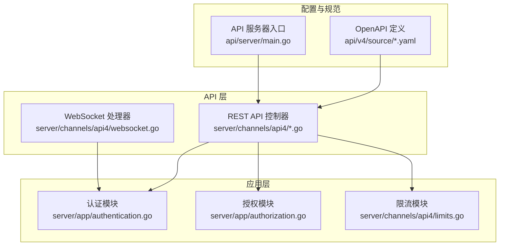
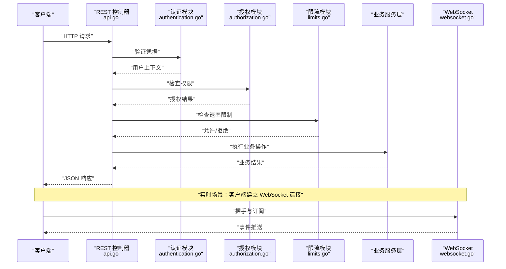
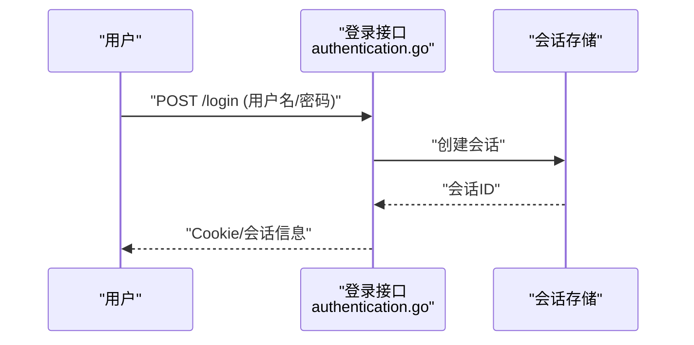
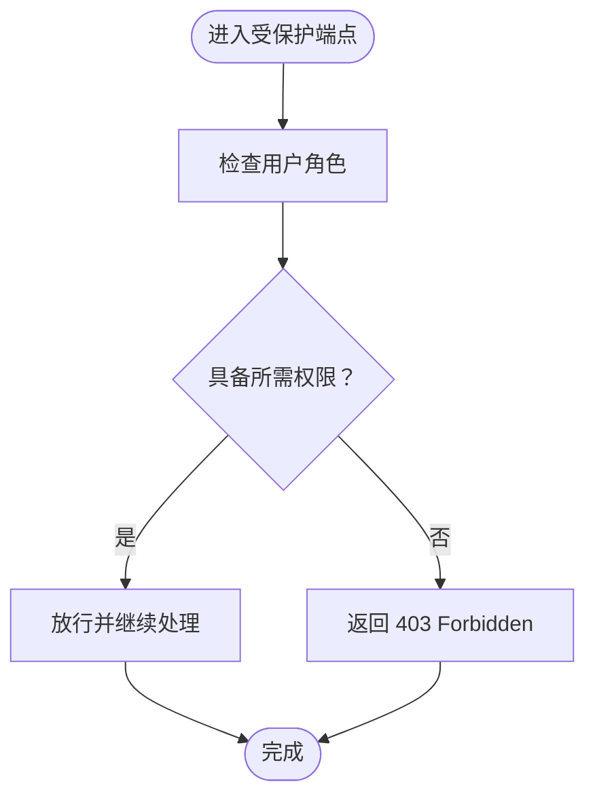
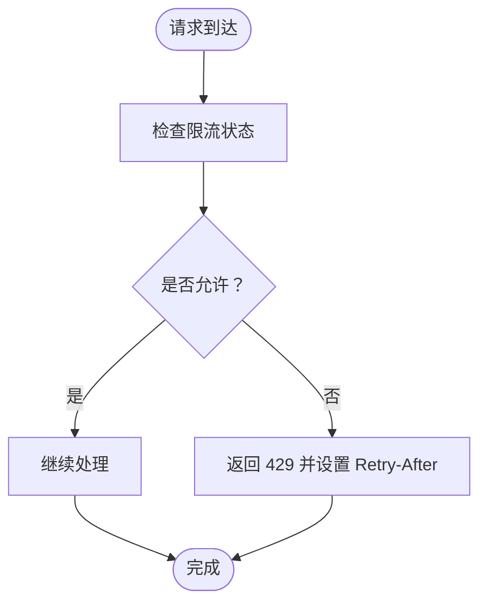
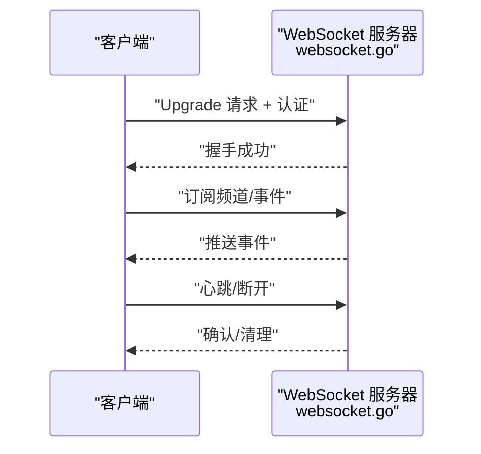
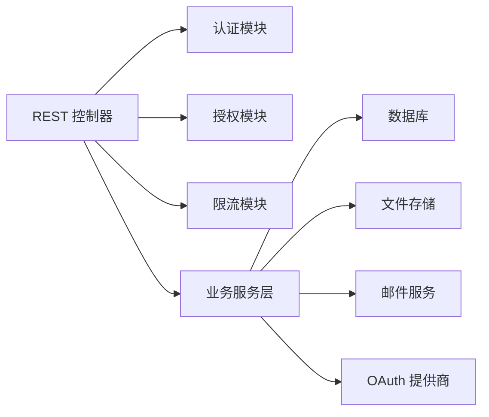

# API 接口文档

<cite>
**本文档引用的文件**
- [api.go](file://server/channels/api4/api.go)
- [access_control.go](file://server/channels/api4/access_control.go)
- [handlers.go](file://server/channels/api4/handlers.go)
- [websocket.go](file://server/channels/api4/websocket.go)
- [user.go](file://server/channels/api4/user.go)
- [team.go](file://server/channels/api4/team.go)
- [channel.go](file://server/channels/api4/channel.go)
- [post.go](file://server/channels/api4/post.go)
- [file.go](file://server/channels/api4/file.go)
- [webhook.go](file://server/channels/api4/webhook.go)
- [oauth.go](file://server/channels/api4/oauth.go)
- [authentication.go](file://server/app/authentication.go)
- [authorization.go](file://server/app/authorization.go)
- [limits.go](file://server/channels/api4/limits.go)
- [apitestlib.go](file://server/channels/api4/apitestlib.go)
- [main.go](file://api/server/main.go)
- [access_control.yaml](file://api/v4/source/access_control.yaml)
- [users.yaml](file://api/v4/source/users.yaml)
- [teams.yaml](file://api/v4/source/teams.yaml)
- [channels.yaml](file://api/v4/source/channels.yaml)
- [posts.yaml](file://api/v4/source/posts.yaml)
- [files.yaml](file://api/v4/source/files.yaml)
- [webhooks.yaml](file://api/v4/source/webhooks.yaml)
- [oauth.yaml](file://api/v4/source/oauth.yaml)
- [definitions.yaml](file://api/v4/source/definitions.yaml)
</cite>

## 目录
1. [简介](#简介)
2. [项目结构](#项目结构)
3. [核心组件](#核心组件)
4. [架构总览](#架构总览)
5. [详细组件分析](#详细组件分析)
6. [依赖关系分析](#依赖关系分析)
7. [性能考虑](#性能考虑)
8. [故障排除指南](#故障排除指南)
9. [结论](#结论)
10. [附录](#附录)

## 简介
本文件为 Mattermost API 接口的完整技术文档，覆盖 RESTful API 端点、认证与授权机制、错误处理策略、版本管理、WebSocket 实时通信、速率限制与安全实践，并提供多语言调用示例与测试调试指南。内容基于仓库中的 OpenAPI 定义文件与后端实现源码进行整理与归纳。

## 项目结构
Mattermost 后端通过 Go 语言实现 REST API 与 WebSocket 服务，OpenAPI 规范由 api/v4/source 下的 YAML 文件定义，后端控制器位于 server/channels/api4 目录中，应用层逻辑在 server/app 中实现。

**图表来源**
- [api.go](file://server/channels/api4/api.go)
- [websocket.go](file://server/channels/api4/websocket.go)
- [authentication.go](file://server/app/authentication.go)
- [authorization.go](file://server/app/authorization.go)
- [limits.go](file://server/channels/api4/limits.go)
- [main.go](file://api/server/main.go)
- [access_control.yaml](file://api/v4/source/access_control.yaml)

**章节来源**
- [api.go:1-200](file://server/channels/api4/api.go#L1-L200)
- [main.go:1-100](file://api/server/main.go#L1-L100)

## 核心组件
- REST API 控制器：统一处理 HTTP 请求，路由到具体业务处理器，执行鉴权与限流，返回 JSON 响应。
- 应用服务：封装用户、团队、频道、帖子、文件、Webhook 等资源的业务逻辑。
- 认证与授权：支持 Cookie 会话与 Token（Bearer）两种认证方式；基于角色与权限模型进行访问控制。
- 速率限制：按用户、IP、端点维度实施限流策略。
- WebSocket：实时事件推送与交互，支持订阅频道、用户状态等事件。
- OpenAPI 规范：以 YAML 定义端点、参数、响应模型与错误码，确保前后端契约一致。

**章节来源**
- [handlers.go:1-150](file://server/channels/api4/handlers.go#L1-L150)
- [access_control.go:1-200](file://server/channels/api4/access_control.go#L1-L200)
- [limits.go:1-120](file://server/channels/api4/limits.go#L1-L120)

## 架构总览
下图展示了从客户端到后端各组件的交互流程，包括认证、授权、限流与业务处理。

**图表来源**
- [api.go](file://server/channels/api4/api.go)
- [authentication.go](file://server/app/authentication.go)
- [authorization.go](file://server/app/authorization.go)
- [limits.go](file://server/channels/api4/limits.go)
- [websocket.go](file://server/channels/api4/websocket.go)

## 详细组件分析

### 认证与会话管理
- 支持的认证方式
  - Cookie 会话：登录后返回会话 Cookie，后续请求携带 Cookie 验证身份。
  - Bearer Token：通过 Authorization 头传递访问令牌，适用于第三方集成。
- 会话控制
  - 登录接口：接收用户名/邮箱与密码，返回会话信息或错误。
  - 登出接口：使当前会话失效。
  - 当前用户查询：返回已认证用户信息。
- 令牌管理
  - 令牌刷新与撤销：根据配置与策略实现。
  - 安全存储：令牌与会话信息在服务端安全存储与校验。

**图表来源**
- [authentication.go](file://server/app/authentication.go)
- [user.go](file://server/channels/api4/user.go)

**章节来源**
- [authentication.go:1-200](file://server/app/authentication.go#L1-L200)
- [user.go:1-200](file://server/channels/api4/user.go#L1-L200)

### 权限验证与访问控制
- 基于角色与权限模型的细粒度控制。
- 资源级权限检查：如频道读写、团队管理、系统设置等。
- 访问控制规则：通过 YAML 定义的权限映射与合并策略实现。

**图表来源**
- [access_control.go](file://server/channels/api4/access_control.go)
- [access_control.yaml](file://api/v4/source/access_control.yaml)

**章节来源**
- [access_control.go:1-200](file://server/channels/api4/access_control.go#L1-L200)
- [access_control.yaml:1-150](file://api/v4/source/access_control.yaml#L1-L150)

### 速率限制
- 限流维度：用户 ID、IP 地址、端点路径。
- 策略类型：固定窗口/滑动窗口计数，突发额度与冷却时间。
- 行为表现：超过阈值返回 429 Too Many Requests，并在响应头中提供重试建议。

**图表来源**
- [limits.go](file://server/channels/api4/limits.go)

**章节来源**
- [limits.go:1-120](file://server/channels/api4/limits.go#L1-L120)

### 用户相关 API
- 端点概览
  - 获取用户列表、详情、更新资料、密码修改、头像上传等。
  - 用户搜索与分页查询。
- 请求/响应要点
  - 成功：返回用户对象或空对象。
  - 错误：常见 404（不存在）、400（参数错误）、403（权限不足）。
- 示例参考
  - 列表查询：GET /api/v4/users?page&per_page
  - 更新资料：PUT /api/v4/users/:id
  - 修改密码：PUT /api/v4/users/:id/password

**章节来源**
- [users.yaml:1-200](file://api/v4/source/users.yaml#L1-L200)
- [user.go:1-300](file://server/channels/api4/user.go#L1-L300)

### 团队相关 API
- 端点概览
  - 创建团队、加入/离开、成员管理、邀请链接生成。
  - 团队设置更新、统计信息查询。
- 请求/响应要点
  - 成功：返回团队对象或成员列表。
  - 错误：404（团队不存在）、409（冲突）、429（速率限制）。

**章节来源**
- [teams.yaml:1-200](file://api/v4/source/teams.yaml#L1-L200)
- [team.go:1-300](file://server/channels/api4/team.go#L1-L300)

### 频道相关 API
- 端点概览
  - 创建/删除、成员管理、消息历史、置顶消息、频道元数据。
  - 公开/私有频道切换、搜索与过滤。
- 请求/响应要点
  - 成功：返回频道对象或消息数组。
  - 错误：403（无权限）、404（频道不存在）。

**章节来源**
- [channels.yaml:1-200](file://api/v4/source/channels.yaml#L1-L200)
- [channel.go:1-400](file://server/channels/api4/channel.go#L1-L400)

### 帖子与文件 API
- 帖子
  - 发布、编辑、删除、回复、表情贴图、搜索。
  - 分页与排序查询。
- 文件
  - 上传、预览、下载、删除、缩略图生成。
- 错误处理
  - 400（无效输入）、403（无权限）、404（资源不存在）、413（文件过大）。

**章节来源**
- [posts.yaml:1-200](file://api/v4/source/posts.yaml#L1-L200)
- [files.yaml:1-200](file://api/v4/source/files.yaml#L1-L200)
- [post.go:1-400](file://server/channels/api4/post.go#L1-L400)
- [file.go:1-300](file://server/channels/api4/file.go#L1-L300)

### Webhook API
- 端点概览
  - 创建、更新、删除、触发、历史查询。
- 使用场景
  - 第三方系统集成、自动化工作流触发。
- 错误处理
  - 400（参数错误）、404（不存在）、409（冲突）。

**章节来源**
- [webhooks.yaml:1-200](file://api/v4/source/webhooks.yaml#L1-L200)
- [webhook.go:1-300](file://server/channels/api4/webhook.go#L1-L300)

### OAuth 与外部认证
- 端点概览
  - OAuth 授权、回调处理、令牌交换、用户信息获取。
- 安全考虑
  - 回调 URL 白名单、CSRF 防护、敏感信息加密存储。

**章节来源**
- [oauth.yaml:1-200](file://api/v4/source/oauth.yaml#L1-L200)
- [oauth.go:1-200](file://server/channels/api4/oauth.go#L1-L200)

### WebSocket 实时通信
- 连接建立
  - 客户端通过升级协议建立连接，携带认证信息。
- 事件订阅
  - 频道消息、在线状态、用户加入/离开、系统通知等。
- 消息格式
  - 文本帧或二进制帧，包含事件类型、数据体与时间戳。
- 断线重连
  - 心跳检测、序列号跟踪、断点续传。

**图表来源**
- [websocket.go](file://server/channels/api4/websocket.go)

**章节来源**
- [websocket.go:1-200](file://server/channels/api4/websocket.go#L1-L200)

## 依赖关系分析
- 组件耦合
  - REST 控制器依赖认证、授权与限流模块；业务处理依赖应用服务层。
- 外部依赖
  - 数据库访问、文件存储、邮件服务、第三方 OAuth 提供商。
- 接口契约
  - OpenAPI YAML 定义与后端实现保持同步，避免不一致导致的集成问题。

**图表来源**
- [api.go](file://server/channels/api4/api.go)
- [authentication.go](file://server/app/authentication.go)
- [authorization.go](file://server/app/authorization.go)
- [limits.go](file://server/channels/api4/limits.go)

**章节来源**
- [api.go:1-200](file://server/channels/api4/api.go#L1-L200)

## 性能考虑
- 缓存策略
  - 常用查询结果缓存、图片缩略图缓存、用户头像缓存。
- 异步处理
  - 大文件上传采用分片与后台转码，降低阻塞。
- 网络优化
  - 压缩传输（Gzip/Brotli）、CDN 加速静态资源。
- 数据库优化
  - 合理索引、批量操作、读写分离（企业版）。

## 故障排除指南
- 常见错误码
  - 400：请求参数错误或格式不正确。
  - 401：未认证或会话过期。
  - 403：权限不足。
  - 404：资源不存在。
  - 409：请求与当前状态冲突。
  - 413：请求实体过大。
  - 429：超出速率限制。
  - 500：服务器内部错误。
- 调试技巧
  - 开启详细日志，定位请求链路与错误堆栈。
  - 使用测试工具验证端点行为，结合断言与边界条件。
  - 对比 OpenAPI 定义与实际响应，确保一致性。

**章节来源**
- [apitestlib.go:1-200](file://server/channels/api4/apitestlib.go#L1-L200)

## 结论
Mattermost 提供了完善的 REST API 与 WebSocket 实时能力，配合严格的认证授权与限流策略，满足企业级协作场景的需求。通过 OpenAPI 规范与测试工具保障了接口的稳定性与可维护性。建议在生产环境中启用 HTTPS、最小权限原则与监控告警，持续优化性能与安全性。

## 附录

### API 版本管理与迁移
- 版本策略
  - 采用语义化版本控制，v4 为主要稳定版本。
  - 废弃端点提前公告，提供迁移指引与替代方案。
- 向后兼容
  - 新增字段默认可选，不破坏现有客户端。
  - 删除字段先标记废弃再移除，保留过渡期。
- 迁移指南
  - 变更日志：记录破坏性变更与替代方案。
  - 自动化测试：确保客户端适配新版本。

**章节来源**
- [definitions.yaml:1-150](file://api/v4/source/definitions.yaml#L1-L150)

### 多语言调用示例（路径指引）
- Python
  - 使用 requests 库发送 HTTP 请求，设置 Authorization 头或 Cookie。
  - 参考路径：[user.go](file://server/channels/api4/user.go)
- JavaScript (Node.js)
  - 使用 fetch 或 axios，处理重定向与错误响应。
  - 参考路径：[post.go](file://server/channels/api4/post.go)
- Java
  - 使用 OkHttp 或 Apache HttpClient，配置超时与重试。
  - 参考路径：[team.go](file://server/channels/api4/team.go)
- Go
  - 使用 net/http，遵循速率限制与错误处理约定。
  - 参考路径：[api.go](file://server/channels/api4/api.go)

### API 测试与调试
- 单元测试
  - 使用 apitestlib 提供的辅助函数构造测试场景。
  - 参考路径：[apitestlib.go](file://server/channels/api4/apitestlib.go)
- 集成测试
  - 基于 Cypress/Playwright 的端到端测试，覆盖关键工作流。
- 监控与日志
  - 关键指标：请求量、错误率、响应时间、并发连接数。
  - 日志级别：INFO/DEBUG/WARN/ERROR，区分业务日志与审计日志。