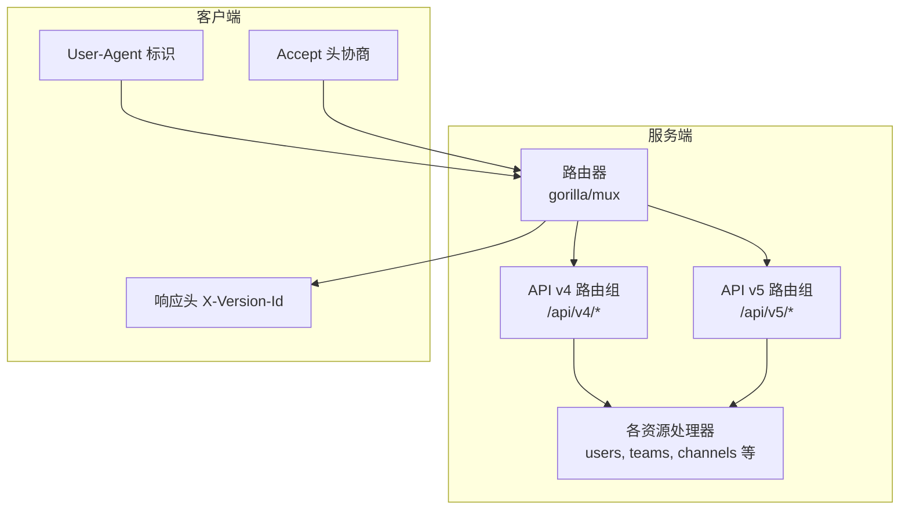
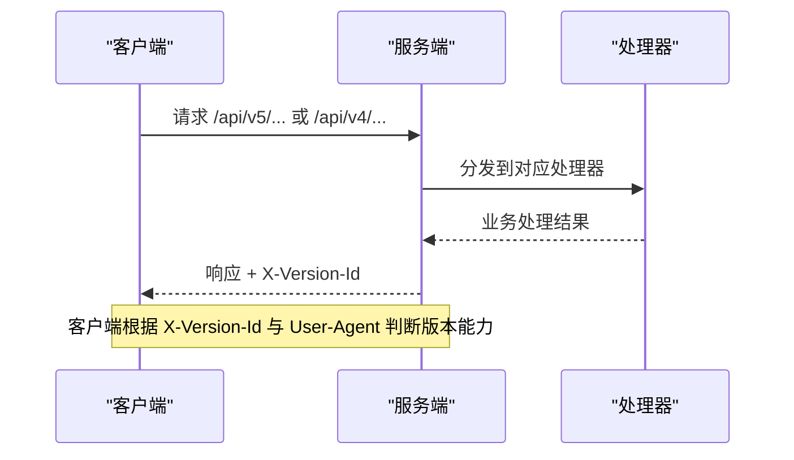
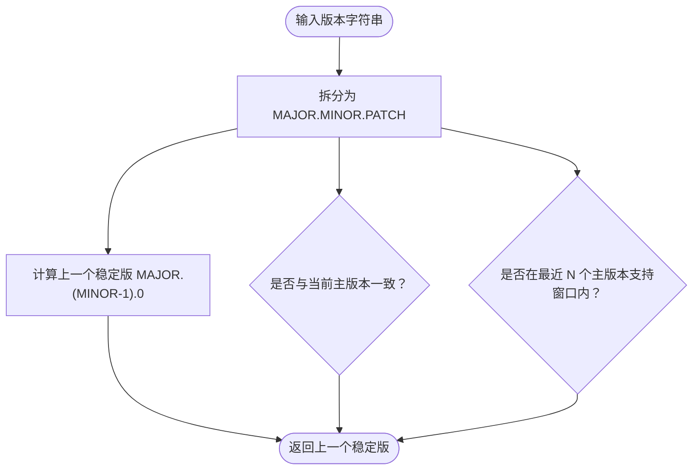
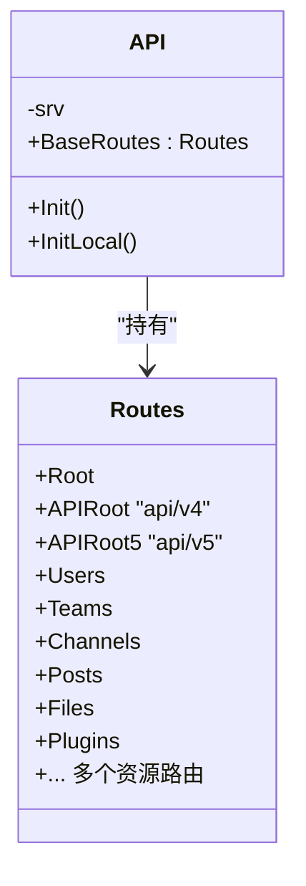
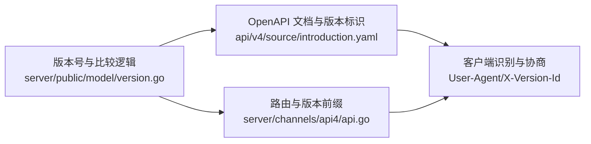

# API 版本管理

<cite>
**本文引用的文件**
- [version.go](file://server/public/model/version.go)
- [version_test.go](file://server/public/model/version_test.go)
- [api.go](file://server/channels/api4/api.go)
- [introduction.yaml](file://api/v4/source/introduction.yaml)
- [definitions.yaml](file://api/v4/source/definitions.yaml)
- [client_test.go](file://server/public/shared/httpservice/client_test.go)
- [server_version.test.tsx](file://webapp/channels/src/utils/server_version.test.tsx)
- [check_api.go](file://server/public/plugin/checker/check_api.go)
- [version_test.go（插件检查器）](file://server/public/plugin/checker/internal/version/version_test.go)
</cite>

## 目录
1. [引言](#引言)
2. [项目结构](#项目结构)
3. [核心组件](#核心组件)
4. [架构总览](#架构总览)
5. [详细组件分析](#详细组件分析)
6. [依赖关系分析](#依赖关系分析)
7. [性能考量](#性能考量)
8. [故障排查指南](#故障排查指南)
9. [结论](#结论)
10. [附录](#附录)

## 引言
本文件系统化阐述 Mattermost 的 API 版本管理策略与实现，覆盖以下主题：
- 版本控制策略与语义化版本号使用
- API 演进历史与变更追踪
- 版本迁移指南与最佳实践
- 向后兼容性保证范围与例外
- 弃用政策与过渡期支持
- 版本检测与协商机制（Accept 头与 User-Agent）
- 版本特定配置与行为差异
- 多版本并存期间的兼容性测试与验证
- 升级风险评估与建议

## 项目结构
Mattermost 在服务端通过路由层同时暴露多个 API 版本前缀，前端与客户端通过响应头或请求头进行版本识别与协商。

图示来源
- [api.go:188-415](file://server/channels/api4/api.go#L188-L415)

章节来源
- [api.go:18-415](file://server/channels/api4/api.go#L18-L415)

## 核心组件
- 版本常量与比较逻辑：维护当前与历史版本列表，提供版本拆分、前一稳定版查询、是否当前主版本、是否在支持窗口内等能力。
- 路由与版本前缀：在同一服务中注册 /api/v4 与 /api/v5 等多版本前缀，便于并行演进与迁移。
- 文档与模型：OpenAPI 文档定义了版本标识字段与响应头，模型定义了版本号格式与比较规则。
- 客户端识别：服务端在登录响应中返回 X-Version-Id，前端可据此判断服务器版本；User-Agent 可用于客户端自识别。

章节来源
- [version.go:15-245](file://server/public/model/version.go#L15-L245)
- [api.go:18-415](file://server/channels/api4/api.go#L18-L415)
- [introduction.yaml:101](file://api/v4/source/introduction.yaml#L101)
- [client_test.go:178-194](file://server/public/shared/httpservice/client_test.go#L178-L194)

## 架构总览
Mattermost 的 API 版本管理采用“多版本并存 + 渐进迁移”的策略：
- 服务端同时提供 v4 与 v5 路由，新功能优先在 v5 中引入，v4 保持长期兼容。
- 客户端通过 Accept 头与 User-Agent 进行版本协商与识别，服务端在响应中携带 X-Version-Id。
- 版本号遵循语义化版本（MAJOR.MINOR.PATCH），并支持预发布与构建元数据的比较。

图示来源
- [api.go:188-415](file://server/channels/api4/api.go#L188-L415)
- [introduction.yaml:101](file://api/v4/source/introduction.yaml#L101)

## 详细组件分析

### 版本号与比较逻辑
- 维护版本列表（含补丁版本），按时间倒序排列，首项为当前最新版本。
- 提供版本拆分函数，解析 MAJOR.MINOR.PATCH。
- 提供获取“上一个稳定版”的能力，用于迁移路径规划。
- 提供“是否当前主版本”与“是否在支持窗口内（最近 N 个主版本）”的判断，用于兼容性策略。

图示来源
- [version.go:175-245](file://server/public/model/version.go#L175-L245)

章节来源
- [version.go:15-245](file://server/public/model/version.go#L15-L245)
- [version_test.go:43-64](file://server/public/model/version_test.go#L43-L64)

### 路由与版本前缀
- 服务端在初始化时注册多个版本前缀（如 /api/v4 与 /api/v5），并为每个资源模块建立子路由。
- 该设计允许新功能在 v5 中先行，v4 保持稳定，逐步引导客户端迁移。

图示来源
- [api.go:18-415](file://server/channels/api4/api.go#L18-L415)

章节来源
- [api.go:18-415](file://server/channels/api4/api.go#L18-L415)

### 文档与模型中的版本标识
- OpenAPI 文档明确指出 API 访问路径为 /api/v4，并在示例响应头中展示 X-Version-Id 字段，用于标识服务器版本。
- 客户端工具链可通过该字段进行版本判断与能力探测。

章节来源
- [introduction.yaml:52](file://api/v4/source/introduction.yaml#L52)
- [introduction.yaml:101](file://api/v4/source/introduction.yaml#L101)

### 客户端识别与版本协商
- 服务端在登录响应中设置 X-Version-Id，前端可据此判断服务器版本，决定是否启用新特性或降级兼容。
- 测试用例验证了 User-Agent 的设置，表明客户端可自定义 UA 以辅助识别与统计。

章节来源
- [introduction.yaml:101](file://api/v4/source/introduction.yaml#L101)
- [client_test.go:178-194](file://server/public/shared/httpservice/client_test.go#L178-L194)

### 插件 API 最低版本注释校验
- 工具链对插件 API 接口的最小服务器版本注释进行校验，确保插件接口声明与服务端版本策略一致，避免过早调用不支持的功能。

章节来源
- [check_api.go:15-50](file://server/public/plugin/checker/check_api.go#L15-L50)
- [version_test.go（插件检查器）:13-58](file://server/public/plugin/checker/internal/version/version_test.go#L13-L58)

## 依赖关系分析
- 服务端版本号与比较逻辑被多处模块复用，包括版本判断、迁移策略、兼容性检查等。
- 路由层依赖版本号常量以确定版本前缀与支持范围。
- 文档与客户端工具链依赖响应头中的版本标识进行能力探测。

图示来源
- [version.go:15-245](file://server/public/model/version.go#L15-L245)
- [api.go:188-415](file://server/channels/api4/api.go#L188-L415)
- [introduction.yaml:101](file://api/v4/source/introduction.yaml#L101)

章节来源
- [version.go:15-245](file://server/public/model/version.go#L15-L245)
- [api.go:188-415](file://server/channels/api4/api.go#L188-L415)
- [introduction.yaml:101](file://api/v4/source/introduction.yaml#L101)

## 性能考量
- 多版本并存会增加路由与处理分支数量，需关注路由匹配与中间件开销。
- 版本切换期间建议采用渐进式迁移策略，避免一次性全量切换导致的峰值压力。
- 对于高并发场景，建议在网关层或边缘层进行版本分流与缓存，减少后端重复匹配成本。

## 故障排查指南
- 版本不匹配问题
  - 现象：客户端调用新接口返回 404 或功能异常。
  - 排查：确认请求是否命中目标版本前缀；检查 X-Version-Id 是否符合预期；核对客户端 UA 与 Accept 头。
- 兼容性回归
  - 现象：v4 接口行为发生变化。
  - 排查：确认是否误用 v5 新字段；核对版本支持窗口；必要时回退至上一个稳定版。
- 插件兼容性
  - 现象：插件调用失败或报错。
  - 排查：检查插件 API 注释中的最低版本要求；确保服务端版本满足要求。

章节来源
- [check_api.go:15-50](file://server/public/plugin/checker/check_api.go#L15-L50)
- [version_test.go:43-64](file://server/public/model/version_test.go#L43-L64)

## 结论
Mattermost 通过“多版本并存 + 渐进迁移”的策略，在保障 v4 长期兼容的同时，为 v5 的新功能提供试验与演进空间。结合版本号比较、路由前缀、响应头版本标识与客户端识别机制，形成了完整的版本管理闭环。建议在实际工程中严格遵循语义化版本与弃用政策，配合自动化校验与测试，确保平滑迁移与稳定运行。

## 附录

### 版本控制策略与语义化版本
- 语义化版本号格式：MAJOR.MINOR.PATCH（可带预发布与构建元数据）。
- 版本比较：按主版本、次版本、补丁版本逐级比较；预发布版本优先级低于正式版本。
- 支持窗口：当前主版本与其前 N 个主版本视为支持范围，超出范围的版本不再保证兼容。

章节来源
- [version.go:175-245](file://server/public/model/version.go#L175-L245)
- [version_test.go:43-64](file://server/public/model/version_test.go#L43-L64)

### API 演进历史与变更追踪
- 当前版本列表与历史版本顺序见版本常量定义。
- 迁移路径：优先使用上一个稳定版作为回退目标；若需使用 v5 新特性，需确保服务端版本满足要求。

章节来源
- [version.go:15-150](file://server/public/model/version.go#L15-L150)
- [version.go:197-208](file://server/public/model/version.go#L197-L208)

### 版本迁移指南
- 迁移步骤
  - 使用 GetPreviousVersion 获取上一个稳定版，作为回退目标。
  - 在网关或客户端侧设置 Accept 与 User-Agent，确保服务端正确识别版本。
  - 逐步替换 v4 调用为 v5 调用，监控 X-Version-Id 与错误日志。
- 回滚策略
  - 若发现兼容性问题，立即回退至上一个稳定版。
  - 通过版本支持窗口判断是否仍受支持。

章节来源
- [version.go:197-208](file://server/public/model/version.go#L197-L208)
- [introduction.yaml:101](file://api/v4/source/introduction.yaml#L101)

### 向后兼容性保证与例外
- 保证范围
  - v4 主要接口与核心行为保持长期稳定。
  - 支持窗口内的主版本间兼容性由版本比较与迁移策略保障。
- 例外情况
  - v5 新增接口与字段可能不适用于 v4。
  - 预发布版本与构建元数据不影响正式版本比较。

章节来源
- [version.go:220-245](file://server/public/model/version.go#L220-L245)
- [version_test.go:43-64](file://server/public/model/version_test.go#L43-L64)

### 弃用政策与过渡期支持
- 弃用流程
  - 在文档中标注弃用版本与替代方案。
  - 提供迁移指引与上一个稳定版回退路径。
- 过渡期支持
  - 过渡期内维持兼容，直至指定停用日期。
  - 建议客户端在 X-Version-Id 与 UA 中识别并提示用户升级。

章节来源
- [introduction.yaml:101](file://api/v4/source/introduction.yaml#L101)
- [check_api.go:15-50](file://server/public/plugin/checker/check_api.go#L15-L50)

### 版本检测与协商
- Accept 头：客户端可在请求中声明期望的版本前缀（如 /api/v5）。
- User-Agent：客户端可自定义 UA，便于服务端识别与统计。
- X-Version-Id：服务端在响应头中返回当前服务器版本标识，客户端据此判断能力。

章节来源
- [introduction.yaml:101](file://api/v4/source/introduction.yaml#L101)
- [client_test.go:178-194](file://server/public/shared/httpservice/client_test.go#L178-L194)

### 版本特定配置与行为差异
- 不同主版本可能引入新的配置项与行为差异，需在迁移前完成配置比对与验证。
- 建议在测试环境先行验证，再在生产环境灰度发布。

章节来源
- [definitions.yaml:67-800](file://api/v4/source/definitions.yaml#L67-L800)

### 多版本并存期间的兼容性测试与验证
- 自动化校验
  - 使用插件检查器校验 API 注释中的最低版本要求。
  - 使用版本比较函数验证迁移路径与支持窗口。
- 端到端测试
  - 在 v4 与 v5 并行环境下执行回归测试，确保关键路径稳定。
  - 通过 X-Version-Id 与 UA 标识进行灰度验证。

章节来源
- [check_api.go:15-50](file://server/public/plugin/checker/check_api.go#L15-L50)
- [version_test.go（插件检查器）:13-58](file://server/public/plugin/checker/internal/version/version_test.go#L13-L58)
- [version_test.go:43-64](file://server/public/model/version_test.go#L43-L64)

### 升级最佳实践与风险评估
- 最佳实践
  - 制定分阶段迁移计划，先在非核心模块试点。
  - 在网关层统一进行版本分流与限流保护。
  - 建立版本回滚预案与应急响应机制。
- 风险评估
  - 功能回归：通过自动化测试与冒烟测试降低风险。
  - 性能波动：监控路由匹配与处理延迟，必要时优化中间件。
  - 用户体验：通过 X-Version-Id 与 UA 识别用户端能力，动态降级或提示升级。

章节来源
- [api.go:188-415](file://server/channels/api4/api.go#L188-L415)
- [introduction.yaml:101](file://api/v4/source/introduction.yaml#L101)