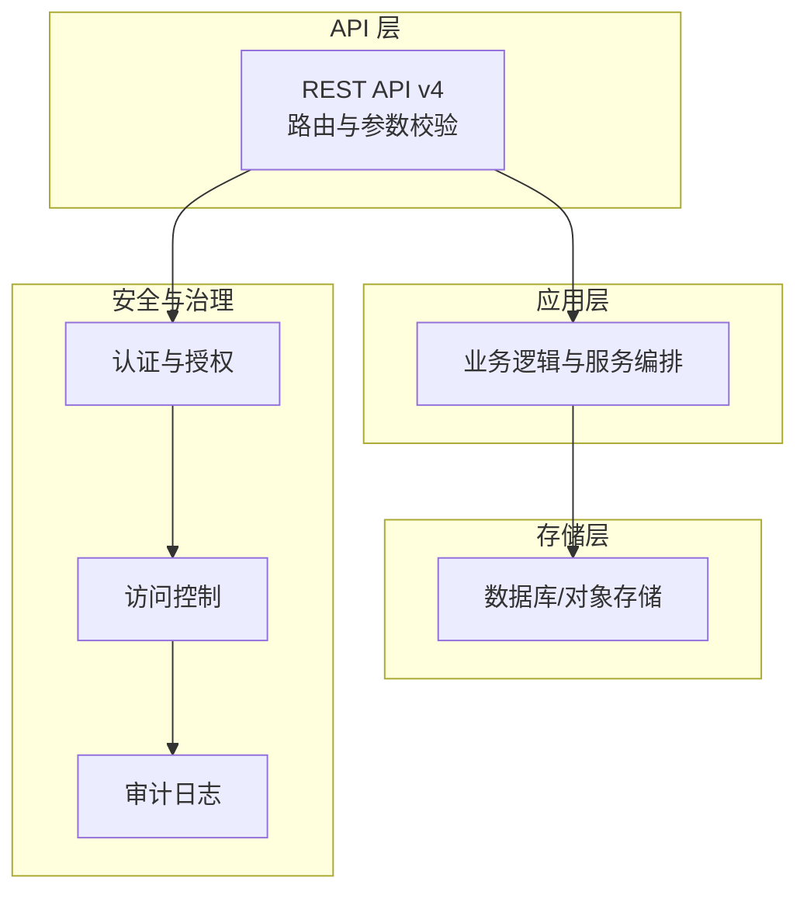
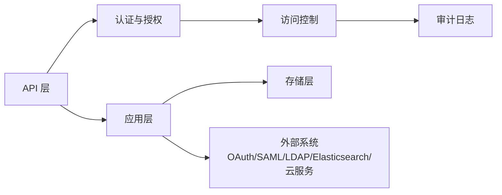

# REST API 接口

<cite>
**本文引用的文件**
- [introduction.yaml](file://api/v4/source/introduction.yaml)
- [users.yaml](file://api/v4/source/users.yaml)
- [teams.yaml](file://api/v4/source/teams.yaml)
- [channels.yaml](file://api/v4/source/channels.yaml)
- [posts.yaml](file://api/v4/source/posts.yaml)
- [files.yaml](file://api/v4/source/files.yaml)
- [uploads.yaml](file://api/v4/source/uploads.yaml)
- [webhooks.yaml](file://api/v4/source/webhooks.yaml)
- [preferences.yaml](file://api/v4/source/preferences.yaml)
- [roles.yaml](file://api/v4/source/roles.yaml)
- [permissions.yaml](file://api/v4/source/permissions.yaml)
- [oauth.yaml](file://api/v4/source/oauth.yaml)
- [ldap.yaml](file://api/v4/source/ldap.yaml)
- [saml.yaml](file://api/v4/source/saml.yaml)
- [jobs.yaml](file://api/v4/source/jobs.yaml)
- [logs.yaml](file://api/v4/source/logs.yaml)
- [metrics.yaml](file://api/v4/source/metrics.yaml)
- [system.yaml](file://api/v4/source/system.yaml)
- [brand.yaml](file://api/v4/source/brand.yaml)
- [emoji.yaml](file://api/v4/source/emoji.yaml)
- [boards.yaml](file://api/v4/source/boards.yaml)
- [recaps.yaml](file://api/v4/source/recaps.yaml)
- [reports.yaml](file://api/v4/source/reports.yaml)
- [usage.yaml](file://api/v4/source/usage.yaml)
- [dataretention.yaml](file://api/v4/source/dataretention.yaml)
- [compliance.yaml](file://api/v4/source/compliance.yaml)
- [exports.yaml](file://api/v4/source/exports.yaml)
- [imports.yaml](file://api/v4/source/imports.yaml)
- [cloud.yaml](file://api/v4/source/cloud.yaml)
- [remoteclusters.yaml](file://api/v4/source/remoteclusters.yaml)
- [sharedchannels.yaml](file://api/v4/source/sharedchannels.yaml)
- [outgoing_oauth_connections.yaml](file://api/v4/source/outgoing_oauth_connections.yaml)
- [access_control.yaml](file://api/v4/source/access_control.yaml)
- [audit_logging.yaml](file://api/v4/source/audit_logging.yaml)
- [ip_filters.yaml](file://api/v4/source/ip_filters.yaml)
- [limits.yaml](file://api/v4/source/limits.yaml)
- [cluster.yaml](file://api/v4/source/cluster.yaml)
- [service_terms.yaml](file://api/v4/source/service_terms.yaml)
- [content_flagging.yaml](file://api/v4/source/content_flagging.yaml)
- [custom_profile_attributes.yaml](file://api/v4/source/custom_profile_attributes.yaml)
- [properties.yaml](file://api/v4/source/properties.yaml)
- [reactions.yaml](file://api/v4/source/reactions.yaml)
- [scheduled_post.yaml](file://api/v4/source/scheduled_post.yaml)
- [schemes.yaml](file://api/v4/source/schemes.yaml)
- [status.yaml](file://api/v4/source/status.yaml)
- [views.yaml](file://api/v4/source/views.yaml)
- [agents.yaml](file://api/v4/source/agents.yaml)
- [bots.yaml](file://api/v4/source/bots.yaml)
- [plugins.yaml](file://api/v4/source/plugins.yaml)
- [elasticsearch.yaml](file://api/v4/source/elasticsearch.yaml)
- [actions.yaml](file://api/v4/source/actions.yaml)
- [bookmarks.yaml](file://api/v4/source/bookmarks.yaml)
- [commands.yaml](file://api/v4/source/commands.yaml)
- [groups.yaml](file://api/v4/source/groups.yaml)
- [interface.md](file://docs/接口梳理.md)
</cite>

## 目录
1. [简介](#简介)
2. [项目结构](#项目结构)
3. [核心组件](#核心组件)
4. [架构总览](#架构总览)
5. [详细组件分析](#详细组件分析)
6. [依赖关系分析](#依赖关系分析)
7. [性能考量](#性能考量)
8. [故障排查指南](#故障排查指南)
9. [结论](#结论)
10. [附录](#附录)

## 简介
本文件面向 Mattermost 的 REST API v4，系统性梳理并说明各端点的 HTTP 方法、URL 模式、请求参数（路径参数、查询参数、请求体参数）、响应格式、状态码语义、请求头要求、分页与排序机制、错误响应结构以及最佳实践。内容基于仓库中的 OpenAPI/YAML 定义文件与接口文档整理而成，确保与实际实现一致。

- 基础路径：`{your-mattermost-url}/api/v4`
- 默认媒体类型：`application/json`
- 用户 ID 支持使用 `me` 表示当前登录用户

**章节来源**
- [introduction.yaml:352-381](file://api/v4/source/introduction.yaml#L352-L381)
- [interface.md:3-6](file://docs/接口梳理.md#L3-L6)

## 项目结构
Mattermost 的 API 定义主要位于 `api/v4/source/` 目录下，按功能域拆分为多个 YAML 文件，例如用户、团队、频道、消息、文件、Webhook、OAuth、LDAP、SAML、作业、日志、指标、系统、品牌、表情包、看板、报告、使用统计、数据保留、合规导出导入、云服务、远程集群、共享频道、外部 OAuth 连接、访问控制、审计日志、IP 过滤、限流、集群、服务条款、内容标记、自定义资料属性、属性、反应、定时消息、方案、状态、视图、智能体、机器人、插件、Elasticsearch、动作、书签、命令、群组等。

**图表来源**
- [users.yaml](file://api/v4/source/users.yaml)
- [teams.yaml](file://api/v4/source/teams.yaml)
- [channels.yaml](file://api/v4/source/channels.yaml)
- [posts.yaml](file://api/v4/source/posts.yaml)
- [files.yaml](file://api/v4/source/files.yaml)
- [uploads.yaml](file://api/v4/source/uploads.yaml)
- [webhooks.yaml](file://api/v4/source/webhooks.yaml)
- [preferences.yaml](file://api/v4/source/preferences.yaml)
- [roles.yaml](file://api/v4/source/roles.yaml)
- [permissions.yaml](file://api/v4/source/permissions.yaml)
- [oauth.yaml](file://api/v4/source/oauth.yaml)
- [ldap.yaml](file://api/v4/source/ldap.yaml)
- [saml.yaml](file://api/v4/source/saml.yaml)
- [jobs.yaml](file://api/v4/source/jobs.yaml)
- [logs.yaml](file://api/v4/source/logs.yaml)
- [metrics.yaml](file://api/v4/source/metrics.yaml)
- [system.yaml](file://api/v4/source/system.yaml)
- [brand.yaml](file://api/v4/source/brand.yaml)
- [emoji.yaml](file://api/v4/source/emoji.yaml)
- [boards.yaml](file://api/v4/source/boards.yaml)
- [recaps.yaml](file://api/v4/source/recaps.yaml)
- [reports.yaml](file://api/v4/source/reports.yaml)
- [usage.yaml](file://api/v4/source/usage.yaml)
- [dataretention.yaml](file://api/v4/source/dataretention.yaml)
- [compliance.yaml](file://api/v4/source/compliance.yaml)
- [exports.yaml](file://api/v4/source/exports.yaml)
- [imports.yaml](file://api/v4/source/imports.yaml)
- [cloud.yaml](file://api/v4/source/cloud.yaml)
- [remoteclusters.yaml](file://api/v4/source/remoteclusters.yaml)
- [sharedchannels.yaml](file://api/v4/source/sharedchannels.yaml)
- [outgoing_oauth_connections.yaml](file://api/v4/source/outgoing_oauth_connections.yaml)
- [access_control.yaml](file://api/v4/source/access_control.yaml)
- [audit_logging.yaml](file://api/v4/source/audit_logging.yaml)
- [ip_filters.yaml](file://api/v4/source/ip_filters.yaml)
- [limits.yaml](file://api/v4/source/limits.yaml)
- [cluster.yaml](file://api/v4/source/cluster.yaml)
- [service_terms.yaml](file://api/v4/source/service_terms.yaml)
- [content_flagging.yaml](file://api/v4/source/content_flagging.yaml)
- [custom_profile_attributes.yaml](file://api/v4/source/custom_profile_attributes.yaml)
- [properties.yaml](file://api/v4/source/properties.yaml)
- [reactions.yaml](file://api/v4/source/reactions.yaml)
- [scheduled_post.yaml](file://api/v4/source/scheduled_post.yaml)
- [schemes.yaml](file://api/v4/source/schemes.yaml)
- [status.yaml](file://api/v4/source/status.yaml)
- [views.yaml](file://api/v4/source/views.yaml)
- [agents.yaml](file://api/v4/source/agents.yaml)
- [bots.yaml](file://api/v4/source/bots.yaml)
- [plugins.yaml](file://api/v4/source/plugins.yaml)
- [elasticsearch.yaml](file://api/v4/source/elasticsearch.yaml)
- [actions.yaml](file://api/v4/source/actions.yaml)
- [bookmarks.yaml](file://api/v4/source/bookmarks.yaml)
- [commands.yaml](file://api/v4/source/commands.yaml)
- [groups.yaml](file://api/v4/source/groups.yaml)

**章节来源**
- [introduction.yaml:352-381](file://api/v4/source/introduction.yaml#L352-L381)
- [interface.md:3-6](file://docs/接口梳理.md#L3-L6)

## 核心组件
- 认证与授权
  - 会话令牌：登录后响应头返回 Token，后续请求通过 `Authorization: Bearer <token>` 或 Cookie `MMAUTHTOKEN=<token>` 携带。
  - 个人访问令牌：与会话令牌相同方式携带，不会过期，直到被撤销。
  - WebSocket 认证：连接 `/api/v4/websocket`，可使用标准 Cookie/Header 认证，或发送认证挑战消息。
- 错误处理
  - 统一 JSON 错误响应结构，包含字段：id、message、request_id、status_code、is_oauth。
  - 常见状态码含义：400（请求无效/缺失）、401（未授权）、403（禁止访问）、404（资源不存在）、409（冲突）、413（内容过大）、429（超出速率限制）、500（服务器内部错误）、501（未实现）、502（网关错误）。
- 分页与排序
  - 多数列表接口支持 `page`、`per_page` 查询参数进行分页；部分接口支持 `sort` 参数进行排序。
- 请求头要求
  - Content-Type: application/json
  - Accept: application/json
  - 认证：Bearer Token 或 Cookie（取决于认证方式）

**章节来源**
- [interface.md:13-37](file://docs/接口梳理.md#L13-L37)
- [interface.md:40-67](file://docs/接口梳理.md#L40-L67)

## 架构总览
Mattermost 的 REST API 采用清晰的功能域划分，每个领域对应一个 YAML 定义文件，便于维护与扩展。API 层负责路由与参数校验，应用层负责业务逻辑，存储层负责数据持久化。认证与授权贯穿所有端点，访问控制与审计日志在相应模块中集中管理。

## 详细组件分析

### 用户管理（Users）
- 关键端点
  - 获取用户列表：GET /users
  - 创建用户：POST /users
  - 获取单个用户：GET /users/{id}
  - 更新用户：PUT /users/{id}
  - 删除用户：DELETE /users/{id}
  - 用户密码操作：POST /users/{id}/password
  - 用户头像：POST /users/{id}/image
  - 用户激活/停用：POST /users/{id}/active
  - 用户权限：GET /users/{id}/roles
  - 用户权限更新：PUT /users/{id}/roles
  - 用户偏好设置：GET /users/{id}/preferences
  - 用户偏好设置更新：PUT /users/{id}/preferences
  - 用户登录：POST /users/login
  - 用户登出：POST /users/logout
  - 当前用户：GET /users/me
  - 用户搜索：GET /users/search
  - 用户加入/离开团队：POST /users/{id}/teams/{teamId}/members
  - 用户加入/离开频道：POST /users/{id}/channels/{channelId}/members
  - 用户角色变更：PUT /users/{id}/roles
- 请求参数与响应
  - 路径参数：id、teamId、channelId
  - 查询参数：page、per_page、sort、include_deleted、term、options 等
  - 请求体参数：根据具体端点定义（如用户注册、更新、登录凭据等）
  - 响应格式：JSON；错误响应遵循统一结构
- 示例
  - 成功响应：返回用户对象或空对象（删除、更新等）
  - 错误响应：400、401、403、404、409、429、500
- 最佳实践
  - 使用 `me` 表示当前用户
  - 对敏感操作（密码、角色、激活）进行二次确认
  - 控制批量操作的 per_page 数量，避免超时

**章节来源**
- [users.yaml](file://api/v4/source/users.yaml)

### 团队管理（Teams）
- 关键端点
  - 获取团队列表：GET /teams
  - 创建团队：POST /teams
  - 获取团队详情：GET /teams/{id}
  - 更新团队：PUT /teams/{id}
  - 删除团队：DELETE /teams/{id}
  - 团队成员管理：GET /teams/{id}/members、POST /teams/{id}/members、PUT /teams/{id}/members/{userId}
  - 团队用户列表：GET /teams/{id}/users
  - 团队频道列表：GET /teams/{id}/channels
  - 加入/离开团队：POST /teams/{id}/members/ids、POST /teams/{id}/members/username
  - 团队导入：POST /teams/import
  - 团队搜索：GET /teams/search
- 请求参数与响应
  - 路径参数：id、userId
  - 查询参数：page、per_page、group_constrained
  - 响应格式：JSON；错误响应遵循统一结构
- 示例
  - 成功响应：返回团队对象或成员数组
  - 错误响应：400、401、403、404、409、429、500
- 最佳实践
  - 使用 group_constrained 进行跨域团队限制
  - 导入时注意数据格式与权限校验

**章节来源**
- [teams.yaml](file://api/v4/source/teams.yaml)

### 频道管理（Channels）
- 关键端点
  - 获取频道列表：GET /channels
  - 创建频道：POST /channels
  - 获取频道详情：GET /channels/{id}
  - 更新频道：PUT /channels/{id}
  - 删除频道：DELETE /channels/{id}
  - 频道成员管理：GET /channels/{id}/members、POST /channels/{id}/members、PUT /channels/{id}/members/{userId}
  - 频道消息列表：GET /channels/{id}/posts
  - 频道搜索：GET /channels/search
  - 频道隐私设置：PUT /channels/{id}/privacy
  - 频道头像：POST /channels/{id}/image
  - 频道取消关注：POST /channels/{id}/members/{userId}/setstatus
- 请求参数与响应
  - 路径参数：id、userId
  - 查询参数：page、per_page、include_deleted、last_delete_at、since
  - 响应格式：JSON；错误响应遵循统一结构
- 示例
  - 成功响应：返回频道对象或成员数组
  - 错误响应：400、401、403、404、409、429、500
- 最佳实践
  - 使用 last_delete_at 进行增量同步
  - 注意频道隐私与权限控制

**章节来源**
- [channels.yaml](file://api/v4/source/channels.yaml)

### 消息系统（Posts）
- 关键端点
  - 获取消息列表：GET /posts
  - 创建消息：POST /posts
  - 获取消息详情：GET /posts/{id}
  - 更新消息：PUT /posts/{id}
  - 删除消息：DELETE /posts/{id}
  - 消息回复：POST /posts/{id}/reply
  - 消息附件：POST /posts/{id}/files
  - 消息反应：POST /posts/{id}/reactions
  - 消息标记已读：POST /posts/{id}/read
  - 消息搜索：GET /posts/search
- 请求参数与响应
  - 路径参数：id、replyId
  - 查询参数：page、per_page、include_deleted、since、from_post、limit、anchors
  - 响应格式：JSON；错误响应遵循统一结构
- 示例
  - 成功响应：返回消息对象或空对象
  - 错误响应：400、401、403、404、409、429、500
- 最佳实践
  - 使用 anchors 与 limit 实现高效分页
  - 对大文本消息进行压缩或分片处理

**章节来源**
- [posts.yaml](file://api/v4/source/posts.yaml)

### 文件上传（Files）
- 关键端点
  - 上传文件：POST /files
  - 获取文件信息：GET /files/{fileId}
  - 下载文件：GET /files/{fileId}/download
  - 删除文件：DELETE /files/{fileId}
  - 文件预览：GET /files/{fileId}/preview
  - 文件缩略图：GET /files/{fileId}/thumbnail
- 请求参数与响应
  - 路径参数：fileId
  - 查询参数：crop、width、height、page
  - 响应格式：JSON；错误响应遵循统一结构
- 示例
  - 成功响应：返回文件信息对象或空对象
  - 错误响应：400、401、403、404、413、429、500
- 最佳实践
  - 上传前进行大小与类型校验
  - 使用预览与缩略图减少带宽消耗

**章节来源**
- [files.yaml](file://api/v4/source/files.yaml)
- [uploads.yaml](file://api/v4/source/uploads.yaml)

### Webhook（Webhooks）
- 关键端点
  - 获取 Webhook 列表：GET /hooks/incoming
  - 创建 Webhook：POST /hooks/incoming
  - 更新 Webhook：PUT /hooks/incoming/{id}
  - 删除 Webhook：DELETE /hooks/incoming/{id}
  - 获取出站 Webhook 列表：GET /hooks/outgoing
  - 创建出站 Webhook：POST /hooks/outgoing
  - 更新出站 Webhook：PUT /hooks/outgoing/{id}
  - 删除出站 Webhook：DELETE /hooks/outgoing/{id}
  - 出站 Webhook 触发：POST /hooks/outgoing/{id}/trigger
- 请求参数与响应
  - 路径参数：id
  - 查询参数：channel_id、team_id、display_name、description、url、content_type
  - 响应格式：JSON；错误响应遵循统一结构
- 示例
  - 成功响应：返回 Webhook 对象或空对象
  - 错误响应：400、401、403、404、409、429、500
- 最佳实践
  - 出站 Webhook 设置回调 URL 与签名验证
  - 控制触发频率，避免滥用

**章节来源**
- [webhooks.yaml](file://api/v4/source/webhooks.yaml)

### 偏好设置（Preferences）
- 关键端点
  - 获取偏好设置：GET /users/{id}/preferences
  - 更新偏好设置：PUT /users/{id}/preferences
  - 删除偏好设置：DELETE /users/{id}/preferences
- 请求参数与响应
  - 路径参数：id
  - 查询参数：category、name
  - 响应格式：JSON；错误响应遵循统一结构
- 示例
  - 成功响应：返回偏好设置数组或空对象
  - 错误响应：400、401、403、404、429、500
- 最佳实践
  - 批量更新时使用原子操作减少并发问题

**章节来源**
- [preferences.yaml](file://api/v4/source/preferences.yaml)

### 角色与权限（Roles & Permissions）
- 关键端点
  - 获取角色列表：GET /roles
  - 获取角色详情：GET /roles/{id}
  - 更新角色：PUT /roles/{id}
  - 获取权限：GET /permissions
  - 更新权限：PUT /permissions
- 请求参数与响应
  - 路径参数：id
  - 查询参数：page、per_page
  - 响应格式：JSON；错误响应遵循统一结构
- 示例
  - 成功响应：返回角色或权限对象
  - 错误响应：400、401、403、404、429、500
- 最佳实践
  - 权限最小化原则，避免授予不必要的权限

**章节来源**
- [roles.yaml](file://api/v4/source/roles.yaml)
- [permissions.yaml](file://api/v4/source/permissions.yaml)

### 认证与第三方集成（OAuth/LDAP/SAML）
- 关键端点
  - OAuth 登录：POST /oauth/{service}/login
  - OAuth 授权：GET /oauth/{service}/authorize
  - OAuth 回调：GET /oauth/{service}/complete
  - LDAP 登录：POST /users/login
  - SAML 登录：POST /saml/login
  - SAML 元数据：GET /saml/metadata
  - SAML 断言：POST /saml/assertion
- 请求参数与响应
  - 路径参数：service
  - 查询参数：redirect_to、client_id、response_type、scope
  - 响应格式：JSON；错误响应遵循统一结构
- 示例
  - 成功响应：返回认证结果或重定向地址
  - 错误响应：400、401、403、404、429、500
- 最佳实践
  - 使用 HTTPS 与安全的重定向策略
  - 对 SAML 元数据与断言进行严格校验

**章节来源**
- [oauth.yaml](file://api/v4/source/oauth.yaml)
- [ldap.yaml](file://api/v4/source/ldap.yaml)
- [saml.yaml](file://api/v4/source/saml.yaml)

### 作业与日志（Jobs/Logs/Metrics）
- 关键端点
  - 获取作业列表：GET /jobs
  - 获取作业详情：GET /jobs/{id}
  - 取消作业：POST /jobs/{id}/cancel
  - 获取日志：GET /logs
  - 获取指标：GET /metrics
- 请求参数与响应
  - 路径参数：id
  - 查询参数：page、per_page、type、status
  - 响应格式：JSON；错误响应遵循统一结构
- 示例
  - 成功响应：返回作业或日志对象
  - 错误响应：400、401、403、404、429、500
- 最佳实践
  - 监控作业状态与日志级别，及时告警

**章节来源**
- [jobs.yaml](file://api/v4/source/jobs.yaml)
- [logs.yaml](file://api/v4/source/logs.yaml)
- [metrics.yaml](file://api/v4/source/metrics.yaml)

### 系统与品牌（System/Brand）
- 关键端点
  - 获取系统配置：GET /system/config
  - 更新系统配置：PUT /system/config
  - 获取系统健康状态：GET /system/ping
  - 获取品牌图片：GET /brand/image
  - 上传品牌图片：POST /brand/image
- 请求参数与响应
  - 响应格式：JSON；错误响应遵循统一结构
- 示例
  - 成功响应：返回配置或空对象
  - 错误响应：400、401、403、404、429、500
- 最佳实践
  - 变更配置需重启或热重载生效

**章节来源**
- [system.yaml](file://api/v4/source/system.yaml)
- [brand.yaml](file://api/v4/source/brand.yaml)

### 表情包与看板（Emoji/Boards/Recaps/Reports）
- 关键端点
  - 获取表情包列表：GET /emoji
  - 创建表情包：POST /emoji
  - 获取表情包详情：GET /emoji/{name}
  - 删除表情包：DELETE /emoji/{name}
  - 获取看板：GET /boards
  - 获取周报：GET /recaps
  - 获取报告：GET /reports
- 请求参数与响应
  - 路径参数：name
  - 查询参数：page、per_page、team_id、channel_id
  - 响应格式：JSON；错误响应遵循统一结构
- 示例
  - 成功响应：返回对象或空对象
  - 错误响应：400、401、403、404、429、500
- 最佳实践
  - 控制表情包数量与大小，避免影响性能

**章节来源**
- [emoji.yaml](file://api/v4/source/emoji.yaml)
- [boards.yaml](file://api/v4/source/boards.yaml)
- [recaps.yaml](file://api/v4/source/recaps.yaml)
- [reports.yaml](file://api/v4/source/reports.yaml)

### 使用统计与数据保留（Usage/Data Retention）
- 关键端点
  - 获取使用统计：GET /usage
  - 获取数据保留策略：GET /data_retention
  - 更新数据保留策略：PUT /data_retention
- 请求参数与响应
  - 响应格式：JSON；错误响应遵循统一结构
- 示例
  - 成功响应：返回统计或策略对象
  - 错误响应：400、401、403、404、429、500
- 最佳实践
  - 合规性优先，定期审查策略

**章节来源**
- [usage.yaml](file://api/v4/source/usage.yaml)
- [dataretention.yaml](file://api/v4/source/dataretention.yaml)

### 合规与导出导入（Compliance/Exports/Imports）
- 关键端点
  - 提交合规报告：POST /compliance/reports
  - 获取合规报告：GET /compliance/reports
  - 下载合规报告：GET /compliance/reports/{reportId}/download
  - 导出数据：POST /data_retention/exports
  - 导入数据：POST /data_retention/imports
- 请求参数与响应
  - 路径参数：reportId
  - 查询参数：page、per_page、start_time、end_time
  - 响应格式：JSON；错误响应遵循统一结构
- 示例
  - 成功响应：返回报告或空对象
  - 错误响应：400、401、403、404、429、500
- 最佳实践
  - 数据脱敏与加密传输

**章节来源**
- [compliance.yaml](file://api/v4/source/compliance.yaml)
- [exports.yaml](file://api/v4/source/exports.yaml)
- [imports.yaml](file://api/v4/source/imports.yaml)

### 云服务与远程集群（Cloud/Remote Clusters/Shared Channels）
- 关键端点
  - 获取云订阅：GET /cloud
  - 获取远程集群：GET /remote_clusters
  - 创建远程集群：POST /remote_clusters
  - 获取共享频道：GET /shared_channels
  - 创建共享频道：POST /shared_channels
- 请求参数与响应
  - 响应格式：JSON；错误响应遵循统一结构
- 示例
  - 成功响应：返回对象或空对象
  - 错误响应：400、401、403、404、429、500
- 最佳实践
  - 确保网络连通与证书有效

**章节来源**
- [cloud.yaml](file://api/v4/source/cloud.yaml)
- [remoteclusters.yaml](file://api/v4/source/remoteclusters.yaml)
- [sharedchannels.yaml](file://api/v4/source/sharedchannels.yaml)

### 外部 OAuth 连接（Outgoing OAuth Connections）
- 关键端点
  - 获取连接：GET /outgoing_oauth_connections
  - 创建连接：POST /outgoing_oauth_connections
  - 更新连接：PUT /outgoing_oauth_connections/{id}
  - 删除连接：DELETE /outgoing_oauth_connections/{id}
- 请求参数与响应
  - 路径参数：id
  - 响应格式：JSON；错误响应遵循统一结构
- 示例
  - 成功响应：返回连接对象或空对象
  - 错误响应：400、401、403、404、429、500
- 最佳实践
  - 严格的客户端密钥与作用域管理

**章节来源**
- [outgoing_oauth_connections.yaml](file://api/v4/source/outgoing_oauth_connections.yaml)

### 访问控制与审计日志（Access Control/Audit Logging/IP Filters/Limits/Cluster）
- 关键端点
  - 获取访问控制策略：GET /access_control
  - 获取审计日志：GET /audits
  - 获取 IP 过滤规则：GET /ip_filters
  - 获取限流配置：GET /limits
  - 获取集群信息：GET /cluster
- 请求参数与响应
  - 查询参数：page、per_page、user_id、action、post_id
  - 响应格式：JSON；错误响应遵循统一结构
- 示例
  - 成功响应：返回策略或日志对象
  - 错误响应：400、401、403、404、429、500
- 最佳实践
  - 审计日志长期归档与合规审查

**章节来源**
- [access_control.yaml](file://api/v4/source/access_control.yaml)
- [audit_logging.yaml](file://api/v4/source/audit_logging.yaml)
- [ip_filters.yaml](file://api/v4/source/ip_filters.yaml)
- [limits.yaml](file://api/v4/source/limits.yaml)
- [cluster.yaml](file://api/v4/source/cluster.yaml)

### 其他功能域（Service Terms/Content Flagging/Custom Profile Attributes/Properties/Reactions/Scheduled Post/Schemes/Status/Views/Agents/Bots/Plugins/Elasticsearch/Actions/Bookmarks/Commands/Groups）
- 关键端点
  - 服务条款：GET /terms_of_service
  - 内容标记：POST /content_flagging
  - 自定义资料属性：GET /custom_profile_attributes
  - 属性：GET /properties
  - 反应：POST /reactions
  - 定时消息：POST /scheduled_posts
  - 方案：GET /schemes
  - 状态：GET /status
  - 视图：GET /views
  - 智能体：GET /agents
  - 机器人：GET /bots
  - 插件：GET /plugins
  - Elasticsearch：GET /elasticsearch
  - 动作：GET /actions
  - 书签：GET /bookmarks
  - 命令：GET /commands
  - 群组：GET /groups
- 请求参数与响应
  - 响应格式：JSON；错误响应遵循统一结构
- 示例
  - 成功响应：返回对象或空对象
  - 错误响应：400、401、403、404、429、500
- 最佳实践
  - 按需启用与禁用功能，避免性能开销

**章节来源**
- [service_terms.yaml](file://api/v4/source/service_terms.yaml)
- [content_flagging.yaml](file://api/v4/source/content_flagging.yaml)
- [custom_profile_attributes.yaml](file://api/v4/source/custom_profile_attributes.yaml)
- [properties.yaml](file://api/v4/source/properties.yaml)
- [reactions.yaml](file://api/v4/source/reactions.yaml)
- [scheduled_post.yaml](file://api/v4/source/scheduled_post.yaml)
- [schemes.yaml](file://api/v4/source/schemes.yaml)
- [status.yaml](file://api/v4/source/status.yaml)
- [views.yaml](file://api/v4/source/views.yaml)
- [agents.yaml](file://api/v4/source/agents.yaml)
- [bots.yaml](file://api/v4/source/bots.yaml)
- [plugins.yaml](file://api/v4/source/plugins.yaml)
- [elasticsearch.yaml](file://api/v4/source/elasticsearch.yaml)
- [actions.yaml](file://api/v4/source/actions.yaml)
- [bookmarks.yaml](file://api/v4/source/bookmarks.yaml)
- [commands.yaml](file://api/v4/source/commands.yaml)
- [groups.yaml](file://api/v4/source/groups.yaml)

## 依赖关系分析
- 组件耦合
  - API 层对认证与授权强依赖，所有端点均需通过鉴权。
  - 应用层对存储层存在多处依赖，尤其是用户、团队、频道、消息、文件等核心实体。
  - 访问控制与审计日志作为横切关注点，贯穿所有业务流程。
- 外部依赖
  - OAuth/SAML/LDAP 集成第三方身份提供商。
  - Elasticsearch 用于全文检索与聚合。
  - 云服务与远程集群依赖网络连通性与证书。
- 循环依赖
  - 通过清晰的领域边界与接口契约避免循环依赖。

## 性能考量
- 分页与排序
  - 使用 page/per_page 控制返回数量，避免一次性拉取过多数据。
  - 对高频查询使用 sort 与过滤条件（如 since、from_post、team_id、channel_id）。
- 缓存与预览
  - 对静态资源（表情包、品牌图片）启用缓存与 CDN。
  - 使用预览与缩略图降低带宽占用。
- 并发与限流
  - 遵循速率限制，合理退避重试。
  - 对批量操作进行分批处理，避免阻塞。
- 日志与监控
  - 记录关键操作与异常，结合指标进行性能分析。

## 故障排查指南
- 常见错误与处理
  - 400：检查请求参数与媒体类型，确保 JSON 格式正确。
  - 401：确认 Token 是否有效、是否过期。
  - 403：检查用户权限与访问控制策略。
  - 404：确认资源 ID 与路径拼写。
  - 409：处理与当前状态冲突的操作（如重复创建）。
  - 413：减小请求体大小或分片上传。
  - 429：实现指数退避与排队策略。
  - 500/501/502：检查服务可用性与依赖系统状态。
- 错误响应结构
  - 统一字段：id、message、request_id、status_code、is_oauth。
- 调试建议
  - 开启详细日志，捕获请求与响应上下文。
  - 使用 cURL 或 SDK 进行最小复现。

**章节来源**
- [interface.md:40-67](file://docs/接口梳理.md#L40-L67)

## 结论
本文档基于仓库中的 API 定义与接口文档，系统梳理了 Mattermost REST API v4 的核心能力与使用规范。建议在生产环境中严格遵循认证与授权策略、访问控制与审计日志、分页与排序机制、错误处理与最佳实践，以确保系统的稳定性与安全性。

## 附录
- cURL 示例模板
  - 认证：`curl -H "Authorization: Bearer $TOKEN" "$BASE_URL/api/v4/users/me"`
  - 获取频道列表：`curl -H "Authorization: Bearer $TOKEN" "$BASE_URL/api/v4/channels?page=0&per_page=60"`
  - 上传文件：`curl -X POST -H "Authorization: Bearer $TOKEN" -F "files=@/path/to/file" "$BASE_URL/api/v4/files"`
- 不同语言调用示例
  - JavaScript/TypeScript：参考官方驱动 @mattermost/client。
  - Go：参考 server/public/model 中的 Client4。
  - 社区驱动：参见应用目录中的社区工具与封装。
- 参考链接
  - [Mattermost JavaScript/TypeScript Driver](https://www.npmjs.com/package/@mattermost/client)
  - [Mattermost Golang Driver](https://pkg.go.dev/github.com/mattermost/mattermost/server/public/model#Client4)

**章节来源**
- [introduction.yaml:352-381](file://api/v4/source/introduction.yaml#L352-L381)
- [interface.md:3-6](file://docs/接口梳理.md#L3-L6)