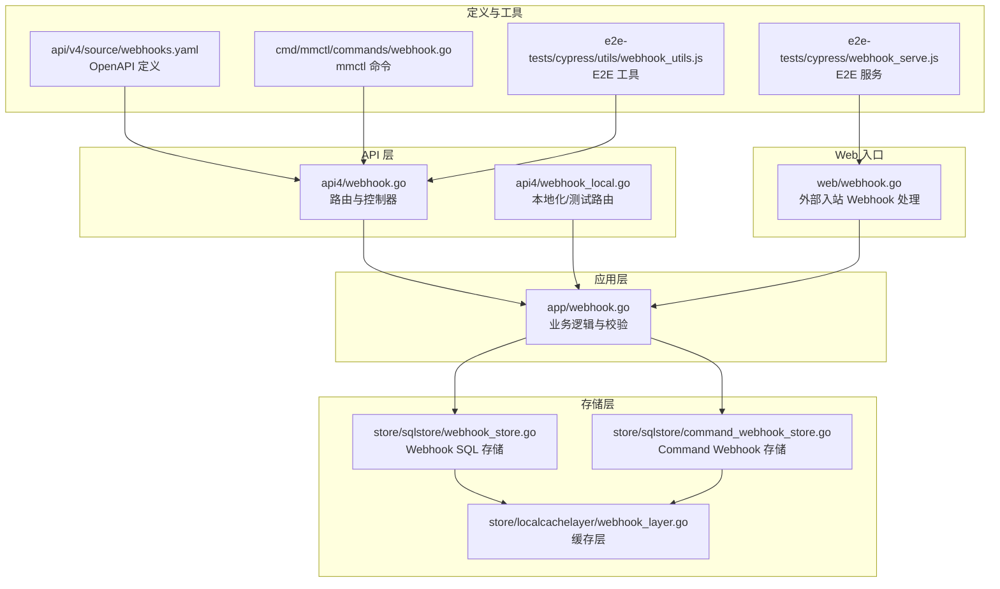
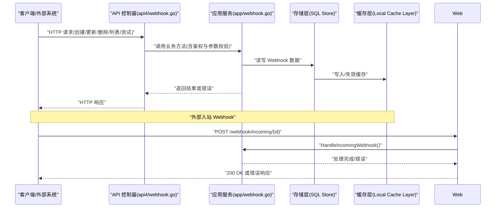
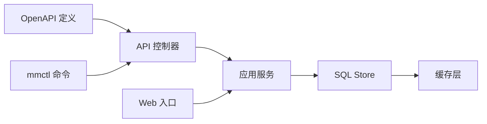

# Webhook API

<cite>
**本文引用的文件**
- [webhook.go](file://server/channels/api4/webhook.go)
- [webhook_local.go](file://server/channels/api4/webhook_local.go)
- [webhook.go](file://server/channels/app/webhook.go)
- [webhook.go](file://server/channels/web/webhook.go)
- [webhooks.yaml](file://api/v4/source/webhooks.yaml)
- [webhook.go](file://server/cmd/mmctl/commands/webhook.go)
- [webhook_store.go](file://server/channels/store/sqlstore/webhook_store.go)
- [command_webhook_store.go](file://server/channels/store/sqlstore/command_webhook_store.go)
- [webhook_layer.go](file://server/channels/store/localcachelayer/webhook_layer.go)
- [webhook_test.go](file://server/channels/app/webhook_test.go)
- [webhook_test.go](file://server/channels/api4/webhook_test.go)
- [webhook_test.go](file://server/channels/web/webhook_test.go)
- [webhook_utils.js](file://e2e-tests/cypress/utils/webhook_utils.js)
- [webhook_serve.js](file://e2e-tests/cypress/webhook_serve.js)
</cite>

## 目录
1. [简介](#简介)
2. [项目结构](#项目结构)
3. [核心组件](#核心组件)
4. [架构总览](#架构总览)
5. [详细组件分析](#详细组件分析)
6. [依赖关系分析](#依赖关系分析)
7. [性能考量](#性能考量)
8. [故障排除指南](#故障排除指南)
9. [结论](#结论)
10. [附录](#附录)

## 简介
本文件系统性梳理 Mattermost Webhook API 的设计与实现，覆盖 Incoming Webhook（入站）与 Outgoing Webhook（出站）两类能力，明确各端点的 HTTP 方法、URL 模式、请求参数、响应格式与典型场景示例；解释触发机制、消息格式与安全校验策略；给出最佳实践与常见问题排查建议。内容基于仓库中实际源码与 OpenAPI 定义文件整理而成。

## 项目结构
围绕 Webhook 的相关模块主要分布在以下位置：
- API 层：处理 HTTP 请求与路由，位于 server/channels/api4 下
- 应用层：业务逻辑与校验，位于 server/channels/app 下
- Web 入口：对外暴露的 Web 入站接口，位于 server/channels/web 下
- 存储层：SQL Store 与缓存层，位于 server/channels/store 下
- 命令行工具：mmctl 子命令，位于 server/cmd/mmctl/commands 下
- OpenAPI 定义：api/v4/source/webhooks.yaml
- E2E 工具：cypress/e2e-tests/utils 与 serve 脚本

图表来源
- [webhook.go:1-200](file://server/channels/api4/webhook.go#L1-L200)
- [webhook_local.go:1-200](file://server/channels/api4/webhook_local.go#L1-L200)
- [webhook.go:1-800](file://server/channels/app/webhook.go#L1-L800)
- [webhook.go:1-120](file://server/channels/web/webhook.go#L1-L120)
- [webhook_store.go:1-300](file://server/channels/store/sqlstore/webhook_store.go#L1-L300)
- [command_webhook_store.go:1-200](file://server/channels/store/sqlstore/command_webhook_store.go#L1-L200)
- [webhook_layer.go:1-200](file://server/channels/store/localcachelayer/webhook_layer.go#L1-L200)
- [webhooks.yaml:1-400](file://api/v4/source/webhooks.yaml#L1-L400)
- [webhook.go:1-200](file://server/cmd/mmctl/commands/webhook.go#L1-L200)
- [webhook_utils.js:1-200](file://e2e-tests/cypress/utils/webhook_utils.js#L1-L200)
- [webhook_serve.js:1-200](file://e2e-tests/cypress/webhook_serve.js#L1-L200)

章节来源
- [webhook.go:1-200](file://server/channels/api4/webhook.go#L1-L200)
- [webhook.go:1-800](file://server/channels/app/webhook.go#L1-L800)
- [webhook.go:1-120](file://server/channels/web/webhook.go#L1-L120)
- [webhook_store.go:1-300](file://server/channels/store/sqlstore/webhook_store.go#L1-L300)
- [command_webhook_store.go:1-200](file://server/channels/store/sqlstore/command_webhook_store.go#L1-L200)
- [webhook_layer.go:1-200](file://server/channels/store/localcachelayer/webhook_layer.go#L1-L200)
- [webhooks.yaml:1-400](file://api/v4/source/webhooks.yaml#L1-L400)
- [webhook.go:1-200](file://server/cmd/mmctl/commands/webhook.go#L1-L200)
- [webhook_utils.js:1-200](file://e2e-tests/cypress/utils/webhook_utils.js#L1-L200)
- [webhook_serve.js:1-200](file://e2e-tests/cypress/webhook_serve.js#L1-L200)

## 核心组件
- API 控制器：负责路由注册、鉴权、参数解析与响应封装
- 应用服务：实现业务规则、权限校验、配置开关控制、数据持久化调用
- Web 入口：接收外部 HTTP 请求，解码入站 Webhook 并交由应用层处理
- 存储层：提供 Webhook 与 Command Webhook 的 CRUD 与查询能力
- OpenAPI 定义：统一描述端点、参数与响应模型
- mmctl 命令：提供 CLI 管理能力（创建、更新、删除、列表、测试）

章节来源
- [webhook.go:1-200](file://server/channels/api4/webhook.go#L1-L200)
- [webhook.go:1-800](file://server/channels/app/webhook.go#L1-L800)
- [webhook.go:1-120](file://server/channels/web/webhook.go#L1-L120)
- [webhook_store.go:1-300](file://server/channels/store/sqlstore/webhook_store.go#L1-L300)
- [command_webhook_store.go:1-200](file://server/channels/store/sqlstore/command_webhook_store.go#L1-L200)
- [webhooks.yaml:1-400](file://api/v4/source/webhooks.yaml#L1-L400)
- [webhook.go:1-200](file://server/cmd/mmctl/commands/webhook.go#L1-L200)

## 架构总览
下图展示从客户端到应用层再到存储层的整体调用链路，以及外部 Web 入站请求的处理流程。

图表来源
- [webhook.go:1-200](file://server/channels/api4/webhook.go#L1-L200)
- [webhook.go:1-800](file://server/channels/app/webhook.go#L1-L800)
- [webhook_store.go:1-300](file://server/channels/store/sqlstore/webhook_store.go#L1-L300)
- [webhook_layer.go:1-200](file://server/channels/store/localcachelayer/webhook_layer.go#L1-L200)
- [webhook.go:1-120](file://server/channels/web/webhook.go#L1-L120)

## 详细组件分析

### API 控制器（路由与端点）
- 路由注册：在 API 初始化时注册 Webhook 相关路由，支持本地化与非本地化两种初始化方式
- 权限控制：根据用户会话与团队/频道权限进行授权
- 参数解析：对请求体进行 JSON 解码或 multipart/form-data 解析
- 响应封装：统一封装成功与错误响应，设置合适的 HTTP 状态码

关键职责与行为
- 路由初始化与本地化初始化
- Incoming Webhook 请求体解析（JSON 与 multipart/form-data）
- Outgoing Webhook 管理端点（创建、更新、删除、列表、测试）
- Command Webhook 管理端点（创建、更新、删除、列表、测试）

章节来源
- [webhook.go:1-200](file://server/channels/api4/webhook.go#L1-L200)
- [webhook_local.go:1-200](file://server/channels/api4/webhook_local.go#L1-L200)

### 应用服务（业务逻辑）
- 开关控制：通过配置项启用/禁用 Incoming/Outgoing Webhooks
- 权限校验：确保调用者具备相应权限（如管理自己的出站 Webhook）
- 数据校验：对请求参数进行合法性检查（必填字段、格式、范围）
- 存储交互：调用 Store 层进行增删改查与分页查询
- 缓存更新：写入后失效相关缓存键，保证一致性

关键职责与行为
- Incoming Webhook 处理入口（校验、文本/附件必填、异步获取 Webhook）
- Outgoing Webhook Token 再生成
- Command Webhook 生命周期管理
- 错误映射与 AppError 统一返回

章节来源
- [webhook.go:1-800](file://server/channels/app/webhook.go#L1-L800)

### Web 入口（外部入站 Webhook）
- 外部系统向 /webhook/incoming/{id} 发送请求
- 支持多种 Content-Type：application/json、multipart/form-data 等
- 解码请求体为 IncomingWebhookRequest
- 调用应用层 HandleIncomingWebhook 并返回 "ok"

关键职责与行为
- Content-Type 分支处理与解码
- 调用应用层处理并返回文本响应
- 错误时返回对应 HTTP 状态码

章节来源
- [webhook.go:70-110](file://server/channels/web/webhook.go#L70-L110)

### 存储层（SQL Store 与缓存层）
- WebhookStore：提供 Incoming/Outgoing Webhook 的 CRUD、查询与分页
- CommandWebhookStore：提供 Command Webhook 的 CRUD、查询与分页
- LocalCacheLayer：对 Webhook 查询结果进行缓存，减少数据库压力

关键职责与行为
- 原子性写操作与事务支持
- 分页查询与排序
- 缓存命中与失效策略

章节来源
- [webhook_store.go:1-300](file://server/channels/store/sqlstore/webhook_store.go#L1-L300)
- [command_webhook_store.go:1-200](file://server/channels/store/sqlstore/command_webhook_store.go#L1-L200)
- [webhook_layer.go:1-200](file://server/channels/store/localcachelayer/webhook_layer.go#L1-L200)

### OpenAPI 定义（端点与模型）
- 定义了 Webhook 相关的端点、HTTP 方法、路径模板、请求参数与响应模型
- 提供了请求/响应示例与错误码说明
- 与 API 控制器实现一一对应，便于生成 SDK 与文档

章节来源
- [webhooks.yaml:1-400](file://api/v4/source/webhooks.yaml#L1-L400)

### mmctl 命令（CLI 管理）
- 提供 create、update、delete、list、get、test 等子命令
- 支持指定团队、频道、令牌等参数
- 与 API 控制器端点保持一致的语义与参数

章节来源
- [webhook.go:1-200](file://server/cmd/mmctl/commands/webhook.go#L1-L200)

### E2E 工具（测试与验证）
- webhook_utils.js：封装测试辅助函数（如创建 Webhook、发送测试请求）
- webhook_serve.js：本地 HTTP 服务，用于模拟外部 Webhook 回调目标

章节来源
- [webhook_utils.js:1-200](file://e2e-tests/cypress/utils/webhook_utils.js#L1-L200)
- [webhook_serve.js:1-200](file://e2e-tests/cypress/webhook_serve.js#L1-L200)

## 依赖关系分析
- API 控制器依赖应用服务进行业务处理
- 应用服务依赖存储层进行数据持久化
- 存储层通过缓存层提升查询性能
- OpenAPI 定义约束端点与模型，驱动前后端一致性
- mmctl 作为 CLI 工具，复用相同的数据模型与权限规则

图表来源
- [webhook.go:1-200](file://server/channels/api4/webhook.go#L1-L200)
- [webhook.go:1-800](file://server/channels/app/webhook.go#L1-L800)
- [webhook_store.go:1-300](file://server/channels/store/sqlstore/webhook_store.go#L1-L300)
- [webhook_layer.go:1-200](file://server/channels/store/localcachelayer/webhook_layer.go#L1-L200)
- [webhooks.yaml:1-400](file://api/v4/source/webhooks.yaml#L1-L400)
- [webhook.go:1-200](file://server/cmd/mmctl/commands/webhook.go#L1-L200)
- [webhook.go:1-120](file://server/channels/web/webhook.go#L1-L120)

## 性能考量
- 缓存策略：对常用查询结果进行缓存，写操作后主动失效相关缓存键
- 异步加载：入站 Webhook 处理中对 Webhook 获取采用并发通道避免阻塞
- 分页查询：列表接口支持分页，避免一次性返回大量数据
- 连接池与事务：存储层使用连接池与事务保证高并发下的稳定性
- 压测与回归：结合 E2E 工具进行端到端验证，确保性能与正确性

## 故障排除指南
常见问题与定位思路
- 禁用开关导致不可用：确认配置项是否启用 Incoming/Outgoing Webhooks
- 权限不足：检查会话权限与团队/频道授权
- 请求体格式错误：确认 Content-Type 与请求体结构
- 外部回调失败：检查回调地址可达性与超时设置
- 缓存不一致：执行写操作后等待缓存失效或手动刷新
- 测试失败：使用 mmctl test 或 E2E 工具进行复现与调试

章节来源
- [webhook.go:732-765](file://server/channels/app/webhook.go#L732-L765)
- [webhook.go:70-110](file://server/channels/web/webhook.go#L70-L110)
- [webhook_test.go:1-200](file://server/channels/app/webhook_test.go#L1-L200)
- [webhook_test.go:1-200](file://server/channels/api4/webhook_test.go#L1-L200)
- [webhook_test.go:1-200](file://server/channels/web/webhook_test.go#L1-L200)

## 结论
Mattermost 的 Webhook 能力通过清晰的分层架构实现了灵活的入站与出站集成。API 层提供统一的端点与参数规范，应用层承载业务规则与安全校验，存储层保障数据一致性与性能，OpenAPI 与 mmctl 提升了可维护性与可用性。遵循本文的最佳实践与排障建议，可在生产环境中稳定地使用 Webhook 能力。

## 附录

### 端点与参数速览（基于 OpenAPI 定义）
- 入站 Webhook（外部系统 -> Mattermost）
  - 方法：POST
  - 路径：/webhook/incoming/{id}
  - 请求头：Content-Type 支持 application/json、multipart/form-data 等
  - 请求体：文本内容与附件等字段
  - 响应：200 文本 "ok" 或错误码

- 出站 Webhook（Mattermost -> 外部系统）
  - 方法：GET/POST（按配置）
  - 路径：/hooks/{team}/{channel}/{token}
  - 请求头：Authorization/自定义头（按配置）
  - 请求体：上下文、用户、消息等字段
  - 响应：外部系统返回 2xx 表示成功

- 管理端点（管理员/有权限用户）
  - 创建/更新/删除/列表/测试：详见 OpenAPI 定义与 mmctl 命令

章节来源
- [webhooks.yaml:1-400](file://api/v4/source/webhooks.yaml#L1-L400)
- [webhook.go:1-200](file://server/cmd/mmctl/commands/webhook.go#L1-L200)

### 触发机制与消息格式
- 入站 Webhook：外部系统直接向 /webhook/incoming/{id} 发送请求，Mattermost 根据 ID 查找并校验 Webhook，随后将消息投递至指定频道
- 出站 Webhook：当频道内满足条件的消息被触发时，Mattermost 向配置的回调地址发起 HTTP 请求，携带上下文与消息内容
- 消息格式：遵循 OpenAPI 中的模型定义，包含文本、附件、元数据等字段

章节来源
- [webhook.go:70-110](file://server/channels/web/webhook.go#L70-L110)
- [webhooks.yaml:1-400](file://api/v4/source/webhooks.yaml#L1-L400)

### 安全验证
- 访问控制：基于会话权限与团队/频道授权
- 配置开关：可通过配置项启用/禁用入站/出站 Webhook
- 令牌校验：出站 Webhook 使用 token 进行身份识别
- 最小权限原则：仅授予必要的权限，避免越权访问

章节来源
- [webhook.go:732-765](file://server/channels/app/webhook.go#L732-L765)
- [webhook.go:1-200](file://server/channels/api4/webhook.go#L1-L200)

### Outgoing 与 Incoming 的区别与使用场景
- Outgoing Webhook：Mattermost 主动向外发起请求，适用于与外部系统集成、事件通知、自动化工作流
- Incoming Webhook：外部系统主动向 Mattermost 发送请求，适用于第三方工具推送消息到频道

章节来源
- [webhooks.yaml:1-400](file://api/v4/source/webhooks.yaml#L1-L400)
- [webhook.go:70-110](file://server/channels/web/webhook.go#L70-L110)

### 最佳实践
- 明确权限边界：为每个 Webhook 配置最小必要权限
- 使用缓存与分页：避免一次性拉取过多数据
- 监控与日志：记录关键事件与错误，便于排障
- 测试先行：使用 mmctl 与 E2E 工具进行端到端验证
- 超时与重试：合理设置回调超时与重试策略