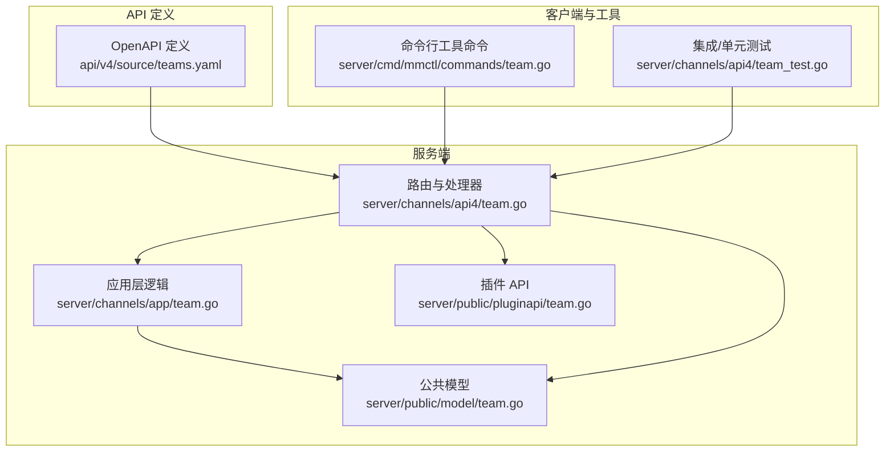
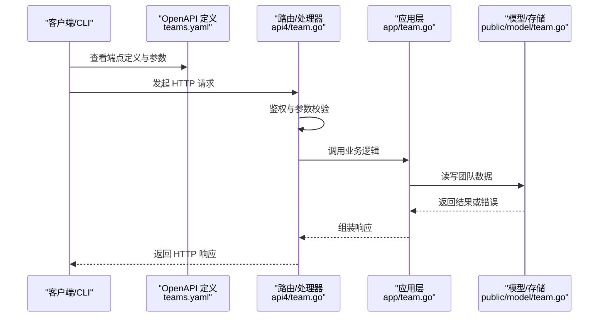
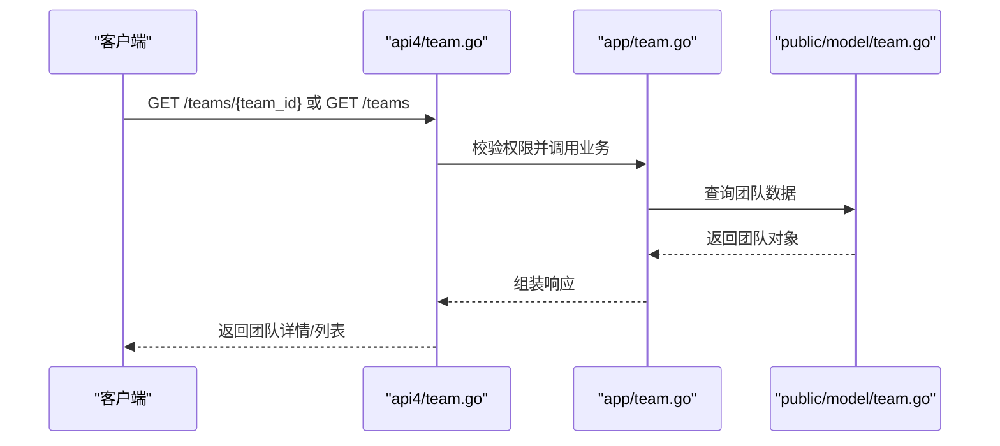
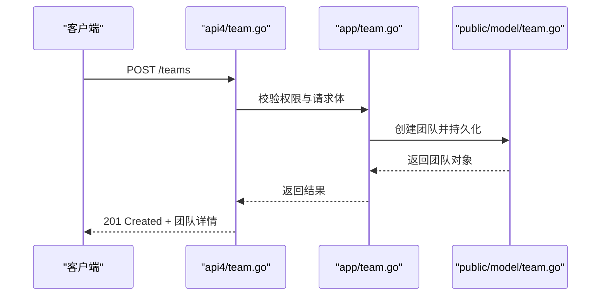
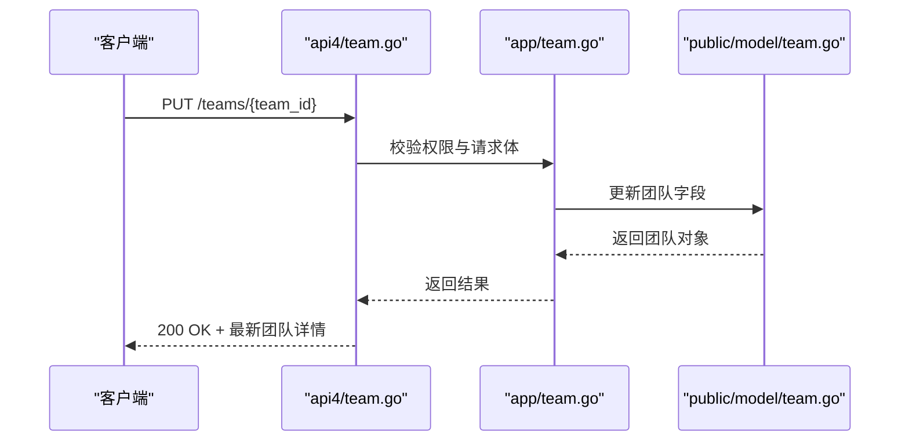
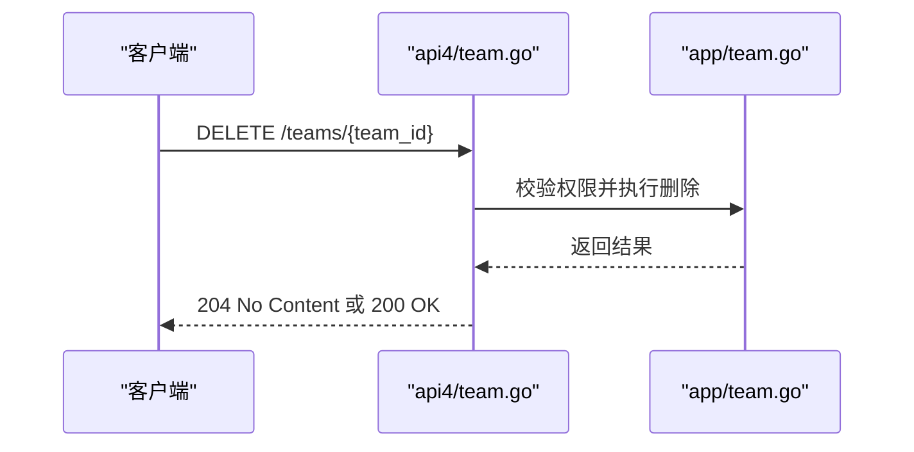
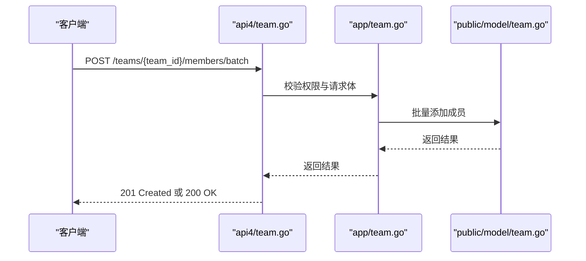
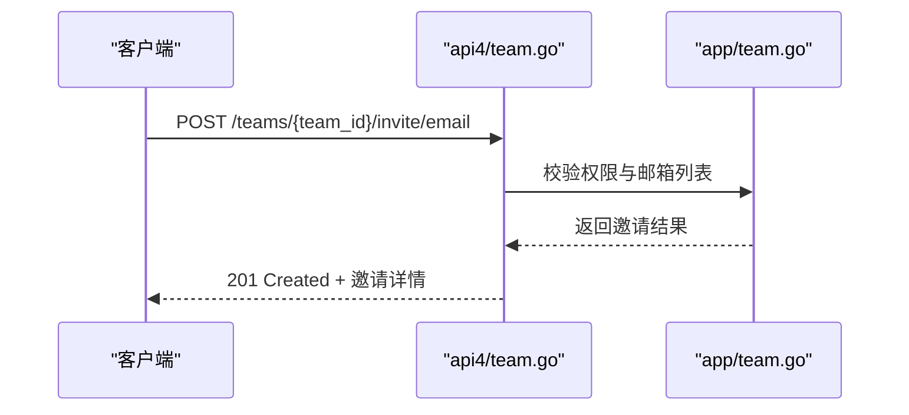
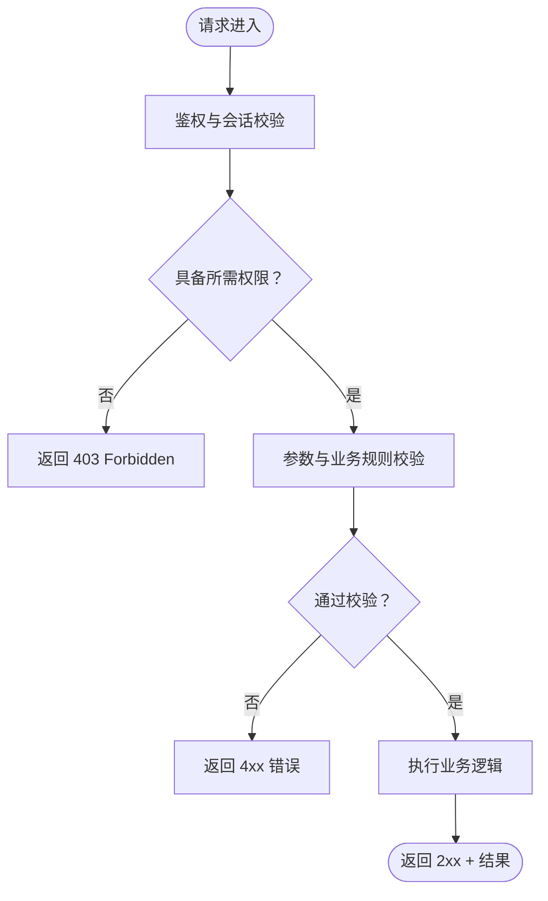
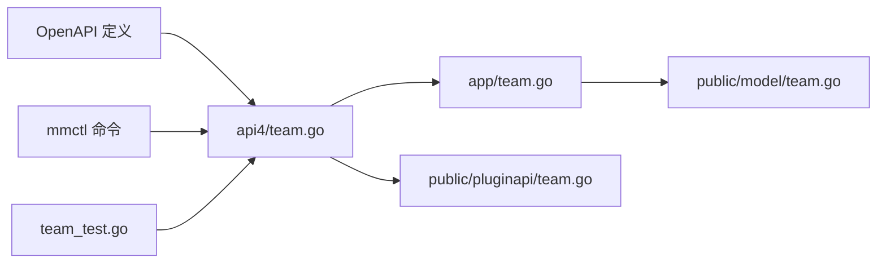

# 团队管理 API

<cite>
**本文引用的文件**
- [teams.yaml](file://api/v4/source/teams.yaml)
- [team.go](file://server/channels/api4/team.go)
- [team.go](file://server/channels/app/team.go)
- [team.go](file://server/cmd/mmctl/commands/team.go)
- [team.go](file://server/public/model/team.go)
- [team.go](file://server/public/pluginapi/team.go)
- [team_test.go](file://server/channels/api4/team_test.go)
</cite>

## 目录
1. [简介](#简介)
2. [项目结构](#项目结构)
3. [核心组件](#核心组件)
4. [架构总览](#架构总览)
5. [详细组件分析](#详细组件分析)
6. [依赖关系分析](#依赖关系分析)
7. [性能考量](#性能考量)
8. [故障排查指南](#故障排查指南)
9. [结论](#结论)
10. [附录](#附录)

## 简介
本文件系统性梳理 Mattermost 团队（Team）管理相关的 API，覆盖团队创建、更新、删除、成员管理、邀请管理、团队信息与列表查询、团队设置更新、权限体系与访问控制、以及高级能力如团队迁移与批量成员操作等。文档以仓库中 OpenAPI 定义与后端实现为依据，结合测试用例，给出各端点的 HTTP 方法、URL 模式、请求参数、响应结构与使用建议。

## 项目结构
围绕团队管理 API 的关键位置如下：
- OpenAPI 定义：api/v4/source/teams.yaml
- 后端路由与处理器：server/channels/api4/team.go
- 应用层业务逻辑：server/channels/app/team.go
- 命令行工具命令：server/cmd/mmctl/commands/team.go
- 公共模型定义：server/public/model/team.go
- 插件 API：server/public/pluginapi/team.go
- 测试用例：server/channels/api4/team_test.go

图表来源
- [teams.yaml](file://api/v4/source/teams.yaml)
- [team.go](file://server/channels/api4/team.go)
- [team.go](file://server/channels/app/team.go)
- [team.go](file://server/cmd/mmctl/commands/team.go)
- [team.go](file://server/public/model/team.go)
- [team.go](file://server/public/pluginapi/team.go)
- [team_test.go](file://server/channels/api4/team_test.go)

章节来源
- [teams.yaml](file://api/v4/source/teams.yaml)
- [team.go](file://server/channels/api4/team.go)
- [team.go](file://server/channels/app/team.go)
- [team.go](file://server/cmd/mmctl/commands/team.go)
- [team.go](file://server/public/model/team.go)
- [team.go](file://server/public/pluginapi/team.go)
- [team_test.go](file://server/channels/api4/team_test.go)

## 核心组件
- OpenAPI 定义 teams.yaml：描述团队相关端点、参数、响应结构与鉴权要求。
- 路由与处理器 team.go（api4）：实现 HTTP 请求到应用层的映射，处理鉴权、参数校验与错误返回。
- 应用层逻辑 team.go（app）：封装团队业务规则、权限检查、数据持久化与跨模块协作。
- 公共模型 team.go（public/model）：团队实体、请求/响应结构体与序列化约定。
- 插件 API team.go（public/pluginapi）：供插件扩展团队能力的接口。
- 命令行工具 mmctl：提供团队管理的 CLI 命令入口。
- 测试用例：验证端点行为、权限控制与边界条件。

章节来源
- [teams.yaml](file://api/v4/source/teams.yaml)
- [team.go](file://server/channels/api4/team.go)
- [team.go](file://server/channels/app/team.go)
- [team.go](file://server/public/model/team.go)
- [team.go](file://server/public/pluginapi/team.go)
- [team_test.go](file://server/channels/api4/team_test.go)

## 架构总览
下图展示从 OpenAPI 到服务端实现的关键流转：

图表来源
- [teams.yaml](file://api/v4/source/teams.yaml)
- [team.go](file://server/channels/api4/team.go)
- [team.go](file://server/channels/app/team.go)
- [team.go](file://server/public/model/team.go)

## 详细组件分析

### 1) 团队信息获取与列表查询
- 端点概览
  - 获取团队详情：HTTP 方法与 URL 模式见 OpenAPI 定义；请求需携带团队标识符。
  - 获取团队列表：支持分页与过滤；请求参数与排序字段见 OpenAPI 定义。
- 处理流程
  - 路由层进行鉴权与参数校验。
  - 应用层根据权限决定可见范围（如公开团队对匿名用户可见，私有团队仅成员可见）。
  - 返回团队详情或团队列表，遵循统一响应结构。
- 权限要点
  - 公开团队允许非成员查看；私有团队需要成员身份或相应权限。
  - 列表查询可能受默认角色权限限制。
- 响应结构
  - 团队详情：包含标识、显示名、名称、类型、描述、头像、邮件、创建时间等字段。
  - 团队列表：分页元数据与条目数组，条目字段与详情一致。

图表来源
- [teams.yaml](file://api/v4/source/teams.yaml)
- [team.go](file://server/channels/api4/team.go)
- [team.go](file://server/channels/app/team.go)
- [team.go](file://server/public/model/team.go)

章节来源
- [teams.yaml](file://api/v4/source/teams.yaml)
- [team.go](file://server/channels/api4/team.go)
- [team.go](file://server/channels/app/team.go)
- [team.go](file://server/public/model/team.go)

### 2) 团队创建
- 端点概览
  - 创建团队：HTTP 方法与 URL 模式见 OpenAPI 定义；请求体包含团队基本信息与可选策略字段。
- 处理流程
  - 路由层校验请求体与权限（如系统管理员或具备创建权限的角色）。
  - 应用层执行业务规则：域名白名单、开放邀请策略、默认角色分配等。
  - 写入存储并返回新团队信息。
- 关键参数
  - 显示名、名称、类型（公开/私有）、可选的允许开放邀请与允许域。
- 响应结构
  - 成功时返回完整团队对象；失败时返回错误码与消息。

图表来源
- [teams.yaml](file://api/v4/source/teams.yaml)
- [team.go](file://server/channels/api4/team.go)
- [team.go](file://server/channels/app/team.go)
- [team.go](file://server/public/model/team.go)

章节来源
- [teams.yaml](file://api/v4/source/teams.yaml)
- [team.go](file://server/channels/api4/team.go)
- [team.go](file://server/channels/app/team.go)
- [team.go](file://server/public/model/team.go)

### 3) 团队设置更新
- 端点概览
  - 更新团队：HTTP 方法与 URL 模式见 OpenAPI 定义；支持更新显示名、描述、头像、邀请链接等。
- 处理流程
  - 路由层校验权限（如团队成员、团队管理员或系统管理员）。
  - 应用层执行更新并返回最新团队信息。
- 权限要点
  - 不同字段更新可能需要不同角色权限；例如更新邀请策略通常需要更高权限。
- 响应结构
  - 成功返回更新后的团队对象。

图表来源
- [teams.yaml](file://api/v4/source/teams.yaml)
- [team.go](file://server/channels/api4/team.go)
- [team.go](file://server/channels/app/team.go)
- [team.go](file://server/public/model/team.go)

章节来源
- [teams.yaml](file://api/v4/source/teams.yaml)
- [team.go](file://server/channels/api4/team.go)
- [team.go](file://server/channels/app/team.go)
- [team.go](file://server/public/model/team.go)

### 4) 团队删除
- 端点概览
  - 删除团队：HTTP 方法与 URL 模式见 OpenAPI 定义；通常需要管理员权限。
- 处理流程
  - 路由层校验权限。
  - 应用层执行软删除或硬删除策略（取决于配置），清理关联资源。
- 响应结构
  - 成功返回空内容或成功状态码。

图表来源
- [teams.yaml](file://api/v4/source/teams.yaml)
- [team.go](file://server/channels/api4/team.go)
- [team.go](file://server/channels/app/team.go)

章节来源
- [teams.yaml](file://api/v4/source/teams.yaml)
- [team.go](file://server/channels/api4/team.go)
- [team.go](file://server/channels/app/team.go)

### 5) 成员管理
- 端点概览
  - 添加成员：向团队添加用户，支持批量。
  - 移除成员：从团队移除用户，支持批量。
  - 获取成员列表：支持分页与过滤。
  - 更新成员角色：变更成员在团队内的角色。
- 处理流程
  - 路由层校验权限（如团队管理员或系统管理员）。
  - 应用层执行成员关系变更并触发通知或审计日志。
- 权限要点
  - 添加/移除成员通常需要团队管理员以上权限。
  - 批量操作需谨慎，避免误操作影响大量成员。
- 响应结构
  - 成员列表：分页与条目数组；条目包含用户标识、用户名、角色等。
  - 单个操作：成功返回空内容或成功状态码。

图表来源
- [teams.yaml](file://api/v4/source/teams.yaml)
- [team.go](file://server/channels/api4/team.go)
- [team.go](file://server/channels/app/team.go)
- [team.go](file://server/public/model/team.go)

章节来源
- [teams.yaml](file://api/v4/source/teams.yaml)
- [team.go](file://server/channels/api4/team.go)
- [team.go](file://server/channels/app/team.go)
- [team.go](file://server/public/model/team.go)

### 6) 邀请管理
- 端点概览
  - 生成/重置邀请链接：需要发送邀请权限。
  - 通过邮箱邀请：支持单个或批量邮箱邀请。
  - 获取邀请列表：查看待确认的邀请。
  - 删除邀请：撤销特定邀请。
- 处理流程
  - 路由层校验“发送邀请”权限。
  - 应用层生成邀请令牌、发送邮件或返回邀请链接。
- 权限要点
  - 邀请策略受团队设置与默认角色权限影响；系统管理员可绕过部分限制。
- 响应结构
  - 邀请链接/列表：包含邀请 ID、邮箱、创建时间、状态等。

图表来源
- [teams.yaml](file://api/v4/source/teams.yaml)
- [team.go](file://server/channels/api4/team.go)
- [team.go](file://server/channels/app/team.go)

章节来源
- [teams.yaml](file://api/v4/source/teams.yaml)
- [team.go](file://server/channels/api4/team.go)
- [team.go](file://server/channels/app/team.go)

### 7) 权限体系与访问控制
- 角色与权限
  - 团队角色：如团队成员、团队管理员、系统管理员等。
  - 权限项：如发送邀请、添加成员、创建团队等。
- 控制机制
  - 路由层在进入业务前进行权限校验。
  - 应用层根据角色与权限决定是否允许操作。
  - OpenAPI 定义中对敏感端点标注了所需权限。
- 最佳实践
  - 为最小权限原则配置默认角色与自定义方案。
  - 对高风险操作（删除、批量变更）启用二次确认与审计日志。

图表来源
- [teams.yaml](file://api/v4/source/teams.yaml)
- [team.go](file://server/channels/api4/team.go)
- [team.go](file://server/channels/app/team.go)

章节来源
- [teams.yaml](file://api/v4/source/teams.yaml)
- [team.go](file://server/channels/api4/team.go)
- [team.go](file://server/channels/app/team.go)

### 8) 高级功能：团队迁移与批量成员操作
- 团队迁移
  - 将成员或频道从一个团队迁移到另一个团队，通常需要管理员权限。
  - 迁移过程需保证数据一致性与权限继承。
- 批量成员操作
  - 支持批量添加、移除、更新角色等。
  - 建议分批执行并记录操作日志，便于回滚与审计。
- 测试参考
  - 测试用例覆盖批量成员操作与权限边界，可作为行为参考。

章节来源
- [team_test.go](file://server/channels/api4/team_test.go)
- [teams.yaml](file://api/v4/source/teams.yaml)
- [team.go](file://server/channels/api4/team.go)
- [team.go](file://server/channels/app/team.go)

## 依赖关系分析
- 组件耦合
  - 路由层依赖应用层；应用层依赖模型层；测试层覆盖路由与应用层。
- 外部依赖
  - OpenAPI 定义为契约，约束端点、参数与响应。
  - 插件 API 与公共模型为扩展与兼容性提供基础。
- 循环依赖
  - 当前结构清晰，无明显循环依赖迹象。

图表来源
- [teams.yaml](file://api/v4/source/teams.yaml)
- [team.go](file://server/channels/api4/team.go)
- [team.go](file://server/channels/app/team.go)
- [team.go](file://server/public/model/team.go)
- [team.go](file://server/public/pluginapi/team.go)
- [team_test.go](file://server/channels/api4/team_test.go)

章节来源
- [teams.yaml](file://api/v4/source/teams.yaml)
- [team.go](file://server/channels/api4/team.go)
- [team.go](file://server/channels/app/team.go)
- [team.go](file://server/public/model/team.go)
- [team.go](file://server/public/pluginapi/team.go)
- [team_test.go](file://server/channels/api4/team_test.go)

## 性能考量
- 分页与过滤
  - 列表查询应使用分页参数，避免一次性拉取过多数据。
- 并发与锁
  - 批量成员操作需注意并发冲突，必要时采用事务或乐观锁。
- 缓存与索引
  - 对常用查询（如团队详情、成员列表）可考虑缓存热点数据。
- 日志与监控
  - 记录慢查询与异常错误，持续优化关键路径。

## 故障排查指南
- 常见问题
  - 403 Forbidden：权限不足，检查角色与权限配置。
  - 404 Not Found：团队或成员不存在，核对标识符。
  - 409 Conflict：违反业务规则（如重复邀请、域限制），调整请求参数。
- 调试建议
  - 开启调试日志，定位鉴权与参数校验阶段的问题。
  - 使用测试用例对照期望行为，逐步缩小范围。
- 参考测试
  - 测试用例覆盖创建团队、邀请权限、批量成员等关键场景，可作为排障参考。

章节来源
- [team_test.go](file://server/channels/api4/team_test.go)
- [team.go](file://server/channels/api4/team.go)

## 结论
本文基于仓库中的 OpenAPI 定义与后端实现，系统梳理了 Mattermost 团队管理 API 的端点、权限与处理流程。建议在生产环境中严格遵循最小权限原则，配合审计日志与监控，确保团队管理的安全与稳定。

## 附录
- OpenAPI 定义位置：api/v4/source/teams.yaml
- 路由与处理器：server/channels/api4/team.go
- 应用层逻辑：server/channels/app/team.go
- 公共模型：server/public/model/team.go
- 插件 API：server/public/pluginapi/team.go
- 命令行工具：server/cmd/mmctl/commands/team.go
- 测试用例：server/channels/api4/team_test.go