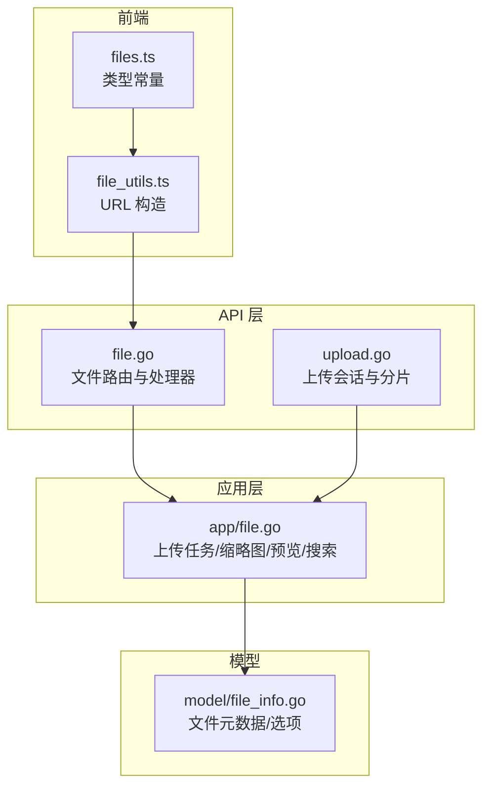
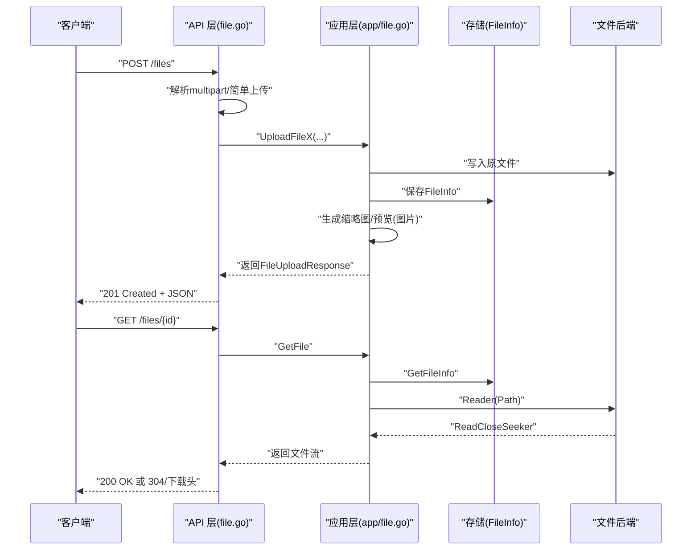
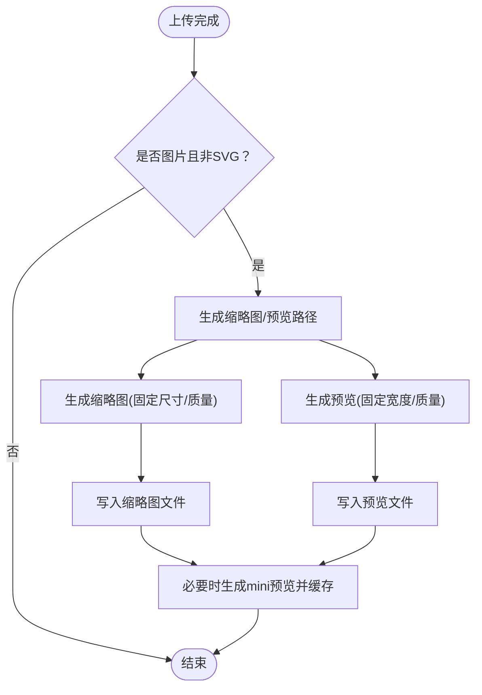
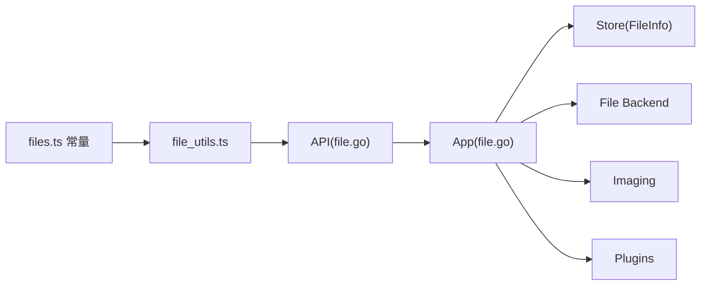

# 文件管理 API

<cite>
**本文引用的文件**
- [server\channels\api4\file.go](file://server\channels\api4\file.go)
- [server\channels\api4\upload.go](file://server\channels\api4\upload.go)
- [server\channels\app\file.go](file://server\channels\app\file.go)
- [server\public\model\file_info.go](file://server\public\model\file_info.go)
- [api\v4\source\files.yaml](file://api\v4\source\files.yaml)
- [server\channels\api4\file_test.go](file://server\channels\api4\file_test.go)
- [webapp\channels\src\packages\mattermost-redux\src\utils\file_utils.ts](file://webapp\channels\src\packages\mattermost-redux\src\utils\file_utils.ts)
- [webapp\channels\src\packages\mattermost-redux\src\constants\files.ts](file://webapp\channels\src\packages\mattermost-redux\src\constants\files.ts)
</cite>

## 目录
1. [简介](#简介)
2. [项目结构](#项目结构)
3. [核心组件](#核心组件)
4. [架构总览](#架构总览)
5. [详细组件分析](#详细组件分析)
6. [依赖分析](#依赖分析)
7. [性能考虑](#性能考虑)
8. [故障排查指南](#故障排查指南)
9. [结论](#结论)
10. [附录](#附录)

## 简介
本文件系统化梳理 Mattermost 的文件管理 API，覆盖文件上传（简单与分片）、下载（原文件、缩略图、预览）、公共链接、文件信息查询、文件搜索等能力。文档同时给出接口规范、鉴权与安全校验、存储策略、缩略图与预览生成机制、批量操作与性能优化建议，并通过序列图与流程图帮助理解端到端调用链路。

## 项目结构
围绕文件管理的关键模块分布如下：
- API 层：负责路由注册与请求处理（上传、下载、链接、信息、搜索）
- 应用层：实现业务逻辑（上传任务、图片缩略图/预览生成、内容提取、权限过滤）
- 数据模型：定义文件元数据结构与排序、筛选选项
- 前端工具：提供文件 URL 构造与类型识别常量

图表来源
- [server\channels\api4\file.go:33-45](file://server\channels\api4\file.go#L33-L45)
- [server\channels\api4\upload.go:20-24](file://server\channels\api4\upload.go#L20-L24)
- [server\channels\app\file.go:626-765](file://server\channels\app\file.go#L626-L765)
- [server\public\model\file_info.go:40-54](file://server\public\model\file_info.go#L40-L54)
- [webapp\channels\src\packages\mattermost-redux\src\utils\file_utils.ts:55-81](file://webapp\channels\src\packages\mattermost-redux\src\utils\file_utils.ts#L55-L81)
- [webapp\channels\src\packages\mattermost-redux\src\constants\files.ts:4-17](file://webapp\channels\src\packages\mattermost-redux\src\constants\files.ts#L4-L17)

章节来源
- [server\channels\api4\file.go:33-45](file://server\channels\api4\file.go#L33-L45)
- [server\channels\api4\upload.go:20-24](file://server\channels\api4\upload.go#L20-L24)
- [server\channels\app\file.go:626-765](file://server\channels\app\file.go#L626-L765)
- [server\public\model\file_info.go:40-54](file://server\public\model\file_info.go#L40-L54)
- [webapp\channels\src\packages\mattermost-redux\src\utils\file_utils.ts:55-81](file://webapp\channels\src\packages\mattermost-redux\src\utils\file_utils.ts#L55-L81)
- [webapp\channels\src\packages\mattermost-redux\src\constants\files.ts:4-17](file://webapp\channels\src\packages\mattermost-redux\src\constants\files.ts#L4-L17)

## 核心组件
- 文件上传处理器：支持简单上传与多部分上传；支持客户端 ID 对齐；支持书签文件上传；支持 ABAC 权限校验
- 文件下载处理器：原文件、缩略图、预览、公共链接访问；支持 as_content_reviewer 参数与插件拦截钩子
- 文件信息与搜索：文件信息查询、跨团队/全站搜索、按条件筛选与排序
- 缩略图与预览：自动为图片生成缩略图与预览图，支持最小预览图（mini preview）缓存
- 存储与内容提取：基于配置的文件后端；可选的内容提取与索引

章节来源
- [server\channels\api4\file.go:77-130](file://server\channels\api4\file.go#L77-L130)
- [server\channels\api4\file.go:519-632](file://server\channels\api4\file.go#L519-L632)
- [server\channels\api4\file.go:634-700](file://server\channels\api4\file.go#L634-L700)
- [server\channels\api4\file.go:702-763](file://server\channels\api4\file.go#L702-L763)
- [server\channels\api4\file.go:765-832](file://server\channels\api4\file.go#L765-L832)
- [server\channels\api4\file.go:834-880](file://server\channels\api4\file.go#L834-L880)
- [server\channels\api4\file.go:936-1023](file://server\channels\api4\file.go#L936-L1023)
- [server\channels\app\file.go:1169-1290](file://server\channels\app\file.go#L1169-L1290)
- [server\channels\app\file.go:1718-1751](file://server\channels\app\file.go#L1718-L1751)

## 架构总览
文件管理 API 的典型调用链：客户端发起请求 → API 路由解析 → 鉴权与权限校验 → 应用层执行业务逻辑（如上传/生成缩略图/内容提取/搜索）→ 返回结果或流式输出文件内容。

图表来源
- [server\channels\api4\file.go:77-130](file://server\channels\api4\file.go#L77-L130)
- [server\channels\api4\file.go:519-632](file://server\channels\api4\file.go#L519-L632)
- [server\channels\app\file.go:626-765](file://server\channels\app\file.go#L626-L765)
- [server\channels\app\file.go:1169-1290](file://server\channels\app\file.go#L1169-L1290)

## 详细组件分析

### 文件上传 API
- 简单上传（POST /files）
  - 请求方式：POST
  - URL 模式：/files
  - 请求体：表单字段 channel_id、filename、client_ids（可选，多个时一一对应文件数量）、文件二进制主体
  - 响应：201 Created + FileUploadResponse（包含 FileInfos 与可选 ClientIds）
  - 关键行为：权限校验（上传权限、ABAC 下载附件策略）、书签文件上传、受限 DM 校验、内容长度与大小限制、插件拦截钩子
- 多部分上传（POST /files）
  - 支持先缓冲到 channel_id 再流式处理；支持 client_ids 与文件一一对应
  - 错误处理：边界缺失、非 multipart、表单过大等
- 分片上传（会话）
  - 先创建上传会话（POST /uploads），再分片上传（POST /uploads/{id}），最后返回 FileInfo
  - 会话创建支持导入类型（系统管理员）与附件类型（普通用户）

章节来源
- [server\channels\api4\file.go:77-130](file://server\channels\api4\file.go#L77-L130)
- [server\channels\api4\file.go:205-415](file://server\channels\api4\file.go#L205-L415)
- [server\channels\api4\file.go:417-517](file://server\channels\api4\file.go#L417-L517)
- [server\channels\api4\upload.go:26-98](file://server\channels\api4\upload.go#L26-L98)
- [server\channels\api4\upload.go:122-208](file://server\channels\api4\upload.go#L122-L208)

### 文件下载 API
- 获取原文件（GET /files/{id}）
  - 查询参数：download（强制下载）、as_content_reviewer（内容审查者模式，需启用内容标记且提供 flagged_post_id）
  - 权限：频道成员或文件创建者本人；ABAC 下载附件策略；插件拦截钩子
  - 响应：文件流；支持 HEAD 请求仅返回头信息
- 获取缩略图（GET /files/{id}/thumbnail）
  - 条件：存在 ThumbnailPath；否则 400
- 获取预览图（GET /files/{id}/preview）
  - 条件：存在 PreviewPath；否则 400
- 获取公共链接（GET /files/{id}/link）
  - 条件：启用公共链接；文件属于有权限的频道；若文件未关联帖子且非书签文件，返回 400
  - 返回：包含 link 字段的 JSON
- 公共文件访问（GET /files/{id}，无会话）
  - 需要有效签名 h=sha256(public_salt + fileId) 的哈希
  - 插件拦截钩子可用（无用户会话）

章节来源
- [server\channels\api4\file.go:519-632](file://server\channels\api4\file.go#L519-L632)
- [server\channels\api4\file.go:634-700](file://server\channels\api4\file.go#L634-L700)
- [server\channels\api4\file.go:702-763](file://server\channels\api4\file.go#L702-L763)
- [server\channels\api4\file.go:882-934](file://server\channels\api4\file.go#L882-L934)

### 文件信息与搜索 API
- 获取文件信息（GET /files/{id}/info）
  - 响应：FileInfo 结构；设置 Cache-Control: max-age=2592000, private
- 文件搜索（POST /teams/{team_id}/files/search 与 POST /files/search）
  - 请求体：terms、is_or_search、time_zone_offset、include_deleted_channels、page、per_page
  - 权限：团队查看权限；搜索功能可禁用
  - 过滤：按频道名/ID、用户名/ID、扩展名等；支持通配符；最终按频道成员身份与 ABAC 下载策略过滤

章节来源
- [server\channels\api4\file.go:834-880](file://server\channels\api4\file.go#L834-L880)
- [server\channels\api4\file.go:936-1023](file://server\channels\api4\file.go#L936-L1023)
- [api\v4\source\files.yaml:536-567](file://api\v4\source\files.yaml#L536-L567)

### 数据模型与选项
- FileInfo：包含 id、user_id、post_id、channel_id、create_at、update_at、delete_at、name、extension、size、mime_type、width、height、has_preview_image、mini_preview、content、remote_id、archived 等字段
- GetFileInfosOptions：支持 user_ids、channel_ids、since、include_deleted、sort_by、sort_descending 等筛选与排序选项
- 文件下载类型枚举：file、thumbnail、preview、public

章节来源
- [server\public\model\file_info.go:56-82](file://server\public\model\file_info.go#L56-L82)
- [server\public\model\file_info.go:40-54](file://server\public\model\file_info.go#L40-L54)
- [server\public\model\file_info.go:26-38](file://server\public\model\file_info.go#L26-L38)

### 缩略图与预览生成
- 图片上传后自动生成缩略图与预览图路径；图片尺寸限制与旋转处理；编码质量固定
- 最小预览图（mini preview）在首次访问时生成并缓存至数据库
- 批量生成采用并发等待组，避免阻塞

图表来源
- [server\channels\app\file.go:1169-1290](file://server\channels\app\file.go#L1169-L1290)
- [server\channels\app\file.go:1258-1302](file://server\channels\app\file.go#L1258-L1302)

章节来源
- [server\channels\app\file.go:1169-1290](file://server\channels\app\file.go#L1169-L1290)
- [server\channels\app\file.go:1258-1302](file://server\channels\app\file.go#L1258-L1302)

### 安全与权限
- 上传/下载均进行频道成员身份与权限校验；ABAC 下载附件策略动态评估
- 公共链接访问需要有效签名；内容审查者模式要求启用内容标记与匹配的 flagged_post_id
- 插件可在下载前拒绝访问，返回拒绝原因头

章节来源
- [server\channels\api4\file.go:519-632](file://server\channels\api4\file.go#L519-L632)
- [server\channels\api4\file.go:634-700](file://server\channels\api4\file.go#L634-L700)
- [server\channels\api4\file.go:702-763](file://server\channels\api4\file.go#L702-L763)
- [server\channels\api4\file.go:882-934](file://server\channels\api4\file.go#L882-L934)

### 存储与内容提取
- 文件后端可配置（S3/Azure 等）；提供连接测试与错误映射
- 可选的内容提取（默认开启）：对非图片文件提取文本内容并缓存，用于全文检索

章节来源
- [server\channels\app\file.go:117-145](file://server\channels\app\file.go#L117-L145)
- [server\channels\app\file.go:1718-1751](file://server\channels\app\file.go#L1718-L1751)

## 依赖分析
- API 层依赖应用层执行业务；应用层依赖存储层持久化 FileInfo；依赖文件后端进行读写；依赖图像编解码器生成缩略图/预览；依赖插件环境执行拦截钩子
- 前端工具依赖配置常量与 API 路由构造 URL

图表来源
- [server\channels\api4\file.go:33-45](file://server\channels\api4\file.go#L33-L45)
- [server\channels\app\file.go:626-765](file://server\channels\app\file.go#L626-L765)
- [webapp\channels\src\packages\mattermost-redux\src\utils\file_utils.ts:55-81](file://webapp\channels\src\packages\mattermost-redux\src\utils\file_utils.ts#L55-L81)
- [webapp\channels\src\packages\mattermost-redux\src\constants\files.ts:4-17](file://webapp\channels\src\packages\mattermost-redux\src\constants\files.ts#L4-L17)

章节来源
- [server\channels\api4\file.go:33-45](file://server\channels\api4\file.go#L33-L45)
- [server\channels\app\file.go:626-765](file://server\channels\app\file.go#L626-L765)
- [webapp\channels\src\packages\mattermost-redux\src\utils\file_utils.ts:55-81](file://webapp\channels\src\packages\mattermost-redux\src\utils\file_utils.ts#L55-L81)
- [webapp\channels\src\packages\mattermost-redux\src\constants\files.ts:4-17](file://webapp\channels\src\packages\mattermost-redux\src\constants\files.ts#L4-L17)

## 性能考虑
- 上传
  - 尽可能使用分片上传以提升大文件稳定性；合理设置 MaxFileSize 与 MaxImageResolution，避免超限导致失败
  - 多文件上传时确保 client_ids 与文件一一对应，减少重试与回滚
- 缩略图/预览
  - 图片尺寸与质量固定，避免重复计算；利用 mini preview 缓存减少首访开销
- 搜索
  - 合理使用 is_or_search、include_deleted_channels、page/per_page 控制结果规模；避免使用通配符“*”
- 下载
  - 使用 HEAD 请求探测资源存在性；对静态资源启用浏览器缓存（FileInfo 接口已设置 Cache-Control）
  - 公共链接访问无需会话，但需保证签名有效性与时效

## 故障排查指南
- 上传失败
  - 检查 EnableFileAttachments 与 MaxFileSize 配置；确认 channel_id 与权限；核对 multipart 边界与 client_ids 数量
- 缩略图/预览缺失
  - 确认文件为图片且非 SVG；检查缩略图/预览路径是否存在；查看日志中图像编码/写入错误
- 下载被拒绝
  - 检查 as_content_reviewer 参数与 flagged_post_id 是否匹配；确认 ABAC 策略与频道成员身份；查看插件拦截原因头
- 公共链接无效
  - 校验签名 h 是否正确；确认 EnablePublicLink 已启用；检查文件是否关联帖子或为书签文件
- 搜索无结果
  - 确认 terms 非空且未使用“*”；检查 include_deleted_channels 与 is_or_search 设置；验证频道成员身份与 ABAC 权限

章节来源
- [server\channels\api4\file.go:77-130](file://server\channels\api4\file.go#L77-L130)
- [server\channels\api4\file.go:634-700](file://server\channels\api4\file.go#L634-L700)
- [server\channels\api4\file.go:702-763](file://server\channels\api4\file.go#L702-L763)
- [server\channels\api4\file.go:882-934](file://server\channels\api4\file.go#L882-L934)
- [server\channels\api4\file.go:936-1023](file://server\channels\api4\file.go#L936-L1023)

## 结论
Mattermost 文件管理 API 提供了从上传、存储、权限控制到下载、预览、搜索的完整能力。通过 ABAC 策略与插件钩子，系统在安全性与可扩展性上具备良好基础。建议在生产环境中结合分片上传、缓存与内容提取策略，以获得更优的用户体验与性能表现。

## 附录

### 接口一览与示例要点
- 上传（简单）
  - 方法/URL：POST /files
  - 请求参数：channel_id、filename、client_ids（可选）、文件主体
  - 响应：FileUploadResponse（FileInfos、可选 ClientIds）
- 上传（分片）
  - 创建会话：POST /uploads（请求体含 UploadSession）
  - 分片上传：POST /uploads/{id}（multipart 或流式）
  - 返回：FileInfo 或 204（未完成）
- 下载
  - 原文件：GET /files/{id}?download=1
  - 缩略图：GET /files/{id}/thumbnail
  - 预览：GET /files/{id}/preview
  - 公共链接：GET /files/{id}/link（需启用公共链接）
  - 公共访问：GET /files/{id}?h=签名
- 文件信息
  - GET /files/{id}/info
- 搜索
  - 团队内：POST /teams/{team_id}/files/search
  - 全站：POST /files/search
  - 请求体：terms、is_or_search、time_zone_offset、include_deleted_channels、page、per_page

章节来源
- [server\channels\api4\file.go:33-45](file://server\channels\api4\file.go#L33-L45)
- [server\channels\api4\file.go:519-632](file://server\channels\api4\file.go#L519-L632)
- [server\channels\api4\file.go:634-700](file://server\channels\api4\file.go#L634-L700)
- [server\channels\api4\file.go:702-763](file://server\channels\api4\file.go#L702-L763)
- [server\channels\api4\file.go:765-832](file://server\channels\api4\file.go#L765-L832)
- [server\channels\api4\file.go:834-880](file://server\channels\api4\file.go#L834-L880)
- [server\channels\api4\file.go:936-1023](file://server\channels\api4\file.go#L936-L1023)
- [server\channels\api4\upload.go:26-98](file://server\channels\api4\upload.go#L26-L98)
- [server\channels\api4\upload.go:122-208](file://server\channels\api4\upload.go#L122-L208)

### 前端 URL 构造与类型识别
- URL 构造函数：getFileUrl、getFileDownloadUrl、getFileThumbnailUrl、getFilePreviewUrl、getFileMiniPreviewUrl
- 类型识别常量：IMAGE_TYPES、AUDIO_TYPES、VIDEO_TYPES、PDF_TYPES、SPREADSHEET_TYPES、WORD_TYPES、TEXT_TYPES、CODE_TYPES、PRESENTATION_TYPES、PATCH_TYPES

章节来源
- [webapp\channels\src\packages\mattermost-redux\src\utils\file_utils.ts:55-86](file://webapp\channels\src\packages\mattermost-redux\src\utils\file_utils.ts#L55-L86)
- [webapp\channels\src\packages\mattermost-redux\src\constants\files.ts:4-17](file://webapp\channels\src\packages\mattermost-redux\src\constants\files.ts#L4-L17)