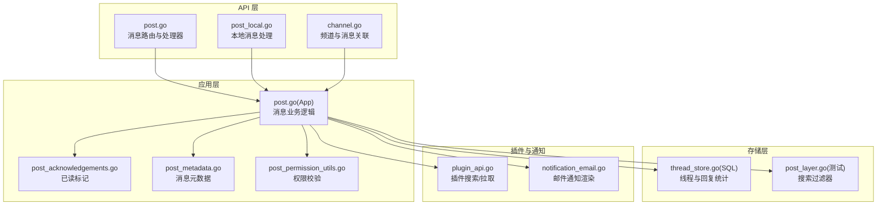
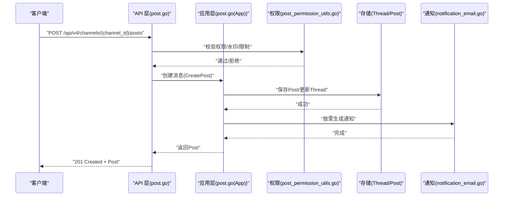
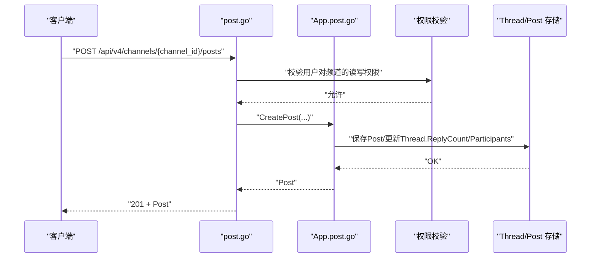
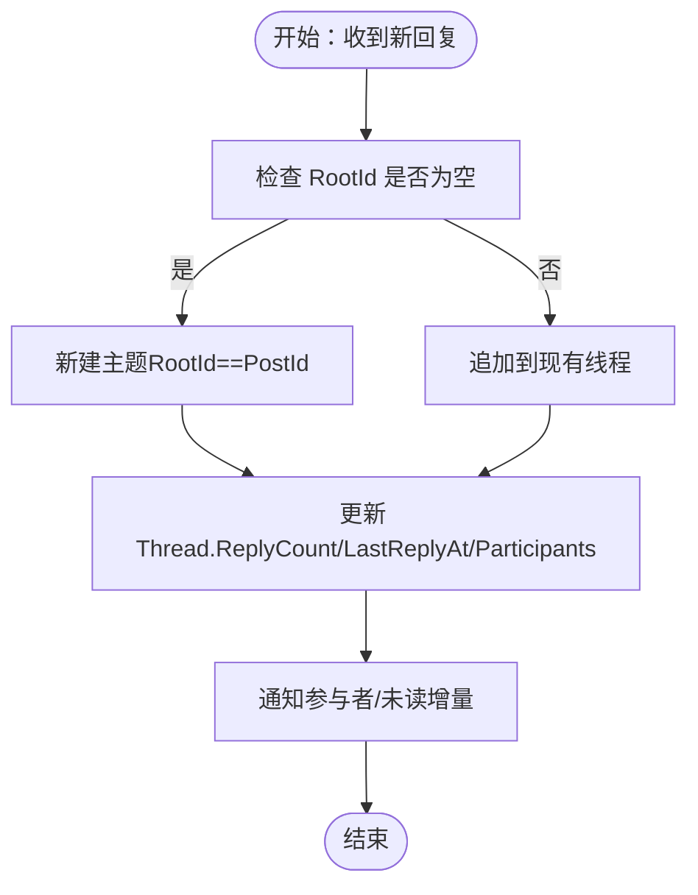
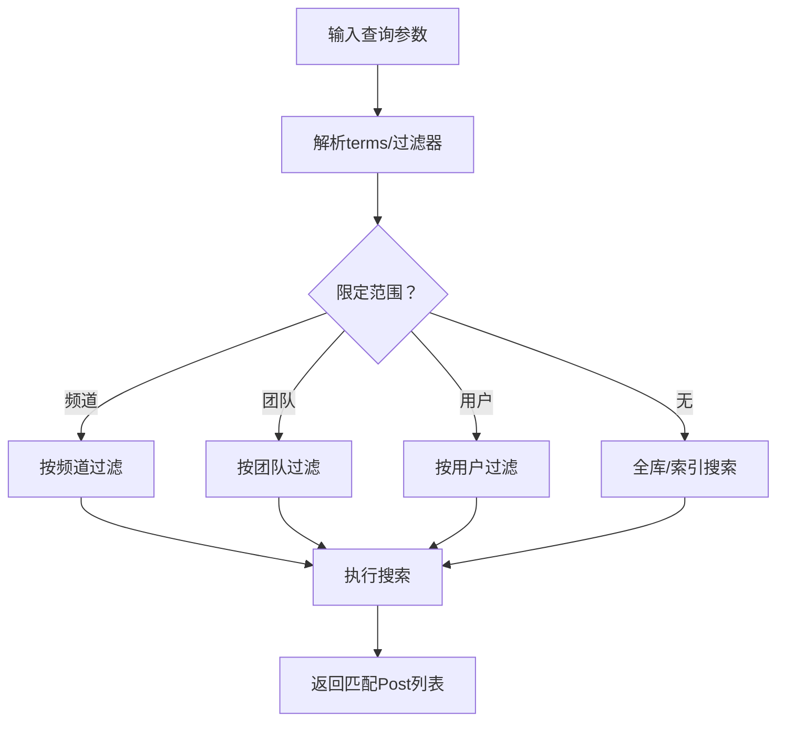
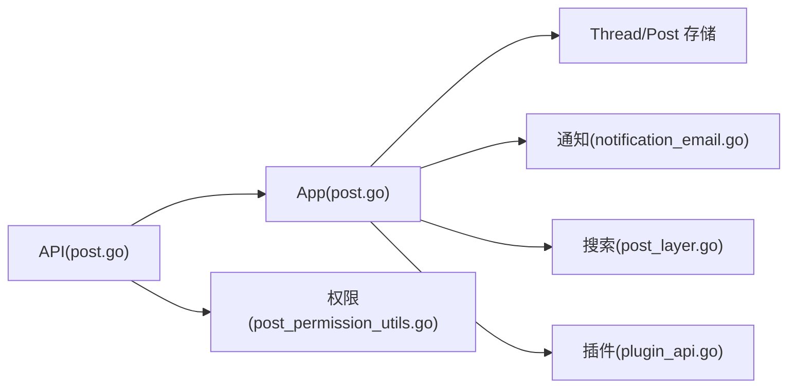

# 消息管理 API

<cite>
**本文档引用的文件**
- [posts.yaml](file://api/v4/source/posts.yaml)
- [post.go](file://server/channels/api4/post.go)
- [post_local.go](file://server/channels/api4/post_local.go)
- [post_test.go](file://server/channels/api4/post_test.go)
- [post_create_test.go](file://server/channels/api4/post_create_test.go)
- [post_utils.go](file://server/channels/api4/post_utils.go)
- [post_acknowledgements.go](file://server/channels/app/post_acknowledgements.go)
- [post_metadata.go](file://server/channels/app/post_metadata.go)
- [post_permission_utils.go](file://server/channels/app/post_permission_utils.go)
- [post.go](file://server/channels/app/post.go)
- [channel.go](file://server/channels/api4/channel.go)
- [content_flagging.go](file://server/channels/api4/content_flagging.go)
- [content_flagging_report.go](file://server/channels/app/content_flagging_report.go)
- [plugin_api.go](file://server/channels/app/plugin_api.go)
- [notification_email.go](file://server/channels/app/email/notification_email.go)
- [post_layer.go](file://server/channels/store/searchtest/post_layer.go)
- [thread_store.go](file://server/channels/store/sqlstore/thread_store.go)
- [apitestlib.go](file://server/channels/api4/apitestlib.go)
</cite>

## 目录
1. [简介](#简介)
2. [项目结构](#项目结构)
3. [核心组件](#核心组件)
4. [架构总览](#架构总览)
5. [详细组件分析](#详细组件分析)
6. [依赖关系分析](#依赖关系分析)
7. [性能考虑](#性能考虑)
8. [故障排查指南](#故障排查指南)
9. [结论](#结论)
10. [附录](#附录)

## 简介
本文件系统性梳理 Mattermost 的消息管理 API，覆盖消息发送、编辑、删除、回复、列表与分页、搜索、标记已读、附件与 Markdown 渲染、举报与内容审查等能力，并给出接口定义、数据模型、调用流程图与最佳实践建议。读者可据此快速集成消息相关功能并与前端或插件生态协同工作。

## 项目结构
围绕消息管理的核心代码分布在以下位置：
- OpenAPI 定义：api/v4/source/posts.yaml
- HTTP 层路由与处理器：server/channels/api4/post.go、server/channels/api4/post_local.go、server/channels/api4/channel.go
- 应用层业务逻辑：server/channels/app/post.go、server/channels/app/post_acknowledgements.go、server/channels/app/post_metadata.go、server/channels/app/post_permission_utils.go
- 搜索与线程存储：server/channels/store/searchtest/post_layer.go、server/channels/store/sqlstore/thread_store.go
- 插件 API：server/channels/app/plugin_api.go
- 邮件通知与附件渲染：server/channels/app/email/notification_email.go
- 测试与工具：server/channels/api4/post_test.go、server/channels/api4/post_create_test.go、server/channels/api4/apitestlib.go

图表来源
- [post.go](file://server/channels/api4/post.go)
- [post_local.go](file://server/channels/api4/post_local.go)
- [channel.go](file://server/channels/api4/channel.go)
- [post.go](file://server/channels/app/post.go)
- [post_acknowledgements.go](file://server/channels/app/post_acknowledgements.go)
- [post_metadata.go](file://server/channels/app/post_metadata.go)
- [post_permission_utils.go](file://server/channels/app/post_permission_utils.go)
- [thread_store.go](file://server/channels/store/sqlstore/thread_store.go)
- [post_layer.go](file://server/channels/store/searchtest/post_layer.go)
- [plugin_api.go](file://server/channels/app/plugin_api.go)
- [notification_email.go](file://server/channels/app/email/notification_email.go)

章节来源
- [post.go](file://server/channels/api4/post.go)
- [post.go](file://server/channels/app/post.go)

## 核心组件
- 消息发送与更新
  - 发送：POST /api/v4/channels/{channel_id}/posts
  - 更新：PUT /api/v4/posts/{post_id}?action_type=patch
- 消息删除与恢复
  - 删除：DELETE /api/v4/posts/{post_id}
  - 恢复：POST /api/v4/posts/{post_id}/restore
- 回复与引用
  - 回复：在发送时设置 RootId 指向父消息；支持 Thread 聚合与未读统计
- 列表与分页
  - 获取频道消息：GET /api/v4/channels/{channel_id}/posts
  - 前后翻页：GET /api/v4/channels/{channel_id}/posts?before={post_id}&per_page={N}
  - 最近未读附近：GET /api/v4/channels/{channel_id}/posts?around={post_id}&per_page={N}
- 搜索
  - 全局/团队/频道搜索：GET /api/v4/posts/search
  - 支持布尔、通配符、日期范围、排除关键词等过滤
- 已读标记
  - 标记全部已读：POST /api/v4/channels/{channel_id}/read
- 举报与内容审查
  - 举报：POST /api/v4/posts/{post_id}/flag
  - 取消举报：POST /api/v4/posts/{post_id}/unflag
  - 报告生成通知：应用层在报告生成后自动回复到审查线程
- 附件与 Markdown
  - 附件字段校验与邮件渲染；Markdown 渲染由前端负责

章节来源
- [posts.yaml](file://api/v4/source/posts.yaml)
- [post.go](file://server/channels/api4/post.go)
- [post_local.go](file://server/channels/api4/post_local.go)
- [channel.go](file://server/channels/api4/channel.go)
- [post.go](file://server/channels/app/post.go)
- [post_acknowledgements.go](file://server/channels/app/post_acknowledgements.go)
- [content_flagging.go](file://server/channels/api4/content_flagging.go)
- [content_flagging_report.go](file://server/channels/app/content_flagging_report.go)
- [notification_email.go](file://server/channels/app/email/notification_email.go)
- [post_layer.go](file://server/channels/store/searchtest/post_layer.go)

## 架构总览
消息管理涉及多层协作：HTTP 层接收请求并进行鉴权与参数解析；应用层执行业务规则（权限、水印、重复检测、线程聚合）；存储层持久化消息、线程与索引；插件与通知模块扩展能力。

图表来源
- [post.go](file://server/channels/api4/post.go)
- [post.go](file://server/channels/app/post.go)
- [post_permission_utils.go](file://server/channels/app/post_permission_utils.go)
- [thread_store.go](file://server/channels/store/sqlstore/thread_store.go)
- [notification_email.go](file://server/channels/app/email/notification_email.go)

## 详细组件分析

### 消息发送（创建）
- HTTP 方法与路径
  - POST /api/v4/channels/{channel_id}/posts
- 请求体字段
  - ChannelId: 目标频道 ID
  - Message: 文本内容（支持 Markdown）
  - FileIds: 附件文件 ID 数组
  - RootId: 引用/回复的根消息 ID（为空表示新主题）
  - Props: 自定义属性（如调度时间、外部 ID 等）
- 响应
  - 201 Created + Post 对象（含 Id、Message、CreateAt、EditAt、FileIds、RootId、Props 等）
- 处理流程要点
  - 权限校验与速率限制
  - 水印与重复检测
  - 线程计数与参与者更新
  - 附件与 Markdown 渲染
  - 通知与邮件派发

图表来源
- [post.go](file://server/channels/api4/post.go)
- [post.go](file://server/channels/app/post.go)
- [post_permission_utils.go](file://server/channels/app/post_permission_utils.go)
- [thread_store.go](file://server/channels/store/sqlstore/thread_store.go)

章节来源
- [posts.yaml](file://api/v4/source/posts.yaml)
- [post.go](file://server/channels/api4/post.go)
- [post.go](file://server/channels/app/post.go)
- [post_permission_utils.go](file://server/channels/app/post_permission_utils.go)
- [thread_store.go](file://server/channels/store/sqlstore/thread_store.go)

### 消息更新（编辑）
- HTTP 方法与路径
  - PUT /api/v4/posts/{post_id}?action_type=patch
- 请求体字段
  - Message: 新内容（可部分更新）
  - Props: 自定义属性更新
- 响应
  - 200 OK + 更新后的 Post
- 注意事项
  - 仅作者或具备编辑权限者可更新
  - 编辑历史与 EditAt 字段由服务端维护

章节来源
- [posts.yaml](file://api/v4/source/posts.yaml)
- [post.go](file://server/channels/api4/post.go)

### 消息删除与恢复
- HTTP 方法与路径
  - 删除：DELETE /api/v4/posts/{post_id}
  - 恢复：POST /api/v4/posts/{post_id}/restore
- 行为说明
  - 删除会软删除（保留记录但标记删除时间），影响线程 ReplyCount 统计
  - 恢复仅对软删除的消息有效

章节来源
- [posts.yaml](file://api/v4/source/posts.yaml)
- [post_local.go](file://server/channels/api4/post_local.go)
- [post.go](file://server/channels/app/post.go)

### 回复与引用机制
- 回复
  - 在发送时设置 RootId 指向父消息；若 RootId 与 PostId 相同则为主题
- 线程聚合
  - Thread 存储维护 ReplyCount、LastReplyAt、Participants、UnreadReplies 等
- 未读统计
  - 用户阅读后，LastViewedAt 更新，未读数随之变化

图表来源
- [thread_store.go](file://server/channels/store/sqlstore/thread_store.go)
- [post.go](file://server/channels/app/post.go)

章节来源
- [thread_store.go](file://server/channels/store/sqlstore/thread_store.go)
- [post.go](file://server/channels/app/post.go)

### 消息列表与分页
- HTTP 方法与路径
  - GET /api/v4/channels/{channel_id}/posts?page&per_page
  - GET /api/v4/channels/{channel_id}/posts?before={post_id}&per_page
  - GET /api/v4/channels/{channel_id}/posts?after={post_id}&per_page
  - GET /api/v4/channels/{channel_id}/posts?around={post_id}&per_page
- 响应
  - 200 OK + PostList（包含 Posts、NextPostId、PrevPostId、AroundPostId）

章节来源
- [post.go](file://server/channels/api4/post.go)
- [post.go](file://server/channels/app/post.go)

### 消息搜索
- HTTP 方法与路径
  - GET /api/v4/posts/search
- 查询参数
  - terms: 搜索词（支持布尔、通配符、排除）
  - include_deleted_channels: 是否包含已删频道
  - channel_id/team_id/user_id: 限定范围
  - since: 时间戳过滤
  - page/per_page: 分页
- 响应
  - 200 OK + PostSearchResults（包含匹配 Post 列表与元信息）

图表来源
- [post_layer.go](file://server/channels/store/searchtest/post_layer.go)
- [plugin_api.go](file://server/channels/app/plugin_api.go)

章节来源
- [post_layer.go](file://server/channels/store/searchtest/post_layer.go)
- [plugin_api.go](file://server/channels/app/plugin_api.go)

### 标记已读
- HTTP 方法与路径
  - POST /api/v4/channels/{channel_id}/read
- 行为
  - 将当前用户在频道中的 LastViewedAt 更新至最新消息，清零未读数

章节来源
- [channel.go](file://server/channels/api4/channel.go)

### 举报与内容审查
- HTTP 方法与路径
  - 举报：POST /api/v4/posts/{post_id}/flag
  - 取消举报：POST /api/v4/posts/{post_id}/unflag
- 报告生成通知
  - 应用层在报告生成后自动回复到审查线程，提醒评审人

章节来源
- [content_flagging.go](file://server/channels/api4/content_flagging.go)
- [content_flagging_report.go](file://server/channels/app/content_flagging_report.go)

### 附件与消息格式
- 附件字段校验
  - 标题、值、短字段类型校验
- 邮件通知渲染
  - 当消息为空时根据附件生成通知文案；支持图片/文件两类提示
- Markdown
  - 服务端不直接渲染，由前端负责

章节来源
- [notification_email.go](file://server/channels/app/email/notification_email.go)

## 依赖关系分析
- API 层依赖应用层业务逻辑与权限校验
- 应用层依赖存储层（Post/Thread）与通知模块
- 搜索能力由存储层测试用例体现，支持多种过滤策略
- 插件可通过 PluginAPI 进行搜索与消息拉取

图表来源
- [post.go](file://server/channels/api4/post.go)
- [post.go](file://server/channels/app/post.go)
- [post_permission_utils.go](file://server/channels/app/post_permission_utils.go)
- [thread_store.go](file://server/channels/store/sqlstore/thread_store.go)
- [notification_email.go](file://server/channels/app/email/notification_email.go)
- [post_layer.go](file://server/channels/store/searchtest/post_layer.go)
- [plugin_api.go](file://server/channels/app/plugin_api.go)

章节来源
- [post.go](file://server/channels/api4/post.go)
- [post.go](file://server/channels/app/post.go)
- [post_permission_utils.go](file://server/channels/app/post_permission_utils.go)
- [plugin_api.go](file://server/channels/app/plugin_api.go)

## 性能考虑
- 分页与翻页
  - 使用 before/after/around 参数避免全量扫描，提升大频道性能
- 搜索
  - 合理使用 channel_id/team_id/user_id 限定范围；布尔与通配符搜索可能较重，建议配合日期范围
- 附件与渲染
  - 控制单条消息附件数量与大小；前端负责 Markdown 渲染，减少服务端负担
- 并发与速率限制
  - API 层内置速率限制与水印检测，避免刷屏
- 线程统计
  - 频繁回复场景下，Thread.ReplyCount/Participants 更新需关注批量写入开销

## 故障排查指南
- 创建消息失败
  - 检查权限与水印限制；确认 ChannelId 有效且用户已加入频道
  - 参考：[post.go](file://server/channels/api4/post.go)、[post_permission_utils.go](file://server/channels/app/post_permission_utils.go)
- 搜索结果异常
  - 确认过滤参数组合（布尔、通配符、排除、日期范围）是否正确
  - 参考：[post_layer.go](file://server/channels/store/searchtest/post_layer.go)
- 未读数不更新
  - 确认已调用“标记已读”接口；检查 LastViewedAt 是否被正确更新
  - 参考：[channel.go](file://server/channels/api4/channel.go)
- 举报无效
  - 确认举报接口调用与取消举报接口调用是否成对使用
  - 参考：[content_flagging.go](file://server/channels/api4/content_flagging.go)
- 附件渲染问题
  - 校验附件字段结构；查看邮件通知文案生成逻辑
  - 参考：[notification_email.go](file://server/channels/app/email/notification_email.go)

章节来源
- [post.go](file://server/channels/api4/post.go)
- [post_permission_utils.go](file://server/channels/app/post_permission_utils.go)
- [post_layer.go](file://server/channels/store/searchtest/post_layer.go)
- [channel.go](file://server/channels/api4/channel.go)
- [content_flagging.go](file://server/channels/api4/content_flagging.go)
- [notification_email.go](file://server/channels/app/email/notification_email.go)

## 结论
本文档从接口定义、数据流、权限与存储、搜索与通知、以及性能与排障等方面，全面梳理了 Mattermost 的消息管理能力。建议在生产环境中结合分页、限定搜索范围、控制附件规模与频率限制等策略，确保高并发下的稳定性与可维护性。

## 附录

### API 定义概览（基于 OpenAPI）
- 消息发送
  - 方法：POST
  - 路径：/api/v4/channels/{channel_id}/posts
  - 请求体：ChannelId, Message, FileIds[], RootId, Props
  - 响应：201 + Post
- 消息更新
  - 方法：PUT
  - 路径：/api/v4/posts/{post_id}?action_type=patch
  - 请求体：Message, Props
  - 响应：200 + Post
- 消息删除/恢复
  - 删除：DELETE /api/v4/posts/{post_id}
  - 恢复：POST /api/v4/posts/{post_id}/restore
- 回复与引用
  - 发送时设置 RootId；线程统计由 Thread 存储维护
- 列表与分页
  - GET /api/v4/channels/{channel_id}/posts?page&per_page
  - GET /api/v4/channels/{channel_id}/posts?before/after/around
- 搜索
  - GET /api/v4/posts/search?terms&channel_id/team_id/user_id&since&page&per_page
- 标记已读
  - POST /api/v4/channels/{channel_id}/read
- 举报
  - POST /api/v4/posts/{post_id}/flag
  - POST /api/v4/posts/{post_id}/unflag

章节来源
- [posts.yaml](file://api/v4/source/posts.yaml)
- [post.go](file://server/channels/api4/post.go)
- [channel.go](file://server/channels/api4/channel.go)
- [post_layer.go](file://server/channels/store/searchtest/post_layer.go)