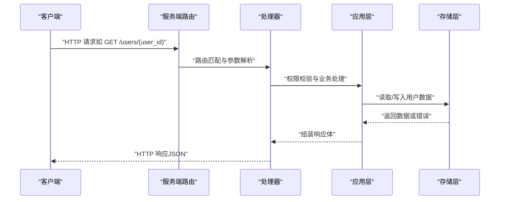
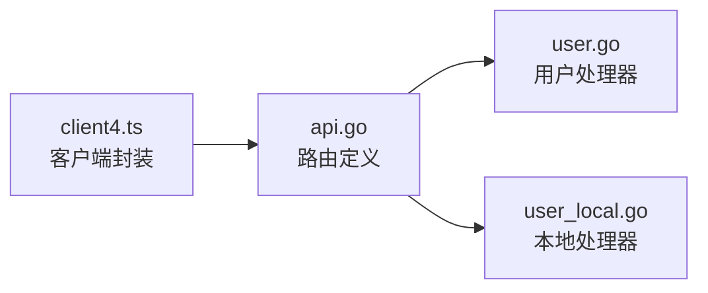

# 用户管理 API

<cite>
**本文档引用的文件**
- [api.go](file://server/channels/api4/api.go)
- [user.go](file://server/channels/api4/user.go)
- [user_local.go](file://server/channels/api4/user_local.go)
- [client4.ts](file://webapp/platform/client/src/client4.ts)
- [users.yaml](file://api/v4/source/users.yaml)
- [definitions.yaml](file://api/v4/source/definitions.yaml)
- [properties.yaml](file://api/v4/source/properties.yaml)
</cite>

## 目录
1. [简介](#简介)
2. [项目结构](#项目结构)
3. [核心组件](#核心组件)
4. [架构概览](#架构概览)
5. [详细组件分析](#详细组件分析)
6. [依赖分析](#依赖分析)
7. [性能考虑](#性能考虑)
8. [故障排除指南](#故障排除指南)
9. [结论](#结论)

## 简介
本文件系统性梳理 Mattermost 用户管理 API，覆盖用户创建、更新、删除、查询、头像管理、密码与认证、角色与权限、批量操作等核心能力。文档基于服务端路由定义与客户端封装实现，提供接口规范、请求/响应示例、权限控制、字段校验与安全注意事项，并给出最佳实践与性能优化建议。

## 项目结构
用户管理 API 主要由以下层次构成：
- 路由层：在服务端通过 `BaseRoutes.Users` 和 `BaseRoutes.User` 定义 `/users` 与 `/users/{user_id}` 前缀下的 REST 资源路径。
- 处理器层：各 HTTP 方法映射到具体处理函数（如 `getUser`、`updateUser`、`deleteUser`、`searchUsers` 等）。
- 客户端封装层：前端通过 `Client4` 类封装对 `/users` 相关端点的调用，便于统一错误处理与类型约束。
- OpenAPI 定义：`users.yaml` 提供了用户相关端点的详细定义、参数与响应模型。

```mermaid
graph TB
subgraph "客户端"
FE_Client4["Client4<br/>用户相关方法"]
end
subgraph "服务端路由"
Routes_Users["/users<br/>集合路由"]
Routes_User["/users/{user_id}<br/>单个用户路由"]
end
subgraph "处理器"
Handler_GetUser["getUser"]
Handler_UpdateUser["updateUser"]
Handler_DeleteUser["deleteUser"]
Handler_SearchUsers["searchUsers"]
Handler_PatchUser["patchUser"]
Handler_UpdateRoles["updateUserRoles"]
Handler_UpdateActive["updateUserActive"]
Handler_UpdatePassword["updatePassword"]
Handler_ResetPassword["resetPassword"]
Handler_SendResetEmail["sendPasswordReset"]
Handler_VerifyEmail["verifyUserEmail"]
Handler_SendVerifyEmail["sendVerificationEmail"]
Handler_PromoteGuest["promoteGuestToUser"]
Handler_DemoteUser["demoteUserToGuest"]
Handler_ConvertToBot["convertUserToBot"]
Handler_MFA["updateUserMfa"]
Handler_Auth["updateUserAuth"]
end
FE_Client4 --> Routes_Users
FE_Client4 --> Routes_User
Routes_Users --> Handler_SearchUsers
Routes_Users --> Handler_ResetPassword
Routes_Users --> Handler_SendResetEmail
Routes_Users --> Handler_VerifyEmail
Routes_Users --> Handler_SendVerifyEmail
Routes_User --> Handler_GetUser
Routes_User --> Handler_UpdateUser
Routes_User --> Handler_PatchUser
Routes_User --> Handler_DeleteUser
Routes_User --> Handler_UpdateRoles
Routes_User --> Handler_UpdateActive
Routes_User --> Handler_UpdatePassword
Routes_User --> Handler_PromoteGuest
Routes_User --> Handler_DemoteUser
Routes_User --> Handler_ConvertToBot
Routes_User --> Handler_MFA
Routes_User --> Handler_Auth
```

**图表来源**
- [api.go:197-198](file://server/channels/api4/api.go#L197-L198)
- [api.go:425-426](file://server/channels/api4/api.go#L425-L426)
- [user.go:35-60](file://server/channels/api4/user.go#L35-L60)
- [user_local.go:31-48](file://server/channels/api4/user_local.go#L31-L48)

**章节来源**
- [api.go:197-198](file://server/channels/api4/api.go#L197-L198)
- [api.go:425-426](file://server/channels/api4/api.go#L425-L426)

## 核心组件
- 用户集合路由：`/users`，支持搜索、统计、批量相关操作。
- 单个用户路由：`/users/{user_id}`，支持用户详情、更新、删除、角色、激活状态、密码、MFA、转换为 Bot 等。
- 客户端封装：`Client4` 类中提供与上述端点对应的调用方法，统一返回类型与错误处理。

关键端点与方法对应关系（以服务端路由为准）：
- GET `/users/{user_id}` → `getUser`
- PUT `/users/{user_id}` → `updateUser`
- PUT `/users/{user_id}/patch` → `patchUser`
- DELETE `/users/{user_id}` → `deleteUser`
- PUT `/users/{user_id}/roles` → `updateUserRoles`
- PUT `/users/{user_id}/active` → `updateUserActive`
- PUT `/users/{user_id}/password` → `updatePassword`
- POST `/users/{user_id}/promote` → `promoteGuestToUser`
- POST `/users/{user_id}/demote` → `demoteUserToGuest`
- POST `/users/{user_id}/convert_to_bot` → `convertUserToBot`
- PUT `/users/{user_id}/mfa` → `updateUserMfa`
- PUT `/users/{user_id}/auth` → `updateUserAuth`
- POST `/users/password/reset` → `resetPassword`
- POST `/users/password/reset/send` → `sendPasswordReset`
- POST `/users/email/verify` → `verifyUserEmail`
- POST `/users/email/verify/send` → `sendVerificationEmail`
- POST `/users/{user_id}/email/verify/member` → `verifyUserEmailWithoutToken`
- POST `/users/{user_id}/terms_of_service` → `saveUserTermsOfService`
- POST `/users/search` → `searchUsers`
- GET `/users/stats` → `getTotalUsersStats`
- GET `/users/stats/filtered` → `getFilteredUsersStats`
- POST `/users/group_channels` → `getUsersByGroupChannelIds`

**章节来源**
- [user.go:35-60](file://server/channels/api4/user.go#L35-L60)
- [user_local.go:31-48](file://server/channels/api4/user_local.go#L31-L48)
- [client4.ts:670-752](file://webapp/platform/client/src/client4.ts#L670-L752)

## 架构概览
用户管理 API 遵循 REST 设计，采用资源化命名与标准 HTTP 方法。客户端通过 `Client4` 统一发起请求，服务端路由将请求分发至相应处理器，处理器完成权限校验、业务逻辑与数据持久化后返回响应。

**图表来源**
- [user.go:35-60](file://server/channels/api4/user.go#L35-L60)
- [user_local.go:31-48](file://server/channels/api4/user_local.go#L31-L48)

## 详细组件分析

### 用户详情与更新
- 获取用户详情
  - 方法：GET
  - 路径：`/users/{user_id}`
  - 功能：返回指定用户的完整信息（字段详见 OpenAPI 定义）
  - 权限：通常需要认证；部分场景可能要求特定权限
  - 响应：用户对象（含基础字段、配置、权限等）

- 更新用户信息
  - 方法：PUT
  - 路径：`/users/{user_id}`
  - 功能：全量更新用户资料（如用户名、邮箱、昵称、头像等）
  - 参数：请求体为用户对象（部分字段可选）
  - 响应：更新后的用户对象

- 部分更新（PATCH）
  - 方法：PUT
  - 路径：`/users/{user_id}/patch`
  - 功能：仅更新传入的变更字段
  - 参数：请求体为变更字段集合
  - 响应：更新后的用户对象

- 删除用户
  - 方法：DELETE
  - 路径：`/users/{user_id}`
  - 功能：删除用户账户（可能涉及软删除或彻底删除策略）
  - 响应：成功状态码

- 设置用户角色
  - 方法：PUT
  - 路径：`/users/{user_id}/roles`
  - 功能：设置用户的角色（系统角色、团队角色、频道角色）
  - 参数：`roles` 字符串（空格分隔）
  - 响应：成功状态码

- 设置用户激活状态
  - 方法：PUT
  - 路径：`/users/{user_id}/active`
  - 功能：启用/禁用用户
  - 参数：`active` 布尔值
  - 响应：成功状态码

- 修改密码
  - 方法：PUT
  - 路径：`/users/{user_id}/password`
  - 功能：当前登录用户修改自己的密码
  - 参数：`current_password`、`new_password`
  - 响应：成功状态码

- 重置密码（管理员/授权用户）
  - 方法：POST
  - 路径：`/users/password/reset`
  - 功能：通过令牌重置用户密码
  - 参数：`token`、`new_password`
  - 响应：成功状态码

- 发送密码重置邮件
  - 方法：POST
  - 路径：`/users/password/reset/send`
  - 功能：向用户邮箱发送重置链接
  - 参数：`email`
  - 响应：成功状态码

- 邮箱验证
  - 方法：POST
  - 路径：`/users/email/verify` 或 `/users/{user_id}/email/verify/member`
  - 功能：验证用户邮箱
  - 参数：根据端点不同，可能为令牌或无需参数
  - 响应：成功状态码

- 同步/本地端点（MFA、认证、访问令牌等）
  - 本地端点：仅允许来自服务器本地的请求
  - 示例：`/users/{user_id}/mfa`、`/users/{user_id}/auth`、`/users/tokens` 等

**章节来源**
- [user.go:35-60](file://server/channels/api4/user.go#L35-L60)
- [user_local.go:31-48](file://server/channels/api4/user_local.go#L31-L48)
- [client4.ts:670-752](file://webapp/platform/client/src/client4.ts#L670-L752)

### 用户搜索与统计
- 搜索用户
  - 方法：POST
  - 路径：`/users/search`
  - 功能：按关键字搜索用户（支持分页与过滤）
  - 参数：请求体包含搜索关键词、限制数量等
  - 响应：用户列表（部分字段）

- 获取用户总数统计
  - 方法：GET
  - 路径：`/users/stats`
  - 功能：返回系统内用户总数等统计信息
  - 响应：统计对象

- 获取筛选后的用户统计
  - 方法：GET
  - 路径：`/users/stats/filtered`
  - 功能：按条件筛选后的用户统计
  - 响应：统计对象

- 按群组频道获取用户
  - 方法：POST
  - 路径：`/users/group_channels`
  - 功能：根据群组频道 ID 列表获取用户
  - 响应：用户列表

**章节来源**
- [user.go:35-39](file://server/channels/api4/user.go#L35-L39)

### 头像管理
- 获取默认头像
  - 方法：GET
  - 路径：`/users/{user_id}/image/default`
  - 功能：返回用户默认头像
  - 响应：图片流

- 获取头像
  - 方法：GET
  - 路径：`/users/{user_id}/image`
  - 功能：返回用户自定义头像
  - 响应：图片流

- 设置头像
  - 方法：POST
  - 路径：`/users/{user_id}/image`
  - 功能：上传用户头像
  - 参数：multipart/form-data，字段名参考服务端实现
  - 响应：成功状态码

- 删除头像
  - 方法：DELETE
  - 路径：`/users/{user_id}/image`
  - 功能：恢复默认头像
  - 响应：成功状态码

**章节来源**
- [user.go:42-45](file://server/channels/api4/user.go#L42-L45)

### 角色与权限
- 设置用户角色
  - 方法：PUT
  - 路径：`/users/{user_id}/roles`
  - 功能：设置用户的角色字符串（空格分隔）
  - 响应：成功状态码

- 权限控制要点
  - 不同端点对调用者权限有不同要求（如管理员、系统级权限）
  - 客户端封装中对敏感操作（如重置密码、修改角色）进行统一处理

**章节来源**
- [user.go:49-49](file://server/channels/api4/user.go#L49-L49)
- [client4.ts:670-752](file://webapp/platform/client/src/client4.ts#L670-L752)

### 批量与导入导出
- 批量用户操作
  - 服务端支持通过集合路由进行批量搜索、统计等
  - 具体批量更新/导入导出需结合系统能力与许可

- 导入/导出
  - 导入：可通过系统提供的导入机制（如 LDAP、CSV 导入）批量创建/同步用户
  - 导出：系统提供导出能力（如审计日志、合规导出），用户数据导出需遵循许可与安全策略

**章节来源**
- [user.go:35-39](file://server/channels/api4/user.go#L35-L39)
- [users.yaml:1307-1307](file://api/v4/source/users.yaml#L1307-L1307)

## 依赖分析
- 路由依赖：`api.go` 中定义了 `/users` 与 `/users/{user_id}` 子路由，后续所有用户相关端点均在此基础上扩展。
- 处理器依赖：`user.go` 与 `user_local.go` 将路由与具体业务处理函数绑定，区分通用与本地专用端点。
- 客户端依赖：`client4.ts` 对应封装了常用用户操作，便于前端统一调用。

**图表来源**
- [api.go:197-198](file://server/channels/api4/api.go#L197-L198)
- [user.go:35-60](file://server/channels/api4/user.go#L35-L60)
- [user_local.go:31-48](file://server/channels/api4/user_local.go#L31-L48)
- [client4.ts:670-752](file://webapp/platform/client/src/client4.ts#L670-L752)

**章节来源**
- [api.go:197-198](file://server/channels/api4/api.go#L197-L198)
- [user.go:35-60](file://server/channels/api4/user.go#L35-L60)
- [user_local.go:31-48](file://server/channels/api4/user_local.go#L31-L48)
- [client4.ts:670-752](file://webapp/platform/client/src/client4.ts#L670-L752)

## 性能考虑
- 分页与限制：搜索与列表接口建议使用分页参数，避免一次性返回大量数据。
- 缓存：头像与用户基本信息可利用浏览器缓存与 CDN 加速。
- 并发控制：批量操作时注意并发度与速率限制，避免对数据库造成压力。
- 过滤与排序：在服务端实现合理的索引与查询计划，减少不必要的全表扫描。

## 故障排除指南
- 权限不足：调用需要管理员权限的端点时，检查当前会话是否具备相应权限。
- 参数校验失败：确认请求体字段类型与长度符合要求（如密码强度、邮箱格式）。
- 令牌失效：重置密码或邮箱验证类端点需确保令牌有效且未过期。
- 本地端点不可用：某些端点仅允许本地访问，若从外部调用会返回错误。

**章节来源**
- [user_local.go:31-48](file://server/channels/api4/user_local.go#L31-L48)

## 结论
Mattermost 用户管理 API 提供了完善的用户生命周期管理能力，涵盖详情、搜索、统计、头像、密码与认证、角色与权限、批量与导入导出等场景。通过清晰的路由设计与客户端封装，开发者可以快速集成用户相关功能。实际部署中应关注权限控制、字段校验与数据安全，并结合性能优化策略提升用户体验。