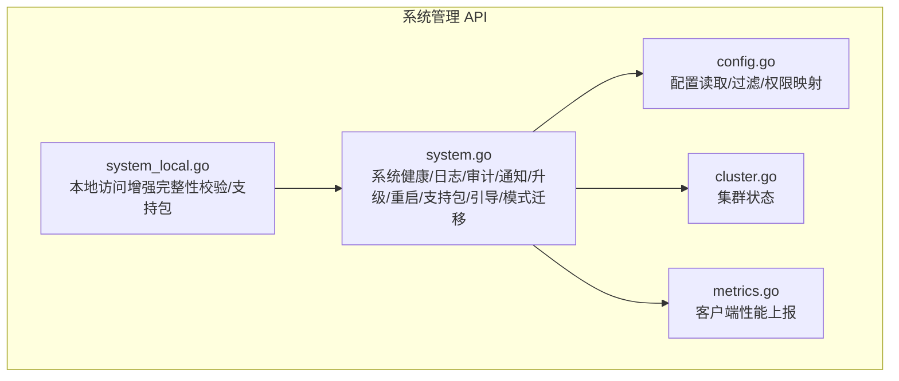
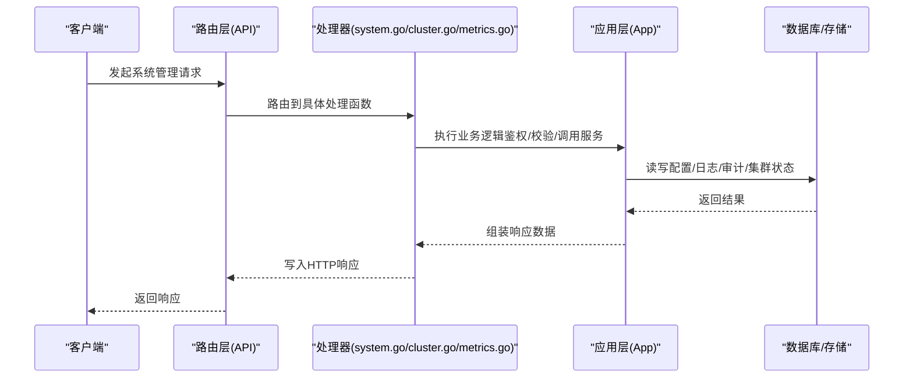
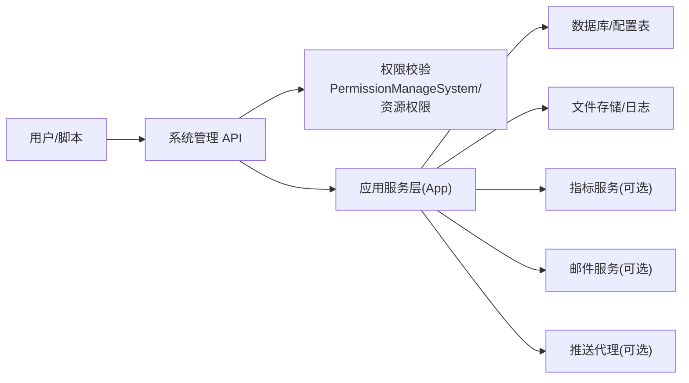

# 系统管理 API

<cite>
**本文引用的文件**
- [system.go](file://server/channels/api4/system.go)
- [system_local.go](file://server/channels/api4/system_local.go)
- [system_test.go](file://server/channels/api4/system_test.go)
- [cluster.go](file://server/channels/api4/cluster.go)
- [metrics.go](file://server/channels/api4/metrics.go)
- [config.go](file://server/channels/api4/config.go)
- [config.go](file://server/public/model/config.go)
- [permission.go](file://server/public/model/permission.go)
- [client4.go](file://server/public/model/client4.go)
</cite>

## 目录
1. [简介](#简介)
2. [项目结构](#项目结构)
3. [核心组件](#核心组件)
4. [架构总览](#架构总览)
5. [详细组件分析](#详细组件分析)
6. [依赖关系分析](#依赖关系分析)
7. [性能考量](#性能考量)
8. [故障排查指南](#故障排查指南)
9. [结论](#结论)
10. [附录](#附录)

## 简介
本文件面向系统管理员与平台工程师，系统性梳理 Mattermost 的系统管理 API，覆盖系统配置、统计信息、健康检查、日志管理、集群状态、性能指标、升级与重启、支持包生成等能力。文档以“端点清单 + 权限模型 + 数据流 + 最佳实践”的方式组织，帮助读者快速定位接口、理解鉴权与安全边界，并在生产环境中安全高效地使用这些 API。

## 项目结构
系统管理 API 主要集中在 channels/api4 子目录中，按功能域拆分：
- system：系统健康、日志、审计、通知、升级、重启、支持包、引导流程、模式迁移版本等
- cluster：高可用集群状态
- metrics：客户端性能上报
- config：系统配置读取与过滤（由 config.go 提供）

图表来源
- [system.go:41-81](file://server/channels/api4/system.go#L41-L81)
- [system_local.go:14-23](file://server/channels/api4/system_local.go#L14-L23)
- [cluster.go:14-38](file://server/channels/api4/cluster.go#L14-L38)
- [metrics.go:13-40](file://server/channels/api4/metrics.go#L13-L40)
- [config.go:38-70](file://server/channels/api4/config.go#L38-L70)

章节来源
- [system.go:41-81](file://server/channels/api4/system.go#L41-L81)
- [system_local.go:14-23](file://server/channels/api4/system_local.go#L14-L23)
- [cluster.go:14-38](file://server/channels/api4/cluster.go#L14-L38)
- [metrics.go:13-40](file://server/channels/api4/metrics.go#L13-L40)
- [config.go:38-70](file://server/channels/api4/config.go#L38-L70)

## 核心组件
- 系统健康与状态
  - GET /system/ping：基础健康检查；可选携带 get_server_status=true 进行数据库/文件存储连通性自检；可携带 device_id 测试推送；可携带 use_rest_semantics=true 使用 REST 语义返回码
  - GET /system/notices/{team_id}：获取产品公告
  - PUT /system/notices/view：标记已阅公告
  - GET /system/onboarding/complete：获取首次管理员引导完成状态
  - POST /system/onboarding/complete：完成首次管理员引导
  - GET /system/schema/version：获取已应用的数据库模式迁移版本列表
- 日志与审计
  - GET /api/logs：获取服务器日志（分页）
  - GET /api/logs/download：下载服务器日志文件
  - POST /api/logs/query：按条件查询日志（解析为 JSON 对象数组）
  - POST /api/logs：客户端侧日志上报（受开发者模式与权限控制）
  - GET /api/audits：获取审计事件（分页）
- 配置与环境
  - GET /api/config/client：获取客户端可见的配置快照（按权限过滤）
  - GET /api/config/environment：获取环境变量注入的配置片段（需特定权限）
  - POST /api/config/reload：重新加载配置
- 通知与推送
  - POST /api/notifications/test：测试通知发送
  - POST /api/notifications/ack：推送 ACK 上报与消息回查
- 升级与重启
  - POST /api/upgrade_to_enterprise：触发企业版升级任务
  - GET /api/upgrade_to_enterprise/status：查询升级进度
  - GET /api/upgrade_to_enterprise/allowed：判断是否允许升级
  - POST /api/restart：触发服务重启
- 高可用与集群
  - GET /cluster/status：获取集群节点状态（高可用环境）
- 性能与监控
  - POST /api/client_perf：提交客户端性能报告（需开启客户端指标）
- 支持与维护
  - POST /api/server_busy：设置服务器忙碌状态（禁用非关键服务）
  - GET /api/server_busy：查询忙碌状态到期时间
  - DELETE /api/server_busy：清除忙碌状态
  - POST /api/integrity：本地完整性校验（仅本地访问）
  - GET /api/support_packet：生成支持包（需许可证）
  - POST /api/email/test：测试邮件发送
  - POST /api/site_url/test：测试站点 URL 可达性
  - POST /api/file/test：测试文件存储连接（兼容旧 S3 名称）
  - POST /api/database/recycle：回收数据库连接
  - POST /api/caches/invalidate：清空缓存
  - GET /api/timezones：获取支持的时区列表
  - GET /api/latest_version：获取最新版本信息

章节来源
- [system.go:41-81](file://server/channels/api4/system.go#L41-L81)
- [system.go:147-231](file://server/channels/api4/system.go#L147-L231)
- [system.go:354-445](file://server/channels/api4/system.go#L354-L445)
- [system.go:83-138](file://server/channels/api4/system.go#L83-L138)
- [system.go:805-866](file://server/channels/api4/system.go#L805-L866)
- [system.go:868-996](file://server/channels/api4/system.go#L868-L996)
- [system.go:998-1088](file://server/channels/api4/system.go#L998-L1088)
- [system.go:1090-1115](file://server/channels/api4/system.go#L1090-L1115)
- [system_local.go:14-23](file://server/channels/api4/system_local.go#L14-L23)
- [cluster.go:14-38](file://server/channels/api4/cluster.go#L14-L38)
- [metrics.go:13-40](file://server/channels/api4/metrics.go#L13-L40)
- [config.go:38-70](file://server/channels/api4/config.go#L38-L70)

## 架构总览
系统管理 API 的典型调用链路如下：

图表来源
- [system.go:147-231](file://server/channels/api4/system.go#L147-L231)
- [cluster.go:18-38](file://server/channels/api4/cluster.go#L18-L38)
- [metrics.go:17-40](file://server/channels/api4/metrics.go#L17-L40)

## 详细组件分析

### 健康检查与状态
- 端点：GET /system/ping
- 请求参数
  - get_server_status: true/false，是否执行数据库/文件存储连通性自检
  - device_id: 设备ID，用于测试推送可达性
  - use_rest_semantics: true/false，是否使用 REST 语义返回码（健康为 200，不健康为 500）
- 响应字段
  - status: 健康状态（如 Ok/Unhealthy）
  - AndroidLatestVersion/IosLatestVersion 等版本信息
  - TestFeatureFlag：特性开关（来自环境变量覆盖）
  - database_status/filestore_status：当启用完整健康检查时返回
  - root_status：仅系统管理员可见，指示进程是否以 root 运行
  - CanReceiveNotifications：当携带 device_id 时返回推送可达性
  - ActiveSearchBackend：当前活跃的搜索后端
- 权限与安全
  - 无需登录即可访问；完整健康检查需要系统管理员权限
  - 当健康状态异常且未使用 REST 语义时，返回 500

章节来源
- [system.go:147-231](file://server/channels/api4/system.go#L147-L231)
- [client4.go:4354-4369](file://server/public/model/client4.go#L4354-L4369)

### 日志管理
- 端点
  - GET /api/logs：获取日志列表（分页）
  - GET /api/logs/download：下载日志文件
  - POST /api/logs/query：按过滤条件查询日志（返回 JSON 数组）
  - POST /api/logs：客户端日志上报
- 请求与响应
  - GET /api/logs：返回字符串数组（每行为一条日志）
  - GET /api/logs/download：返回二进制文件流（Content-Disposition 指定文件名）
  - POST /api/logs/query：请求体为过滤对象，响应体为按节点聚合的日志 JSON 数组
  - POST /api/logs：请求体为 {level, message}，返回标准化后的消息
- 权限与安全
  - 需具备“获取日志”权限；受限管理员模式下默认禁止
  - 客户端日志上报受开发者模式与权限控制，错误级别会提升到 ERROR 记录

章节来源
- [system.go:354-445](file://server/channels/api4/system.go#L354-L445)
- [system.go:447-494](file://server/channels/api4/system.go#L447-L494)

### 审计事件
- 端点：GET /api/audits
- 请求参数
  - page/per_page：分页参数
- 响应：审计事件列表（含时间、用户、操作、IP 等元数据）
- 权限：需具备“读取审计”权限

章节来源
- [system.go:294-316](file://server/channels/api4/system.go#L294-L316)

### 配置管理
- 端点
  - GET /api/config/client：获取客户端可见配置快照（按权限过滤）
  - GET /api/config/environment：获取环境注入配置片段（按资源维度）
  - POST /api/config/reload：重新加载配置
- 权限与过滤
  - 配置读取按“可写/可读”标签与系统控制台权限进行字段级过滤
  - 管理员权限（PermissionManageSystem）默认放行读取
  - 实验性限制：当启用 RestrictSystemAdmin 且字段带 write_restrictable/cloud_restrictable 标签时，写操作可能受限或仅本地模式允许
- 响应：JSON 格式的配置对象（按过滤规则裁剪）

章节来源
- [config.go:38-70](file://server/channels/api4/config.go#L38-L70)
- [config.go:433-460](file://server/channels/api4/config.go#L433-L460)
- [config.go:4107-4127](file://server/public/model/config.go#L4107-L4127)

### 通知与推送
- 端点
  - POST /api/notifications/test：测试通知发送
  - POST /api/notifications/ack：推送 ACK 上报与消息回查
- 行为
  - ACK 接口在启用推送时生效；若携带 PostId 且为消息类型，可回查消息内容并记录审计

章节来源
- [system.go:233-241](file://server/channels/api4/system.go#L233-L241)
- [system.go:705-803](file://server/channels/api4/system.go#L705-L803)

### 升级与重启
- 端点
  - POST /api/upgrade_to_enterprise：触发企业版升级（异步任务）
  - GET /api/upgrade_to_enterprise/status：查询升级进度
  - GET /api/upgrade_to_enterprise/allowed：判断是否允许升级
  - POST /api/restart：触发服务重启
- 行为
  - 升级前进行权限与架构校验；成功后返回 202 Accepted
  - 重启接口先返回 200，随后在后台线程执行重启

章节来源
- [system.go:868-996](file://server/channels/api4/system.go#L868-L996)

### 高可用与集群
- 端点：GET /cluster/status
- 响应：集群节点状态信息（如主机名、监听地址、在线状态等）
- 权限：需具备“高可用环境读取”权限

章节来源
- [cluster.go:18-38](file://server/channels/api4/cluster.go#L18-L38)

### 客户端性能指标
- 端点：POST /api/client_perf
- 行为：接收客户端性能报告，需开启客户端指标与服务端指标基础设施
- 响应：成功返回 200 OK

章节来源
- [metrics.go:17-40](file://server/channels/api4/metrics.go#L17-L40)

### 支持包与维护
- 端点
  - GET /api/support_packet：生成支持包（ZIP），需许可证
  - POST /api/server_busy：设置服务器忙碌状态（禁用非关键服务）
  - GET /api/server_busy：查询忙碌状态到期时间
  - DELETE /api/server_busy：清除忙碌状态
  - POST /api/integrity：本地完整性校验（仅本地访问）
  - POST /api/email/test：测试邮件发送
  - POST /api/site_url/test：测试站点 URL 可达性
  - POST /api/file/test：测试文件存储连接（兼容旧 S3 名称）
  - POST /api/database/recycle：回收数据库连接
  - POST /api/caches/invalidate：清空缓存
  - GET /api/timezones：获取支持的时区列表
  - GET /api/latest_version：获取最新版本信息
- 权限与安全
  - 支持包生成需系统管理员与有效许可证；受限管理员模式下默认禁止
  - 服务器忙碌状态仅系统管理员可设置/清除
  - 本地完整性校验仅本地访问可用

章节来源
- [system.go:83-138](file://server/channels/api4/system.go#L83-L138)
- [system.go:805-866](file://server/channels/api4/system.go#L805-L866)
- [system_local.go:14-23](file://server/channels/api4/system_local.go#L14-L23)
- [system.go:233-292](file://server/channels/api4/system.go#L233-L292)
- [system.go:525-546](file://server/channels/api4/system.go#L525-L546)
- [system.go:548-563](file://server/channels/api4/system.go#L548-L563)

## 依赖关系分析
- 权限模型
  - 系统管理 API 多数需要系统管理员权限（PermissionManageSystem）
  - 部分资源型端点通过“系统控制台读取/写入 + 资源标签”进行细粒度授权
  - 受限管理员模式（ExperimentalSettings.RestrictSystemAdmin）下，部分写操作被限制
- 外部依赖
  - 数据库：健康检查、审计、配置持久化
  - 文件存储：日志文件、支持包打包
  - 指标服务：客户端性能上报
  - 邮件/推送：通知测试与 ACK 回传

图表来源
- [config.go:433-460](file://server/channels/api4/config.go#L433-L460)
- [config.go:4107-4127](file://server/public/model/config.go#L4107-L4127)
- [permission.go:1661-1712](file://server/public/model/permission.go#L1661-L1712)

章节来源
- [config.go:433-460](file://server/channels/api4/config.go#L433-L460)
- [config.go:4107-4127](file://server/public/model/config.go#L4107-L4127)
- [permission.go:1661-1712](file://server/public/model/permission.go#L1661-L1712)

## 性能考量
- 健康检查
  - 完整健康检查会进行数据库写入/删除与文件存储连通性测试，建议仅在必要时启用
  - 可通过 goroutine 健康阈值检测过载情况，及时调整资源配置
- 日志查询
  - 查询接口会对日志逐行解析为 JSON，建议合理设置过滤条件与分页大小
  - 下载日志适合离线分析，避免在高峰时段频繁拉取
- 指标上报
  - 客户端性能上报需开启客户端指标与服务端指标基础设施，避免不必要的开销
- 缓存与连接
  - 清空缓存与回收数据库连接会短暂影响性能，建议在低峰期执行

## 故障排查指南
- 健康检查返回 500
  - 检查 get_server_status 参数是否启用；查看 database_status 与 filestore_status 字段
  - 确认数据库写入/删除权限与文件存储连接正常
- 支持包生成失败
  - 确认服务器持有有效许可证；受限管理员模式下默认禁止
  - 检查磁盘空间与压缩库可用性
- 日志查询为空或异常
  - 确认过滤条件与分页参数；检查日志级别与输出路径
- 配置更新无效
  - 确认使用 /api/config/reload 重新加载；检查权限与受限管理员策略
- 通知/推送问题
  - 使用 /api/notifications/test 进行自检；确认推送代理配置与 ACK 回传链路

章节来源
- [system.go:147-231](file://server/channels/api4/system.go#L147-L231)
- [system.go:354-445](file://server/channels/api4/system.go#L354-L445)
- [system.go:83-138](file://server/channels/api4/system.go#L83-L138)
- [system.go:233-241](file://server/channels/api4/system.go#L233-L241)

## 结论
系统管理 API 为 Mattermost 平台提供了从健康检查、日志审计、配置管理到集群状态、性能监控与运维维护的全栈能力。通过严格的权限模型与可配置的受限管理员策略，确保在开放生态中保持安全可控。建议在生产环境中结合健康阈值、离峰维护窗口与最小权限原则，实现稳定高效的系统治理。

## 附录

### 权限与资源映射速查
- 系统管理员：PermissionManageSystem（多数端点默认放行）
- 资源型权限：sysconsole_read_* / sysconsole_write_*（按资源维度细分）
- 示例（节选）
  - 环境：高可用、速率限制、日志、会话长度、性能监控、开发者、移动安全
  - 报告：站点统计、团队统计
  - 其他：关于/许可、认证、合规、插件、实验性等

章节来源
- [permission.go:1661-1712](file://server/public/model/permission.go#L1661-L1712)
- [permission.go:1908-1955](file://server/public/model/permission.go#L1908-L1955)
- [permission.go:2091-2140](file://server/public/model/permission.go#L2091-L2140)

### 请求/响应示例（路径与要点）
- GET /system/ping
  - 请求：无；可选参数 get_server_status/use_rest_semantics/device_id
  - 响应：包含 status、版本信息、可选 database_status/filestore_status/root_status/CanReceiveNotifications
  - 参考：[system.go:147-231](file://server/channels/api4/system.go#L147-L231)
- POST /api/logs/query
  - 请求体：过滤对象（如时间范围、关键字、级别）
  - 响应：按节点聚合的日志 JSON 数组
  - 参考：[system.go:354-395](file://server/channels/api4/system.go#L354-L395)
- GET /api/audits
  - 请求：page/per_page
  - 响应：审计事件列表
  - 参考：[system.go:294-316](file://server/channels/api4/system.go#L294-L316)
- POST /api/upgrade_to_enterprise
  - 请求：无；返回 202 Accepted 后异步执行
  - 参考：[system.go:868-928](file://server/channels/api4/system.go#L868-L928)
- GET /cluster/status
  - 请求：无
  - 响应：集群节点状态信息
  - 参考：[cluster.go:18-38](file://server/channels/api4/cluster.go#L18-L38)
- POST /api/client_perf
  - 请求体：性能报告对象
  - 响应：200 OK
  - 参考：[metrics.go:17-40](file://server/channels/api4/metrics.go#L17-L40)