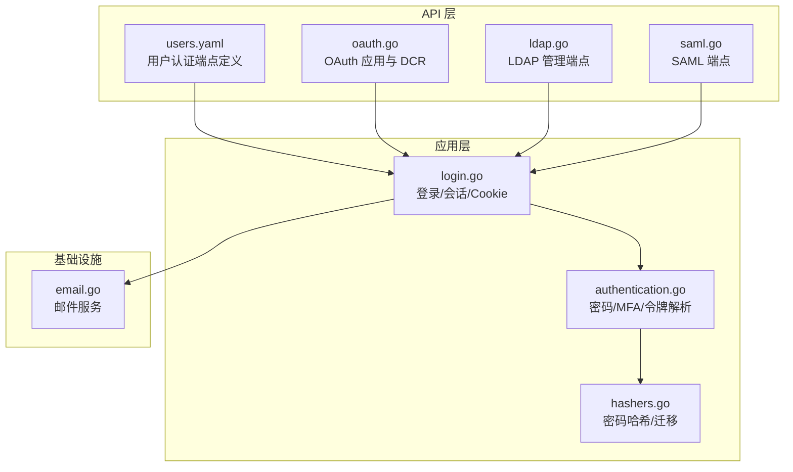
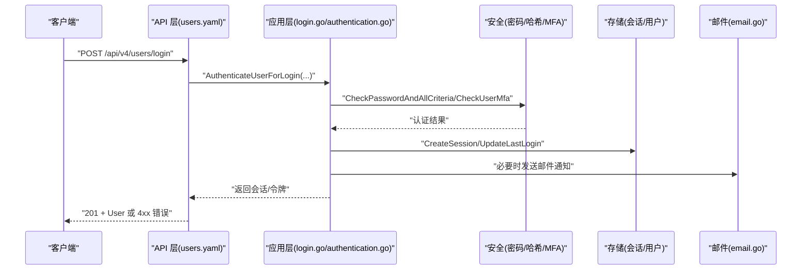
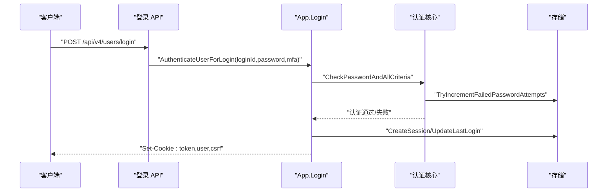
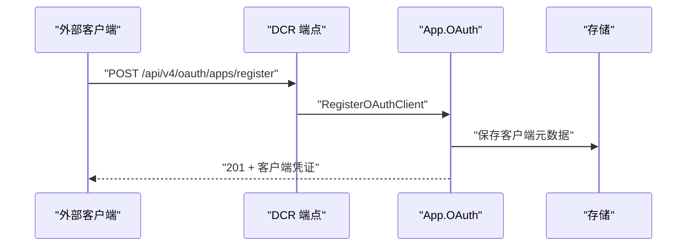
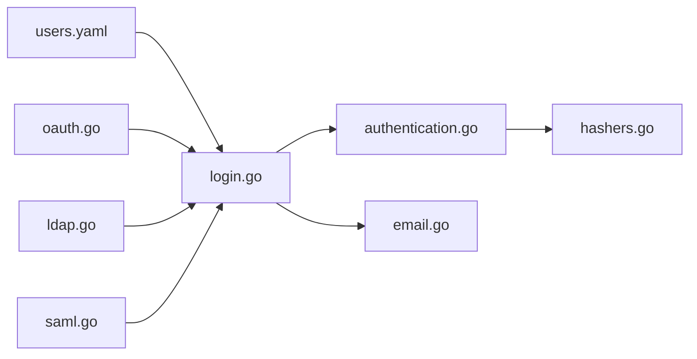

# 认证与授权 API

<cite>
**本文引用的文件**
- [authentication.go](file://server/channels/app/authentication.go)
- [login.go](file://server/channels/app/login.go)
- [oauth.go](file://server/channels/api4/oauth.go)
- [ldap.go](file://server/channels/api4/ldap.go)
- [users.yaml](file://api/v4/source/users.yaml)
- [saml.go](file://server/channels/api4/saml.go)
- [email.go](file://server/channels/app/email/email.go)
- [hashers.go](file://server/channels/app/password/hashers/hashers.go)
- [bcrypt.go](file://server/channels/app/password/hashers/bcrypt.go)
- [pbkdf2.go](file://server/channels/app/password/hashers/pbkdf2.go)
- [parser.go](file://server/channels/app/password/phcparser/parser.go)
</cite>

## 目录
1. [简介](#简介)
2. [项目结构](#项目结构)
3. [核心组件](#核心组件)
4. [架构总览](#架构总览)
5. [详细组件分析](#详细组件分析)
6. [依赖关系分析](#依赖关系分析)
7. [性能考量](#性能考量)
8. [故障排查指南](#故障排查指南)
9. [结论](#结论)
10. [附录](#附录)

## 简介
本文件系统性梳理 Mattermost 的认证与授权 API，覆盖用户登录、登出、密码重置、邮箱验证、会话管理、令牌刷新、多因素认证（MFA）、以及多种认证方式（用户名/密码、OAuth/OpenID Connect、LDAP/SAML、Intune/Microsoft Entra ID）的端到端流程。文档基于仓库中的 OpenAPI 定义与后端实现，提供各端点的 HTTP 方法、URL 模式、请求参数、响应格式、错误码与安全注意事项，并给出最佳实践与排障建议。

## 项目结构
围绕认证与授权的关键目录与文件：
- OpenAPI 定义：api/v4/source/users.yaml 提供用户相关端点的路径、参数与响应规范
- 登录与会话：server/channels/app/login.go 实现登录、会话创建与 Cookie 注入
- 认证核心：server/channels/app/authentication.go 实现密码校验、MFA、登录尝试限制、令牌解析
- 密码哈希：server/channels/app/password/hashers/* 提供 PBKDF2、bcrypt 及 PHC 解析
- 邮件通知：server/channels/app/email/email.go 提供邮件发送与模板
- OAuth：server/channels/api4/oauth.go 提供 OAuth 应用管理与动态客户端注册
- LDAP/SAML：server/channels/api4/ldap.go 与 server/channels/api4/saml.go 提供企业级认证集成

图示来源
- [users.yaml](file://api/v4/source/users.yaml)
- [login.go](file://server/channels/app/login.go)
- [authentication.go](file://server/channels/app/authentication.go)
- [hashers.go](file://server/channels/app/password/hashers/hashers.go)
- [oauth.go](file://server/channels/api4/oauth.go)
- [ldap.go](file://server/channels/api4/ldap.go)
- [saml.go](file://server/channels/api4/saml.go)
- [email.go](file://server/channels/app/email/email.go)

章节来源
- [users.yaml](file://api/v4/source/users.yaml)
- [login.go](file://server/channels/app/login.go)
- [authentication.go](file://server/channels/app/authentication.go)

## 核心组件
- 用户认证与登录
  - 支持用户名/邮箱 + 密码登录；支持 LDAP/SAML 登录；支持 Intune MAM 登录
  - 登录成功后创建会话、设置 Cookie、注入 CSRF
- 会话与令牌
  - 令牌来源：Header(Bearer)/Token、Cookie(SessionToken/User/CSRF)、Query(access_token)、Cloud/RemoteCluster Header
  - 会话时长按设备/平台/SSO 类型配置
- 多因素认证（MFA）
  - 基于 TOTP 的二次校验；可强制策略（EnforceMultifactorAuthentication）
- 密码安全
  - 密码哈希与迁移（PBKDF2、bcrypt），PHC 字符串解析
- OAuth/OpenID Connect
  - OAuth 应用管理（创建/更新/删除/密钥轮换）
  - 动态客户端注册（DCR，RFC 7591），受限于配置开关
- LDAP/SAML
  - LDAP 连接测试、证书上传、组同步、诊断
  - SAML 集成端点（含已弃用的 SSO 代码交换）

章节来源
- [login.go](file://server/channels/app/login.go)
- [authentication.go](file://server/channels/app/authentication.go)
- [oauth.go](file://server/channels/api4/oauth.go)
- [ldap.go](file://server/channels/api4/ldap.go)
- [users.yaml](file://api/v4/source/users.yaml)

## 架构总览
下图展示从客户端到后端认证流程的关键交互与模块职责：

图示来源
- [users.yaml](file://api/v4/source/users.yaml)
- [login.go](file://server/channels/app/login.go)
- [authentication.go](file://server/channels/app/authentication.go)
- [email.go](file://server/channels/app/email/email.go)

## 详细组件分析

### 用户登录与会话管理
- 端点与方法
  - POST /api/v4/users/login：用户名/邮箱 + 密码登录
  - POST /api/v4/users/login/desktop_token：桌面短令牌登录
  - POST /api/v4/users/login/cws：CWS 自动登录（云实例）
  - POST /api/v4/users/logout：退出登录
- 请求参数
  - login_id：用户名或邮箱
  - password：明文密码（非 SSO）
  - device_id：移动端设备标识
  - ldap_only：仅 LDAP 登录
  - magic_link_token：魔法链接一次性令牌（来宾免密）
  - token：桌面令牌
  - cws_token：CWS 令牌
- 成功响应
  - 201：返回用户对象（敏感字段被清理）
- 典型错误
  - 400：缺少必填参数、密码为空、无效 JSON
  - 401：凭据错误、未通过邮箱验证、账户禁用
  - 403：权限不足、MFA 强制但未满足
- 会话与 Cookie
  - 登录成功后写入 Cookie：SessionToken、User、CSRF
  - CSRF 令牌生成并随会话下发
  - 移动端/SSO/桌面会话时长由配置决定
- 安全要点
  - HTTPS 下 Secure Cookie；跨域场景 SameSite=None
  - 登录失败计数与速率限制（MaximumLoginAttempts）
  - MFA 强制策略（EnforceMultifactorAuthentication）

图示来源
- [users.yaml](file://api/v4/source/users.yaml)
- [login.go](file://server/channels/app/login.go)
- [authentication.go](file://server/channels/app/authentication.go)

章节来源
- [users.yaml](file://api/v4/source/users.yaml)
- [login.go](file://server/channels/app/login.go)
- [authentication.go](file://server/channels/app/authentication.go)

### 密码重置与邮箱验证
- 端点与方法
  - POST /api/v4/users/password/reset：使用一次性重置码重置密码（非 SSO）
- 请求参数
  - token：一次性重置码
  - new_password：新密码（长度与强度受配置约束）
- 成功响应
  - 200：重置成功
- 典型错误
  - 400：参数无效、密码不合规
  - 401：令牌过期或无效
  - 403：权限不足
- 邮箱验证
  - 登录前若启用 RequireEmailVerification，未验证邮箱将拒绝登录
  - 邮件服务由 email.go 提供，支持批量与模板化通知

章节来源
- [users.yaml](file://api/v4/source/users.yaml)
- [email.go](file://server/channels/app/email/email.go)

### 多因素认证（MFA）
- 触发条件
  - EnableMultifactorAuthentication 开启且用户已激活 MFA
  - EnforceMultifactorAuthentication 强制策略
  - OAuth/SAML/来宾用户例外
- 校验流程
  - 登录阶段传入 mfa_token；服务端验证 TOTP
  - 首次登录探测（空 mfa_token）不计入失败次数
- 失败处理
  - 423 Locked：MFA 强制但未满足
  - 400：令牌格式错误
  - 401：令牌无效

章节来源
- [authentication.go](file://server/channels/app/authentication.go)

### 密码哈希与迁移
- 支持算法
  - PBKDF2、bcrypt；PHC 字符串解析与兼容
- 迁移策略
  - 验证通过后自动迁移到最新哈希算法并更新数据库
- 安全建议
  - 启用 FIPS 模式（如适用）
  - 定期评估与升级哈希参数

章节来源
- [hashers.go](file://server/channels/app/password/hashers/hashers.go)
- [bcrypt.go](file://server/channels/app/password/hashers/bcrypt.go)
- [pbkdf2.go](file://server/channels/app/password/hashers/pbkdf2.go)
- [parser.go](file://server/channels/app/password/phcparser/parser.go)

### OAuth/OpenID Connect
- OAuth 应用管理
  - 创建/更新/删除/查询 OAuth 应用
  - 密钥轮换（公有客户端不可轮换）
  - 权限控制：manage_oauth、manage_system_wide_oauth
- 动态客户端注册（DCR，RFC 7591）
  - 无需会话即可注册外部客户端
  - 受 EnableOAuthServiceProvider 与 EnableDynamicClientRegistration 控制
  - Redirect URI 白名单校验
- 响应
  - 201：创建成功
  - 400：请求无效、未启用 DCR、URI 不在白名单
  - 403：权限不足

图示来源
- [oauth.go](file://server/channels/api4/oauth.go)

章节来源
- [oauth.go](file://server/channels/api4/oauth.go)

### LDAP 与 SAML
- LDAP
  - 连接测试、证书上传/删除、组同步、诊断
  - 支持首次登录创建用户、失败计数与速率限制
- SAML
  - 集成端点（含已弃用的 SSO 代码交换）
  - 与 LDAP 组同步联动（可选）

章节来源
- [ldap.go](file://server/channels/api4/ldap.go)
- [saml.go](file://server/channels/api4/saml.go)

### 令牌解析与 CSRF
- 令牌来源优先级
  - Cookie(SessionCookieToken) > Header(Bearer/Token) > Query(access_token) > Cloud/RemoteCluster Header
- CSRF
  - 每个会话生成独立 CSRF，随会话下发并在 Cookie 中携带
  - 跨域场景 SameSite=None（HTTPS + Embedded Cookie）

章节来源
- [authentication.go](file://server/channels/app/authentication.go)
- [login.go](file://server/channels/app/login.go)

## 依赖关系分析
- 认证链路
  - users.yaml -> login.go -> authentication.go -> hashers.go
  - OAuth/SAML/LDAP 作为外部身份源，通过各自 API 层对接
- 存储与会话
  - 用户、会话、令牌、失败计数均持久化至存储层
- 邮件服务
  - 登录、密码重置、邀请等流程触发邮件通知

图示来源
- [users.yaml](file://api/v4/source/users.yaml)
- [login.go](file://server/channels/app/login.go)
- [authentication.go](file://server/channels/app/authentication.go)
- [hashers.go](file://server/channels/app/password/hashers/hashers.go)
- [oauth.go](file://server/channels/api4/oauth.go)
- [ldap.go](file://server/channels/api4/ldap.go)
- [saml.go](file://server/channels/api4/saml.go)
- [email.go](file://server/channels/app/email/email.go)

章节来源
- [users.yaml](file://api/v4/source/users.yaml)
- [login.go](file://server/channels/app/login.go)
- [authentication.go](file://server/channels/app/authentication.go)

## 性能考量
- 会话时长差异化
  - 移动端、SSO、Web 分别配置不同的 SessionLength*InHours，避免不必要的长会话
- 登录尝试限制
  - MaximumLoginAttempts 限制失败次数，防止暴力破解
- 并发与异步
  - LDAP 头像更新、插件钩子在后台协程执行，不影响主流程
- 密码哈希成本
  - 选择合适的哈希参数，平衡安全与性能

## 故障排查指南
- 常见错误与定位
  - 400：检查请求体 JSON、必填字段、密码强度
  - 401：核对凭据、邮箱验证状态、MFA 令牌
  - 403：确认权限与强制策略（MFA/SSO）
  - 423：MFA 强制但未满足
- 登录失败排查
  - 查看 FailedAttempts 与 MaximumLoginAttempts 配置
  - 检查 LDAP/SAML 连接与证书
- 令牌问题
  - 确认 Cookie 是否随请求发送；跨域 SameSite 设置
  - 校验 Header Authorization 格式（Bearer/Token）
- 邮件问题
  - 检查 SMTP 配置与模板渲染

章节来源
- [authentication.go](file://server/channels/app/authentication.go)
- [login.go](file://server/channels/app/login.go)
- [ldap.go](file://server/channels/api4/ldap.go)
- [email.go](file://server/channels/app/email/email.go)

## 结论
Mattermost 的认证体系以 OpenAPI 明确端点契约，后端通过统一的认证核心完成密码校验、MFA、令牌解析与会话管理，并与 OAuth、LDAP/SAML 等外部身份源深度集成。遵循本文的安全建议与最佳实践，可在保证用户体验的同时提升系统的安全性与稳定性。

## 附录
- 最佳实践
  - 强制启用 HTTPS 与 CSRF 保护
  - 启用并合理配置 MFA 强制策略
  - 使用 OAuth DCR 时严格校验 Redirect URI 白名单
  - 定期轮换 OAuth 应用密钥（公有客户端除外）
  - 合理设置 MaximumLoginAttempts 与会话时长
  - 对 LDAP/SAML 进行定期连接与诊断测试
- 安全建议
  - 限制访问来源与 IP 过滤
  - 定期审计认证日志与会话
  - 使用强密码策略与定期更换
  - 对敏感操作（删除、角色变更）增加二次确认与审计