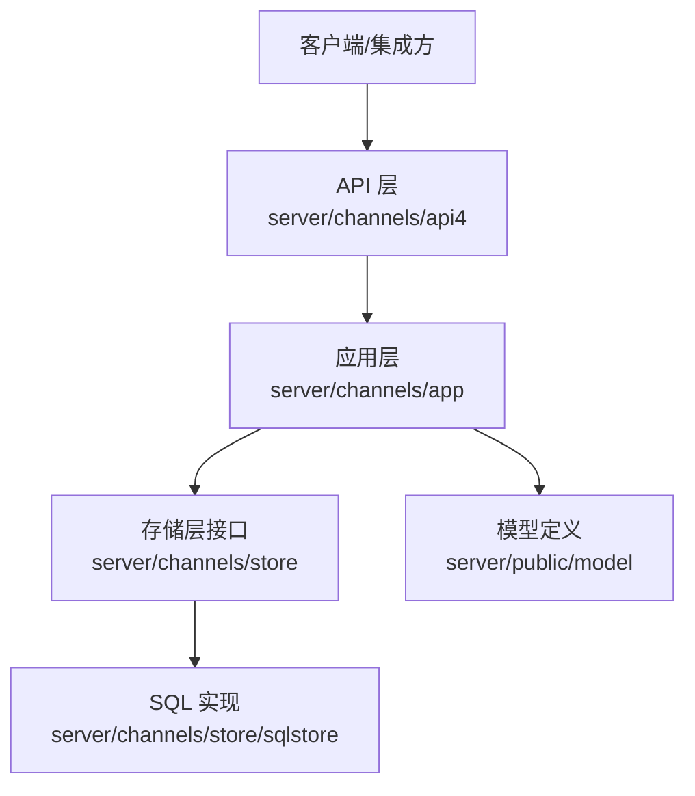
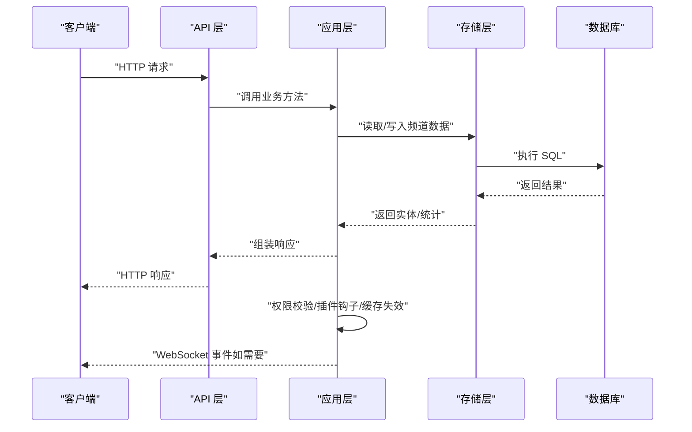
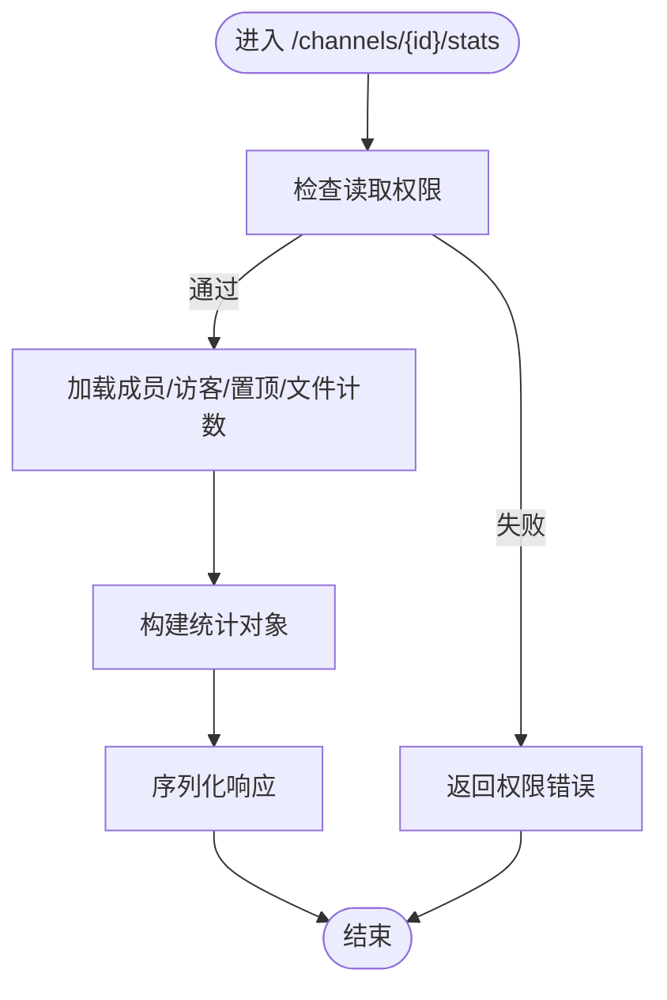
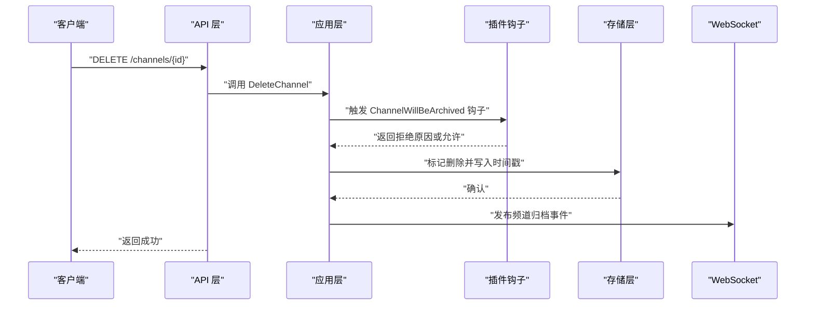
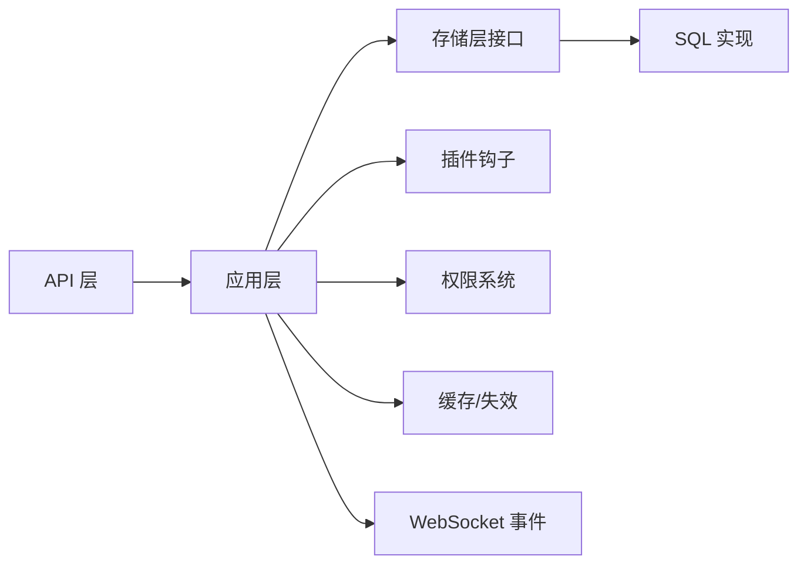

# 频道管理 API

<cite>
**本文引用的文件**
- [server/channels/api4/channel.go](file://server/channels/api4/channel.go)
- [server/channels/api4/api.go](file://server/channels/api4/api.go)
- [server/public/model/channel.go](file://server/public/model/channel.go)
- [server/channels/app/channel.go](file://server/channels/app/channel.go)
- [server/channels/store/store.go](file://server/channels/store/store.go)
- [server/channels/store/sqlstore/store.go](file://server/channels/store/sqlstore/store.go)
- [server/channels/app/channels.go](file://server/channels/app/channels.go)
- [api/v4/source/channels.yaml](file://api/v4/source/channels.yaml)
- [api/v4/source/posts.yaml](file://api/v4/source/posts.yaml)
- [api/v4/source/teams.yaml](file://api/v4/source/teams.yaml)
- [api/v4/source/users.yaml](file://api/v4/source/users.yaml)
- [api/v4/source/preferences.yaml](file://api/v4/source/preferences.yaml)
- [api/v4/source/webhooks.yaml](file://api/v4/source/webhooks.yaml)
- [api/v4/source/groups.yaml](file://api/v4/source/groups.yaml)
- [api/v4/source/roles.yaml](file://api/v4/source/roles.yaml)
- [api/v4/source/schemes.yaml](file://api/v4/source/schemes.yaml)
- [api/v4/source/system.yaml](file://api/v4/source/system.yaml)
- [api/v4/source/jobs.yaml](file://api/v4/source/jobs.yaml)
- [api/v4/source/uploads.yaml](file://api/v4/source/uploads.yaml)
- [api/v4/source/logs.yaml](file://api/v4/source/logs.yaml)
- [api/v4/source/metrics.yaml](file://api/v4/source/metrics.yaml)
- [api/v4/source/usage.yaml](file://api/v4/source/usage.yaml)
- [api/v4/source/dataretention.yaml](file://api/v4/source/dataretention.yaml)
- [api/v4/source/compliance.yaml](file://api/v4/source/compliance.yaml)
- [api/v4/source/exports.yaml](file://api/v4/source/exports.yaml)
- [api/v4/source/imports.yaml](file://api/v4/source/imports.yaml)
- [api/v4/source/cloud.yaml](file://api/v4/source/cloud.yaml)
- [api/v4/source/cluster.yaml](file://api/v4/source/cluster.yaml)
- [api/v4/source/oauth.yaml](file://api/v4/source/oauth.yaml)
- [api/v4/source/saml.yaml](file://api/v4/source/saml.yaml)
- [api/v4/source/ldap.yaml](file://api/v4/source/ldap.yaml)
- [api/v4/source/ip_filters.yaml](file://api/v4/source/ip_filters.yaml)
- [api/v4/source/audit_logging.yaml](file://api/v4/source/audit_logging.yaml)
- [api/v4/source/access_control.yaml](file://api/v4/source/access_control.yaml)
- [api/v4/source/brand.yaml](file://api/v4/source/brand.yaml)
- [api/v4/source/emoji.yaml](file://api/v4/source/emoji.yaml)
- [api/v4/source/files.yaml](file://api/v4/source/files.yaml)
- [api/v4/source/status.yaml](file://api/v4/source/status.yaml)
- [api/v4/source/system.yaml](file://api/v4/source/system.yaml)
- [api/v4/source/teams.yaml](file://api/v4/source/teams.yaml)
- [api/v4/source/views.yaml](file://api/v4/source/views.yaml)
- [api/v4/source/webhooks.yaml](file://api/v4/source/webhooks.yaml)
- [api/v4/source/agents.yaml](file://api/v4/source/agents.yaml)
- [api/v4/source/bots.yaml](file://api/v4/source/bots.yaml)
- [api/v4/source/boards.yaml](file://api/v4/source/boards.yaml)
- [api/v4/source/bookmarks.yaml](file://api/v4/source/bookmarks.yaml)
- [api/v4/source/commands.yaml](file://api/v4/source/commands.yaml)
- [api/v4/source/content_flagging.yaml](file://api/v4/source/content_flagging.yaml)
- [api/v4/source/custom_profile_attributes.yaml](file://api/v4/source/custom_profile_attributes.yaml)
- [api/v4/source/elasticsearch.yaml](file://api/v4/source/elasticsearch.yaml)
- [api/v4/source/jobs.yaml](file://api/v4/source/jobs.yaml)
- [api/v4/source/limits.yaml](file://api/v4/source/limits.yaml)
- [api/v4/source/metrics.yaml](file://api/v4/source/metrics.yaml)
- [api/v4/source/permissions.yaml](file://api/v4/source/permissions.yaml)
- [api/v4/source/plugins.yaml](file://api/v4/source/plugins.yaml)
- [api/v4/source/reactions.yaml](file://api/v4/source/reactions.yaml)
- [api/v4/source/recaps.yaml](file://api/v4/source/recaps.yaml)
- [api/v4/source/remoteclusters.yaml](file://api/v4/source/remoteclusters.yaml)
- [api/v4/source/reports.yaml](file://api/v4/source/reports.yaml)
- [api/v4/source/roles.yaml](file://api/v4/source/roles.yaml)
- [api/v4/source/saml.yaml](file://api/v4/source/saml.yaml)
- [api/v4/source/scheduled_post.yaml](file://api/v4/source/scheduled_post.yaml)
- [api/v4/source/schemes.yaml](file://api/v4/source/schemes.yaml)
- [api/v4/source/service_terms.yaml](file://api/v4/source/service_terms.yaml)
- [api/v4/source/sharedchannels.yaml](file://api/v4/source/sharedchannels.yaml)
- [api/v4/source/status.yaml](file://api/v4/source/status.yaml)
- [api/v4/source/system.yaml](file://api/v4/source/system.yaml)
- [api/v4/source/teams.yaml](file://api/v4/source/teams.yaml)
- [api/v4/source/uploads.yaml](file://api/v4/source/uploads.yaml)
- [api/v4/source/usage.yaml](file://api/v4/source/usage.yaml)
- [api/v4/source/users.yaml](file://api/v4/source/users.yaml)
- [api/v4/source/views.yaml](file://api/v4/source/views.yaml)
- [api/v4/source/webhooks.yaml](file://api/v4/source/webhooks.yaml)
</cite>

## 目录
1. [简介](#简介)
2. [项目结构](#项目结构)
3. [核心组件](#核心组件)
4. [架构总览](#架构总览)
5. [详细组件分析](#详细组件分析)
6. [依赖关系分析](#依赖关系分析)
7. [性能考量](#性能考量)
8. [故障排查指南](#故障排查指南)
9. [结论](#结论)
10. [附录](#附录)

## 简介
本文件系统性梳理 Mattermost 的频道管理 API，覆盖频道创建、更新、删除、成员管理、消息管理、统计与搜索等能力。文档以 OpenAPI 定义为依据，结合服务端实现与模型定义，给出每个端点的 HTTP 方法、URL 模式、请求参数、响应格式与典型使用场景；并对公开频道、私有频道、直接消息等类型差异进行说明，同时提供最佳实践与性能优化建议。

## 项目结构
- API 层：位于 server/channels/api4，负责路由注册、鉴权与参数解析，调用应用层处理业务逻辑。
- 应用层：位于 server/channels/app，封装业务规则、权限校验、插件钩子、缓存失效与事件发布。
- 存储层：位于 server/channels/store，抽象数据访问接口；具体实现位于 sqlstore 等子包。
- 模型层：位于 server/public/model，定义频道、成员、统计等核心数据结构。
- OpenAPI 定义：位于 api/v4/source，channels.yaml 等文件描述端点、参数与响应。

图表来源
- [server/channels/api4/api.go](file://server/channels/api4/api.go)
- [server/channels/app/channels.go](file://server/channels/app/channels.go)
- [server/channels/store/store.go](file://server/channels/store/store.go)
- [server/channels/store/sqlstore/store.go](file://server/channels/store/sqlstore/store.go)
- [server/public/model/channel.go](file://server/public/model/channel.go)

章节来源
- [server/channels/api4/api.go](file://server/channels/api4/api.go)
- [server/channels/store/store.go](file://server/channels/store/store.go)
- [server/public/model/channel.go](file://server/public/model/channel.go)

## 核心组件
- 频道模型 Channel：包含频道标识、所属团队、类型、显示名、名称、头部、目的、最后发帖时间、消息总数、创建者、策略、是否可发现等字段。
- 频道统计 ChannelStats：包含成员数、访客数、置顶贴数、文件数等。
- API 路由与处理器：在 api4 中注册频道相关路由，解析路径参数与查询参数，调用 App 层执行业务。
- 应用层服务：封装频道 CRUD、成员管理、权限校验、插件钩子、归档/恢复、通知与 WebSocket 广播等。
- 存储层：提供频道读写、索引与事务支持，配合重试与计时中间层提升稳定性与可观测性。

章节来源
- [server/public/model/channel.go](file://server/public/model/channel.go)
- [server/channels/api4/channel.go](file://server/channels/api4/channel.go)
- [server/channels/app/channel.go](file://server/channels/app/channel.go)
- [server/channels/store/store.go](file://server/channels/store/store.go)
- [server/channels/store/sqlstore/store.go](file://server/channels/store/sqlstore/store.go)

## 架构总览
下图展示从客户端到数据库的典型调用链路，以及权限与事件发布的关键节点。

图表来源
- [server/channels/api4/channel.go](file://server/channels/api4/channel.go)
- [server/channels/app/channel.go](file://server/channels/app/channel.go)
- [server/channels/store/sqlstore/store.go](file://server/channels/store/sqlstore/store.go)

## 详细组件分析

### 频道类型与差异
- 公开频道（Open）：可被未加入成员搜索与查看，受可见性策略控制。
- 私有频道（Private）：仅成员可加入与查看，通常需要邀请或申请。
- 直接消息（Direct）：两人之间的私聊频道。
- 组合消息（Group）：多人组合消息频道，可转换为私有频道。

章节来源
- [server/public/model/channel.go](file://server/public/model/channel.go)
- [server/channels/app/channel.go](file://server/channels/app/channel.go)

### 频道端点总览（按 OpenAPI 定义）
以下端点均来自 OpenAPI 定义文件 channels.yaml 及其关联模块。为避免重复，此处列出主要类别与代表性端点，具体路径、方法与参数请参考相应文件。

- 获取频道详情
  - 方法与路径：GET /api/v4/channels/{channel_id}
  - 权限：具备读取频道权限
  - 响应：频道对象
  - 场景：获取频道基本信息、类型、策略、可发现状态等

- 更新频道
  - 方法与路径：PUT /api/v4/channels/{channel_id}
  - 权限：具备更新频道权限
  - 请求体：可选字段包括 display_name、name、purpose、header、group_constrained、discoverable、policy_id 等
  - 响应：更新后的频道对象

- 删除/归档频道
  - 方法与路径：DELETE /api/v4/channels/{channel_id}
  - 权限：具备删除频道权限
  - 行为：标记删除并发布归档事件；默认不可恢复
  - 响应：空或成功提示

- 归档/恢复频道
  - 方法与路径：POST /api/v4/channels/{channel_id}/restore
  - 权限：具备恢复频道权限
  - 行为：恢复已归档频道并发布恢复事件
  - 响应：恢复后的频道对象

- 频道统计
  - 方法与路径：GET /api/v4/channels/{channel_id}/stats
  - 权限：具备读取频道权限
  - 响应：成员数、访客数、置顶贴数、文件数等统计

- 批量获取频道成员数
  - 方法与路径：POST /api/v4/channels/member_counts
  - 权限：具备批量统计权限
  - 请求体：频道 ID 数组
  - 响应：各频道成员数映射

- 成员管理
  - 加入频道：POST /api/v4/channels/{channel_id}/members
  - 权限：公开频道可直接加入；私有频道需邀请/批准
  - 请求体：用户 ID
  - 响应：成员对象

  - 获取成员列表：GET /api/v4/channels/{channel_id}/members
  - 权限：具备读取成员权限
  - 查询参数：page、per_page、include_total_count
  - 响应：成员数组

  - 获取成员详情：GET /api/v4/channels/{channel_id}/members/{user_id}
  - 权限：具备读取成员权限
  - 响应：成员对象

  - 更新成员角色：PUT /api/v4/channels/{channel_id}/members/{user_id}/role
  - 权限：具备管理成员权限
  - 请求体：role（如 channel_admin、channel_user）
  - 响应：空或成功提示

  - 移除成员：DELETE /api/v4/channels/{channel_id}/members/{user_id}
  - 权限：具备移除成员权限
  - 响应：空或成功提示

- 消息管理（与频道关联）
  - 发送消息：POST /api/v4/channels/{channel_id}/posts
  - 权限：具备发送消息权限
  - 响应：消息对象

  - 获取消息历史：GET /api/v4/channels/{channel_id}/posts
  - 权限：具备读取消息权限
  - 查询参数：page、per_page、from、to、since、include_deleted
  - 响应：消息数组

  - 获取消息详情：GET /api/v4/channels/{channel_id}/posts/{post_id}
  - 权限：具备读取消息权限
  - 响应：消息对象

  - 更新消息：PUT /api/v4/channels/{channel_id}/posts/{post_id}
  - 权限：具备更新消息权限
  - 响应：消息对象

  - 删除消息：DELETE /api/v4/channels/{channel_id}/posts/{post_id}
  - 权限：具备删除消息权限
  - 响应：空或成功提示

- 频道搜索
  - 方法与路径：POST /api/v4/channels/search
  - 权限：具备搜索频道权限
  - 请求体：term、team_id、include_deleted、exclude_team_id 等
  - 响应：匹配频道数组

- 频道列表
  - 方法与路径：GET /api/v4/channels
  - 权限：具备读取频道列表权限
  - 查询参数：team_id、page、per_page、include_total_count
  - 响应：频道数组

- 设置与偏好
  - 更新频道通知设置：PUT /api/v4/channels/{channel_id}/members/{user_id}/notify_props
  - 权限：具备更新通知设置权限
  - 响应：通知设置对象

- 共享频道与外部集成
  - 共享频道相关端点：参见 sharedchannels.yaml
  - Webhook 管理：参见 webhooks.yaml

章节来源
- [api/v4/source/channels.yaml](file://api/v4/source/channels.yaml)
- [api/v4/source/posts.yaml](file://api/v4/source/posts.yaml)
- [api/v4/source/teams.yaml](file://api/v4/source/teams.yaml)
- [api/v4/source/users.yaml](file://api/v4/source/users.yaml)
- [api/v4/source/preferences.yaml](file://api/v4/source/preferences.yaml)
- [api/v4/source/webhooks.yaml](file://api/v4/source/webhooks.yaml)
- [api/v4/source/sharedchannels.yaml](file://api/v4/source/sharedchannels.yaml)

### 关键流程图与时序图

#### 频道统计获取流程

图表来源
- [server/channels/api4/channel.go](file://server/channels/api4/channel.go)

#### 删除频道时序（含插件钩子与事件）

图表来源
- [server/channels/api4/channel.go](file://server/channels/api4/channel.go)
- [server/channels/app/channel.go](file://server/channels/app/channel.go)

### 数据模型与复杂度
- 频道模型 Channel 字段丰富，包含标识、元数据、策略与可发现性等，适合一次性读取减少往返。
- 统计查询涉及多表聚合，建议使用批量接口降低数据库压力。
- 成员管理涉及权限校验与缓存失效，批量操作时优先使用批量接口。

章节来源
- [server/public/model/channel.go](file://server/public/model/channel.go)
- [server/channels/api4/channel.go](file://server/channels/api4/channel.go)

## 依赖关系分析
- API 层依赖应用层提供的业务方法，应用层再依赖存储层接口。
- 应用层对插件钩子、权限系统、缓存与事件系统存在耦合，确保一致性与可观测性。
- 存储层通过中间层（重试、计时、本地缓存）增强稳定性与性能。

图表来源
- [server/channels/api4/api.go](file://server/channels/api4/api.go)
- [server/channels/app/channels.go](file://server/channels/app/channels.go)
- [server/channels/store/store.go](file://server/channels/store/store.go)
- [server/channels/store/sqlstore/store.go](file://server/channels/store/sqlstore/store.go)

章节来源
- [server/channels/api4/api.go](file://server/channels/api4/api.go)
- [server/channels/app/channels.go](file://server/channels/app/channels.go)
- [server/channels/store/store.go](file://server/channels/store/store.go)
- [server/channels/store/sqlstore/store.go](file://server/channels/store/sqlstore/store.go)

## 性能考量
- 减少数据库往返：优先使用批量接口（如批量成员数查询），避免多次单条查询。
- 合理分页：列表与成员查询使用 page/per_page 控制大小，避免一次性拉取过多数据。
- 缓存与失效：应用层在更新后会失效相关缓存，确保一致性；前端也应合理缓存频道与成员列表。
- 插件钩子与事件：避免在钩子中执行耗时操作，必要时异步处理。
- 索引与查询：新增或修改查询时，关注大表扫描与索引命中情况，遵循评审指南。

章节来源
- [server/README.md](file://server/README.md)

## 故障排查指南
- 权限不足：当返回权限错误时，确认当前用户是否具备目标权限（如读取、更新、删除、管理成员）。
- 频道不存在或已删除：删除/归档后再次操作可能返回错误，需先恢复或重新创建。
- 插件拦截：删除/归档可能被插件钩子拒绝，检查插件日志与返回原因。
- 成员权限：更新成员角色或移除成员需满足管理权限，注意公开/私有频道差异。
- 搜索无结果：确认搜索关键词、团队范围与 include_deleted 参数是否正确。

章节来源
- [server/channels/api4/channel.go](file://server/channels/api4/channel.go)
- [server/channels/app/channel.go](file://server/channels/app/channel.go)

## 结论
Mattermost 的频道管理 API 提供了从基础 CRUD 到成员管理、消息管理、统计与搜索的完整能力。通过 OpenAPI 定义与清晰的分层架构，开发者可以稳定地集成频道相关功能。建议在生产环境中遵循批量接口、合理分页、权限最小化与插件钩子谨慎使用的原则，以获得更好的性能与可靠性。

## 附录
- OpenAPI 定义文件位置：api/v4/source/channels.yaml 及相关模块文件
- 模型定义位置：server/public/model/channel.go
- API 实现位置：server/channels/api4/channel.go
- 应用层业务：server/channels/app/channel.go
- 存储层接口与实现：server/channels/store/store.go、server/channels/store/sqlstore/store.go