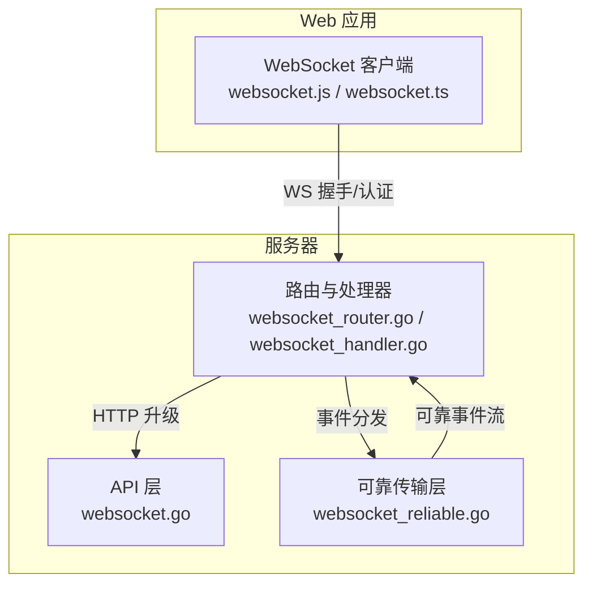
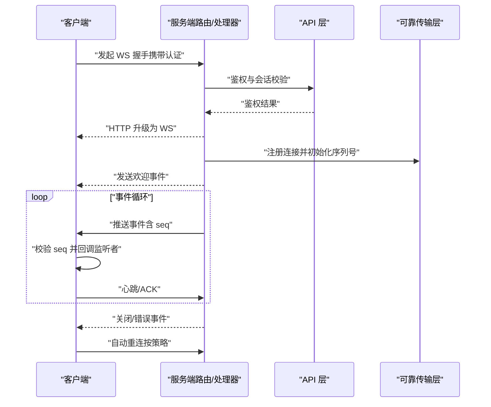
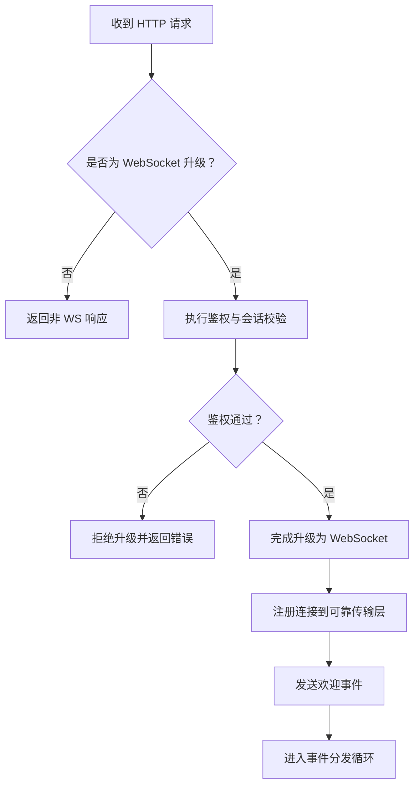
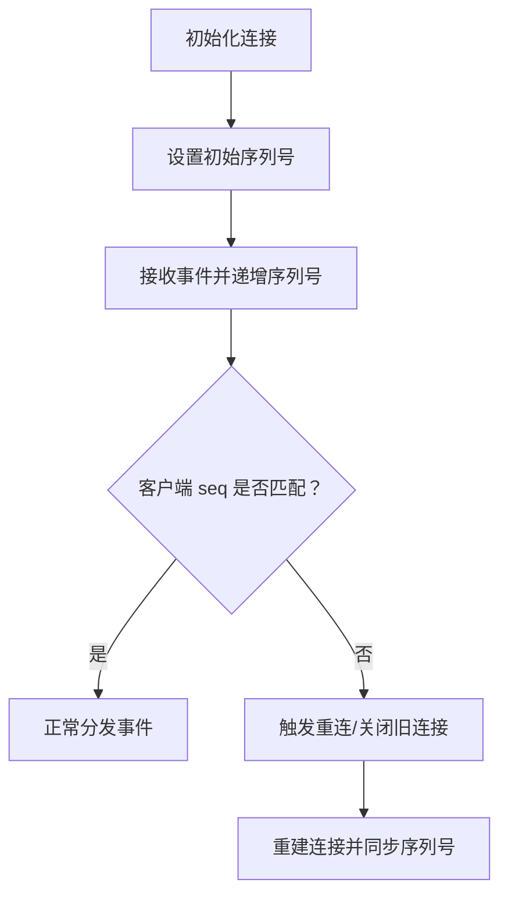
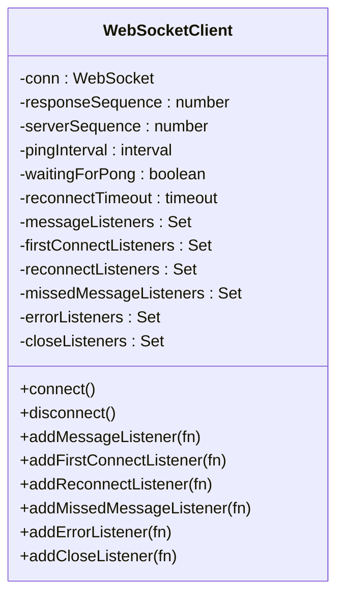
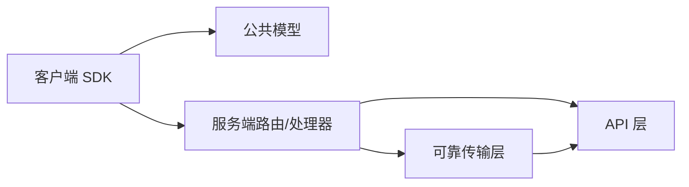

# WebSocket 实时通信 API

<cite>
**本文引用的文件**
- [websocket.go](file://server/channels/api4/websocket.go)
- [websocket_test.go](file://server/channels/api4/websocket_test.go)
- [websocket_norace_test.go](file://server/channels/api4/websocket_norace_test.go)
- [websocket_router.go](file://server/channels/app/platform/websocket_router.go)
- [websocket_reliable.go](file://server/channels/app/platform/websocket_reliable.go)
- [websocket_handler.go](file://server/channels/wsapi/websocket_handler.go)
- [websocket_client.go](file://server/public/model/websocket_client.go)
- [websocket.js](file://webapp/platform/client/lib/websocket.js)
- [websocket.ts](file://webapp/platform/client/src/websocket.ts)
- [api.go](file://server/channels/api4/api.go)
- [apitestlib.go](file://server/channels/api4/apitestlib.go)
- [websockets.go](file://server/cmd/mmctl/commands/websockets.go)
- [mmctl_websocket.rst](file://server/cmd/mmctl/commands/mmctl_websocket.rst)
</cite>

## 目录
1. [引言](#引言)
2. [项目结构](#项目结构)
3. [核心组件](#核心组件)
4. [架构总览](#架构总览)
5. [详细组件分析](#详细组件分析)
6. [依赖关系分析](#依赖关系分析)
7. [性能考虑](#性能考虑)
8. [故障排查指南](#故障排查指南)
9. [结论](#结论)
10. [附录](#附录)

## 引言
本文件面向 Mattermost 的 WebSocket 实时通信 API，系统性阐述连接建立流程（握手协议、认证机制、连接参数）、事件类型与消息格式、心跳与重连策略、错误处理、订阅与权限、性能优化与最佳实践，以及调试工具与方法。内容基于仓库中服务端与 Web 客户端实现进行归纳总结，帮助开发者在不同语言与平台下正确集成与扩展。

## 项目结构
Mattermost 的 WebSocket 能力由服务端路由与处理器、可靠传输层、客户端 SDK 三部分组成：
- 服务端：通过路由与处理器完成握手、鉴权、事件分发与关闭清理
- 可靠传输层：提供序列号校验、丢包检测与自动重连支持
- 客户端：封装连接生命周期、心跳、事件监听与重连策略

图表来源
- [websocket_router.go](file://server/channels/app/platform/websocket_router.go)
- [websocket_handler.go](file://server/channels/wsapi/websocket_handler.go)
- [websocket.go](file://server/channels/api4/websocket.go)
- [websocket_reliable.go](file://server/channels/app/platform/websocket_reliable.go)
- [websocket.js](file://webapp/platform/client/lib/websocket.js)
- [websocket.ts](file://webapp/platform/client/src/websocket.ts)

章节来源
- [websocket.go](file://server/channels/api4/websocket.go)
- [websocket_router.go](file://server/channels/app/platform/websocket_router.go)
- [websocket_reliable.go](file://server/channels/app/platform/websocket_reliable.go)
- [websocket_handler.go](file://server/channels/wsapi/websocket_handler.go)
- [websocket.js](file://webapp/platform/client/lib/websocket.js)
- [websocket.ts](file://webapp/platform/client/src/websocket.ts)

## 核心组件
- 服务端路由与处理器：负责 HTTP 到 WebSocket 的升级、鉴权、事件路由与关闭清理
- 可靠传输层：维护服务端序列号、检测乱序与丢包、触发重连
- 客户端 SDK：封装连接、心跳、事件回调、重连与网络状态监听
- 公共模型：定义客户端构造器与事件常量

章节来源
- [websocket.go](file://server/channels/api4/websocket.go)
- [websocket_router.go](file://server/channels/app/platform/websocket_router.go)
- [websocket_reliable.go](file://server/channels/app/platform/websocket_reliable.go)
- [websocket_client.go](file://server/public/model/websocket_client.go)
- [websocket.js](file://webapp/platform/client/lib/websocket.js)
- [websocket.ts](file://webapp/platform/client/src/websocket.ts)

## 架构总览
WebSocket 在 Mattermost 中的端到端交互如下：
- 客户端发起 WS 连接请求（含认证信息）
- 服务端进行鉴权与会话校验，完成 HTTP 升级为 WS
- 建立连接后，服务端向客户端推送“欢迎”事件并开始事件分发
- 客户端维护心跳与序列号，处理事件回调与重连
- 可靠传输层对序列号不匹配或异常断开进行恢复

图表来源
- [websocket.go](file://server/channels/api4/websocket.go)
- [websocket_router.go](file://server/channels/app/platform/websocket_router.go)
- [websocket_reliable.go](file://server/channels/app/platform/websocket_reliable.go)
- [websocket.js](file://webapp/platform/client/lib/websocket.js)
- [websocket.ts](file://webapp/platform/client/src/websocket.ts)

## 详细组件分析

### 服务端路由与处理器
- 负责 HTTP 到 WebSocket 的升级与握手
- 执行鉴权逻辑，校验用户会话与令牌有效性
- 将连接注册到可靠传输层，分配连接 ID 与初始序列号
- 分发系统事件与业务事件至客户端

图表来源
- [websocket_router.go](file://server/channels/app/platform/websocket_router.go)
- [websocket_handler.go](file://server/channels/wsapi/websocket_handler.go)
- [websocket.go](file://server/channels/api4/websocket.go)

章节来源
- [websocket_router.go](file://server/channels/app/platform/websocket_router.go)
- [websocket_handler.go](file://server/channels/wsapi/websocket_handler.go)
- [websocket.go](file://server/channels/api4/websocket.go)

### 可靠传输层
- 维护服务端序列号，确保事件有序到达
- 检测客户端期望序列号与实际序列号不一致时触发重连
- 提供连接 ID 管理与断线恢复能力

图表来源
- [websocket_reliable.go](file://server/channels/app/platform/websocket_reliable.go)

章节来源
- [websocket_reliable.go](file://server/channels/app/platform/websocket_reliable.go)

### 客户端 SDK（JavaScript/TypeScript）
- 维护响应序列号与服务端序列号，保证事件顺序
- 心跳定时器与等待 PONG 标志位，避免误判超时
- 支持首次连接、重连、丢失事件、错误与关闭等多类监听器
- 自动重连与网络在线/离线事件处理

图表来源
- [websocket.js](file://webapp/platform/client/lib/websocket.js)
- [websocket.ts](file://webapp/platform/client/src/websocket.ts)

章节来源
- [websocket.js](file://webapp/platform/client/lib/websocket.js)
- [websocket.ts](file://webapp/platform/client/src/websocket.ts)

### 公共模型与事件常量
- 定义客户端构造器与连接参数
- 提供事件名称常量（如欢迎事件等），便于客户端识别

章节来源
- [websocket_client.go](file://server/public/model/websocket_client.go)

### API 初始化与测试辅助
- 服务端入口初始化 WebSocket 能力
- 测试工具提供可连接的 WebSocket 客户端与可靠连接构造器

章节来源
- [api.go](file://server/channels/api4/api.go)
- [apitestlib.go](file://server/channels/api4/apitestlib.go)

## 依赖关系分析
- 客户端依赖公共模型与服务端提供的事件格式
- 服务端路由依赖 API 层完成鉴权与会话管理
- 可靠传输层作为中间层，向上提供稳定的事件流

图表来源
- [websocket.js](file://webapp/platform/client/lib/websocket.js)
- [websocket.ts](file://webapp/platform/client/src/websocket.ts)
- [websocket_client.go](file://server/public/model/websocket_client.go)
- [websocket_router.go](file://server/channels/app/platform/websocket_router.go)
- [websocket.go](file://server/channels/api4/websocket.go)
- [websocket_reliable.go](file://server/channels/app/platform/websocket_reliable.go)

章节来源
- [websocket.js](file://webapp/platform/client/lib/websocket.js)
- [websocket.ts](file://webapp/platform/client/src/websocket.ts)
- [websocket_client.go](file://server/public/model/websocket_client.go)
- [websocket_router.go](file://server/channels/app/platform/websocket_router.go)
- [websocket.go](file://server/channels/api4/websocket.go)
- [websocket_reliable.go](file://server/channels/app/platform/websocket_reliable.go)

## 性能考虑
- 心跳间隔与超时：客户端默认心跳周期为固定值，避免过于频繁的心跳造成资源消耗；同时需确保在网络波动场景下不会误判超时
- 事件批量与去抖：在高并发场景下，合并小事件、减少不必要的广播
- 连接池与复用：尽量复用现有连接，避免频繁创建销毁
- 序列号校验成本：服务端与客户端均需高效维护序列号，避免 O(n) 查找带来的额外开销
- 网络状态感知：利用浏览器/平台的在线/离线事件，及时暂停或延迟非关键操作

## 故障排查指南
- 鉴权失败：检查认证令牌与会话有效性，确认服务端鉴权逻辑返回
- 握手失败：确认请求头与路径正确，查看服务端日志中的升级失败原因
- 事件乱序/丢失：关注客户端序列号与服务端序列号一致性，必要时触发重连
- 心跳超时：检查网络质量与心跳配置，确认 PONG 回包是否被阻塞
- 自动重连：观察重连次数与退避策略，避免无限重试导致资源耗尽
- 关闭事件：区分正常关闭与异常关闭，记录错误码以便定位问题

章节来源
- [websocket.js](file://webapp/platform/client/lib/websocket.js)
- [websocket.ts](file://webapp/platform/client/src/websocket.ts)
- [websocket.go](file://server/channels/api4/websocket.go)

## 结论
Mattermost 的 WebSocket 实时通信以“可靠的事件流 + 完整的客户端生命周期管理”为核心设计，既满足高并发下的稳定性，又提供了灵活的事件订阅与权限控制基础。通过本文档的连接流程、事件模型、心跳与重连策略、性能优化与故障排查建议，开发者可在多语言与多平台环境下快速集成并扩展 WebSocket 能力。

## 附录

### 连接建立、消息发送与断开的示例路径
- 连接建立（服务端）：[websocket.go](file://server/channels/api4/websocket.go)
- 客户端连接（JavaScript）：[websocket.js](file://webapp/platform/client/lib/websocket.js)
- 客户端连接（TypeScript）：[websocket.ts](file://webapp/platform/client/src/websocket.ts)
- 断开连接（客户端）：[websocket.js](file://webapp/platform/client/lib/websocket.js)，[websocket.ts](file://webapp/platform/client/src/websocket.ts)

章节来源
- [websocket.go](file://server/channels/api4/websocket.go)
- [websocket.js](file://webapp/platform/client/lib/websocket.js)
- [websocket.ts](file://webapp/platform/client/src/websocket.ts)

### WebSocket 事件类型与消息格式
- 事件名称常量：参考公共模型中的事件名称定义
- 消息格式：包含事件名与载荷结构，客户端侧通过序列号保证顺序
- 事件分发：服务端路由与处理器负责将事件推送到已连接的客户端

章节来源
- [websocket_client.go](file://server/public/model/websocket_client.go)
- [websocket_router.go](file://server/channels/app/platform/websocket_router.go)
- [websocket_handler.go](file://server/channels/wsapi/websocket_handler.go)

### 订阅机制、频道权限与消息过滤
- 订阅机制：客户端通过连接建立后接收事件流，具体订阅行为由业务层决定
- 频道权限：事件分发前需进行权限校验，确保用户有权访问相关频道
- 消息过滤：服务端在分发前进行过滤，避免越权或冗余事件

章节来源
- [websocket_router.go](file://server/channels/app/platform/websocket_router.go)
- [websocket_handler.go](file://server/channels/wsapi/websocket_handler.go)

### 心跳机制、重连策略与错误处理
- 心跳：客户端定时发送心跳，等待 PONG；若超时则判定连接异常
- 重连：根据策略指数退避，限制最大重连次数；网络状态变化时调整行为
- 错误处理：区分鉴权错误、序列号不匹配、网络错误等，分别采取相应措施

章节来源
- [websocket.js](file://webapp/platform/client/lib/websocket.js)
- [websocket.ts](file://webapp/platform/client/src/websocket.ts)
- [websocket_reliable.go](file://server/channels/app/platform/websocket_reliable.go)

### 调试工具与方法
- mmctl 工具：提供 WebSocket 相关命令与文档，便于运维与诊断
- 测试辅助：测试库提供可连接的 WebSocket 客户端与可靠连接构造器，便于验证

章节来源
- [websockets.go](file://server/cmd/mmctl/commands/websockets.go)
- [mmctl_websocket.rst](file://server/cmd/mmctl/commands/mmctl_websocket.rst)
- [apitestlib.go](file://server/channels/api4/apitestlib.go)