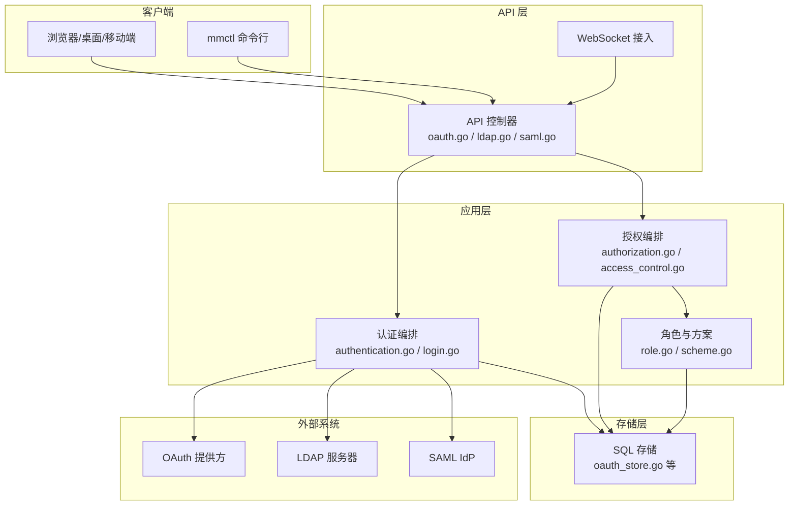
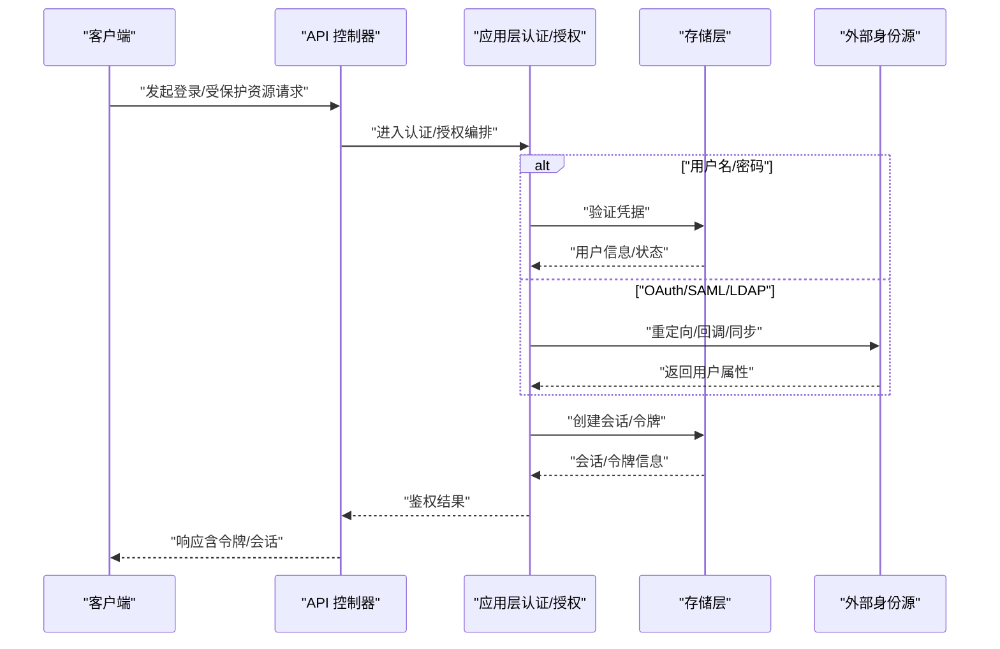
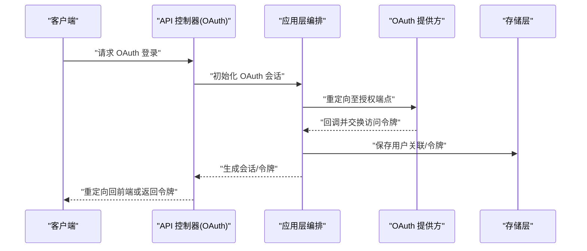
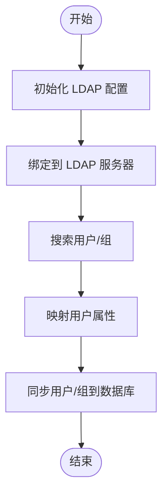
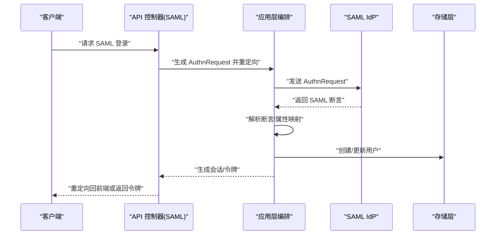
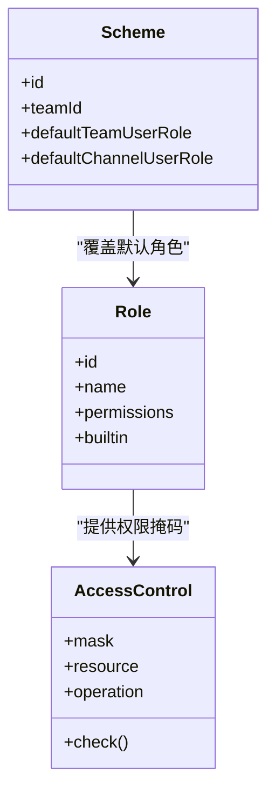
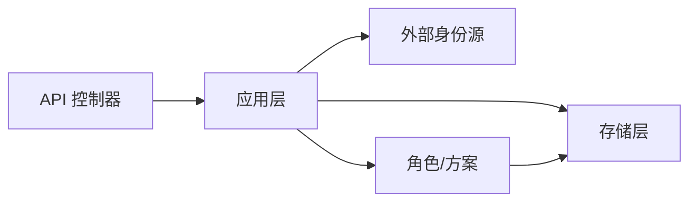

# 认证与授权

<cite>
**本文引用的文件**
- [authentication.go](file://server/channels/app/authentication.go)
- [authentication_test.go](file://server/channels/app/authentication_test.go)
- [authorization.go](file://server/channels/app/authorization.go)
- [authorization_test.go](file://server/channels/app/authorization_test.go)
- [oauth.go（API）](file://server/channels/api4/oauth.go)
- [oauth.go（应用层）](file://server/channels/app/oauth.go)
- [oauth.go（Web 层）](file://server/channels/web/oauth.go)
- [oauth_store.go](file://server/channels/store/sqlstore/oauth_store.go)
- [oauthproviders.go](file://server/einterfaces/oauthproviders.go)
- [gitlab.go](file://server/channels/app/oauthproviders/gitlab/gitlab.go)
- [ldap.go（API）](file://server/channels/api4/ldap.go)
- [ldap.go（应用层）](file://server/channels/app/ldap.go)
- [ldap.go（命令行）](file://server/cmd/mmctl/commands/ldap.go)
- [ldap_sync.go](file://server/einterfaces/jobs/ldap_sync.go)
- [saml.go（API）](file://server/channels/api4/saml.go)
- [saml.go（应用层）](file://server/channels/app/saml.go)
- [saml.go（Web 层）](file://server/channels/web/saml.go)
- [saml.go（命令行）](file://server/cmd/mmctl/commands/saml.go)
- [saml.go（接口）](file://server/einterfaces/saml.go)
- [saml_diagnostic.go](file://server/einterfaces/saml_diagnostic.go)
- [login.go](file://server/channels/app/login.go)
- [login_test.go](file://server/channels/app/login_test.go)
- [role.go](file://server/channels/app/role.go)
- [role_test.go](file://server/channels/app/role_test.go)
- [scheme.go](file://server/channels/app/scheme.go)
- [scheme_test.go](file://server/channels/app/scheme_test.go)
- [access_control.go](file://server/channels/app/access_control.go)
- [access_control_test.go](file://server/channels/app/access_control_test.go)
- [access_control_local.go](file://server/channels/api4/access_control_local.go)
- [user.go](file://server/channels/app/users/user.go)
- [user_test.go](file://server/channels/app/users/user_test.go)
- [config.go](file://server/channels/app/config.go)
- [config_test.go](file://server/channels/app/config_test.go)
- [constants.go](file://server/channels/app/constants.go)
- [context.go](file://server/channels/app/context.go)
- [context_test.go](file://server/channels/app/context_test.go)
- [audit.go](file://server/channels/app/audit.go)
- [audit_test.go](file://server/channels/app/audit_test.go)
- [websocket.go](file://server/channels/api4/websocket.go)
- [websocket_test.go](file://server/channels/api4/websocket_test.go)
- [main.go（服务端入口）](file://server/channels/api4/main.go)
</cite>

## 目录
1. [引言](#引言)
2. [项目结构](#项目结构)
3. [核心组件](#核心组件)
4. [架构总览](#架构总览)
5. [详细组件分析](#详细组件分析)
6. [依赖关系分析](#依赖关系分析)
7. [性能考量](#性能考量)
8. [故障排除指南](#故障排除指南)
9. [结论](#结论)
10. [附录](#附录)

## 引言
本文件系统性梳理 Mattermost 的认证与授权体系，覆盖以下主题：
- 多种认证方式：用户名/密码、OAuth、LDAP、SAML
- 会话与令牌管理：会话创建、刷新、销毁、过期处理；访问令牌、刷新令牌、API 密钥
- 权限控制：角色、权限、方案（Scheme）、资源访问控制
- 企业集成：跨域认证、单点登录（SSO）、外部身份源对接
- 安全与错误处理：失败重试、审计日志、异常恢复
- 故障排除与性能优化建议

## 项目结构
Mattermost 的认证与授权主要分布在以下层次：
- 应用层（App Layer）：认证流程编排、权限判定、角色与方案管理
- API 层（API Layer）：HTTP 入口、路由与控制器
- 存储层（Store Layer）：OAuth、用户、会话等数据持久化
- Web 层（Web Layer）：浏览器交互、回调处理
- 命令行工具（mmctl）：运维与集成场景下的配置与诊断
- 接口层（einterfaces）：企业版扩展点与诊断能力

图表来源
- [oauth.go（API）](file://server/channels/api4/oauth.go)
- [ldap.go（API）](file://server/channels/api4/ldap.go)
- [saml.go（API）](file://server/channels/api4/saml.go)
- [authentication.go](file://server/channels/app/authentication.go)
- [authorization.go](file://server/channels/app/authorization.go)
- [access_control.go](file://server/channels/app/access_control.go)
- [role.go](file://server/channels/app/role.go)
- [scheme.go](file://server/channels/app/scheme.go)
- [oauth_store.go](file://server/channels/store/sqlstore/oauth_store.go)
- [login.go](file://server/channels/app/login.go)

章节来源
- [main.go（服务端入口）](file://server/channels/api4/main.go)

## 核心组件
- 认证编排（authentication.go）
  - 负责统一入口的认证流程，协调用户名/密码、OAuth、LDAP、SAML 等多种认证方式
  - 组织登录逻辑、会话创建与令牌发放
- 授权编排（authorization.go）
  - 基于角色与方案进行资源访问控制
  - 汇总权限判定与审计
- 角色与方案（role.go / scheme.go）
  - 定义角色集合与继承规则
  - 方案用于在团队/频道维度覆盖默认权限
- 访问控制（access_control.go）
  - 将权限掩码与资源操作映射，执行细粒度校验
- 会话与上下文（login.go / context.go）
  - 会话生命周期管理、上下文注入、请求级鉴权状态
- 数据存储（oauth_store.go 等）
  - OAuth 用户关联、令牌持久化、连接信息等

章节来源
- [authentication.go](file://server/channels/app/authentication.go)
- [authorization.go](file://server/channels/app/authorization.go)
- [role.go](file://server/channels/app/role.go)
- [scheme.go](file://server/channels/app/scheme.go)
- [access_control.go](file://server/channels/app/access_control.go)
- [login.go](file://server/channels/app/login.go)
- [context.go](file://server/channels/app/context.go)
- [oauth_store.go](file://server/channels/store/sqlstore/oauth_store.go)

## 架构总览
下图展示从客户端到后端的关键交互，涵盖认证与授权的主干流程。

图表来源
- [oauth.go（API）](file://server/channels/api4/oauth.go)
- [saml.go（API）](file://server/channels/api4/saml.go)
- [ldap.go（API）](file://server/channels/api4/ldap.go)
- [authentication.go](file://server/channels/app/authentication.go)
- [authorization.go](file://server/channels/app/authorization.go)
- [oauth_store.go](file://server/channels/store/sqlstore/oauth_store.go)

## 详细组件分析

### 用户名/密码认证
- 流程要点
  - API 层接收用户名/密码
  - 应用层进行凭据校验与账户状态检查
  - 成功后创建会话并发放令牌
- 关键实现位置
  - 登录入口与会话创建：[login.go](file://server/channels/app/login.go)
  - API 控制器：[oauth.go（API）](file://server/channels/api4/oauth.go)
  - 配置与常量：[config.go](file://server/channels/app/config.go)、[constants.go](file://server/channels/app/constants.go)
- 错误处理
  - 凭据无效、账户禁用、速率限制等场景需明确返回码与审计事件

章节来源
- [login.go](file://server/channels/app/login.go)
- [login_test.go](file://server/channels/app/login_test.go)
- [oauth.go（API）](file://server/channels/api4/oauth.go)
- [config.go](file://server/channels/app/config.go)
- [constants.go](file://server/channels/app/constants.go)

### OAuth 认证
- 支持范围
  - 内置 OAuth 提供方（如 GitLab）与通用 OAuth 流程
  - 外部 OAuth 连接（Outgoing OAuth Connections）
- 核心组件
  - API 控制器：[oauth.go（API）](file://server/channels/api4/oauth.go)
  - 应用层编排：[oauth.go（应用层）](file://server/channels/app/oauth.go)
  - Web 回调处理：[oauth.go（Web 层）](file://server/channels/web/oauth.go)
  - 存储：[oauth_store.go](file://server/channels/store/sqlstore/oauth_store.go)
  - 接口与提供方：[oauthproviders.go](file://server/einterfaces/oauthproviders.go)、[gitlab.go](file://server/channels/app/oauthproviders/gitlab/gitlab.go)
- 工作流序列

图表来源
- [oauth.go（API）](file://server/channels/api4/oauth.go)
- [oauth.go（应用层）](file://server/channels/app/oauth.go)
- [oauth.go（Web 层）](file://server/channels/web/oauth.go)
- [oauth_store.go](file://server/channels/store/sqlstore/oauth_store.go)
- [oauthproviders.go](file://server/einterfaces/oauthproviders.go)
- [gitlab.go](file://server/channels/app/oauthproviders/gitlab/gitlab.go)

章节来源
- [oauth.go（API）](file://server/channels/api4/oauth.go)
- [oauth.go（应用层）](file://server/channels/app/oauth.go)
- [oauth.go（Web 层）](file://server/channels/web/oauth.go)
- [oauth_store.go](file://server/channels/store/sqlstore/oauth_store.go)
- [oauthproviders.go](file://server/einterfaces/oauthproviders.go)
- [gitlab.go](file://server/channels/app/oauthproviders/gitlab/gitlab.go)

### LDAP 认证
- 功能边界
  - 与 LDAP 服务器集成，支持用户属性映射与组/OU 同步
  - 支持后台任务同步用户与组信息
- 核心组件
  - API 控制器：[ldap.go（API）](file://server/channels/api4/ldap.go)
  - 应用层编排：[ldap.go（应用层）](file://server/channels/app/ldap.go)
  - 命令行工具：[ldap.go（命令行）](file://server/cmd/mmctl/commands/ldap.go)
  - 同步作业接口：[ldap_sync.go](file://server/einterfaces/jobs/ldap_sync.go)
- 流程概览

图表来源
- [ldap.go（API）](file://server/channels/api4/ldap.go)
- [ldap.go（应用层）](file://server/channels/app/ldap.go)
- [ldap.go（命令行）](file://server/cmd/mmctl/commands/ldap.go)
- [ldap_sync.go](file://server/einterfaces/jobs/ldap_sync.go)

章节来源
- [ldap.go（API）](file://server/channels/api4/ldap.go)
- [ldap.go（应用层）](file://server/channels/app/ldap.go)
- [ldap.go（命令行）](file://server/cmd/mmctl/commands/ldap.go)
- [ldap_sync.go](file://server/einterfaces/jobs/ldap_sync.go)

### SAML 认证
- 功能边界
  - 支持 SAML SSO，处理断言解析、属性映射与会话建立
- 核心组件
  - API 控制器：[saml.go（API）](file://server/channels/api4/saml.go)
  - 应用层编排：[saml.go（应用层）](file://server/channels/app/saml.go)
  - Web 回调处理：[saml.go（Web 层）](file://server/channels/web/saml.go)
  - 命令行工具：[saml.go（命令行）](file://server/cmd/mmctl/commands/saml.go)
  - 接口与诊断：[saml.go（接口）](file://server/einterfaces/saml.go)、[saml_diagnostic.go](file://server/einterfaces/saml_diagnostic.go)
- SAML 流程序列

图表来源
- [saml.go（API）](file://server/channels/api4/saml.go)
- [saml.go（应用层）](file://server/channels/app/saml.go)
- [saml.go（Web 层）](file://server/channels/web/saml.go)
- [saml.go（命令行）](file://server/cmd/mmctl/commands/saml.go)
- [saml.go（接口）](file://server/einterfaces/saml.go)
- [saml_diagnostic.go](file://server/einterfaces/saml_diagnostic.go)

章节来源
- [saml.go（API）](file://server/channels/api4/saml.go)
- [saml.go（应用层）](file://server/channels/app/saml.go)
- [saml.go（Web 层）](file://server/channels/web/saml.go)
- [saml.go（命令行）](file://server/cmd/mmctl/commands/saml.go)
- [saml.go（接口）](file://server/einterfaces/saml.go)
- [saml_diagnostic.go](file://server/einterfaces/saml_diagnostic.go)

### 会话管理与令牌系统
- 会话生命周期
  - 创建：登录成功后生成会话与令牌
  - 刷新：通过刷新令牌换取新的访问令牌
  - 销毁：登出或强制失效
  - 过期：基于配置的时间窗口与策略
- 关键实现位置
  - 会话与上下文：[login.go](file://server/channels/app/login.go)、[context.go](file://server/channels/app/context.go)
  - WebSocket 集成：[websocket.go](file://server/channels/api4/websocket.go)
  - 审计日志：[audit.go](file://server/channels/app/audit.go)
- 令牌类型
  - 访问令牌：短期有效，用于受保护资源访问
  - 刷新令牌：长期有效但受限，用于轮换访问令牌
  - API 密钥：用于程序化访问（如 mmctl）

章节来源
- [login.go](file://server/channels/app/login.go)
- [context.go](file://server/channels/app/context.go)
- [websocket.go](file://server/channels/api4/websocket.go)
- [audit.go](file://server/channels/app/audit.go)

### 权限控制系统
- 角色与权限
  - 角色定义与继承：[role.go](file://server/channels/app/role.go)
  - 权限位掩码与资源操作映射：[access_control.go](file://server/channels/app/access_control.go)
- 方案（Scheme）
  - 在团队/频道维度覆盖默认权限：[scheme.go](file://server/channels/app/scheme.go)
- API 层本地访问控制
  - 本地策略与测试：[access_control_local.go](file://server/channels/api4/access_control_local.go)

图表来源
- [role.go](file://server/channels/app/role.go)
- [scheme.go](file://server/channels/app/scheme.go)
- [access_control.go](file://server/channels/app/access_control.go)

章节来源
- [role.go](file://server/channels/app/role.go)
- [role_test.go](file://server/channels/app/role_test.go)
- [scheme.go](file://server/channels/app/scheme.go)
- [scheme_test.go](file://server/channels/app/scheme_test.go)
- [access_control.go](file://server/channels/app/access_control.go)
- [access_control_test.go](file://server/channels/app/access_control_test.go)
- [access_control_local.go](file://server/channels/api4/access_control_local.go)

### 用户与配置
- 用户模型与操作：[user.go](file://server/channels/app/users/user.go)
- 配置与常量：[config.go](file://server/channels/app/config.go)、[constants.go](file://server/channels/app/constants.go)
- 上下文与请求级状态：[context.go](file://server/channels/app/context.go)

章节来源
- [user.go](file://server/channels/app/users/user.go)
- [user_test.go](file://server/channels/app/users/user_test.go)
- [config.go](file://server/channels/app/config.go)
- [constants.go](file://server/channels/app/constants.go)
- [context.go](file://server/channels/app/context.go)
- [context_test.go](file://server/channels/app/context_test.go)

## 依赖关系分析
- 组件耦合
  - API 层仅负责路由与参数校验，认证/授权逻辑集中在应用层
  - 存储层为认证与授权提供数据支撑，避免 API 层直接访问数据库
- 外部依赖
  - OAuth/SAML/LDAP 通过各自提供方或协议栈完成用户身份确认
- 循环依赖
  - 通过接口层（einterfaces）与分层职责避免循环依赖

图表来源
- [oauth.go（API）](file://server/channels/api4/oauth.go)
- [saml.go（API）](file://server/channels/api4/saml.go)
- [ldap.go（API）](file://server/channels/api4/ldap.go)
- [authentication.go](file://server/channels/app/authentication.go)
- [authorization.go](file://server/channels/app/authorization.go)
- [role.go](file://server/channels/app/role.go)
- [scheme.go](file://server/channels/app/scheme.go)
- [oauth_store.go](file://server/channels/store/sqlstore/oauth_store.go)

章节来源
- [oauth.go（API）](file://server/channels/api4/oauth.go)
- [saml.go（API）](file://server/channels/api4/saml.go)
- [ldap.go（API）](file://server/channels/api4/ldap.go)
- [authentication.go](file://server/channels/app/authentication.go)
- [authorization.go](file://server/channels/app/authorization.go)
- [role.go](file://server/channels/app/role.go)
- [scheme.go](file://server/channels/app/scheme.go)
- [oauth_store.go](file://server/channels/store/sqlstore/oauth_store.go)

## 性能考量
- 会话与令牌缓存
  - 对频繁访问的令牌进行内存缓存，降低数据库压力
- 外部身份源调优
  - 合理设置超时与重试策略，避免阻塞请求线程
- 权限判定优化
  - 使用位掩码与预计算权限，减少复杂查询
- 并发与限流
  - 对登录与认证接口实施速率限制，防止暴力破解
- WebSocket 与长连接
  - 结合会话过期策略，及时清理无效连接

## 故障排除指南
- 常见问题定位
  - 认证失败：检查凭据、账户状态、审计日志与外部身份源连通性
  - OAuth 回调异常：核对回调地址、状态参数与存储中的会话一致性
  - SAML 断言解析失败：确认 IdP 配置、断言签名与属性映射
  - LDAP 同步不生效：验证绑定 DN/凭据、过滤条件与同步作业状态
- 审计与追踪
  - 所有认证与授权事件均应写入审计日志，便于回溯
- 诊断工具
  - 使用 mmctl 命令行进行配置校验与状态查询
  - 参考 SAML 诊断接口以排查 SAML 集成问题

章节来源
- [audit.go](file://server/channels/app/audit.go)
- [audit_test.go](file://server/channels/app/audit_test.go)
- [saml_diagnostic.go](file://server/einterfaces/saml_diagnostic.go)
- [ldap.go（命令行）](file://server/cmd/mmctl/commands/ldap.go)
- [saml.go（命令行）](file://server/cmd/mmctl/commands/saml.go)

## 结论
Mattermost 的认证与授权体系通过清晰的分层设计实现了多身份源支持、细粒度权限控制与稳健的会话管理。结合本文档提供的流程图、类图与最佳实践，可帮助开发者与运维人员快速理解并正确配置认证与授权功能，确保在企业环境中实现安全、稳定与可扩展的身份管理。

## 附录
- 最佳实践
  - 启用 HTTPS 与安全传输
  - 定期轮换密钥与令牌，缩短有效期
  - 实施最小权限原则与定期权限审计
  - 对外部身份源启用双向 TLS 与证书校验
  - 使用 mmctl 进行自动化配置与健康检查
- 参考实现路径
  - 认证入口与会话：[authentication.go](file://server/channels/app/authentication.go)、[login.go](file://server/channels/app/login.go)
  - 授权与访问控制：[authorization.go](file://server/channels/app/authorization.go)、[access_control.go](file://server/channels/app/access_control.go)
  - 角色与方案：[role.go](file://server/channels/app/role.go)、[scheme.go](file://server/channels/app/scheme.go)
  - OAuth：[oauth.go（API）](file://server/channels/api4/oauth.go)、[oauth.go（应用层）](file://server/channels/app/oauth.go)、[oauth_store.go](file://server/channels/store/sqlstore/oauth_store.go)
  - LDAP：[ldap.go（API）](file://server/channels/api4/ldap.go)、[ldap.go（应用层）](file://server/channels/app/ldap.go)
  - SAML：[saml.go（API）](file://server/channels/api4/saml.go)、[saml.go（应用层）](file://server/channels/app/saml.go)