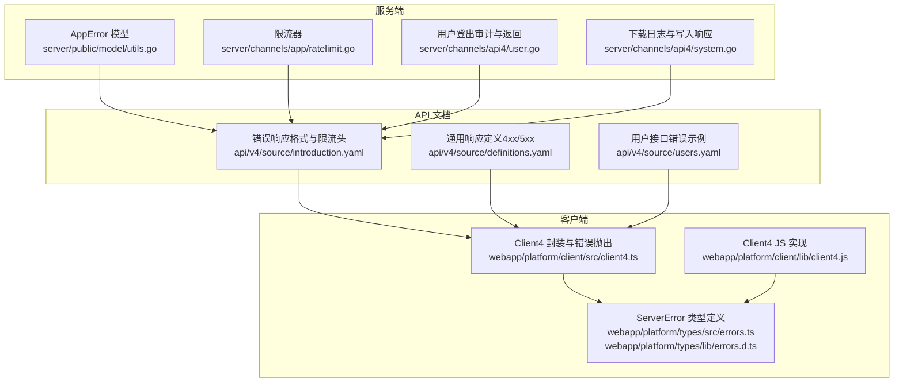
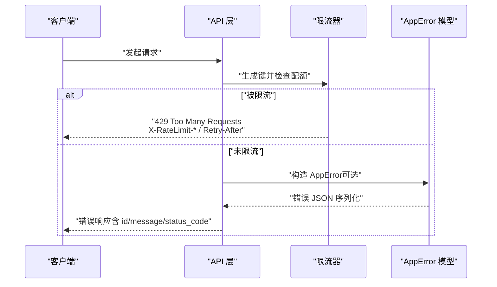
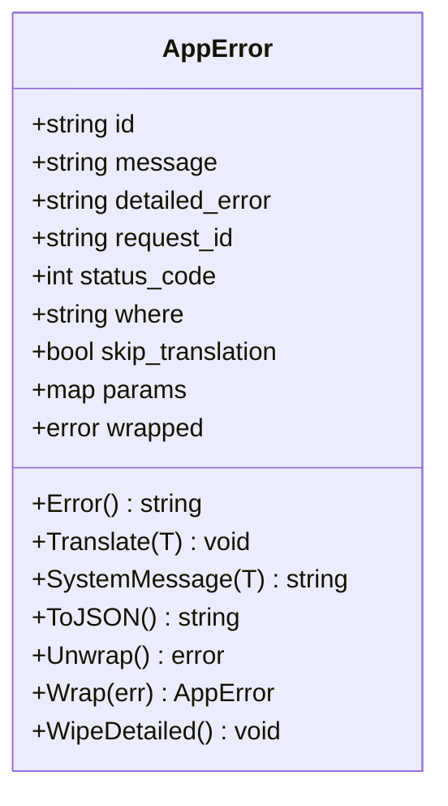
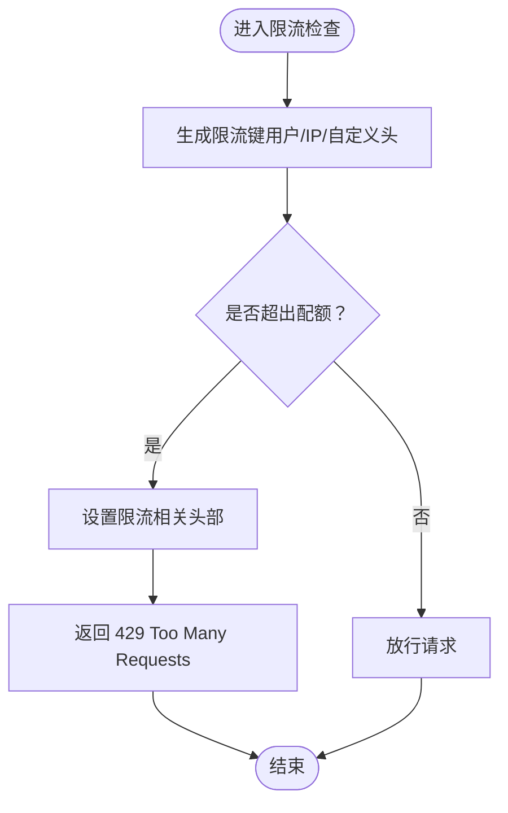
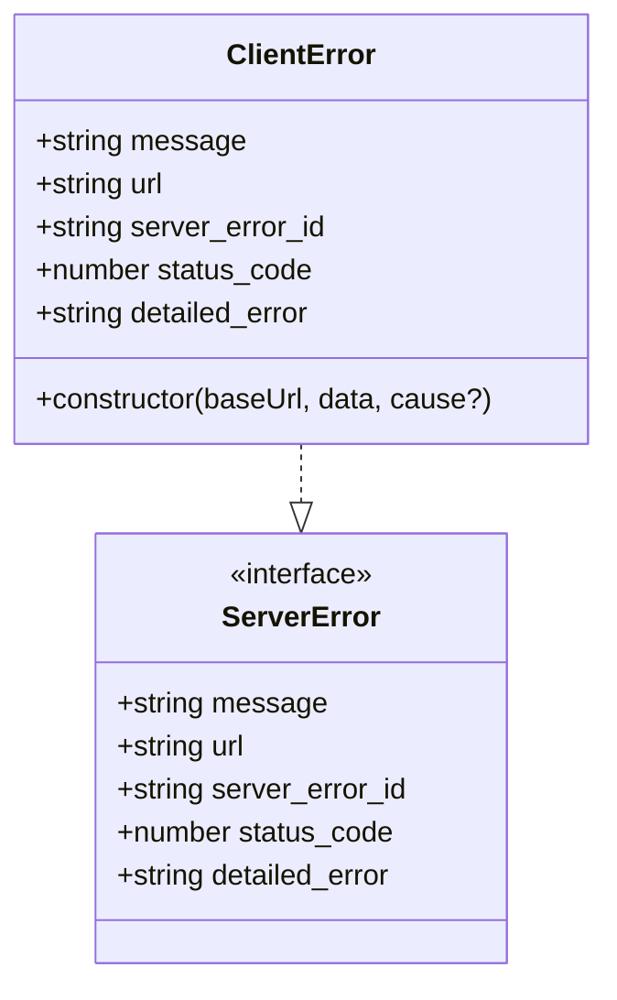
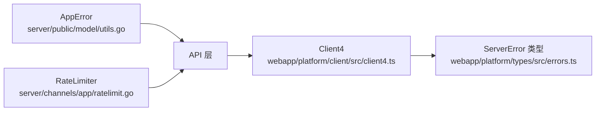

# 错误处理与状态码

<cite>
**本文引用的文件**
- [server/public/model/utils.go](file://server/public/model/utils.go)
- [server/public/model/utils_test.go](file://server/public/model/utils_test.go)
- [server/channels/app/ratelimit.go](file://server/channels/app/ratelimit.go)
- [server/channels/api4/user.go](file://server/channels/api4/user.go)
- [server/channels/api4/system.go](file://server/channels/api4/system.go)
- [api/v4/source/introduction.yaml](file://api/v4/source/introduction.yaml)
- [api/v4/source/definitions.yaml](file://api/v4/source/definitions.yaml)
- [api/v4/source/users.yaml](file://api/v4/source/users.yaml)
- [webapp/platform/client/src/client4.ts](file://webapp/platform/client/src/client4.ts)
- [webapp/platform/client/lib/client4.js](file://webapp/platform/client/lib/client4.js)
- [webapp/platform/types/src/errors.ts](file://webapp/platform/types/src/errors.ts)
- [webapp/platform/types/lib/errors.d.ts](file://webapp/platform/types/lib/errors.d.ts)
- [webapp/channels/src/packages/mattermost-redux/src/actions/errors.test.ts](file://webapp/channels/src/packages/mattermost-redux/src/actions/errors.test.ts)
- [webapp/channels/src/packages/mattermost-redux/src/actions/general.ts](file://webapp/channels/src/packages/mattermost-redux/src/actions/general.ts)
</cite>

## 目录
1. [简介](#简介)
2. [项目结构](#项目结构)
3. [核心组件](#核心组件)
4. [架构总览](#架构总览)
5. [详细组件分析](#详细组件分析)
6. [依赖分析](#依赖分析)
7. [性能考量](#性能考量)
8. [故障排查指南](#故障排查指南)
9. [结论](#结论)
10. [附录](#附录)

## 简介
本文件系统化梳理 Mattermost 的错误处理与 HTTP 状态码规范，覆盖服务端错误模型、客户端错误封装、统一错误响应格式、限流与配额超限处理、以及跨语言（前端 TypeScript/JS）的错误处理最佳实践。目标是帮助开发者在集成 Mattermost API 时，能够准确识别与处理各类错误，快速定位问题并进行恢复。

## 项目结构
围绕错误处理与状态码的关键目录与文件：
- 服务端错误模型与限流：server/public/model/utils.go、server/channels/app/ratelimit.go
- API 文档与错误响应定义：api/v4/source/introduction.yaml、api/v4/source/definitions.yaml
- 典型接口错误场景：api/v4/source/users.yaml、server/channels/api4/user.go、server/channels/api4/system.go
- 客户端错误封装与日志上报：webapp/platform/client/src/client4.ts、webapp/platform/client/lib/client4.js、webapp/platform/types/src/errors.ts、webapp/platform/types/lib/errors.d.ts
- 前端错误行为测试与日志动作：webapp/channels/src/packages/mattermost-redux/src/actions/errors.test.ts、webapp/channels/src/packages/mattermost-redux/src/actions/general.ts

图表来源
- [server/public/model/utils.go:232-376](file://server/public/model/utils.go#L232-L376)
- [server/channels/app/ratelimit.go:79-94](file://server/channels/app/ratelimit.go#L79-L94)
- [api/v4/source/introduction.yaml:165-179](file://api/v4/source/introduction.yaml#L165-L179)
- [api/v4/source/definitions.yaml:7-60](file://api/v4/source/definitions.yaml#L7-L60)
- [api/v4/source/users.yaml:261-292](file://api/v4/source/users.yaml#L261-L292)
- [webapp/platform/client/src/client4.ts:4686-4703](file://webapp/platform/client/src/client4.ts#L4686-L4703)
- [webapp/platform/client/lib/client4.js:2326-2330](file://webapp/platform/client/lib/client4.js#L2326-L2330)
- [webapp/platform/types/src/errors.ts:4-12](file://webapp/platform/types/src/errors.ts#L4-L12)
- [webapp/platform/types/lib/errors.d.ts:1-9](file://webapp/platform/types/lib/errors.d.ts#L1-L9)

章节来源
- [server/public/model/utils.go:232-376](file://server/public/model/utils.go#L232-L376)
- [server/channels/app/ratelimit.go:79-94](file://server/channels/app/ratelimit.go#L79-L94)
- [api/v4/source/introduction.yaml:165-179](file://api/v4/source/introduction.yaml#L165-L179)
- [api/v4/source/definitions.yaml:7-60](file://api/v4/source/definitions.yaml#L7-L60)
- [api/v4/source/users.yaml:261-292](file://api/v4/source/users.yaml#L261-L292)
- [webapp/platform/client/src/client4.ts:4686-4703](file://webapp/platform/client/src/client4.ts#L4686-L4703)
- [webapp/platform/client/lib/client4.js:2326-2330](file://webapp/platform/client/lib/client4.js#L2326-L2330)
- [webapp/platform/types/src/errors.ts:4-12](file://webapp/platform/types/src/errors.ts#L4-L12)
- [webapp/platform/types/lib/errors.d.ts:1-9](file://webapp/platform/types/lib/errors.d.ts#L1-L9)

## 核心组件
- 服务端错误模型 AppError
  - 字段：id、message、detailed_error、request_id、status_code、where、skip_translation、params、wrapped
  - 能力：翻译、序列化为 JSON、包装/剥离详细错误、从 JSON 解析并兼容“请求体过大”等特殊情形
- 限流器 RateLimiter
  - 基于 GCRA 令牌桶，支持按用户、IP 或自定义头部限速
  - 写入 X-RateLimit-* 与 Retry-After 头部；超过阈值返回 429
- 客户端错误封装 ClientError
  - 继承原生 Error，携带 message、url、server_error_id、status_code、detailed_error
  - 用于统一捕获与展示服务端错误
- API 文档中的错误响应格式
  - 统一 JSON 结构：id、message、request_id、status_code、is_oauth
  - 通用 4xx/5xx 响应定义（Forbidden、Unauthorized、BadRequest、NotFound、Conflict、TooLarge、NotImplemented、TooManyRequests、InternalServerError、BadGateway）

章节来源
- [server/public/model/utils.go:232-376](file://server/public/model/utils.go#L232-L376)
- [server/channels/app/ratelimit.go:79-94](file://server/channels/app/ratelimit.go#L79-L94)
- [webapp/platform/client/src/client4.ts:5165-5184](file://webapp/platform/client/src/client4.ts#L5165-L5184)
- [api/v4/source/introduction.yaml:165-179](file://api/v4/source/introduction.yaml#L165-L179)
- [api/v4/source/definitions.yaml:7-60](file://api/v4/source/definitions.yaml#L7-L60)

## 架构总览
下图展示了从客户端到服务端的错误处理流程，包括错误响应格式、限流与配额超限、以及客户端错误封装。

图表来源
- [server/channels/app/ratelimit.go:79-94](file://server/channels/app/ratelimit.go#L79-L94)
- [server/public/model/utils.go:305-316](file://server/public/model/utils.go#L305-L316)
- [api/v4/source/introduction.yaml:165-179](file://api/v4/source/introduction.yaml#L165-L179)

## 详细组件分析

### 服务端错误模型 AppError
- 数据结构
  - 关键字段：id（错误标识）、message（面向用户的提示）、detailed_error（开发用详细信息）、request_id、status_code、where、skip_translation、params、wrapped
- 行为能力
  - 翻译：根据国际化函数设置 message
  - 序列化：ToJSON 输出统一 JSON
  - 包装/剥离：Wrap/Unwrap/WipeDetailed 支持链式错误与清理敏感细节
  - 反序列化：AppErrorFromJSON 支持解析错误体，并对“请求体过大”做特殊处理
- 测试验证
  - 支持序列化/反序列化、详细信息擦除、包装错误拼接等行为

图表来源
- [server/public/model/utils.go:232-342](file://server/public/model/utils.go#L232-L342)

章节来源
- [server/public/model/utils.go:232-376](file://server/public/model/utils.go#L232-L376)
- [server/public/model/utils_test.go:133-171](file://server/public/model/utils_test.go#L133-L171)

### 限流与配额超限（429）
- 限流逻辑
  - 生成限流键：优先使用认证信息，其次 IP，最后可配置头部
  - 使用 GCRA 令牌桶算法，超过阈值返回 429
  - 设置 X-RateLimit-Limit、X-RateLimit-Remaining、X-RateLimit-Reset、Retry-After
- 客户端处理建议
  - 读取 Retry-After 并等待后重试
  - 降低请求频率或合并请求
  - 对幂等操作采用指数退避重试

图表来源
- [server/channels/app/ratelimit.go:56-77](file://server/channels/app/ratelimit.go#L56-L77)
- [server/channels/app/ratelimit.go:86-94](file://server/channels/app/ratelimit.go#L86-L94)
- [server/channels/app/ratelimit.go:114-132](file://server/channels/app/ratelimit.go#L114-L132)

章节来源
- [server/channels/app/ratelimit.go:79-94](file://server/channels/app/ratelimit.go#L79-L94)
- [api/v4/source/introduction.yaml:148-163](file://api/v4/source/introduction.yaml#L148-L163)

### 客户端错误封装与统一处理
- ClientError
  - 字段：message、url、server_error_id、status_code、detailed_error
  - 构造时保留 cause，便于链路追踪
- 客户端解析与抛错
  - 当 response.ok 为假或忽略状态时，抛出 ClientError
  - 记录日志并抛出异常，便于上层统一处理
- 类型定义
  - ServerError 接口定义了上述字段，确保类型安全

图表来源
- [webapp/platform/client/src/client4.ts:5165-5184](file://webapp/platform/client/src/client4.ts#L5165-L5184)
- [webapp/platform/types/src/errors.ts:4-12](file://webapp/platform/types/src/errors.ts#L4-L12)
- [webapp/platform/types/lib/errors.d.ts:1-9](file://webapp/platform/types/lib/errors.d.ts#L1-L9)

章节来源
- [webapp/platform/client/src/client4.ts:4686-4703](file://webapp/platform/client/src/client4.ts#L4686-L4703)
- [webapp/platform/client/lib/client4.js:2326-2330](file://webapp/platform/client/lib/client4.js#L2326-L2330)
- [webapp/platform/types/src/errors.ts:4-12](file://webapp/platform/types/src/errors.ts#L4-L12)
- [webapp/platform/types/lib/errors.d.ts:1-9](file://webapp/platform/types/lib/errors.d.ts#L1-L9)

### API 文档中的错误响应格式与通用响应
- 统一错误响应 JSON 字段：id、message、request_id、status_code、is_oauth
- 通用响应定义（部分）：Forbidden、Unauthorized、BadRequest、NotFound、Conflict、TooLarge、NotImplemented、TooManyRequests、InternalServerError、BadGateway
- 用户接口示例：401/403/404/409/428 等状态的描述与用途

章节来源
- [api/v4/source/introduction.yaml:165-179](file://api/v4/source/introduction.yaml#L165-L179)
- [api/v4/source/definitions.yaml:7-60](file://api/v4/source/definitions.yaml#L7-L60)
- [api/v4/source/users.yaml:261-292](file://api/v4/source/users.yaml#L261-L292)

### 登录/会话与审计中的错误处理
- 登出流程
  - 判定认证状态（已认证/无令牌/令牌无效），写入审计事件
  - 删除 Cookie、撤销会话，成功返回 200
- 日志上传与写响应
  - 下载日志时若发生错误，返回 500 并携带 AppError

章节来源
- [server/channels/api4/user.go:2463-2493](file://server/channels/api4/user.go#L2463-L2493)
- [server/channels/api4/system.go:429-444](file://server/channels/api4/system.go#L429-L444)

## 依赖分析
- 服务端
  - AppError 作为统一错误载体，贯穿各 API 层
  - 限流器通过中间件方式接入，影响请求路径
- 客户端
  - Client4 在解析响应时统一抛出 ClientError，便于上层统一处理
  - Redux 动作层对错误进行记录与 UI 展示控制

图表来源
- [server/public/model/utils.go:232-376](file://server/public/model/utils.go#L232-L376)
- [server/channels/app/ratelimit.go:79-94](file://server/channels/app/ratelimit.go#L79-L94)
- [webapp/platform/client/src/client4.ts:4686-4703](file://webapp/platform/client/src/client4.ts#L4686-L4703)
- [webapp/platform/types/src/errors.ts:4-12](file://webapp/platform/types/src/errors.ts#L4-L12)

## 性能考量
- 限流头部
  - X-RateLimit-Limit、X-RateLimit-Remaining、X-RateLimit-Reset、Retry-After 提供实时配额信息，客户端应据此动态调整请求节奏
- 错误序列化
  - AppError.ToJSON 会将 wrapped 错误拼接到 detailed_error，避免泄露内部堆栈，同时保留调试线索
- 日志写入
  - 客户端日志上报仅在启用日志开关且非特定错误时触发，减少不必要的网络开销

## 故障排查指南
- 常见错误类型与定位
  - 401 未授权：检查访问令牌是否缺失或过期
  - 403 权限不足：确认会话权限或角色授权
  - 404 资源不存在：核对路径参数与资源 ID
  - 409 冲突：如用户被停用（DeleteAt 非 0）
  - 413 请求实体过大：调整文件大小限制或分片上传
  - 428 前置条件不足：如 SAML 用户需先建立账户
  - 429 限流：读取 Retry-After 后退避重试
  - 500 服务器内部错误：查看服务端日志与审计事件
- 客户端日志上报
  - 通过 Client4.logClientError 将客户端错误发送至服务端日志接口，便于集中排查
- 前端错误行为
  - Redux actions 中对 session expired 等错误不重复上报，避免噪声

章节来源
- [api/v4/source/users.yaml:261-292](file://api/v4/source/users.yaml#L261-L292)
- [webapp/platform/client/src/client4.ts:2899-2915](file://webapp/platform/client/src/client4.ts#L2899-L2915)
- [webapp/channels/src/packages/mattermost-redux/src/actions/errors.test.ts:28-61](file://webapp/channels/src/packages/mattermost-redux/src/actions/errors.test.ts#L28-L61)

## 结论
Mattermost 的错误处理体系以 AppError 为核心，配合统一的错误响应格式与限流机制，实现了服务端与客户端的一致性与可观测性。遵循本文的状态码与错误处理实践，可显著提升集成稳定性与排障效率。

## 附录

### HTTP 状态码与使用场景对照
- 2xx 成功
  - 200 OK：常规成功响应
  - 204 No Content：无内容但成功（如登出）
- 4xx 客户端错误
  - 400 Bad Request：参数无效或缺失
  - 401 Unauthorized：未提供或无效令牌
  - 403 Forbidden：权限不足
  - 404 Not Found：资源不存在
  - 409 Conflict：与当前资源状态冲突
  - 413 Payload Too Large：请求体过大
  - 412 Precondition Failed：前置条件不满足
  - 428 Precondition Required：需要前置条件
  - 429 Too Many Requests：超出限流
  - 501 Not Implemented：功能禁用
- 5xx 服务器错误
  - 500 Internal Server Error：服务器内部错误
  - 502 Bad Gateway：上游网关错误
  - 503 Service Unavailable：服务不可用（可结合 Retry-After）

章节来源
- [api/v4/source/definitions.yaml:7-60](file://api/v4/source/definitions.yaml#L7-L60)
- [api/v4/source/users.yaml:261-292](file://api/v4/source/users.yaml#L261-L292)
- [api/v4/source/introduction.yaml:148-163](file://api/v4/source/introduction.yaml#L148-L163)

### 标准错误响应字段说明
- id：错误标识符（用于本地化与检索）
- message：面向用户的错误提示
- request_id：请求唯一标识，便于服务端审计与日志关联
- status_code：HTTP 状态码
- is_oauth：是否与 OAuth 相关
- detailed_error：内部详细错误信息（可能包含链式错误拼接）
- url：触发错误的请求 URL（客户端日志中用于清洗）

章节来源
- [api/v4/source/introduction.yaml:165-179](file://api/v4/source/introduction.yaml#L165-L179)
- [webapp/platform/types/src/errors.ts:4-12](file://webapp/platform/types/src/errors.ts#L4-L12)
- [webapp/platform/types/lib/errors.d.ts:1-9](file://webapp/platform/types/lib/errors.d.ts#L1-L9)

### 常见错误类型与解决方案
- 认证失败（401）
  - 检查 Authorization 头或 Cookie 是否正确
  - 若令牌过期，引导重新登录或刷新令牌
- 权限不足（403）
  - 核对会话权限与目标资源的访问控制策略
- 资源不存在（404）
  - 校验路径参数与资源 ID；必要时回退到列表查询
- 请求验证错误（400/413）
  - 检查请求体结构与大小限制；对大文件采用分片或外部存储
- 限流（429）
  - 读取 Retry-After 并指数退避重试；合并请求或降级策略
- 服务器内部错误（500）
  - 查看服务端日志与审计事件，定位具体模块与调用栈

章节来源
- [api/v4/source/users.yaml:261-292](file://api/v4/source/users.yaml#L261-L292)
- [server/channels/app/ratelimit.go:86-94](file://server/channels/app/ratelimit.go#L86-L94)
- [server/channels/api4/system.go:429-444](file://server/channels/api4/system.go#L429-L444)

### 错误日志记录与调试方法
- 服务端
  - 使用审计记录（如登出流程）记录认证状态与关键事件
  - 下载日志接口返回日志文件，便于离线分析
- 客户端
  - 启用 Client4 日志开关并通过 /logs 接口上报
  - Redux actions 控制错误条显示模式，避免干扰用户

章节来源
- [server/channels/api4/user.go:2463-2493](file://server/channels/api4/user.go#L2463-L2493)
- [server/channels/api4/system.go:429-444](file://server/channels/api4/system.go#L429-L444)
- [webapp/platform/client/src/client4.ts:2899-2915](file://webapp/platform/client/src/client4.ts#L2899-L2915)
- [webapp/channels/src/packages/mattermost-redux/src/actions/errors.test.ts:28-61](file://webapp/channels/src/packages/mattermost-redux/src/actions/errors.test.ts#L28-L61)

### 客户端错误恢复策略
- 重试与退避
  - 对 429/503 等可恢复错误，基于 Retry-After 指数退避
- 幂等性
  - 对幂等操作（GET/DELETE）允许自动重试；对非幂等操作谨慎重试
- 降级
  - 限流时合并请求、延迟批处理或使用缓存

### 不同编程语言的错误处理要点（前端 TypeScript/JS）
- TypeScript/JS 客户端
  - 使用 ClientError 统一封装错误对象
  - 通过 ServerError 接口约束字段，保证类型安全
  - 在全局错误处理器中区分业务错误与网络错误，决定 UI 提示与重试策略

章节来源
- [webapp/platform/client/src/client4.ts:5165-5184](file://webapp/platform/client/src/client4.ts#L5165-L5184)
- [webapp/platform/types/src/errors.ts:4-12](file://webapp/platform/types/src/errors.ts#L4-L12)
- [webapp/platform/types/lib/errors.d.ts:1-9](file://webapp/platform/types/lib/errors.d.ts#L1-L9)

### API 版本变更时的错误兼容性处理
- 版本头
  - 服务端通过 X-Version-Id 通知客户端版本变化，客户端据此更新行为
- 错误兼容
  - 新增状态码或字段时，保持向后兼容；客户端以可选字段处理未知字段
- 限流头
  - X-RateLimit-* 与 Retry-After 保持稳定，便于客户端适配

章节来源
- [webapp/platform/client/src/client4.ts:4672-4677](file://webapp/platform/client/src/client4.ts#L4672-L4677)
- [webapp/platform/client/lib/client4.js:2314-2319](file://webapp/platform/client/lib/client4.js#L2314-L2319)
- [api/v4/source/introduction.yaml:148-163](file://api/v4/source/introduction.yaml#L148-L163)