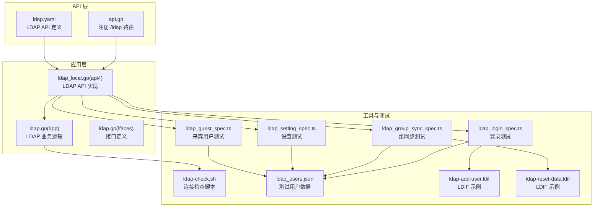
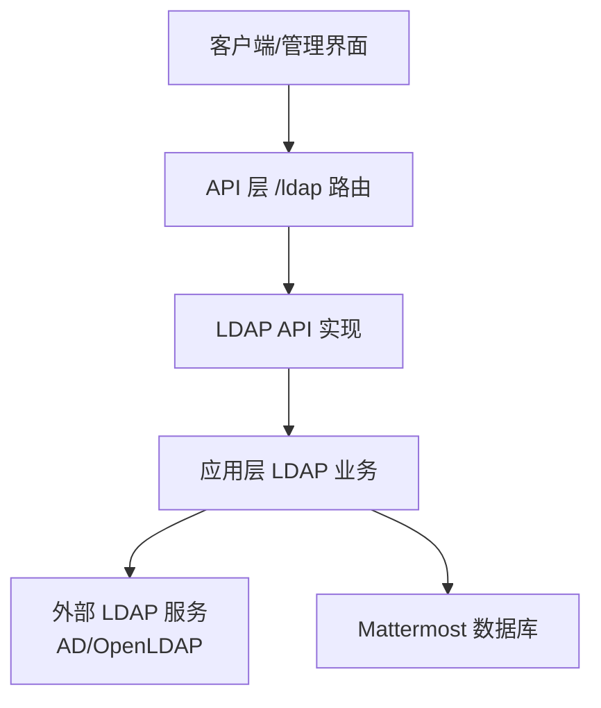
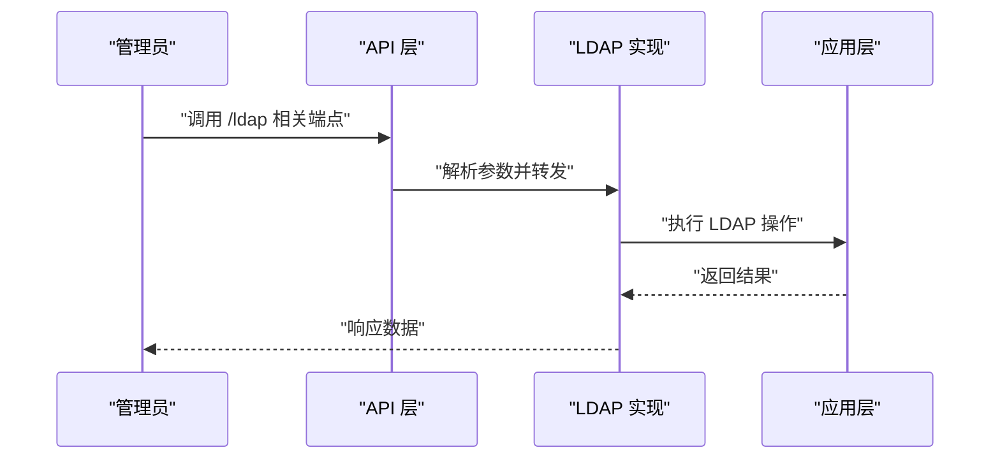
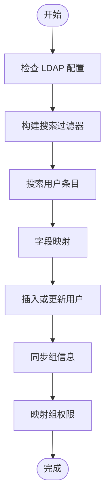
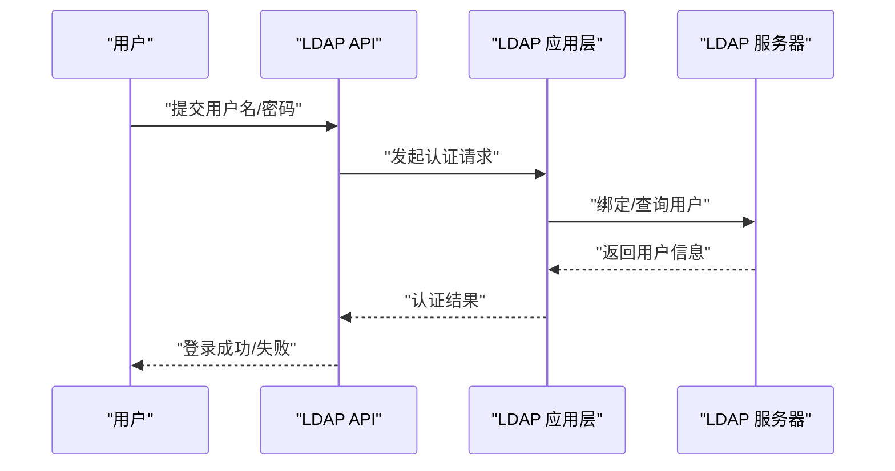
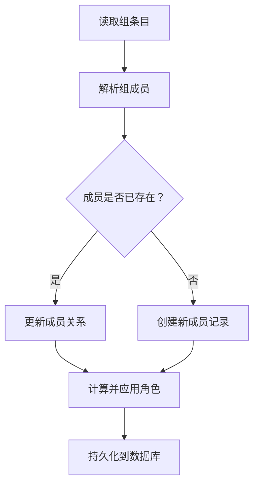
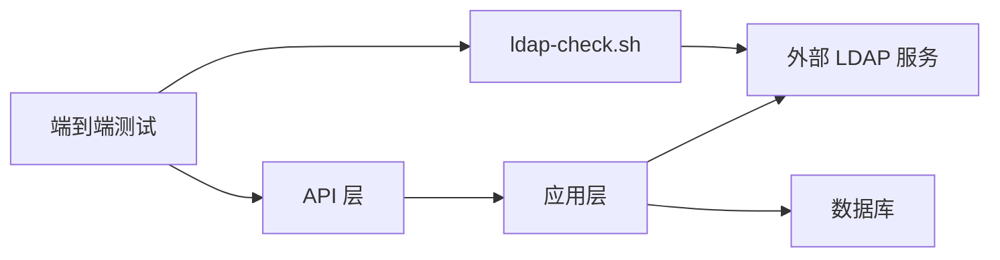

# LDAP 集成

<cite>
**本文引用的文件**
- [ldap.yaml](file://api/v4/source/ldap.yaml)
- [ldap.go](file://server/channels/api4/ldap.go)
- [ldap_local.go](file://server/channels/api4/ldap_local.go)
- [ldap.go](file://server/channels/app/ldap.go)
- [ldap.go](file://server/einterfaces/ldap.go)
- [ldap-check.sh](file://server/scripts/ldap-check.sh)
- [apitestlib.go](file://server/channels/api4/apitestlib.go)
- [ldap_group_sync_spec.ts](file://e2e-tests/cypress/tests/integration/channels/enterprise/ldap/ldap_group_sync_spec.ts)
- [ldap_login_spec.ts](file://e2e-tests/cypress/tests/integration/channels/enterprise/ldap/ldap_login_spec.ts)
- [ldap_setting_spec.ts](file://e2e-tests/cypress/tests/integration/channels/enterprise/ldap/ldap_setting_spec.ts)
- [ldap_guest_spec.ts](file://e2e-tests/cypress/tests/integration/channels/enterprise/ldap/ldap_guest_spec.ts)
- [ldap_users.json](file://e2e-tests/cypress/tests/fixtures/ldap_users.json)
- [ldap-add-user.ldif](file://e2e-tests/cypress/tests/fixtures/ldap-add-user.ldif)
- [ldap-reset-data.ldif](file://e2e-tests/cypress/tests/fixtures/ldap-reset-data.ldif)
- [api.go](file://server/channels/api4/api.go)
- [main.go](file://server/build/docker-compose-generator/main.go)
</cite>

## 目录
1. [简介](#简介)
2. [项目结构](#项目结构)
3. [核心组件](#核心组件)
4. [架构总览](#架构总览)
5. [详细组件分析](#详细组件分析)
6. [依赖分析](#依赖分析)
7. [性能考虑](#性能考虑)
8. [故障排除指南](#故障排除指南)
9. [结论](#结论)
10. [附录](#附录)

## 简介
本文件系统性阐述 Mattermost 中的 LDAP 集成功能，覆盖服务器配置、连接参数、认证方式、服务器发现、用户与组同步、字段映射、搜索过滤器、连接池配置、常见服务器（Active Directory、OpenLDAP）的配置示例与最佳实践，以及故障排除与性能优化建议。内容基于仓库中现有的 API 定义、后端实现、脚本与端到端测试用例进行归纳总结。

## 项目结构
围绕 LDAP 的相关模块分布在以下位置：
- API 层：定义 LDAP 相关接口与路由
- 应用层：实现 LDAP 同步、登录、组同步等业务逻辑
- 脚本工具：提供 LDAP 连接检查脚本
- 端到端测试：验证登录、同步、组同步、来宾用户等功能
- 配置与示例：包含测试用例使用的 LDIF 示例与用户数据

图表来源
- [api.go](file://server/channels/api4/api.go)
- [ldap.yaml](file://api/v4/source/ldap.yaml)
- [ldap.go](file://server/channels/api4/ldap.go)
- [ldap_local.go](file://server/channels/api4/ldap_local.go)
- [ldap.go](file://server/channels/app/ldap.go)
- [ldap-check.sh](file://server/scripts/ldap-check.sh)
- [ldap_login_spec.ts](file://e2e-tests/cypress/tests/integration/channels/enterprise/ldap/ldap_login_spec.ts)
- [ldap_group_sync_spec.ts](file://e2e-tests/cypress/tests/integration/channels/enterprise/ldap/ldap_group_sync_spec.ts)
- [ldap_setting_spec.ts](file://e2e-tests/cypress/tests/integration/channels/enterprise/ldap/ldap_setting_spec.ts)
- [ldap_guest_spec.ts](file://e2e-tests/cypress/tests/integration/channels/enterprise/ldap/ldap_guest_spec.ts)
- [ldap_users.json](file://e2e-tests/cypress/tests/fixtures/ldap_users.json)
- [ldap-add-user.ldif](file://e2e-tests/cypress/tests/fixtures/ldap-add-user.ldif)
- [ldap-reset-data.ldif](file://e2e-tests/cypress/tests/fixtures/ldap-reset-data.ldif)

章节来源
- [api.go](file://server/channels/api4/api.go)
- [ldap.yaml](file://api/v4/source/ldap.yaml)

## 核心组件
- LDAP API 路由与定义：在 API 层注册 /ldap 前缀路由，并通过 OpenAPI 定义暴露 LDAP 相关操作。
- LDAP 应用逻辑：实现用户与组的同步、登录认证、组成员关系维护、权限映射等。
- LDAP 工具脚本：提供连接连通性检查能力，辅助诊断连接问题。
- 端到端测试：覆盖登录、设置开关、组同步、来宾用户等场景，验证集成效果。

章节来源
- [api.go](file://server/channels/api4/api.go)
- [ldap.yaml](file://api/v4/source/ldap.yaml)
- [ldap-check.sh](file://server/scripts/ldap-check.sh)

## 架构总览
LDAP 集成采用“API 层 -> 应用层 -> 外部 LDAP 服务”的分层架构。API 层负责请求接入与参数校验；应用层负责与外部 LDAP 交互、执行同步与认证；外部 LDAP 服务（如 Active Directory 或 OpenLDAP）作为数据源与认证提供方。

图表来源
- [api.go](file://server/channels/api4/api.go)
- [ldap.go](file://server/channels/api4/ldap.go)
- [ldap.go](file://server/channels/app/ldap.go)

## 详细组件分析

### 组件一：LDAP API 与路由
- 路由注册：在 API 根路径下为 LDAP 注册子路由前缀，便于统一管理与扩展。
- OpenAPI 定义：通过 YAML 明确定义 LDAP 相关端点、参数与响应格式，确保前后端契约一致。
- 测试辅助：测试库提供便捷配置 LDAP 设置的方法，便于自动化测试。

图表来源
- [api.go](file://server/channels/api4/api.go)
- [ldap.yaml](file://api/v4/source/ldap.yaml)
- [ldap.go](file://server/channels/api4/ldap.go)

章节来源
- [api.go](file://server/channels/api4/api.go)
- [ldap.yaml](file://api/v4/source/ldap.yaml)
- [apitestlib.go](file://server/channels/api4/apitestlib.go)

### 组件二：LDAP 用户与组同步
- 用户同步：支持一次性导入与周期性同步，可结合增量更新策略减少开销。
- 组同步：支持组成员关系维护与权限映射，确保用户加入团队/频道时具备正确权限。
- 字段映射：通过属性映射将 LDAP 条目字段映射到 Mattermost 用户与组模型。
- 搜索过滤器：支持自定义过滤器以限定查询范围，提升性能与准确性。
- 连接池配置：支持连接池大小、超时等参数，保障高并发下的稳定性。

图表来源
- [ldap.go](file://server/channels/app/ldap.go)
- [ldap.yaml](file://api/v4/source/ldap.yaml)

章节来源
- [ldap.go](file://server/channels/app/ldap.go)
- [ldap.yaml](file://api/v4/source/ldap.yaml)

### 组件三：LDAP 登录与认证
- 认证流程：用户凭 LDAP 凭据登录，系统验证后发放会话。
- 支持多种认证方式：可配置 Bind DN 与密码、匿名绑定等。
- 证书校验：支持跳过证书验证（仅限开发环境），生产环境建议启用严格校验。

图表来源
- [ldap.go](file://server/channels/api4/ldap.go)
- [ldap.go](file://server/channels/app/ldap.go)
- [ldap_login_spec.ts](file://e2e-tests/cypress/tests/integration/channels/enterprise/ldap/ldap_login_spec.ts)

章节来源
- [ldap.go](file://server/channels/api4/ldap.go)
- [ldap.go](file://server/channels/app/ldap.go)
- [ldap_login_spec.ts](file://e2e-tests/cypress/tests/integration/channels/enterprise/ldap/ldap_login_spec.ts)

### 组件四：LDAP 组管理与权限映射
- 组同步：从 LDAP 读取组信息，建立与 Mattermost 团队/频道的关联。
- 成员关系维护：根据组成员变更自动调整用户在团队/频道中的成员身份。
- 权限映射：将 LDAP 组角色映射到 Mattermost 角色，确保最小权限原则。

图表来源
- [ldap.go](file://server/channels/app/ldap.go)
- [ldap_group_sync_spec.ts](file://e2e-tests/cypress/tests/integration/channels/enterprise/ldap/ldap_group_sync_spec.ts)

章节来源
- [ldap.go](file://server/channels/app/ldap.go)
- [ldap_group_sync_spec.ts](file://e2e-tests/cypress/tests/integration/channels/enterprise/ldap/ldap_group_sync_spec.ts)

### 组件五：LDAP 配置选项与最佳实践
- 连接参数：服务器地址、端口、BaseDN、Bind DN 与密码、TLS/StartTLS、证书校验。
- 认证方式：简单绑定、匿名绑定、SASL 绑定等。
- 字段映射：用户名、邮箱、姓名、ID 属性等映射键位。
- 搜索过滤器：按需限制查询范围，避免全量扫描。
- 连接池：合理设置最大连接数、空闲超时、请求超时。
- 服务器发现：可通过 DNS SRV 记录或手动配置主机名与端口。

章节来源
- [ldap.yaml](file://api/v4/source/ldap.yaml)
- [ldap-setting_spec.ts](file://e2e-tests/cypress/tests/integration/channels/enterprise/ldap/ldap_setting_spec.ts)

### 组件六：常见 LDAP 服务器配置示例与最佳实践
- Active Directory（AD）
  - BaseDN：组织单位或域根。
  - Bind DN：域用户或服务账户。
  - 过滤器：使用对象类与属性组合筛选用户与组。
  - TLS：启用 StartTLS 或 LDAPS。
  - 字段映射：sAMAccountName、mail、givenName、sn、objectGUID 等。
- OpenLDAP
  - BaseDN：组织树根。
  - Bind DN：manager 或特定用户。
  - 过滤器：使用 posixAccount、groupOfNames 等标准对象类。
  - TLS：建议使用 LDAPS。
  - 字段映射：uid、mail、givenName、sn、entryUUID 等。
- 最佳实践
  - 生产环境启用证书校验与加密通道。
  - 使用专用只读服务账户执行查询与绑定。
  - 合理设置搜索过滤器与分页大小，避免阻塞。
  - 定期清理无效用户与组，保持目录整洁。

章节来源
- [ldap.yaml](file://api/v4/source/ldap.yaml)
- [ldap-setting_spec.ts](file://e2e-tests/cypress/tests/integration/channels/enterprise/ldap/ldap_setting_spec.ts)

### 组件七：端到端测试与示例数据
- 登录测试：验证用户使用 LDAP 凭据登录系统。
- 组同步测试：验证组成员变更后用户权限的自动更新。
- 设置测试：验证 LDAP 开关、字段映射、过滤器等配置项。
- 来宾用户测试：验证来宾用户的创建与权限控制。
- 示例数据：LDIF 文件用于快速导入测试用户与组；JSON 文件提供测试用户清单。

章节来源
- [ldap_login_spec.ts](file://e2e-tests/cypress/tests/integration/channels/enterprise/ldap/ldap_login_spec.ts)
- [ldap_group_sync_spec.ts](file://e2e-tests/cypress/tests/integration/channels/enterprise/ldap/ldap_group_sync_spec.ts)
- [ldap_setting_spec.ts](file://e2e-tests/cypress/tests/integration/channels/enterprise/ldap/ldap_setting_spec.ts)
- [ldap_guest_spec.ts](file://e2e-tests/cypress/tests/integration/channels/enterprise/ldap/ldap_guest_spec.ts)
- [ldap_users.json](file://e2e-tests/cypress/tests/fixtures/ldap_users.json)
- [ldap-add-user.ldif](file://e2e-tests/cypress/tests/fixtures/ldap-add-user.ldif)
- [ldap-reset-data.ldif](file://e2e-tests/cypress/tests/fixtures/ldap-reset-data.ldif)

## 依赖分析
- API 层依赖应用层实现具体业务逻辑。
- 应用层依赖外部 LDAP 服务，同时写入本地数据库。
- 工具脚本独立于主流程，用于诊断连接问题。
- 端到端测试依赖测试数据与脚本，验证完整链路。

图表来源
- [api.go](file://server/channels/api4/api.go)
- [ldap.go](file://server/channels/app/ldap.go)
- [ldap-check.sh](file://server/scripts/ldap-check.sh)

章节来源
- [api.go](file://server/channels/api4/api.go)
- [ldap.go](file://server/channels/app/ldap.go)
- [ldap-check.sh](file://server/scripts/ldap-check.sh)

## 性能考虑
- 分页与批量：合理设置分页大小，避免单次请求过大导致延迟。
- 过滤器优化：使用精确过滤器减少查询负载。
- 连接池：根据并发访问量调整连接池大小与超时参数。
- 增量同步：优先使用时间戳或变更日志进行增量更新，降低全量扫描频率。
- 缓存策略：对不频繁变动的数据进行缓存，减少重复查询。

## 故障排除指南
- 连接测试
  - 使用内置脚本进行基础连通性检测，确认主机、端口、证书与网络可达性。
  - 检查 Bind DN 与密码是否正确，确认服务账户权限足够。
- 同步日志分析
  - 关注用户导入与组同步过程中的错误信息，定位字段映射与过滤器问题。
  - 对比 LDIF 示例与实际目录结构，确保属性名称与对象类匹配。
- 性能优化建议
  - 启用 StartTLS/LDAPS 并配置证书校验，避免在生产环境跳过校验。
  - 为高并发场景增加连接池容量与超时阈值。
  - 使用更精确的过滤器与分页策略，减少不必要的网络往返。

章节来源
- [ldap-check.sh](file://server/scripts/ldap-check.sh)
- [ldap-setting_spec.ts](file://e2e-tests/cypress/tests/integration/channels/enterprise/ldap/ldap_setting_spec.ts)

## 结论
Mattermost 的 LDAP 集成提供了完整的认证与目录同步能力，涵盖用户与组的导入、周期性与增量同步、权限映射与多服务器适配。通过合理的配置与最佳实践，可在保证安全性的前提下实现高效稳定的目录集成。建议在生产环境中启用加密通道与严格的证书校验，并结合分页与过滤器优化性能。

## 附录
- 服务器端口参考：OpenLDAP 默认端口为 389，可在构建脚本中找到对应常量。
- 测试数据与示例：LDIF 与 JSON 文件可用于快速搭建测试环境与回归验证。

章节来源
- [main.go](file://server/build/docker-compose-generator/main.go)
- [ldap-add-user.ldif](file://e2e-tests/cypress/tests/fixtures/ldap-add-user.ldif)
- [ldap-reset-data.ldif](file://e2e-tests/cypress/tests/fixtures/ldap-reset-data.ldif)
- [ldap_users.json](file://e2e-tests/cypress/tests/fixtures/ldap_users.json)