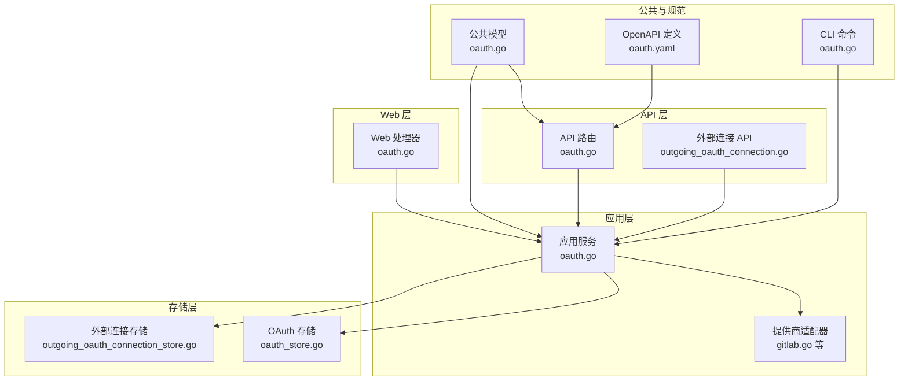
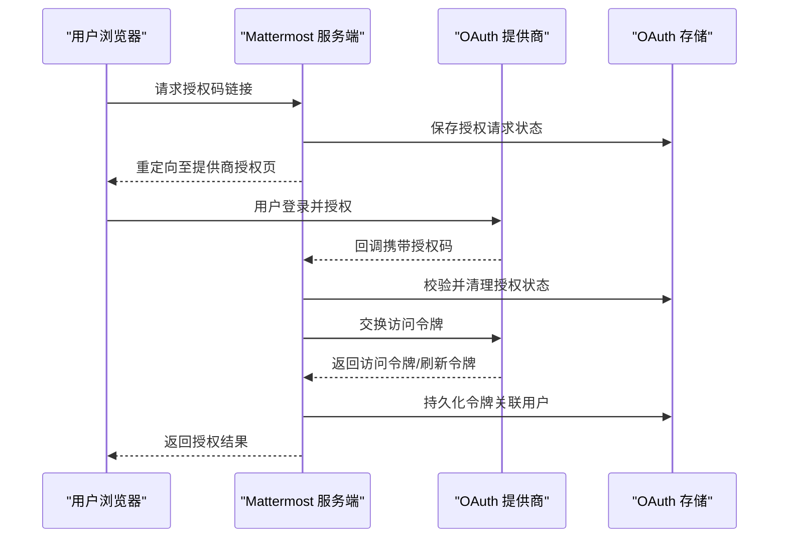
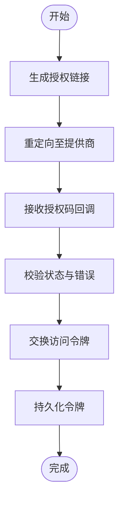
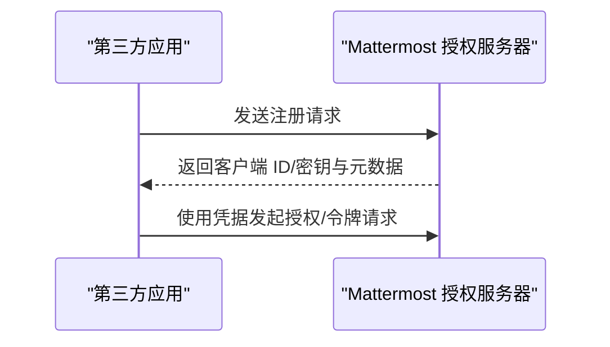
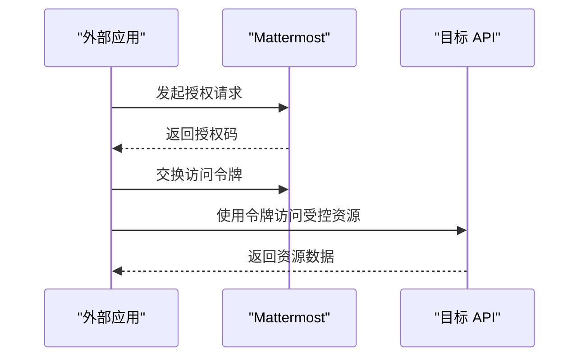
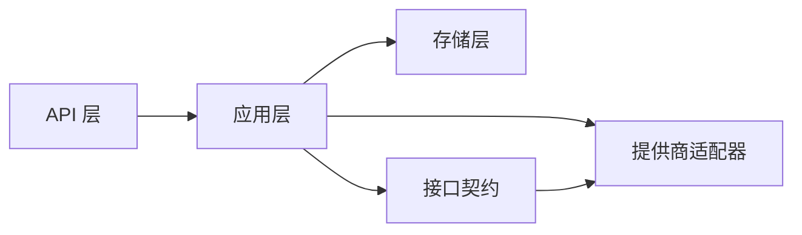

# OAuth 2.0 集成

<cite>
**本文档引用的文件**
- [oauth.go](file://server/channels/api4/oauth.go)
- [oauth_test.go](file://server/channels/api4/oauth_test.go)
- [oauth.go](file://server/channels/app/oauth.go)
- [oauth_test.go](file://server/channels/app/oauth_test.go)
- [oauth.go](file://server/channels/web/oauth.go)
- [oauth.yaml](file://api/v4/source/oauth.yaml)
- [gitlab.go](file://server/channels/app/oauthproviders/gitlab/gitlab.go)
- [oauth.go](file://server/public/model/oauth.go)
- [oauth.go](file://server/cmd/mmctl/commands/oauth.go)
- [outgoing_oauth_connection.go](file://server/channels/api4/outgoing_oauth_connection.go)
- [outgoing_oauth_connection_test.go](file://server/channels/api4/outgoing_oauth_connection_test.go)
- [oauthproviders.go](file://server/einterfaces/oauthproviders.go)
- [outgoing_oauth_connection.go](file://server/einterfaces/outgoing_oauth_connection.go)
</cite>

## 目录
1. [简介](#简介)
2. [项目结构](#项目结构)
3. [核心组件](#核心组件)
4. [架构总览](#架构总览)
5. [详细组件分析](#详细组件分析)
6. [依赖关系分析](#依赖关系分析)
7. [性能考量](#性能考量)
8. [故障排除指南](#故障排除指南)
9. [结论](#结论)
10. [附录](#附录)

## 简介
本文件系统性阐述 Mattermost 中 OAuth 2.0 的集成与实现，覆盖以下主题：
- 协议流程：授权码流程、简化流程、客户端凭证流程
- 提供商配置：客户端注册、重定向 URI 设置、作用域管理
- 令牌管理：访问令牌获取、刷新令牌处理、令牌验证
- 外部 OAuth 连接：第三方应用集成与 API 访问控制
- 常见提供商示例：GitHub、GitLab、Google 的配置要点与最佳实践
- 安全考量：PKCE 实现、令牌存储、CSRF 防护

## 项目结构
Mattermost 的 OAuth 2.0 能力由多层模块协同实现：
- API 层：提供 OAuth 相关接口与路由
- 应用层：封装 OAuth 业务逻辑与提供商适配
- Web 层：处理浏览器端重定向与状态参数
- 存储层：持久化 OAuth 应用与连接信息
- 公共模型与 CLI：对外暴露数据结构与命令行工具
- OpenAPI 定义：统一的 API 规范与参数说明

图表来源
- [oauth.go:1-200](file://server/channels/api4/oauth.go#L1-L200)
- [oauth.go:1-200](file://server/channels/app/oauth.go#L1-L200)
- [oauth.go:1-200](file://server/channels/web/oauth.go#L1-L200)
- [gitlab.go:1-200](file://server/channels/app/oauthproviders/gitlab/gitlab.go#L1-L200)
- [oauth.yaml:1-200](file://api/v4/source/oauth.yaml#L1-L200)
- [oauth.go:1-200](file://server/cmd/mmctl/commands/oauth.go#L1-L200)

章节来源
- [oauth.go:1-200](file://server/channels/api4/oauth.go#L1-L200)
- [oauth.go:1-200](file://server/channels/app/oauth.go#L1-L200)
- [oauth.go:1-200](file://server/channels/web/oauth.go#L1-L200)
- [gitlab.go:1-200](file://server/channels/app/oauthproviders/gitlab/gitlab.go#L1-L200)
- [oauth.yaml:1-200](file://api/v4/source/oauth.yaml#L1-L200)
- [oauth.go:1-200](file://server/cmd/mmctl/commands/oauth.go#L1-L200)

## 核心组件
- OAuth 应用管理：创建、更新、删除与查询 OAuth 应用；支持动态客户端注册元数据下发
- 授权服务器元数据：提供授权端点、令牌端点、注册端点等
- 授权码流程：生成授权链接、处理回调、交换访问令牌
- 简化流程：隐式授权，适用于公共客户端
- 客户端凭证流程：用于后端服务间调用
- 外部 OAuth 连接：第三方应用通过 OAuth 访问 Mattermost API
- 提供商适配：针对 GitLab 等提供商的特定实现
- 安全增强：CSRF 防护、PKCE 支持、令牌校验与刷新

章节来源
- [oauth.go:1-200](file://server/channels/app/oauth.go#L1-L200)
- [oauth_test.go:944-981](file://server/channels/app/oauth_test.go#L944-L981)
- [oauth.go:1-200](file://server/channels/api4/oauth.go#L1-L200)

## 架构总览
下图展示从浏览器到应用层再到提供商的典型授权码流程：

图表来源
- [oauth.go:1-200](file://server/channels/web/oauth.go#L1-L200)
- [oauth.go:1-200](file://server/channels/app/oauth.go#L1-L200)
- [oauth.go:1-200](file://server/channels/api4/oauth.go#L1-L200)

## 详细组件分析

### 授权码流程（Authorization Code）
- 授权链接生成：应用层根据配置与状态参数生成授权 URL
- 回调处理：Web 层接收回调，校验状态与错误，交换访问令牌
- 令牌持久化：将访问令牌与刷新令牌绑定用户并存入存储层
- 安全要点：CSRF 状态参数、PKCE 验证、回调 URI 白名单

图表来源
- [oauth.go:1-200](file://server/channels/web/oauth.go#L1-L200)
- [oauth.go:1-200](file://server/channels/app/oauth.go#L1-L200)

章节来源
- [oauth.go:1-200](file://server/channels/web/oauth.go#L1-L200)
- [oauth.go:1-200](file://server/channels/app/oauth.go#L1-L200)

### 简化流程（Implicit）
- 适用场景：公共客户端在浏览器中直接获取访问令牌
- 配置要求：启用简化流程开关与对应提供商配置
- 安全建议：严格限制回调 URI 与作用域范围

章节来源
- [oauth.go:1-200](file://server/channels/app/oauth.go#L1-L200)

### 客户端凭证流程（Client Credentials）
- 适用场景：服务到服务调用，无需用户代理参与
- 实现方式：应用层直接向提供商令牌端点发起请求
- 注意事项：确保客户端凭据保密与作用域最小化

章节来源
- [oauth.go:1-200](file://server/channels/app/oauth.go#L1-L200)

### 动态客户端注册（DCR）
- 启用条件：服务端配置开启动态客户端注册
- 元数据下发：授权服务器元数据包含注册端点
- 注册流程：第三方应用可按规范进行注册并获得客户端凭据

图表来源
- [oauth_test.go:944-981](file://server/channels/app/oauth_test.go#L944-L981)

章节来源
- [oauth_test.go:944-981](file://server/channels/app/oauth_test.go#L944-L981)

### 外部 OAuth 连接（Outgoing OAuth Connections）
- 目标：允许外部应用以 OAuth 方式访问 Mattermost API
- 流程：外部应用通过 Mattermost 授权后，换取访问令牌执行受控 API 调用
- 控制：管理员可配置连接白名单、作用域与有效期

图表来源
- [outgoing_oauth_connection.go:1-200](file://server/channels/api4/outgoing_oauth_connection.go#L1-L200)

章节来源
- [outgoing_oauth_connection.go:1-200](file://server/channels/api4/outgoing_oauth_connection.go#L1-L200)
- [outgoing_oauth_connection_test.go:1-200](file://server/channels/api4/outgoing_oauth_connection_test.go#L1-L200)

### 提供商适配（以 GitLab 为例）
- 适配内容：重定向 URI、作用域映射、用户信息解析
- 配置要点：客户端 ID/密钥、授权端点、令牌端点、用户信息端点
- 最佳实践：启用 HTTPS、最小权限作用域、定期轮换密钥

章节来源
- [gitlab.go:1-200](file://server/channels/app/oauthproviders/gitlab/gitlab.go#L1-L200)

### OpenAPI 规范与 CLI 工具
- OpenAPI：统一定义 OAuth 相关端点、参数与响应格式
- CLI：提供命令行工具进行 OAuth 应用与连接的管理

章节来源
- [oauth.yaml:1-200](file://api/v4/source/oauth.yaml#L1-L200)
- [oauth.go:1-200](file://server/cmd/mmctl/commands/oauth.go#L1-L200)

## 依赖关系分析
- 组件耦合：API 层依赖应用层；应用层依赖存储层与提供商适配器
- 外部依赖：OAuth 提供商的授权/令牌端点与用户信息端点
- 接口契约：einterfaces 定义了 OAuth 提供商与外部连接的抽象接口

图表来源
- [oauth.go:1-200](file://server/channels/api4/oauth.go#L1-L200)
- [oauth.go:1-200](file://server/channels/app/oauth.go#L1-L200)
- [oauthproviders.go:1-200](file://server/einterfaces/oauthproviders.go#L1-L200)
- [outgoing_oauth_connection.go:1-200](file://server/einterfaces/outgoing_oauth_connection.go#L1-L200)

章节来源
- [oauth.go:1-200](file://server/channels/api4/oauth.go#L1-L200)
- [oauth.go:1-200](file://server/channels/app/oauth.go#L1-L200)
- [oauthproviders.go:1-200](file://server/einterfaces/oauthproviders.go#L1-L200)
- [outgoing_oauth_connection.go:1-200](file://server/einterfaces/outgoing_oauth_connection.go#L1-L200)

## 性能考量
- 缓存策略：对授权服务器元数据与提供商配置进行缓存，减少网络往返
- 并发控制：令牌交换与回调处理需避免竞态，采用原子操作或锁
- 超时与重试：为提供商端点调用设置合理超时与指数退避
- 日志与监控：记录关键事件与错误，便于追踪与优化

## 故障排除指南
- 授权失败排查
  - 校验回调 URI 是否与注册一致
  - 确认状态参数未被篡改且未过期
  - 检查 PKCE 验证是否通过
- 令牌交换失败排查
  - 确认客户端凭据正确且未泄露
  - 检查提供商端点可达性与证书有效性
  - 查看存储层是否正确持久化令牌
- 外部连接异常排查
  - 核对连接配置与作用域
  - 检查令牌刷新逻辑与有效期
  - 关注 API 限流与配额

章节来源
- [oauth.go:1-200](file://server/channels/web/oauth.go#L1-L200)
- [oauth.go:1-200](file://server/channels/app/oauth.go#L1-L200)

## 结论
Mattermost 的 OAuth 2.0 集成提供了完整的授权码、简化与客户端凭证流程支持，并通过动态客户端注册、外部连接与提供商适配扩展了生态集成能力。结合安全增强与标准化的 OpenAPI，可在保障安全的前提下实现灵活的第三方应用接入。

## 附录

### 常见提供商配置要点与最佳实践
- GitHub
  - 客户端注册：在 GitHub OAuth Apps 中创建应用，填写回调 URL
  - 作用域：按需申请，如 public_repo、repo 等
  - 最佳实践：启用 HTTPS、最小权限原则、定期轮换密钥
- GitLab
  - 客户端注册：在 GitLab 中创建应用，配置重定向 URI
  - 作用域：使用默认或自定义范围
  - 最佳实践：与 Mattermost 的 GitLab 适配器保持一致的端点配置
- Google
  - 客户端注册：在 Google Cloud Console 创建 OAuth 客户端 ID
  - 作用域：使用 openid、profile、email 等
  - 最佳实践：严格校验回调域名与 CSRF 状态

章节来源
- [gitlab.go:1-200](file://server/channels/app/oauthproviders/gitlab/gitlab.go#L1-L200)

### 安全考虑
- PKCE 实现：授权码流程中启用并验证 code_challenge 与 code_verifier
- 令牌存储：敏感信息加密存储，定期轮换密钥与令牌
- CSRF 防护：状态参数随机化与一次性使用
- 端点安全：仅允许 HTTPS，校验证书链与吊销列表
- 作用域最小化：仅授予完成任务所需的最小权限

章节来源
- [oauth.go:1-200](file://server/channels/app/oauth.go#L1-L200)
- [oauth.go:1-200](file://server/channels/web/oauth.go#L1-L200)