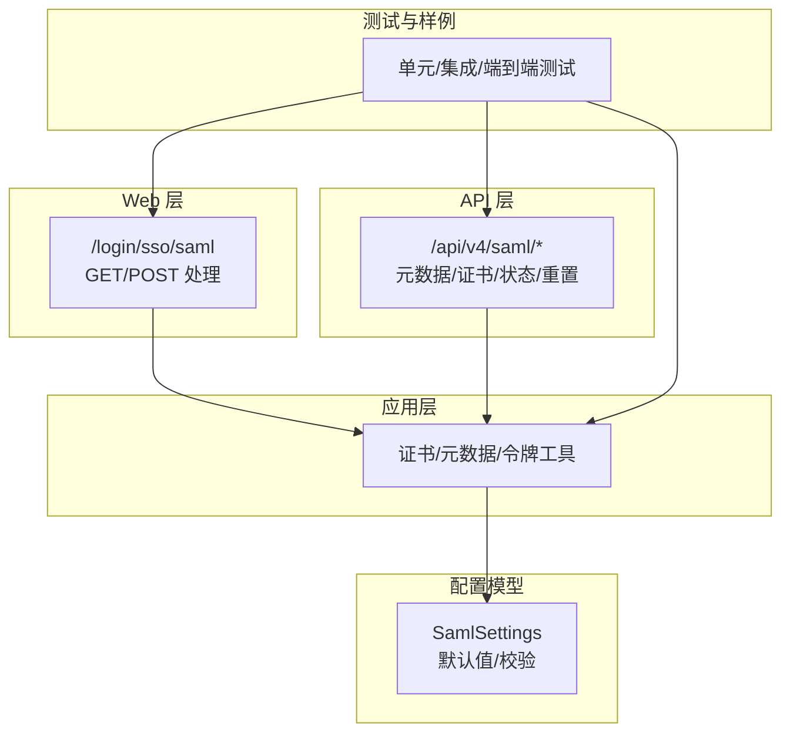
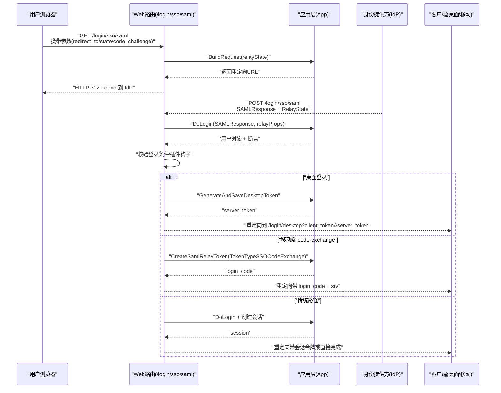
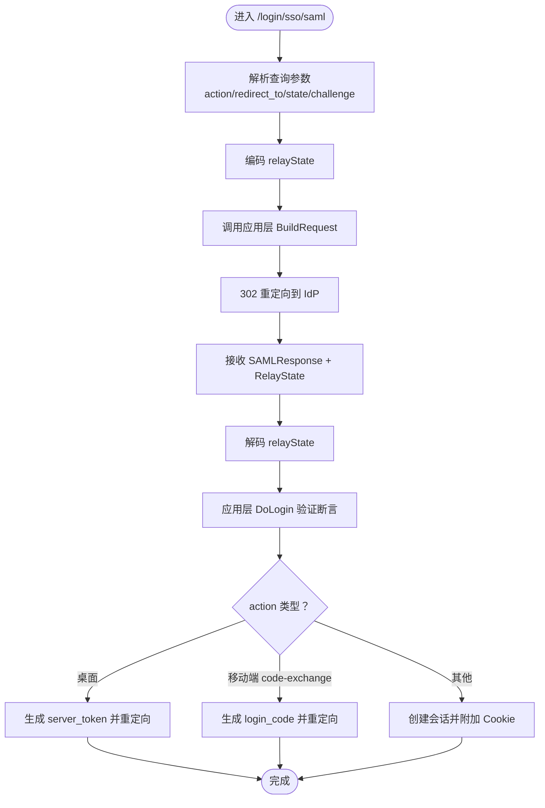
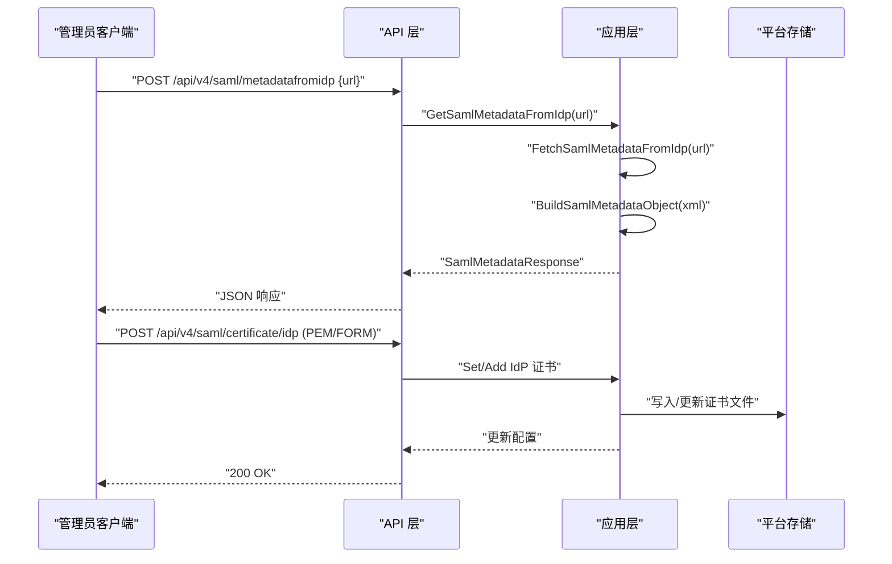
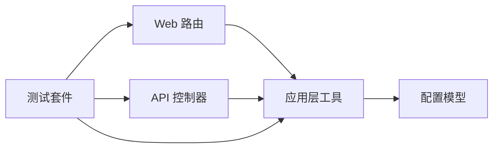

# SAML 认证

<cite>
**本文引用的文件**
- [server\channels\api4\saml.go](file://server\channels\api4\saml.go)
- [api\v4\source\saml.yaml](file://api\v4\source\saml.yaml)
- [server\channels\app\saml.go](file://server\channels\app\saml.go)
- [server\channels\web\saml.go](file://server\channels\web\saml.go)
- [server\public\model\config.go](file://server\public\model\config.go)
- [server\channels\api4\saml_test.go](file://server\channels\api4\saml_test.go)
- [server\channels\web\saml_test.go](file://server\channels\web\saml_test.go)
- [server\build\docker\keycloak\saml.mmsettings.json](file://server\build\docker\keycloak\saml.mmsettings.json)
- [e2e-tests\cypress\tests\integration\channels\enterprise\saml\saml_automated_spec.ts](file://e2e-tests\cypress\tests\integration\channels\enterprise\saml\saml_automated_spec.ts)
- [e2e-tests\cypress\tests\integration\channels\enterprise\saml\saml_metadata_spec.ts](file://e2e-tests\cypress\tests\integration\channels\enterprise\saml\saml_metadata_spec.ts)
- [e2e-tests\cypress\tests\integration\channels\enterprise\saml\okta_login_spec.ts](file://e2e-tests\cypress\tests\integration\channels\enterprise\saml\okta_login_spec.ts)
- [e2e-tests\cypress\tests\integration\channels\ad_ldap\saml_ldap_sync_spec.ts](file://e2e-tests\cypress\tests\integration\channels\ad_ldap\saml_ldap_sync_spec.ts)
- [e2e-tests\cypress\tests\integration\channels\enterprise\extend_session\not_extended_when_disabled\with_saml_login_spec.ts](file://e2e-tests\cypress\tests\integration\channels\enterprise\extend_session\not_extended_when_disabled\with_saml_login_spec.ts)
- [e2e-tests\cypress\tests\support\api\saml.d.ts](file://e2e-tests\cypress\tests\support\api\saml.d.ts)
- [e2e-tests\cypress\tests\support\saml_commands.ts](file://e2e-tests\cypress\tests\support\saml_commands.ts)
</cite>

## 目录
1. [简介](#简介)
2. [项目结构](#项目结构)
3. [核心组件](#核心组件)
4. [架构总览](#架构总览)
5. [详细组件分析](#详细组件分析)
6. [依赖关系分析](#依赖关系分析)
7. [性能考量](#性能考量)
8. [故障排除指南](#故障排除指南)
9. [结论](#结论)
10. [附录](#附录)

## 简介
本文件系统性阐述 Mattermost 中 SAML 2.0 认证的实现与使用，覆盖身份提供方（IdP）配置、元数据交换与证书管理；单点登录（SSO）流程（登录请求生成、断言接收与验证、用户会话建立）；断言处理机制（属性映射、角色/权限继承与同步）；配置项（绑定方式、签名与加密策略）；主流 IdP（Okta、Azure AD、AD FS、Keycloak）集成要点与配置模板；以及故障排除与性能监控建议。

## 项目结构
围绕 SAML 的相关代码分布在以下模块：
- Web 层路由：负责 SSO 登录入口与断言回调处理
- API 层接口：提供元数据导出、从 IdP 拉取元数据、证书上传/删除/状态查询、重置 AuthData 等
- 应用层逻辑：封装证书写入/删除、元数据解析、认证令牌生成等
- 配置模型：定义 SAML 各项配置项、默认值与校验规则
- 测试与端到端样例：覆盖自动化测试、元数据与 Okta 登录、与 LDAP 的同步场景

图表来源
- [server\channels\web\saml.go:21-24](file://server\channels\web\saml.go#L21-L24)
- [server\channels\api4\saml.go:17-37](file://server\channels\api4\saml.go#L17-L37)
- [server\channels\app\saml.go:27-38](file://server\channels\app\saml.go#L27-L38)
- [server\public\model\config.go:3022-3160](file://server\public\model\config.go#L3022-L3160)

章节来源
- [server\channels\web\saml.go:21-24](file://server\channels\web\saml.go#L21-L24)
- [server\channels\api4\saml.go:17-37](file://server\channels\api4\saml.go#L17-L37)
- [server\channels\app\saml.go:27-38](file://server\channels\app\saml.go#L27-L38)
- [server\public\model\config.go:3022-3160](file://server\public\model\config.go#L3022-L3160)

## 核心组件
- Web 路由与控制器
  - GET /login/sso/saml：构建并重定向至 IdP 登录
  - POST /login/sso/saml：接收 SAMLResponse，完成登录、会话建立或移动端一次性登录码交换
- API 端点
  - GET /api/v4/saml/metadata：导出服务提供方元数据
  - POST /api/v4/saml/metadatafromidp：从 IdP 元数据 URL 拉取并解析
  - POST/DELETE /api/v4/saml/certificate/{idp|public|private}：上传/删除证书
  - GET /api/v4/saml/certificate/status：查询证书状态
  - POST /api/v4/saml/reset_auth_data：将 SAML 用户 AuthData 迁移回邮箱
- 应用层工具
  - 证书文件写入/删除、配置更新
  - 从 IdP 拉取元数据、解析为内部对象
  - 生成/校验 SAML Relay Token（移动端 code-exchange）
- 配置模型
  - Enable、Verify、Encrypt、SignRequest、SignatureAlgorithm、CanonicalAlgorithm
  - IdP/SP 相关 URL、证书文件名、AssertionConsumerServiceURL
  - 用户属性映射字段（Id、Guest、Admin、姓名、邮箱、用户名、昵称、位置、语言）
  - 默认值与严格校验（如算法枚举、属性格式）

章节来源
- [server\channels\web\saml.go:26-99](file://server\channels\web\saml.go#L26-L99)
- [server\channels\web\saml.go:101-307](file://server\channels\web\saml.go#L101-L307)
- [server\channels\api4\saml.go:39-262](file://server\channels\api4\saml.go#L39-L262)
- [server\channels\api4\saml.go:264-295](file://server\channels\api4\saml.go#L264-L295)
- [server\channels\app\saml.go:60-171](file://server\channels\app\saml.go#L60-L171)
- [server\channels\app\saml.go:183-286](file://server\channels\app\saml.go#L183-L286)
- [server\channels\app\saml.go:301-328](file://server\channels\app\saml.go#L301-L328)
- [server\public\model\config.go:3000-3160](file://server\public\model\config.go#L3000-L3160)
- [server\public\model\config.go:4800-4844](file://server\public\model\config.go#L4800-L4844)

## 架构总览
下图展示一次完整的 SAML SSO 流程：浏览器访问登录入口 -> 服务端生成请求 -> IdP 验证用户 -> 返回断言 -> 服务端验证断言 -> 建立会话或移动端一次性登录码 -> 回跳客户端。

图表来源
- [server\channels\web\saml.go:26-99](file://server\channels\web\saml.go#L26-L99)
- [server\channels\web\saml.go:101-307](file://server\channels\web\saml.go#L101-L307)
- [server\channels\app\saml.go:301-328](file://server\channels\app\saml.go#L301-L328)

## 详细组件分析

### Web 层：登录与断言处理
- GET /login/sso/saml
  - 解析 action、redirect_to、移动端 code challenge 等参数，编码为 relayState
  - 调用应用层生成登录请求并重定向至 IdP
- POST /login/sso/saml
  - 校验响应大小上限
  - 解码 relayState，恢复 action/redirect_to/移动端参数
  - 调用应用层执行断言验证与用户登录
  - 根据 action 执行邀请加入、邮件转 SSO 等业务动作
  - 触发插件 OnSAMLLogin 钩子
  - 桌面端生成 server_token 并重定向；移动端支持 code-exchange 或传统令牌回传；否则创建会话并附加 Cookie

图表来源
- [server\channels\web\saml.go:26-99](file://server\channels\web\saml.go#L26-L99)
- [server\channels\web\saml.go:101-307](file://server\channels\web\saml.go#L101-L307)

章节来源
- [server\channels\web\saml.go:26-99](file://server\channels\web\saml.go#L26-L99)
- [server\channels\web\saml.go:101-307](file://server\channels\web\saml.go#L101-L307)

### API 层：元数据、证书与状态
- 元数据导出
  - GET /api/v4/saml/metadata：输出服务端元数据 XML
- 元数据拉取
  - POST /api/v4/saml/metadatafromidp：从指定 URL 获取并解析 IdP 元数据，返回关键字段（IdP 描述符 URL、SAML 端点、公钥证书）
- 证书管理
  - POST/DELETE /api/v4/saml/certificate/{idp|public|private}：上传/删除对应证书文件，并更新配置
  - 支持两种上传方式：application/x-pem-file 文本或 multipart/form-data 二进制
- 证书状态
  - GET /api/v4/saml/certificate/status：返回各证书文件是否存在
- AuthData 重置
  - POST /api/v4/saml/reset_auth_data：将 SAML 用户 AuthData 迁移回邮箱（支持 dry-run、过滤已删用户）

图表来源
- [server\channels\api4\saml.go:240-262](file://server\channels\api4\saml.go#L240-L262)
- [server\channels\api4\saml.go:121-172](file://server\channels\api4\saml.go#L121-L172)
- [server\channels\app\saml.go:183-255](file://server\channels\app\saml.go#L183-L255)
- [server\channels\app\saml.go:257-286](file://server\channels\app\saml.go#L257-L286)

章节来源
- [server\channels\api4\saml.go:39-262](file://server\channels\api4\saml.go#L39-L262)
- [server\channels\api4\saml.go:264-295](file://server\channels\api4\saml.go#L264-L295)
- [server\channels\app\saml.go:183-286](file://server\channels\app\saml.go#L183-L286)

### 应用层：证书与元数据工具
- 证书写入/删除
  - 将证书以固定文件名写入平台存储，并更新配置文件字段
  - 删除时同时禁用相应能力（如删除 IdP 证书将关闭 SAML）
- 元数据解析
  - 从 IdP URL 拉取 XML，解析 EntityDescriptor、SingleSignOnService、KeyDescriptor
  - 提取 IdP 描述符 URL、登录端点与公钥证书
- Relay 令牌
  - 生成一次性登录码（mobile code-exchange）或桌面端 server_token
- AuthData 重置
  - 针对 SAML 用户批量迁移 AuthData 至邮箱地址

章节来源
- [server\channels\app\saml.go:40-171](file://server\channels\app\saml.go#L40-L171)
- [server\channels\app\saml.go:183-286](file://server\channels\app\saml.go#L183-L286)
- [server\channels\app\saml.go:288-328](file://server\channels\app\saml.go#L288-L328)

### 配置模型：SAML 设置与校验
- 关键配置项
  - 开关与安全：Enable、Verify、Encrypt、SignRequest
  - 算法：SignatureAlgorithm（RSAwithSHA1/256/512）、CanonicalAlgorithm（c14n/c14n11）
  - IdP/SP：IdpURL、IdpDescriptorURL、IdpMetadataURL、ServiceProviderIdentifier、AssertionConsumerServiceURL
  - 证书：IdpCertificateFile、PublicCertificateFile、PrivateKeyFile
  - 属性映射：IdAttribute、GuestAttribute、AdminAttribute、FirstNameAttribute、LastNameAttribute、EmailAttribute、UsernameAttribute、NicknameAttribute、PositionAttribute、LocaleAttribute
  - 登录按钮：LoginButtonText、颜色系列
- 默认值与校验
  - SetDefaults 设定默认值（如 Encrypt/Verify 默认开启）
  - IsValid 校验必填项、算法枚举、属性格式、加密模式下的证书完整性

章节来源
- [server\public\model\config.go:3000-3160](file://server\public\model\config.go#L3000-L3160)
- [server\public\model\config.go:4800-4844](file://server\public\model\config.go#L4800-L4844)

## 依赖关系分析
- Web 层依赖应用层接口进行断言验证与用户登录
- API 层依赖应用层进行证书与元数据处理
- 应用层依赖配置模型进行参数校验与默认值填充
- 端到端测试覆盖登录、元数据、Okta、与 LDAP 同步等场景

图表来源
- [server\channels\web\saml.go:26-99](file://server\channels\web\saml.go#L26-L99)
- [server\channels\api4\saml.go:39-262](file://server\channels\api4\saml.go#L39-L262)
- [server\channels\app\saml.go:27-38](file://server\channels\app\saml.go#L27-L38)
- [server\public\model\config.go:3022-3160](file://server\public\model\config.go#L3022-L3160)

章节来源
- [server\channels\web\saml.go:26-99](file://server\channels\web\saml.go#L26-L99)
- [server\channels\api4\saml.go:39-262](file://server\channels\api4\saml.go#L39-L262)
- [server\channels\app\saml.go:27-38](file://server\channels\app\saml.go#L27-L38)
- [server\public\model\config.go:3022-3160](file://server\public\model\config.go#L3022-L3160)

## 性能考量
- 响应大小限制：断言最大长度限制在 2MB，避免过大断言导致内存压力
- 异步通知：移动端登录变更通过异步邮件通知，降低主流程阻塞
- 移动端 code-exchange：减少会话创建开销，提升移动端体验
- 配置校验前置：在保存配置前进行 IsValid 校验，避免运行期错误

章节来源
- [server\channels\web\saml.go:19-19](file://server\channels\web\saml.go#L19-L19)
- [server\channels\web\saml.go:151-155](file://server\channels\web\saml.go#L151-L155)
- [server\channels\web\saml.go:187-191](file://server\channels\web\saml.go#L187-L191)

## 故障排除指南
- 元数据验证
  - 使用 /api/v4/saml/metadatafromidp 校验 IdP 元数据 URL 可达性与格式
  - 若解析失败，检查 IdP 是否返回标准 EntityDescriptor、包含 SingleSignOnService 与 KeyDescriptor
- 证书问题
  - 使用 /api/v4/saml/certificate/status 检查证书文件是否存在
  - 上传 PEM 文本或二进制文件，确保格式正确且可被解析为 X.509 证书
  - 删除 IdP 证书将自动关闭 SAML，请确认后再操作
- 断言调试
  - 在 Web 层接收断言后，若失败会根据是否为移动端决定返回错误或渲染移动端错误页
  - 检查 relayState 编解码是否正确，移动端 code-exchange 参数是否齐全
- AuthData 迁移
  - 当 IdP 的 id 属性为空时，可通过 /api/v4/saml/reset_auth_data 将 AuthData 迁移回邮箱地址
- 性能监控
  - 结合审计日志与移动端登录钩子，定位登录失败、会话创建异常等问题

章节来源
- [server\channels\api4\saml.go:240-262](file://server\channels\api4\saml.go#L240-L262)
- [server\channels\api4\saml.go:121-172](file://server\channels\api4\saml.go#L121-L172)
- [server\channels\app\saml.go:183-255](file://server\channels\app\saml.go#L183-L255)
- [server\channels\web\saml.go:141-149](file://server\channels\web\saml.go#L141-L149)
- [server\channels\api4\saml.go:264-295](file://server\channels\api4\saml.go#L264-L295)

## 结论
Mattermost 的 SAML 实现以清晰的分层设计支撑了从 IdP 集成、元数据与证书管理到登录流程与断言处理的全链路能力。通过严格的配置校验、灵活的移动端登录方案与完善的测试覆盖，可在企业环境中稳定落地 SSO。建议在生产部署中优先启用 Verify/Encrypt，默认算法采用 SHA-256，并结合移动端 code-exchange 优化用户体验。

## 附录

### SAML 配置选项速览
- 开关与安全
  - Enable：启用 SAML
  - Verify：验证断言签名
  - Encrypt：启用断言加密
  - SignRequest：请求签名
  - SignatureAlgorithm：签名算法（RSAwithSHA1/256/512）
  - CanonicalAlgorithm：规范化算法（c14n/c14n11）
- IdP/SP 地址
  - IdpURL、IdpDescriptorURL、IdpMetadataURL、ServiceProviderIdentifier、AssertionConsumerServiceURL
- 证书
  - IdpCertificateFile、PublicCertificateFile、PrivateKeyFile
- 属性映射
  - IdAttribute、GuestAttribute、AdminAttribute、FirstNameAttribute、LastNameAttribute、EmailAttribute、UsernameAttribute、NicknameAttribute、PositionAttribute、LocaleAttribute
- 登录按钮
  - LoginButtonText、LoginButtonColor、LoginButtonBorderColor、LoginButtonTextColor

章节来源
- [server\public\model\config.go:3000-3160](file://server\public\model\config.go#L3000-L3160)
- [server\public\model\config.go:4800-4844](file://server\public\model\config.go#L4800-L4844)

### 主流 IdP 集成要点与模板
- Okta
  - 在 Okta 中创建 SAML 应用，配置 Audience、ACS URL（服务端 AssertionConsumerServiceURL），并导出元数据
  - 在 Mattermost 中上传 IdP 元数据或手动填写 IdP URL/证书
  - 参考端到端测试用例与元数据规范进行联调
- Azure AD
  - 在 Azure AD 中注册应用，配置 SAML 声明与 ACS URL
  - 导出证书并在 Mattermost 中上传 IdP 证书
- AD FS
  - 配置信赖方信任，导出元数据并导入
- Keycloak
  - 在 realm 中配置协议映射（如 email、username、id 等属性），导出元数据供 Mattermost 使用
  - 参考内置 Keycloak 配置模板文件

章节来源
- [e2e-tests\cypress\tests\integration\channels\enterprise\saml\okta_login_spec.ts](file://e2e-tests\cypress\tests\integration\channels\enterprise\saml\okta_login_spec.ts)
- [e2e-tests\cypress\tests\integration\channels\enterprise\saml\saml_metadata_spec.ts](file://e2e-tests\cypress\tests\integration\channels\enterprise\saml\saml_metadata_spec.ts)
- [server\build\docker\keycloak\saml.mmsettings.json](file://server\build\docker\keycloak\saml.mmsettings.json)

### 断言处理与属性映射、角色分配
- 属性映射
  - 通过 EmailAttribute、UsernameAttribute、FirstNameAttribute、LastNameAttribute 等字段将断言属性映射到用户档案
- 角色/权限
  - GuestAttribute/AdminAttribute 支持基于断言属性的角色标记
  - EnableSyncWithLdap 与相关开关可用于与 LDAP 同步用户属性与权限
- 权限继承
  - 通过用户服务与权限框架在登录后继承团队/频道权限

章节来源
- [server\public\model\config.go:3000-3160](file://server\public\model\config.go#L3000-L3160)
- [e2e-tests\cypress\tests\integration\channels\ad_ldap\saml_ldap_sync_spec.ts](file://e2e-tests\cypress\tests\integration\channels\ad_ldap\saml_ldap_sync_spec.ts)

### API 定义摘要
- 元数据导出：GET /api/v4/saml/metadata
- 元数据拉取：POST /api/v4/saml/metadatafromidp
- 证书上传/删除：POST/DELETE /api/v4/saml/certificate/{idp|public|private}
- 证书状态：GET /api/v4/saml/certificate/status
- AuthData 重置：POST /api/v4/saml/reset_auth_data

章节来源
- [api\v4\source\saml.yaml:1-324](file://api\v4\source\saml.yaml#L1-L324)
- [server\channels\api4\saml.go:17-37](file://server\channels\api4\saml.go#L17-L37)
- [server\channels\api4\saml.go:240-295](file://server\channels\api4\saml.go#L240-L295)

### 测试与诊断
- 自动化测试
  - 端到端覆盖 Okta 登录、元数据获取、SAML 登录流程
  - 单元测试覆盖 CSRF 通过、AuthData 重置权限控制
- 诊断类型
  - SamlCertificateStatus、SamlMetadataResponse 类型定义用于前端与工具集成

章节来源
- [server\channels\api4\saml_test.go:17-79](file://server\channels\api4\saml_test.go#L17-L79)
- [server\channels\web\saml_test.go](file://server\channels\web\saml_test.go)
- [e2e-tests\cypress\tests\integration\channels\enterprise\saml\saml_automated_spec.ts](file://e2e-tests\cypress\tests\integration\channels\enterprise\saml\saml_automated_spec.ts)
- [e2e-tests\cypress\tests\integration\channels\enterprise\saml\saml_metadata_spec.ts](file://e2e-tests\cypress\tests\integration\channels\enterprise\saml\saml_metadata_spec.ts)
- [e2e-tests\cypress\tests\support\api\saml.d.ts:1-10](file://e2e-tests\cypress\tests\support\api\saml.d.ts#L1-L10)