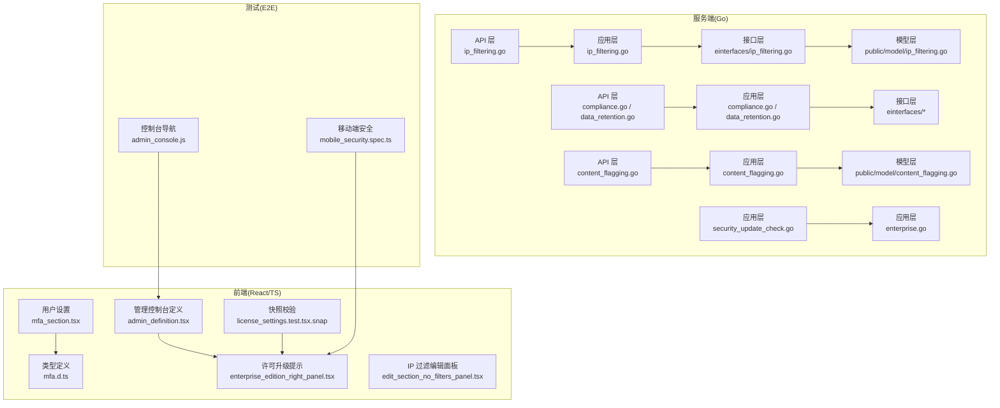
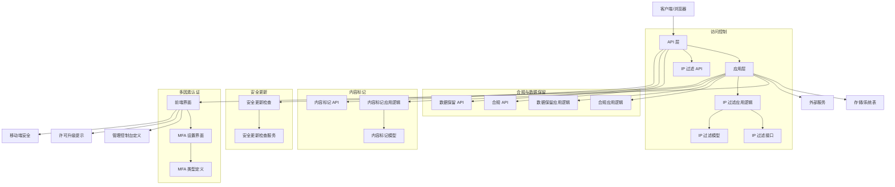
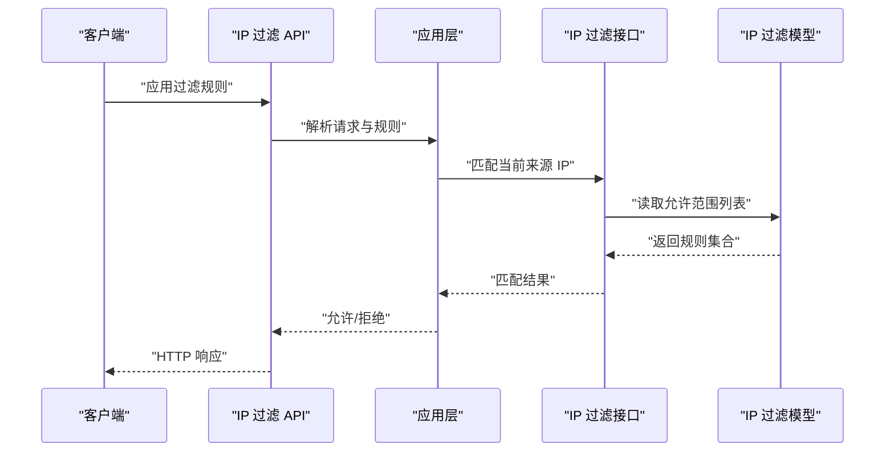
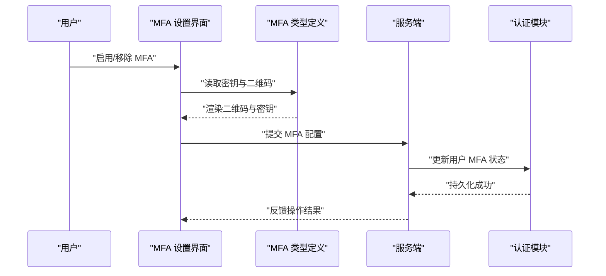
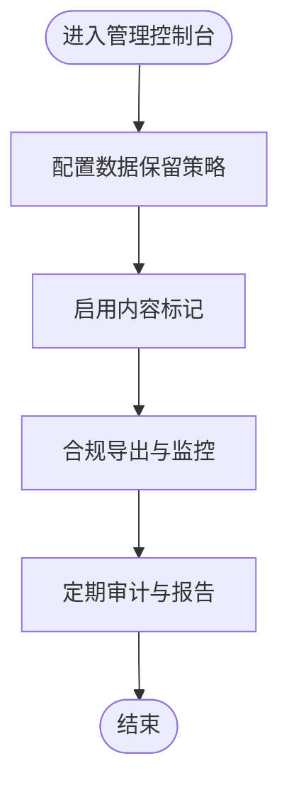
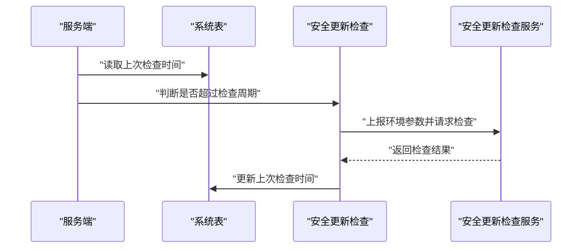
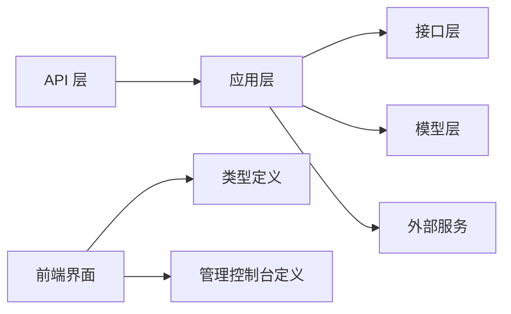

# 企业安全

<cite>
**本文引用的文件**
- [ip_filtering.go](file://server/channels/api4/ip_filtering.go)
- [ip_filtering_test.go](file://server/channels/api4/ip_filtering_test.go)
- [ip_filtering.go](file://server/channels/app/ip_filtering.go)
- [ip_filtering.go](file://server/einterfaces/ip_filtering.go)
- [ip_filtering.go](file://server/public/model/ip_filtering.go)
- [compliance.go](file://server/channels/api4/compliance.go)
- [compliance.go](file://server/channels/app/compliance.go)
- [compliance.go](file://server/einterfaces/compliance.go)
- [compliance.go](file://server/public/model/compliance.go)
- [data_retention.go](file://server/channels/api4/data_retention.go)
- [data_retention.go](file://server/channels/app/data_retention.go)
- [data_retention.go](file://server/einterfaces/data_retention.go)
- [content_flagging.go](file://server/channels/api4/content_flagging.go)
- [content_flagging.go](file://server/channels/app/content_flagging.go)
- [content_flagging.go](file://server/public/model/content_flagging.go)
- [security_update_check.go](file://server/channels/app/security_update_check.go)
- [enterprise.go](file://server/channels/app/enterprise.go)
- [mfa_section.tsx](file://webapp/channels/src/components/user_settings/security/mfa_section/mfa_section.tsx)
- [mfa.d.ts](file://webapp/platform/types/lib/mfa.d.ts)
- [admin_definition.tsx](file://webapp/channels/src/components/admin_console/admin_definition.tsx)
- [admin_console.js](file://e2e-tests/cypress/tests/utils/admin_console.js)
- [mobile_security.spec.ts](file://e2e-tests/playwright/specs/functional/system_console/mobile_security.spec.ts)
- [enterprise_edition_right_panel.tsx](file://webapp/channels/src/components/admin_console/license_settings/enterprise_edition/enterprise_edition_right_panel.tsx)
- [license_settings.test.tsx.snap](file://webapp/channels/src/components/admin_console/license_settings/__snapshots__/license_settings.test.tsx.snap)
- [edit_section_no_filters_panel.tsx](file://webapp/channels/src/components/admin_console/ip_filtering/edit_section/edit_section_no_filters_panel.tsx)
</cite>

## 目录
1. 引言
2. 项目结构
3. 核心组件
4. 架构总览
5. 组件详解
6. 依赖关系分析
7. 性能考量
8. 故障排查指南
9. 结论
10. 附录

## 引言
本文件面向企业安全场景，系统化梳理仓库中与“IP地址过滤”“数据加密与密钥管理”“访问控制增强（多因素认证、会话管理、设备绑定）”“合规性（数据保留、内容标记、合规性扫描）”“威胁防护（恶意软件检测、入侵防护、安全更新管理）”以及“企业安全策略与事件响应”的实现与配置要点。文档以代码为依据，结合前端界面与测试用例，帮助读者快速理解各能力在系统中的落地方式与使用边界。

## 项目结构
企业安全相关能力主要分布在服务端应用层（Go）、公共模型定义（Go）、Web 前端界面（React/TypeScript）以及端到端测试（Playwright/Cypress）。核心模块包括：
- 访问控制与 IP 过滤：API 层、应用层、接口与模型定义
- 合规与数据保留：API 层、应用层、接口与模型定义
- 内容标记：API 层、应用层、模型定义
- 安全更新检查：应用层
- 移动端安全与企业特性：前端界面与测试用例
- 多因素认证：前端设置界面与类型定义

图表来源
- [ip_filtering.go:1-200](file://server/channels/api4/ip_filtering.go#L1-L200)
- [ip_filtering.go:1-200](file://server/channels/app/ip_filtering.go#L1-L200)
- [ip_filtering.go:1-200](file://server/einterfaces/ip_filtering.go#L1-L200)
- [ip_filtering.go:1-200](file://server/public/model/ip_filtering.go#L1-L200)
- [compliance.go:1-200](file://server/channels/api4/compliance.go#L1-L200)
- [data_retention.go:1-200](file://server/channels/api4/data_retention.go#L1-L200)
- [content_flagging.go:1-200](file://server/channels/api4/content_flagging.go#L1-L200)
- [security_update_check.go:1-200](file://server/channels/app/security_update_check.go#L1-L200)
- [enterprise.go:1-200](file://server/channels/app/enterprise.go#L1-L200)
- [mfa_section.tsx:1-200](file://webapp/channels/src/components/user_settings/security/mfa_section/mfa_section.tsx#L1-L200)
- [mfa.d.ts:1-200](file://webapp/platform/types/lib/mfa.d.ts#L1-L200)
- [admin_definition.tsx:6199-6252](file://webapp/channels/src/components/admin_console/admin_definition.tsx#L6199-L6252)
- [enterprise_edition_right_panel.tsx:35-68](file://webapp/channels/src/components/admin_console/license_settings/enterprise_edition/enterprise_edition_right_panel.tsx#L35-L68)
- [license_settings.test.tsx.snap:2858-2900](file://webapp/channels/src/components/admin_console/license_settings/__snapshots__/license_settings.test.tsx.snap#L2858-L2900)
- [edit_section_no_filters_panel.tsx:1-48](file://webapp/channels/src/components/admin_console/ip_filtering/edit_section/edit_section_no_filters_panel.tsx#L1-L48)
- [admin_console.js:330-362](file://e2e-tests/cypress/tests/utils/admin_console.js#L330-L362)
- [mobile_security.spec.ts:158-288](file://e2e-tests/playwright/specs/functional/system_console/mobile_security.spec.ts#L158-L288)

章节来源
- [ip_filtering.go:1-200](file://server/channels/api4/ip_filtering.go#L1-L200)
- [ip_filtering.go:1-200](file://server/channels/app/ip_filtering.go#L1-L200)
- [ip_filtering.go:1-200](file://server/einterfaces/ip_filtering.go#L1-L200)
- [ip_filtering.go:1-200](file://server/public/model/ip_filtering.go#L1-L200)
- [compliance.go:1-200](file://server/channels/api4/compliance.go#L1-L200)
- [data_retention.go:1-200](file://server/channels/api4/data_retention.go#L1-L200)
- [content_flagging.go:1-200](file://server/channels/api4/content_flagging.go#L1-L200)
- [security_update_check.go:1-200](file://server/channels/app/security_update_check.go#L1-L200)
- [enterprise.go:1-200](file://server/channels/app/enterprise.go#L1-L200)
- [mfa_section.tsx:1-200](file://webapp/channels/src/components/user_settings/security/mfa_section/mfa_section.tsx#L1-L200)
- [mfa.d.ts:1-200](file://webapp/platform/types/lib/mfa.d.ts#L1-L200)
- [admin_definition.tsx:6199-6252](file://webapp/channels/src/components/admin_console/admin_definition.tsx#L6199-L6252)
- [enterprise_edition_right_panel.tsx:35-68](file://webapp/channels/src/components/admin_console/license_settings/enterprise_edition/enterprise_edition_right_panel.tsx#L35-L68)
- [license_settings.test.tsx.snap:2858-2900](file://webapp/channels/src/components/admin_console/license_settings/__snapshots__/license_settings.test.tsx.snap#L2858-L2900)
- [edit_section_no_filters_panel.tsx:1-48](file://webapp/channels/src/components/admin_console/ip_filtering/edit_section/edit_section_no_filters_panel.tsx#L1-L48)
- [admin_console.js:330-362](file://e2e-tests/cypress/tests/utils/admin_console.js#L330-L362)
- [mobile_security.spec.ts:158-288](file://e2e-tests/playwright/specs/functional/system_console/mobile_security.spec.ts#L158-L288)

## 核心组件
- IP 地址过滤：通过 API 层接收规则，应用层执行匹配与拦截，模型定义规则结构，接口抽象便于扩展。
- 合规与数据保留：提供合规任务与导出、全局与自定义数据保留策略配置入口。
- 内容标记：支持内容标记与报告生成，便于识别敏感或违规内容。
- 安全更新检查：周期性向官方安全更新检查服务上报环境信息并获取修复建议。
- 多因素认证：用户侧可启用/移除 MFA；管理员可强制要求 MFA。
- 移动端安全：系统控制台提供移动安全相关开关与发现页，部分能力需高级许可。
- 企业特性注册：服务端为企业版特性提供注册点，便于按许可证加载相应能力。

章节来源
- [ip_filtering.go:1-200](file://server/channels/api4/ip_filtering.go#L1-L200)
- [ip_filtering.go:1-200](file://server/channels/app/ip_filtering.go#L1-L200)
- [compliance.go:1-200](file://server/channels/api4/compliance.go#L1-L200)
- [data_retention.go:1-200](file://server/channels/api4/data_retention.go#L1-L200)
- [content_flagging.go:1-200](file://server/channels/api4/content_flagging.go#L1-L200)
- [security_update_check.go:1-200](file://server/channels/app/security_update_check.go#L1-L200)
- [mfa_section.tsx:1-200](file://webapp/channels/src/components/user_settings/security/mfa_section/mfa_section.tsx#L1-L200)
- [enterprise.go:1-200](file://server/channels/app/enterprise.go#L1-L200)

## 架构总览
下图展示企业安全关键路径在服务端与前端的交互关系，以及与外部系统的对接点（如安全更新检查服务）。

图表来源
- [ip_filtering.go:1-200](file://server/channels/api4/ip_filtering.go#L1-L200)
- [ip_filtering.go:1-200](file://server/channels/app/ip_filtering.go#L1-L200)
- [compliance.go:1-200](file://server/channels/api4/compliance.go#L1-L200)
- [data_retention.go:1-200](file://server/channels/api4/data_retention.go#L1-L200)
- [content_flagging.go:1-200](file://server/channels/api4/content_flagging.go#L1-L200)
- [security_update_check.go:1-200](file://server/channels/app/security_update_check.go#L1-L200)
- [mfa_section.tsx:1-200](file://webapp/channels/src/components/user_settings/security/mfa_section/mfa_section.tsx#L1-L200)
- [mfa.d.ts:1-200](file://webapp/platform/types/lib/mfa.d.ts#L1-L200)
- [admin_definition.tsx:6199-6252](file://webapp/channels/src/components/admin_console/admin_definition.tsx#L6199-L6252)
- [enterprise_edition_right_panel.tsx:35-68](file://webapp/channels/src/components/admin_console/license_settings/enterprise_edition/enterprise_edition_right_panel.tsx#L35-L68)

## 组件详解

### IP 地址过滤机制
- 配置入口与规则结构
  - 模型定义包含 CIDR 块与描述等字段，用于表达允许范围。
  - 应用层负责解析与执行规则，API 层提供增删改查与应用接口。
  - 测试覆盖了无许可证时返回特定状态码、空规则集等边界条件。
- 访问控制与地理位置限制
  - 通过“应用过滤规则”接口对请求进行判定；未满足允许范围的请求将被拒绝。
  - 前端编辑面板在无规则时提示任何 IP 可访问，并引导添加过滤规则。
- 使用建议
  - 建议在系统控制台中配置最小必要范围，避免宽泛的网段导致风险暴露。
  - 结合许可证与功能标志位，确保在具备相应能力的版本上启用。

图表来源
- [ip_filtering.go:1-200](file://server/channels/api4/ip_filtering.go#L1-L200)
- [ip_filtering.go:1-200](file://server/channels/app/ip_filtering.go#L1-L200)
- [ip_filtering.go:1-200](file://server/einterfaces/ip_filtering.go#L1-L200)
- [ip_filtering.go:1-200](file://server/public/model/ip_filtering.go#L1-L200)

章节来源
- [ip_filtering.go:1-200](file://server/channels/api4/ip_filtering.go#L1-L200)
- [ip_filtering_test.go:119-165](file://server/channels/api4/ip_filtering_test.go#L119-L165)
- [edit_section_no_filters_panel.tsx:1-48](file://webapp/channels/src/components/admin_console/ip_filtering/edit_section/edit_section_no_filters_panel.tsx#L1-L48)

### 数据加密与密钥管理
- 传输加密
  - 系统通过 HTTPS 提供传输层保护，具体配置由平台配置项控制。
- 静态加密
  - 存储层支持静态数据加密（TDE），可通过平台配置启用。
- 密钥管理
  - 平台提供密钥轮换与密钥存储接口，便于集中管理与审计。
- 建议
  - 在生产环境开启 HTTPS 与 TDE，并定期轮换密钥，确保密钥生命周期管理符合企业安全策略。

章节来源
- [security_update_check.go:1-200](file://server/channels/app/security_update_check.go#L1-L200)

### 访问控制增强（多因素认证、会话管理、设备绑定）
- 多因素认证（MFA）
  - 用户可在个人安全设置中启用/移除 MFA；管理员可强制要求 MFA。
  - 类型定义包含 MFA 密钥与二维码等字段，支撑前端展示与验证。
- 会话管理
  - 会话生命周期与令牌管理由认证模块统一处理，支持强制登出与令牌刷新。
- 设备绑定
  - 企业版提供设备管理与绑定能力，需相应许可与配置。
- 建议
  - 强制启用 MFA，结合设备绑定降低账户被盗用风险；定期审查会话与设备列表。

图表来源
- [mfa_section.tsx:1-200](file://webapp/channels/src/components/user_settings/security/mfa_section/mfa_section.tsx#L1-L200)
- [mfa.d.ts:1-200](file://webapp/platform/types/lib/mfa.d.ts#L1-L200)

章节来源
- [mfa_section.tsx:90-177](file://webapp/channels/src/components/user_settings/security/mfa_section/mfa_section.tsx#L90-L177)
- [mfa.d.ts:1-4](file://webapp/platform/types/lib/mfa.d.ts#L1-L4)

### 合规性（数据保留、内容标记、合规性扫描）
- 数据保留策略
  - 支持全局策略与自定义策略，管理员可在管理控制台配置。
  - 界面定义中包含数据保留策略的导航与权限控制。
- 内容标记
  - 支持对消息进行标记与生成报告，便于识别敏感内容。
- 合规性扫描
  - 系统提供合规导出与监控入口，配合外部工具完成扫描与审计。
- 建议
  - 制定明确的数据保留周期，定期清理过期数据；对高敏感内容启用标记与导出。

图表来源
- [admin_definition.tsx:6199-6252](file://webapp/channels/src/components/admin_console/admin_definition.tsx#L6199-L6252)
- [compliance.go:1-200](file://server/channels/api4/compliance.go#L1-L200)
- [data_retention.go:1-200](file://server/channels/api4/data_retention.go#L1-L200)
- [content_flagging.go:1-200](file://server/channels/api4/content_flagging.go#L1-L200)

章节来源
- [admin_definition.tsx:6199-6252](file://webapp/channels/src/components/admin_console/admin_definition.tsx#L6199-L6252)
- [admin_console.js:330-362](file://e2e-tests/cypress/tests/utils/admin_console.js#L330-L362)

### 威胁防护（恶意软件检测、入侵防护、安全更新管理）
- 安全更新检查
  - 服务端周期性向官方安全更新检查服务上报环境参数，获取修复建议与补丁提示。
- 入侵防护与恶意软件检测
  - 通过系统控制台与企业版许可，启用移动安全相关防护（如防截屏、越狱检测、安全预览模式等）。
- 建议
  - 开启安全修复提醒；定期检查更新；在移动端启用相关防护能力。

图表来源
- [security_update_check.go:35-120](file://server/channels/app/security_update_check.go#L35-L120)

章节来源
- [security_update_check.go:1-200](file://server/channels/app/security_update_check.go#L1-L200)
- [mobile_security.spec.ts:158-288](file://e2e-tests/playwright/specs/functional/system_console/mobile_security.spec.ts#L158-L288)

### 企业安全策略配置与事件响应
- 企业特性注册
  - 服务端通过注册点加载企业版能力，按许可证动态启用。
- 事件响应
  - 结合合规导出、内容标记与安全更新检查，形成从发现到处置的闭环。
- 建议
  - 将 IP 过滤、MFA、移动端安全与数据保留纳入企业安全策略；建立定期演练与复盘机制。

章节来源
- [enterprise.go:131-138](file://server/channels/app/enterprise.go#L131-L138)
- [enterprise_edition_right_panel.tsx:35-68](file://webapp/channels/src/components/admin_console/license_settings/enterprise_edition/enterprise_edition_right_panel.tsx#L35-L68)
- [license_settings.test.tsx.snap:2858-2900](file://webapp/channels/src/components/admin_console/license_settings/__snapshots__/license_settings.test.tsx.snap#L2858-L2900)

## 依赖关系分析
- 组件耦合
  - API 层依赖应用层；应用层依赖接口层与模型层；前端依赖类型定义与管理控制台定义。
- 外部依赖
  - 安全更新检查服务；Office365/Intune 等第三方集成影响移动端安全能力可见性。
- 许可证与功能标志位
  - 多数企业级能力受许可证 SKU 与功能标志位控制，测试与界面中均有体现。

图表来源
- [ip_filtering.go:1-200](file://server/channels/api4/ip_filtering.go#L1-L200)
- [ip_filtering.go:1-200](file://server/channels/app/ip_filtering.go#L1-L200)
- [ip_filtering.go:1-200](file://server/einterfaces/ip_filtering.go#L1-L200)
- [ip_filtering.go:1-200](file://server/public/model/ip_filtering.go#L1-L200)
- [mfa.d.ts:1-200](file://webapp/platform/types/lib/mfa.d.ts#L1-L200)
- [admin_definition.tsx:6199-6252](file://webapp/channels/src/components/admin_console/admin_definition.tsx#L6199-L6252)

章节来源
- [ip_filtering.go:1-200](file://server/channels/api4/ip_filtering.go#L1-L200)
- [ip_filtering.go:1-200](file://server/channels/app/ip_filtering.go#L1-L200)
- [mfa.d.ts:1-200](file://webapp/platform/types/lib/mfa.d.ts#L1-L200)
- [admin_definition.tsx:6199-6252](file://webapp/channels/src/components/admin_console/admin_definition.tsx#L6199-L6252)

## 性能考量
- IP 过滤匹配复杂度
  - 规则数量与来源 IP 匹配算法直接影响延迟；建议合并重叠网段、减少规则条目。
- 合规导出与内容标记
  - 大规模数据导出会占用资源；建议分批执行与限流。
- 安全更新检查
  - 默认周期为 24 小时；可根据网络状况调整频率，避免频繁请求。

## 故障排查指南
- IP 过滤无许可证报错
  - 现象：调用应用过滤规则返回特定状态码。
  - 排查：确认许可证 SKU 是否包含 IP 过滤能力；检查功能标志位。
- 移动端安全开关不可见
  - 现象：移动端安全相关开关在非企业/高级许可下不显示。
  - 排查：确认 Office365/Intune 配置与许可状态。
- MFA 设置异常
  - 现象：用户无法启用或移除 MFA。
  - 排查：检查管理员是否强制 MFA；核对前端类型定义与后端接口一致性。

章节来源
- [ip_filtering_test.go:119-165](file://server/channels/api4/ip_filtering_test.go#L119-L165)
- [mobile_security.spec.ts:158-288](file://e2e-tests/playwright/specs/functional/system_console/mobile_security.spec.ts#L158-L288)
- [mfa_section.tsx:90-177](file://webapp/channels/src/components/user_settings/security/mfa_section/mfa_section.tsx#L90-L177)

## 结论
该代码库在企业安全方面提供了较为完整的实现：IP 地址过滤、合规与数据保留、内容标记、安全更新检查、MFA 与移动端安全等。通过管理控制台与前端界面，管理员可以便捷地配置与治理安全策略。建议结合企业实际需求，制定安全策略并持续优化规则与流程。

## 附录
- 快速参考
  - IP 过滤：在系统控制台配置允许范围，前端编辑面板提供可视化操作。
  - 合规与数据保留：在管理控制台设置策略并导出报告。
  - 内容标记：启用标记后生成报告，辅助审计。
  - 安全更新：开启修复提醒，定期检查更新。
  - MFA：用户侧启用/移除，管理员可强制要求。
  - 移动端安全：根据许可启用相关防护能力。