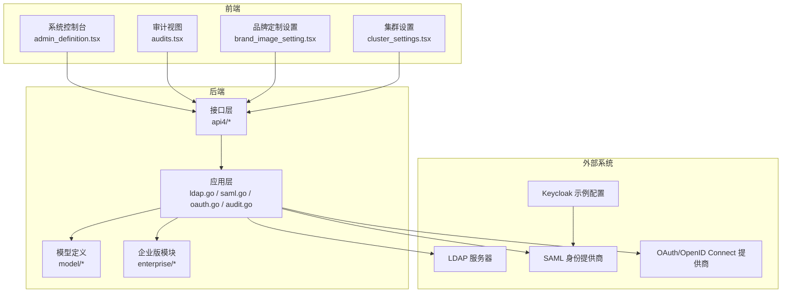
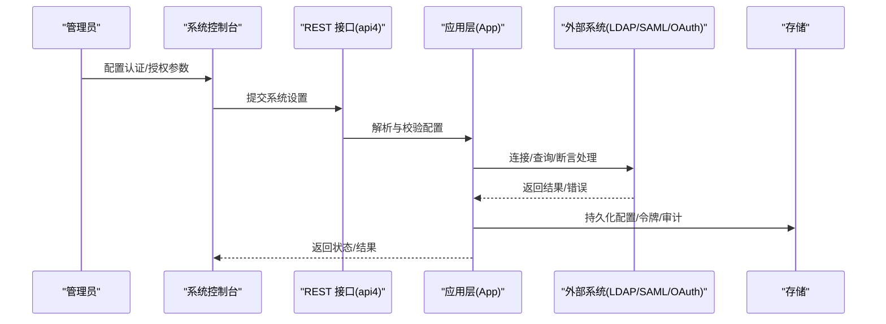
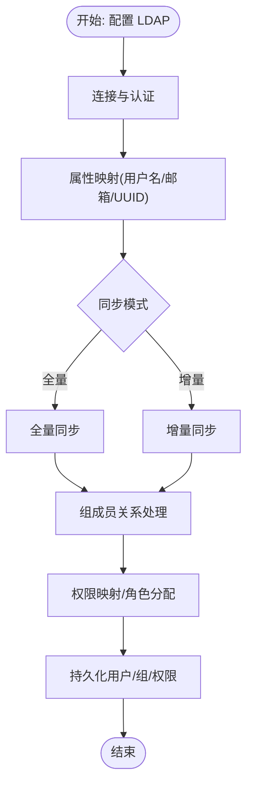
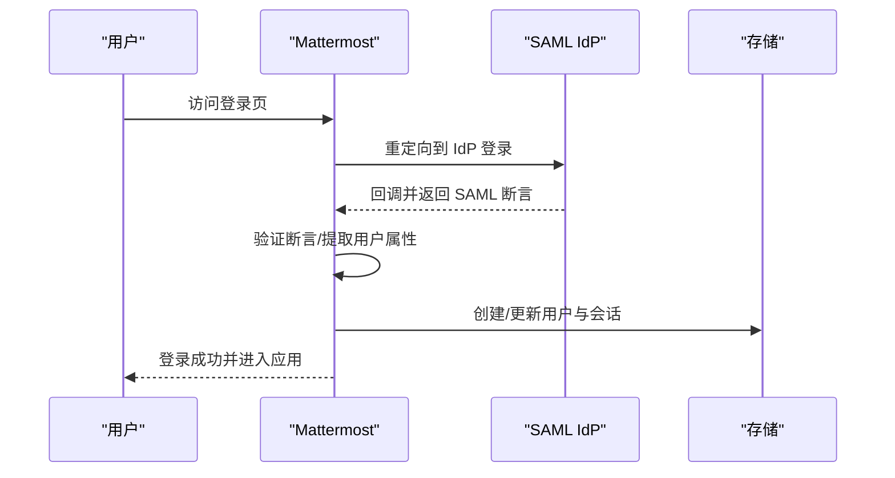
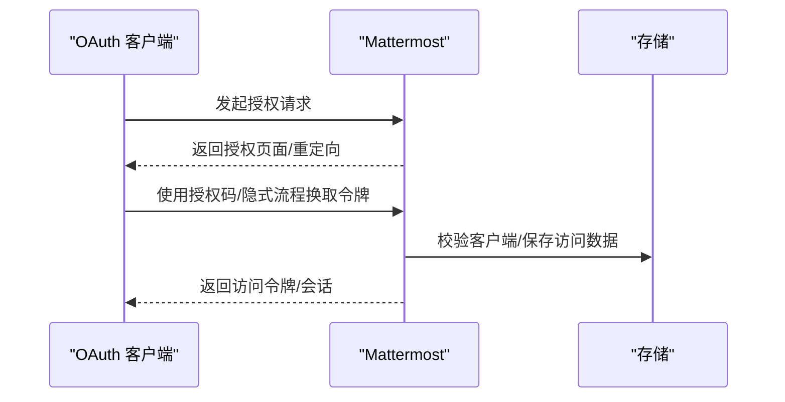
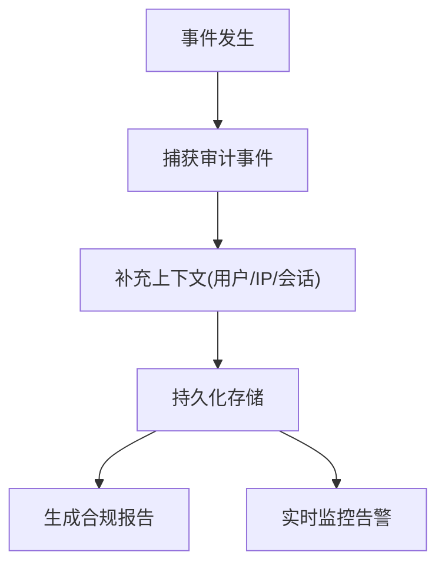
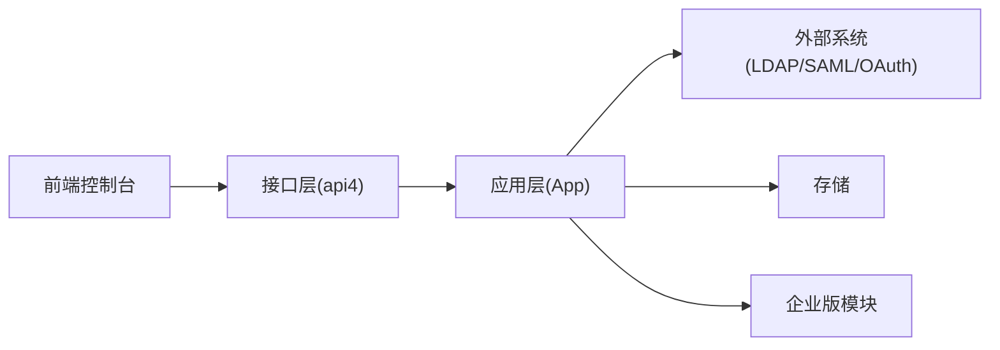

# 企业级功能

<cite>
**本文引用的文件**
- [ldap.go](file://server/channels/app/ldap.go)
- [ldap.go](file://server/einterfaces/ldap.go)
- [ldap.go](file://server/public/model/ldap.go)
- [ldap.go](file://server/channels/api4/ldap.go)
- [ldap.go](file://server/cmd/mmctl/commands/ldap.go)
- [saml.go](file://server/channels/app/saml.go)
- [saml.go](file://server/einterfaces/saml.go)
- [saml.go](file://server/public/model/saml.go)
- [saml.go](file://server/channels/api4/saml.go)
- [saml.go](file://server/channels/web/saml.go)
- [oauth.go](file://server/channels/app/oauth.go)
- [oauth.go](file://server/public/model/oauth.go)
- [oauth.go](file://server/channels/api4/oauth.go)
- [oauth.go](file://server/channels/web/oauth.go)
- [audit.go](file://server/channels/app/audit.go)
- [audit.go](file://server/channels/audit/)
- [admin_definition.tsx](file://webapp/channels/src/components/admin_console/admin_definition.tsx)
- [admin_definition_ldap_wizard.tsx](file://webapp/channels/src/components/admin_console/admin_definition_ldap_wizard.tsx)
- [audits.tsx](file://webapp/channels/src/components/admin_console/audits/audits.tsx)
- [cluster_settings.tsx](file://webapp/channels/src/components/admin_console/cluster_settings.tsx)
- [brand_image_setting.tsx](file://webapp/channels/src/components/admin_console/brand_image_setting/brand_image_setting.tsx)
- [keycloak_realm.json](file://e2e-tests/cypress/tests/support/api/keycloak_realm.json)
- [saml_ldap_sync_id_attrib_spec.ts](file://e2e-tests/cypress/tests/integration/channels/ad_ldap/saml_ldap_sync_id_attrib_spec.ts)
- [enterprise_edition_right_panel.tsx](file://webapp/channels/src/components/admin_console/license_settings/enterprise_edition/enterprise_edition_right_panel.tsx)
- [team_edition_right_panel.tsx](file://webapp/channels/src/components/admin_console/license_settings/team_edition/team_edition_right_panel.tsx)
- [license_settings.test.tsx.snap](file://webapp/channels/src/components/admin_console/license_settings/__snapshots__/license_settings.test.tsx.snap)
- [en-AU.json](file://webapp/channels/src/i18n/en-AU.json)
- [user_settings_security.test.tsx.snap](file://webapp/channels/src/components/user_settings/security/__snapshots__/user_settings_security.test.tsx.snap)
- [general.test.ts](file://webapp/channels/src/packages/mattermost-redux/src/selectors/entities/general.test.ts)
- [enterprise.go](file://server/channels/app/enterprise.go)
- [enterprise.go](file://server/enterprise/README.md)
- [enterprise.go](file://server/fips/fips.go)
- [enterprise.go](file://server/fips/fips_default.go)
- [enterprise.go](file://LICENSE.enterprise)
</cite>

## 目录
1. [引言](#引言)
2. [项目结构](#项目结构)
3. [核心组件](#核心组件)
4. [架构总览](#架构总览)
5. [详细组件分析](#详细组件分析)
6. [依赖关系分析](#依赖关系分析)
7. [性能考量](#性能考量)
8. [故障排查指南](#故障排查指南)
9. [结论](#结论)
10. [附录](#附录)

## 引言
本文件面向企业用户与平台管理员，系统化梳理 Mattermost 在企业级场景下的关键能力：LDAP 集成（服务器配置、用户同步、组管理、权限映射）、SAML 认证（IdP 配置、断言处理、单点登录）、OAuth 2.0 集成（提供商配置、令牌管理、授权流程）、系统管理（用户与权限、配置与监控）、日志审计（事件记录、合规报告、安全监控）、企业安全（加密、访问控制、威胁防护）、高可用部署（负载均衡、集群、故障转移）、定制化（品牌、功能开关、配置扩展），以及企业版与开源版差异及升级路径。

## 项目结构
Mattermost 的企业级功能由服务端应用层、接口层、前端控制台与测试用例共同支撑。后端通过应用层封装认证与授权逻辑，接口层暴露 REST API；前端通过系统控制台提供可视化配置与运维界面；企业特性在企业版模块中实现，并通过许可证与功能标志进行启用控制。

图表来源
- [admin_definition.tsx](file://webapp/channels/src/components/admin_console/admin_definition.tsx)
- [audits.tsx](file://webapp/channels/src/components/admin_console/audits/audits.tsx)
- [brand_image_setting.tsx](file://webapp/channels/src/components/admin_console/brand_image_setting/brand_image_setting.tsx)
- [cluster_settings.tsx](file://webapp/channels/src/components/admin_console/cluster_settings.tsx)
- [ldap.go](file://server/channels/app/ldap.go)
- [saml.go](file://server/channels/app/saml.go)
- [oauth.go](file://server/channels/app/oauth.go)
- [audit.go](file://server/channels/app/audit.go)

章节来源
- [admin_definition.tsx](file://webapp/channels/src/components/admin_console/admin_definition.tsx)
- [ldap.go](file://server/channels/app/ldap.go)
- [saml.go](file://server/channels/app/saml.go)
- [oauth.go](file://server/channels/app/oauth.go)
- [audit.go](file://server/channels/app/audit.go)

## 核心组件
- LDAP 集成：负责与企业目录服务对接，完成用户属性映射、批量同步、组成员关系维护与权限映射。
- SAML 认证：支持 IdP 元数据与证书配置、断言解析、单点登录流程与会话管理。
- OAuth 2.0：提供授权码/隐式/刷新令牌等流程，支持动态客户端注册与令牌持久化。
- 审计与合规：记录系统操作与安全事件，生成合规报告，支持高级审计日志配置。
- 系统管理：用户与权限控制、配置管理、监控仪表板、集群与高可用设置。
- 企业安全：TLS/FIPS 加密、访问控制策略、零信任与基于属性的访问控制。
- 高可用部署：集群模式、负载均衡、故障转移与节点发现。
- 定制化：品牌与主题、功能开关、配置扩展。

章节来源
- [ldap.go](file://server/channels/app/ldap.go)
- [saml.go](file://server/channels/app/saml.go)
- [oauth.go](file://server/channels/app/oauth.go)
- [audit.go](file://server/channels/app/audit.go)
- [admin_definition.tsx](file://webapp/channels/src/components/admin_console/admin_definition.tsx)

## 架构总览
下图展示企业级认证与授权的关键交互：前端控制台提交配置，后端应用层调用具体适配器（LDAP/SAML/OAuth），并持久化状态与日志；企业版模块提供增强能力与限制。

图表来源
- [ldap.go](file://server/channels/app/ldap.go)
- [saml.go](file://server/channels/app/saml.go)
- [oauth.go](file://server/channels/app/oauth.go)
- [admin_definition.tsx](file://webapp/channels/src/components/admin_console/admin_definition.tsx)

## 详细组件分析

### LDAP 集成
- 服务器配置
  - 支持连接 URL、绑定 DN/凭据、分页、缓存策略、供应商类型（如 OpenLDAP/Active Directory）等。
  - 可配置用户名与 UUID 属性映射，以及 Kerberos/密码认证方式。
- 用户同步
  - 支持全量/增量同步周期、同步任务触发与历史查看。
  - 同步作业记录新增、删除、更新统计，便于排障。
- 组管理与权限映射
  - 可配置组过滤与成员关系映射，结合角色与权限策略实现细粒度访问控制。
- 前端控制台
  - 提供 LDAP 设置向导、同步性能与历史面板，支持立即执行同步与状态查看。

图表来源
- [admin_definition_ldap_wizard.tsx](file://webapp/channels/src/components/admin_console/admin_definition_ldap_wizard.tsx)
- [ldap.go](file://server/channels/app/ldap.go)
- [ldap.go](file://server/einterfaces/ldap.go)
- [ldap.go](file://server/public/model/ldap.go)

章节来源
- [admin_definition_ldap_wizard.tsx](file://webapp/channels/src/components/admin_console/admin_definition_ldap_wizard.tsx)
- [ldap.go](file://server/channels/app/ldap.go)
- [ldap.go](file://server/channels/api4/ldap.go)
- [ldap.go](file://server/cmd/mmctl/commands/ldap.go)
- [keycloak_realm.json](file://e2e-tests/cypress/tests/support/api/keycloak_realm.json)

### SAML 认证
- IdP 配置
  - 支持元数据 URL 或手动输入 IdP Issuer URL；上传 IdP 公钥证书；可选签名算法与加密开关。
- 断言处理
  - 解析 SAML 断言中的姓名、邮箱、用户标识等字段，建立本地会话。
- 单点登录实现
  - 前端引导至 IdP 登录，回调后完成断言验证与用户会话创建。
- 前端控制台
  - 提供 SAML 设置项、证书上传、元数据导入与帮助链接。

图表来源
- [admin_definition.tsx](file://webapp/channels/src/components/admin_console/admin_definition.tsx)
- [saml.go](file://server/channels/app/saml.go)
- [saml.go](file://server/channels/api4/saml.go)
- [saml.go](file://server/channels/web/saml.go)
- [saml.go](file://server/einterfaces/saml.go)
- [saml.go](file://server/public/model/saml.go)

章节来源
- [admin_definition.tsx](file://webapp/channels/src/components/admin_console/admin_definition.tsx)
- [saml.go](file://server/channels/app/saml.go)
- [saml.go](file://server/channels/api4/saml.go)
- [saml.go](file://server/channels/web/saml.go)
- [keycloak_realm.json](file://e2e-tests/cypress/tests/support/api/keycloak_realm.json)
- [saml_ldap_sync_id_attrib_spec.ts](file://e2e-tests/cypress/tests/integration/channels/ad_ldap/saml_ldap_sync_id_attrib_spec.ts)

### OAuth 2.0 集成
- 提供商配置
  - 应用注册、回调地址、公开/机密客户端区分、授权范围与令牌有效期。
- 令牌管理
  - 支持授权码、隐式、刷新令牌流程；保存访问数据与刷新令牌；按需生成新会话。
- 用户授权流程
  - 用户同意授权后，颁发访问令牌或直接创建会话；支持动态客户端注册元数据。
- 前端与测试
  - 控制台提供 OAuth 设置入口；测试覆盖授权码/隐式/刷新令牌等场景。

图表来源
- [oauth.go](file://server/channels/app/oauth.go)
- [oauth.go](file://server/public/model/oauth.go)
- [oauth.go](file://server/channels/api4/oauth.go)
- [oauth.go](file://server/channels/web/oauth.go)

章节来源
- [oauth.go](file://server/channels/app/oauth.go)
- [oauth.go](file://server/channels/api4/oauth.go)
- [oauth.go](file://server/public/model/oauth.go)

### 系统管理与监控
- 用户与权限
  - 支持用户属性、角色与权限策略配置；可结合企业版功能启用更细粒度的访问控制。
- 配置管理
  - 通过系统控制台集中管理各项服务设置；部分变更需要重启生效。
- 监控仪表板
  - 提供系统指标与运行状态概览，辅助运维与容量规划。
- 集群与高可用
  - 支持集群模式、节点发现与配置加载提示；建议通过负载均衡接入。

章节来源
- [admin_definition.tsx](file://webapp/channels/src/components/admin_console/admin_definition.tsx)
- [cluster_settings.tsx](file://webapp/channels/src/components/admin_console/cluster_settings.tsx)
- [enterprise.go](file://server/channels/app/enterprise.go)

### 日志审计与合规
- 审计事件记录
  - 记录用户行为、系统操作与安全相关事件，支持表格展示与导出。
- 合规报告
  - 支持每日合规报告生成与合规导出功能（企业版特性）。
- 高级审计日志
  - 通过实验性设置启用文件输出与证书加密，满足合规要求。
- 前端视图
  - 审计面板展示详细事件列表，支持筛选与查看详情。

图表来源
- [audit.go](file://server/channels/app/audit.go)
- [audit.go](file://server/channels/audit/)
- [audits.tsx](file://webapp/channels/src/components/admin_console/audits/audits.tsx)
- [admin_definition.tsx](file://webapp/channels/src/components/admin_console/admin_definition.tsx)

章节来源
- [audit.go](file://server/channels/app/audit.go)
- [audits.tsx](file://webapp/channels/src/components/admin_console/audits/audits.tsx)
- [admin_definition.tsx](file://webapp/channels/src/components/admin_console/admin_definition.tsx)

### 企业安全
- 数据加密
  - 支持 FIPS 模式与 TLS 配置，确保传输与存储安全。
- 访问控制
  - 基于属性的访问控制（ABAC）与通道权限策略，结合企业版功能实现零信任协作。
- 威胁防护
  - 结合审计、合规与 IP 过滤等能力，降低内外部风险暴露面。

章节来源
- [enterprise.go](file://server/fips/fips.go)
- [enterprise.go](file://server/fips/fips_default.go)
- [admin_definition.tsx](file://webapp/channels/src/components/admin_console/admin_definition.tsx)
- [general.test.ts](file://webapp/channels/src/packages/mattermost-redux/src/selectors/entities/general.test.ts)

### 高可用部署
- 集群配置
  - 启用集群模式，注意配置文件加载来源与节点一致性。
- 负载均衡
  - 通过反向代理或负载均衡器分发流量，避免跨节点状态不一致。
- 故障转移
  - 建议配合数据库与对象存储的高可用方案，确保会话与数据持久化。

章节来源
- [cluster_settings.tsx](file://webapp/channels/src/components/admin_console/cluster_settings.tsx)
- [admin_definition.tsx](file://webapp/channels/src/components/admin_console/admin_definition.tsx)

### 企业定制化
- 品牌定制
  - 支持上传品牌图片与文案，渲染到登录页与全局头部。
- 功能开关
  - 通过功能标志与企业版许可控制特性启用/隐藏。
- 配置扩展
  - 通过系统控制台与环境变量组合实现灵活部署。

章节来源
- [brand_image_setting.tsx](file://webapp/channels/src/components/admin_console/brand_image_setting/brand_image_setting.tsx)
- [admin_definition.tsx](file://webapp/channels/src/components/admin_console/admin_definition.tsx)

### 企业版与开源版差异及升级路径
- 差异点
  - 企业版解锁高级合规、高可用、AD/LDAP 组同步、零信任访问控制等功能。
- 升级路径
  - 通过系统控制台“许可证”页面查看当前版本与可用特性；联系销售获取企业版许可。
- 界面提示
  - “锁定”图标表示功能受企业版保护；部分界面提供升级引导与对比说明。

章节来源
- [enterprise_edition_right_panel.tsx](file://webapp/channels/src/components/admin_console/license_settings/enterprise_edition/enterprise_edition_right_panel.tsx)
- [team_edition_right_panel.tsx](file://webapp/channels/src/components/admin_console/license_settings/team_edition/team_edition_right_panel.tsx)
- [license_settings.test.tsx.snap](file://webapp/channels/src/components/admin_console/license_settings/__snapshots__/license_settings.test.tsx.snap)
- [en-AU.json](file://webapp/channels/src/i18n/en-AU.json)

## 依赖关系分析
- 组件耦合
  - 前端控制台高度依赖后端接口层与应用层；企业版功能通过许可与标志位控制。
- 外部依赖
  - LDAP/SAML/OAuth 均为外部系统集成，需正确配置证书、元数据与回调地址。
- 循环依赖
  - 未见明显循环依赖；各模块职责清晰，接口层与应用层分离。

图表来源
- [admin_definition.tsx](file://webapp/channels/src/components/admin_console/admin_definition.tsx)
- [ldap.go](file://server/channels/app/ldap.go)
- [saml.go](file://server/channels/app/saml.go)
- [oauth.go](file://server/channels/app/oauth.go)
- [enterprise.go](file://server/channels/app/enterprise.go)

章节来源
- [admin_definition.tsx](file://webapp/channels/src/components/admin_console/admin_definition.tsx)
- [ldap.go](file://server/channels/app/ldap.go)
- [saml.go](file://server/channels/app/saml.go)
- [oauth.go](file://server/channels/app/oauth.go)
- [enterprise.go](file://server/channels/app/enterprise.go)

## 性能考量
- LDAP 同步
  - 合理设置同步间隔与分批处理，避免对目录服务造成压力；关注组成员关系的批量更新开销。
- SAML 登录
  - 优化 IdP 元数据与证书加载；减少断言解析与用户查找的延迟。
- OAuth 令牌
  - 刷新令牌与会话过期时间应平衡用户体验与安全性；避免频繁轮换导致的抖动。
- 审计日志
  - 高并发场景下建议启用文件输出与异步写入，避免阻塞主业务线。

## 故障排查指南
- LDAP
  - 检查连接 URL、绑定凭据与属性映射；通过同步历史面板定位失败原因；参考测试样例验证 Keycloak 配置。
- SAML
  - 确认 IdP 元数据与证书有效；核对签名算法与断言字段映射；检查登录回调地址与会话创建。
- OAuth
  - 校验客户端类型与回调地址；确认授权码/令牌交换流程；查看访问数据保存状态。
- 审计与合规
  - 查看审计事件表与合规报告生成状态；必要时启用高级审计日志以获取更详细信息。
- 集群与高可用
  - 关注配置文件加载来源与节点一致性；通过负载均衡器健康检查保障可用性。

章节来源
- [admin_definition_ldap_wizard.tsx](file://webapp/channels/src/components/admin_console/admin_definition_ldap_wizard.tsx)
- [audits.tsx](file://webapp/channels/src/components/admin_console/audits/audits.tsx)
- [cluster_settings.tsx](file://webapp/channels/src/components/admin_console/cluster_settings.tsx)
- [keycloak_realm.json](file://e2e-tests/cypress/tests/support/api/keycloak_realm.json)
- [saml_ldap_sync_id_attrib_spec.ts](file://e2e-tests/cypress/tests/integration/channels/ad_ldap/saml_ldap_sync_id_attrib_spec.ts)

## 结论
Mattermost 的企业级能力围绕“身份与访问、合规与审计、高可用与安全”展开。通过 LDAP/SAML/OAuth 的统一接入，结合企业版的高级功能与严格的审计合规体系，可在复杂企业环境中实现安全、可控、可观测的协作平台。建议在生产部署前完成端到端联调与压测，并持续通过系统控制台与日志审计进行运维与安全治理。

## 附录
- 术语
  - LDAP：轻量目录访问协议，用于企业目录服务。
  - SAML：安全断言标记语言，用于单点登录。
  - OAuth 2.0：开放授权协议，用于第三方应用授权。
  - ABAC：基于属性的访问控制，实现细粒度权限策略。
- 参考资源
  - 企业版许可与功能对比可通过系统控制台“许可证”页面查看。
  - 高级审计日志与合规导出为企业版特性，需相应许可。