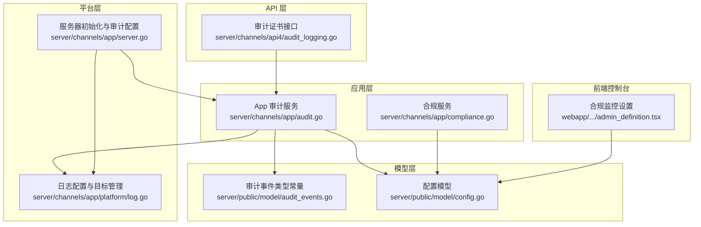
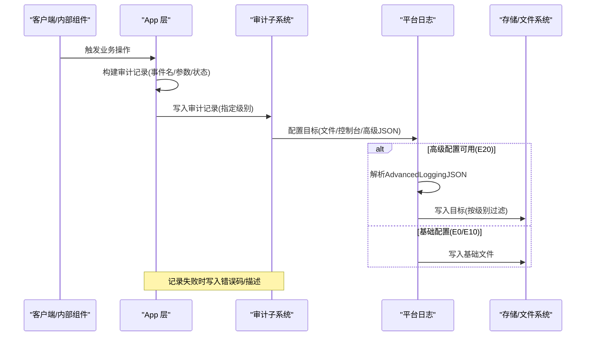
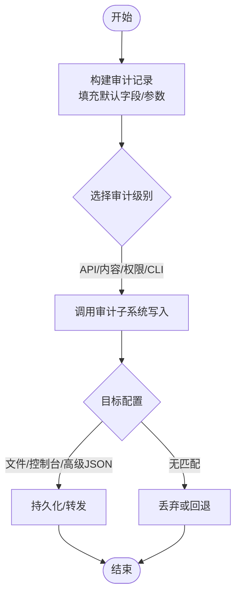
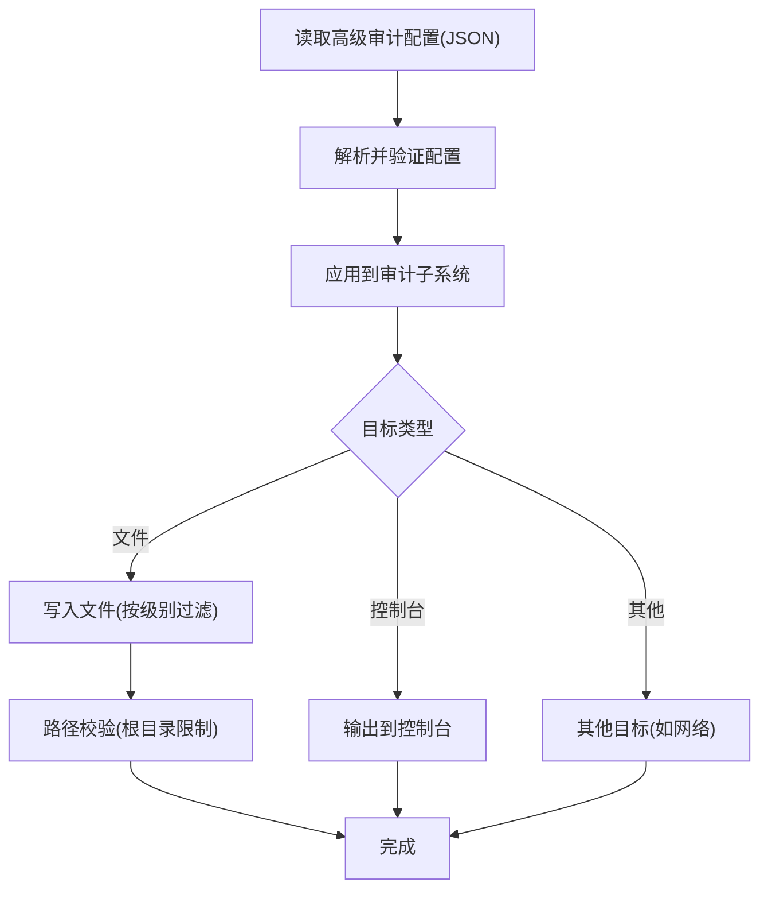
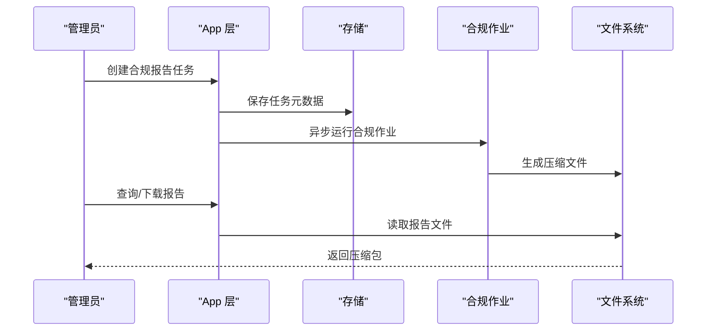
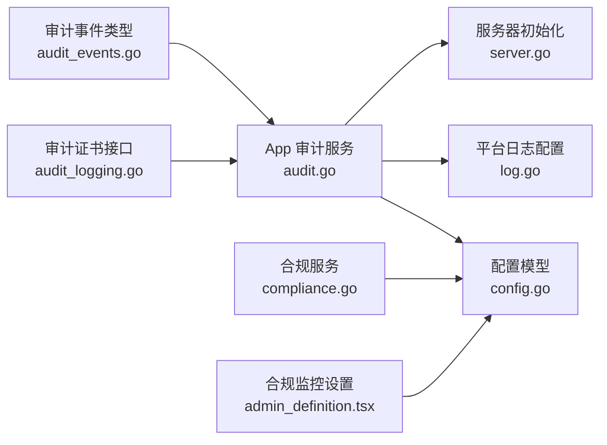

# 审计日志

<cite>
**本文引用的文件**
- [audit.go](file://server/channels/app/audit.go)
- [audit_events.go](file://server/public/model/audit_events.go)
- [audit_logging.go](file://server/channels/api4/audit_logging.go)
- [compliance.go](file://server/channels/app/compliance.go)
- [log.go](file://server/channels/app/platform/log.go)
- [config.go](file://server/public/model/config.go)
- [server.go](file://server/channels/app/server.go)
- [admin_definition.tsx](file://webapp/channels/src/components/admin_console/admin_definition.tsx)
</cite>

## 目录
1. [简介](#简介)
2. [项目结构](#项目结构)
3. [核心组件](#核心组件)
4. [架构总览](#架构总览)
5. [详细组件分析](#详细组件分析)
6. [依赖分析](#依赖分析)
7. [性能考虑](#性能考虑)
8. [故障排查指南](#故障排查指南)
9. [结论](#结论)
10. [附录](#附录)

## 简介
本文件系统化阐述 Mattermost 的审计日志能力，覆盖事件记录机制（事件类型、日志格式与存储）、合规性报告生成（报表、合规检查与导出）、安全监控（异常行为检测、告警与威胁分析）、配置项（事件过滤、日志轮转与保留策略）、查询与分析（检索、统计与趋势监控），以及与外部 SIEM 的集成方案与最佳实践。内容基于仓库中实际实现进行归纳总结，帮助技术与非技术读者全面理解与落地。

## 项目结构
围绕审计日志的关键代码分布在以下模块：
- 应用层：审计记录生成、证书管理、合规报告与下载
- 模型层：审计事件类型常量定义
- 平台层：日志配置加载、高级日志目标管理、日志文件访问与校验
- API 层：审计证书上传/删除接口
- 前端控制台：合规监控入口与配置项展示

**图表来源**
- [audit.go:127-163](file://server/channels/app/audit.go#L127-L163)
- [audit_events.go:1-521](file://server/public/model/audit_events.go#L1-L521)
- [log.go:88-103](file://server/channels/app/platform/log.go#L88-L103)
- [config.go:1694-1714](file://server/public/model/config.go#L1694-L1714)
- [server.go:499-505](file://server/channels/app/server.go#L499-L505)
- [audit_logging.go:13-16](file://server/channels/api4/audit_logging.go#L13-L16)
- [admin_definition.tsx:6300-6352](file://webapp/channels/src/components/admin_console/admin_definition.tsx#L6300-L6352)

**章节来源**
- [audit.go:1-236](file://server/channels/app/audit.go#L1-L236)
- [audit_events.go:1-521](file://server/public/model/audit_events.go#L1-L521)
- [log.go:88-103](file://server/channels/app/platform/log.go#L88-L103)
- [config.go:1694-1714](file://server/public/model/config.go#L1694-L1714)
- [server.go:499-505](file://server/channels/app/server.go#L499-L505)
- [audit_logging.go:13-16](file://server/channels/api4/audit_logging.go#L13-L16)
- [admin_definition.tsx:6300-6352](file://webapp/channels/src/components/admin_console/admin_definition.tsx#L6300-L6352)

## 核心组件
- 审计事件类型：集中定义在模型层，涵盖访问控制、审计与证书、机器人、品牌、频道、命令、合规、配置、自定义属性、属性字段/值、数据保留策略、表情包、导出、文件、群组、导入、作业、LDAP、许可、OAuth、插件、帖子、Recap、偏好、远程集群、角色、SAML、计划消息、方案、搜索索引、服务器管理、团队、服务条款、主题、上传、用户、Webhook、内容标记等类别。
- 审计记录生成：应用层封装了审计记录构建、错误状态写入、级别选择与落盘调用；服务器启动时根据配置初始化审计子系统。
- 日志配置与目标：平台层负责加载高级日志配置（含审计），移除未授权目标，支持路径校验与高级日志收集。
- 合规报告：应用层提供合规报告的保存、查询、下载与文件读取；配置模型包含导出与保留策略相关设置。
- 审计证书：API 提供证书上传/删除接口，应用层持久化到配置文件并同步到云环境（如适用）。

**章节来源**
- [audit_events.go:6-521](file://server/public/model/audit_events.go#L6-L521)
- [audit.go:45-125](file://server/channels/app/audit.go#L45-L125)
- [server.go:499-505](file://server/channels/app/server.go#L499-L505)
- [log.go:88-103](file://server/channels/app/platform/log.go#L88-L103)
- [compliance.go:17-87](file://server/channels/app/compliance.go#L17-L87)
- [audit_logging.go:38-83](file://server/channels/api4/audit_logging.go#L38-L83)

## 架构总览
审计日志从“事件发生”到“持久化/转发”的整体流程如下：

**图表来源**
- [audit.go:74-92](file://server/channels/app/audit.go#L74-L92)
- [server.go:127-163](file://server/channels/app/server.go#L127-L163)
- [log.go:155-180](file://server/channels/app/platform/log.go#L155-L180)
- [config.go:1694-1714](file://server/public/model/config.go#L1694-L1714)

## 详细组件分析

### 事件类型与记录机制
- 事件类型：统一以字符串常量形式定义，覆盖系统各模块关键动作，便于查询与统计。
- 记录构建：应用层提供构造函数，填充默认字段（如集群ID、客户端标识、IP等），并在失败时自动写入错误信息与状态。
- 级别选择：提供多级审计日志（API、内容、权限、CLI），用于区分事件粒度与敏感度。
- 落地策略：通过审计子系统与平台日志配置共同决定输出目标与格式。

**图表来源**
- [audit.go:95-125](file://server/channels/app/audit.go#L95-L125)
- [audit_events.go:1-521](file://server/public/model/audit_events.go#L1-L521)

**章节来源**
- [audit_events.go:6-521](file://server/public/model/audit_events.go#L6-L521)
- [audit.go:45-125](file://server/channels/app/audit.go#L45-L125)

### 日志格式与存储策略
- 高级日志配置：支持通过 JSON 描述多个目标（文件、控制台等），可分别指定格式、级别与队列大小。
- 文件存储：基础文件审计与高级 JSON 审计可同时启用；文件名与路径受配置约束。
- 路径安全：平台层对日志文件路径进行根目录校验，防止越权读写。
- 队列与错误处理：当审计目标队列满时会丢弃记录并记录错误，避免阻塞主流程。

**图表来源**
- [audit.go:127-163](file://server/channels/app/audit.go#L127-L163)
- [log.go:155-180](file://server/channels/app/platform/log.go#L155-L180)
- [log.go:241-250](file://server/channels/app/platform/log.go#L241-L250)

**章节来源**
- [audit.go:127-163](file://server/channels/app/audit.go#L127-L163)
- [log.go:155-180](file://server/channels/app/platform/log.go#L155-L180)
- [log.go:241-250](file://server/channels/app/platform/log.go#L241-L250)

### 合规性报告生成
- 报表生命周期：保存任务、异步执行、结果文件生成与下载。
- 权限与许可：需要开启合规开关且具备相应许可；否则返回未实现错误。
- 存储位置：导出文件位于配置目录下的合规子目录，按作业名称命名打包。
- 报表查询：分页查询已生成的合规任务列表。

**图表来源**
- [compliance.go:30-59](file://server/channels/app/compliance.go#L30-L59)
- [compliance.go:61-87](file://server/channels/app/compliance.go#L61-L87)

**章节来源**
- [compliance.go:17-87](file://server/channels/app/compliance.go#L17-L87)

### 安全监控与告警
- 异常检测：通过审计事件类型与级别筛选可疑行为（如频繁失败登录、批量删除、权限变更等）。
- 告警联动：建议将审计日志接入 SIEM，结合规则引擎触发告警；可利用“查询日志”能力进行实时检索。
- 威胁分析：结合用户、IP、时间序列与对象类型进行关联分析，定位潜在违规或攻击路径。

[本节为概念性说明，不直接分析具体文件，故不附“章节来源”]

### 审计日志配置选项
- 事件过滤：通过审计级别与目标级别映射实现事件过滤；高级配置允许细粒度控制不同目标的级别集合。
- 日志轮转：高级配置支持目标级别的最大队列长度；平台层提供移除未授权目标的能力，确保合规。
- 保留策略：合规导出与数据保留策略由配置模型提供；可结合外部归档系统实现长期保留。

**章节来源**
- [audit.go:127-163](file://server/channels/app/audit.go#L127-L163)
- [log.go:88-103](file://server/channels/app/platform/log.go#L88-L103)
- [config.go:3876-3915](file://server/public/model/config.go#L3876-L3915)

### 审计日志查询与分析
- 日志检索：平台层提供查询日志与获取日志的接口，支持分页与过滤。
- 统计分析：基于事件类型分布、用户行为模式、时间序列进行统计；可结合 BI 工具或 SIEM 进行可视化。
- 趋势监控：通过周期性报表与告警阈值，持续监控异常波动。

**章节来源**
- [log.go:105-139](file://server/channels/app/platform/log.go#L105-L139)

### 与外部 SIEM 集成方案与最佳实践
- 数据源对接：将审计日志输出到文件或网络目标，由 SIEM 收集解析。
- 最佳实践：
  - 使用证书与加密传输，保障审计数据完整性与保密性。
  - 对高敏感事件（权限变更、批量删除、登录失败）设置独立目标与告警。
  - 结合合规导出来满足法规要求，定期演练恢复流程。
  - 控制日志级别与目标数量，避免性能影响。

**章节来源**
- [audit_logging.go:38-83](file://server/channels/api4/audit_logging.go#L38-L83)
- [audit.go:174-235](file://server/channels/app/audit.go#L174-L235)

## 依赖分析
审计日志相关模块之间的耦合关系如下：

**图表来源**
- [audit_events.go:1-521](file://server/public/model/audit_events.go#L1-L521)
- [audit.go:1-236](file://server/channels/app/audit.go#L1-L236)
- [log.go:155-180](file://server/channels/app/platform/log.go#L155-L180)
- [config.go:1694-1714](file://server/public/model/config.go#L1694-L1714)
- [server.go:499-505](file://server/channels/app/server.go#L499-L505)
- [compliance.go:1-87](file://server/channels/app/compliance.go#L1-L87)
- [audit_logging.go:13-16](file://server/channels/api4/audit_logging.go#L13-L16)
- [admin_definition.tsx:6300-6352](file://webapp/channels/src/components/admin_console/admin_definition.tsx#L6300-L6352)

**章节来源**
- [audit_events.go:1-521](file://server/public/model/audit_events.go#L1-L521)
- [audit.go:1-236](file://server/channels/app/audit.go#L1-L236)
- [log.go:155-180](file://server/channels/app/platform/log.go#L155-L180)
- [config.go:1694-1714](file://server/public/model/config.go#L1694-L1714)
- [server.go:499-505](file://server/channels/app/server.go#L499-L505)
- [compliance.go:1-87](file://server/channels/app/compliance.go#L1-L87)
- [audit_logging.go:13-16](file://server/channels/api4/audit_logging.go#L13-L16)
- [admin_definition.tsx:6300-6352](file://webapp/channels/src/components/admin_console/admin_definition.tsx#L6300-L6352)

## 性能考虑
- 队列与丢弃：当审计目标队列满时会丢弃记录，避免阻塞主流程；应合理设置目标级别与队列大小。
- 目标数量：过多目标会增加 IO 压力，建议按需启用并合并相似目标。
- 路径校验：日志路径校验可避免越权访问风险，但也会带来额外开销，应在安全与性能间平衡。

[本节提供一般性指导，不直接分析具体文件，故不附“章节来源”]

## 故障排查指南
- 审计队列满：查看错误日志中关于队列满的记录，调整目标级别或减少目标数量。
- 配置无效：高级审计配置 JSON 校验失败会导致配置不生效，检查键名、级别 ID 与格式。
- 路径问题：日志文件路径超出根目录或被拒绝访问时，会触发路径校验错误，确认配置与权限。
- 合规导出：若导出未生成或下载失败，检查合规目录是否存在、权限是否正确以及作业状态。

**章节来源**
- [audit.go:165-172](file://server/channels/app/audit.go#L165-L172)
- [audit.go:127-163](file://server/channels/app/audit.go#L127-L163)
- [log.go:241-250](file://server/channels/app/platform/log.go#L241-L250)
- [compliance.go:80-87](file://server/channels/app/compliance.go#L80-L87)

## 结论
Mattermost 的审计日志体系以事件类型标准化、配置灵活化与落地方案多样化为核心，既能满足合规导出与报表需求，又可通过 SIEM 实现安全监控与威胁分析。通过合理的配置与运维策略，可在保证安全性的同时兼顾性能与可维护性。

[本节为总结性内容，不直接分析具体文件，故不附“章节来源”]

## 附录
- 关键配置项（示例）
  - 审计文件启用与文件名
  - 高级审计日志 JSON（目标、格式、级别、队列大小）
  - 审计证书文件名
  - 合规导出目录与保留策略
- 前端入口
  - 合规监控设置页面与相关权限控制

**章节来源**
- [config.go:1694-1714](file://server/public/model/config.go#L1694-L1714)
- [admin_definition.tsx:6300-6352](file://webapp/channels/src/components/admin_console/admin_definition.tsx#L6300-L6352)