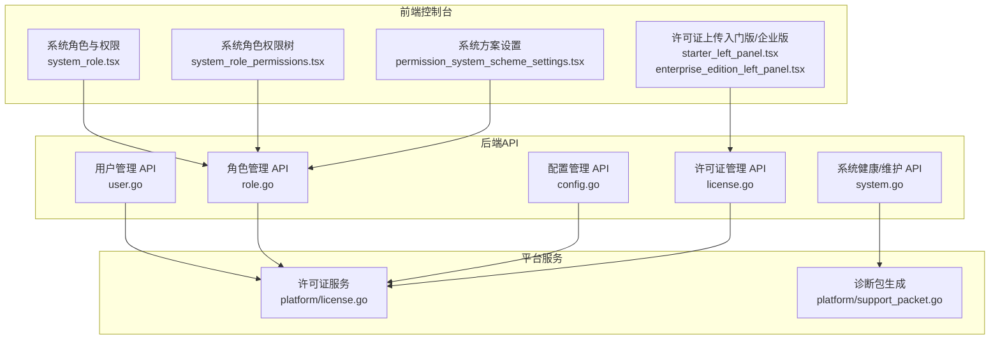
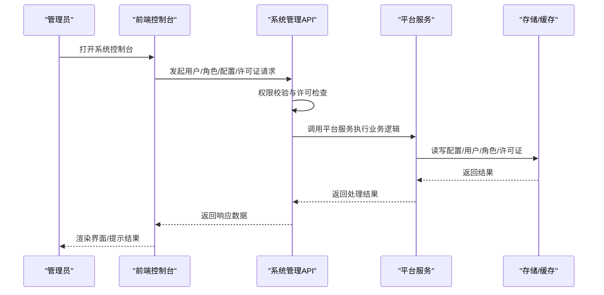
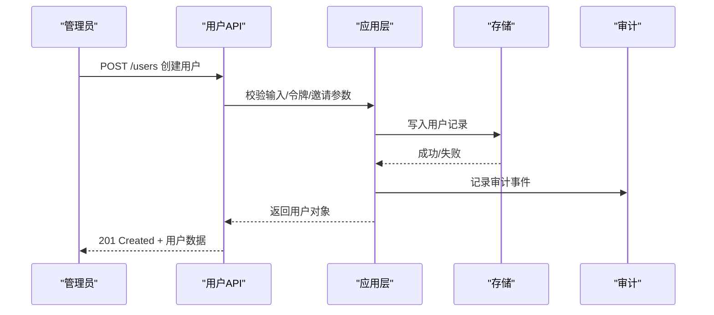
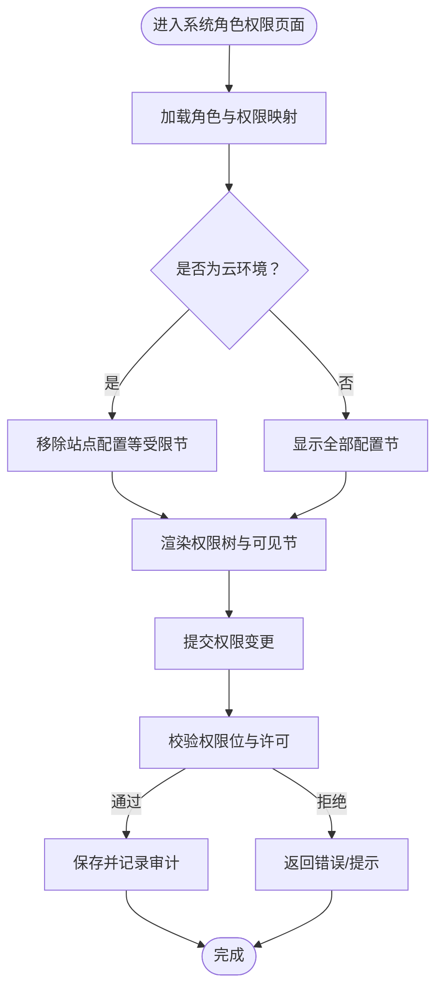
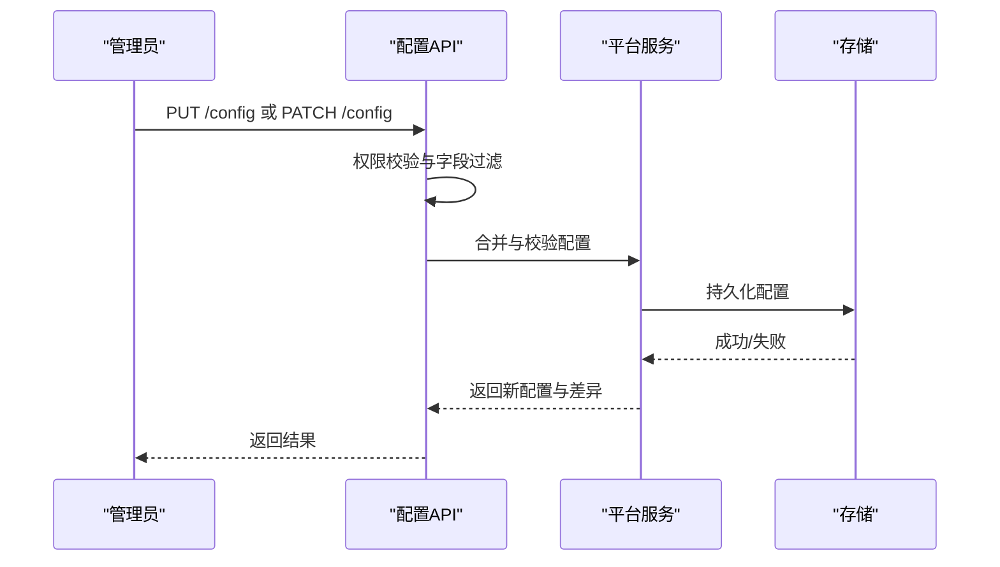
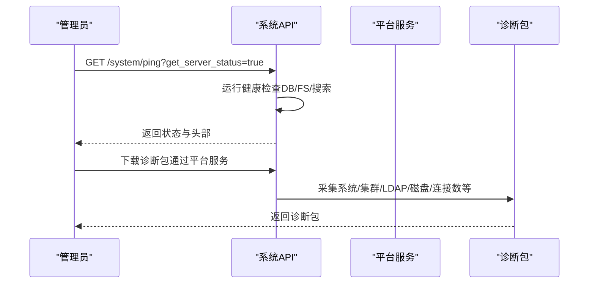
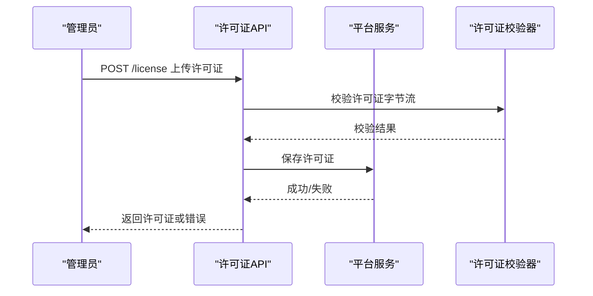
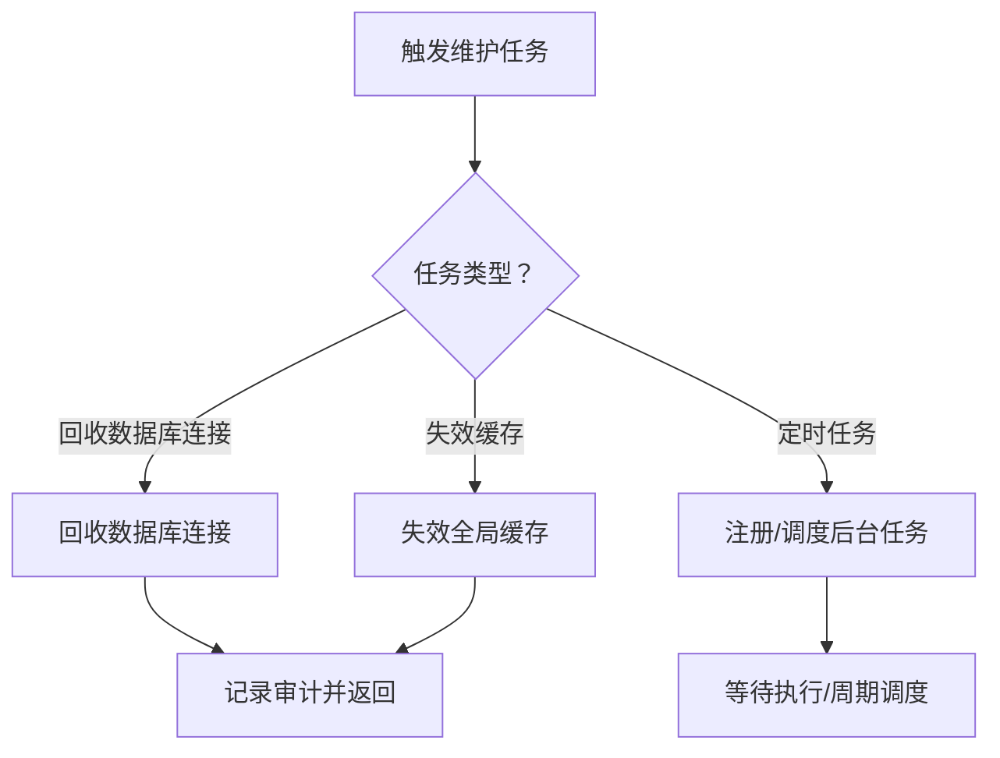
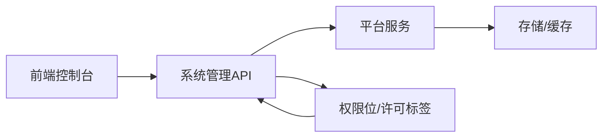

# 系统管理

<cite>
**本文引用的文件**
- [server/channels/api4/user.go](file://server/channels/api4/user.go)
- [server/channels/api4/role.go](file://server/channels/api4/role.go)
- [server/channels/api4/config.go](file://server/channels/api4/config.go)
- [server/channels/api4/license.go](file://server/channels/api4/license.go)
- [server/channels/api4/system.go](file://server/channels/api4/system.go)
- [server/channels/app/platform/license.go](file://server/channels/app/platform/license.go)
- [server/channels/app/platform/support_packet.go](file://server/channels/app/platform/support_packet.go)
- [server/channels/app/platform/support_packet_test.go](file://server/channels/app/platform/support_packet_test.go)
- [server/public/model/config.go](file://server/public/model/config.go)
- [server/public/model/client4.go](file://server/public/model/client4.go)
- [webapp/channels/src/components/admin_console/system_roles/system_role/system_role.tsx](file://webapp/channels/src/components/admin_console/system_roles/system_role/system_role.tsx)
- [webapp/channels/src/components/admin_console/system_roles/system_role/system_role_permissions.tsx](file://webapp/channels/src/components/admin_console/system_roles/system_role/system_role_permissions.tsx)
- [webapp/channels/src/components/admin_console/permission_schemes_settings/permission_system_scheme_settings/permission_system_scheme_settings.tsx](file://webapp/channels/src/components/admin_console/permission_schemes_settings/permission_system_scheme_settings/permission_system_scheme_settings.tsx)
- [webapp/channels/src/components/admin_console/license_settings/starter_edition/starter_left_panel.tsx](file://webapp/channels/src/components/admin_console/license_settings/starter_edition/starter_left_panel.tsx)
- [webapp/channels/src/components/admin_console/license_settings/enterprise_edition/enterprise_edition_left_panel.tsx](file://webapp/channels/src/components/admin_console/license_settings/enterprise_edition/enterprise_edition_left_panel.tsx)
- [e2e-tests/playwright/specs/functional/system_console/permissions/team_access.spec.ts](file://e2e-tests/playwright/specs/functional/system_console/permissions/team_access.spec.ts)
- [e2e-tests/cypress/tests/fixtures/system-roles-console-access.json](file://e2e-tests/cypress/tests/fixtures/system-roles-console-access.json)
- [server/channels/app/server.go](file://server/channels/app/server.go)
</cite>

## 目录
1. [简介](#简介)
2. [项目结构](#项目结构)
3. [核心组件](#核心组件)
4. [架构总览](#架构总览)
5. [详细组件分析](#详细组件分析)
6. [依赖分析](#依赖分析)
7. [性能考虑](#性能考虑)
8. [故障排查指南](#故障排查指南)
9. [结论](#结论)
10. [附录](#附录)

## 简介
本文件面向系统管理员与平台运维人员，系统性梳理 Mattermost 的系统管理能力，覆盖以下主题：
- 用户管理：用户创建、编辑、禁用与删除等全生命周期操作
- 权限控制：系统角色定义、权限分配、委托式细粒度授权与访问控制
- 配置管理：系统配置修改、环境变量可见性过滤、配置重载与备份/差异记录
- 监控与诊断：系统状态健康检查、性能指标采集、支持包生成与诊断信息
- 许可证管理：许可证上传、验证、试用申请、负载度量与功能激活
- 维护任务：数据库连接回收、缓存失效、定时任务与服务重启
- 企业版功能开关与配置项

## 项目结构
系统管理相关能力由后端 API 层、前端控制台界面层与平台服务层协同实现：
- 后端 API 层：提供用户、角色、配置、许可证、系统健康检查等接口
- 前端控制台：系统角色与权限面板、许可证上传入口、配置可视化
- 平台服务层：许可证校验与加载、诊断包生成、缓存与会话状态管理、作业调度

图示来源
- [webapp/channels/src/components/admin_console/system_roles/system_role/system_role.tsx:260-293](file://webapp/channels/src/components/admin_console/system_roles/system_role/system_role.tsx#L260-L293)
- [webapp/channels/src/components/admin_console/system_roles/system_role/system_role_permissions.tsx:301-341](file://webapp/channels/src/components/admin_console/system_roles/system_role/system_role_permissions.tsx#L301-L341)
- [webapp/channels/src/components/admin_console/permission_schemes_settings/permission_system_scheme_settings/permission_system_scheme_settings.tsx:518-540](file://webapp/channels/src/components/admin_console/permission_schemes_settings/permission_system_scheme_settings/permission_system_scheme_settings.tsx#L518-L540)
- [webapp/channels/src/components/admin_console/license_settings/starter_edition/starter_left_panel.tsx:77-105](file://webapp/channels/src/components/admin_console/license_settings/starter_edition/starter_left_panel.tsx#L77-L105)
- [webapp/channels/src/components/admin_console/license_settings/enterprise_edition/enterprise_edition_left_panel.tsx:123-203](file://webapp/channels/src/components/admin_console/license_settings/enterprise_edition/enterprise_edition_left_panel.tsx#L123-L203)
- [server/channels/api4/user.go:232-296](file://server/channels/api4/user.go#L232-L296)
- [server/channels/api4/role.go:130-237](file://server/channels/api4/role.go#L130-L237)
- [server/channels/api4/config.go:52-98](file://server/channels/api4/config.go#L52-L98)
- [server/channels/api4/license.go:55-155](file://server/channels/api4/license.go#L55-L155)
- [server/channels/api4/system.go:184-223](file://server/channels/api4/system.go#L184-L223)
- [server/channels/app/platform/license.go:121-153](file://server/channels/app/platform/license.go#L121-L153)
- [server/channels/app/platform/support_packet.go:1-268](file://server/channels/app/platform/support_packet.go#L1-L268)

章节来源
- [server/channels/api4/user.go:29-118](file://server/channels/api4/user.go#L29-L118)
- [server/channels/api4/role.go:23-29](file://server/channels/api4/role.go#L23-L29)
- [server/channels/api4/config.go:34-41](file://server/channels/api4/config.go#L34-L41)
- [server/channels/api4/license.go:20-27](file://server/channels/api4/license.go#L20-L27)
- [server/channels/api4/system.go:184-223](file://server/channels/api4/system.go#L184-L223)

## 核心组件
- 用户管理 API：提供用户创建、查询、更新、删除、角色变更、密码与 MFA 等管理接口，并内置审计记录
- 角色与权限 API：支持系统角色查询、批量名称查询、角色补丁更新；对受保护角色与权限变更进行严格许可与权限校验
- 配置管理 API：支持完整配置获取、增量补丁、环境变量过滤、配置重载；对敏感字段与云环境限制进行保护
- 许可证管理 API：支持许可证上传、移除、试用申请、客户端许可证信息获取与负载度量
- 系统健康与维护 API：提供健康检查、数据库连接回收、缓存失效、日志查询等运维能力
- 平台服务：负责许可证验证与加载、诊断包生成、缓存与会话状态初始化、作业调度注册

章节来源
- [server/channels/api4/user.go:232-296](file://server/channels/api4/user.go#L232-L296)
- [server/channels/api4/role.go:130-237](file://server/channels/api4/role.go#L130-L237)
- [server/channels/api4/config.go:120-251](file://server/channels/api4/config.go#L120-L251)
- [server/channels/api4/license.go:55-155](file://server/channels/api4/license.go#L55-L155)
- [server/channels/api4/system.go:184-223](file://server/channels/api4/system.go#L184-L223)
- [server/channels/app/platform/license.go:121-153](file://server/channels/app/platform/license.go#L121-L153)

## 架构总览
系统管理功能通过“前端控制台 + 后端 API + 平台服务”的分层架构实现，权限与配置均以“许可 + 权限位 + 字段标签”三者共同约束，确保在不同部署形态（自管/云）下的安全与合规。

图示来源
- [server/channels/api4/user.go:232-296](file://server/channels/api4/user.go#L232-L296)
- [server/channels/api4/role.go:130-237](file://server/channels/api4/role.go#L130-L237)
- [server/channels/api4/config.go:120-251](file://server/channels/api4/config.go#L120-L251)
- [server/channels/api4/license.go:55-155](file://server/channels/api4/license.go#L55-L155)
- [server/channels/app/platform/license.go:121-153](file://server/channels/app/platform/license.go#L121-L153)

## 详细组件分析

### 用户管理
- 入口与路由：用户资源的增删改查、登录/登出、令牌与会话管理、MFA、密码与 TermsOfService 等
- 关键流程：创建用户（支持邀请码/令牌/注册）、更新用户、禁用/启用、删除、角色变更、审计记录
- 审计与权限：所有关键操作均记录审计事件，调用方需具备相应系统管理权限

图示来源
- [server/channels/api4/user.go:232-296](file://server/channels/api4/user.go#L232-L296)

章节来源
- [server/channels/api4/user.go:29-118](file://server/channels/api4/user.go#L29-L118)
- [server/channels/api4/user.go:232-296](file://server/channels/api4/user.go#L232-L296)

### 权限控制系统
- 系统角色与委托授权：前端提供系统角色权限面板与用户归属管理，支持按“系统管理器/用户管理员/只读管理员”等角色授予细粒度权限
- 权限分配与校验：后端对角色补丁更新进行严格校验，禁止修改黑名单权限，保护系统管理员等受保护角色
- 配置访问标签：配置字段通过“access”标签声明可读/可写与限制类型，结合权限位与许可动态过滤

图示来源
- [webapp/channels/src/components/admin_console/system_roles/system_role/system_role_permissions.tsx:301-341](file://webapp/channels/src/components/admin_console/system_roles/system_role/system_role_permissions.tsx#L301-L341)
- [webapp/channels/src/components/admin_console/system_roles/system_role/system_role.tsx:260-293](file://webapp/channels/src/components/admin_console/system_roles/system_role/system_role.tsx#L260-L293)
- [e2e-tests/playwright/specs/functional/system_console/permissions/team_access.spec.ts:86-116](file://e2e-tests/playwright/specs/functional/system_console/permissions/team_access.spec.ts#L86-L116)
- [e2e-tests/cypress/tests/fixtures/system-roles-console-access.json:48-98](file://e2e-tests/cypress/tests/fixtures/system-roles-console-access.json#L48-L98)

章节来源
- [server/channels/api4/role.go:130-237](file://server/channels/api4/role.go#L130-L237)
- [webapp/channels/src/components/admin_console/system_roles/system_role/system_role_permissions.tsx:301-341](file://webapp/channels/src/components/admin_console/system_roles/system_role/system_role_permissions.tsx#L301-L341)
- [webapp/channels/src/components/admin_console/system_roles/system_role/system_role.tsx:260-293](file://webapp/channels/src/components/admin_console/system_roles/system_role/system_role.tsx#L260-L293)
- [e2e-tests/playwright/specs/functional/system_console/permissions/team_access.spec.ts:86-116](file://e2e-tests/playwright/specs/functional/system_console/permissions/team_access.spec.ts#L86-L116)
- [e2e-tests/cypress/tests/fixtures/system-roles-console-access.json:48-98](file://e2e-tests/cypress/tests/fixtures/system-roles-console-access.json#L48-L98)

### 配置管理
- 获取配置：支持去除默认值/掩码字段，云环境按“可写限制/云限制”标签过滤
- 更新与补丁：合并策略基于权限位与字段标签，禁止修改敏感字段；校验配置有效性并记录差异
- 重载配置：仅允许具备“重载配置”权限的管理员触发

图示来源
- [server/channels/api4/config.go:120-251](file://server/channels/api4/config.go#L120-L251)
- [server/public/model/config.go:1185-1228](file://server/public/model/config.go#L1185-L1228)

章节来源
- [server/channels/api4/config.go:52-98](file://server/channels/api4/config.go#L52-L98)
- [server/channels/api4/config.go:120-251](file://server/channels/api4/config.go#L120-L251)
- [server/public/model/config.go:1185-1228](file://server/public/model/config.go#L1185-L1228)

### 监控与诊断
- 健康检查：提供 ping 接口与系统状态头，包含数据库、文件存储、搜索后端、通知推送测试等
- 支持包：聚合服务器、集群、LDAP、文件存储、网络与进程等多维诊断信息，便于问题定位
- 性能指标：支持指标监听地址、客户端指标开关、通知指标开关等配置项

图示来源
- [server/channels/api4/system.go:184-223](file://server/channels/api4/system.go#L184-L223)
- [server/public/model/client4.go:4339-4371](file://server/public/model/client4.go#L4339-L4371)
- [server/channels/app/platform/support_packet.go:1-268](file://server/channels/app/platform/support_packet.go#L1-L268)

章节来源
- [server/channels/api4/system.go:184-223](file://server/channels/api4/system.go#L184-L223)
- [server/channels/app/platform/support_packet.go:1-268](file://server/channels/app/platform/support_packet.go#L1-L268)
- [server/channels/app/platform/support_packet_test.go:858-926](file://server/channels/app/platform/support_packet_test.go#L858-L926)
- [server/public/model/client4.go:4339-4371](file://server/public/model/client4.go#L4339-L4371)

### 许可证管理
- 上传与验证：支持从文件上传许可证，进行格式与内容校验，记录审计事件
- 试用申请：支持试用请求与历史试用查询，云环境触发许可证变更回调
- 负载度量：计算活跃用户与许可用户的比值，用于负载评估

图示来源
- [server/channels/api4/license.go:55-155](file://server/channels/api4/license.go#L55-L155)
- [server/channels/app/platform/license.go:121-153](file://server/channels/app/platform/license.go#L121-L153)

章节来源
- [server/channels/api4/license.go:20-27](file://server/channels/api4/license.go#L20-L27)
- [server/channels/api4/license.go:55-155](file://server/channels/api4/license.go#L55-L155)
- [server/channels/app/platform/license.go:121-153](file://server/channels/app/platform/license.go#L121-L153)
- [webapp/channels/src/components/admin_console/license_settings/starter_edition/starter_left_panel.tsx:77-105](file://webapp/channels/src/components/admin_console/license_settings/starter_edition/starter_left_panel.tsx#L77-L105)
- [webapp/channels/src/components/admin_console/license_settings/enterprise_edition/enterprise_edition_left_panel.tsx:123-203](file://webapp/channels/src/components/admin_console/license_settings/enterprise_edition/enterprise_edition_left_panel.tsx#L123-L203)

### 系统维护任务
- 数据库连接回收：回收数据库连接池，降低长连接导致的资源占用
- 缓存失效：清空全局缓存，强制重新加载
- 作业调度：注册多种后台任务，如过期令牌清理、物化视图刷新、导出与清理等

图示来源
- [server/channels/api4/system.go:318-352](file://server/channels/api4/system.go#L318-L352)
- [server/channels/app/server.go:1718-1760](file://server/channels/app/server.go#L1718-L1760)

章节来源
- [server/channels/api4/system.go:318-352](file://server/channels/api4/system.go#L318-L352)
- [server/channels/app/server.go:1718-1760](file://server/channels/app/server.go#L1718-L1760)

## 依赖分析
- 权限与许可耦合：角色与配置访问标签共同决定字段可见性与可写性，云环境引入“云限制”标签
- 前后端协作：前端控制台依赖后端 API 提供的数据模型与权限位，同时根据许可状态调整 UI 可见性
- 平台服务依赖：许可证加载、诊断包生成、缓存与会话状态初始化等均依赖平台服务层

图示来源
- [server/channels/api4/config.go:403-460](file://server/channels/api4/config.go#L403-L460)
- [webapp/channels/src/components/admin_console/system_roles/system_role/system_role_permissions.tsx:301-341](file://webapp/channels/src/components/admin_console/system_roles/system_role/system_role_permissions.tsx#L301-L341)

章节来源
- [server/channels/api4/config.go:403-460](file://server/channels/api4/config.go#L403-L460)

## 性能考虑
- 指标采集：可通过指标监听地址与开关控制客户端/通知指标采集，避免高基数指标带来的开销
- 缓存与会话：状态与会话缓存采用 LRU 实现，合理设置大小与过期时间，减少热点扫描
- 诊断包：诊断信息较大，建议按需生成并压缩传输，避免影响生产流量

章节来源
- [server/public/model/config.go:1185-1228](file://server/public/model/config.go#L1185-L1228)
- [server/channels/app/platform/service.go:335-354](file://server/channels/app/platform/service.go#L335-L354)

## 故障排查指南
- 健康检查失败：检查数据库连通性、文件存储可用性与搜索后端状态，查看系统状态头中的具体失败项
- 配置更新异常：确认权限位与字段标签过滤，核对敏感字段是否被禁止修改，查看差异记录
- 许可证问题：确认许可证格式正确、未过期，必要时重新上传；查看许可证变更回调日志
- 诊断包：包含数据库连接池统计、LDAP/邮件/搜索等外部依赖状态，优先关注状态为“失败/不可用”的条目

章节来源
- [server/channels/api4/system.go:184-223](file://server/channels/api4/system.go#L184-L223)
- [server/channels/app/platform/support_packet.go:1-268](file://server/channels/app/platform/support_packet.go#L1-L268)
- [server/channels/app/platform/support_packet_test.go:858-926](file://server/channels/app/platform/support_packet_test.go#L858-L926)

## 结论
Mattermost 的系统管理能力以“许可 + 权限位 + 字段标签”为核心，结合前后端协作与平台服务，实现了用户管理、权限控制、配置管理、监控诊断、许可证管理与维护任务的闭环。通过严格的权限校验与云环境限制，保障了在不同部署形态下的安全性与合规性。

## 附录
- 企业版功能开关与配置项：通过许可证 Features 控制功能启用，前端根据许可状态隐藏/显示对应配置节
- 委托式细粒度授权：系统管理器可在特定配置节上获得“可编辑/只读/无访问”，提升管理灵活性

章节来源
- [webapp/channels/src/components/admin_console/system_roles/system_role/system_role_permissions.tsx:301-341](file://webapp/channels/src/components/admin_console/system_roles/system_role/system_role_permissions.tsx#L301-L341)
- [webapp/channels/src/components/admin_console/system_roles/system_role/system_role.tsx:260-293](file://webapp/channels/src/components/admin_console/system_roles/system_role/system_role.tsx#L260-L293)
- [e2e-tests/playwright/specs/functional/system_console/permissions/team_access.spec.ts:86-116](file://e2e-tests/playwright/specs/functional/system_console/permissions/team_access.spec.ts#L86-L116)
- [e2e-tests/cypress/tests/fixtures/system-roles-console-access.json:48-98](file://e2e-tests/cypress/tests/fixtures/system-roles-console-access.json#L48-L98)