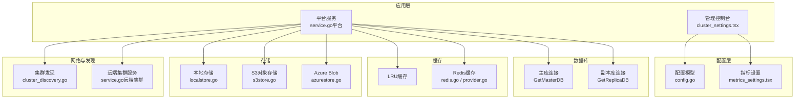
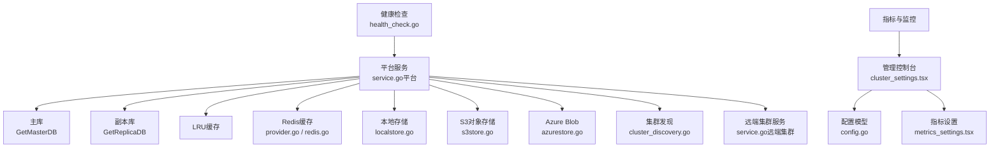
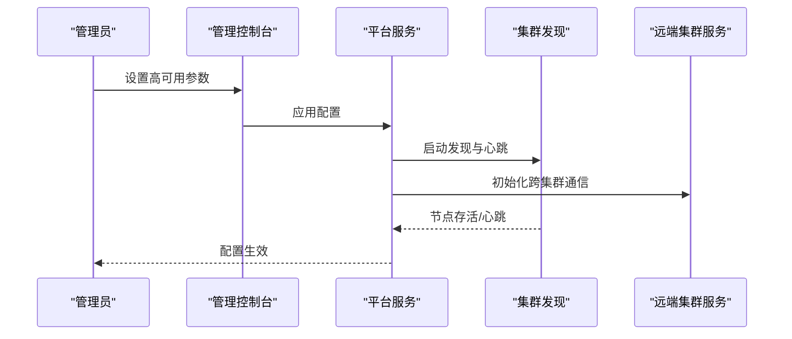
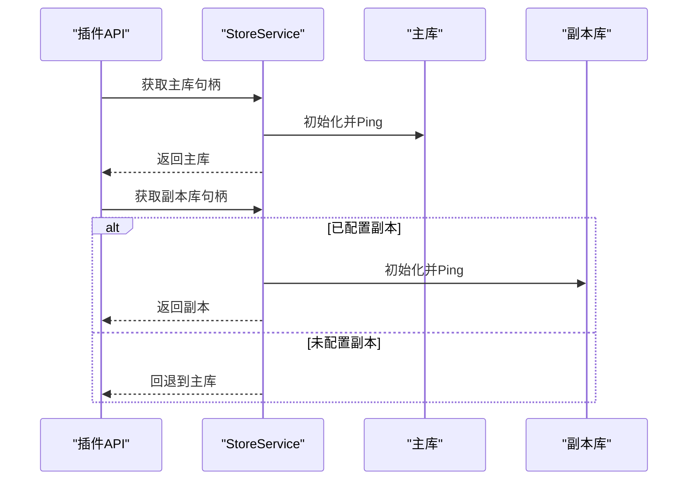
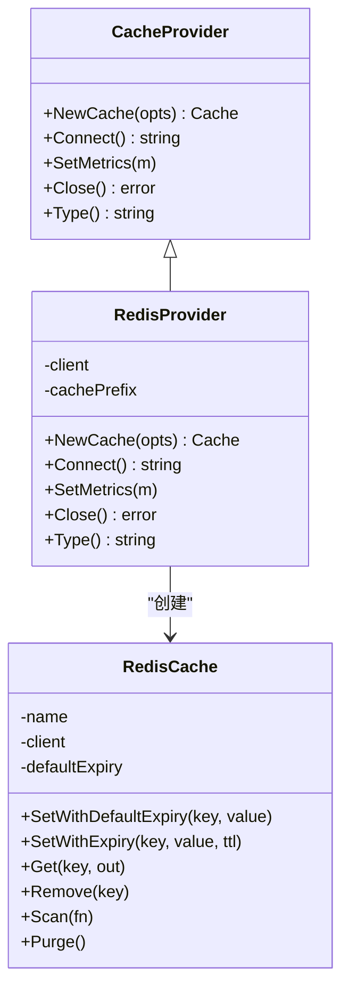
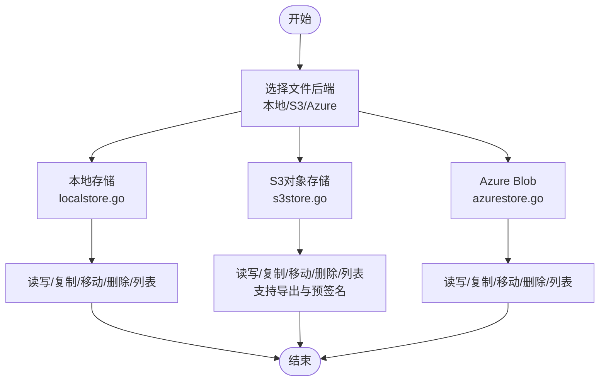
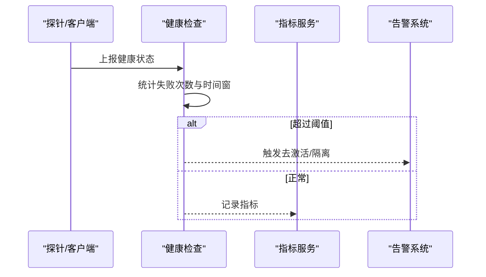
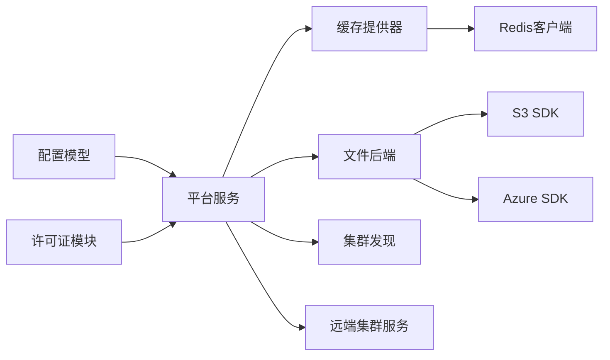

# 高可用性部署

<cite>
**本文引用的文件**   
- [config.go](file://server/public/model/config.go)
- [cluster_discovery.go](file://server/public/model/cluster_discovery.go)
- [cluster_settings.tsx](file://webapp/channels/src/components/admin_console/cluster_settings.tsx)
- [store.go](file://server/public/pluginapi/store.go)
- [store_test.go](file://server/public/pluginapi/store_test.go)
- [service_test.go](file://server/channels/app/platform/service_test.go)
- [redis.go](file://server/platform/services/cache/redis.go)
- [provider.go](file://server/platform/services/cache/provider.go)
- [filesstore.go](file://server/platform/shared/filestore/filesstore.go)
- [localstore.go](file://server/platform/shared/filestore/localstore.go)
- [s3store.go](file://server/platform/shared/filestore/s3store.go)
- [azurestore.go](file://server/platform/shared/filestore/azurestore.go)
- [health_check.go](file://server/public/plugin/health_check.go)
- [metrics_settings.tsx](file://webapp/channels/src/components/admin_console/admin_definition.tsx)
- [cluster_discovery.go（平台）](file://server/channels/app/cluster_discovery.go)
- [service.go（平台）](file://server/channels/app/platform/service.go)
- [service.go（远端集群）](file://server/platform/services/remotecluster/service.go)
- [busy_test.go](file://server/channels/app/busy_test.go)
- [license.go](file://server/channels/app/platform/license.go)
- [license_test.go](file://server/public/model/license_test.go)
</cite>

## 目录
1. [引言](#引言)
2. [项目结构](#项目结构)
3. [核心组件](#核心组件)
4. [架构总览](#架构总览)
5. [详细组件分析](#详细组件分析)
6. [依赖关系分析](#依赖关系分析)
7. [性能考量](#性能考量)
8. [故障排查指南](#故障排查指南)
9. [结论](#结论)
10. [附录](#附录)

## 引言
本文件面向在生产环境中进行高可用部署的工程团队，系统化阐述 Mattermost 在集群架构、数据库高可用、缓存层、存储与对象存储、监控与告警以及扩容缩容策略等方面的实现要点与最佳实践。内容基于仓库中的配置模型、前端管理界面、缓存与存储后端、健康检查与指标配置等源码片段整理而成，帮助读者快速理解并落地高可用部署。

## 项目结构
围绕高可用部署的关键目录与文件如下：
- 配置模型与集群设置：定义集群、缓存、文件存储、指标等配置项
- 前端管理控制台：用于开启/配置高可用模式与相关参数
- 数据库连接与读写分离：插件API与平台服务对主/副本库的处理
- 缓存层：本地LRU与Redis两种提供器，支持会话与状态缓存
- 存储层：本地、S3、Azure三种文件后端，支持对象存储与导出
- 健康检查与指标：健康检查阈值与Prometheus/Metrics配置入口
- 远端集群与领导者选举：跨集群通信与领导者变更通知

图表来源
- [config.go](file://server/public/model/config.go)
- [cluster_settings.tsx](file://webapp/channels/src/components/admin_console/cluster_settings.tsx)
- [store.go](file://server/public/pluginapi/store.go)
- [redis.go](file://server/platform/services/cache/redis.go)
- [provider.go](file://server/platform/services/cache/provider.go)
- [filesstore.go](file://server/platform/shared/filestore/filesstore.go)
- [localstore.go](file://server/platform/shared/filestore/localstore.go)
- [s3store.go](file://server/platform/shared/filestore/s3store.go)
- [azurestore.go](file://server/platform/shared/filestore/azurestore.go)
- [cluster_discovery.go](file://server/public/model/cluster_discovery.go)
- [service.go（平台）](file://server/channels/app/platform/service.go)
- [service.go（远端集群）](file://server/platform/services/remotecluster/service.go)

章节来源
- [config.go](file://server/public/model/config.go)
- [cluster_settings.tsx](file://webapp/channels/src/components/admin_console/cluster_settings.tsx)
- [store.go](file://server/public/pluginapi/store.go)
- [redis.go](file://server/platform/services/cache/redis.go)
- [provider.go](file://server/platform/services/cache/provider.go)
- [filesstore.go](file://server/platform/shared/filestore/filesstore.go)
- [localstore.go](file://server/platform/shared/filestore/localstore.go)
- [s3store.go](file://server/platform/shared/filestore/s3store.go)
- [azurestore.go](file://server/platform/shared/filestore/azurestore.go)
- [cluster_discovery.go](file://server/public/model/cluster_discovery.go)
- [service.go（平台）](file://server/channels/app/platform/service.go)
- [service.go（远端集群）](file://server/platform/services/remotecluster/service.go)

## 核心组件
- 集群与高可用配置
  - 集群开关、名称、绑定地址、广告地址、网络接口、加密压缩、端口等参数由配置模型提供默认值与校验逻辑
  - 管理控制台提供“启用高可用模式”开关与相关提示
- 数据库高可用
  - 插件API提供主库与副本库句柄；当未配置副本时回退到主库；副本为单例
  - 平台测试用例验证无许可证时副本即为主库，有许可证时主/副本分离
- 缓存层高可用
  - 支持LRU与Redis两种提供器；Redis提供器可配置前缀、禁用缓存、写超时等
  - 会话与状态缓存在平台初始化阶段创建，受许可证与缓存类型约束
- 存储高可用
  - 文件后端支持本地、S3、Azure三类驱动；S3/Azure均提供连接测试、超时、TLS跳过等配置
- 指标与监控
  - 指标监听地址、客户端指标开关、通知指标开关等由配置与前端控制台暴露
- 健康检查与自动恢复
  - 健康检查失败时间戳窗口与重启限制用于判定是否激活去激活或自动恢复策略

章节来源
- [config.go](file://server/public/model/config.go)
- [cluster_settings.tsx](file://webapp/channels/src/components/admin_console/cluster_settings.tsx)
- [store.go](file://server/public/pluginapi/store.go)
- [store_test.go](file://server/public/pluginapi/store_test.go)
- [service_test.go](file://server/channels/app/platform/service_test.go)
- [redis.go](file://server/platform/services/cache/redis.go)
- [provider.go](file://server/platform/services/cache/provider.go)
- [filesstore.go](file://server/platform/shared/filestore/filesstore.go)
- [localstore.go](file://server/platform/shared/filestore/localstore.go)
- [s3store.go](file://server/platform/shared/filestore/s3store.go)
- [azurestore.go](file://server/platform/shared/filestore/azurestore.go)
- [metrics_settings.tsx](file://webapp/channels/src/components/admin_console/admin_definition.tsx)
- [health_check.go](file://server/public/plugin/health_check.go)

## 架构总览
下图展示高可用部署中各子系统的交互关系：前端控制台负责配置下发，平台服务根据配置初始化数据库、缓存与存储后端；集群发现与远端集群服务支撑跨节点与跨集群通信；健康检查与指标为运维可观测性提供基础。

图表来源
- [cluster_settings.tsx](file://webapp/channels/src/components/admin_console/cluster_settings.tsx)
- [config.go](file://server/public/model/config.go)
- [metrics_settings.tsx](file://webapp/channels/src/components/admin_console/admin_definition.tsx)
- [service.go（平台）](file://server/channels/app/platform/service.go)
- [store.go](file://server/public/pluginapi/store.go)
- [provider.go](file://server/platform/services/cache/provider.go)
- [redis.go](file://server/platform/services/cache/redis.go)
- [localstore.go](file://server/platform/shared/filestore/localstore.go)
- [s3store.go](file://server/platform/shared/filestore/s3store.go)
- [azurestore.go](file://server/platform/shared/filestore/azurestore.go)
- [cluster_discovery.go](file://server/public/model/cluster_discovery.go)
- [service.go（远端集群）](file://server/platform/services/remotecluster/service.go)
- [health_check.go](file://server/public/plugin/health_check.go)

## 详细组件分析

### 集群架构与节点角色
- 节点角色
  - 领导者节点：负责跨节点通信与事件广播；平台服务提供领导者变更监听接口
  - 非领导者节点：参与集群消息处理与状态同步
- 负载均衡与故障转移
  - 集群发现通过定时心跳维护节点存活；领导者变更触发监听回调
  - 健康检查失败次数与时间窗用于判断节点是否需要隔离或自动恢复
- 配置要点
  - 启用高可用模式、设置集群名称、绑定/广告地址、网络接口、加密与压缩、Gossip端口等

图表来源
- [cluster_settings.tsx](file://webapp/channels/src/components/admin_console/cluster_settings.tsx)
- [cluster_discovery.go（平台）](file://server/channels/app/cluster_discovery.go)
- [service.go（平台）](file://server/channels/app/platform/service.go)
- [service.go（远端集群）](file://server/platform/services/remotecluster/service.go)
- [busy_test.go](file://server/channels/app/busy_test.go)

章节来源
- [cluster_settings.tsx](file://webapp/channels/src/components/admin_console/cluster_settings.tsx)
- [cluster_discovery.go（平台）](file://server/channels/app/cluster_discovery.go)
- [service.go（平台）](file://server/channels/app/platform/service.go)
- [service.go（远端集群）](file://server/platform/services/remotecluster/service.go)
- [busy_test.go](file://server/channels/app/busy_test.go)

### 数据库高可用（主从复制、读写分离）
- 主库与副本库
  - 插件API提供主库与副本库句柄；若未配置副本则返回主库实例；副本为单例
  - 平台测试用例验证：无许可证时副本即为主库；有许可证时主/副本分离
- 连接与生命周期
  - 初始化时对主/副本分别执行Ping校验；关闭时统一释放资源
- 许可证与功能约束
  - 平台在初始化缓存时，若使用Redis且无集群许可，则拒绝启动（除非强制启用）

图表来源
- [store.go](file://server/public/pluginapi/store.go)
- [store_test.go](file://server/public/pluginapi/store_test.go)
- [service_test.go](file://server/channels/app/platform/service_test.go)
- [service.go（平台）](file://server/channels/app/platform/service.go)

章节来源
- [store.go](file://server/public/pluginapi/store.go)
- [store_test.go](file://server/public/pluginapi/store_test.go)
- [service_test.go](file://server/channels/app/platform/service_test.go)
- [service.go（平台）](file://server/channels/app/platform/service.go)

### 缓存层高可用（Redis、会话共享、分布式锁）
- 提供器选择
  - LRU提供器：适用于单机或小规模场景
  - Redis提供器：支持连接池、写超时、禁用本地缓存、命令批量刷新延迟等参数
- 缓存键空间隔离
  - Redis提供器可配置缓存前缀，避免多环境键冲突
- 会话与状态缓存
  - 平台初始化阶段创建会话与状态缓存；缓存大小、分片桶数、默认过期时间等参数可调
- 分布式锁
  - 代码库未直接暴露分布式锁实现；可通过外部Redis或业务层实现

图表来源
- [provider.go](file://server/platform/services/cache/provider.go)
- [redis.go](file://server/platform/services/cache/redis.go)

章节来源
- [provider.go](file://server/platform/services/cache/provider.go)
- [redis.go](file://server/platform/services/cache/redis.go)
- [service.go（平台）](file://server/channels/app/platform/service.go)

### 存储高可用（对象存储、文件同步与备份）
- 文件后端抽象
  - 统一接口定义了读取、写入、复制、移动、删除、列表、压缩等能力
  - 支持本地、S3、Azure三种驱动；S3/Azure均提供连接测试、超时、TLS跳过等配置
- 对象存储
  - S3：支持签名版本、区域、SSL/TLS、请求超时、预签名链接过期时间、上传分块大小、存储类别等
  - Azure：支持多种认证方式、容器、路径前缀、超时等
- 备份策略
  - 可结合S3/Azure后端进行归档与导出；导出流程可利用上下文写入以支持长耗时任务

图表来源
- [filesstore.go](file://server/platform/shared/filestore/filesstore.go)
- [localstore.go](file://server/platform/shared/filestore/localstore.go)
- [s3store.go](file://server/platform/shared/filestore/s3store.go)
- [azurestore.go](file://server/platform/shared/filestore/azurestore.go)

章节来源
- [filesstore.go](file://server/platform/shared/filestore/filesstore.go)
- [localstore.go](file://server/platform/shared/filestore/localstore.go)
- [s3store.go](file://server/platform/shared/filestore/s3store.go)
- [azurestore.go](file://server/platform/shared/filestore/azurestore.go)

### 监控与告警（健康检查、性能监控、自动恢复）
- 指标与监控
  - 监听地址、启用客户端指标、启用通知指标等配置项由前端控制台暴露
  - 平台服务在初始化阶段加载许可证并据此决定缓存与集群特性启用
- 健康检查
  - 健康检查失败时间戳窗口与重启限制用于判定是否激活自动恢复策略
- 告警联动
  - 结合Prometheus/Grafana等外部监控系统采集指标并触发告警

图表来源
- [health_check.go](file://server/public/plugin/health_check.go)
- [metrics_settings.tsx](file://webapp/channels/src/components/admin_console/admin_definition.tsx)
- [license.go](file://server/channels/app/platform/license.go)
- [license_test.go](file://server/public/model/license_test.go)

章节来源
- [health_check.go](file://server/public/plugin/health_check.go)
- [metrics_settings.tsx](file://webapp/channels/src/components/admin_console/admin_definition.tsx)
- [license.go](file://server/channels/app/platform/license.go)
- [license_test.go](file://server/public/model/license_test.go)

### 扩容与缩容策略（水平扩展、垂直扩展、容量规划）
- 水平扩展
  - 新增节点加入集群：通过集群发现与心跳维持；领导者变更监听确保一致性
  - 读写分离：副本库用于只读查询；主库承载写入
  - 缓存：Redis提供器支持横向扩展；通过前缀隔离与连接参数优化吞吐
- 垂直扩展
  - 单节点提升资源：调整缓存大小、分片桶数、连接超时等参数
  - 对象存储：按需增大S3/Azure上传分块大小与并发度
- 容量规划
  - 基于活跃用户与会话缓存规模评估内存占用
  - 依据文件导出与对象存储访问峰值评估带宽与存储成本

章节来源
- [cluster_discovery.go（平台）](file://server/channels/app/cluster_discovery.go)
- [service_test.go](file://server/channels/app/platform/service_test.go)
- [provider.go](file://server/platform/services/cache/provider.go)
- [s3store.go](file://server/platform/shared/filestore/s3store.go)
- [azurestore.go](file://server/platform/shared/filestore/azurestore.go)

## 依赖关系分析
- 组件耦合
  - 平台服务依赖配置模型与许可证模块；缓存提供器与指标接口解耦
  - 文件后端通过统一接口屏蔽本地/S3/Azure差异
- 外部依赖
  - Redis客户端、S3 SDK、Azure SDK等第三方库
- 循环依赖
  - 代码库未见明显循环导入；平台初始化顺序明确：配置→许可证→缓存→存储→集群

图表来源
- [config.go](file://server/public/model/config.go)
- [license.go](file://server/channels/app/platform/license.go)
- [service.go（平台）](file://server/channels/app/platform/service.go)
- [provider.go](file://server/platform/services/cache/provider.go)
- [filesstore.go](file://server/platform/shared/filestore/filesstore.go)
- [cluster_discovery.go](file://server/public/model/cluster_discovery.go)
- [service.go（远端集群）](file://server/platform/services/remotecluster/service.go)

章节来源
- [config.go](file://server/public/model/config.go)
- [license.go](file://server/channels/app/platform/license.go)
- [service.go（平台）](file://server/channels/app/platform/service.go)
- [provider.go](file://server/platform/services/cache/provider.go)
- [filesstore.go](file://server/platform/shared/filestore/filesstore.go)
- [cluster_discovery.go](file://server/public/model/cluster_discovery.go)
- [service.go（远端集群）](file://server/platform/services/remotecluster/service.go)

## 性能考量
- 缓存优化
  - Redis提供器支持批量刷新延迟与写超时，降低CPU占用与网络抖动影响
  - LRU分片与桶数可根据CPU核数动态调整
- 数据库优化
  - 读写分离减少主库压力；副本库Ping校验确保连接可用性
- 存储优化
  - S3/Azure上传分块大小与请求超时可按带宽与延迟调优
- 指标与观测
  - 客户端指标与通知指标可辅助定位性能瓶颈

## 故障排查指南
- 高可用模式无法启用
  - 检查许可证是否包含集群特性；平台初始化阶段对Redis与集群许可有约束
- 副本库不可用
  - 确认副本DSN已配置；插件API在副本Ping失败时回退到主库
- 缓存连接异常
  - 检查Redis地址、DB索引、密码与连接超时；确认提供器前缀与禁用缓存设置
- 对象存储错误
  - 校验S3/Azure必填字段、SSL/TLS、超时与签名版本；必要时启用跳过TLS验证
- 健康检查频繁失败
  - 查看失败时间戳窗口与重启限制；结合日志定位网络/资源瓶颈

章节来源
- [service.go（平台）](file://server/channels/app/platform/service.go)
- [store.go](file://server/public/pluginapi/store.go)
- [redis.go](file://server/platform/services/cache/redis.go)
- [s3store.go](file://server/platform/shared/filestore/s3store.go)
- [azurestore.go](file://server/platform/shared/filestore/azurestore.go)
- [health_check.go](file://server/public/plugin/health_check.go)

## 结论
通过配置模型与前端控制台的协同、平台服务的初始化流程、缓存与存储后端的抽象封装，以及健康检查与指标体系的支持，Mattermost在生产环境中具备完善的高可用部署能力。建议在实际部署中结合业务规模与SLA目标，合理选择缓存与存储方案，完善监控与告警，并制定清晰的扩容与缩容策略。

## 附录
- 关键配置项速览
  - 集群设置：启用开关、集群名称、绑定/广告地址、网络接口、加密/压缩、Gossip端口
  - 缓存设置：缓存类型、Redis地址与DB索引、缓存前缀、禁用客户端缓存
  - 文件存储：驱动类型、本地目录、S3/Azure相关参数
  - 指标设置：监听地址、启用客户端指标、启用通知指标

章节来源
- [config.go](file://server/public/model/config.go)
- [metrics_settings.tsx](file://webapp/channels/src/components/admin_console/admin_definition.tsx)