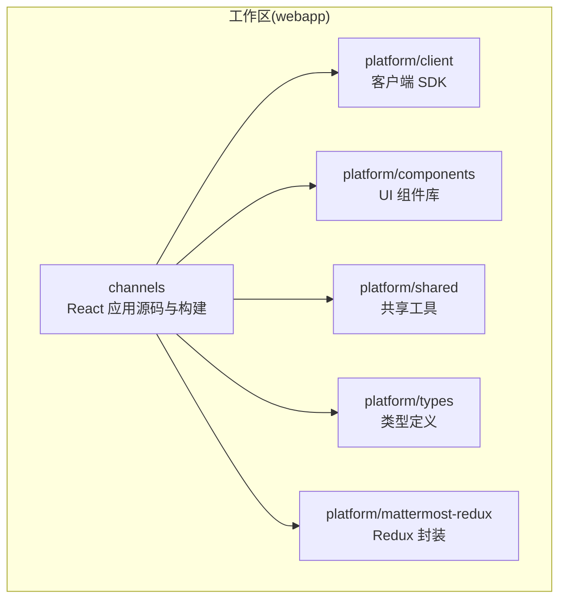
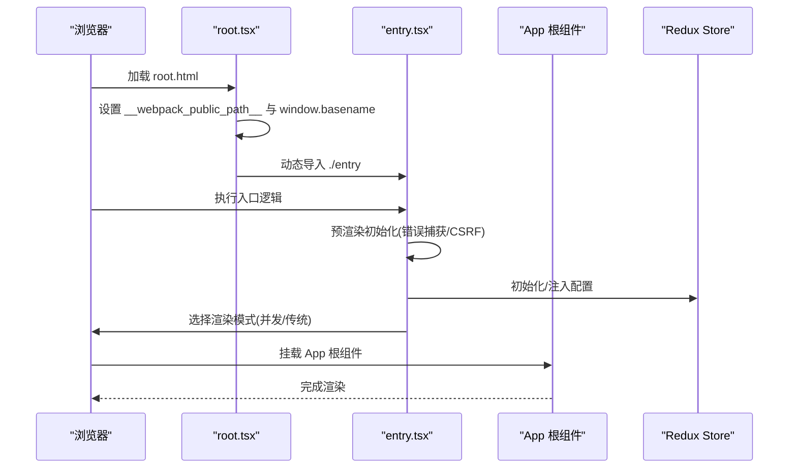
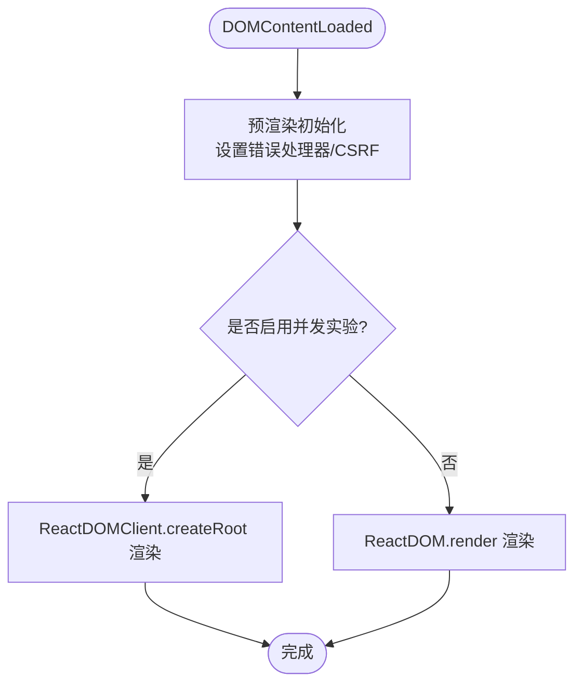
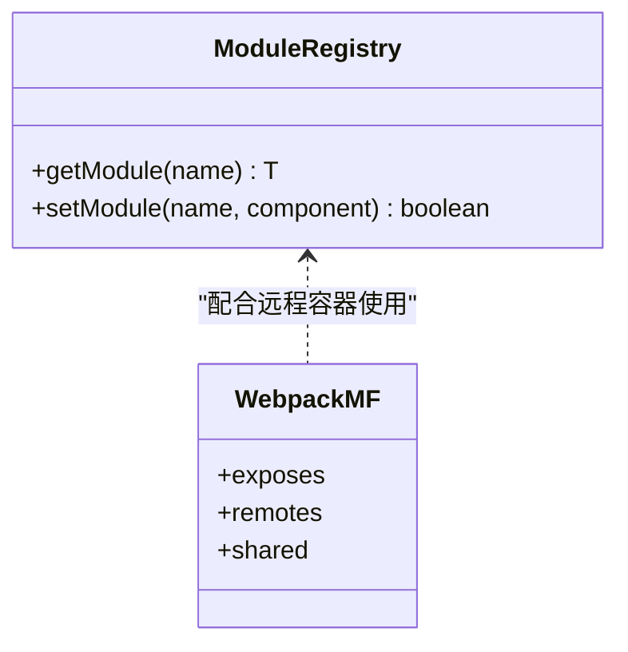
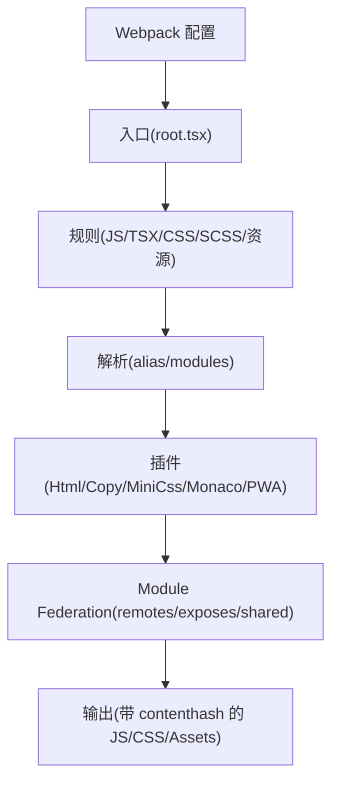
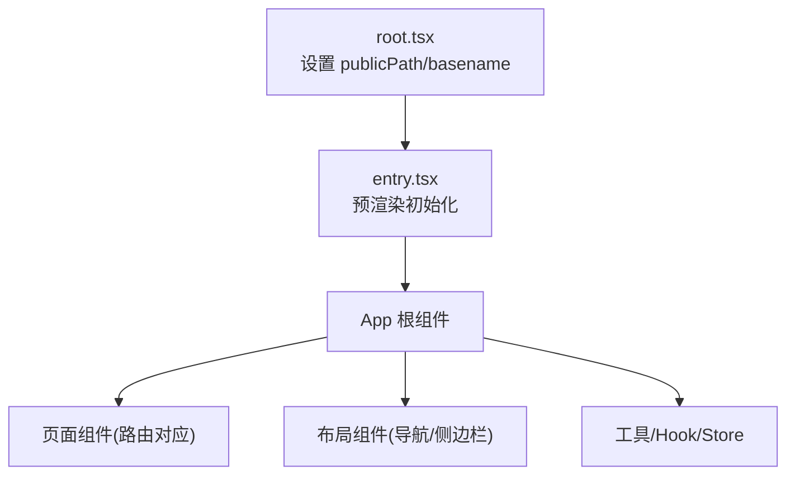
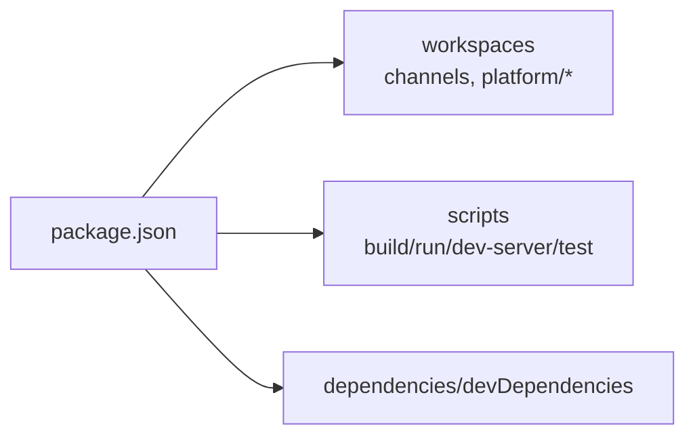

# React 应用架构

<cite>
**本文引用的文件**
- [channels/src/root.tsx](file://webapp/channels/src/root.tsx)
- [channels/src/entry.tsx](file://webapp/channels/src/entry.tsx)
- [channels/webpack.config.js](file://webapp/channels/webpack.config.js)
- [channels/src/module_registry.ts](file://webapp/channels/src/module_registry.ts)
- [package.json](file://webapp/package.json)
</cite>

## 目录
1. [引言](#引言)
2. [项目结构](#项目结构)
3. [核心组件](#核心组件)
4. [架构总览](#架构总览)
5. [详细组件分析](#详细组件分析)
6. [依赖分析](#依赖分析)
7. [性能考虑](#性能考虑)
8. [故障排查指南](#故障排查指南)
9. [结论](#结论)
10. [附录](#附录)

## 引言
本文件系统性阐述 Mattermost React 应用的前端架构与启动流程，重点覆盖以下方面：
- 启动流程：从入口文件到根组件渲染的完整链路
- 模块注册机制与组件加载策略
- 目录结构组织（以 src 下的子模块划分）
- Webpack 配置对 React 应用构建与打包的支持
- 组件层次结构可视化：从根组件到页面组件的关系
- 初始化流程：配置加载、国际化设置与主题初始化
- 实际示例：如何正确添加新页面组件与路由配置

## 项目结构
Mattermost 前端采用多包工作区（monorepo）组织方式，核心应用位于 webapp/channels 子包中，配合平台级共享包（platform/*）。关键目录与职责如下：
- channels/src：React 应用源码，包含入口、根组件、模块注册、组件、样式、工具等
- channels：构建脚本、Webpack 配置、测试配置等
- platform/*：客户端 SDK、组件库、类型定义、共享工具等
- 根 package.json：统一管理工作区与脚本

**章节来源**
- [package.json:109-117](file://webapp/package.json#L109-L117)

## 核心组件
本节聚焦 React 应用的核心启动与渲染组件。

- 入口与根组件
  - root.tsx：负责设置 Webpack 的 publicPath 与 basename，并动态导入 entry.tsx，确保资源路径在运行时可被正确解析
  - entry.tsx：执行预渲染初始化（错误捕获、CSRF 设置等），随后根据浏览器实验开关选择并发或传统渲染模式，挂载 App 根组件

- 模块注册机制
  - module_registry.ts：提供 getModule/setModule 两个方法，用于集中注册与获取模块（如远程容器暴露的组件），避免重复注册

- 初始化要点
  - 错误处理：全局 window.onerror 转发为错误通知动作
  - CSRF：从 Cookie 注入 CSRF Token
  - 渲染模式：依据本地存储决定是否启用 React 18 并发特性

**章节来源**
- [channels/src/root.tsx:1-27](file://webapp/channels/src/root.tsx#L1-L27)
- [channels/src/entry.tsx:30-93](file://webapp/channels/src/entry.tsx#L30-L93)
- [channels/src/module_registry.ts:1-18](file://webapp/channels/src/module_registry.ts#L1-L18)

## 架构总览
React 应用的启动与渲染遵循“根组件 -> 入口 -> 根组件动态导入”的顺序，结合 Webpack 的 Module Federation 支持实现模块化与远程容器集成。

**图示来源**
- [channels/src/root.tsx:12-23](file://webapp/channels/src/root.tsx#L12-L23)
- [channels/src/entry.tsx:32-74](file://webapp/channels/src/entry.tsx#L32-L74)

**章节来源**
- [channels/src/root.tsx:8-23](file://webapp/channels/src/root.tsx#L8-L23)
- [channels/src/entry.tsx:56-74](file://webapp/channels/src/entry.tsx#L56-L74)

## 详细组件分析

### 启动流程与渲染策略
- 资源路径初始化
  - 在 root.tsx 中设置 window.publicPath 与 __webpack_public_path__，确保动态资源（图片、字体、chunk）按服务端配置正确解析
  - 提取 window.basename 供路由 basename 使用
- 预渲染初始化
  - 在 entry.tsx 中注册全局错误处理器，将异常转换为应用内错误提示
  - 从 Cookie 注入 CSRF Token，保障安全请求
- 渲染模式选择
  - 若本地存储开启并发实验，则使用 ReactDOMClient.createRoot 进行并发渲染；否则回退至 ReactDOM.render

**图示来源**
- [channels/src/entry.tsx:32-74](file://webapp/channels/src/entry.tsx#L32-L74)

**章节来源**
- [channels/src/root.tsx:12-21](file://webapp/channels/src/root.tsx#L12-L21)
- [channels/src/entry.tsx:32-54](file://webapp/channels/src/entry.tsx#L32-L54)
- [channels/src/entry.tsx:59-73](file://webapp/channels/src/entry.tsx#L59-L73)

### 模块注册机制与组件加载策略
- 模块注册
  - 通过 module_registry.ts 的 setModule 确保模块唯一注册，getModule 提供集中访问
- 远程容器与共享模块
  - Webpack Module Federation 插件在开发/生产环境下动态注入远程容器与共享依赖，保证版本一致性与按需加载
- 组件加载策略
  - 通过动态 import('./entry') 与 expose 配置，实现延迟加载与模块解耦

**图示来源**
- [channels/src/module_registry.ts:6-17](file://webapp/channels/src/module_registry.ts#L6-L17)
- [channels/webpack.config.js:386-391](file://webapp/channels/webpack.config.js#L386-L391)

**章节来源**
- [channels/src/module_registry.ts:4-17](file://webapp/channels/src/module_registry.ts#L4-L17)
- [channels/webpack.config.js:317-402](file://webapp/channels/webpack.config.js#L317-L402)

### 目录结构组织（src 子模块）
基于仓库中 channels/src 的组织方式，React 应用的 src 目录主要划分为：
- actions：业务动作定义（视图、管理、应用等）
- client：客户端封装
- components：页面与通用组件
- hooks：自定义 Hook
- i18n：国际化资源
- images/fonts/sounds：静态资源
- packages：内部依赖（如 mattermost-redux）
- plugins：插件相关
- reducers/selectors：Redux 状态与选择器
- sass：样式资源
- store/stores：状态存储与仓库
- tests：单元与集成测试
- types：TypeScript 类型定义
- utils：工具函数
- entry.tsx/root.tsx/module_registry.ts：应用入口与注册机制

该组织方式体现了“功能域驱动”的模块划分，便于维护与扩展。

**章节来源**
- [channels/src/entry.tsx:1-93](file://webapp/channels/src/entry.tsx#L1-L93)
- [channels/src/root.tsx:1-27](file://webapp/channels/src/root.tsx#L1-L27)

### Webpack 配置与构建支持
- 入口与输出
  - 入口为 root.tsx，输出文件名与 chunk 名均带内容哈希，利于缓存控制
- 规则与加载器
  - JS/TSX 使用 babel-loader；CSS/SCSS 使用 style-loader 或 MiniCssExtractPlugin.loader；静态资源使用 asset/resource
- 解析与别名
  - modules 包含 node_modules 与 src；alias 对 mattermost-* 与 styled-components 进行版本约束与路径重定向
- 插件体系
  - HtmlWebpackPlugin 生成 root.html 并注入 CSP；CopyWebpackPlugin 复制图标、字体、PDF 字形等；MiniCssExtractPlugin 抽取 CSS；MonacoWebpackPlugin 按需引入编辑器功能
- Module Federation
  - 开发/生产环境动态注入 remotes 与 exposes，共享 react、react-dom、react-router 等关键依赖，严格版本控制
- 开发服务器与代理
  - devServer 配置代理到后端服务，History API 回退至 /static/root.html

**图示来源**
- [channels/webpack.config.js:50-304](file://webapp/channels/webpack.config.js#L50-L304)
- [channels/webpack.config.js:317-402](file://webapp/channels/webpack.config.js#L317-L402)

**章节来源**
- [channels/webpack.config.js:50-133](file://webapp/channels/webpack.config.js#L50-L133)
- [channels/webpack.config.js:138-298](file://webapp/channels/webpack.config.js#L138-L298)
- [channels/webpack.config.js:317-402](file://webapp/channels/webpack.config.js#L317-L402)

### 组件层次结构可视化
下图展示了从根组件到页面组件的典型层级关系（概念示意）：

[此图为概念示意，不直接映射具体源码文件，故无图示来源]

## 依赖分析
- 工作区与脚本
  - 通过 workspaces 将 channels 与 platform/* 作为工作区包进行统一管理
  - 脚本涵盖构建、开发服务器、测试、国际化提取等
- 关键依赖
  - React 生态（react、react-dom、react-router、react-redux）、国际化（react-intl）、样式（styled-components、sass）、构建（webpack、babel）

**图示来源**
- [package.json:8-24](file://webapp/package.json#L8-L24)
- [package.json:109-117](file://webapp/package.json#L109-L117)

**章节来源**
- [package.json:8-24](file://webapp/package.json#L8-L24)
- [package.json:109-117](file://webapp/package.json#L109-L117)

## 性能考虑
- 资源优化
  - 生产环境对 SVG/GIF 进行预处理与压缩，非 GIF 使用 sharp 编码优化
  - CSS 提取与内容哈希，减少重复下载
- 构建与缓存
  - 输出文件名带 contenthash，结合 CDN/浏览器缓存策略提升命中率
- 开发体验
  - SourceMap 与 devServer 代理，提升调试效率
  - 可选开启 React Profiler（PRODUCTION_PERF_DEBUG）辅助性能分析

**章节来源**
- [channels/webpack.config.js:416-454](file://webapp/channels/webpack.config.js#L416-L454)
- [channels/webpack.config.js:404-515](file://webapp/channels/webpack.config.js#L404-L515)
- [channels/webpack.config.js:522-531](file://webapp/channels/webpack.config.js#L522-L531)

## 故障排查指南
- 路由与资源路径问题
  - 症状：资源 404、路由跳转异常
  - 排查：确认 root.tsx 中 publicPath 与 basename 是否正确设置；检查服务端 SiteURL 与子路径配置
- 并发渲染异常
  - 症状：部分组件行为异常或自动批处理导致的问题
  - 排查：关闭本地存储中的并发实验标志，回退至传统渲染模式
- 国际化与主题
  - 症状：界面语言不生效或主题样式缺失
  - 排查：确认 i18n 资源已加载、主题样式文件已引入；检查 react-intl 的 locale 与 messages 注入时机
- 错误监控
  - 症状：页面出现未捕获异常
  - 排查：检查全局错误处理器是否正常触发；查看错误条目与堆栈信息

**章节来源**
- [channels/src/root.tsx:12-21](file://webapp/channels/src/root.tsx#L12-L21)
- [channels/src/entry.tsx:32-49](file://webapp/channels/src/entry.tsx#L32-L49)
- [channels/src/entry.tsx:59-73](file://webapp/channels/src/entry.tsx#L59-L73)

## 结论
Mattermost React 应用通过清晰的启动流程、模块化注册机制与完善的 Webpack 配置，实现了可维护、可扩展且高性能的前端架构。root.tsx 与 entry.tsx 协同完成资源路径与初始化，Module Federation 支持远程容器与共享依赖，配合工作区管理与脚本工具，形成完整的开发与发布流水线。

## 附录

### 如何正确设置新的页面组件与路由配置（实践指引）
- 新增页面组件
  - 在 components 目录下创建页面组件文件，确保导出默认组件
  - 如需状态管理，新增对应的 actions/reducers/selectors
- 路由配置
  - 在路由配置处引入新页面组件，确保路由路径与权限校验正确
  - 如需懒加载，使用动态 import 并配合代码分割
- 国际化与主题
  - 在 i18n 目录补充语言包条目，确保消息键与页面文案一致
  - 在 sass 目录引入或更新样式文件，确保主题变量与组件样式匹配
- 构建与验证
  - 使用开发服务器验证页面渲染与交互
  - 运行构建脚本，检查产物与缓存策略

[本节为实践指导，不直接分析具体源码文件，故无章节来源]