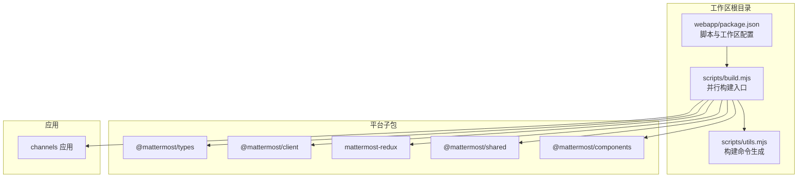
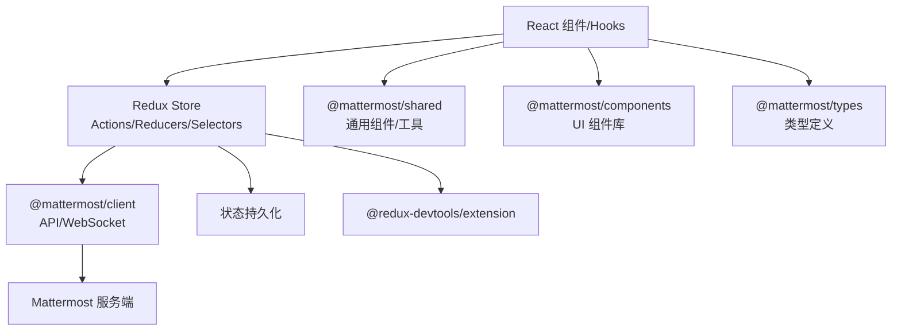
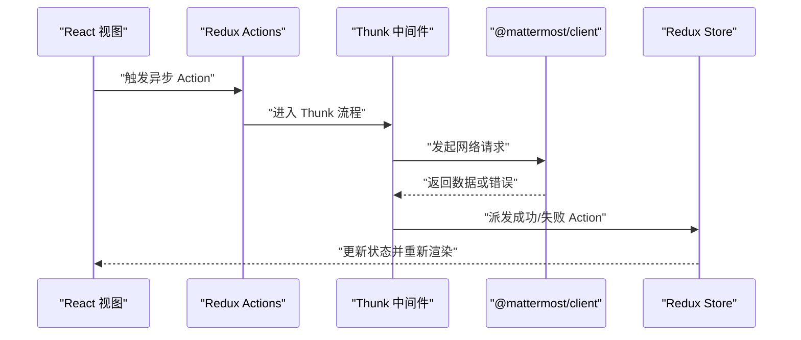
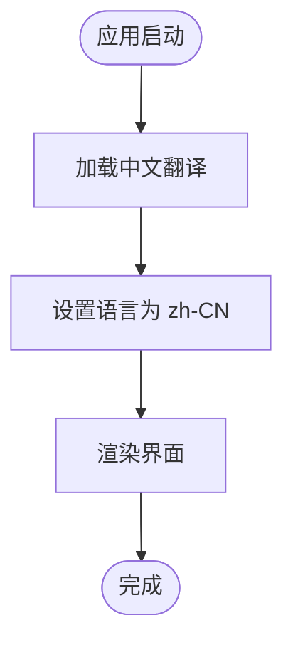
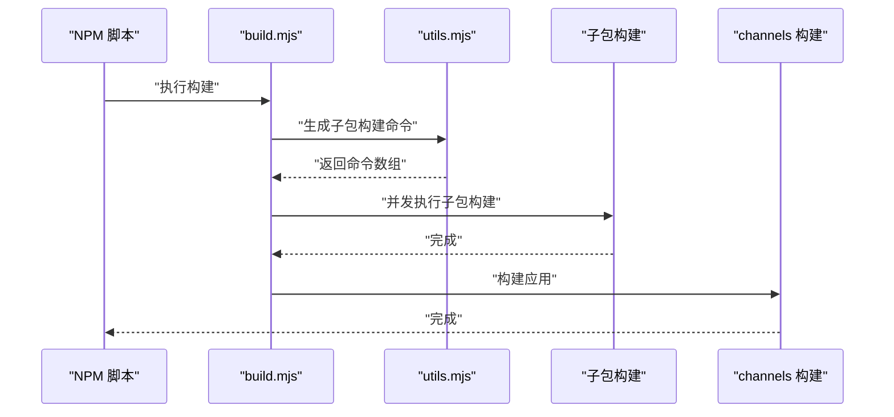
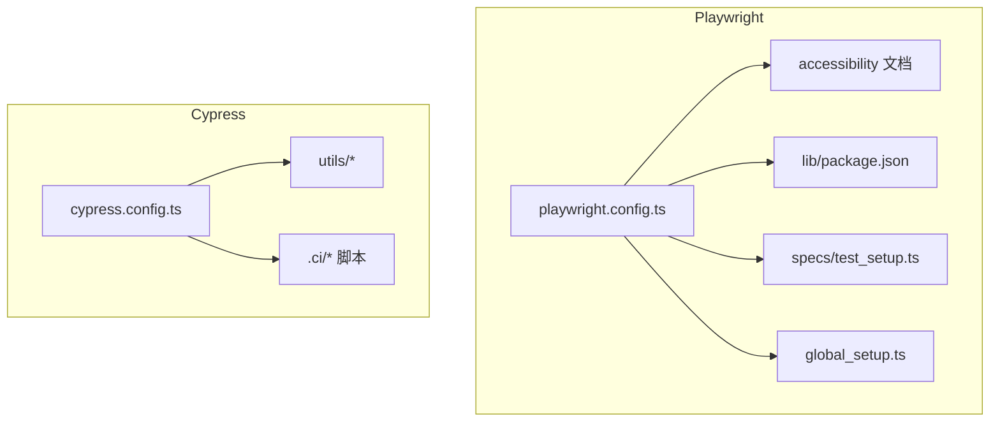
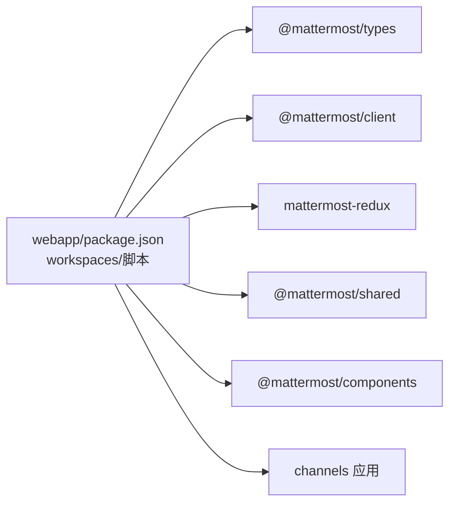

# 前端开发

<cite>
**本文引用的文件**
- [webapp/package.json](file://webapp/package.json)
- [webapp/scripts/build.mjs](file://webapp/scripts/build.mjs)
- [webapp/scripts/utils.mjs](file://webapp/scripts/utils.mjs)
- [webapp/channels/package.json](file://webapp/channels/package.json)
- [webapp/platform/client/package.json](file://webapp/platform/client/package.json)
- [webapp/platform/client/src/index.ts](file://webapp/platform/client/src/index.ts)
- [webapp/platform/mattermost-redux/package.json](file://webapp/platform/mattermost-redux/package.json)
- [webapp/platform/types/package.json](file://webapp/platform/types/package.json)
- [webapp/platform/shared/package.json](file://webapp/platform/shared/package.json)
- [webapp/platform/components/package.json](file://webapp/platform/components/package.json)
- [e2e-tests/cypress/cypress.config.ts](file://e2e-tests/cypress/cypress.config.ts)
- [e2e-tests/playwright/playwright.config.ts](file://e2e-tests/playwright/playwright.config.ts)
- [e2e-tests/playwright/lib/package.json](file://e2e-tests/playwright/lib/package.json)
- [e2e-tests/playwright/specs/test_setup.ts](file://e2e-tests/playwright/specs/test_setup.ts)
- [e2e-tests/playwright/global_setup.ts](file://e2e-tests/playwright/global_setup.ts)
- [e2e-tests/playwright/report.webhookgen.js](file://e2e-tests/playwright/report.webhookgen.js)
- [e2e-tests/playwright/merge.config.mjs](file://e2e-tests/playwright/merge.config.mjs)
- [e2e-tests/playwright/script/post_install.sh](file://e2e-tests/playwright/script/post_install.sh)
- [e2e-tests/playwright/script/lint-test-docs.js](file://e2e-tests/playwright/script/lint-test-docs.js)
- [e2e-tests/playwright/docs/accessibility/automated_scan_testing.md](file://e2e-tests/playwright/docs/accessibility/automated_scan_testing.md)
- [e2e-tests/playwright/docs/accessibility/index.md](file://e2e-tests/playwright/docs/accessibility/index.md)
- [e2e-tests/playwright/docs/accessibility/interaction_testing.md](file://e2e-tests/playwright/docs/accessibility/interaction_testing.md)
- [e2e-tests/playwright/asset/index.ts](file://e2e-tests/playwright/asset/index.ts)
- [e2e-tests/playwright/mock_libre_translate.js](file://e2e-tests/playwright/mock_libre_translate.js)
- [e2e-tests/playwright/.prettierrc.json](file://e2e-tests/playwright/.prettierrc.json)
- [e2e-tests/playwright/.prettierignore](file://e2e-tests/playwright/.prettierignore)
- [e2e-tests/playwright/.gitignore](file://e2e-tests/playwright/.gitignore)
- [e2e-tests/playwright/README.md](file://e2e-tests/playwright/README.md)
- [e2e-tests/cypress/README-Subpath.md](file://e2e-tests/cypress/README-Subpath.md)
- [e2e-tests/cypress/tsconfig.json](file://e2e-tests/cypress/tsconfig.json)
- [e2e-tests/cypress/eslint.config.mjs](file://e2e-tests/cypress/eslint.config.mjs)
- [e2e-tests/cypress/generate_test_cycle.js](file://e2e-tests/cypress/generate_test_cycle.js)
- [e2e-tests/cypress/run_test_cycle.js](file://e2e-tests/cypress/run_test_cycle.js)
- [e2e-tests/cypress/save_report.js](file://e2e-tests/cypress/save_report.js)
- [e2e-tests/cypress/utils/artifacts.js](file://e2e-tests/cypress/utils/artifacts.js)
- [e2e-tests/cypress/utils/constants.js](file://e2e-tests/cypress/utils/constants.js)
- [e2e-tests/cypress/utils/dashboard.js](file://e2e-tests/cypress/utils/dashboard.js)
- [e2e-tests/cypress/utils/even_distribution.js](file://e2e-tests/cypress/utils/even_distribution.js)
- [e2e-tests/cypress/utils/file.js](file://e2e-tests/cypress/utils/file.js)
- [e2e-tests/cypress/utils/report.js](file://e2e-tests/cypress/utils/report.js)
- [e2e-tests/cypress/utils/test_cases.js](file://e2e-tests/cypress/utils/test_cases.js)
- [e2e-tests/cypress/utils/webhook_utils.js](file://e2e-tests/cypress/utils/webhook_utils.js)
- [e2e-tests/cypress/.ci/server.run_cypress.sh](file://e2e-tests/cypress/.ci/server.run_cypress.sh)
- [e2e-tests/cypress/.ci/server.run_playwright.sh](file://e2e-tests/cypress/.ci/server.run_playwright.sh)
- [e2e-tests/cypress/.ci/server.run_specs.sh](file://e2e-tests/cypress/.ci/server.run_specs.sh)
- [e2e-tests/cypress/.ci/server.run_test.sh](file://e2e-tests/cypress/.ci/server.run_test.sh)
- [e2e-tests/cypress/.ci/server.start.sh](file://e2e-tests/cypress/.ci/server.start.sh)
- [e2e-tests/cypress/.ci/server.stop.sh](file://e2e-tests/cypress/.ci/server.stop.sh)
- [e2e-tests/cypress/.ci/dashboard.entrypoint.sh](file://e2e-tests/cypress/.ci/dashboard.entrypoint.sh)
- [e2e-tests/cypress/.ci/dashboard.generate_test_cycle.sh](file://e2e-tests/cypress/.ci/dashboard.generate_test_cycle.sh)
- [e2e-tests/cypress/.ci/dashboard.start.sh](file://e2e-tests/cypress/.ci/dashboard.start.sh)
- [e2e-tests/cypress/.ci/dashboard.stop.sh](file://e2e-tests/cypress/.ci/dashboard.stop.sh)
- [e2e-tests/cypress/.ci/report.collect.sh](file://e2e-tests/cypress/.ci/report.collect.sh)
- [e2e-tests/cypress/.ci/report.publish.sh](file://e2e-tests/cypress/.ci/report.publish.sh)
- [e2e-tests/cypress/.ci/server.cloud_init.sh](file://e2e-tests/cypress/.ci/server.cloud_init.sh)
- [e2e-tests/cypress/.ci/server.cloud_teardown.sh](file://e2e-tests/cypress/.ci/server.cloud_teardown.sh)
- [e2e-tests/cypress/.ci/server.prepare.sh](file://e2e-tests/cypress/.ci/server.prepare.sh)
- [e2e-tests/cypress/.ci/server.generate.sh](file://e2e-tests/cypress/.ci/server.generate.sh)
- [e2e-tests/cypress/.ci/dashboard.override.yml](file://e2e-tests/cypress/.ci/dashboard.override.yml)
- [webapp/channels/src/i18n/i18n.jsx](file://webapp/channels/src/i18n/i18n.jsx)
- [webapp/channels/src/i18n/i18n.test.jsx](file://webapp/channels/src/i18n/i18n.test.jsx)
- [webapp/channels/src/selectors/i18n.ts](file://webapp/channels/src/selectors/i18n.ts)
- [webapp/channels/src/reducers/views/i18n.ts](file://webapp/channels/src/reducers/views/i18n.ts)
- [webapp/channels/src/utils/i18n.tsx](file://webapp/channels/src/utils/i18n.tsx)
- [webapp/channels/src/components/intl_provider/intl_provider.tsx](file://webapp/channels/src/components/intl_provider/intl_provider.tsx)
- [webapp/channels/src/components/intl_provider/intl_provider.test.tsx](file://webapp/channels/src/components/intl_provider/intl_provider.test.tsx)
</cite>

## 更新摘要
**所做更改**
- 更新国际化部分以反映重大变更：国际化已简化为仅支持中文（zh-CN），移除了多语言组件和测试
- 移除多语言切换和语言检测相关的内容
- 更新国际化架构图为单一语言支持模式
- 删除与多语言相关的测试和配置说明

## 目录
1. [简介](#简介)
2. [项目结构](#项目结构)
3. [核心组件](#核心组件)
4. [架构总览](#架构总览)
5. [详细组件分析](#详细组件分析)
6. [依赖关系分析](#依赖关系分析)
7. [性能考量](#性能考量)
8. [故障排查指南](#故障排查指南)
9. [结论](#结论)
10. [附录](#附录)

## 简介
本指南面向 Mattermost 前端开发者，聚焦 React 应用架构与工程化实践，涵盖组件层次、状态管理、路由、TypeScript 类型体系、样式系统、国际化、构建工具、测试策略等。仓库采用多包工作区（monorepo）组织，核心由 webapp 平台子包与 channels 应用组成，并通过统一脚本进行并行构建与开发。

**更新** 国际化部分已简化为仅支持中文（zh-CN），移除了多语言切换和相关组件。

## 项目结构
- 工作区与脚手架
  - 根级 webapp 包含统一的构建与开发脚本，负责协调平台各子包的构建顺序与并发执行。
  - channels 应用作为前端入口，承载页面路由、业务组件与页面逻辑。
  - platform 下包含 client、mattermost-redux、types、shared、components 等共享模块，形成"客户端 SDK + Redux 公共逻辑 + 类型 + 组件库 + 共享工具"的分层。
- 多包并行构建
  - 构建脚本通过并发执行多个子包构建命令，保证开发效率与一致性输出。
- 测试生态
  - E2E 测试同时支持 Cypress 与 Playwright，覆盖功能、可访问性与视觉回归等维度。

**图示来源**
- [webapp/package.json:1-119](file://webapp/package.json#L1-L119)
- [webapp/scripts/build.mjs:1-49](file://webapp/scripts/build.mjs#L1-L49)
- [webapp/scripts/utils.mjs](file://webapp/scripts/utils.mjs)

**章节来源**
- [webapp/package.json:1-119](file://webapp/package.json#L1-L119)
- [webapp/scripts/build.mjs:1-49](file://webapp/scripts/build.mjs#L1-L49)

## 核心组件
- 客户端 SDK（@mattermost/client）
  - 提供 Mattermost 服务端 API 的 TypeScript 客户端封装，导出 Client4、WebSocketClient、事件常量与类型声明，便于在应用与 Redux 中统一调用后端接口。
- Redux 生态（mattermost-redux）
  - 暴露 action_types、actions、reducers、selectors、store 等模块化结构，配合 Redux 与 redux-thunk 处理异步与状态持久化。
- 类型体系（@mattermost/types）
  - 为应用与插件提供共享的 TypeScript 类型定义，确保跨包类型一致性。
- 组件与共享（@mattermost/shared、@mattermost/components）
  - @mattermost/shared 提供通用组件与工具；@mattermost/components 基于 styled-components 提供可复用 UI 组件与样式。
- 应用入口（channels）
  - 承载页面路由、业务组件与页面逻辑，是前端交互的主战场。

**章节来源**
- [webapp/platform/client/src/index.ts:1-17](file://webapp/platform/client/src/index.ts#L1-L17)
- [webapp/platform/client/package.json:1-47](file://webapp/platform/client/package.json#L1-L47)
- [webapp/platform/mattermost-redux/package.json:1-68](file://webapp/platform/mattermost-redux/package.json#L1-L68)
- [webapp/platform/types/package.json:1-48](file://webapp/platform/types/package.json#L1-L48)
- [webapp/platform/shared/package.json:1-116](file://webapp/platform/shared/package.json#L1-L116)
- [webapp/platform/components/package.json:1-57](file://webapp/platform/components/package.json#L1-L57)

## 架构总览
- 分层架构
  - 表现层：React 组件与 hooks，负责视图渲染与用户交互。
  - 业务层：Redux actions/reducers/selectors，封装业务规则与状态流转。
  - 数据层：@mattermost/client 封装 API 调用，WebSocket 连接与消息广播。
  - 共享层：@mattermost/types、@mattermost/shared、@mattermost/components 提供类型、通用工具与 UI 组件。
- 状态管理与异步
  - Redux 为核心状态容器，结合 redux-thunk 处理副作用；persist 机制用于本地存储；DevTools 扩展辅助调试。
- 国际化
  - **已简化** 仅支持中文（zh-CN），移除了多语言切换和语言检测功能。
- 样式系统
  - styled-components 作为 CSS-in-JS 方案，结合主题与响应式设计，满足复杂 UI 场景。
- 构建与测试
  - 多包并行构建，Webpack/Babel/Parcel 等工具链协同；E2E 测试覆盖功能与可访问性。

**图示来源**
- [webapp/platform/client/src/index.ts:1-17](file://webapp/platform/client/src/index.ts#L1-L17)
- [webapp/platform/mattermost-redux/package.json:1-68](file://webapp/platform/mattermost-redux/package.json#L1-L68)
- [webapp/platform/shared/package.json:1-116](file://webapp/platform/shared/package.json#L1-L116)
- [webapp/platform/components/package.json:1-57](file://webapp/platform/components/package.json#L1-L57)
- [webapp/platform/types/package.json:1-48](file://webapp/platform/types/package.json#L1-L48)

## 详细组件分析

### React 应用与路由
- 页面与路由
  - channels 应用承载页面路由与业务组件，建议采用按需加载与代码分割策略，提升首屏性能。
- 函数组件与 Hooks
  - 使用 React Hooks 管理本地状态与副作用；合理拆分自定义 Hook，提升复用与可测性。
- 性能优化
  - 使用 memo、useMemo、useCallback 降低重渲染；对长列表使用虚拟化；图片与资源懒加载。

### TypeScript 类型体系
- 类型定义
  - @mattermost/types 提供统一的实体与 API 返回类型，确保前后端契约一致。
- 泛型与工具类型
  - 在 Redux selectors 与 API 客户端中广泛使用泛型，增强类型安全与自动补全体验。
- 类型检查与构建
  - 各子包均配置独立的 tsconfig 与类型检查脚本，保证类型安全贯穿开发周期。

**章节来源**
- [webapp/platform/types/package.json:1-48](file://webapp/platform/types/package.json#L1-L48)

### 状态管理（Redux 集成）
- 模块化结构
  - action_types、actions、reducers、selectors、store 按职责划分，便于维护与扩展。
- 异步处理
  - 结合 redux-thunk 处理副作用；对网络请求进行统一错误处理与重试策略。
- 状态持久化
  - 使用 redux-persist 将关键状态写入本地存储，提升用户体验。
- 调试与可观测性
  - @redux-devtools/extension 提供时间旅行调试能力。

**图示来源**
- [webapp/platform/mattermost-redux/package.json:1-68](file://webapp/platform/mattermost-redux/package.json#L1-L68)
- [webapp/platform/client/src/index.ts:1-17](file://webapp/platform/client/src/index.ts#L1-L17)

**章节来源**
- [webapp/platform/mattermost-redux/package.json:1-68](file://webapp/platform/mattermost-redux/package.json#L1-L68)

### 样式系统与主题定制
- CSS-in-JS
  - @mattermost/components 与 @mattermost/shared 基于 styled-components，提供一致的主题变量与样式规范。
- 主题与响应式
  - 通过主题 Provider 注入全局样式变量，结合媒体查询实现响应式布局。
- 可访问性
  - 组件遵循 WCAG 指标，提供语义化标签与键盘导航支持。

**章节来源**
- [webapp/platform/components/package.json:1-57](file://webapp/platform/components/package.json#L1-L57)
- [webapp/platform/shared/package.json:1-116](file://webapp/platform/shared/package.json#L1-L116)

### 国际化（i18n）
**已简化** 国际化功能已简化为仅支持中文（zh-CN），移除了多语言切换和相关组件。

- 单一语言支持
  - 系统固定使用中文（zh-CN）作为唯一支持的语言，所有语言检测和切换功能已被移除。
- 语言配置
  - 语言列表仅包含中文（zh-CN），语言标准化函数始终返回 'zh-CN'。
- 翻译加载
  - 国际化提供程序固定加载中文翻译文件，无需根据用户偏好动态切换。
- 选择器简化
  - 获取当前语言和翻译的函数都直接返回中文配置，移除了语言参数处理。

**图示来源**
- [webapp/channels/src/i18n/i18n.jsx:12-25](file://webapp/channels/src/i18n/i18n.jsx#L12-L25)
- [webapp/channels/src/selectors/i18n.ts:7-14](file://webapp/channels/src/selectors/i18n.ts#L7-L14)

**章节来源**
- [webapp/channels/src/i18n/i18n.jsx:12-25](file://webapp/channels/src/i18n/i18n.jsx#L12-L25)
- [webapp/channels/src/i18n/i18n.test.jsx:48-53](file://webapp/channels/src/i18n/i18n.test.jsx#L48-L53)
- [webapp/channels/src/selectors/i18n.ts:7-14](file://webapp/channels/src/selectors/i18n.ts#L7-L14)
- [webapp/channels/src/reducers/views/i18n.ts](file://webapp/channels/src/reducers/views/i18n.ts)
- [webapp/channels/src/utils/i18n.tsx](file://webapp/channels/src/utils/i18n.tsx)
- [webapp/channels/src/components/intl_provider/intl_provider.tsx:52-70](file://webapp/channels/src/components/intl_provider/intl_provider.tsx#L52-L70)

### 构建工具与代码分割
- 并行构建
  - scripts/build.mjs 通过 concurrently 并发执行平台子包构建，最后再构建 channels 应用，保证一致性与速度。
- 代码分割
  - 建议在路由层面进行动态导入，减少首屏体积；对第三方库进行单独分包。
- 生产优化
  - 启用压缩、Tree Shaking、Source Map 与缓存策略，提升加载性能与调试体验。

**图示来源**
- [webapp/scripts/build.mjs:1-49](file://webapp/scripts/build.mjs#L1-L49)
- [webapp/scripts/utils.mjs](file://webapp/scripts/utils.mjs)

**章节来源**
- [webapp/scripts/build.mjs:1-49](file://webapp/scripts/build.mjs#L1-L49)

### 测试策略
- 单元测试
  - 各子包使用 Jest，建议针对纯函数、Selector 与工具方法编写高覆盖率测试。
- 集成测试
  - 针对组件行为与交互进行快照与 DOM 断言，确保变更不破坏既有功能。
- 端到端测试
  - Cypress 与 Playwright 并行推进：
    - Playwright 支持自动化扫描与交互测试，提供可访问性文档与配置示例。
    - Cypress 提供丰富的测试工具集与报告收集脚本，支持 CI 环境下的分布式执行。

**图示来源**
- [e2e-tests/playwright/playwright.config.ts](file://e2e-tests/playwright/playwright.config.ts)
- [e2e-tests/playwright/docs/accessibility/index.md](file://e2e-tests/playwright/docs/accessibility/index.md)
- [e2e-tests/playwright/lib/package.json](file://e2e-tests/playwright/lib/package.json)
- [e2e-tests/playwright/specs/test_setup.ts](file://e2e-tests/playwright/specs/test_setup.ts)
- [e2e-tests/playwright/global_setup.ts](file://e2e-tests/playwright/global_setup.ts)
- [e2e-tests/cypress/cypress.config.ts](file://e2e-tests/cypress/cypress.config.ts)
- [e2e-tests/cypress/utils/artifacts.js](file://e2e-tests/cypress/utils/artifacts.js)
- [e2e-tests/cypress/utils/constants.js](file://e2e-tests/cypress/utils/constants.js)
- [e2e-tests/cypress/utils/dashboard.js](file://e2e-tests/cypress/utils/dashboard.js)
- [e2e-tests/cypress/utils/even_distribution.js](file://e2e-tests/cypress/utils/even_distribution.js)
- [e2e-tests/cypress/utils/file.js](file://e2e-tests/cypress/utils/file.js)
- [e2e-tests/cypress/utils/report.js](file://e2e-tests/cypress/utils/report.js)
- [e2e-tests/cypress/utils/test_cases.js](file://e2e-tests/cypress/utils/test_cases.js)
- [e2e-tests/cypress/utils/webhook_utils.js](file://e2e-tests/cypress/utils/webhook_utils.js)
- [e2e-tests/cypress/.ci/server.run_cypress.sh](file://e2e-tests/cypress/.ci/server.run_cypress.sh)
- [e2e-tests/cypress/.ci/server.run_playwright.sh](file://e2e-tests/cypress/.ci/server.run_playwright.sh)
- [e2e-tests/cypress/.ci/server.run_specs.sh](file://e2e-tests/cypress/.ci/server.run_specs.sh)
- [e2e-tests/cypress/.ci/server.run_test.sh](file://e2e-tests/cypress/.ci/server.run_test.sh)
- [e2e-tests/cypress/.ci/server.start.sh](file://e2e-tests/cypress/.ci/server.start.sh)
- [e2e-tests/cypress/.ci/server.stop.sh](file://e2e-tests/cypress/.ci/server.stop.sh)
- [e2e-tests/cypress/.ci/dashboard.entrypoint.sh](file://e2e-tests/cypress/.ci/dashboard.entrypoint.sh)
- [e2e-tests/cypress/.ci/dashboard.generate_test_cycle.sh](file://e2e-tests/cypress/.ci/dashboard.generate_test_cycle.sh)
- [e2e-tests/cypress/.ci/dashboard.start.sh](file://e2e-tests/cypress/.ci/dashboard.start.sh)
- [e2e-tests/cypress/.ci/dashboard.stop.sh](file://e2e-tests/cypress/.ci/dashboard.stop.sh)
- [e2e-tests/cypress/.ci/report.collect.sh](file://e2e-tests/cypress/.ci/report.collect.sh)
- [e2e-tests/cypress/.ci/report.publish.sh](file://e2e-tests/cypress/.ci/report.publish.sh)
- [e2e-tests/cypress/.ci/server.cloud_init.sh](file://e2e-tests/cypress/.ci/server.cloud_init.sh)
- [e2e-tests/cypress/.ci/server.cloud_teardown.sh](file://e2e-tests/cypress/.ci/server.cloud_teardown.sh)
- [e2e-tests/cypress/.ci/server.prepare.sh](file://e2e-tests/cypress/.ci/server.prepare.sh)
- [e2e-tests/cypress/.ci/server.generate.sh](file://e2e-tests/cypress/.ci/server.generate.sh)
- [e2e-tests/cypress/.ci/dashboard.override.yml](file://e2e-tests/cypress/.ci/dashboard.override.yml)

**章节来源**
- [e2e-tests/playwright/README.md](file://e2e-tests/playwright/README.md)
- [e2e-tests/cypress/README-Subpath.md](file://e2e-tests/cypress/README-Subpath.md)

## 依赖关系分析
- 子包导出与版本
  - 各子包通过 exports/exports.* 字段声明入口与类型映射，确保打包器与 IDE 正确解析。
- peerDependencies 与 overrides
  - 通过 peerDependencies 约束 React、React Intl、TypeScript 等关键依赖版本；overrides 统一解决依赖树中的冲突版本。
- 工作区与脚本
  - workspaces 字段声明子包集合；脚本统一调度构建、测试与类型检查任务。

**图示来源**
- [webapp/package.json:109-119](file://webapp/package.json#L109-L119)

**章节来源**
- [webapp/package.json:109-119](file://webapp/package.json#L109-L119)

## 性能考量
- 构建期优化
  - 并行构建减少等待时间；按需加载与代码分割降低首屏体积。
- 运行期优化
  - 合理使用 React.memo/useMemo/useCallback；对长列表与图片资源进行懒加载；利用浏览器缓存与 CDN。
- 状态与网络
  - 对 Redux 状态进行裁剪与序列化；对网络请求设置超时与重试；统一错误处理与降级策略。

## 故障排查指南
- 构建失败
  - 查看 build.mjs 输出日志，确认子包构建是否全部成功；检查 Node/NPM 版本与缓存清理。
- 类型错误
  - 在对应子包执行类型检查脚本，定位具体类型问题；确保 @mattermost/types 与 peerDependencies 版本匹配。
- 测试异常
  - Playwright/Cypress 均提供 CI 脚本与报告收集工具，优先检查环境变量与依赖安装；查看报告与日志定位失败用例。
- 国际化问题
  - **已简化** 如遇国际化相关问题，检查中文翻译文件是否正确加载，确认语言标准化函数返回 'zh-CN'。

**章节来源**
- [webapp/scripts/build.mjs:1-49](file://webapp/scripts/build.mjs#L1-L49)
- [e2e-tests/playwright/report.webhookgen.js](file://e2e-tests/playwright/report.webhookgen.js)
- [e2e-tests/cypress/save_report.js](file://e2e-tests/cypress/save_report.js)
- [webapp/channels/src/i18n/i18n.jsx:22-25](file://webapp/channels/src/i18n/i18n.jsx#L22-L25)

## 结论
本指南从架构、类型、状态、样式、国际化、构建与测试七个维度总结了 Mattermost 前端工程化实践。**更新** 国际化部分已简化为仅支持中文，移除了多语言切换功能。建议在实际开发中坚持模块化与类型安全，善用 Redux 与 styled-components，配合完善的测试与构建流程，持续提升可维护性与用户体验。

## 附录
- 关键脚本与配置
  - 构建：npm run build、npm run dev-server
  - 测试：npm run test、npm run test-ci
  - 类型：npm run check-types
  - 国际化：**已简化** 仅支持中文（npm run i18n-extract、npm run i18n-extract:check）
- E2E 工具链
  - Playwright：配置、文档与全局设置位于 e2e-tests/playwright 目录
  - Cypress：配置与工具脚本位于 e2e-tests/cypress 目录