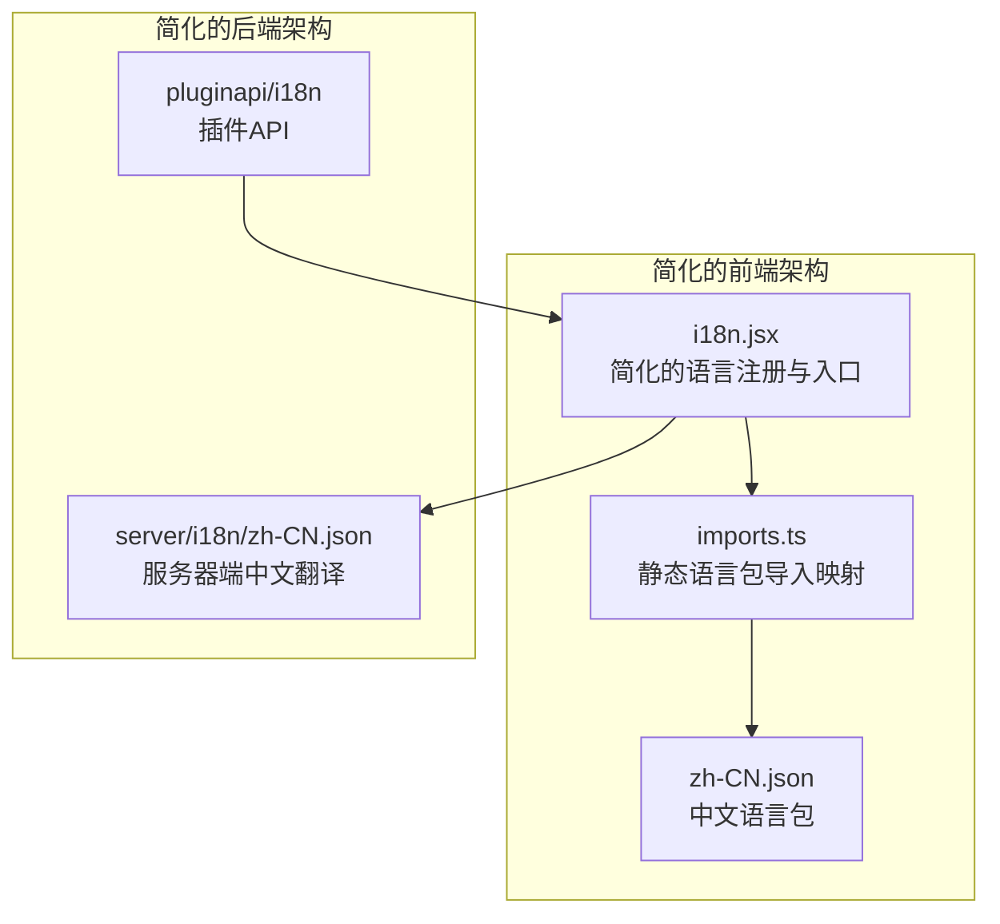
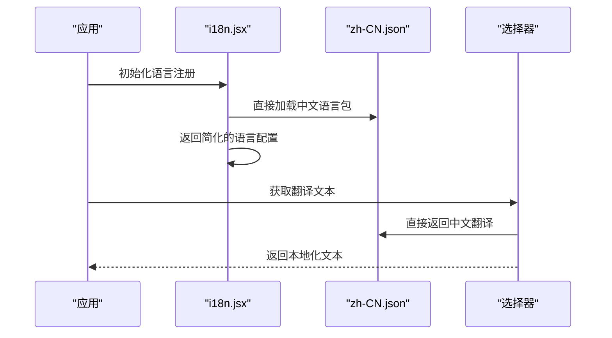
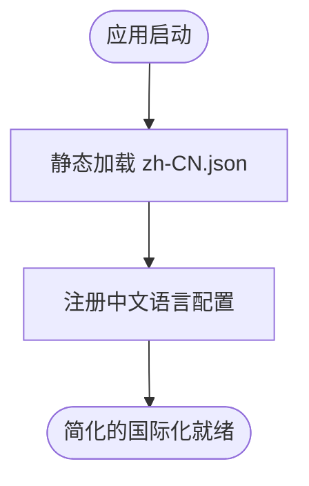
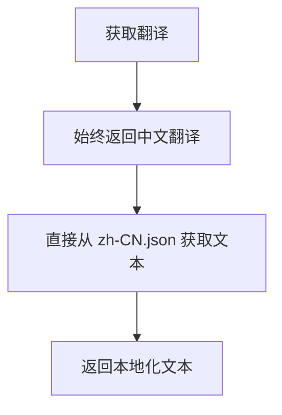
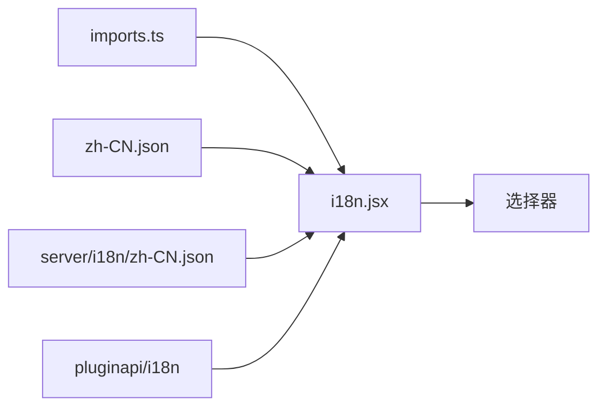

# 国际化支持

<cite>
**本文引用的文件**
- [server/i18n/zh-CN.json](file://server/i18n/zh-CN.json)
- [webapp/channels/src/i18n/i18n.jsx](file://webapp/channels/src/i18n/i18n.jsx)
- [webapp/channels/src/i18n/imports.ts](file://webapp/channels/src/i18n/imports.ts)
- [webapp/channels/src/i18n/zh-CN.json](file://webapp/channels/src/i18n/zh-CN.json)
- [server/public/pluginapi/i18n/doc.go](file://server/public/pluginapi/i18n/doc.go)
- [server/public/pluginapi/i18n/i18n.go](file://server/public/pluginapi/i18n/i18n.go)
- [webapp/channels/src/selectors/entities/i18n.ts](file://webapp/channels/src/selectors/entities/i18n.ts)
- [webapp/channels/src/utils/i18n_utils.ts](file://webapp/channels/src/utils/i18n_utils.ts)
- [e2e-tests/cypress/tests/fixtures/date_time_format.js](file://e2e-tests/cypress/tests/fixtures/date_time_format.js)
</cite>

## 更新摘要
**所做更改**
- 更新了国际化架构以反映重大简化：从支持50+种语言简化为仅支持中文(zh-CN)
- 移除了语言管理UI和大量语言文件的相关内容
- 简化了语言注册、动态加载和选择器逻辑
- 更新了翻译工作流程和质量保证机制
- 移除了RTL语言支持和多语言复杂性的相关内容

## 目录
1. 引言
2. 项目结构
3. 核心组件
4. 架构总览
5. 组件详解
6. 依赖关系分析
7. 性能考量
8. 故障排查指南
9. 结论
10. 附录

## 引言
本指南面向 Mattermost 的国际化（i18n）实现，系统性阐述前端多语言系统的设计与落地。经过重大简化，系统现已专注于中文（zh-CN）单一语言支持，移除了原有的50+种语言支持和复杂的语言管理机制。文档涵盖简化的语言包组织、静态加载机制、文本提取流程、语言切换与状态管理、日期/时间/数字本地化处理，以及翻译工作流程与最佳实践。

## 项目结构
经过简化，Mattermost 的国际化现在采用极简架构：仅包含中文（zh-CN）语言包，所有国际化逻辑都围绕这一单一语言展开。前端和后端都进行了大幅简化，移除了语言管理UI、动态加载机制和多语言支持。

**图表来源**
- [webapp/channels/src/i18n/i18n.jsx:12-25](file://webapp/channels/src/i18n/i18n.jsx#L12-L25)
- [webapp/channels/src/i18n/imports.ts:8-18](file://webapp/channels/src/i18n/imports.ts#L8-L18)
- [server/i18n/zh-CN.json:1-50](file://server/i18n/zh-CN.json#L1-L50)

## 核心组件
- **简化的语言包导入映射**：现在仅包含中文（zh-CN）语言ID，移除了原有的多语言映射机制
- **静态语言注册入口**：直接返回中文配置，不再需要动态语言检测和加载
- **单一语言选择器**：始终返回中文翻译集，移除了语言回退逻辑
- **服务器端简化的翻译支持**：仅提供中文翻译文件，移除了多语言服务器端逻辑

**章节来源**
- [webapp/channels/src/i18n/i18n.jsx:12-25](file://webapp/channels/src/i18n/i18n.jsx#L12-L25)
- [webapp/channels/src/i18n/imports.ts:8-18](file://webapp/channels/src/i18n/imports.ts#L8-L18)
- [server/i18n/zh-CN.json:1-50](file://server/i18n/zh-CN.json#L1-L50)

## 架构总览
简化的国际化架构采用静态加载模式，所有语言包在构建时就已确定，运行时无需进行语言检测或动态加载。

**图表来源**
- [webapp/channels/src/i18n/i18n.jsx:12-25](file://webapp/channels/src/i18n/i18n.jsx#L12-L25)
- [webapp/channels/src/i18n/imports.ts:8-18](file://webapp/channels/src/i18n/imports.ts#L8-L18)

## 组件详解

### 简化的语言包组织与静态加载
- **单一语言包**：现在仅维护中文（zh-CN）语言包，移除了原有的多语言文件结构
- **静态导入映射**：语言ID、标签和文件路径都在构建时确定，无需运行时动态加载
- **简化的语言注册**：直接返回中文配置，移除了语言检测和回退逻辑

**图表来源**
- [webapp/channels/src/i18n/i18n.jsx:12-25](file://webapp/channels/src/i18n/i18n.jsx#L12-L25)
- [webapp/channels/src/i18n/imports.ts:8-18](file://webapp/channels/src/i18n/imports.ts#L8-L18)

**章节来源**
- [webapp/channels/src/i18n/i18n.jsx:12-25](file://webapp/channels/src/i18n/i18n.jsx#L12-L25)
- [webapp/channels/src/i18n/imports.ts:8-18](file://webapp/channels/src/i18n/imports.ts#L8-L18)

### 文本提取流程与翻译键值生成
- **简化的提取流程**：由于仅支持中文，文本提取流程大大简化
- **键值生成**：保持原有的键值生成规范，但现在只需维护单一语言的键值对
- **构建时验证**：在构建过程中验证中文翻译文件的完整性

（本节为通用流程说明，不直接分析具体文件）

### 简化的语言切换与状态管理
- **固定的中文支持**：系统始终使用中文，无需语言切换
- **简化的状态管理**：移除了语言状态管理和回退逻辑
- **静态翻译选择**：所有翻译都直接从中文语言包获取

**图表来源**
- [webapp/channels/src/i18n/i18n.jsx:35-41](file://webapp/channels/src/i18n/i18n.jsx#L35-L41)

**章节来源**
- [webapp/channels/src/i18n/i18n.jsx:35-41](file://webapp/channels/src/i18n/i18n.jsx#L35-L41)

### 日期、时间和数字格式化本地化
- **简化的格式化**：由于仅支持中文，日期和时间格式化逻辑大大简化
- **测试夹具**：保留了原有的时间格式测试夹具，但仅针对中文环境
- **浏览器API**：建议在视图层使用浏览器 Intl API 进行本地化格式化

**章节来源**
- [e2e-tests/cypress/tests/fixtures/date_time_format.js:1-7](file://e2e-tests/cypress/tests/fixtures/date_time_format.js#L1-L7)

### RTL（从右到左）语言支持机制
- **移除RTL支持**：由于仅支持中文，不再需要RTL语言支持机制
- **简化的布局**：所有界面布局都基于LTR（从左到右）设计

（本节为概念性说明，不直接分析具体文件）

### 简化的翻译工作流程与质量保证
- **单一语言维护**：现在只需维护中文翻译文件，大大简化了翻译工作流程
- **质量保证**：建立自动化检查（如缺失键值检测）、本地化回归测试
- **版本管理**：由于语言包数量减少，版本管理和回退逻辑也得到简化

**章节来源**
- [webapp/channels/src/i18n/zh-CN.json:1-50](file://webapp/channels/src/i18n/zh-CN.json#L1-L50)

### 实际开发示例：为新功能添加中文支持
- **步骤一**：在前端组件中使用简化的翻译函数调用
- **步骤二**：在 zh-CN.json 中添加新的翻译键值对
- **步骤三**：验证翻译文件的完整性和正确性
- **步骤四**：编写或更新测试，验证中文显示效果

（本节为通用流程说明，不直接分析具体文件）

## 依赖关系分析
简化的国际化架构移除了复杂的依赖关系，现在主要依赖单一的中文语言包。

**图表来源**
- [webapp/channels/src/i18n/imports.ts:8-18](file://webapp/channels/src/i18n/imports.ts#L8-L18)
- [webapp/channels/src/i18n/i18n.jsx:12-25](file://webapp/channels/src/i18n/i18n.jsx#L12-L25)

**章节来源**
- [webapp/channels/src/i18n/imports.ts:8-18](file://webapp/channels/src/i18n/imports.ts#L8-L18)
- [webapp/channels/src/i18n/i18n.jsx:12-25](file://webapp/channels/src/i18n/i18n.jsx#L12-L25)

## 性能考量
- **静态加载优势**：由于语言包在构建时就已确定，运行时性能得到显著提升
- **内存优化**：移除了动态加载机制，减少了内存占用
- **缓存策略**：中文语言包可以更好地利用浏览器缓存
- **构建优化**：简化的国际化逻辑使得构建过程更加高效

（本节为通用指导，不直接分析具体文件）

## 故障排查指南
- **翻译缺失**：检查 zh-CN.json 中是否存在相应的键值对
- **构建错误**：验证翻译文件的JSON格式是否正确
- **运行时错误**：确认语言包是否正确导入和注册
- **插件兼容性**：检查插件API的国际化支持是否正常工作

**章节来源**
- [webapp/channels/src/i18n/zh-CN.json:1-50](file://webapp/channels/src/i18n/zh-CN.json#L1-L50)

## 结论
经过重大简化，Mattermost 的国际化体系现在专注于中文（zh-CN）单一语言支持。这种简化的架构不仅降低了维护成本，还提升了系统性能和可靠性。通过移除复杂的多语言管理机制，开发者可以更专注于中文本地化的质量和用户体验。建议在新功能开发中遵循简化的翻译流程，确保中文翻译的准确性和一致性。

## 附录
- **简化后的参考文件路径与职责概览**：
  - 简化的语言导入映射：仅包含中文（zh-CN）语言ID和文件路径
  - 简化的语言注册入口：直接返回中文语言配置
  - 静态翻译选择器：始终返回中文翻译集
  - 服务器端简化的翻译支持：仅提供中文翻译文件
  - 插件API国际化：保持原有的插件国际化支持

**章节来源**
- [webapp/channels/src/i18n/imports.ts:8-18](file://webapp/channels/src/i18n/imports.ts#L8-L18)
- [webapp/channels/src/i18n/i18n.jsx:12-25](file://webapp/channels/src/i18n/i18n.jsx#L12-L25)
- [server/i18n/zh-CN.json:1-50](file://server/i18n/zh-CN.json#L1-L50)