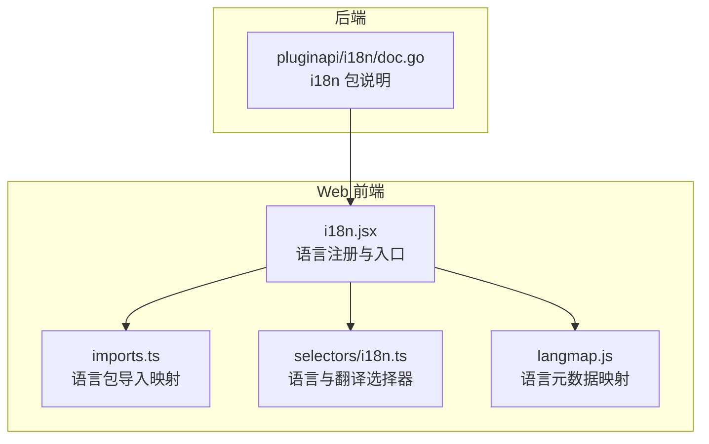
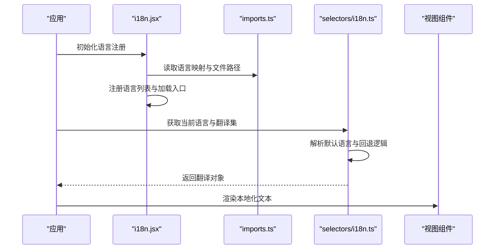
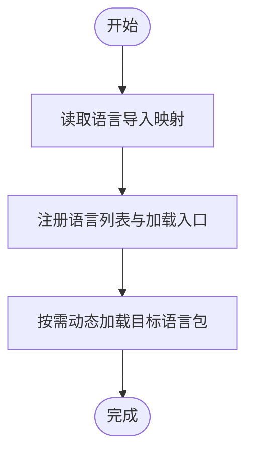
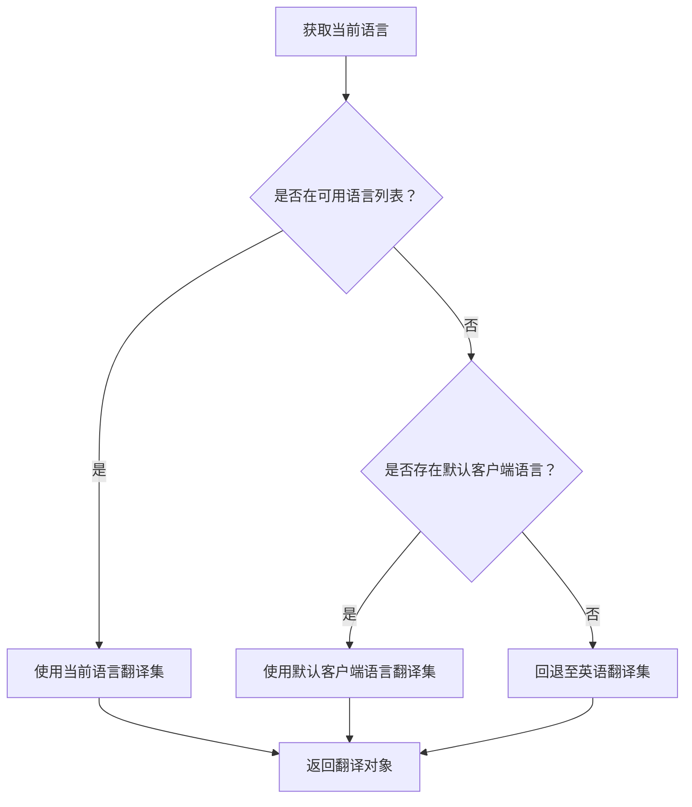
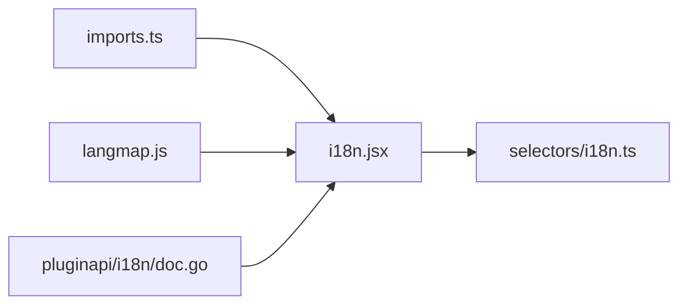

# 国际化支持

<cite>
**本文引用的文件**
- [webapp/i18n/imports.ts](file://webapp/channels/src/i18n/imports.ts)
- [webapp/i18n/i18n.jsx](file://webapp/channels/src/i18n/i18n.jsx)
- [webapp/selectors/i18n.ts](file://webapp/channels/src/selectors/i18n.ts)
- [webapp/i18n/langmap.js](file://webapp/channels/src/i18n/langmap.js)
- [server/public/pluginapi/i18n/doc.go](file://server/public/pluginapi/i18n/doc.go)
- [e2e-tests/cypress/tests/fixtures/date_time_format.js](file://e2e-tests/cypress/tests/fixtures/date_time_format.js)
</cite>

## 目录
1. 引言
2. 项目结构
3. 核心组件
4. 架构总览
5. 组件详解
6. 依赖关系分析
7. 性能考量
8. 故障排查指南
9. 结论
10. 附录

## 引言
本指南面向 Mattermost 的国际化（i18n）实现，系统性阐述前端多语言系统的设计与落地，包括语言包组织、动态加载机制、文本提取流程、语言切换与状态管理、日期/时间/数字本地化处理、RTL 支持策略，以及翻译工作流程与最佳实践。文档同时提供可操作的开发示例，帮助为新功能快速添加多语言支持。

## 项目结构
Mattermost 的国际化主要集中在 Web 前端（webapp），后端通过插件 API 提供翻译能力。前端采用按需导入的语言包与选择器组合，形成“语言包 + 选择器 + 视图”的解耦架构；后端插件 API 则提供读取翻译文件与本地化字符串的能力。

图表来源
- [webapp/i18n/i18n.jsx:57-123](file://webapp/channels/src/i18n/i18n.jsx#L57-L123)
- [webapp/i18n/imports.ts:43-76](file://webapp/channels/src/i18n/imports.ts#L43-L76)
- [webapp/selectors/i18n.ts:23-47](file://webapp/channels/src/selectors/i18n.ts#L23-L47)
- [webapp/i18n/langmap.js:1-415](file://webapp/channels/src/i18n/langmap.js#L1-L415)
- [server/public/pluginapi/i18n/doc.go:1-2](file://server/public/pluginapi/i18n/doc.go#L1-L2)

章节来源
- [webapp/i18n/imports.ts:43-76](file://webapp/channels/src/i18n/imports.ts#L43-L76)
- [webapp/i18n/i18n.jsx:57-123](file://webapp/channels/src/i18n/i18n.jsx#L57-L123)
- [webapp/selectors/i18n.ts:23-47](file://webapp/channels/src/selectors/i18n.ts#L23-L47)
- [webapp/i18n/langmap.js:1-415](file://webapp/channels/src/i18n/langmap.js#L1-L415)
- [server/public/pluginapi/i18n/doc.go:1-2](file://server/public/pluginapi/i18n/doc.go#L1-L2)

## 核心组件
- 语言包导入映射：集中声明可用语言 ID 与对应 JSON 文件路径，便于构建期聚合与运行时按需加载。
- 语言注册入口：在应用初始化阶段注册语言列表、排序与加载入口，驱动动态加载。
- 翻译选择器：根据当前语言与默认语言，解析并返回可用翻译集，确保回退至英语。
- 语言元数据映射：提供语言的本地名称与英文名称等元信息，用于 UI 展示。
- 插件 API i18n：后端插件侧提供读取翻译文件与本地化字符串的方法，支撑插件生态的本地化。

章节来源
- [webapp/i18n/imports.ts:43-76](file://webapp/channels/src/i18n/imports.ts#L43-L76)
- [webapp/i18n/i18n.jsx:57-123](file://webapp/channels/src/i18n/i18n.jsx#L57-L123)
- [webapp/selectors/i18n.ts:23-47](file://webapp/channels/src/selectors/i18n.ts#L23-L47)
- [webapp/i18n/langmap.js:1-415](file://webapp/channels/src/i18n/langmap.js#L1-L415)
- [server/public/pluginapi/i18n/doc.go:1-2](file://server/public/pluginapi/i18n/doc.go#L1-L2)

## 架构总览
前端国际化由“语言注册 → 动态加载 → 选择器解析 → 视图渲染”构成闭环；后端插件 API 作为补充，提供统一的翻译读取能力。

图表来源
- [webapp/i18n/i18n.jsx:57-123](file://webapp/channels/src/i18n/i18n.jsx#L57-L123)
- [webapp/i18n/imports.ts:43-76](file://webapp/channels/src/i18n/imports.ts#L43-L76)
- [webapp/selectors/i18n.ts:23-47](file://webapp/channels/src/selectors/i18n.ts#L23-L47)

## 组件详解

### 语言包组织与动态加载
- 语言包以 JSON 文件形式存在，每个语言一个文件，文件名即语言 ID（如 zh-CN.json、ar.json）。
- 导入映射集中声明所有语言 ID 与对应模块导入，便于构建期聚合与按需加载。
- 语言注册入口负责将语言 ID、显示名称、加载入口与排序规则注入全局配置，驱动后续动态加载。

图表来源
- [webapp/i18n/imports.ts:43-76](file://webapp/channels/src/i18n/imports.ts#L43-L76)
- [webapp/i18n/i18n.jsx:57-123](file://webapp/channels/src/i18n/i18n.jsx#L57-L123)

章节来源
- [webapp/i18n/imports.ts:43-76](file://webapp/channels/src/i18n/imports.ts#L43-L76)
- [webapp/i18n/i18n.jsx:57-123](file://webapp/channels/src/i18n/i18n.jsx#L57-L123)

### 文本提取流程与翻译键值生成
- 在前端工程中，建议通过统一的翻译函数封装文本提取，例如将硬编码字符串替换为调用翻译函数的形式，以便后续抽取。
- 提取流程通常包括：扫描源码中的翻译函数调用、收集键值对、生成或更新语言包 JSON；随后在运行时通过选择器与语言包合并，输出本地化文本。
- 该流程与构建脚本配合，确保新增文案被纳入翻译管线。

（本节为通用流程说明，不直接分析具体文件）

### 语言切换与状态管理
- 当前语言优先级：用户设置 > 默认客户端语言 > 英语（默认回退）。
- 选择器会进行语言归一化与可用性校验，若指定语言不可用则回退至英语。
- 状态管理层面，语言与翻译集保存在全局状态树中，视图组件通过选择器读取并渲染。

图表来源
- [webapp/selectors/i18n.ts:23-47](file://webapp/channels/src/selectors/i18n.ts#L23-L47)

章节来源
- [webapp/selectors/i18n.ts:23-47](file://webapp/channels/src/selectors/i18n.ts#L23-L47)

### 日期、时间和数字格式化本地化
- 时间格式：测试夹具中定义了 12 小时制与 24 小时制的时间格式模板，用于验证本地化显示效果。
- 数字与日期：建议在视图层使用浏览器 Intl API 或第三方库进行本地化格式化，结合当前语言环境渲染。
- 字体与排版：服务端字体目录包含 Open Font License 许可字体，可为多语言字符提供良好渲染基础。

章节来源
- [e2e-tests/cypress/tests/fixtures/date_time_format.js:1-7](file://e2e-tests/cypress/tests/fixtures/date_time_format.js#L1-L7)

### RTL（从右到左）语言支持机制
- 语言元数据映射包含多种语言条目，可据此在 UI 中识别 RTL 语言并调整布局方向。
- 建议在样式层为 RTL 语言启用镜像布局（如 margin/padding 的左右互换），并在组件层根据语言方向切换类名或内联样式。
- 对于富文本与编辑器，需考虑文本方向属性与输入法行为。

章节来源
- [webapp/i18n/langmap.js:1-415](file://webapp/channels/src/i18n/langmap.js#L1-L415)

### 翻译工作流程与质量保证
- 翻译贡献：通过统一的翻译函数与键值规范，确保新增文案可被稳定提取与管理。
- 质量保证：建立自动化检查（如缺失键值检测）、本地化回归测试（含 RTL 与不同时间格式），以及翻译覆盖率统计。
- 版本与回退：当语言包版本不匹配时，回退至英语以保障可用性。

（本节为通用流程说明，不直接分析具体文件）

### 实际开发示例：为新功能添加多语言支持
- 步骤一：在前端页面或组件中，将硬编码文本替换为翻译函数调用，并生成稳定的键值。
- 步骤二：在语言导入映射中确认目标语言 ID 已收录。
- 步骤三：在语言注册入口中核对语言顺序与加载入口。
- 步骤四：在选择器中确认语言解析与回退逻辑覆盖目标场景。
- 步骤五：编写或更新 e2e 测试，验证不同语言下的显示与 RTL 行为。
- 步骤六：提交翻译文件并进行本地化回归测试。

（本节为通用流程说明，不直接分析具体文件）

## 依赖关系分析
- 语言注册入口依赖语言导入映射与语言元数据映射，以完成语言列表与加载入口的构建。
- 选择器依赖全局状态树中的语言与翻译集，提供稳定的语言解析与回退逻辑。
- 插件 API i18n 为后端插件提供统一的翻译读取方法，与前端语言包形成互补。

图表来源
- [webapp/i18n/imports.ts:43-76](file://webapp/channels/src/i18n/imports.ts#L43-L76)
- [webapp/i18n/i18n.jsx:57-123](file://webapp/channels/src/i18n/i18n.jsx#L57-L123)
- [webapp/i18n/langmap.js:1-415](file://webapp/channels/src/i18n/langmap.js#L1-L415)
- [webapp/selectors/i18n.ts:23-47](file://webapp/channels/src/selectors/i18n.ts#L23-L47)
- [server/public/pluginapi/i18n/doc.go:1-2](file://server/public/pluginapi/i18n/doc.go#L1-L2)

章节来源
- [webapp/i18n/imports.ts:43-76](file://webapp/channels/src/i18n/imports.ts#L43-L76)
- [webapp/i18n/i18n.jsx:57-123](file://webapp/channels/src/i18n/i18n.jsx#L57-L123)
- [webapp/i18n/langmap.js:1-415](file://webapp/channels/src/i18n/langmap.js#L1-L415)
- [webapp/selectors/i18n.ts:23-47](file://webapp/channels/src/selectors/i18n.ts#L23-L47)
- [server/public/pluginapi/i18n/doc.go:1-2](file://server/public/pluginapi/i18n/doc.go#L1-L2)

## 性能考量
- 按需加载：仅在需要时动态加载目标语言包，减少初始包体积。
- 缓存策略：在浏览器缓存与构建缓存层面优化重复加载。
- 选择器复用：避免在组件中重复计算语言解析与回退逻辑，统一通过选择器获取结果。
- 字体与资源：合理使用字体与静态资源，避免因多语言字符导致的额外网络开销。

（本节为通用指导，不直接分析具体文件）

## 故障排查指南
- 语言不可用：检查语言 ID 是否在导入映射与注册入口中；确认选择器的回退逻辑是否正确指向英语。
- 翻译缺失：核查翻译键值是否存在于目标语言包；确认构建脚本已执行并生成最新 JSON。
- RTL 显示异常：检查样式层的镜像逻辑与组件层的方向切换；验证语言元数据映射中的 RTL 标识。
- 时间格式异常：核对测试夹具中的时间格式模板与实际渲染结果，确保与目标语言一致。

章节来源
- [webapp/selectors/i18n.ts:23-47](file://webapp/channels/src/selectors/i18n.ts#L23-L47)
- [e2e-tests/cypress/tests/fixtures/date_time_format.js:1-7](file://e2e-tests/cypress/tests/fixtures/date_time_format.js#L1-L7)

## 结论
Mattermost 的国际化体系以“语言包 + 动态加载 + 选择器解析 + 元数据映射”为核心，结合后端插件 API，形成了前后端协同的本地化方案。通过规范的翻译键值生成、语言切换与状态管理、日期/时间/数字本地化处理以及 RTL 支持，能够有效支撑多语言场景。建议在新功能开发中遵循统一的翻译流程与质量保证机制，确保用户体验的一致性与稳定性。

## 附录
- 参考文件路径与职责概览：
  - 语言导入映射：集中声明语言 ID 与 JSON 文件路径，便于构建期聚合与按需加载。
  - 语言注册入口：注册语言列表、排序与加载入口，驱动动态加载。
  - 翻译选择器：解析当前语言与默认语言，返回可用翻译集并回退至英语。
  - 语言元数据映射：提供语言的本地名称与英文名称等元信息，用于 UI 展示。
  - 插件 API i18n：后端插件侧提供读取翻译文件与本地化字符串的方法。

章节来源
- [webapp/i18n/imports.ts:43-76](file://webapp/channels/src/i18n/imports.ts#L43-L76)
- [webapp/i18n/i18n.jsx:57-123](file://webapp/channels/src/i18n/i18n.jsx#L57-L123)
- [webapp/selectors/i18n.ts:23-47](file://webapp/channels/src/selectors/i18n.ts#L23-L47)
- [webapp/i18n/langmap.js:1-415](file://webapp/channels/src/i18n/langmap.js#L1-L415)
- [server/public/pluginapi/i18n/doc.go:1-2](file://server/public/pluginapi/i18n/doc.go#L1-L2)