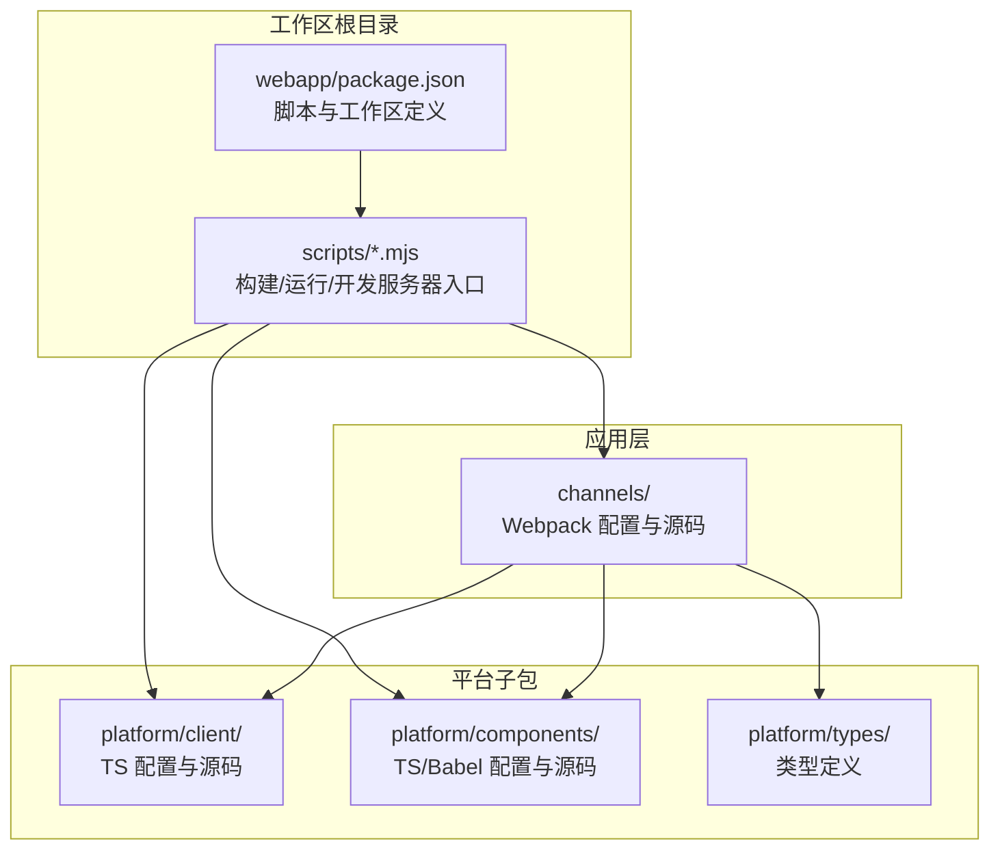
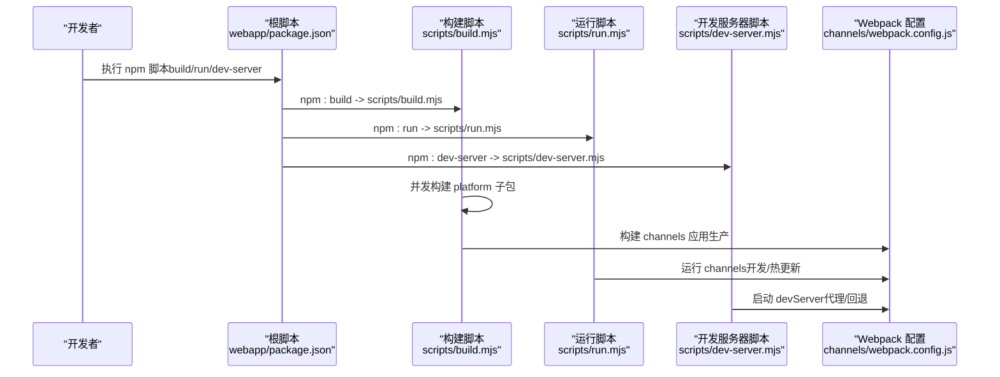
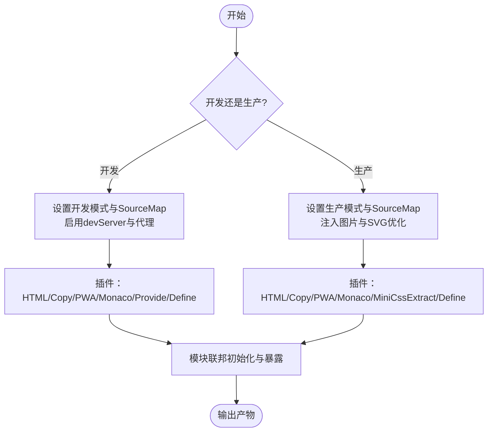
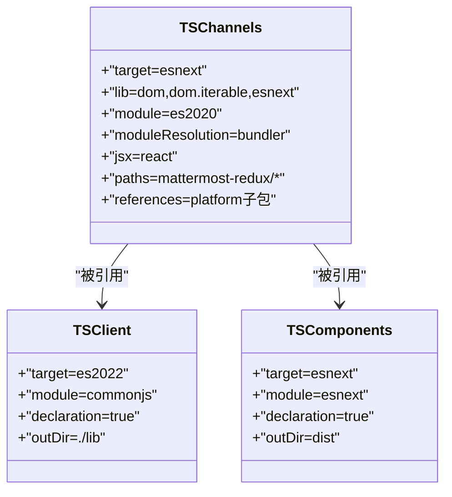
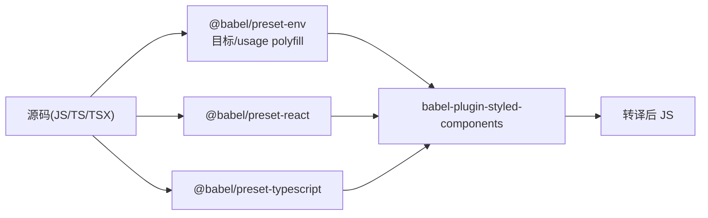
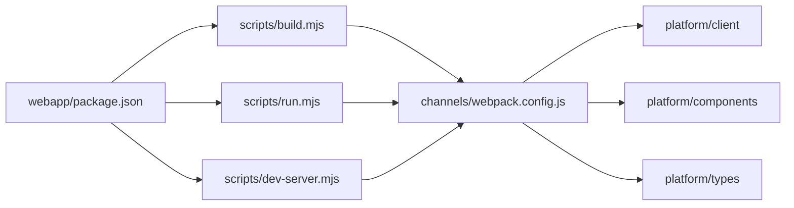

# 构建工具配置

<cite>
**本文引用的文件**
- [channels/webpack.config.js](file://webapp/channels/webpack.config.js)
- [channels/babel.config.js](file://webapp/channels/babel.config.js)
- [platform/components/babel.config.js](file://webapp/platform/components/babel.config.js)
- [platform/client/babel.config.js](file://webapp/platform/client/babel.config.js)
- [channels/tsconfig.json](file://webapp/channels/tsconfig.json)
- [platform/client/tsconfig.json](file://webapp/platform/client/tsconfig.json)
- [platform/components/tsconfig.json](file://webapp/platform/components/tsconfig.json)
- [webapp/package.json](file://webapp/package.json)
- [scripts/build.mjs](file://webapp/scripts/build.mjs)
- [scripts/dev-server.mjs](file://webapp/scripts/dev-server.mjs)
- [scripts/run.mjs](file://webapp/scripts/run.mjs)
</cite>

## 目录
1. [简介](#简介)
2. [项目结构](#项目结构)
3. [核心组件](#核心组件)
4. [架构总览](#架构总览)
5. [详细组件分析](#详细组件分析)
6. [依赖关系分析](#依赖关系分析)
7. [性能考量](#性能考量)
8. [故障排除指南](#故障排除指南)
9. [结论](#结论)
10. [附录](#附录)

## 简介
本指南面向 Mattermost 前端（webapp）构建工具的配置与使用，聚焦于以下方面：
- Webpack 配置：入口点、加载器、插件、模块联邦、开发服务器与热重载、生产优化与缓存策略
- TypeScript 编译：目标、模块解析、严格性、路径映射与工作空间引用
- Babel 转译：浏览器与组件包的目标、polyfill 策略、样式与国际化插件
- 代码分割与懒加载：基于 Webpack 分包与动态导入
- 开发体验：多包并发监听、本地代理、SourceMap 与性能调试
- 生产优化：资源压缩、图片优化、内容哈希与缓存控制
- 性能优化与故障排除：常见问题定位与调优建议
- 实战示例：如何为新需求调整构建设置（以路径与要点形式给出）

## 项目结构
前端采用多包工作区（workspace）组织，核心由 channels 应用与 platform 子包组成，统一通过 npm 脚本与构建脚本协调。

图示来源
- [webapp/package.json:109-117](file://webapp/package.json#L109-L117)
- [scripts/build.mjs:11-44](file://webapp/scripts/build.mjs#L11-L44)
- [scripts/run.mjs:12-51](file://webapp/scripts/run.mjs#L12-L51)

章节来源
- [webapp/package.json:8-24](file://webapp/package.json#L8-L24)
- [webapp/package.json:109-117](file://webapp/package.json#L109-L117)

## 核心组件
- Webpack 配置（channels）
  - 入口点：单入口指向应用根组件
  - 输出：内容哈希命名、清理旧产物、资源文件名规则
  - 加载器：Babel（JS/TS/TSX）、CSS/SCSS（开发/生产差异化）、资源文件（静态资源）
  - 插件：HTML 模板、MiniCssExtract（生产）、PWA 清单、Monaco 编辑器裁剪、复制静态资源、Provide 全局 polyfill、Define 注入环境变量
  - 模块联邦：远程容器注册、共享依赖、暴露导出、内容哈希时间戳注入
  - 开发服务器：代理 API/WebSocket/插件静态资源、历史回退到 HTML、禁用性能告警、关闭分包
  - 生产优化：SVG/图片预处理与压缩、SourceMap、性能调试开关
- TypeScript 配置（channels）
  - 目标与库：ESNext、DOM、DOM.Iterable、ESNext
  - 模块系统：ES2020（打包器），模块解析：bundler
  - 严格性：严格模式、空值检查、一致大小写
  - JSX：React
  - 路径映射与别名：mattermost-redux、@mui/styled-engine
  - 工作空间引用：对 platform 子包的引用
- Babel 配置（channels）
  - 浏览器目标：Chrome/Firefox/Edge/Safari
  - Polyfill：core-js 使用 usage
  - 预设：env、react、typescript
  - 插件：styled-components SSR 关闭、国际化格式化（channels）
- Babel 配置（platform/components）
  - 更低浏览器目标，启用 @babel/runtime 与 transform-runtime
  - 国际化插件：AST 与哈希 ID 模式
- Babel 配置（platform/client）
  - Node 目标（测试/构建），用于服务端或工具链场景

章节来源
- [channels/webpack.config.js:50-304](file://webapp/channels/webpack.config.js#L50-L304)
- [channels/tsconfig.json:1-45](file://webapp/channels/tsconfig.json#L1-L45)
- [channels/babel.config.js:1-41](file://webapp/channels/babel.config.js#L1-L41)
- [platform/components/babel.config.js:1-58](file://webapp/platform/components/babel.config.js#L1-L58)
- [platform/client/babel.config.js:1-10](file://webapp/platform/client/babel.config.js#L1-L10)

## 架构总览
下图展示了从脚本到构建与开发服务器的关键流程，以及与平台子包的协作关系。

图示来源
- [webapp/package.json:8-24](file://webapp/package.json#L8-L24)
- [scripts/build.mjs:11-44](file://webapp/scripts/build.mjs#L11-L44)
- [scripts/run.mjs:12-51](file://webapp/scripts/run.mjs#L12-L51)
- [scripts/dev-server.mjs:11-36](file://webapp/scripts/dev-server.mjs#L11-L36)
- [channels/webpack.config.js:468-515](file://webapp/channels/webpack.config.js#L468-L515)

## 详细组件分析

### Webpack 配置详解
- 入口点与输出
  - 入口：应用根组件入口
  - 输出：内容哈希 JS/CSS、资源文件名、自动清理
- 加载器
  - Babel：JS/TS/TSX 统一转译，启用缓存
  - CSS/SCSS：开发用 style-loader，生产用 MiniCssExtractPlugin；SCSS 支持主题路径与弃用警告抑制
  - 资源：asset/resource 处理字体/图片/音频等
- 解析与别名
  - modules 与 extensions；mattermost-redux 与 @mui 别名；fallback 提供 browser polyfills
- 插件
  - HtmlWebpackPlugin：模板注入、CSP 动态生成
  - MiniCssExtractPlugin：生产抽离 CSS
  - WebpackPwaManifest：生成 PWA 清单与图标
  - MonacoWebpackPlugin：按需裁剪特性
  - CopyWebpackPlugin：复制静态资源
  - DefinePlugin：注入环境变量
  - ProvidePlugin：全局注入 process 与 Buffer
- 模块联邦
  - 动态初始化远程容器，共享依赖（严格版本/宽松版本）
  - 暴露应用组件、store、样式与注册表
  - 内容哈希时间戳避免缓存污染
- 开发服务器
  - 代理 API/WebSocket/插件静态资源
  - 历史回退至 HTML，禁用性能告警，关闭分包提升开发速度
- 生产优化
  - SVG 预处理与压缩、图片压缩（sharp/GIF 排除）
  - SourceMap 与可选性能调试（关闭最小化以便分析）

图示来源
- [channels/webpack.config.js:404-455](file://webapp/channels/webpack.config.js#L404-L455)
- [channels/webpack.config.js:468-515](file://webapp/channels/webpack.config.js#L468-L515)
- [channels/webpack.config.js:317-402](file://webapp/channels/webpack.config.js#L317-L402)

章节来源
- [channels/webpack.config.js:50-304](file://webapp/channels/webpack.config.js#L50-L304)
- [channels/webpack.config.js:317-402](file://webapp/channels/webpack.config.js#L317-L402)
- [channels/webpack.config.js:404-455](file://webapp/channels/webpack.config.js#L404-L455)
- [channels/webpack.config.js:468-515](file://webapp/channels/webpack.config.js#L468-L515)

### TypeScript 编译配置
- channels 应用
  - 目标：ESNext；库：DOM/DOM.Iterable/ESNext
  - 模块：ES2020（bundler），模块解析：bundler
  - 严格性：严格、空值检查、一致大小写
  - JSX：React
  - 路径映射：mattermost-redux 与 @mui 别名
  - 引用：对 platform/client、platform/components、platform/types 的复合引用
- platform/client
  - 目标：ES2022；模块：CommonJS；声明输出目录
- platform/components
  - 目标：ESNext；模块：ESNext；声明输出目录

图示来源
- [channels/tsconfig.json:1-45](file://webapp/channels/tsconfig.json#L1-L45)
- [platform/client/tsconfig.json:1-26](file://webapp/platform/client/tsconfig.json#L1-L26)
- [platform/components/tsconfig.json:1-23](file://webapp/platform/components/tsconfig.json#L1-L23)

章节来源
- [channels/tsconfig.json:1-45](file://webapp/channels/tsconfig.json#L1-L45)
- [platform/client/tsconfig.json:1-26](file://webapp/platform/client/tsconfig.json#L1-L26)
- [platform/components/tsconfig.json:1-23](file://webapp/platform/components/tsconfig.json#L1-L23)

### Babel 转译配置
- channels 应用
  - 浏览器目标：现代浏览器
  - Polyfill：core-js usage
  - 预设：env、react、typescript
  - 插件：styled-components（SSR 关闭）
- platform/components
  - 更低浏览器目标；启用 @babel/plugin-transform-runtime
  - 国际化插件：AST 与哈希 ID 模式
- platform/client
  - Node 当前版本目标，用于服务端/工具链

图示来源
- [channels/babel.config.js:7-38](file://webapp/channels/babel.config.js#L7-L38)
- [platform/components/babel.config.js:4-47](file://webapp/platform/components/babel.config.js#L4-L47)
- [platform/client/babel.config.js:4-9](file://webapp/platform/client/babel.config.js#L4-L9)

章节来源
- [channels/babel.config.js:1-41](file://webapp/channels/babel.config.js#L1-L41)
- [platform/components/babel.config.js:1-58](file://webapp/platform/components/babel.config.js#L1-L58)
- [platform/client/babel.config.js:1-10](file://webapp/platform/client/babel.config.js#L1-L10)

### 代码分割与懒加载
- Webpack 默认分包策略由 splitChunks 控制；在开发服务器中显式关闭以提升编译速度
- 懒加载可通过动态导入实现（例如路由级或组件级按需加载），结合 Module Federation 可将远程模块作为独立分包
- 生产构建开启图片与 SVG 压缩，减少传输体积

章节来源
- [channels/webpack.config.js:510-513](file://webapp/channels/webpack.config.js#L510-L513)
- [channels/webpack.config.js:434-454](file://webapp/channels/webpack.config.js#L434-L454)

### 开发服务器与热重载
- devServer 配置
  - 代理：/api、/plugins、/static/plugins 指向站点地址，默认回退到本地 8065
  - WebSocket 支持、覆盖错误/警告覆盖层
  - 历史回退到 root.html，确保 SPA 路由正常
  - 禁用性能告警与关闭分包
- 并发运行
  - 根脚本通过 concurrently 并发监听 channels 与 platform 子包，支持统一退出与信号传播

章节来源
- [channels/webpack.config.js:468-515](file://webapp/channels/webpack.config.js#L468-L515)
- [scripts/dev-server.mjs:11-36](file://webapp/scripts/dev-server.mjs#L11-L36)
- [scripts/run.mjs:12-51](file://webapp/scripts/run.mjs#L12-L51)

### 生产环境优化
- 资源优化
  - SVG 预处理与压缩（SVGO）
  - 图片压缩（Sharp，GIF 排除）
- 缓存策略
  - 内容哈希文件名（JS/CSS/资源）
  - Module Federation 文件名附加时间戳参数，避免缓存污染
- SourceMap
  - 生产使用 source-map，开发使用 eval-cheap-module-source-map
- 性能调试
  - 可选关闭最小化与替换 react-dom profiling，便于 React Profiler 分析

章节来源
- [channels/webpack.config.js:408-455](file://webapp/channels/webpack.config.js#L408-L455)
- [channels/webpack.config.js:517-531](file://webapp/channels/webpack.config.js#L517-L531)

## 依赖关系分析
- 工作区与脚本
  - 根 package.json 定义工作区与脚本命令，统一触发构建/运行/开发服务器
- 并发执行
  - 构建与运行脚本通过 concurrently 并行执行各子包命令，失败时终止其他进程
- Webpack 与子包
  - channels 依赖 platform 子包（client/components/types）的类型与产物

图示来源
- [webapp/package.json:8-24](file://webapp/package.json#L8-L24)
- [scripts/build.mjs:11-44](file://webapp/scripts/build.mjs#L11-L44)
- [scripts/run.mjs:12-51](file://webapp/scripts/run.mjs#L12-L51)
- [scripts/dev-server.mjs:11-36](file://webapp/scripts/dev-server.mjs#L11-L36)
- [channels/webpack.config.js:19-19](file://webapp/channels/webpack.config.js#L19-L19)

章节来源
- [webapp/package.json:109-117](file://webapp/package.json#L109-L117)
- [scripts/build.mjs:11-44](file://webapp/scripts/build.mjs#L11-L44)
- [scripts/run.mjs:12-51](file://webapp/scripts/run.mjs#L12-L51)
- [channels/webpack.config.js:19-19](file://webapp/channels/webpack.config.js#L19-L19)

## 性能考量
- 构建并发
  - 使用 concurrently 并行构建 platform 子包，缩短整体构建时间
- 开发体验
  - 关闭 splitChunks、禁用性能告警、启用快速 SourceMap，提升开发响应速度
- 生产体积
  - SVG/图片压缩、内容哈希、按需加载与远程模块联邦，降低首屏与缓存命中成本
- 调试
  - 可选关闭最小化与启用 profiling，辅助 React 性能分析

章节来源
- [scripts/build.mjs:14-26](file://webapp/scripts/build.mjs#L14-L26)
- [channels/webpack.config.js:509-513](file://webapp/channels/webpack.config.js#L509-L513)
- [channels/webpack.config.js:522-531](file://webapp/channels/webpack.config.js#L522-L531)

## 故障排除指南
- 构建失败
  - concurrently 抛错会返回非零退出码；检查子包命令与依赖安装状态
- 资源加载异常
  - 确认 publicPath 与站点 URL 一致；开发模式下可由站点地址推导
- CSP 导致脚本加载失败
  - 开发模式允许 eval；生产请根据实际外部脚本来源调整 CSP
- 图片/字体未生效
  - 检查 asset/resource 规则与 CopyWebpackPlugin 模式是否覆盖
- 代理不生效
  - 确认 devServer 代理上下文与目标站点地址正确
- 模块联邦远程容器不可用
  - 检查远程容器列表与时间戳参数是否匹配

章节来源
- [scripts/build.mjs:23-26](file://webapp/scripts/build.mjs#L23-L26)
- [channels/webpack.config.js:35-43](file://webapp/channels/webpack.config.js#L35-L43)
- [channels/webpack.config.js:306-315](file://webapp/channels/webpack.config.js#L306-L315)
- [channels/webpack.config.js:159-196](file://webapp/channels/webpack.config.js#L159-L196)
- [channels/webpack.config.js:468-500](file://webapp/channels/webpack.config.js#L468-L500)
- [channels/webpack.config.js:341-350](file://webapp/channels/webpack.config.js#L341-L350)

## 结论
该构建体系通过多包工作区、Webpack 模块联邦、Babel 与 TypeScript 的协同，实现了现代化前端工程化的入口管理、类型安全、跨包共享与高效开发体验。生产环境通过内容哈希与资源压缩保障缓存与体积，开发环境通过代理与快速 SourceMap 提升迭代效率。按需扩展时，建议遵循现有别名、解析与插件策略，并在 channels/webpack.config.js 与对应 tsconfig.json/babel.config.js 中进行最小化改动。

## 附录
- 实战示例：新增一个按需加载的页面
  - 在应用中使用动态导入实现懒加载
  - 在 Webpack 中保持 splitChunks 默认策略或按需拆分
  - 如需远程模块，参考 Module Federation 配置在 channels/webpack.config.js 中添加共享与暴露
  - 若涉及样式与国际化，确保 Babel 与 TS 配置与现有 preset/plugins 保持一致
- 实战示例：引入新的第三方库
  - 若为浏览器 polyfill 相关，优先使用 core-js usage；如为 Node 特性，请确认目标环境与别名映射
  - 如需样式或国际化，检查 styled-components 与 formatjs 插件配置
  - 如需类型，考虑在 channels/tsconfig.json 的 paths 或 references 中补充映射与引用

章节来源
- [channels/webpack.config.js:317-402](file://webapp/channels/webpack.config.js#L317-L402)
- [channels/webpack.config.js:434-454](file://webapp/channels/webpack.config.js#L434-L454)
- [channels/babel.config.js:28-38](file://webapp/channels/babel.config.js#L28-L38)
- [platform/components/babel.config.js:30-46](file://webapp/platform/components/babel.config.js#L30-L46)
- [channels/tsconfig.json:27-30](file://webapp/channels/tsconfig.json#L27-L30)