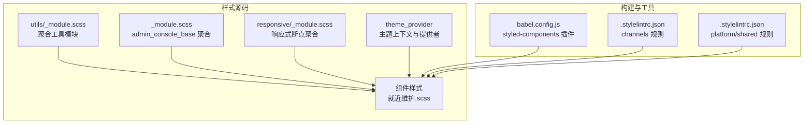
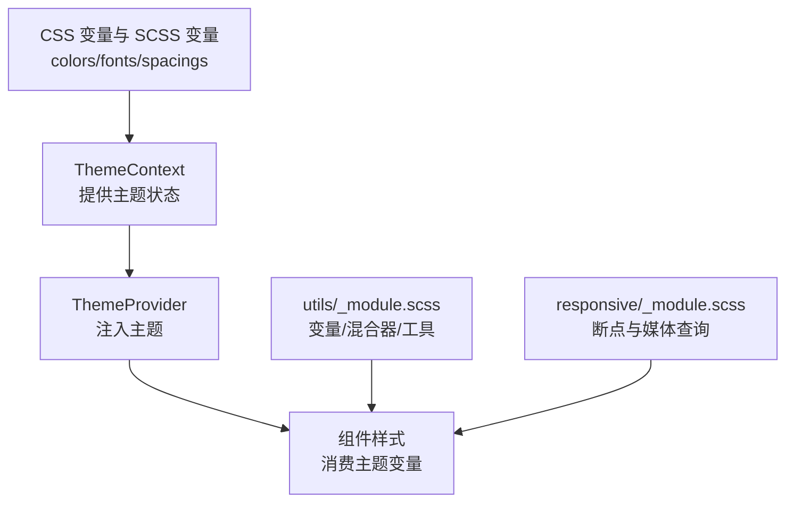
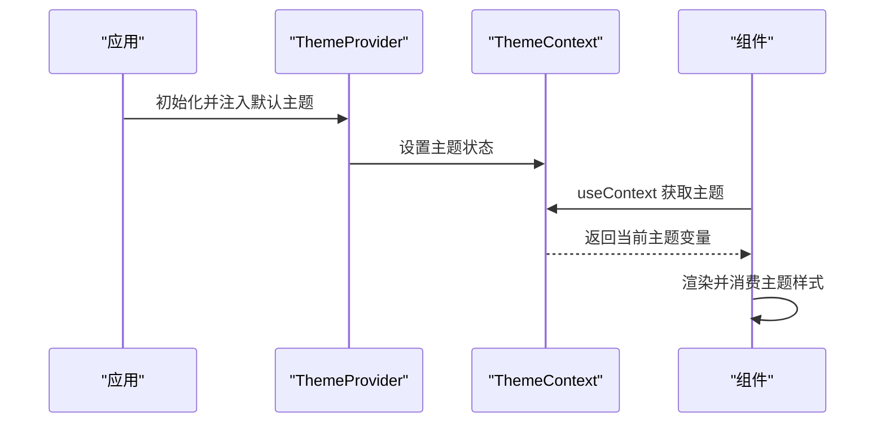
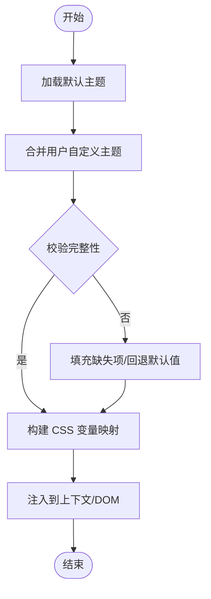
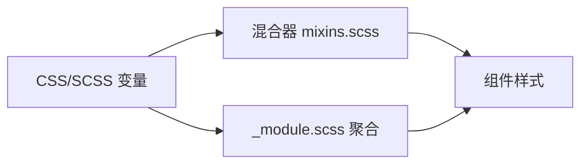
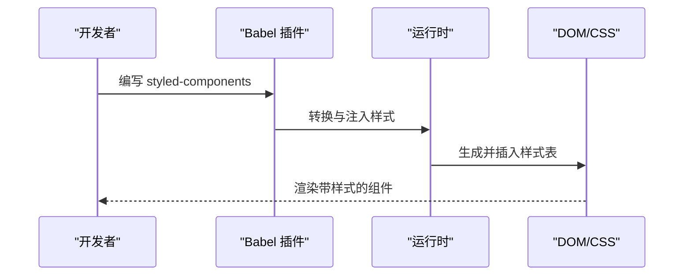
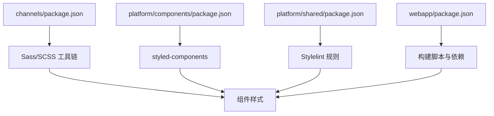

# 样式与主题系统

<cite>
**本文引用的文件**
- [STYLE_GUIDE.md](file://webapp/STYLE_GUIDE.md)
- [.stylelintrc.json](file://webapp/channels/.stylelintrc.json)
- [.stylelintrc.json](file://webapp/platform/shared/.stylelintrc.json)
- [babel.config.js](file://webapp/platform/components/babel.config.js)
- [_module.scss](file://webapp/channels/src/sass/utils/_module.scss)
- [_module.scss](file://webapp/channels/src/sass/admin_console_base/_module.scss)
- [_module.scss](file://webapp/channels/src/sass/responsive/_module.scss)
- [theme_context.ts](file://webapp/channels/src/components/theme_provider/theme_context.ts)
- [theme_provider.tsx](file://webapp/channels/src/components/theme_provider/theme_provider.tsx)
- [theme_utils.ts](file://webapp/channels/src/packages/mattermost-redux/src/utils/theme_utils.ts)
- [theme_thumbnail.tsx](file://webapp/channels/src/components/user_settings/display/user_settings_theme/theme_thumbnail.tsx)
- [theme_settings.spec.ts](file://e2e-tests/playwright/specs/accessibility/channels/theme_settings.spec.ts)
- [theme.json](file://e2e-tests/cypress/tests/fixtures/theme.json)
- [mixins.scss](file://webapp/channels/src/components/admin_console/billing/billing_subscriptions/mixins.scss)
- [mixins.scss](file://webapp/channels/src/components/payment_form/mixins.scss)
- [mixins.scss](file://webapp/channels/src/components/preparing_workspace/mixins.scss)
- [package.json](file://webapp/channels/package.json)
- [package.json](file://webapp/platform/components/package.json)
- [package.json](file://webapp/platform/shared/package.json)
- [package.json](file://webapp/package.json)
</cite>

## 目录
1. 引言
2. 项目结构
3. 核心组件
4. 架构总览
5. 详细组件分析
6. 依赖关系分析
7. 性能考虑
8. 故障排查指南
9. 结论
10. 附录

## 引言
本指南面向 Mattermost 前端样式与主题系统的使用者与维护者，系统阐述项目中 Sass/SCSS 的组织方式、变量与混合器的规范、主题系统的设计与颜色/字体/间距的统一管理、响应式策略（断点与移动端适配）、组件样式封装原则（避免冲突、提升可维护性）、CSS-in-JS 的使用场景与实现要点，并提供调试与性能优化建议及新组件样式开发示例路径。

## 项目结构
前端样式主要位于 webapp/channels/src/sass 目录下，采用模块化组织：基础变量与工具在 utils 子目录，主题上下文在 components/theme_provider 下，响应式断点在 responsive 子目录，部分业务组件的样式与混合器在各自组件目录内就近维护。Stylelint 配置分别在 channels 与 platform/shared 目录下，确保风格一致性与废弃变量提示。

图表来源
- [utils/_module.scss:1-7](file://webapp/channels/src/sass/utils/_module.scss#L1-L7)
- [admin_console_base/_module.scss:1-2](file://webapp/channels/src/sass/admin_console_base/_module.scss#L1-L2)
- [responsive/_module.scss:1-3](file://webapp/channels/src/sass/responsive/_module.scss#L1-L3)
- [babel.config.js:30-46](file://webapp/platform/components/babel.config.js#L30-L46)
- [.stylelintrc.json:1-42](file://webapp/channels/.stylelintrc.json#L1-L42)
- [.stylelintrc.json:1-42](file://webapp/platform/shared/.stylelintrc.json#L1-L42)

章节来源
- [STYLE_GUIDE.md:26-37](file://webapp/STYLE_GUIDE.md#L26-L37)
- [utils/_module.scss:1-7](file://webapp/channels/src/sass/utils/_module.scss#L1-L7)
- [admin_console_base/_module.scss:1-2](file://webapp/channels/src/sass/admin_console_base/_module.scss#L1-L2)
- [responsive/_module.scss:1-3](file://webapp/channels/src/sass/responsive/_module.scss#L1-L3)
- [.stylelintrc.json:1-42](file://webapp/channels/.stylelintrc.json#L1-L42)
- [.stylelintrc.json:1-42](file://webapp/platform/shared/.stylelintrc.json#L1-L42)

## 核心组件
- 主题上下文与提供者：通过上下文暴露主题变量，供组件消费；提供者负责注入当前主题并支持切换。
- 主题工具函数：提供主题变量解析、合并与校验能力，保障主题一致性。
- 样式命名与作用域：组件根类 + BEM 风格后缀，修饰类独立于主类，避免 !important。
- 变量与混合器：集中于 utils 模块，便于复用与升级；业务组件可在本地维护 mixins.scss。
- 响应式断点：按 mobile/tablet/desktop 组织，统一断点与媒体查询策略。
- Stylelint 规则：禁止特定废弃变量使用，强调缩进与空行等风格，减少冲突与不一致。

章节来源
- [theme_context.ts](file://webapp/channels/src/components/theme_provider/theme_context.ts)
- [theme_provider.tsx](file://webapp/channels/src/components/theme_provider/theme_provider.tsx)
- [theme_utils.ts](file://webapp/channels/src/packages/mattermost-redux/src/utils/theme_utils.ts)
- [STYLE_GUIDE.md:26-37](file://webapp/STYLE_GUIDE.md#L26-L37)
- [utils/_module.scss:1-7](file://webapp/channels/src/sass/utils/_module.scss#L1-L7)
- [responsive/_module.scss:1-3](file://webapp/channels/src/sass/responsive/_module.scss#L1-L3)
- [.stylelintrc.json:26-38](file://webapp/channels/.stylelintrc.json#L26-L38)

## 架构总览
主题系统围绕“变量—上下文—组件”三层展开：变量层提供颜色、字体、间距等原子值；上下文层负责主题注入与切换；组件层通过类名与 CSS 变量消费主题，同时遵循命名与作用域约定。

图表来源
- [theme_context.ts](file://webapp/channels/src/components/theme_provider/theme_context.ts)
- [theme_provider.tsx](file://webapp/channels/src/components/theme_provider/theme_provider.tsx)
- [utils/_module.scss:1-7](file://webapp/channels/src/sass/utils/_module.scss#L1-L7)
- [responsive/_module.scss:1-3](file://webapp/channels/src/sass/responsive/_module.scss#L1-L3)

## 详细组件分析

### 主题上下文与提供者
- 设计要点
  - 上下文暴露主题对象，组件通过 useContext 获取。
  - 提供者负责订阅主题变更并在 DOM 中更新 CSS 变量或类名。
  - 支持主题切换与持久化，保证用户偏好与无障碍访问的一致性。
- 使用流程
  - 应用启动时初始化主题提供者。
  - 组件消费主题变量，避免硬编码颜色与尺寸。
  - 切换主题时触发重新渲染，保持视觉一致性。

图表来源
- [theme_provider.tsx](file://webapp/channels/src/components/theme_provider/theme_provider.tsx)
- [theme_context.ts](file://webapp/channels/src/components/theme_provider/theme_context.ts)

章节来源
- [theme_provider.tsx](file://webapp/channels/src/components/theme_provider/theme_provider.tsx)
- [theme_context.ts](file://webapp/channels/src/components/theme_provider/theme_context.ts)

### 主题工具函数
- 功能概述
  - 解析与校验主题变量，生成兼容的 CSS 变量映射。
  - 合并用户自定义主题与默认主题，处理缺失字段。
  - 输出可用于 DOM 注入或组件消费的数据结构。
- 典型用途
  - 用户设置页面的主题预览与应用。
  - E2E 测试中的主题数据准备与断言。

图表来源
- [theme_utils.ts](file://webapp/channels/src/packages/mattermost-redux/src/utils/theme_utils.ts)

章节来源
- [theme_utils.ts](file://webapp/channels/src/packages/mattermost-redux/src/utils/theme_utils.ts)

### 样式命名与作用域（BEM 与根类）
- 命名规范
  - 根类：组件名（PascalCase）。
  - 子元素：根类 + 双下划线 + 元素名（BEM 风格）。
  - 修饰类：根类 + 点号 + 修饰名（如.compact），独立于主类。
  - 避免使用 !important，降低特异性冲突风险。
- 实施建议
  - 新组件就近创建同名 .scss 文件，导入至组件入口。
  - 修改既有文件时尽量遵循现有命名风格，保持内部一致性。

章节来源
- [STYLE_GUIDE.md:26-37](file://webapp/STYLE_GUIDE.md#L26-L37)

### 变量与混合器（Sass/SCSS）
- 变量层
  - 颜色：统一使用 CSS 变量（如 --link-color），避免硬编码。
  - 透明度：非纯色使用 rgba(var(--color-rgb), alpha)。
  - 字体与字号：通过变量控制层级与可读性。
  - 间距：使用统一的步进变量，保证网格一致性。
- 混合器层
  - 复用布局、排版、动画等通用模式。
  - 业务组件可在本地维护 mixins.scss，避免全局污染。
- 工具模块
  - utils/_module.scss 聚合 flex、functions、variables、mixins、animations、modifiers，便于统一引入。

图表来源
- [utils/_module.scss:1-7](file://webapp/channels/src/sass/utils/_module.scss#L1-L7)
- [mixins.scss](file://webapp/channels/src/components/admin_console/billing/billing_subscriptions/mixins.scss)
- [mixins.scss](file://webapp/channels/src/components/payment_form/mixins.scss)
- [mixins.scss](file://webapp/channels/src/components/preparing_workspace/mixins.scss)

章节来源
- [STYLE_GUIDE.md:35-37](file://webapp/STYLE_GUIDE.md#L35-L37)
- [utils/_module.scss:1-7](file://webapp/channels/src/sass/utils/_module.scss#L1-L7)
- [mixins.scss](file://webapp/channels/src/components/admin_console/billing/billing_subscriptions/mixins.scss)
- [mixins.scss](file://webapp/channels/src/components/payment_form/mixins.scss)
- [mixins.scss](file://webapp/channels/src/components/preparing_workspace/mixins.scss)

### 响应式设计（断点与移动端适配）
- 断点组织
  - responsive/_module.scss 聚合 mobile/tablet/desktop，统一媒体查询策略。
- 移动优先
  - 默认样式针对小屏，再通过 @media 向大屏增强。
  - 避免过度依赖固定像素，优先使用相对单位与流式布局。
- 交互与可访问性
  - 关注触摸目标尺寸、对比度与键盘导航体验。
  - 在断点切换处进行焦点管理与滚动行为测试。

章节来源
- [responsive/_module.scss:1-3](file://webapp/channels/src/sass/responsive/_module.scss#L1-L3)

### CSS-in-JS 使用场景与实现
- 使用场景
  - 动态样式（根据 props 或主题变量实时变化）。
  - 动画与过渡的条件化应用。
  - 与第三方库集成时的快速样式覆盖。
- 实现要点
  - 与 styled-components 插件配合，启用 SSR 选项以提升首屏性能。
  - 保持与 SCSS 变量体系一致，避免重复定义同一语义的样式。
  - 在 babel.config.js 中配置插件参数，确保产物稳定与可追踪。

图表来源
- [babel.config.js:30-46](file://webapp/platform/components/babel.config.js#L30-L46)

章节来源
- [babel.config.js:30-46](file://webapp/platform/components/babel.config.js#L30-L46)

### 主题设置与预览（用户设置页）
- 主题缩略图与预览
  - theme_thumbnail.tsx 展示主题色彩组合，辅助用户选择。
- 主题设置测试
  - e2e 测试覆盖主题设置流程，验证可访问性与一致性。

章节来源
- [theme_thumbnail.tsx](file://webapp/channels/src/components/user_settings/display/user_settings_theme/theme_thumbnail.tsx)
- [theme_settings.spec.ts](file://e2e-tests/playwright/specs/accessibility/channels/theme_settings.spec.ts)

## 依赖关系分析
- 构建与打包
  - channels 与 platform/components/package.json 定义了样式与组件相关依赖，确保样式与组件生态一致。
- 样式工具链
  - Stylelint 在 channels 与 platform/shared 目录分别配置，统一规则与废弃变量提示。
- 主题与组件
  - ThemeProvider 与 ThemeContext 为组件提供主题数据；组件通过类名与 CSS 变量消费主题。

图表来源
- [package.json](file://webapp/channels/package.json)
- [package.json](file://webapp/platform/components/package.json)
- [package.json](file://webapp/platform/shared/package.json)
- [package.json](file://webapp/package.json)

章节来源
- [package.json](file://webapp/channels/package.json)
- [package.json](file://webapp/platform/components/package.json)
- [package.json](file://webapp/platform/shared/package.json)
- [package.json](file://webapp/package.json)

## 性能考虑
- 样式体积
  - 优先使用 SCSS 变量与混合器，减少重复样式。
  - 将通用样式抽离至 utils/_module.scss，避免多处冗余。
- 运行时开销
  - CSS-in-JS 在 SSR 场景需谨慎使用，合理拆分样式与组件，避免一次性注入大量样式。
- 可维护性
  - 严格遵守命名与作用域规范，降低特异性冲突与后期重构成本。
  - 使用 Stylelint 规则约束，减少废弃变量与不规范写法。

## 故障排查指南
- 主题变量未生效
  - 检查 ThemeProvider 是否正确注入主题。
  - 确认组件是否使用 CSS 变量而非硬编码颜色。
- 样式冲突
  - 遵循 BEM 与根类命名，避免 !important。
  - 通过 Stylelint 规则定位问题，尤其是废弃变量被误用的情况。
- 响应式异常
  - 对照 responsive/_module.scss 的断点定义，确认媒体查询顺序与范围。
- CSS-in-JS 问题
  - 检查 babel.config.js 中 styled-components 插件配置，确保 SSR 与文件名输出符合预期。

章节来源
- [STYLE_GUIDE.md:26-37](file://webapp/STYLE_GUIDE.md#L26-L37)
- [.stylelintrc.json:26-38](file://webapp/channels/.stylelintrc.json#L26-L38)
- [responsive/_module.scss:1-3](file://webapp/channels/src/sass/responsive/_module.scss#L1-L3)
- [babel.config.js:30-46](file://webapp/platform/components/babel.config.js#L30-L46)

## 结论
Mattermost 的样式与主题系统通过“变量—上下文—组件”的分层设计，结合 SCSS 模块化与 CSS-in-JS 的互补使用，实现了可扩展、可维护且一致的视觉体系。遵循命名与作用域规范、统一响应式断点、严格执行 Stylelint 规则，是保障质量与性能的关键。

## 附录

### 新组件样式开发示例（步骤路径）
- 创建组件样式文件
  - 在组件目录下创建同名 .scss 文件，导入 utils/_module.scss 与响应式模块。
  - 示例路径参考：[utils/_module.scss:1-7](file://webapp/channels/src/sass/utils/_module.scss#L1-L7)，[responsive/_module.scss:1-3](file://webapp/channels/src/sass/responsive/_module.scss#L1-L3)
- 命名与作用域
  - 根类使用组件名（PascalCase），子元素与修饰类遵循 BEM 风格。
  - 参考规范：[STYLE_GUIDE.md:26-37](file://webapp/STYLE_GUIDE.md#L26-L37)
- 使用主题变量
  - 颜色与透明度使用 CSS 变量，避免硬编码。
  - 参考规范：[STYLE_GUIDE.md:35-37](file://webapp/STYLE_GUIDE.md#L35-L37)
- 响应式适配
  - 在对应断点下调整布局与间距，确保移动端优先体验。
  - 参考断点聚合：[responsive/_module.scss:1-3](file://webapp/channels/src/sass/responsive/_module.scss#L1-L3)
- CSS-in-JS 场景
  - 当需要动态样式时，结合 styled-components 插件进行转换与注入。
  - 参考配置：[babel.config.js:30-46](file://webapp/platform/components/babel.config.js#L30-L46)
- 主题预览与测试
  - 使用主题缩略图预览效果，必要时补充 E2E 测试。
  - 参考：[theme_thumbnail.tsx](file://webapp/channels/src/components/user_settings/display/user_settings_theme/theme_thumbnail.tsx)，[theme_settings.spec.ts](file://e2e-tests/playwright/specs/accessibility/channels/theme_settings.spec.ts)