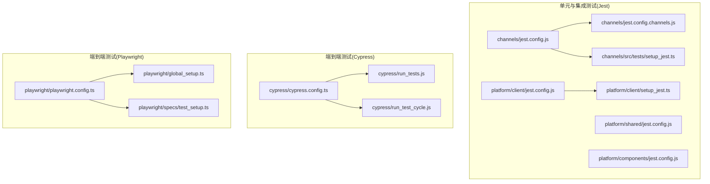
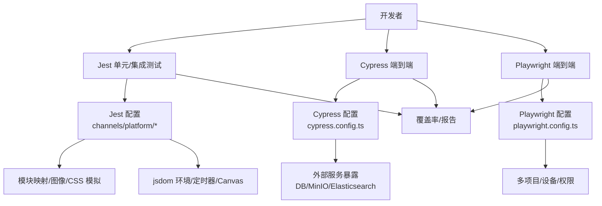
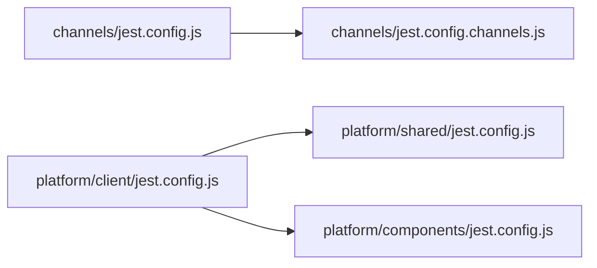

# 测试策略

<cite>
**本文引用的文件**
- [webapp/channels/jest.config.js](file://webapp/channels/jest.config.js)
- [webapp/channels/jest.config.channels.js](file://webapp/channels/jest.config.channels.js)
- [webapp/platform/client/jest.config.js](file://webapp/platform/client/jest.config.js)
- [e2e-tests/cypress/cypress.config.ts](file://e2e-tests/cypress/cypress.config.ts)
- [e2e-tests/playwright/playwright.config.ts](file://e2e-tests/playwright/playwright.config.ts)
- [e2e-tests/cypress/utils/even_distribution.test.js](file://e2e-tests/cypress/utils/even_distribution.test.js)
- [webapp/channels/src/actions/channel_actions.test.ts](file://webapp/channels/src/actions/channel_actions.test.ts)
- [webapp/channels/src/actions/user_actions.test.ts](file://webapp/channels/src/actions/user_actions.test.ts)
- [webapp/channels/src/actions/post_actions.test.ts](file://webapp/channels/src/actions/post_actions.test.ts)
- [webapp/channels/src/reducers/channel_reducer.test.ts](file://webapp/channels/src/reducers/channel_reducer.test.ts)
- [webapp/channels/src/components/ChannelList/ChannelList.test.tsx](file://webapp/channels/src/components/ChannelList/ChannelList.test.tsx)
- [webapp/channels/src/hooks/useMyChannel.test.ts](file://webapp/channels/src/hooks/useMyChannel.test.ts)
- [webapp/channels/src/utils/helpers.test.ts](file://webapp/channels/src/utils/helpers.test.ts)
- [webapp/platform/shared/jest.config.js](file://webapp/platform/shared/jest.config.js)
- [webapp/platform/components/jest.config.js](file://webapp/platform/components/jest.config.js)
- [webapp/platform/client/setup_jest.ts](file://webapp/platform/client/setup_jest.ts)
- [webapp/channels/src/tests/setup_jest.ts](file://webapp/channels/src/tests/setup_jest.ts)
- [e2e-tests/playwright/specs/test_setup.ts](file://e2e-tests/playwright/specs/test_setup.ts)
- [e2e-tests/playwright/global_setup.ts](file://e2e-tests/playwright/global_setup.ts)
- [e2e-tests/cypress/run_tests.js](file://e2e-tests/cypress/run_tests.js)
- [e2e-tests/cypress/run_test_cycle.js](file://e2e-tests/cypress/run_test_cycle.js)
- [e2e-tests/playwright/script/lint-test-docs.js](file://e2e-tests/playwright/script/lint-test-docs.js)
</cite>

## 目录
1. 引言
2. 项目结构
3. 核心组件
4. 架构总览
5. 详细组件分析
6. 依赖关系分析
7. 性能考量
8. 故障排查指南
9. 结论
10. 附录

## 引言
本指南面向 Mattermost 前端团队与贡献者，系统化阐述基于 Jest 的单元与集成测试、基于 Cypress 的端到端测试以及基于 Playwright 的端到端测试策略。内容涵盖测试环境配置、模拟策略、覆盖率要求、报告生成、测试数据管理与实际示例路径，帮助为新功能编写全面且可维护的测试用例。

## 项目结构
前端测试相关目录主要分布在以下位置：
- 单元与集成测试：webapp 下各包（channels、platform/*）的 jest 配置与测试文件
- 端到端测试（Cypress）：e2e-tests/cypress
- 端到端测试（Playwright）：e2e-tests/playwright

下图给出与测试相关的关键模块与配置文件映射：

图表来源
- [webapp/channels/jest.config.js:1-60](file://webapp/channels/jest.config.js#L1-L60)
- [webapp/channels/jest.config.channels.js:1-26](file://webapp/channels/jest.config.channels.js#L1-L26)
- [webapp/platform/client/jest.config.js:1-20](file://webapp/platform/client/jest.config.js#L1-L20)
- [webapp/platform/shared/jest.config.js](file://webapp/platform/shared/jest.config.js)
- [webapp/platform/components/jest.config.js](file://webapp/platform/components/jest.config.js)
- [webapp/platform/client/setup_jest.ts](file://webapp/platform/client/setup_jest.ts)
- [webapp/channels/src/tests/setup_jest.ts](file://webapp/channels/src/tests/setup_jest.ts)
- [e2e-tests/cypress/cypress.config.ts:1-128](file://e2e-tests/cypress/cypress.config.ts#L1-L128)
- [e2e-tests/playwright/playwright.config.ts:1-87](file://e2e-tests/playwright/playwright.config.ts#L1-L87)
- [e2e-tests/playwright/global_setup.ts](file://e2e-tests/playwright/global_setup.ts)
- [e2e-tests/playwright/specs/test_setup.ts](file://e2e-tests/playwright/specs/test_setup.ts)
- [e2e-tests/cypress/run_tests.js](file://e2e-tests/cypress/run_tests.js)
- [e2e-tests/cypress/run_test_cycle.js](file://e2e-tests/cypress/run_test_cycle.js)

章节来源
- [webapp/channels/jest.config.js:1-60](file://webapp/channels/jest.config.js#L1-L60)
- [webapp/channels/jest.config.channels.js:1-26](file://webapp/channels/jest.config.channels.js#L1-L26)
- [webapp/platform/client/jest.config.js:1-20](file://webapp/platform/client/jest.config.js#L1-L20)
- [e2e-tests/cypress/cypress.config.ts:1-128](file://e2e-tests/cypress/cypress.config.ts#L1-L128)
- [e2e-tests/playwright/playwright.config.ts:1-87](file://e2e-tests/playwright/playwright.config.ts#L1-L87)

## 核心组件
- Jest 测试运行器与配置
  - channels 包：基础配置与通道域专属覆盖范围
  - platform 各子包：客户端、共享、组件等独立配置
  - 统一的 jsdom 环境、Babel 转换、Canvas 模拟、自定义模块映射与忽略模式
- 端到端测试（Cypress）
  - TypeScript/JS 预处理器、Node 多项 polyfill、数据库/对象存储/搜索等外部服务暴露
  - 可配置重试、截图/视频、超时与隔离策略
- 端到端测试（Playwright）
  - 多浏览器项目、屏幕尺寸与权限、快照阈值、追踪与视频保留策略、多格式报告

章节来源
- [webapp/channels/jest.config.js:6-57](file://webapp/channels/jest.config.js#L6-L57)
- [webapp/channels/jest.config.channels.js:8-23](file://webapp/channels/jest.config.channels.js#L8-L23)
- [webapp/platform/client/jest.config.js:6-19](file://webapp/platform/client/jest.config.js#L6-L19)
- [e2e-tests/cypress/cypress.config.ts:8-126](file://e2e-tests/cypress/cypress.config.ts#L8-L126)
- [e2e-tests/playwright/playwright.config.ts:14-85](file://e2e-tests/playwright/playwright.config.ts#L14-L85)

## 架构总览
下图展示测试体系在不同层次的职责与交互：

图表来源
- [webapp/channels/jest.config.js:6-57](file://webapp/channels/jest.config.js#L6-L57)
- [webapp/platform/client/jest.config.js:6-19](file://webapp/platform/client/jest.config.js#L6-L19)
- [e2e-tests/cypress/cypress.config.ts:8-126](file://e2e-tests/cypress/cypress.config.ts#L8-L126)
- [e2e-tests/playwright/playwright.config.ts:14-85](file://e2e-tests/playwright/playwright.config.ts#L14-L85)

## 详细组件分析

### Jest 配置与模拟策略
- 模块映射与资源模拟
  - 组件/类型别名映射至平台源码
  - mattermost-redux 别名与测试目录映射
  - pdfjs-dist、图片/字体/样式资源的模拟文件或代理
- 转换与忽略
  - 使用 babel-jest 转换 TS/JS
  - transformIgnorePatterns 扩展白名单以支持特定依赖
- 环境与初始化
  - jsdom 环境、fakeTimers 控制、Canvas 模拟
  - setupFiles/setupFilesAfterEnv 注入全局初始化脚本
- 覆盖率与报告
  - collectCoverageFrom 与 coveragePathIgnorePatterns 精准控制统计范围
  - coverageReporters 输出 JSON/LCOV/文本摘要

章节来源
- [webapp/channels/jest.config.js:9-33](file://webapp/channels/jest.config.js#L9-L33)
- [webapp/channels/jest.config.js:36-43](file://webapp/channels/jest.config.js#L36-L43)
- [webapp/channels/jest.config.js:16-16](file://webapp/channels/jest.config.js#L16-L16)
- [webapp/platform/client/jest.config.js:7-19](file://webapp/platform/client/jest.config.js#L7-L19)

### 平台包独立配置
- platform/client：类型别名映射、setupFiles 指向统一初始化脚本
- platform/shared、platform/components：各自独立的 jest.config.js，便于按包粒度收集覆盖率

章节来源
- [webapp/platform/client/jest.config.js:7-19](file://webapp/platform/client/jest.config.js#L7-L19)
- [webapp/platform/shared/jest.config.js](file://webapp/platform/shared/jest.config.js)
- [webapp/platform/components/jest.config.js](file://webapp/platform/components/jest.config.js)

### 端到端测试（Cypress）配置
- Node 事件与预处理
  - 自定义 webpack 预处理器，支持 TypeScript 与 @/ 路径别名
  - 注入 Node.js polyfills（crypto/process/buffer）
- 测试运行参数
  - 超时、重试、截图/视频、视口尺寸
  - 外部服务暴露（数据库、对象存储、搜索引擎、SMTP、Keycloak、LDAP 等）
- 规范与支持
  - specPattern、supportFile、baseUrl、禁用测试隔离

章节来源
- [e2e-tests/cypress/cypress.config.ts:63-126](file://e2e-tests/cypress/cypress.config.ts#L63-L126)

### 端到端测试（Playwright）配置
- 全局设置与工作流
  - globalSetup、workers、retries、timeout
  - use 中的权限、视口、慢动作、追踪与视频策略
- 项目矩阵
  - setup、iPad、Chrome、Firefox 多项目，依赖顺序确保初始化完成
- 报告器
  - Blob/HTML/JSON/JUnit 等多格式输出

章节来源
- [e2e-tests/playwright/playwright.config.ts:14-85](file://e2e-tests/playwright/playwright.config.ts#L14-L85)

### 测试数据准备与管理
- Cypress
  - fixturesFolder、downloadsFolder、screenshotsFolder、videosFolder
  - 通过 expose 暴露数据库连接、对象存储、搜索等环境变量
- Playwright
  - 通过 global_setup.ts 与 test_setup.ts 进行初始化与依赖准备
- 通用建议
  - 将测试数据集中于 fixtures 或专用测试数据目录
  - 使用环境变量注入敏感信息，避免硬编码

章节来源
- [e2e-tests/cypress/cypress.config.ts:11-26](file://e2e-tests/cypress/cypress.config.ts#L11-L26)
- [e2e-tests/playwright/global_setup.ts](file://e2e-tests/playwright/global_setup.ts)
- [e2e-tests/playwright/specs/test_setup.ts](file://e2e-tests/playwright/specs/test_setup.ts)

### 实际测试示例（按类型）
- 单元测试（Redux 动作）
  - 示例路径：[channels/src/actions/channel_actions.test.ts](file://webapp/channels/src/actions/channel_actions.test.ts)
  - 示例路径：[channels/src/actions/user_actions.test.ts](file://webapp/channels/src/actions/user_actions.test.ts)
  - 示例路径：[channels/src/actions/post_actions.test.ts](file://webapp/channels/src/actions/post_actions.test.ts)
- 单元测试（Redux Reducer）
  - 示例路径：[channels/src/reducers/channel_reducer.test.ts](file://webapp/channels/src/reducers/channel_reducer.test.ts)
- 单元测试（组件）
  - 示例路径：[channels/src/components/ChannelList/ChannelList.test.tsx](file://webapp/channels/src/components/ChannelList/ChannelList.test.tsx)
- 单元测试（Hooks）
  - 示例路径：[channels/src/hooks/useMyChannel.test.ts](file://webapp/channels/src/hooks/useMyChannel.test.ts)
- 单元测试（工具函数）
  - 示例路径：[channels/src/utils/helpers.test.ts](file://webapp/channels/src/utils/helpers.test.ts)
- 端到端测试（Cypress）
  - 示例路径：[e2e-tests/cypress/utils/even_distribution.test.js](file://e2e-tests/cypress/utils/even_distribution.test.js)
- 端到端测试（Playwright）
  - 示例路径：[e2e-tests/playwright/specs/test_setup.ts](file://e2e-tests/playwright/specs/test_setup.ts)

章节来源
- [webapp/channels/src/actions/channel_actions.test.ts](file://webapp/channels/src/actions/channel_actions.test.ts)
- [webapp/channels/src/actions/user_actions.test.ts](file://webapp/channels/src/actions/user_actions.test.ts)
- [webapp/channels/src/actions/post_actions.test.ts](file://webapp/channels/src/actions/post_actions.test.ts)
- [webapp/channels/src/reducers/channel_reducer.test.ts](file://webapp/channels/src/reducers/channel_reducer.test.ts)
- [webapp/channels/src/components/ChannelList/ChannelList.test.tsx](file://webapp/channels/src/components/ChannelList/ChannelList.test.tsx)
- [webapp/channels/src/hooks/useMyChannel.test.ts](file://webapp/channels/src/hooks/useMyChannel.test.ts)
- [webapp/channels/src/utils/helpers.test.ts](file://webapp/channels/src/utils/helpers.test.ts)
- [e2e-tests/cypress/utils/even_distribution.test.js](file://e2e-tests/cypress/utils/even_distribution.test.js)
- [e2e-tests/playwright/specs/test_setup.ts](file://e2e-tests/playwright/specs/test_setup.ts)

## 依赖关系分析
- Jest 配置继承
  - channels/jest.config.channels.js 继承 channels/jest.config.js，并限定测试路径与覆盖率排除
- 平台包独立性
  - platform/* 各包拥有独立 jest.config.js，减少耦合，提升可维护性
- 端到端测试工具链
  - Cypress 与 Playwright 分别通过各自的配置文件与脚本进行编排

图表来源
- [webapp/channels/jest.config.js:6-6](file://webapp/channels/jest.config.js#L6-L6)
- [webapp/channels/jest.config.channels.js:6-6](file://webapp/channels/jest.config.channels.js#L6-L6)
- [webapp/platform/client/jest.config.js:6-6](file://webapp/platform/client/jest.config.js#L6-L6)
- [webapp/platform/shared/jest.config.js](file://webapp/platform/shared/jest.config.js)
- [webapp/platform/components/jest.config.js](file://webapp/platform/components/jest.config.js)

章节来源
- [webapp/channels/jest.config.channels.js:6-6](file://webapp/channels/jest.config.channels.js#L6-L6)
- [webapp/platform/client/jest.config.js:6-6](file://webapp/platform/client/jest.config.js#L6-L6)

## 性能考量
- Jest
  - fakeTimers 控制性能敏感场景下的定时器行为
  - transformIgnorePatterns 白名单减少不必要的转换开销
  - setupFilesAfterEnv 注入轻量初始化，避免重复加载
- Cypress
  - 合理设置 retries 与默认命令超时，平衡稳定性与速度
  - 关闭 testIsolation 以降低上下文切换成本（需谨慎评估副作用）
- Playwright
  - workers 数量与 retries 在 CI 中按需调整
  - 截图/视频仅在失败时保留，降低磁盘与上传压力

章节来源
- [webapp/channels/jest.config.js:17-19](file://webapp/channels/jest.config.js#L17-L19)
- [e2e-tests/cypress/cypress.config.ts:14-21](file://e2e-tests/cypress/cypress.config.ts#L14-L21)
- [e2e-tests/cypress/cypress.config.ts:125-125](file://e2e-tests/cypress/cypress.config.ts#L125-L125)
- [e2e-tests/playwright/playwright.config.ts:16-18](file://e2e-tests/playwright/playwright.config.ts#L16-L18)
- [e2e-tests/playwright/playwright.config.ts:47-51](file://e2e-tests/playwright/playwright.config.ts#L47-L51)

## 故障排查指南
- Jest
  - 模块解析失败：检查 moduleNameMapper 与 moduleDirectories
  - 资源无法识别：确认 pdfjs-dist、图片/样式模拟映射是否生效
  - 定时器异常：核对 fakeTimers 配置与 doNotFake 列表
  - 覆盖率缺失：检查 collectCoverageFrom 与 coveragePathIgnorePatterns
- Cypress
  - TypeScript 编译错误：确认 ts-loader 与 @/ 别名配置
  - Node 多项 polyfill：确保 node-polyfill-webpack-plugin 与 ProvidePlugin 已启用
  - 外部服务不可达：核对 expose 中的连接字符串与端口
- Playwright
  - 设备/权限问题：检查 devices 与 permissions 配置
  - 快照阈值过高：适当调整 toHaveScreenshot 的阈值与最大差异像素比

章节来源
- [webapp/channels/jest.config.js:20-33](file://webapp/channels/jest.config.js#L20-L33)
- [e2e-tests/cypress/cypress.config.ts:70-116](file://e2e-tests/cypress/cypress.config.ts#L70-L116)
- [e2e-tests/playwright/playwright.config.ts:53-78](file://e2e-tests/playwright/playwright.config.ts#L53-L78)

## 结论
通过分层清晰的 Jest 配置、完善的模块映射与模拟策略，以及 Cypress/Playwright 的端到端能力，Mattermost 前端具备了从单元到端到端的全栈测试保障。建议在新增功能时遵循“先写单元测试、再写集成测试、最后补充端到端”的流程，并持续优化覆盖率与报告质量。

## 附录

### 测试覆盖率与报告生成
- 覆盖率收集范围
  - channels 包：src/**/*.{js,jsx,ts,tsx}，排除 mattermost-redux 与 node_modules
  - platform/* 包：src/**/*.{js,jsx,ts,tsx}，排除 node_modules
- 报告格式
  - JSON、LCOV、文本摘要
- 建议
  - 为关键业务路径设置最小覆盖率阈值
  - 在 CI 中结合覆盖率报告与多格式输出，便于溯源与归档

章节来源
- [webapp/channels/jest.config.js:9-16](file://webapp/channels/jest.config.js#L9-L16)
- [webapp/channels/jest.config.channels.js:15-22](file://webapp/channels/jest.config.channels.js#L15-L22)
- [webapp/platform/client/jest.config.js:12-18](file://webapp/platform/client/jest.config.js#L12-L18)

### 端到端测试执行与脚本
- Cypress
  - run_tests.js：封装测试运行逻辑
  - run_test_cycle.js：测试周期调度脚本
- Playwright
  - script/lint-test-docs.js：测试文档规范校验脚本

章节来源
- [e2e-tests/cypress/run_tests.js](file://e2e-tests/cypress/run_tests.js)
- [e2e-tests/cypress/run_test_cycle.js](file://e2e-tests/cypress/run_test_cycle.js)
- [e2e-tests/playwright/script/lint-test-docs.js](file://e2e-tests/playwright/script/lint-test-docs.js)