# 状态管理

<cite>
**本文引用的文件**
- [package.json](file://webapp/package.json)
- [platform/mattermost-redux/package.json](file://webapp/platform/mattermost-redux/package.json)
- [no-dispatch-getstate.js](file://webapp/platform/eslint-plugin/rules/no-dispatch-getstate.js)
- [react_testing_utils.test.tsx](file://webapp/channels/src/tests/react_testing_utils.test.tsx)
- [reducers 目录](file://webapp/channels/src/reducers)
- [selectors 目录](file://webapp/channels/src/selectors)
- [actions 目录](file://webapp/channels/src/actions)
- [store 目录](file://webapp/channels/src/store)
- [stores 目录](file://webapp/channels/src/stores)
- [types 目录](file://webapp/channels/src/types)
- [reducers 根入口](file://webapp/channels/src/reducers/index.ts)
- [selectors 根入口](file://webapp/channels/src/selectors/index.ts)
- [store 配置](file://webapp/channels/src/store/configureStore.ts)
- [全局类型定义](file://webapp/channels/src/types/app/state.ts)
- [用户选择器示例](file://webapp/channels/src/selectors/users.ts)
- [频道选择器示例](file://webapp/channels/src/selectors/channels.ts)
- [消息选择器示例](file://webapp/channels/src/selectors/posts.ts)
- [用户动作类型](file://webapp/channels/src/types/users.ts)
- [频道动作类型](file://webapp/channels/src/types/channels.ts)
- [消息动作类型](file://webapp/channels/src/types/posts.ts)
- [频道动作实现](file://webapp/channels/src/actions/channel_actions.ts)
- [用户动作实现](file://webapp/channels/src/actions/user_actions.ts)
- [消息动作实现](file://webapp/channels/src/actions/post_actions.ts)
- [频道 reducer 示例](file://webapp/channels/src/reducers/entities/channels.ts)
- [用户 reducer 示例](file://webapp/channels/src/reducers/entities/users.ts)
- [消息 reducer 示例](file://webapp/channels/src/reducers/entities/posts.ts)
- [根 reducer 示例](file://webapp/channels/src/reducers/rootReducer.ts)
- [持久化与缓存策略](file://webapp/channels/src/utils/localStorage.ts)
- [异步中间件配置](file://webapp/channels/src/store/configureStore.ts)
- [状态树快照](file://webapp/channels/src/types/app/state.ts)
- [LHS 页面类型定义](file://webapp/channels/src/types/store/lhs.ts)
- [LHS 动作实现](file://webapp/channels/src/actions/views/lhs.ts)
- [LHS reducer 实现](file://webapp/channels/src/reducers/views/lhs.ts)
- [LHS 选择器实现](file://webapp/channels/src/selectors/lhs.ts)
- [静态页面配置](file://webapp/channels/src/components/sidebar/sidebar_static_pages.ts)
- [静态页面路由](file://webapp/channels/src/components/static_page/static_page_routes.tsx)
- [静态页面组件](file://webapp/channels/src/components/static_page/static_page.tsx)
</cite>

## 更新摘要
**所做更改**
- 新增静态页面系统状态管理模式章节
- 扩展 LHS 页面类型定义，包含 Home、AIWorkbench、Tasks、Contacts、Meetings、KnowledgeBase
- 添加静态页面路由状态管理机制
- 更新状态树结构以包含 LHS 视图状态
- 新增静态页面选择器和路由配置

## 目录
1. [简介](#简介)
2. [项目结构](#项目结构)
3. [核心组件](#核心组件)
4. [架构总览](#架构总览)
5. [详细组件分析](#详细组件分析)
6. [静态页面系统状态管理](#静态页面系统状态管理)
7. [依赖分析](#依赖分析)
8. [性能考量](#性能考量)
9. [故障排查指南](#故障排查指南)
10. [结论](#结论)
11. [附录](#附录)

## 简介
本文件系统性梳理 Mattermost 前端（webapp）的状态管理体系，重点覆盖 Redux 在项目中的集成与使用范式：Action Creator、Reducer、Selector 的设计模式；状态树结构（用户、频道、消息域）；异步处理（thunk 使用场景）；持久化与缓存策略；以及最佳实践与性能优化建议。文档同时提供可追溯的"章节来源"和"图表来源"，便于读者定位到具体实现文件。

**更新** 新增静态页面系统相关的状态管理模式，包括 LHS 页面类型扩展和静态页面路由的状态管理。

## 项目结构
Mattermost 前端采用模块化的状态管理组织方式，核心目录包括：
- actions：集中定义各类业务动作（如用户、频道、消息、LHS视图）
- reducers：按实体拆分的 reducer，最终合并为根 reducer
- selectors：从全局状态中派生数据的选择器
- store：Redux store 初始化与中间件配置
- stores：多 store 场景或命名空间 store 的集合
- types：全局状态与动作类型的 TypeScript 定义
- 平台级 mattermost-redux：作为统一的 Redux 工具与类型来源

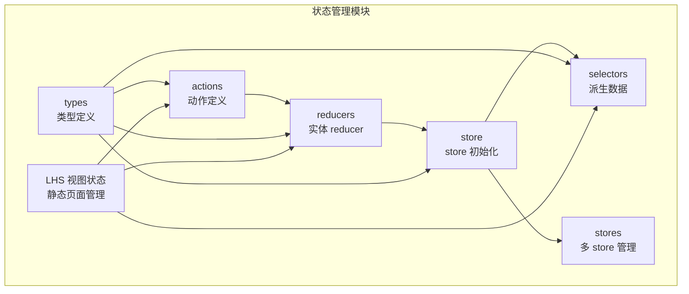

**图表来源**
- [reducers 目录](file://webapp/channels/src/reducers)
- [selectors 目录](file://webapp/channels/src/selectors)
- [actions 目录](file://webapp/channels/src/actions)
- [store 目录](file://webapp/channels/src/store)
- [stores 目录](file://webapp/channels/src/stores)
- [types 目录](file://webapp/channels/src/types)

**章节来源**
- [package.json](file://webapp/package.json#L113)
- [platform/mattermost-redux/package.json:1-38](file://webapp/platform/mattermost-redux/package.json#L1-L38)

## 核心组件
- 动作（Action）：描述"发生了什么"的普通对象或函数，用于触发状态变更。在 Mattermost 中，动作通常通过 Action Creator 组织，类型由 types 下的枚举或常量定义。
- Reducer：纯函数，根据当前状态与动作返回新状态。Mattermost 将 reducer 按实体拆分（用户、频道、消息），并在根 reducer 中进行合并。
- Selector：从全局状态中提取并计算派生数据，支持记忆化与性能优化。Mattermost 提供了丰富的 selector 文件，便于组件高效读取状态。
- Store：Redux store 的初始化与中间件配置，负责连接 reducer、应用中间件（如 thunk）、以及启用开发工具等。
- 类型系统：通过 TypeScript 定义全局状态结构与动作类型，确保编译期安全与 IDE 支持。

**章节来源**
- [reducers 根入口](file://webapp/channels/src/reducers/index.ts)
- [selectors 根入口](file://webapp/channels/src/selectors/index.ts)
- [store 配置](file://webapp/channels/src/store/configureStore.ts)
- [全局类型定义](file://webapp/channels/src/types/app/state.ts)

## 架构总览
下图展示了 Redux 在 Mattermost 中的整体交互流程：组件通过 dispatch 触发动作，动作进入中间件链（如 thunk），随后到达 reducer，reducer 返回新状态，最后通过 selector 计算派生数据并驱动组件渲染。

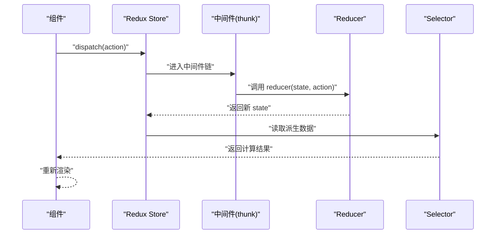

**图表来源**
- [store 配置](file://webapp/channels/src/store/configureStore.ts)
- [reducers 根入口](file://webapp/channels/src/reducers/index.ts)
- [selectors 根入口](file://webapp/channels/src/selectors/index.ts)

## 详细组件分析

### 状态树结构设计
Mattermost 的全局状态树以"实体域"为主干，典型包括：
- 用户域：用户资料、在线状态、权限等
- 频道域：频道列表、成员关系、未读状态等
- 消息域：帖子内容、回复、反应等
- LHS视图域：侧边栏状态、静态页面选择等

这些域在 reducers 中按实体拆分维护，最终在根 reducer 中合并，形成完整的全局状态树。类型系统对每个域的结构进行约束，保证状态的一致性与可追踪性。

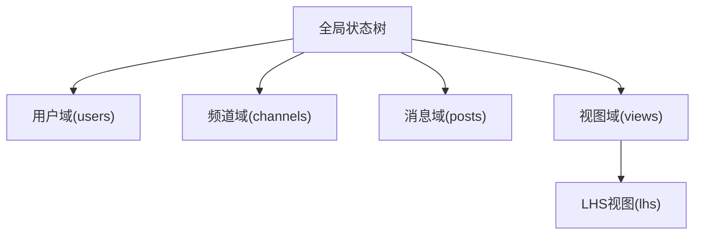

**图表来源**
- [根 reducer 示例](file://webapp/channels/src/reducers/rootReducer.ts)
- [全局状态树快照](file://webapp/channels/src/types/app/state.ts)
- [LHS 视图状态定义](file://webapp/channels/src/types/store/lhs.ts)

**章节来源**
- [根 reducer 示例](file://webapp/channels/src/reducers/rootReducer.ts)
- [全局状态树快照](file://webapp/channels/src/types/app/state.ts)
- [LHS 视图状态定义](file://webapp/channels/src/types/store/lhs.ts)

### Action Creator 设计模式
- 动作类型：通过 types 下的枚举或常量定义，确保类型安全与可维护性。
- 动作创建函数：封装 payload 与元信息，便于在组件中复用。
- 异步动作：使用 thunk 在动作创建函数中发起网络请求、等待响应后 dispatch 同步动作，从而实现异步数据流。

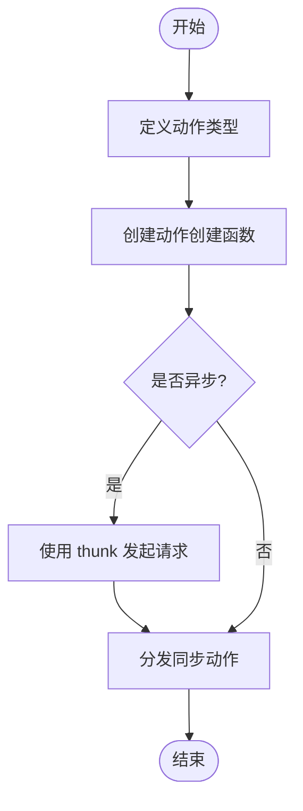

**图表来源**
- [用户动作类型](file://webapp/channels/src/types/users.ts)
- [频道动作类型](file://webapp/channels/src/types/channels.ts)
- [消息动作类型](file://webapp/channels/src/types/posts.ts)
- [频道动作实现](file://webapp/channels/src/actions/channel_actions.ts)
- [用户动作实现](file://webapp/channels/src/actions/user_actions.ts)
- [消息动作实现](file://webapp/channels/src/actions/post_actions.ts)

**章节来源**
- [用户动作类型](file://webapp/channels/src/types/users.ts)
- [频道动作类型](file://webapp/channels/src/types/channels.ts)
- [消息动作类型](file://webapp/channels/src/types/posts.ts)
- [频道动作实现](file://webapp/channels/src/actions/channel_actions.ts)
- [用户动作实现](file://webapp/channels/src/actions/user_actions.ts)
- [消息动作实现](file://webapp/channels/src/actions/post_actions.ts)

### Reducer 设计模式
- 单一职责：每个 reducer 负责一个实体域的状态更新，避免状态耦合。
- 不可变更新：通过浅拷贝或不可变更新策略，返回新对象而非修改旧对象。
- 默认分支：在 switch 中提供默认分支，确保未匹配的动作不影响状态。

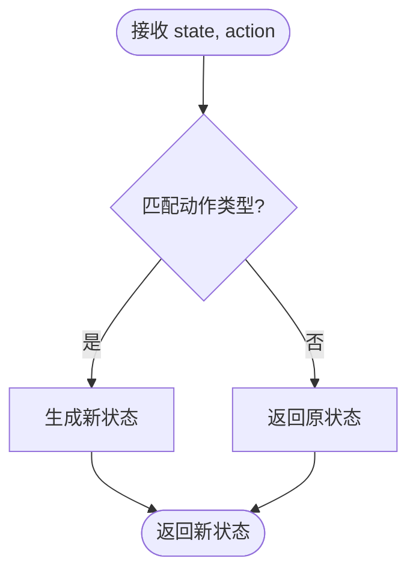

**图表来源**
- [频道 reducer 示例](file://webapp/channels/src/reducers/entities/channels.ts)
- [用户 reducer 示例](file://webapp/channels/src/reducers/entities/users.ts)
- [消息 reducer 示例](file://webapp/channels/src/reducers/entities/posts.ts)
- [LHS reducer 实现](file://webapp/channels/src/reducers/views/lhs.ts)

**章节来源**
- [频道 reducer 示例](file://webapp/channels/src/reducers/entities/channels.ts)
- [用户 reducer 示例](file://webapp/channels/src/reducers/entities/users.ts)
- [消息 reducer 示例](file://webapp/channels/src/reducers/entities/posts.ts)
- [LHS reducer 实现](file://webapp/channels/src/reducers/views/lhs.ts)

### Selector 设计模式
- 计算派生数据：从全局状态中提取并组合数据，减少组件重复逻辑。
- 记忆化：利用 Reselect 等工具实现选择器的记忆化，避免不必要的重算。
- 组合选择器：将多个基础选择器组合为复合选择器，提升复用性与可测试性。

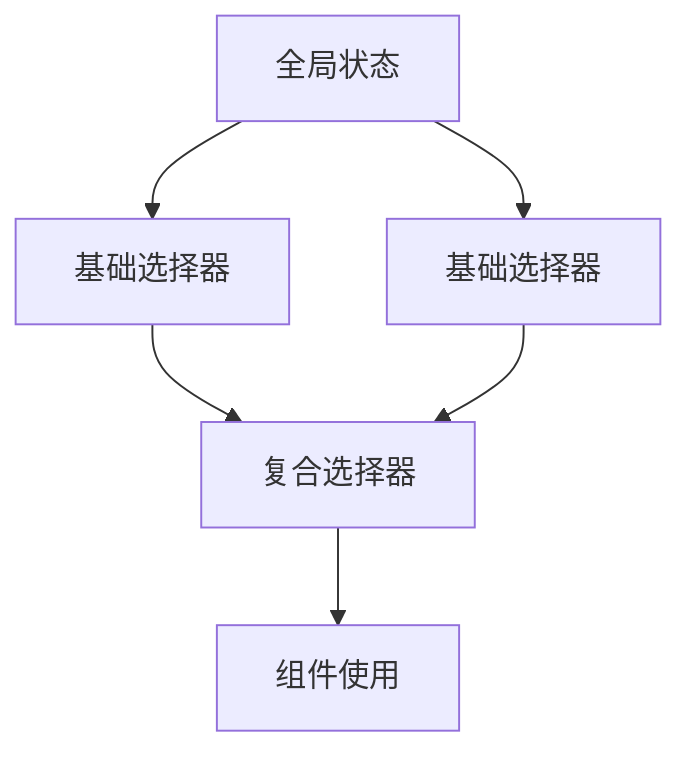

**图表来源**
- [用户选择器示例](file://webapp/channels/src/selectors/users.ts)
- [频道选择器示例](file://webapp/channels/src/selectors/channels.ts)
- [消息选择器示例](file://webapp/channels/src/selectors/posts.ts)
- [LHS 选择器实现](file://webapp/channels/src/selectors/lhs.ts)

**章节来源**
- [用户选择器示例](file://webapp/channels/src/selectors/users.ts)
- [频道选择器示例](file://webapp/channels/src/selectors/channels.ts)
- [消息选择器示例](file://webapp/channels/src/selectors/posts.ts)
- [LHS 选择器实现](file://webapp/channels/src/selectors/lhs.ts)

### 异步操作处理机制（Thunk）
- 使用场景：当需要在动作创建时发起网络请求、等待响应后再更新状态时，采用 thunk。
- 流程：动作创建函数返回一个函数，该函数接收 dispatch 与 getState，执行副作用后分发同步动作。
- 最佳实践：在 thunk 中进行错误处理与加载状态管理，避免在组件中直接处理异步逻辑。

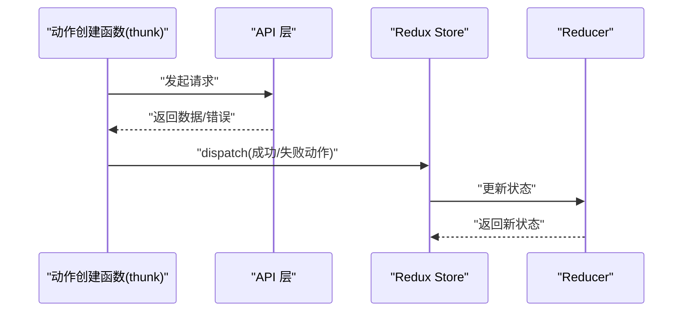

**图表来源**
- [store 配置](file://webapp/channels/src/store/configureStore.ts)
- [频道动作实现](file://webapp/channels/src/actions/channel_actions.ts)
- [用户动作实现](file://webapp/channels/src/actions/user_actions.ts)
- [消息动作实现](file://webapp/channels/src/actions/post_actions.ts)

**章节来源**
- [store 配置](file://webapp/channels/src/store/configureStore.ts)
- [频道动作实现](file://webapp/channels/src/actions/channel_actions.ts)
- [用户动作实现](file://webapp/channels/src/actions/user_actions.ts)
- [消息动作实现](file://webapp/channels/src/actions/post_actions.ts)

### 状态持久化与缓存策略
- 本地存储：通过 localStorage 或 sessionStorage 缓存关键状态片段，提升冷启动性能与离线体验。
- 缓存粒度：优先缓存只读或低频变化的数据（如用户资料、频道列表），避免缓存频繁变动的动态数据。
- 清理策略：设定过期时间或基于版本号的失效机制，防止缓存污染。

**章节来源**
- [持久化与缓存策略](file://webapp/channels/src/utils/localStorage.ts)

### 实际示例：添加新的状态域与处理复杂更新
- 新增领域：在 types 中定义新动作类型与状态结构，在 reducers 中新增对应 reducer，并在根 reducer 中合并。
- 复杂更新：通过组合多个基础选择器构建复合选择器，减少组件中的计算逻辑；在 thunk 中处理多步异步操作与错误回滚。

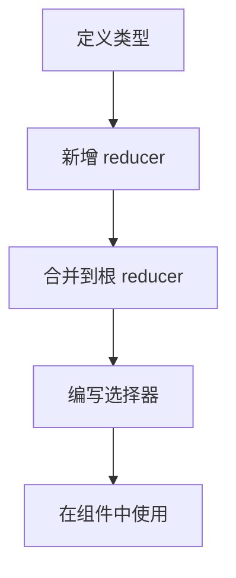

**图表来源**
- [全局类型定义](file://webapp/channels/src/types/app/state.ts)
- [根 reducer 示例](file://webapp/channels/src/reducers/rootReducer.ts)
- [用户选择器示例](file://webapp/channels/src/selectors/users.ts)

**章节来源**
- [全局类型定义](file://webapp/channels/src/types/app/state.ts)
- [根 reducer 示例](file://webapp/channels/src/reducers/rootReducer.ts)
- [用户选择器示例](file://webapp/channels/src/selectors/users.ts)

## 静态页面系统状态管理

### LHS 页面类型扩展
Mattermost 新增了完整的静态页面系统，扩展了 LHS 页面类型，包含以下页面：
- Home：主页
- AIWorkbench：AI工作台
- Tasks：任务管理
- Contacts：联系人
- Meetings：会议日程
- KnowledgeBase：知识库

这些页面类型通过枚举定义，为静态页面路由和状态管理提供了统一的标识符。

**章节来源**
- [LHS 页面类型定义](file://webapp/channels/src/types/store/lhs.ts)

### 静态页面配置与路由
静态页面系统通过配置化的方式管理页面元数据，包括侧边栏菜单标题、主页面标题和描述等。系统支持动态路由生成，每个静态页面都有对应的路由配置。

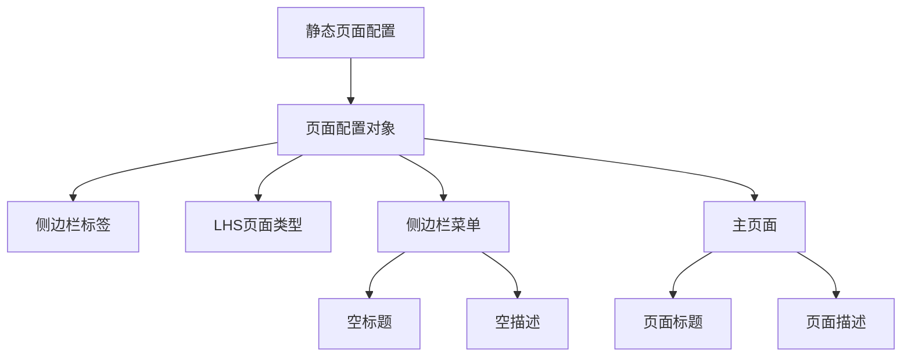

**图表来源**
- [静态页面配置](file://webapp/channels/src/components/sidebar/sidebar_static_pages.ts)

**章节来源**
- [静态页面配置](file://webapp/channels/src/components/sidebar/sidebar_static_pages.ts)

### LHS 视图状态管理
LHS 视图状态包含以下关键属性：
- isOpen：侧边栏打开状态
- size：侧边栏尺寸
- currentStaticPageId：当前选中的静态页面ID

系统提供了相应的 actions、reducers 和 selectors 来管理这些状态。

**章节来源**
- [LHS 视图状态定义](file://webapp/channels/src/types/store/lhs.ts)
- [LHS 动作实现](file://webapp/channels/src/actions/views/lhs.ts)
- [LHS reducer 实现](file://webapp/channels/src/reducers/views/lhs.ts)
- [LHS 选择器实现](file://webapp/channels/src/selectors/lhs.ts)

### 静态页面路由状态管理
静态页面路由通过 React Router 实现，支持动态路径匹配和页面切换。系统为每个静态页面生成对应的路由规则，并支持知识库的特殊路由映射。

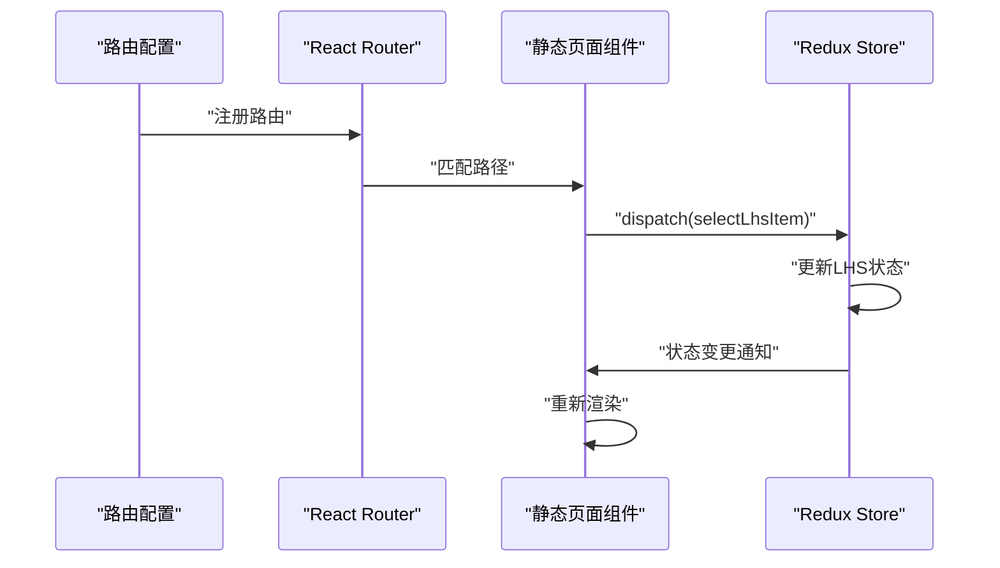

**图表来源**
- [静态页面路由](file://webapp/channels/src/components/static_page/static_page_routes.tsx)
- [静态页面组件](file://webapp/channels/src/components/static_page/static_page.tsx)

**章节来源**
- [静态页面路由](file://webapp/channels/src/components/static_page/static_page_routes.tsx)
- [静态页面组件](file://webapp/channels/src/components/static_page/static_page.tsx)

## 依赖分析
- 依赖来源：Mattermost 前端通过平台级 mattermost-redux 提供统一的 Redux 工具与类型，降低重复实现成本。
- ESLint 规则：提供禁止在 dispatch 中传入 getState 的规则，避免不必要依赖与潜在性能问题。

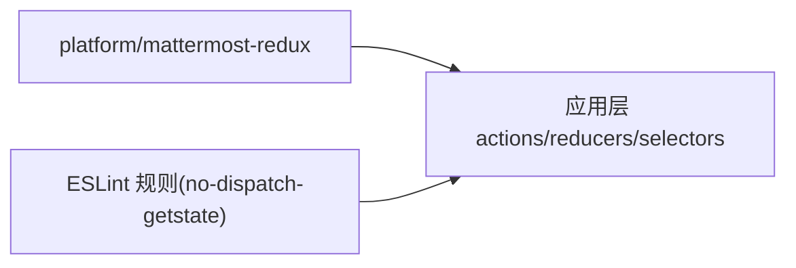

**图表来源**
- [package.json](file://webapp/package.json#L113)
- [platform/mattermost-redux/package.json:1-38](file://webapp/platform/mattermost-redux/package.json#L1-L38)
- [no-dispatch-getstate.js](file://webapp/platform/eslint-plugin/rules/no-dispatch-getstate.js)

**章节来源**
- [package.json](file://webapp/package.json#L113)
- [platform/mattermost-redux/package.json:1-38](file://webapp/platform/mattermost-redux/package.json#L1-L38)
- [no-dispatch-getstate.js:1-35](file://webapp/platform/eslint-plugin/rules/no-dispatch-getstate.js#L1-L35)

## 性能考量
- 选择器记忆化：使用记忆化选择器减少重复计算，提升渲染性能。
- 批量更新：利用批量更新策略减少多次小更新带来的重渲染。
- 精准订阅：仅订阅组件所需的状态片段，避免不必要的重渲染。
- 异步节流：在 thunk 中对高频请求进行节流或去抖，降低网络压力。
- 路由懒加载：静态页面组件采用懒加载策略，减少初始包体积。

## 故障排查指南
- 调试 Redux：在开发环境下启用 Redux DevTools，观察动作与状态变化。
- 常见问题：
  - 动作未生效：检查动作类型是否正确、reducer 是否处理该类型。
  - 选择器性能问题：确认是否使用记忆化、输入是否稳定。
  - 异步错误：在 thunk 中捕获错误并分发错误动作，避免静默失败。
  - 静态页面不显示：检查路由配置、页面类型定义和组件加载。
- 代码规范：遵循 ESLint 规则，避免在 dispatch 中传入 getState，保持动作的纯净性。

**章节来源**
- [react_testing_utils.test.tsx:313-342](file://webapp/channels/src/tests/react_testing_utils.test.tsx#L313-L342)
- [no-dispatch-getstate.js:1-35](file://webapp/platform/eslint-plugin/rules/no-dispatch-getstate.js#L1-L35)

## 结论
Mattermost 的状态管理以 Redux 为核心，结合清晰的模块划分（动作、reducer、selector、store）与严格的类型系统，实现了高可维护性与可扩展性。通过 thunk 处理异步、选择器实现派生数据与记忆化、以及持久化策略提升性能，整体方案既适合中小型功能迭代，也能支撑复杂业务场景的演进。

**更新** 新增的静态页面系统进一步增强了状态管理能力，通过配置化的页面管理和路由系统，为用户提供了更加灵活和可扩展的界面布局选项。LHS 视图状态的引入使得静态页面的导航和状态管理变得更加直观和高效。

## 附录
- 快速上手清单
  - 在 types 中定义动作类型与状态结构
  - 在 reducers 中实现对应 reducer 并合并到根 reducer
  - 在 selectors 中编写选择器并启用记忆化
  - 在 actions 中创建动作创建函数，必要时使用 thunk
  - 在 store 中配置中间件与开发工具
  - 使用 localStorage 进行关键状态的持久化与缓存
  - 配置静态页面类型和路由规则
  - 实现静态页面组件和状态管理逻辑