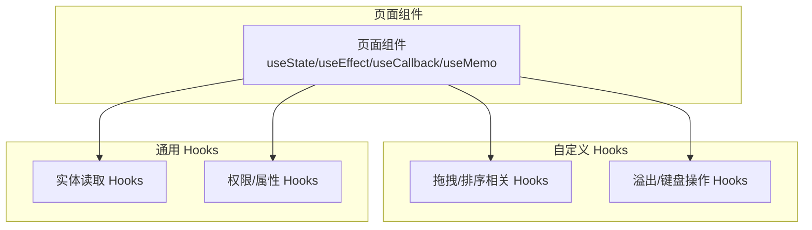
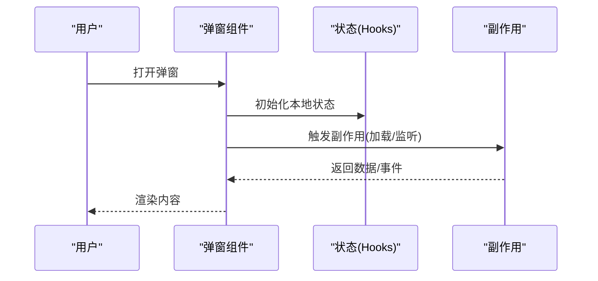
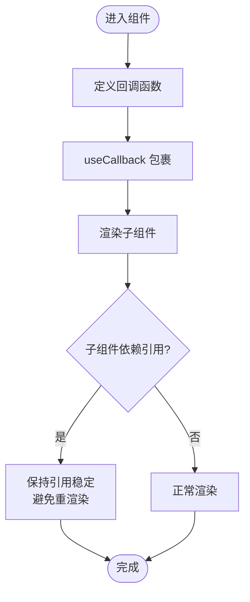
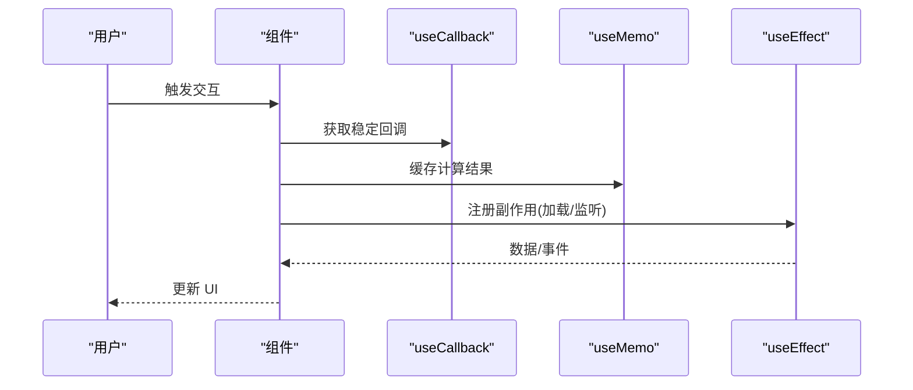
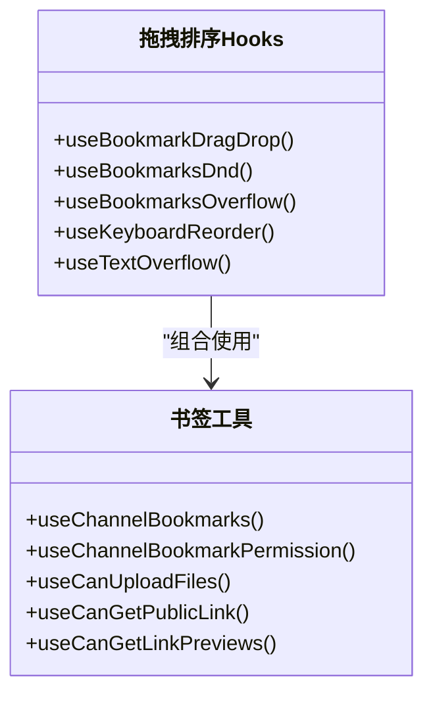
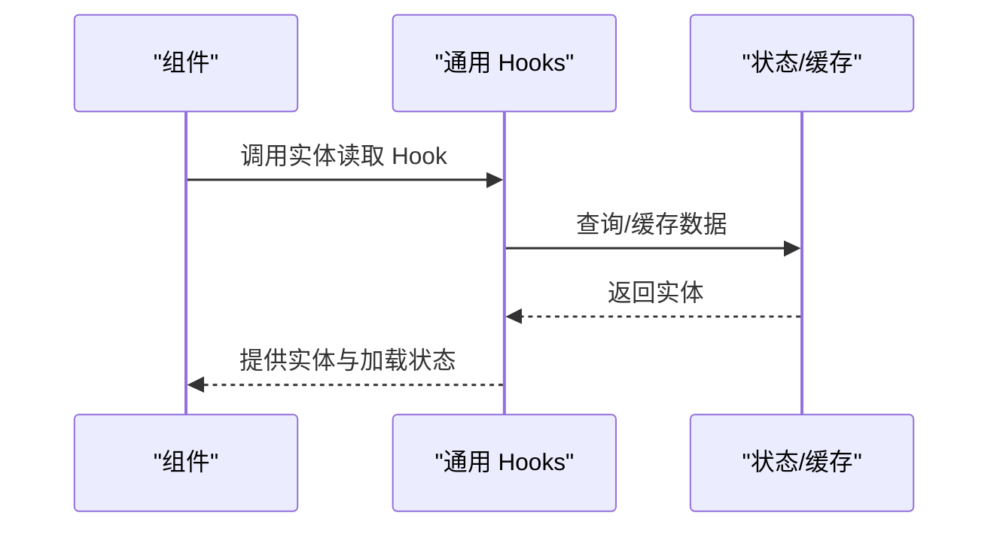
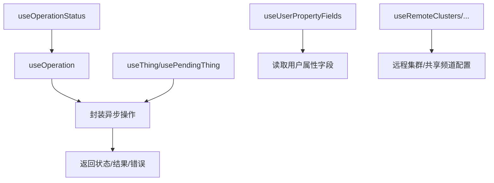
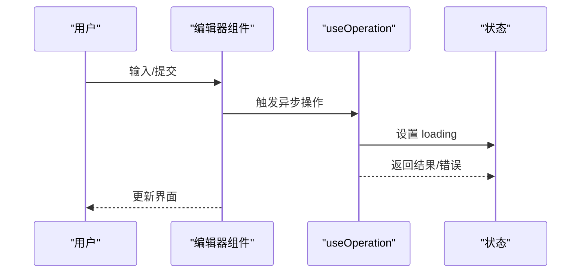
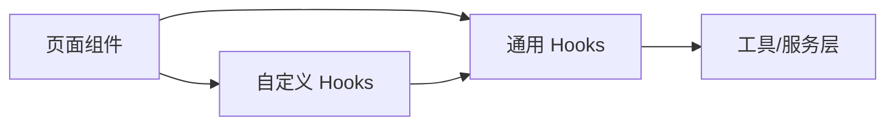

# Hooks 使用指南

<cite>
**本文引用的文件**
- [about_build_modal.tsx](file://webapp/channels/src/components/about_build_modal/about_build_modal.tsx)
- [access_history_modal.tsx](file://webapp/channels/src/components/access_history_modal/access_history_modal.tsx)
- [actions_menu_tutorial_tip.tsx](file://webapp/channels/src/components/actions_menu/actions_menu_tutorial_tip.tsx)
- [popover.tsx](file://webapp/channels/src/components/actions_menu/popover.tsx)
- [activity_log_modal.tsx](file://webapp/channels/src/components/activity_log_modal/activity_log_modal.tsx)
- [add_users_to_group_modal.tsx](file://webapp/channels/src/components/add_users_to_group_modal/add_users_to_group_modal.tsx)
- [editor.tsx](file://webapp/channels/src/components/admin_console/access_control/editors/cel_editor/editor.tsx)
- [utils.ts（安全连接）](file://webapp/channels/src/components/admin_console/secure_connections/utils.ts)
- [section_utils.ts](file://webapp/channels/src/components/admin_console/system_properties/section_utils.ts)
- [user_properties_utils.ts](file://webapp/channels/src/components/admin_console/system_properties/user_properties_utils.ts)
- [use_bookmark_drag_drop.ts](file://webapp/channels/src/components/channel_bookmarks/hooks/use_bookmark_drag_drop.ts)
- [use_bookmarks_dnd.ts](file://webapp/channels/src/components/channel_bookmarks/hooks/use_bookmarks_dnd.ts)
- [use_bookmarks_overflow.ts](file://webapp/channels/src/components/channel_bookmarks/hooks/use_bookmarks_overflow.ts)
- [use_keyboard_reorder.ts](file://webapp/channels/src/components/channel_bookmarks/hooks/use_keyboard_reorder.ts)
- [use_text_overflow.ts](file://webapp/channels/src/components/channel_bookmarks/hooks/use_text_overflow.ts)
- [utils.ts（书签工具）](file://webapp/channels/src/components/channel_bookmarks/utils.ts)
- [content_flagging.ts](file://webapp/channels/src/components/common/hooks/content_flagging.ts)
- [useAccessControlAttributes.ts](file://webapp/channels/src/components/common/hooks/useAccessControlAttributes.ts)
- [react_testing_utils.test.tsx](file://webapp/channels/src/tests/react_testing_utils.test.tsx)
</cite>

## 目录
1. 引言
2. 项目结构
3. 核心组件
4. 架构总览
5. 详细组件分析
6. 依赖关系分析
7. 性能考量
8. 故障排查指南
9. 结论
10. 附录

## 引言
本指南面向在 Mattermost Web 应用中使用 React Hooks 的开发者，系统讲解 useState、useEffect、useContext、useReducer 等核心 Hooks 的使用场景与最佳实践；深入剖析自定义 Hooks 的设计与实现模式；总结 Hook 组合使用的策略；并结合仓库中的真实组件，给出 useMemo、useCallback 的性能优化范式、异步数据获取与状态更新的处理方式，以及常见业务场景的实现思路。

## 项目结构
Mattermost Web 应用采用多包/多模块组织方式，前端核心位于 webapp/channels/src。Hooks 的使用主要分布在以下位置：
- 组件层：大量函数组件通过 useState/useEffect/useCallback/useMemo 管理本地状态与副作用
- 自定义 Hooks 层：在 components/*/hooks 下封装可复用的状态逻辑与交互行为
- 通用 Hooks 层：在 components/common/hooks 下提供跨页面/功能域的实体读取与权限控制等能力
- 工具与服务层：在 components/*/utils 中提供基于自定义 Hooks 的业务工具方法

下面以概念图展示 Hooks 在项目中的分布与职责：

```mermaid
graph TB
subgraph "组件层"
A1["about_build_modal.tsx<br/>useState/useEffect"]
A2["access_history_modal.tsx<br/>useEffect"]
A3["actions_menu_tutorial_tip.tsx<br/>useCallback"]
A4["popover.tsx<br/>useCallback"]
A5["activity_log_modal.tsx<br/>useCallback/useMemo/useEffect"]
A6["add_users_to_group_modal.tsx<br/>useState/useCallback/useMemo/useRef"]
A7["editor.tsx<br/>useCallback/useEffect/useRef/useState/useMemo"]
end
subgraph "自定义 Hooks 层"
B1["use_bookmark_drag_drop.ts"]
B2["use_bookmarks_dnd.ts"]
B3["use_bookmarks_overflow.ts"]
B4["use_keyboard_reorder.ts"]
B5["use_text_overflow.ts"]
B6["utils.ts书签工具<br/>useChannelBookmarks 等"]
end
subgraph "通用 Hooks 层"
C1["content_flagging.ts<br/>makeUseEntity 系列"]
C2["useAccessControlAttributes.ts"]
end
subgraph "系统属性与安全连接"
D1["section_utils.ts<br/>useOperationStatus/useOperation 等"]
D2["user_properties_utils.ts<br/>useUserPropertyFields"]
D3["utils.ts安全连接<br/>useRemoteClusters 等"]
end
A1 --> B6
A5 --> C1
A6 --> B1
A7 --> D1
A7 --> D3
```

## 核心组件
本节聚焦于仓库中体现的核心 Hooks 使用模式与最佳实践，涵盖本地状态管理、副作用处理、回调与计算缓存、以及自定义 Hooks 的设计。

- useState：用于组件内部可变状态的声明与更新，常见于弹窗、表单、输入框等交互场景
- useEffect：用于处理副作用，如数据加载、订阅清理、DOM 变更监听
- useCallback：用于稳定回调引用，避免子组件不必要重渲染
- useMemo：用于稳定计算结果，减少昂贵计算或深层比较成本
- useRef：用于持有可变值或访问 DOM 节点
- 自定义 Hooks：将可复用的状态逻辑抽取为独立单元，提升可测试性与可维护性

章节来源
- [about_build_modal.tsx:3-60](file://webapp/channels/src/components/about_build_modal/about_build_modal.tsx#L3-L60)
- [access_history_modal.tsx:3-40](file://webapp/channels/src/components/access_history_modal/access_history_modal.tsx#L3-L40)
- [actions_menu_tutorial_tip.tsx:3-50](file://webapp/channels/src/components/actions_menu/actions_menu_tutorial_tip.tsx#L3-L50)
- [popover.tsx:6-50](file://webapp/channels/src/components/actions_menu/popover.tsx#L6-L50)
- [activity_log_modal.tsx:3-90](file://webapp/channels/src/components/activity_log_modal/activity_log_modal.tsx#L3-L90)
- [add_users_to_group_modal.tsx:3-120](file://webapp/channels/src/components/add_users_to_group_modal/add_users_to_group_modal.tsx#L3-L120)
- [editor.tsx:4-160](file://webapp/channels/src/components/admin_console/access_control/editors/cel_editor/editor.tsx#L4-L160)

## 架构总览
下图展示了 Hooks 在典型页面中的调用链路与协作关系，体现“组件层 Hooks”、“自定义 Hooks 层”、“通用 Hooks 层”的分层职责与交互。

图表来源
- [add_users_to_group_modal.tsx:3-120](file://webapp/channels/src/components/add_users_to_group_modal/add_users_to_group_modal.tsx#L3-L120)
- [use_bookmark_drag_drop.ts:27-60](file://webapp/channels/src/components/channel_bookmarks/hooks/use_bookmark_drag_drop.ts#L27-L60)
- [use_keyboard_reorder.ts:44-80](file://webapp/channels/src/components/channel_bookmarks/hooks/use_keyboard_reorder.ts#L44-L80)
- [content_flagging.ts:24-40](file://webapp/channels/src/components/common/hooks/content_flagging.ts#L24-L40)
- [useAccessControlAttributes.ts:115-140](file://webapp/channels/src/components/common/hooks/useAccessControlAttributes.ts#L115-L140)

## 详细组件分析

### 本地状态与副作用：弹窗与历史记录
- about_build_modal：演示了 useState 与 useEffect 的基础组合，用于初始化与生命周期管理
- access_history_modal：通过 useEffect 处理依赖项变化时的历史数据加载与清理

图表来源
- [about_build_modal.tsx:3-60](file://webapp/channels/src/components/about_build_modal/about_build_modal.tsx#L3-L60)
- [access_history_modal.tsx:3-40](file://webapp/channels/src/components/access_history_modal/access_history_modal.tsx#L3-L40)

章节来源
- [about_build_modal.tsx:3-60](file://webapp/channels/src/components/about_build_modal/about_build_modal.tsx#L3-L60)
- [access_history_modal.tsx:3-40](file://webapp/channels/src/components/access_history_modal/access_history_modal.tsx#L3-L40)

### 回调稳定化与性能优化：菜单与气泡
- actions_menu_tutorial_tip：通过 useCallback 包裹事件处理器，避免子组件因引用变化而重复渲染
- popover：同样使用 useCallback 封装关闭逻辑，确保事件回调引用稳定

图表来源
- [actions_menu_tutorial_tip.tsx:3-50](file://webapp/channels/src/components/actions_menu/actions_menu_tutorial_tip.tsx#L3-L50)
- [popover.tsx:6-50](file://webapp/channels/src/components/actions_menu/popover.tsx#L6-L50)

章节来源
- [actions_menu_tutorial_tip.tsx:3-50](file://webapp/channels/src/components/actions_menu/actions_menu_tutorial_tip.tsx#L3-L50)
- [popover.tsx:6-50](file://webapp/channels/src/components/actions_menu/popover.tsx#L6-L50)

### 计算缓存与复杂副作用：活动日志与群组添加
- activity_log_modal：结合 useCallback/useMemo/useEffect，对提交动作、列表计算与副作用进行精细化控制
- add_users_to_group_modal：集中使用 useState/useCallback/useMemo/useRef 管理复杂交互与表单状态

图表来源
- [activity_log_modal.tsx:3-90](file://webapp/channels/src/components/activity_log_modal/activity_log_modal.tsx#L3-L90)
- [add_users_to_group_modal.tsx:3-120](file://webapp/channels/src/components/add_users_to_group_modal/add_users_to_group_modal.tsx#L3-L120)

章节来源
- [activity_log_modal.tsx:3-90](file://webapp/channels/src/components/activity_log_modal/activity_log_modal.tsx#L3-L90)
- [add_users_to_group_modal.tsx:3-120](file://webapp/channels/src/components/add_users_to_group_modal/add_users_to_group_modal.tsx#L3-L120)

### 自定义 Hooks：拖拽、排序与溢出检测
- use_bookmark_drag_drop/use_bookmarks_dnd/use_bookmarks_overflow/use_keyboard_reorder/use_text_overflow：将交互逻辑抽象为独立 Hooks，便于复用与测试
- utils.ts（书签工具）：导出 useChannelBookmarks 等，封装权限与能力判断

图表来源
- [use_bookmark_drag_drop.ts:27-60](file://webapp/channels/src/components/channel_bookmarks/hooks/use_bookmark_drag_drop.ts#L27-L60)
- [use_bookmarks_dnd.ts:46-80](file://webapp/channels/src/components/channel_bookmarks/hooks/use_bookmarks_dnd.ts#L46-L80)
- [use_bookmarks_overflow.ts:67-100](file://webapp/channels/src/components/channel_bookmarks/hooks/use_bookmarks_overflow.ts#L67-L100)
- [use_keyboard_reorder.ts:44-80](file://webapp/channels/src/components/channel_bookmarks/hooks/use_keyboard_reorder.ts#L44-L80)
- [use_text_overflow.ts:13-30](file://webapp/channels/src/components/channel_bookmarks/hooks/use_text_overflow.ts#L13-L30)
- [utils.ts（书签工具）:49-120](file://webapp/channels/src/components/channel_bookmarks/utils.ts#L49-L120)

章节来源
- [use_bookmark_drag_drop.ts:27-60](file://webapp/channels/src/components/channel_bookmarks/hooks/use_bookmark_drag_drop.ts#L27-L60)
- [use_bookmarks_dnd.ts:46-80](file://webapp/channels/src/components/channel_bookmarks/hooks/use_bookmarks_dnd.ts#L46-L80)
- [use_bookmarks_overflow.ts:67-100](file://webapp/channels/src/components/channel_bookmarks/hooks/use_bookmarks_overflow.ts#L67-L100)
- [use_keyboard_reorder.ts:44-80](file://webapp/channels/src/components/channel_bookmarks/hooks/use_keyboard_reorder.ts#L44-L80)
- [use_text_overflow.ts:13-30](file://webapp/channels/src/components/channel_bookmarks/hooks/use_text_overflow.ts#L13-L30)
- [utils.ts（书签工具）:49-120](file://webapp/channels/src/components/channel_bookmarks/utils.ts#L49-L120)

### 通用 Hooks：实体读取与权限属性
- content_flagging.ts：通过 makeUseEntity 系列导出 useGetFlaggedPost/useGetContentFlaggingChannel/useGetContentFlaggingTeam，统一处理实体读取
- useAccessControlAttributes.ts：提供访问控制属性的读取与转换逻辑

图表来源
- [content_flagging.ts:24-40](file://webapp/channels/src/components/common/hooks/content_flagging.ts#L24-L40)
- [useAccessControlAttributes.ts:115-140](file://webapp/channels/src/components/common/hooks/useAccessControlAttributes.ts#L115-L140)

章节来源
- [content_flagging.ts:24-40](file://webapp/channels/src/components/common/hooks/content_flagging.ts#L24-L40)
- [useAccessControlAttributes.ts:115-140](file://webapp/channels/src/components/common/hooks/useAccessControlAttributes.ts#L115-L140)

### 系统属性与安全连接：操作状态与远程集群
- section_utils.ts：提供 useOperationStatus/useOperation/useThing/usePendingThing 等，封装异步操作的状态管理与错误处理
- user_properties_utils.ts：提供 useUserPropertyFields，统一读取用户属性字段
- utils.ts（安全连接）：提供 useRemoteClusters/useRemoteClusterEdit/useSharedChannelRemotes/useSharedChannelRemoteRows/useTeamOptions 等，支撑远程集群与共享频道配置

图表来源
- [section_utils.ts:41-120](file://webapp/channels/src/components/admin_console/system_properties/section_utils.ts#L41-L120)
- [user_properties_utils.ts:25-40](file://webapp/channels/src/components/admin_console/system_properties/user_properties_utils.ts#L25-L40)
- [utils.ts（安全连接）:20-260](file://webapp/channels/src/components/admin_console/secure_connections/utils.ts#L20-L260)

章节来源
- [section_utils.ts:41-120](file://webapp/channels/src/components/admin_console/system_properties/section_utils.ts#L41-L120)
- [user_properties_utils.ts:25-40](file://webapp/channels/src/components/admin_console/system_properties/user_properties_utils.ts#L25-L40)
- [utils.ts（安全连接）:20-260](file://webapp/channels/src/components/admin_console/secure_connections/utils.ts#L20-L260)

### 异步数据获取与状态更新：编辑器与系统属性
- editor.tsx：集中使用 useState/useCallback/useEffect/useRef/useMemo 管理复杂编辑器状态、输入处理与副作用
- section_utils.ts：通过 useOperation 将异步操作封装为 Hook，统一处理 loading/error/success 状态

图表来源
- [editor.tsx:4-160](file://webapp/channels/src/components/admin_console/access_control/editors/cel_editor/editor.tsx#L4-L160)
- [section_utils.ts:63-100](file://webapp/channels/src/components/admin_console/system_properties/section_utils.ts#L63-L100)

章节来源
- [editor.tsx:4-160](file://webapp/channels/src/components/admin_console/access_control/editors/cel_editor/editor.tsx#L4-L160)
- [section_utils.ts:63-100](file://webapp/channels/src/components/admin_console/system_properties/section_utils.ts#L63-L100)

## 依赖关系分析
- 组件层对自定义 Hooks 的依赖：页面组件通过导入自定义 Hooks 实现交互与状态逻辑
- 自定义 Hooks 对通用 Hooks 的依赖：自定义 Hooks 常常组合使用通用 Hooks（如实体读取、权限属性）
- 通用 Hooks 对工具与服务层的依赖：通用 Hooks 内部可能调用工具函数或服务接口

图表来源
- [add_users_to_group_modal.tsx:3-120](file://webapp/channels/src/components/add_users_to_group_modal/add_users_to_group_modal.tsx#L3-L120)
- [use_bookmark_drag_drop.ts:27-60](file://webapp/channels/src/components/channel_bookmarks/hooks/use_bookmark_drag_drop.ts#L27-L60)
- [content_flagging.ts:24-40](file://webapp/channels/src/components/common/hooks/content_flagging.ts#L24-L40)

## 性能考量
- 使用 useCallback 稳定回调引用，避免子组件因 props 引用变化而重渲染
- 使用 useMemo 缓存昂贵计算或深层比较结果，降低渲染成本
- 合理拆分副作用，将无关逻辑分离到独立 useEffect，避免不必要的依赖数组变更
- 使用 useRef 存储可变值或 DOM 引用，避免将其纳入依赖数组导致的重渲染
- 自定义 Hooks 抽象公共逻辑，提升复用性与可测性，间接改善性能与维护性

章节来源
- [actions_menu_tutorial_tip.tsx:3-50](file://webapp/channels/src/components/actions_menu/actions_menu_tutorial_tip.tsx#L3-L50)
- [popover.tsx:6-50](file://webapp/channels/src/components/actions_menu/popover.tsx#L6-L50)
- [activity_log_modal.tsx:3-90](file://webapp/channels/src/components/activity_log_modal/activity_log_modal.tsx#L3-L90)
- [add_users_to_group_modal.tsx:3-120](file://webapp/channels/src/components/add_users_to_group_modal/add_users_to_group_modal.tsx#L3-L120)
- [editor.tsx:4-160](file://webapp/channels/src/components/admin_console/access_control/editors/cel_editor/editor.tsx#L4-L160)

## 故障排查指南
- 测试中验证 Redux 行为：通过测试用例验证 useSelector/useDispatch 的组合使用是否正确触发状态更新与重新渲染
- 弹窗与模态控制器：通过测试用例验证模态控制器的打开/关闭流程与状态同步
- 回调稳定性：若出现意外重渲染，优先检查是否遗漏 useCallback 包裹事件处理器
- 计算缓存：若计算密集型逻辑导致卡顿，优先考虑 useMemo 缓存结果
- 副作用清理：确保 useEffect 返回清理函数，避免内存泄漏与重复订阅

章节来源
- [react_testing_utils.test.tsx:192-349](file://webapp/channels/src/tests/react_testing_utils.test.tsx#L192-L349)

## 结论
通过对 Mattermost Web 应用中 Hooks 使用的真实案例分析，可以总结出以下关键实践：
- 将本地状态与副作用分离，优先使用自定义 Hooks 抽象复杂交互
- 使用 useCallback/useMemo 稳定引用与缓存计算，提升渲染性能
- 将异步操作封装为通用 Hooks，统一处理状态与错误
- 在大型页面中分层组织 Hooks，明确职责边界，增强可维护性

## 附录
- 常见业务场景建议
  - 表单与弹窗：使用 useState 管理输入与可见性，useEffect 处理加载与校验，useCallback 稳定回调
  - 列表与拖拽：使用自定义 Hooks 管理拖拽状态与排序，结合 useMemo 优化渲染
  - 权限与实体：通过通用 Hooks 读取权限与实体信息，避免在组件内重复实现
  - 系统配置：使用 useOperation 系列管理异步保存流程，统一状态反馈