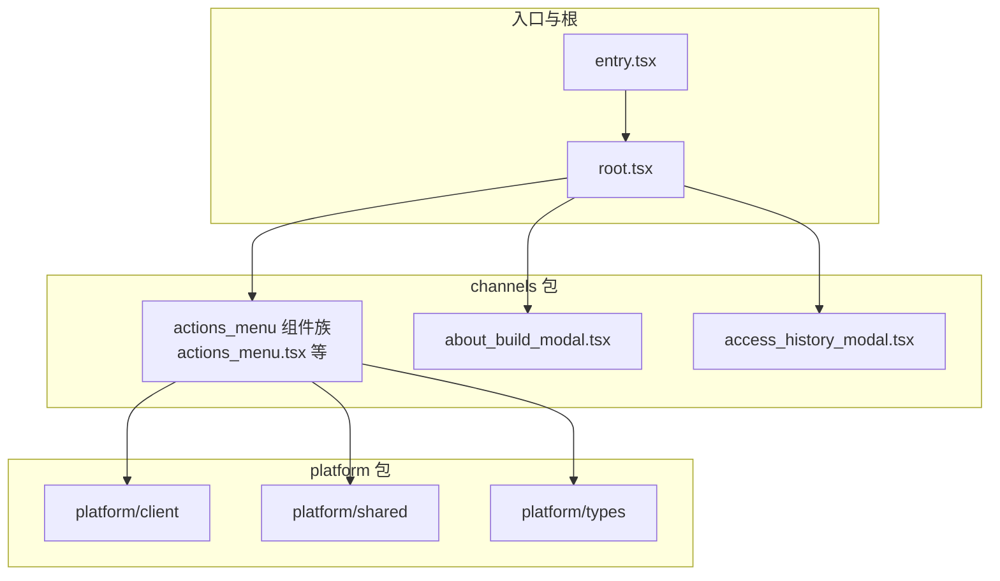
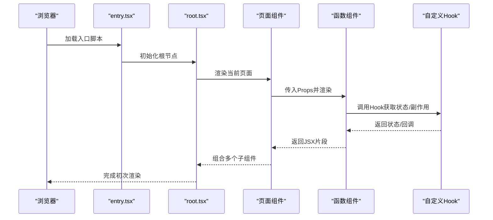
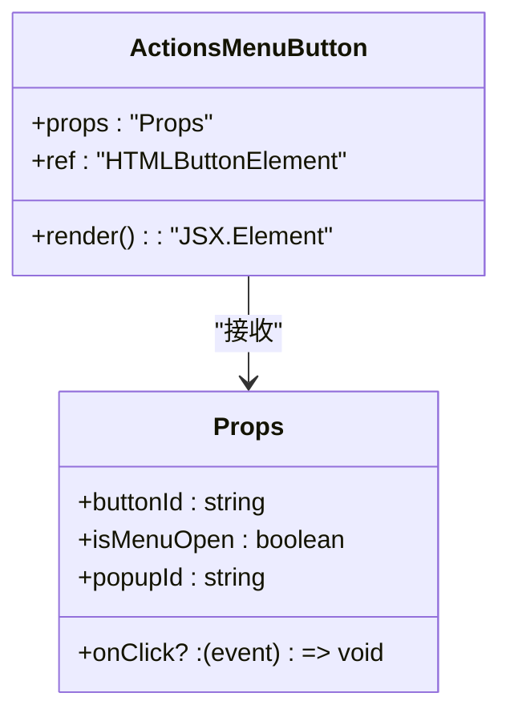
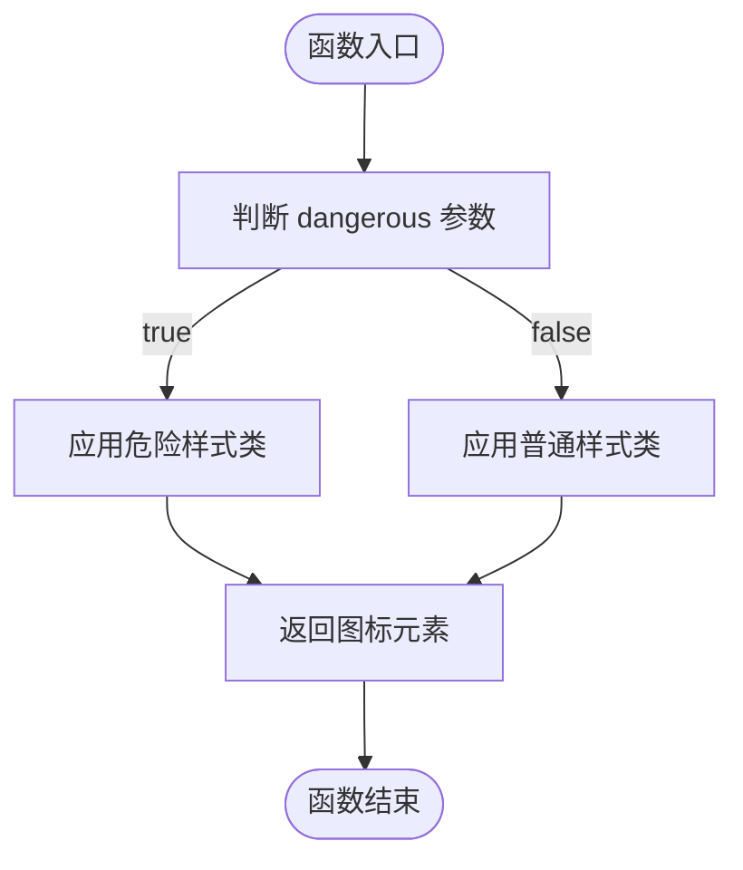
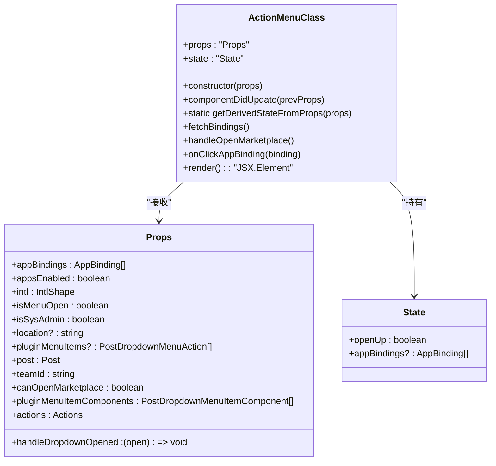
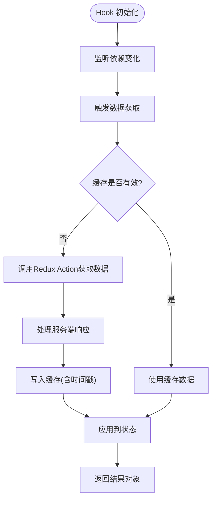
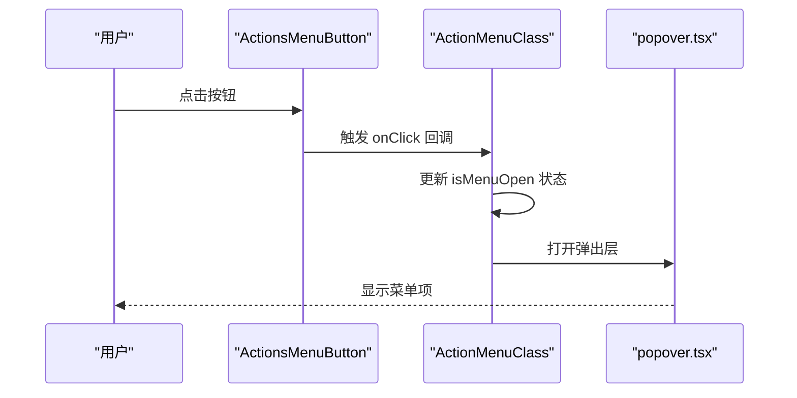
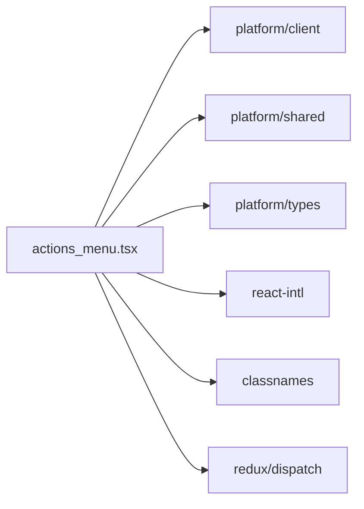

# 函数组件开发

<cite>
**本文引用的文件**
- [webapp/channels/src/components/actions_menu/actions_menu.tsx](file://webapp/channels/src/components/actions_menu/actions_menu.tsx)
- [webapp/channels/src/components/actions_menu/actions_menu_button.tsx](file://webapp/channels/src/components/actions_menu/actions_menu_button.tsx)
- [webapp/channels/src/components/actions_menu/actions_menu_icon.tsx](file://webapp/channels/src/components/actions_menu/actions_menu_icon.tsx)
- [webapp/channels/src/components/common/hooks/useAccessControlAttributes.ts](file://webapp/channels/src/components/common/hooks/useAccessControlAttributes.ts)
- [webapp/platform/client/src/index.tsx](file://webapp/platform/client/src/index.tsx)
- [webapp/platform/shared/src/index.ts](file://webapp/platform/shared/src/index.ts)
- [webapp/platform/types/src/index.ts](file://webapp/platform/types/src/index.ts)
- [webapp/channels/src/root.tsx](file://webapp/channels/src/root.tsx)
- [webapp/channels/src/entry.tsx](file://webapp/channels/src/entry.tsx)
- [webapp/channels/src/components/about_build_modal/about_build_modal.tsx](file://webapp/channels/src/components/about_build_modal/about_build_modal.tsx)
- [webapp/channels/src/components/access_history_modal/access_history_modal.tsx](file://webapp/channels/src/components/access_history_modal/access_history_modal.tsx)
- [webapp/channels/src/components/actions_menu/popover.tsx](file://webapp/channels/src/components/actions_menu/popover.tsx)
- [webapp/channels/src/components/actions_menu/index.test.tsx](file://webapp/channels/src/components/actions_menu/index.test.tsx)
</cite>

## 目录
1. [引言](#引言)
2. [项目结构](#项目结构)
3. [核心组件](#核心组件)
4. [架构总览](#架构总览)
5. [详细组件分析](#详细组件分析)
6. [依赖分析](#依赖分析)
7. [性能考虑](#性能考虑)
8. [故障排查指南](#故障排查指南)
9. [结论](#结论)
10. [附录](#附录)

## 引言
本指南面向在 Mattermost Web 应用中进行函数组件开发的工程师与技术作者，系统阐述函数组件的设计原则、实现模式（纯函数组件与带状态组件）、Props 类型定义与接口设计、TypeScript 类型约束最佳实践、渲染逻辑与 JSX 使用、参数传递与返回值处理，并通过仓库中的真实组件示例展示可复用函数组件的构建方法。同时给出组件命名约定与文件组织建议，帮助团队在大型前端工程中保持一致的开发风格与可维护性。

## 项目结构
Mattermost 的前端采用多包/多入口的组织方式：channels 包承载主应用界面与组件；platform 包提供客户端、共享组件与类型定义；入口文件负责挂载与运行时初始化。下图展示了与函数组件开发相关的关键路径与模块关系。

图表来源
- [webapp/channels/src/entry.tsx](file://webapp/channels/src/entry.tsx)
- [webapp/channels/src/root.tsx](file://webapp/channels/src/root.tsx)
- [webapp/channels/src/components/actions_menu/actions_menu.tsx](file://webapp/channels/src/components/actions_menu/actions_menu.tsx)
- [webapp/channels/src/components/about_build_modal/about_build_modal.tsx](file://webapp/channels/src/components/about_build_modal/about_build_modal.tsx)
- [webapp/channels/src/components/access_history_modal/access_history_modal.tsx](file://webapp/channels/src/components/access_history_modal/access_history_modal.tsx)
- [webapp/platform/client/src/index.tsx](file://webapp/platform/client/src/index.tsx)
- [webapp/platform/shared/src/index.ts](file://webapp/platform/shared/src/index.ts)
- [webapp/platform/types/src/index.ts](file://webapp/platform/types/src/index.ts)

章节来源
- [webapp/channels/src/entry.tsx](file://webapp/channels/src/entry.tsx)
- [webapp/channels/src/root.tsx](file://webapp/channels/src/root.tsx)

## 核心组件
本节聚焦两类函数组件的实现要点与差异：
- 纯函数组件：无内部状态，仅接收 Props 并返回 JSX，适合表现层与轻量交互。
- 带状态组件：内部使用 useState/useReducer 或 Hook，适合需要本地状态管理的场景。

在 Mattermost 中，既有以函数形式导出的纯函数组件，也有以类组件形式导出的带状态组件。以下小节将结合仓库中的真实文件进行对比说明。

章节来源
- [webapp/channels/src/components/actions_menu/actions_menu_button.tsx](file://webapp/channels/src/components/actions_menu/actions_menu_button.tsx)
- [webapp/channels/src/components/actions_menu/actions_menu_icon.tsx](file://webapp/channels/src/components/actions_menu/actions_menu_icon.tsx)
- [webapp/channels/src/components/actions_menu/actions_menu.tsx](file://webapp/channels/src/components/actions_menu/actions_menu.tsx)

## 架构总览
下图展示了从入口到组件的调用链路与数据流：入口文件挂载根节点，根节点根据路由或上下文渲染具体页面组件；页面组件组合多个函数/类组件，形成可复用的 UI 模块。

图表来源
- [webapp/channels/src/entry.tsx](file://webapp/channels/src/entry.tsx)
- [webapp/channels/src/root.tsx](file://webapp/channels/src/root.tsx)
- [webapp/channels/src/components/actions_menu/actions_menu.tsx](file://webapp/channels/src/components/actions_menu/actions_menu.tsx)
- [webapp/channels/src/components/common/hooks/useAccessControlAttributes.ts](file://webapp/channels/src/components/common/hooks/useAccessControlAttributes.ts)

## 详细组件分析

### 纯函数组件：动作菜单按钮（ActionsMenuButton）
该组件为纯函数组件，使用 forwardRef 接收外部 ref，接收 buttonId、onClick、isMenuOpen、popupId 等 Props，内部通过国际化与样式工具生成按钮元素。它体现了“只读渲染、最小状态”的函数式思想。

图表来源
- [webapp/channels/src/components/actions_menu/actions_menu_button.tsx](file://webapp/channels/src/components/actions_menu/actions_menu_button.tsx)

章节来源
- [webapp/channels/src/components/actions_menu/actions_menu_button.tsx](file://webapp/channels/src/components/actions_menu/actions_menu_button.tsx)

### 纯函数组件：动作菜单图标（ActionsMenuIcon）
该组件以函数形式导出，接收 name 与 dangerous 两个 Props，根据危险状态切换样式类名，返回一个图标容器。其职责单一、无副作用，是典型的纯函数组件。

图表来源
- [webapp/channels/src/components/actions_menu/actions_menu_icon.tsx](file://webapp/channels/src/components/actions_menu/actions_menu_icon.tsx)

章节来源
- [webapp/channels/src/components/actions_menu/actions_menu_icon.tsx](file://webapp/channels/src/components/actions_menu/actions_menu_icon.tsx)

### 带状态组件：动作菜单（ActionMenuClass）
该组件以类组件形式导出，内部包含状态 openUp、appBindings，以及多个事件处理与渲染分支。它展示了带状态组件的典型模式：在构造函数初始化状态，在生命周期中拉取数据并在渲染时根据状态与 Props 组合 JSX。

图表来源
- [webapp/channels/src/components/actions_menu/actions_menu.tsx](file://webapp/channels/src/components/actions_menu/actions_menu.tsx)

章节来源
- [webapp/channels/src/components/actions_menu/actions_menu.tsx](file://webapp/channels/src/components/actions_menu/actions_menu.tsx)

### 自定义 Hook：useAccessControlAttributes
该 Hook 展示了函数组件与 Hook 的协作模式：在 Hook 内部封装状态、副作用与缓存逻辑，向组件暴露简洁的 API（如 attributeTags、structuredAttributes、loading、error、fetchAttributes）。这使得上层组件可以专注于渲染与交互，而将复杂的状态管理下沉至 Hook。

图表来源
- [webapp/channels/src/components/common/hooks/useAccessControlAttributes.ts](file://webapp/channels/src/components/common/hooks/useAccessControlAttributes.ts)

章节来源
- [webapp/channels/src/components/common/hooks/useAccessControlAttributes.ts](file://webapp/channels/src/components/common/hooks/useAccessControlAttributes.ts)

### 组件间协作示例：动作菜单与弹出层
动作菜单组件在渲染时会根据权限与插件配置决定显示内容，并可能组合弹出层组件（如 popover）。下图展示了从点击到弹出层打开的时序。

图表来源
- [webapp/channels/src/components/actions_menu/actions_menu_button.tsx](file://webapp/channels/src/components/actions_menu/actions_menu_button.tsx)
- [webapp/channels/src/components/actions_menu/actions_menu.tsx](file://webapp/channels/src/components/actions_menu/actions_menu.tsx)
- [webapp/channels/src/components/actions_menu/popover.tsx](file://webapp/channels/src/components/actions_menu/popover.tsx)

章节来源
- [webapp/channels/src/components/actions_menu/actions_menu_button.tsx](file://webapp/channels/src/components/actions_menu/actions_menu_button.tsx)
- [webapp/channels/src/components/actions_menu/actions_menu.tsx](file://webapp/channels/src/components/actions_menu/actions_menu.tsx)
- [webapp/channels/src/components/actions_menu/popover.tsx](file://webapp/channels/src/components/actions_menu/popover.tsx)

## 依赖分析
- 组件对平台包的依赖：组件通过导入 platform/client、platform/shared、platform/types 提供的工具、组件与类型，确保跨包复用与类型安全。
- 组件对第三方库的依赖：如国际化（react-intl）、样式工具（classnames）等，这些依赖在入口与根文件中统一管理。
- 组件对 Redux 的依赖：通过 Hook 访问 Redux Store，实现状态与副作用的解耦。

图表来源
- [webapp/channels/src/components/actions_menu/actions_menu.tsx](file://webapp/channels/src/components/actions_menu/actions_menu.tsx)
- [webapp/platform/client/src/index.tsx](file://webapp/platform/client/src/index.tsx)
- [webapp/platform/shared/src/index.ts](file://webapp/platform/shared/src/index.ts)
- [webapp/platform/types/src/index.ts](file://webapp/platform/types/src/index.ts)

章节来源
- [webapp/channels/src/components/actions_menu/actions_menu.tsx](file://webapp/channels/src/components/actions_menu/actions_menu.tsx)

## 性能考虑
- 避免不必要的重渲染：优先使用 React.memo、useMemo、useCallback 对函数组件与计算结果进行缓存。
- 合理拆分组件：将大组件拆分为多个纯函数组件，降低渲染范围与复杂度。
- Hook 依赖数组：确保 useEffect/useCallback/useMemo 的依赖数组完整且精确，避免重复请求或无效更新。
- 缓存策略：参考 useAccessControlAttributes 的缓存与失效机制，减少重复网络请求。
- 事件处理：在函数组件中尽量将事件处理器绑定在组件外或使用 useCallback，避免闭包导致的重渲染。

## 故障排查指南
- Props 类型不匹配：当组件接收的 Props 与预期不符时，检查类型定义与调用方传参，确保可选字段与必填字段正确标注。
- 国际化文案缺失：若提示缺少消息 ID，确认 react-intl 的 messages 注册与消息键一致。
- 样式类名冲突：使用 classNames 工具拼接类名，避免硬编码字符串导致的样式错乱。
- Hook 依赖遗漏：若 Hook 发生无限重渲染或未按预期刷新，检查依赖数组是否包含所有引用变量。
- 插件/市场能力不可用：当 canOpenMarketplace 为假时，菜单可能不显示，需检查权限与开关配置。

章节来源
- [webapp/channels/src/components/actions_menu/actions_menu.tsx](file://webapp/channels/src/components/actions_menu/actions_menu.tsx)
- [webapp/channels/src/components/common/hooks/useAccessControlAttributes.ts](file://webapp/channels/src/components/common/hooks/useAccessControlAttributes.ts)

## 结论
函数组件开发的核心在于“单一职责、明确输入输出、可测试与可复用”。在 Mattermost 的实践中，纯函数组件承担表现与轻量交互，类组件用于复杂状态与生命周期管理，Hook 则将状态与副作用下沉到可复用的逻辑单元。通过严格的 Props 类型约束、合理的依赖组织与缓存策略，可以在保证性能的同时提升可维护性与扩展性。

## 附录

### Props 类型定义与接口设计最佳实践
- 必填与可选字段分离：将可选字段显式标记为可选，避免在调用方遗漏时产生隐式错误。
- 使用字面量联合类型：如 location 字段使用字面量联合类型，限制取值范围，增强类型安全。
- 动作回调使用泛型：如 openModal 的泛型参数，确保传入的 modalData 与期望一致。
- 将复杂对象拆分为子接口：如 ActionsMenuClass 的 actions 字段，将其拆分为若干细粒度接口，便于维护与测试。

章节来源
- [webapp/channels/src/components/actions_menu/actions_menu.tsx](file://webapp/channels/src/components/actions_menu/actions_menu.tsx)

### JSX 语法与渲染逻辑要点
- 条件渲染：根据 isMenuOpen、canOpenMarketplace、插件可用性等条件选择渲染路径。
- 列表渲染：对 appBindings、pluginMenuItems 进行映射，生成菜单项列表。
- 受控与非受控：按钮组件通过 isMenuOpen 控制展开状态，配合回调通知父组件。
- 弹性布局：根据窗口尺寸动态计算菜单开口方向，提升用户体验。

章节来源
- [webapp/channels/src/components/actions_menu/actions_menu.tsx](file://webapp/channels/src/components/actions_menu/actions_menu.tsx)
- [webapp/channels/src/components/actions_menu/actions_menu_button.tsx](file://webapp/channels/src/components/actions_menu/actions_menu_button.tsx)

### 参数传递与返回值处理
- 参数传递：通过 Props 将数据与回调向下传递，避免跨层级访问。
- 返回值处理：函数组件返回 JSX 元素；Hook 返回状态与操作函数；类组件通过 setState 更新内部状态。
- 事件冒泡与防抖：在按钮点击等高频事件中，注意事件处理的节流与防抖策略。

章节来源
- [webapp/channels/src/components/actions_menu/actions_menu_button.tsx](file://webapp/channels/src/components/actions_menu/actions_menu_button.tsx)
- [webapp/channels/src/components/actions_menu/actions_menu.tsx](file://webapp/channels/src/components/actions_menu/actions_menu.tsx)

### 实际组件开发示例
- 纯函数组件示例：ActionsMenuButton、ActionsMenuIcon
- 带状态组件示例：ActionMenuClass
- Hook 示例：useAccessControlAttributes

章节来源
- [webapp/channels/src/components/actions_menu/actions_menu_button.tsx](file://webapp/channels/src/components/actions_menu/actions_menu_button.tsx)
- [webapp/channels/src/components/actions_menu/actions_menu_icon.tsx](file://webapp/channels/src/components/actions_menu/actions_menu_icon.tsx)
- [webapp/channels/src/components/actions_menu/actions_menu.tsx](file://webapp/channels/src/components/actions_menu/actions_menu.tsx)
- [webapp/channels/src/components/common/hooks/useAccessControlAttributes.ts](file://webapp/channels/src/components/common/hooks/useAccessControlAttributes.ts)

### 组件命名约定与文件组织建议
- 文件命名：采用帕斯卡命名法，如 AboutBuildModal.tsx；功能相近的组件归档在同一目录。
- 导出策略：默认导出组件，命名与文件同名；如需导出多个组件，使用命名导出并集中于 index.ts。
- 目录结构：按功能域划分，如 actions_menu、common、widgets 等；每个功能域包含组件、样式、测试与文档。
- 类型与常量：将类型定义与常量抽离至 types 或 utils，避免在组件内重复声明。

章节来源
- [webapp/channels/src/components/about_build_modal/about_build_modal.tsx](file://webapp/channels/src/components/about_build_modal/about_build_modal.tsx)
- [webapp/channels/src/components/access_history_modal/access_history_modal.tsx](file://webapp/channels/src/components/access_history_modal/access_history_modal.tsx)
- [webapp/channels/src/components/actions_menu/index.test.tsx](file://webapp/channels/src/components/actions_menu/index.test.tsx)