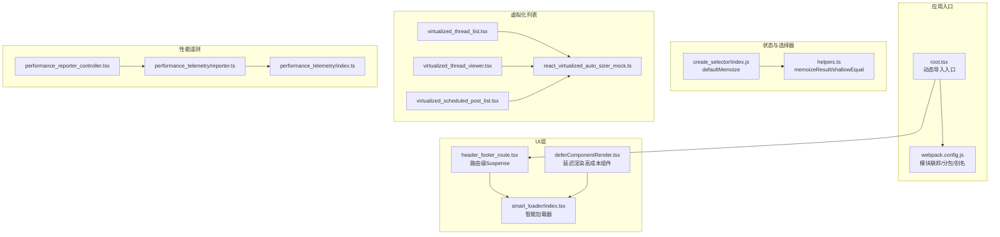
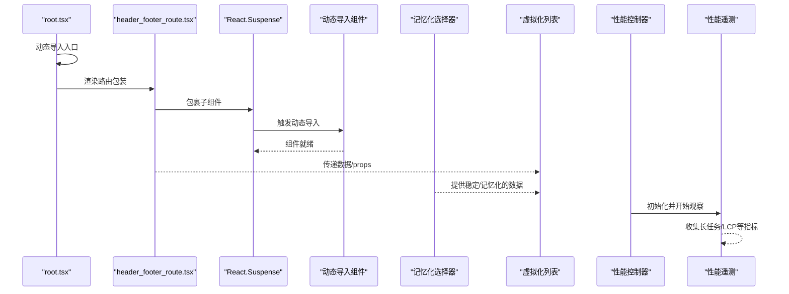
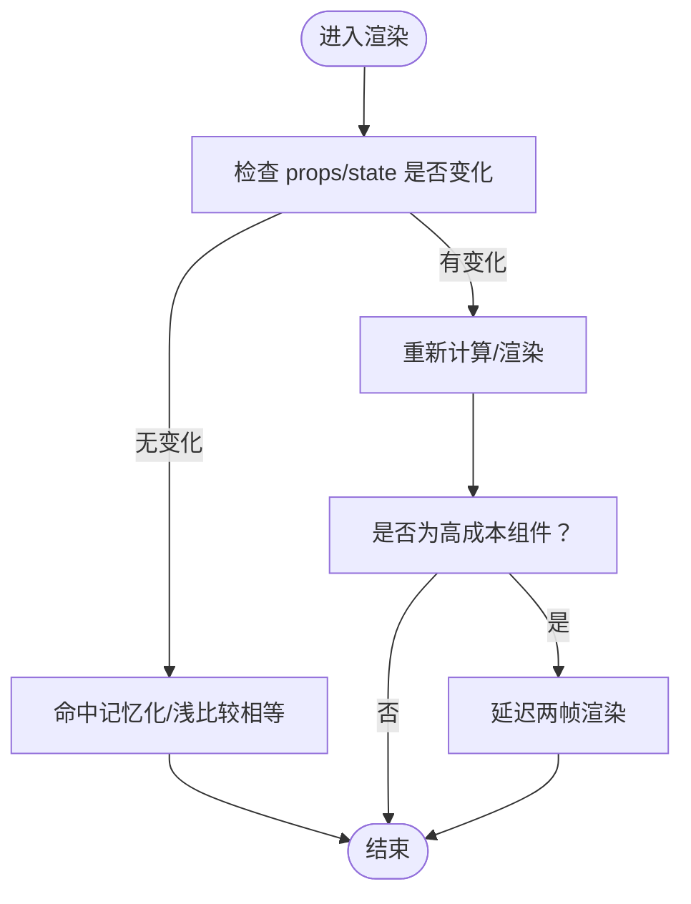
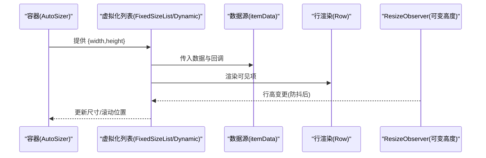
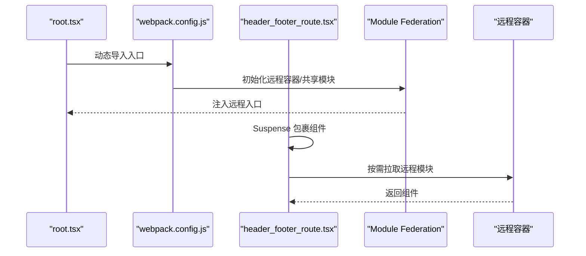
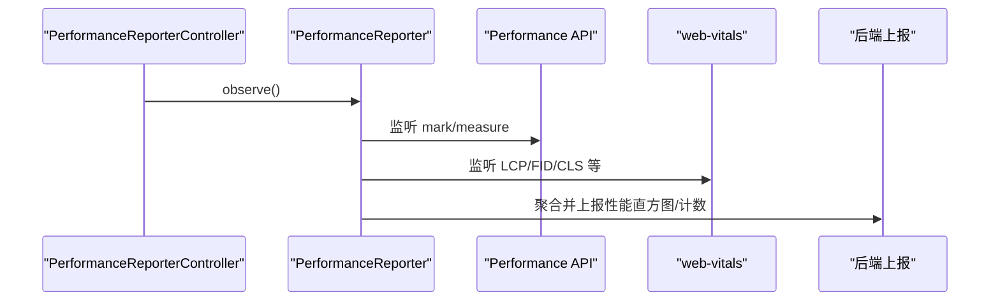
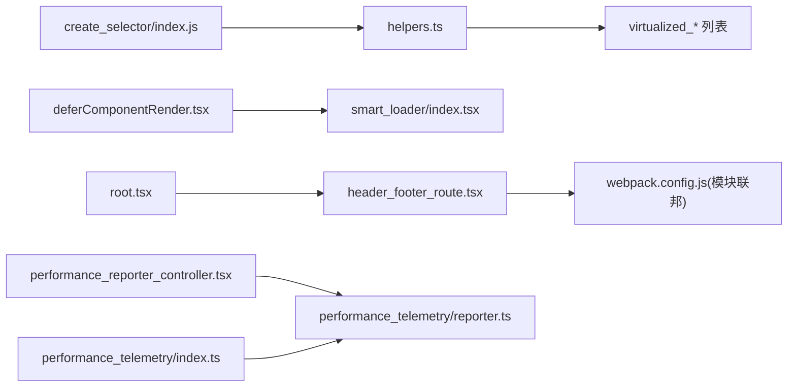

# 性能优化

<cite>
**本文引用的文件**
- [deferComponentRender.tsx](file://webapp/channels/src/components/deferComponentRender.tsx)
- [smart_loader/index.tsx](file://webapp/channels/src/components/widgets/smart_loader/index.tsx)
- [create_selector/index.js](file://webapp/channels/src/packages/mattermost-redux/src/selectors/create_selector/index.js)
- [helpers.ts](file://webapp/channels/src/packages/mattermost-redux/src/utils/helpers.ts)
- [performance_telemetry/index.ts](file://webapp/channels/src/utils/performance_telemetry/index.ts)
- [performance_telemetry/reporter.ts](file://webapp/channels/src/utils/performance_telemetry/reporter.ts)
- [performance_reporter_controller.tsx](file://webapp/channels/src/components/root/performance_reporter_controller.tsx)
- [react_virtualized_auto_sizer_mock.ts](file://webapp/channels/src/tests/react_virtualized_auto_sizer_mock.ts)
- [virtualized_thread_list.tsx](file://webapp/channels/src/components/threading/global_threads/thread_list/virtualized_thread_list.tsx)
- [virtualized_thread_viewer.tsx](file://webapp/channels/src/components/threading/virtualized_thread_viewer/virtualized_thread_viewer.tsx)
- [virtualized_scheduled_post_list.tsx](file://webapp/channels/src/components/drafts/scheduled_post_list/virtualized_scheduled_post_list.tsx)
- [header_footer_route.tsx](file://webapp/channels/src/components/header_footer_route/header_footer_route.tsx)
- [products.ts](file://webapp/channels/src/plugins/products.ts)
- [webpack.config.js](file://webapp/channels/webpack.config.js)
- [root.tsx](file://webapp/channels/src/root.tsx)
</cite>

## 目录
1. [简介](#简介)
2. [项目结构](#项目结构)
3. [核心组件](#核心组件)
4. [架构总览](#架构总览)
5. [详细组件分析](#详细组件分析)
6. [依赖关系分析](#依赖关系分析)
7. [性能考量](#性能考量)
8. [故障排查指南](#故障排查指南)
9. [结论](#结论)
10. [附录](#附录)

## 简介
本指南聚焦于 React 组件在 Mattermost Webapp 中的性能优化实践，涵盖以下主题：
- 组件重渲染的触发与避免策略（含 React.memo 使用）
- 虚拟化列表的实现与大列表渲染优化
- 代码分割与懒加载（动态导入、路由级分割、模块联邦）
- 内存泄漏的预防与检测
- 性能监控与分析（React DevTools、浏览器性能面板、自研性能遥测）
- 实际优化案例与最佳实践

## 项目结构
Webapp 基于 React + TypeScript，采用模块联邦（Module Federation）进行产品/插件级远程容器加载；构建配置支持动态导入与分包策略；Redux 选择器提供记忆化能力；同时内置性能遥测与长任务监控。

图示来源
- [root.tsx:1-26](file://webapp/channels/src/root.tsx#L1-L26)
- [webpack.config.js:317-402](file://webapp/channels/webpack.config.js#L317-L402)
- [deferComponentRender.tsx:1-52](file://webapp/channels/src/components/deferComponentRender.tsx#L1-L52)
- [smart_loader/index.tsx:1-37](file://webapp/channels/src/components/widgets/smart_loader/index.tsx#L1-L37)
- [header_footer_route.tsx:40-57](file://webapp/channels/src/components/header_footer_route/header_footer_route.tsx#L40-L57)
- [create_selector/index.js:26-39](file://webapp/channels/src/packages/mattermost-redux/src/selectors/create_selector/index.js#L26-L39)
- [helpers.ts:11-33](file://webapp/channels/src/packages/mattermost-redux/src/utils/helpers.ts#L11-L33)
- [virtualized_thread_list.tsx:105-137](file://webapp/channels/src/components/threading/global_threads/thread_list/virtualized_thread_list.tsx#L105-L137)
- [virtualized_thread_viewer.tsx:446-469](file://webapp/channels/src/components/threading/virtualized_thread_viewer/virtualized_thread_viewer.tsx#L446-L469)
- [virtualized_scheduled_post_list.tsx:224-263](file://webapp/channels/src/components/drafts/scheduled_post_list/virtualized_scheduled_post_list.tsx#L224-L263)
- [react_virtualized_auto_sizer_mock.ts:1-10](file://webapp/channels/src/tests/react_virtualized_auto_sizer_mock.ts#L1-L10)
- [performance_telemetry/index.ts:39-71](file://webapp/channels/src/utils/performance_telemetry/index.ts#L39-L71)
- [performance_telemetry/reporter.ts:210-257](file://webapp/channels/src/utils/performance_telemetry/reporter.ts#L210-L257)
- [performance_reporter_controller.tsx:14-31](file://webapp/channels/src/components/root/performance_reporter_controller.tsx#L14-L31)

章节来源
- [root.tsx:1-26](file://webapp/channels/src/root.tsx#L1-L26)
- [webpack.config.js:317-402](file://webapp/channels/webpack.config.js#L317-L402)

## 核心组件
- 记忆化选择器与结果缓存：通过默认记忆化函数与浅比较，减少重复计算与不必要渲染。
- 延迟渲染高成本组件：利用双帧动画延迟，让其他组件先完成渲染，再挂载昂贵组件。
- 智能加载器：最小显示时长保障与加载完成回调，改善感知性能。
- 虚拟化列表：固定/可变行高、自动尺寸、无限滚动/懒加载组合，降低 DOM 数量。
- 代码分割与路由级懒加载：基于 Suspense 的动态导入与模块联邦远程容器。
- 性能遥测：基于 Performance API 与 web-vitals 的度量上报与长任务计数。

章节来源
- [create_selector/index.js:26-39](file://webapp/channels/src/packages/mattermost-redux/src/selectors/create_selector/index.js#L26-L39)
- [helpers.ts:11-33](file://webapp/channels/src/packages/mattermost-redux/src/utils/helpers.ts#L11-L33)
- [deferComponentRender.tsx:20-52](file://webapp/channels/src/components/deferComponentRender.tsx#L20-L52)
- [smart_loader/index.tsx:15-37](file://webapp/channels/src/components/widgets/smart_loader/index.tsx#L15-L37)
- [virtualized_thread_list.tsx:105-137](file://webapp/channels/src/components/threading/global_threads/thread_list/virtualized_thread_list.tsx#L105-L137)
- [virtualized_thread_viewer.tsx:446-469](file://webapp/channels/src/components/threading/virtualized_thread_viewer/virtualized_thread_viewer.tsx#L446-L469)
- [virtualized_scheduled_post_list.tsx:224-263](file://webapp/channels/src/components/drafts/scheduled_post_list/virtualized_scheduled_post_list.tsx#L224-L263)
- [header_footer_route.tsx:40-57](file://webapp/channels/src/components/header_footer_route/header_footer_route.tsx#L40-L57)
- [performance_telemetry/index.ts:39-71](file://webapp/channels/src/utils/performance_telemetry/index.ts#L39-L71)
- [performance_telemetry/reporter.ts:210-257](file://webapp/channels/src/utils/performance_telemetry/reporter.ts#L210-L257)

## 架构总览
下图展示了从入口到渲染、虚拟化列表、性能遥测的关键交互路径。

图示来源
- [root.tsx:23-24](file://webapp/channels/src/root.tsx#L23-L24)
- [header_footer_route.tsx:40-57](file://webapp/channels/src/components/header_footer_route/header_footer_route.tsx#L40-L57)
- [virtualized_thread_list.tsx:105-137](file://webapp/channels/src/components/threading/global_threads/thread_list/virtualized_thread_list.tsx#L105-L137)
- [create_selector/index.js:26-39](file://webapp/channels/src/packages/mattermost-redux/src/selectors/create_selector/index.js#L26-L39)
- [performance_reporter_controller.tsx:14-31](file://webapp/channels/src/components/root/performance_reporter_controller.tsx#L14-L31)
- [performance_telemetry/reporter.ts:210-257](file://webapp/channels/src/utils/performance_telemetry/reporter.ts#L210-L257)

## 详细组件分析

### 组件重渲染的触发与避免策略
- 触发条件
  - props 或 state 变更
  - 上下文变化
  - 父组件重渲染导致子组件重渲染
  - 不稳定引用（函数/对象）导致子组件接收新引用
- 避免策略
  - 使用记忆化选择器与浅比较，确保输入引用稳定
  - 对函数式组件使用 React.memo，并提供自定义比较函数
  - 将昂贵子树延迟渲染至两帧之后，优先保证首屏关键路径
  - 使用智能加载器控制最小显示时长，提升感知性能

图示来源
- [create_selector/index.js:10-24](file://webapp/channels/src/packages/mattermost-redux/src/selectors/create_selector/index.js#L10-L24)
- [helpers.ts:11-33](file://webapp/channels/src/packages/mattermost-redux/src/utils/helpers.ts#L11-L33)
- [deferComponentRender.tsx:31-40](file://webapp/channels/src/components/deferComponentRender.tsx#L31-L40)

章节来源
- [create_selector/index.js:26-39](file://webapp/channels/src/packages/mattermost-redux/src/selectors/create_selector/index.js#L26-L39)
- [helpers.ts:11-33](file://webapp/channels/src/packages/mattermost-redux/src/utils/helpers.ts#L11-L33)
- [deferComponentRender.tsx:20-52](file://webapp/channels/src/components/deferComponentRender.tsx#L20-L52)

### 虚拟化列表实现
- 固定高度列表：固定 itemSize，结合 AutoSizer 获取容器尺寸，仅渲染可视区域
- 可变高度列表：使用 ResizeObserver 监听行高变化并防抖更新，避免布局抖动
- 无限滚动/懒加载：InfiniteLoader 与 AutoSizer 结合，按需加载更多数据
- 优化要点
  - 合理设置 overscan（前后预渲染行数）
  - 使用稳定的 itemKey 与浅比较的 areEqual
  - 控制渲染函数复用与闭包开销

图示来源
- [virtualized_thread_list.tsx:105-137](file://webapp/channels/src/components/threading/global_threads/thread_list/virtualized_thread_list.tsx#L105-L137)
- [virtualized_thread_viewer.tsx:446-469](file://webapp/channels/src/components/threading/virtualized_thread_viewer/virtualized_thread_viewer.tsx#L446-L469)
- [virtualized_scheduled_post_list.tsx:224-263](file://webapp/channels/src/components/drafts/scheduled_post_list/virtualized_scheduled_post_list.tsx#L224-L263)
- [react_virtualized_auto_sizer_mock.ts:4-8](file://webapp/channels/src/tests/react_virtualized_auto_sizer_mock.ts#L4-L8)

章节来源
- [virtualized_thread_list.tsx:105-137](file://webapp/channels/src/components/threading/global_threads/thread_list/virtualized_thread_list.tsx#L105-L137)
- [virtualized_thread_viewer.tsx:446-469](file://webapp/channels/src/components/threading/virtualized_thread_viewer/virtualized_thread_viewer.tsx#L446-L469)
- [virtualized_scheduled_post_list.tsx:224-263](file://webapp/channels/src/components/drafts/scheduled_post_list/virtualized_scheduled_post_list.tsx#L224-L263)
- [react_virtualized_auto_sizer_mock.ts:1-10](file://webapp/channels/src/tests/react_virtualized_auto_sizer_mock.ts#L1-L10)

### 代码分割与懒加载
- 入口动态导入：根入口动态导入实际应用，避免首屏无关代码
- 路由级分割：使用 React.Suspense 包裹路由组件，实现按需加载
- 模块联邦：声明远程容器与共享模块，实现产品/插件级解耦与独立构建
- 构建优化：生产模式启用 source-map，开发模式启用 eval-cheap-source-map；支持生产性能调试别名与禁用压缩以利于 Profiler

图示来源
- [root.tsx:23-24](file://webapp/channels/src/root.tsx#L23-L24)
- [webpack.config.js:317-402](file://webapp/channels/webpack.config.js#L317-L402)
- [header_footer_route.tsx:40-57](file://webapp/channels/src/components/header_footer_route/header_footer_route.tsx#L40-L57)
- [products.ts:40-76](file://webapp/channels/src/plugins/products.ts#L40-L76)

章节来源
- [root.tsx:1-26](file://webapp/channels/src/root.tsx#L1-L26)
- [webpack.config.js:317-402](file://webapp/channels/webpack.config.js#L317-L402)
- [header_footer_route.tsx:40-57](file://webapp/channels/src/components/header_footer_route/header_footer_route.tsx#L40-L57)
- [products.ts:40-76](file://webapp/channels/src/plugins/products.ts#L40-L76)

### 内存泄漏的预防与检测
- 预防措施
  - 在组件卸载时清理定时器、订阅、事件监听与 ResizeObserver
  - 避免在 effect 中持有对已卸载组件实例的引用
  - 使用稳定引用（useMemo/useCallback）避免闭包捕获过期状态
- 检测手段
  - 浏览器内存快照对比，定位未释放对象
  - 使用 React DevTools Profiler 分析组件生命周期与重渲染热点
  - 关注长任务与布局抖动，识别潜在泄漏路径

章节来源
- [virtualized_scheduled_post_list.tsx:249-254](file://webapp/channels/src/components/drafts/scheduled_post_list/virtualized_scheduled_post_list.tsx#L249-L254)
- [deferComponentRender.tsx:42-44](file://webapp/channels/src/components/deferComponentRender.tsx#L42-L44)

### 性能监控与分析
- 自研性能遥测
  - 基于 performance.measure 与自定义标签，记录关键路径耗时
  - 通过 PerformanceReporter 收集长任务、LCP 等指标并聚合上报
  - 在应用根部注入控制器，全局观察性能指标
- 工具链
  - React DevTools Profiler：定位重渲染热点与组件树深度
  - 浏览器性能面板：录制脚本执行、布局与合成阶段，识别卡顿
  - 生产性能调试：通过别名切换至 profiling 版本，禁用压缩以便分析

图示来源
- [performance_reporter_controller.tsx:14-31](file://webapp/channels/src/components/root/performance_reporter_controller.tsx#L14-L31)
- [performance_telemetry/reporter.ts:210-257](file://webapp/channels/src/utils/performance_telemetry/reporter.ts#L210-L257)
- [performance_telemetry/index.ts:39-71](file://webapp/channels/src/utils/performance_telemetry/index.ts#L39-L71)

章节来源
- [performance_reporter_controller.tsx:14-31](file://webapp/channels/src/components/root/performance_reporter_controller.tsx#L14-L31)
- [performance_telemetry/reporter.ts:210-257](file://webapp/channels/src/utils/performance_telemetry/reporter.ts#L210-L257)
- [performance_telemetry/index.ts:39-71](file://webapp/channels/src/utils/performance_telemetry/index.ts#L39-L71)

## 依赖关系分析
- 记忆化层
  - defaultMemoize 提供默认浅比较与缓存逻辑
  - memoizeResult 在浅比较基础上进一步缓存结果
- UI 层
  - deferComponentRender 将昂贵组件延迟两帧渲染
  - smart_loader 控制最小显示时长与加载完成回调
- 虚拟化层
  - AutoSizer + VirtualizedList/DynamicVirtualizedList
  - 可变高度行配合 ResizeObserver 防抖更新
- 加载与分包
  - root.tsx 动态导入入口
  - webpack.config.js 配置模块联邦与共享模块
  - header_footer_route.tsx 使用 Suspense 实现路由级懒加载
- 性能遥测
  - performance_telemetry/index.ts 与 reporter.ts 协作收集与上报

图示来源
- [create_selector/index.js:26-39](file://webapp/channels/src/packages/mattermost-redux/src/selectors/create_selector/index.js#L26-L39)
- [helpers.ts:11-33](file://webapp/channels/src/packages/mattermost-redux/src/utils/helpers.ts#L11-L33)
- [deferComponentRender.tsx:20-52](file://webapp/channels/src/components/deferComponentRender.tsx#L20-L52)
- [smart_loader/index.tsx:15-37](file://webapp/channels/src/components/widgets/smart_loader/index.tsx#L15-L37)
- [root.tsx:23-24](file://webapp/channels/src/root.tsx#L23-L24)
- [header_footer_route.tsx:40-57](file://webapp/channels/src/components/header_footer_route/header_footer_route.tsx#L40-L57)
- [webpack.config.js:317-402](file://webapp/channels/webpack.config.js#L317-L402)
- [performance_reporter_controller.tsx:14-31](file://webapp/channels/src/components/root/performance_reporter_controller.tsx#L14-L31)
- [performance_telemetry/reporter.ts:210-257](file://webapp/channels/src/utils/performance_telemetry/reporter.ts#L210-L257)
- [performance_telemetry/index.ts:39-71](file://webapp/channels/src/utils/performance_telemetry/index.ts#L39-L71)

章节来源
- [webpack.config.js:317-402](file://webapp/channels/webpack.config.js#L317-L402)

## 性能考量
- 重渲染控制
  - 使用 React.memo 与自定义比较函数，避免不必要的子树渲染
  - 通过记忆化选择器与浅比较，确保稳定引用
- 大列表渲染
  - 固定高度列表优先；可变高度使用 ResizeObserver 并防抖
  - 合理 overscan 与 itemKey，减少滚动抖动
- 懒加载与分包
  - 路由级 Suspense + 动态导入，降低首屏体积
  - 模块联邦实现产品/插件独立构建与运行时加载
- 性能调试
  - 开启生产性能调试别名，禁用压缩便于 Profiler
  - 使用 React DevTools 与浏览器性能面板定位瓶颈

## 故障排查指南
- 高成本组件导致卡顿
  - 使用 deferComponentRender 将其延迟两帧渲染
  - 检查是否存在未清理的定时器或订阅
- 虚拟化列表滚动卡顿
  - 检查 itemKey 是否稳定、itemData 引用是否变化
  - 对可变高度行确认 ResizeObserver 是否正确清理
- 首屏加载慢
  - 确认路由级 Suspense 是否生效
  - 检查模块联邦远程容器是否正确加载
- 性能指标异常
  - 核查 performance_telemetry 是否正常初始化与上报
  - 关注长任务计数与 LCP 指标变化趋势

章节来源
- [deferComponentRender.tsx:31-40](file://webapp/channels/src/components/deferComponentRender.tsx#L31-L40)
- [virtualized_scheduled_post_list.tsx:249-254](file://webapp/channels/src/components/drafts/scheduled_post_list/virtualized_scheduled_post_list.tsx#L249-L254)
- [header_footer_route.tsx:40-57](file://webapp/channels/src/components/header_footer_route/header_footer_route.tsx#L40-L57)
- [performance_reporter_controller.tsx:19-28](file://webapp/channels/src/components/root/performance_reporter_controller.tsx#L19-L28)

## 结论
通过记忆化选择器、延迟渲染、虚拟化列表、路由级懒加载与模块联邦、以及完善的性能遥测体系，Mattermost Webapp 在复杂 UI 场景下实现了良好的首屏与交互性能。建议在新增组件时遵循“稳定引用优先、必要时记忆化、能虚拟化则虚拟化”的原则，并持续使用 React DevTools 与浏览器性能面板进行回归验证。

## 附录
- 实战案例
  - 将高成本对话列表组件包裹延迟渲染，显著降低首屏阻塞
  - 对可变高度草稿列表引入 ResizeObserver 防抖，消除布局抖动
  - 使用路由级 Suspense 与模块联邦，拆分产品模块，降低主包体积
- 最佳实践清单
  - 优先使用 React.memo 与 useMemo/useCallback
  - 保持选择器输入引用稳定，避免闭包捕获不稳定值
  - 虚拟化列表合理设置 overscan 与 itemKey
  - 路由级懒加载与模块联邦配合使用
  - 定期使用 React Profiler 与浏览器性能面板进行回归测试