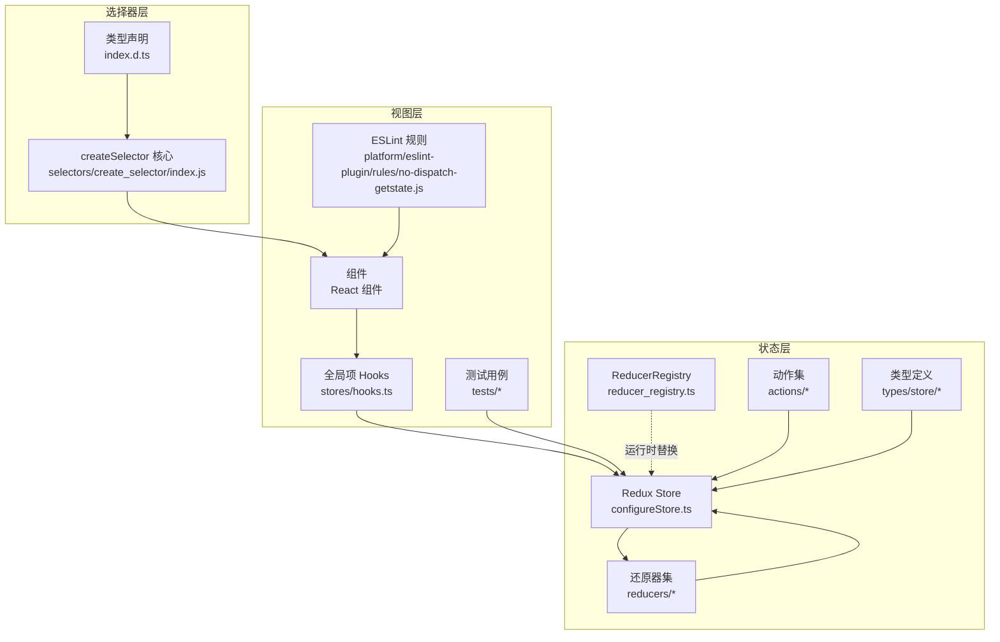
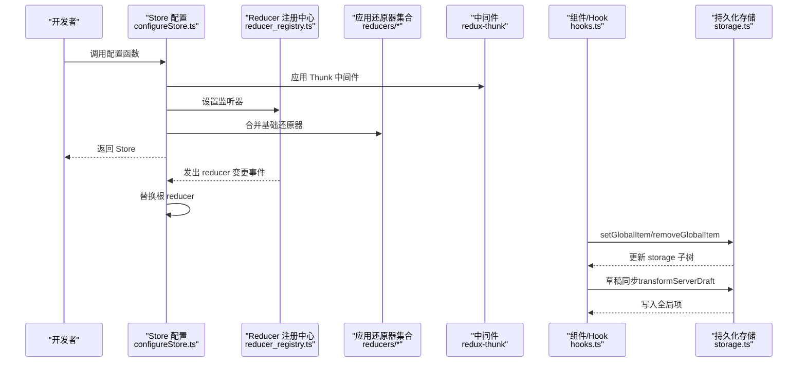
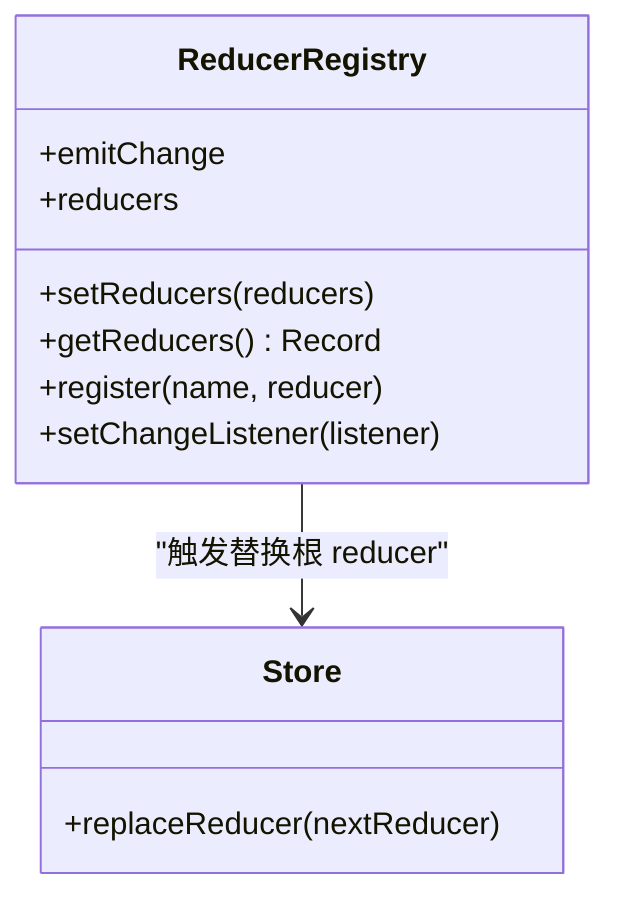
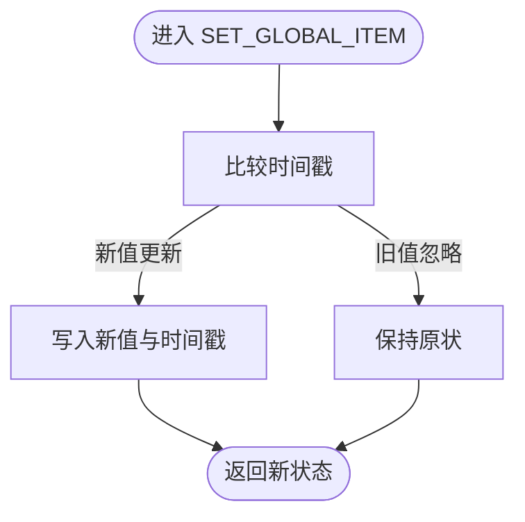
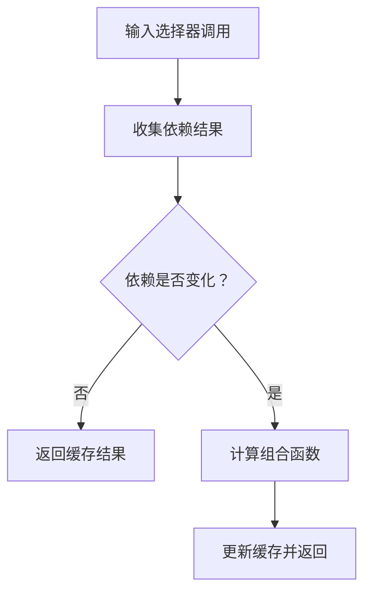
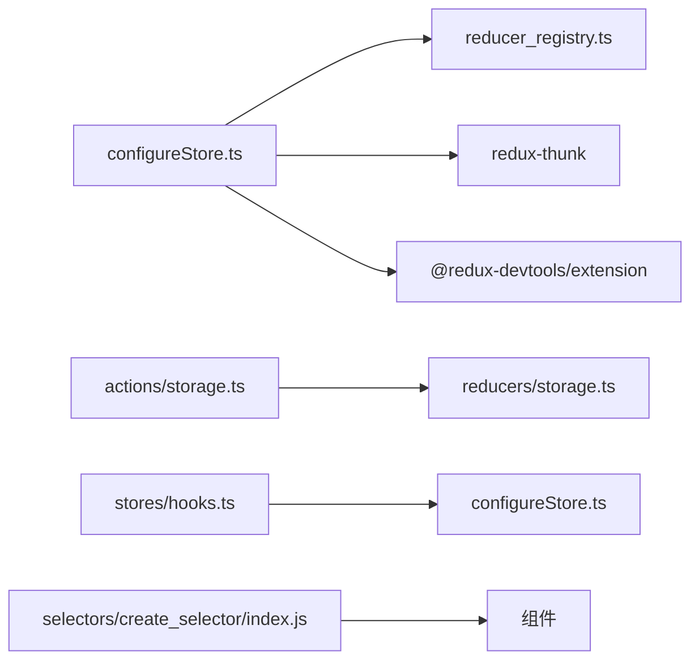

# 状态管理

<cite>
**本文引用的文件**
- [configureStore.ts](file://webapp/channels/src/packages/mattermost-redux/src/store/configureStore.ts)
- [reducer_registry.ts](file://webapp/channels/src/packages/mattermost-redux/src/store/reducer_registry.ts)
- [index.ts](file://webapp/channels/src/types/store/index.ts)
- [storage.ts（动作）](file://webapp/channels/src/actions/storage.ts)
- [storage.ts（类型）](file://webapp/channels/src/types/store/storage.ts)
- [storage.ts（还原器）](file://webapp/channels/src/reducers/storage.ts)
- [hooks.ts](file://webapp/channels/src/stores/hooks.ts)
- [drafts.ts](file://webapp/channels/src/actions/views/drafts.ts)
- [index.js（createSelector）](file://webapp/channels/src/packages/mattermost-redux/src/selectors/create_selector/index.js)
- [index.d.ts（createSelector 类型）](file://webapp/channels/src/packages/mattermost-redux/src/selectors/create_selector/index.d.ts)
- [react_testing_utils.test.tsx](file://webapp/channels/src/tests/react_testing_utils.test.tsx)
- [no-dispatch-getstate.js](file://webapp/platform/eslint-plugin/rules/no-dispatch-getstate.js)
- [apps.ts](file://webapp/channels/src/actions/apps.ts)
- [websocket_actions.test.jsx](file://webapp/channels/src/actions/websocket_actions.test.jsx)
- [posts.test.ts（实体选择器测试）](file://webapp/channels/src/packages/mattermost-redux/src/selectors/entities/posts.test.ts)
</cite>

## 目录
1. [引言](#引言)
2. [项目结构](#项目结构)
3. [核心组件](#核心组件)
4. [架构总览](#架构总览)
5. [详细组件分析](#详细组件分析)
6. [依赖关系分析](#依赖关系分析)
7. [性能考虑](#性能考虑)
8. [故障排查指南](#故障排查指南)
9. [结论](#结论)
10. [附录](#附录)

## 引言
本指南围绕前端状态管理展开，结合仓库中的 Redux 实践，系统讲解本地状态与全局状态的处理策略、Redux 设计模式（actions、reducers、store）、状态提升与下沉原则、组件间通信最佳实践、状态持久化方案（本地存储与服务端同步）、性能优化技巧（选择器与缓存），并给出复杂业务场景下的状态处理示例路径。

## 项目结构
在前端 webapp 中，状态管理主要由以下模块构成：
- Redux Store 配置与热加载：通过配置函数创建 Store，并支持运行时替换根 reducer。
- 动作与还原器：定义应用状态变更的规范与实现。
- 全局状态持久化：以“全局项”形式在本地存储中保存键值对，并带时间戳。
- 选择器与缓存：基于自研 createSelector 工具构建高性能派生数据。
- 组件层 Hooks：提供便捷的全局项读写 Hook。
- 测试与工具：测试用例验证状态更新、选择器缓存行为；ESLint 规则约束 dispatch 使用。

图表来源
- [configureStore.ts:1-72](file://webapp/channels/src/packages/mattermost-redux/src/store/configureStore.ts#L1-L72)
- [reducer_registry.ts:1-32](file://webapp/channels/src/packages/mattermost-redux/src/store/reducer_registry.ts#L1-L32)
- [hooks.ts:39-54](file://webapp/channels/src/stores/hooks.ts#L39-L54)
- [index.js（createSelector）:42-77](file://webapp/channels/src/packages/mattermost-redux/src/selectors/create_selector/index.js#L42-L77)
- [index.d.ts（createSelector 类型）:1-1067](file://webapp/channels/src/packages/mattermost-redux/src/selectors/create_selector/index.d.ts#L1-L1067)

章节来源
- [configureStore.ts:1-72](file://webapp/channels/src/packages/mattermost-redux/src/store/configureStore.ts#L1-L72)
- [reducer_registry.ts:1-32](file://webapp/channels/src/packages/mattermost-redux/src/store/reducer_registry.ts#L1-L32)
- [hooks.ts:39-54](file://webapp/channels/src/stores/hooks.ts#L39-L54)
- [index.js（createSelector）:42-77](file://webapp/channels/src/packages/mattermost-redux/src/selectors/create_selector/index.js#L42-L77)
- [index.d.ts（createSelector 类型）:1-1067](file://webapp/channels/src/packages/mattermost-redux/src/selectors/create_selector/index.d.ts#L1-L1067)

## 核心组件
- Store 配置与中间件
  - 使用 Redux Thunk 扩展参数，注入额外上下文（如数据加载器等）。
  - 开发者工具集成，开启追踪与自动暂停。
  - 初始状态合并预加载状态。
- Reducer 注册中心
  - 提供注册、获取、监听变更的能力，支持运行时替换根 reducer。
- 全局状态持久化
  - 以“全局项”为单位保存键值与时间戳，支持设置、删除、前缀批量操作。
  - 还原器支持“水合”事件，用于从持久化存储恢复初始状态。
- 选择器与缓存
  - 自研 createSelector 工厂，支持命名、多输入选择器、记忆化组合。
  - 输出选择器暴露重算次数统计与重置接口，便于调试与性能监控。
- 组件层 Hooks
  - 提供全局项的读写 Hook，简化本地状态与全局状态的统一访问。
- 类型与动作
  - 定义 ActionFunc、ThunkActionFunc 等泛型类型，确保动作与状态强类型约束。
  - 动作集中包含全局项设置、删除、草稿同步等业务动作。

章节来源
- [configureStore.ts:29-72](file://webapp/channels/src/packages/mattermost-redux/src/store/configureStore.ts#L29-L72)
- [reducer_registry.ts:7-29](file://webapp/channels/src/packages/mattermost-redux/src/store/reducer_registry.ts#L7-L29)
- [storage.ts（还原器）:31-73](file://webapp/channels/src/reducers/storage.ts#L31-L73)
- [storage.ts（动作）:1-36](file://webapp/channels/src/actions/storage.ts#L1-L36)
- [storage.ts（类型）:1-14](file://webapp/channels/src/types/store/storage.ts#L1-L14)
- [index.ts:40-63](file://webapp/channels/src/types/store/index.ts#L40-L63)
- [hooks.ts:39-54](file://webapp/channels/src/stores/hooks.ts#L39-L54)
- [index.js（createSelector）:42-77](file://webapp/channels/src/packages/mattermost-redux/src/selectors/create_selector/index.js#L42-L77)
- [index.d.ts（createSelector 类型）:1-1067](file://webapp/channels/src/packages/mattermost-redux/src/selectors/create_selector/index.d.ts#L1-L1067)

## 架构总览
下图展示了 Redux Store 的创建流程、Reducer 注册机制、以及全局项持久化与草稿同步的交互。

图表来源
- [configureStore.ts:29-72](file://webapp/channels/src/packages/mattermost-redux/src/store/configureStore.ts#L29-L72)
- [reducer_registry.ts:19-29](file://webapp/channels/src/packages/mattermost-redux/src/store/reducer_registry.ts#L19-L29)
- [storage.ts（动作）:1-36](file://webapp/channels/src/actions/storage.ts#L1-L36)
- [storage.ts（还原器）:31-73](file://webapp/channels/src/reducers/storage.ts#L31-L73)
- [drafts.ts:139-190](file://webapp/channels/src/actions/views/drafts.ts#L139-L190)

## 详细组件分析

### Redux Store 与中间件
- 设计要点
  - 使用 Thunk 扩展参数，向异步动作注入 Store 上下文（如数据加载器）。
  - 开启 Redux DevTools 扩展，支持追踪与自动暂停。
  - 合并初始状态与预加载状态，保证水合一致性。
- 关键路径
  - Store 创建与增强：[configureStore.ts:29-72](file://webapp/channels/src/packages/mattermost-redux/src/store/configureStore.ts#L29-L72)
  - Thunk 参数注入：[configureStore.ts:54](file://webapp/channels/src/packages/mattermost-redux/src/store/configureStore.ts#L54)
  - 初始状态合并：[configureStore.ts:37-40](file://webapp/channels/src/packages/mattermost-redux/src/store/configureStore.ts#L37-L40)

章节来源
- [configureStore.ts:29-72](file://webapp/channels/src/packages/mattermost-redux/src/store/configureStore.ts#L29-L72)

### Reducer 注册中心与热替换
- 设计要点
  - 提供注册新 reducer、获取当前 reducer 映射、设置变更监听器。
  - 监听器触发后，使用新的 reducer 映射重建根 reducer 并替换 Store。
- 关键路径
  - 注册与监听：[reducer_registry.ts:19-29](file://webapp/channels/src/packages/mattermost-redux/src/store/reducer_registry.ts#L19-L29)
  - Store 替换逻辑：[configureStore.ts:67-69](file://webapp/channels/src/packages/mattermost-redux/src/store/configureStore.ts#L67-L69)

图表来源
- [reducer_registry.ts:7-29](file://webapp/channels/src/packages/mattermost-redux/src/store/reducer_registry.ts#L7-L29)
- [configureStore.ts:67-69](file://webapp/channels/src/packages/mattermost-redux/src/store/configureStore.ts#L67-L69)

章节来源
- [reducer_registry.ts:7-29](file://webapp/channels/src/packages/mattermost-redux/src/store/reducer_registry.ts#L7-L29)
- [configureStore.ts:67-69](file://webapp/channels/src/packages/mattermost-redux/src/store/configureStore.ts#L67-L69)

### 全局状态持久化（本地存储）
- 设计要点
  - “全局项”以键值对保存，携带时间戳，避免旧版本覆盖新版本。
  - 支持设置、删除、前缀批量操作；还原器支持 STORAGE_REHYDRATE 水合事件。
  - 类型定义明确初始化标志与存储结构。
- 关键路径
  - 动作定义：[storage.ts（动作）:1-36](file://webapp/channels/src/actions/storage.ts#L1-L36)
  - 还原器逻辑：[storage.ts（还原器）:31-73](file://webapp/channels/src/reducers/storage.ts#L31-L73)
  - 类型定义：[storage.ts（类型）:1-14](file://webapp/channels/src/types/store/storage.ts#L1-L14)

图表来源
- [storage.ts（还原器）:38-51](file://webapp/channels/src/reducers/storage.ts#L38-L51)

章节来源
- [storage.ts（动作）:1-36](file://webapp/channels/src/actions/storage.ts#L1-L36)
- [storage.ts（还原器）:31-73](file://webapp/channels/src/reducers/storage.ts#L31-L73)
- [storage.ts（类型）:1-14](file://webapp/channels/src/types/store/storage.ts#L1-L14)

### 组件层 Hooks 与状态提升/下沉
- 设计要点
  - 提供全局项的读写 Hook，简化本地状态与全局状态的统一访问。
  - Hook 内部使用 useSelector 与 dispatch，遵循“状态下沉、行为上提”的原则。
- 关键路径
  - 全局项 Hook：[hooks.ts:39-54](file://webapp/channels/src/stores/hooks.ts#L39-L54)

章节来源
- [hooks.ts:39-54](file://webapp/channels/src/stores/hooks.ts#L39-L54)

### 选择器与缓存（高性能派生数据）
- 设计要点
  - createSelector 工厂支持命名、多输入选择器与记忆化组合。
  - 输出选择器暴露 recomputations/resetRecomputations，便于性能监控。
  - 选择器测试验证了记忆化效果（相同输入复用结果）。
- 关键路径
  - 工厂实现：[index.js（createSelector）:42-77](file://webapp/channels/src/packages/mattermost-redux/src/selectors/create_selector/index.js#L42-L77)
  - 类型声明：[index.d.ts（createSelector 类型）:1-1067](file://webapp/channels/src/packages/mattermost-redux/src/selectors/create_selector/index.d.ts#L1-L1067)
  - 记忆化测试：[posts.test.ts（实体选择器测试）:801-849](file://webapp/channels/src/packages/mattermost-redux/src/selectors/entities/posts.test.ts#L801-L849)

图表来源
- [index.js（createSelector）:57-77](file://webapp/channels/src/packages/mattermost-redux/src/selectors/create_selector/index.js#L57-L77)

章节来源
- [index.js（createSelector）:42-77](file://webapp/channels/src/packages/mattermost-redux/src/selectors/create_selector/index.js#L42-L77)
- [index.d.ts（createSelector 类型）:1-1067](file://webapp/channels/src/packages/mattermost-redux/src/selectors/create_selector/index.d.ts#L1-L1067)
- [posts.test.ts（实体选择器测试）:801-849](file://webapp/channels/src/packages/mattermost-redux/src/selectors/entities/posts.test.ts#L801-L849)

### 复杂业务场景：草稿与服务端同步
- 设计要点
  - 将服务端草稿转换为客户端草稿格式，写入全局项存储。
  - 区分频道草稿与评论草稿，使用不同键前缀。
  - 同步草稿来源标记，区分本地/远程。
- 关键路径
  - 草稿转换与写入：[drafts.ts:139-190](file://webapp/channels/src/actions/views/drafts.ts#L139-L190)

章节来源
- [drafts.ts:139-190](file://webapp/channels/src/actions/views/drafts.ts#L139-L190)

### 组件间通信与 WebSocket 同步
- 设计要点
  - 通过动作处理 WebSocket 事件，更新实体状态（如自定义属性字段）。
  - 测试验证事件到达后状态正确扩展。
- 关键路径
  - WebSocket 动作处理测试：[websocket_actions.test.jsx:1534-1571](file://webapp/channels/src/actions/websocket_actions.test.jsx#L1534-L1571)

章节来源
- [websocket_actions.test.jsx:1534-1571](file://webapp/channels/src/actions/websocket_actions.test.jsx#L1534-L1571)

### 类型与动作约束
- 设计要点
  - 定义 ActionFunc、ActionFuncAsync、ThunkActionFunc 等泛型类型，确保动作与状态强类型约束。
  - 动作集中包含全局项设置、删除、草稿同步等业务动作。
- 关键路径
  - 类型定义：[index.ts:40-63](file://webapp/channels/src/types/store/index.ts#L40-L63)
  - 动作实现：[storage.ts（动作）:1-36](file://webapp/channels/src/actions/storage.ts#L1-L36)

章节来源
- [index.ts:40-63](file://webapp/channels/src/types/store/index.ts#L40-L63)
- [storage.ts（动作）:1-36](file://webapp/channels/src/actions/storage.ts#L1-L36)

## 依赖关系分析
- 组件耦合与内聚
  - Store 与 Reducer 注册中心解耦，通过监听器触发替换，降低直接耦合。
  - 选择器层与组件层松耦合，通过记忆化减少不必要的重渲染。
- 外部依赖与集成点
  - Redux Thunk 扩展参数注入，便于在异步动作中访问 Store 上下文。
  - Redux DevTools 扩展用于开发调试。
- 循环依赖风险
  - Reducer 注册中心与 Store 配置存在单向依赖，未见循环。
- 接口契约
  - 动作类型与还原器契约清晰，全局项键值对与时间戳约定明确。

图表来源
- [configureStore.ts:29-72](file://webapp/channels/src/packages/mattermost-redux/src/store/configureStore.ts#L29-L72)
- [reducer_registry.ts:19-29](file://webapp/channels/src/packages/mattermost-redux/src/store/reducer_registry.ts#L19-L29)
- [storage.ts（动作）:1-36](file://webapp/channels/src/actions/storage.ts#L1-L36)
- [storage.ts（还原器）:31-73](file://webapp/channels/src/reducers/storage.ts#L31-L73)
- [hooks.ts:39-54](file://webapp/channels/src/stores/hooks.ts#L39-L54)
- [index.js（createSelector）:42-77](file://webapp/channels/src/packages/mattermost-redux/src/selectors/create_selector/index.js#L42-L77)

章节来源
- [configureStore.ts:29-72](file://webapp/channels/src/packages/mattermost-redux/src/store/configureStore.ts#L29-L72)
- [reducer_registry.ts:19-29](file://webapp/channels/src/packages/mattermost-redux/src/store/reducer_registry.ts#L19-L29)
- [storage.ts（动作）:1-36](file://webapp/channels/src/actions/storage.ts#L1-L36)
- [storage.ts（还原器）:31-73](file://webapp/channels/src/reducers/storage.ts#L31-L73)
- [hooks.ts:39-54](file://webapp/channels/src/stores/hooks.ts#L39-L54)
- [index.js（createSelector）:42-77](file://webapp/channels/src/packages/mattermost-redux/src/selectors/create_selector/index.js#L42-L77)

## 性能考虑
- 选择器与缓存
  - 使用 createSelector 工厂构建记忆化选择器，避免重复计算。
  - 通过输出选择器的 recomputations 接口监控重算次数，定位潜在性能问题。
- 状态下沉与局部优化
  - 将高频更新的局部状态保留在组件内部，仅在必要时提升到全局。
  - 对于跨组件共享但不频繁变化的数据，优先使用选择器缓存。
- 异步与批处理
  - 在需要时使用批处理动作减少多次重渲染。
- 开发工具
  - 使用 Redux DevTools 追踪 action 与状态变化，识别异常波动。

## 故障排查指南
- dispatch 不应传入 getState
  - ESLint 规则禁止将 getState 作为第二个参数传给 dispatch，避免误用。
  - 修复建议：移除多余的参数与逗号。
- 测试验证
  - 通过测试用例验证状态替换、更新与动作分发的行为。
  - 示例路径：[react_testing_utils.test.tsx:157-349](file://webapp/channels/src/tests/react_testing_utils.test.tsx#L157-L349)
- WebSocket 同步
  - 若实体状态未更新，检查 WebSocket 动作处理是否正确分发并更新状态。
  - 示例路径：[websocket_actions.test.jsx:1534-1571](file://webapp/channels/src/actions/websocket_actions.test.jsx#L1534-L1571)

章节来源
- [no-dispatch-getstate.js:1-35](file://webapp/platform/eslint-plugin/rules/no-dispatch-getstate.js#L1-L35)
- [react_testing_utils.test.tsx:157-349](file://webapp/channels/src/tests/react_testing_utils.test.tsx#L157-L349)
- [websocket_actions.test.jsx:1534-1571](file://webapp/channels/src/actions/websocket_actions.test.jsx#L1534-L1571)

## 结论
本仓库采用 Redux 作为核心状态管理方案，结合自研选择器工厂、全局项持久化与运行时 Reducer 注册机制，实现了可维护、可扩展且具备良好性能的状态体系。通过类型约束与测试保障，确保复杂业务场景下的稳定性与可演进性。

## 附录
- 实际示例路径（不含代码内容）
  - Store 配置与中间件：[configureStore.ts:29-72](file://webapp/channels/src/packages/mattermost-redux/src/store/configureStore.ts#L29-L72)
  - Reducer 注册中心：[reducer_registry.ts:19-29](file://webapp/channels/src/packages/mattermost-redux/src/store/reducer_registry.ts#L19-L29)
  - 全局项动作与还原器：[storage.ts（动作）:1-36](file://webapp/channels/src/actions/storage.ts#L1-L36)、[storage.ts（还原器）:31-73](file://webapp/channels/src/reducers/storage.ts#L31-L73)
  - 全局项 Hooks：[hooks.ts:39-54](file://webapp/channels/src/stores/hooks.ts#L39-L54)
  - 选择器工厂与类型：[index.js（createSelector）:42-77](file://webapp/channels/src/packages/mattermost-redux/src/selectors/create_selector/index.js#L42-L77)、[index.d.ts（createSelector 类型）:1-1067](file://webapp/channels/src/packages/mattermost-redux/src/selectors/create_selector/index.d.ts#L1-L1067)
  - 草稿同步：[drafts.ts:139-190](file://webapp/channels/src/actions/views/drafts.ts#L139-L190)
  - WebSocket 同步测试：[websocket_actions.test.jsx:1534-1571](file://webapp/channels/src/actions/websocket_actions.test.jsx#L1534-L1571)
  - ESLint 规则：[no-dispatch-getstate.js:1-35](file://webapp/platform/eslint-plugin/rules/no-dispatch-getstate.js#L1-L35)