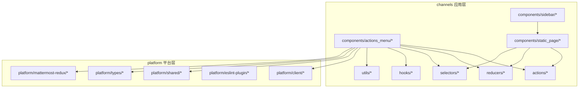
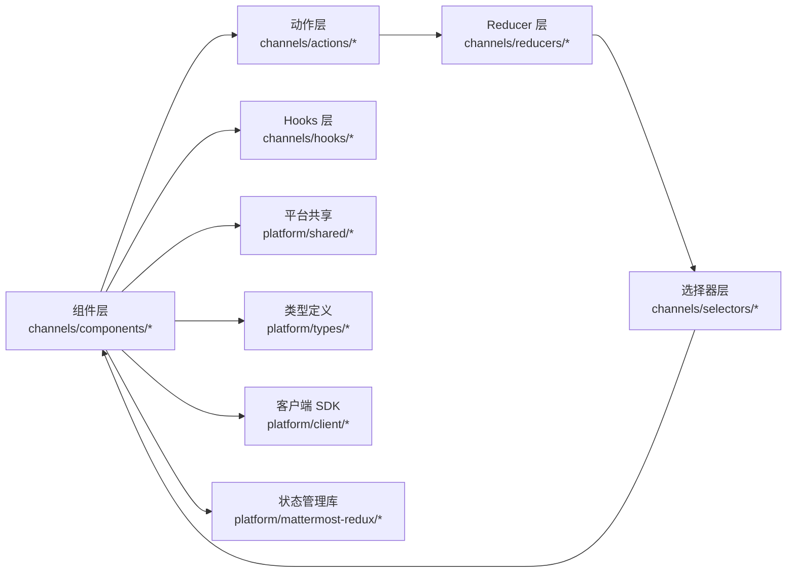
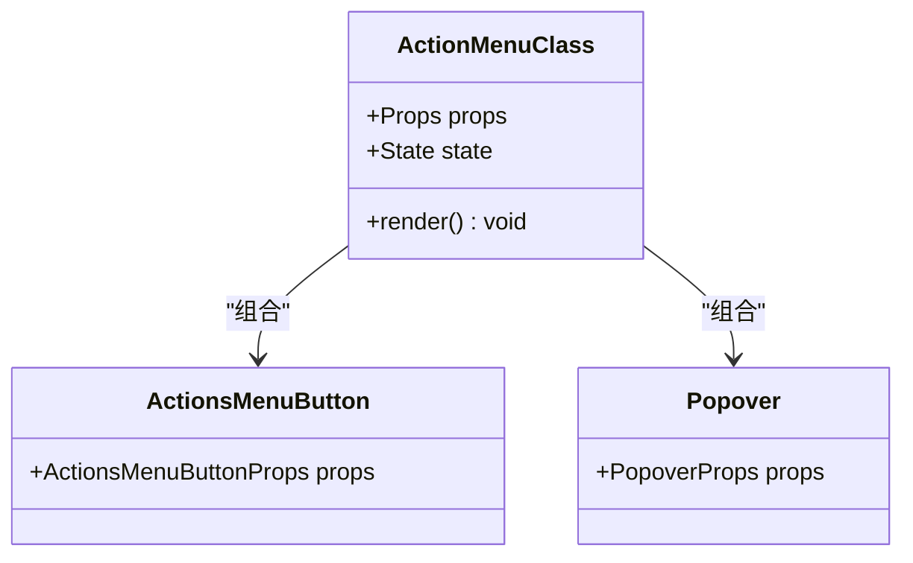
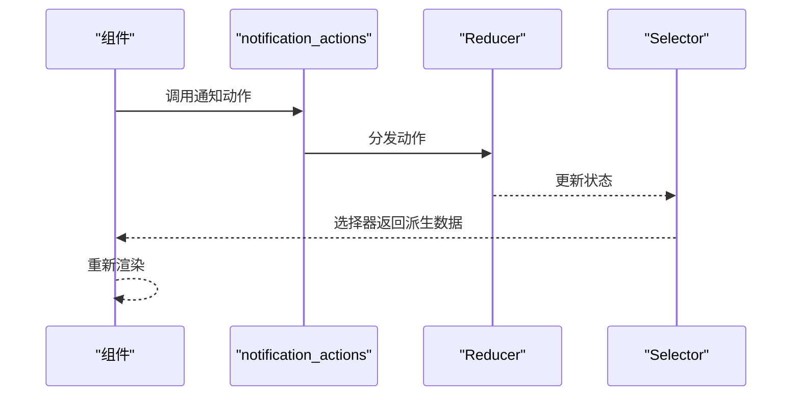
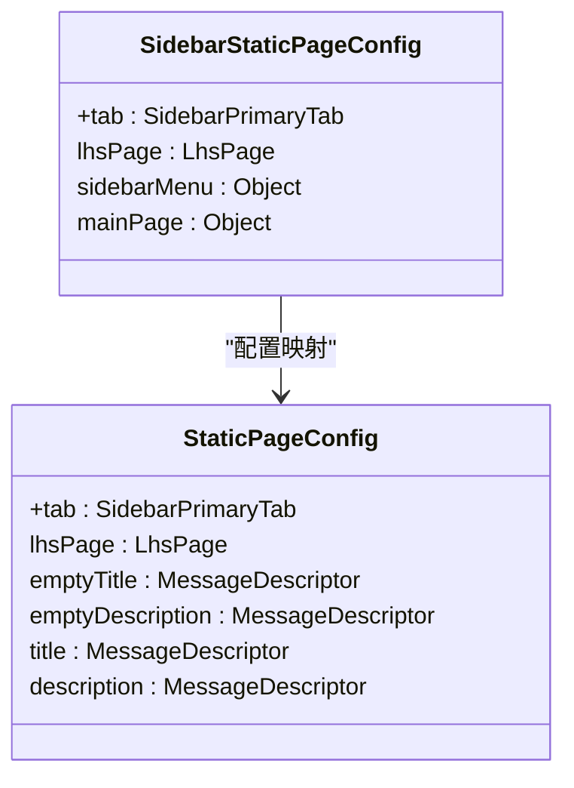
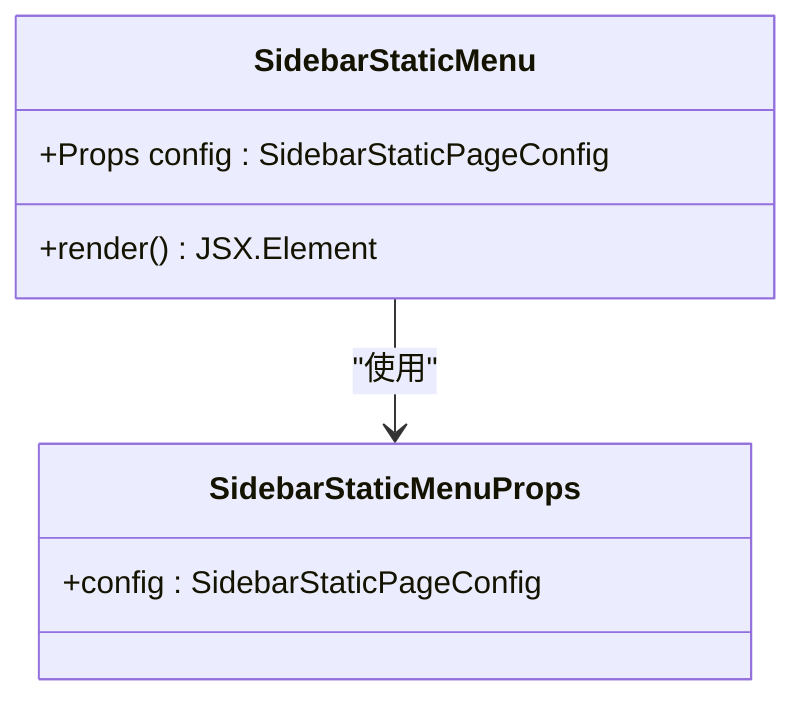
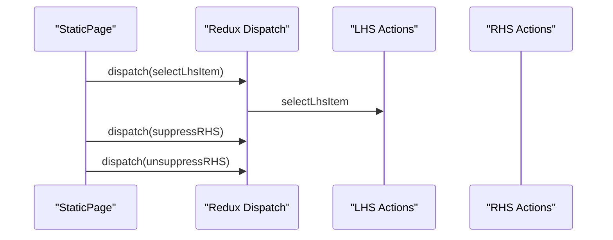
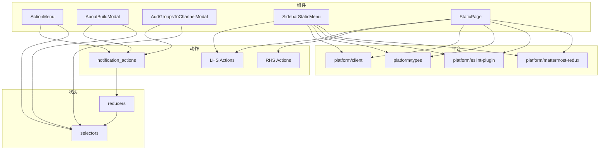

# 组件开发指南

<cite>
**本文引用的文件**
- [webapp/README.md](file://webapp/README.md)
- [webapp/package.json](file://webapp/package.json)
- [webapp/channels/src/components/actions_menu/actions_menu.tsx](file://webapp/channels/src/components/actions_menu/actions_menu.tsx)
- [webapp/channels/src/components/actions_menu/actions_menu_button.tsx](file://webapp/channels/src/components/actions_menu/actions_menu_button.tsx)
- [webapp/channels/src/components/actions_menu/popover.tsx](file://webapp/channels/src/components/actions_menu/popover.tsx)
- [webapp/channels/src/components/about_build_modal/about_build_modal.tsx](file://webapp/channels/src/components/about_build_modal/about_build_modal.tsx)
- [webapp/channels/src/components/add_groups_to_channel_modal/add_groups_to_channel_modal.tsx](file://webapp/channels/src/components/add_groups_to_channel_modal/add_groups_to_channel_modal.tsx)
- [webapp/channels/src/actions/notification_actions.tsx](file://webapp/channels/src/actions/notification_actions.tsx)
- [webapp/platform/client/src/index.ts](file://webapp/platform/client/src/index.ts)
- [webapp/platform/shared/src/index.ts](file://webapp/platform/shared/src/index.ts)
- [webapp/platform/types/src/index.ts](file://webapp/platform/types/src/index.ts)
- [webapp/platform/eslint-plugin/index.js](file://webapp/platform/eslint-plugin/index.js)
- [webapp/platform/mattermost-redux/package.json](file://webapp/platform/mattermost-redux/package.json)
- [webapp/channels/src/hooks/useDebounce.ts](file://webapp/channels/src/hooks/useDebounce.ts)
- [webapp/channels/src/hooks/useLocalStorage.ts](file://webapp/channels/src/hooks/useLocalStorage.ts)
- [webapp/channels/src/reducers/index.ts](file://webapp/channels/src/reducers/index.ts)
- [webapp/channels/src/selectors/index.ts](file://webapp/channels/src/selectors/index.ts)
- [webapp/channels/src/utils/helpers.ts](file://webapp/channels/src/utils/helpers.ts)
- [webapp/channels/src/tests/example.test.tsx](file://webapp/channels/src/tests/example.test.tsx)
- [webapp/channels/src/components/sidebar/sidebar_static_pages.ts](file://webapp/channels/src/components/sidebar/sidebar_static_pages.ts)
- [webapp/channels/src/components/static_page/static_page.tsx](file://webapp/channels/src/components/static_page/static_page.tsx)
- [webapp/channels/src/components/sidebar/sidebar_static_menu/sidebar_static_menu.tsx](file://webapp/channels/src/components/sidebar/sidebar_static_menu/sidebar_static_menu.tsx)
</cite>

## 目录
1. [引言](#引言)
2. [项目结构](#项目结构)
3. [核心组件](#核心组件)
4. [架构总览](#架构总览)
5. [详细组件分析](#详细组件分析)
6. [静态页面系统组件](#静态页面系统组件)
7. [依赖关系分析](#依赖关系分析)
8. [性能考量](#性能考量)
9. [故障排查指南](#故障排查指南)
10. [结论](#结论)
11. [附录](#附录)

## 引言
本指南面向 Mattermost 前端组件开发者，系统阐述函数式与类组件的设计原则、Hooks 使用最佳实践、Props 类型定义与接口设计、状态管理策略（本地与全局）、生命周期与副作用处理、可复用性设计（高阶组件与 Render Props）、组件测试策略（单元测试与快照测试），并结合仓库中的真实组件示例，展示从简单到复杂组件的完整实现路径。

**更新** 新增静态页面系统相关组件开发指导，包括 SidebarStaticMenu、SidebarStaticPages、StaticPage 等新组件的开发模式和最佳实践。

## 项目结构
Mattermost Web 应用采用多包/多模块组织方式：
- channels：主应用层，包含页面、组件、动作、选择器、reducers 等
- platform：平台级共享能力，如客户端 SDK、共享组件、类型定义、ESLint 插件等
- 平台包：mattermost-redux（状态管理）、eslint-plugin（规则）等

**图表来源**
- [webapp/channels/src/components/actions_menu/actions_menu.tsx:1-120](file://webapp/channels/src/components/actions_menu/actions_menu.tsx#L1-L120)
- [webapp/channels/src/actions/notification_actions.tsx:1-200](file://webapp/channels/src/actions/notification_actions.tsx#L1-L200)
- [webapp/platform/client/src/index.ts](file://webapp/platform/client/src/index.ts)
- [webapp/platform/shared/src/index.ts](file://webapp/platform/shared/src/index.ts)
- [webapp/platform/types/src/index.ts](file://webapp/platform/types/src/index.ts)
- [webapp/platform/mattermost-redux/package.json](file://webapp/platform/mattermost-redux/package.json)

**章节来源**
- [webapp/README.md](file://webapp/README.md)
- [webapp/package.json](file://webapp/package.json)

## 核心组件
- 函数组件与类组件并存：仓库中既有基于 React.PureComponent 的类组件，也有函数式组件与自定义 Hooks 的组合。
- Props 类型化：所有组件均通过 TypeScript 明确定义 Props 接口或类型别名，确保类型安全。
- 动作与选择器：通过 actions 与 selectors 解耦业务逻辑与视图，提升可维护性。
- Hooks：提供通用 Hook（如去抖、本地存储）以复用横切关注点。

**章节来源**
- [webapp/channels/src/components/actions_menu/actions_menu.tsx:1-120](file://webapp/channels/src/components/actions_menu/actions_menu.tsx#L1-L120)
- [webapp/channels/src/actions/notification_actions.tsx:1-200](file://webapp/channels/src/actions/notification_actions.tsx#L1-L200)
- [webapp/channels/src/hooks/useDebounce.ts](file://webapp/channels/src/hooks/useDebounce.ts)
- [webapp/channels/src/hooks/useLocalStorage.ts](file://webapp/channels/src/hooks/useLocalStorage.ts)

## 架构总览
Mattermost 前端采用"组件-动作-选择器-Reducer"的经典 Flux/Redux 流程，配合平台层共享能力与类型系统，形成清晰的分层架构。

**图表来源**
- [webapp/channels/src/components/actions_menu/actions_menu.tsx:1-120](file://webapp/channels/src/components/actions_menu/actions_menu.tsx#L1-L120)
- [webapp/channels/src/actions/notification_actions.tsx:1-200](file://webapp/channels/src/actions/notification_actions.tsx#L1-L200)
- [webapp/channels/src/reducers/index.ts](file://webapp/channels/src/reducers/index.ts)
- [webapp/channels/src/selectors/index.ts](file://webapp/channels/src/selectors/index.ts)
- [webapp/platform/shared/src/index.ts](file://webapp/platform/shared/src/index.ts)
- [webapp/platform/types/src/index.ts](file://webapp/platform/types/src/index.ts)
- [webapp/platform/client/src/index.ts](file://webapp/platform/client/src/index.ts)
- [webapp/platform/mattermost-redux/package.json](file://webapp/platform/mattermost-redux/package.json)

## 详细组件分析

### 组件 A：动作菜单（ActionMenu）
该组件展示了类组件与 Props 类型化的典型实践，包含按钮、弹出层、图标等子组件，并通过 PureComponent 优化渲染。

**图表来源**
- [webapp/channels/src/components/actions_menu/actions_menu.tsx:1-120](file://webapp/channels/src/components/actions_menu/actions_menu.tsx#L1-L120)
- [webapp/channels/src/components/actions_menu/actions_menu_button.tsx](file://webapp/channels/src/components/actions_menu/actions_menu_button.tsx)
- [webapp/channels/src/components/actions_menu/popover.tsx](file://webapp/channels/src/components/actions_menu/popover.tsx)

**章节来源**
- [webapp/channels/src/components/actions_menu/actions_menu.tsx:1-120](file://webapp/channels/src/components/actions_menu/actions_menu.tsx#L1-L120)
- [webapp/channels/src/components/actions_menu/actions_menu_button.tsx](file://webapp/channels/src/components/actions_menu/actions_menu_button.tsx)
- [webapp/channels/src/components/actions_menu/popover.tsx](file://webapp/channels/src/components/actions_menu/popover.tsx)

### 组件 B：关于版本构建信息模态框（AboutBuildModal）
该组件体现了函数式组件与类型 Props 的简洁写法，适合演示 Props 接口定义与渲染逻辑分离。

**章节来源**
- [webapp/channels/src/components/about_build_modal/about_build_modal.tsx](file://webapp/channels/src/components/about_build_modal/about_build_modal.tsx)

### 组件 C：添加群组到频道模态框（AddGroupsToChannelModal）
该组件为类组件，展示复杂交互场景下的状态管理与表单处理，适合讲解本地状态与副作用的协同。

**章节来源**
- [webapp/channels/src/components/add_groups_to_channel_modal/add_groups_to_channel_modal.tsx](file://webapp/channels/src/components/add_groups_to_channel_modal/add_groups_to_channel_modal.tsx)

### 动作与通知（notification_actions）
该模块演示了如何将业务动作封装为可复用的动作函数，便于组件调用并触发状态更新。

**图表来源**
- [webapp/channels/src/actions/notification_actions.tsx:1-200](file://webapp/channels/src/actions/notification_actions.tsx#L1-L200)
- [webapp/channels/src/reducers/index.ts](file://webapp/channels/src/reducers/index.ts)
- [webapp/channels/src/selectors/index.ts](file://webapp/channels/src/selectors/index.ts)

**章节来源**
- [webapp/channels/src/actions/notification_actions.tsx:1-200](file://webapp/channels/src/actions/notification_actions.tsx#L1-L200)

### Hooks 最佳实践：useDebounce 与 useLocalStorage
- useDebounce：用于输入防抖、搜索建议等场景，避免频繁触发副作用。
- useLocalStorage：用于持久化用户偏好或会话状态，注意初始化与同步问题。

**章节来源**
- [webapp/channels/src/hooks/useDebounce.ts](file://webapp/channels/src/hooks/useDebounce.ts)
- [webapp/channels/src/hooks/useLocalStorage.ts](file://webapp/channels/src/hooks/useLocalStorage.ts)

### 生命周期与副作用处理
- 函数组件：通过 useEffect 管理副作用，遵循清理函数与依赖数组的最佳实践。
- 类组件：在 componentDidMount/ componentDidUpdate 中处理副作用，注意条件判断与资源释放。
- 与 Redux 集成：在组件挂载后发起异步动作，完成后根据选择器结果更新本地状态。

**章节来源**
- [webapp/channels/src/components/actions_menu/actions_menu.tsx:1-120](file://webapp/channels/src/components/actions_menu/actions_menu.tsx#L1-L120)
- [webapp/channels/src/actions/notification_actions.tsx:1-200](file://webapp/channels/src/actions/notification_actions.tsx#L1-L200)

### 可复用性设计：高阶组件与 Render Props
- 高阶组件（HOC）：通过包装组件注入通用行为（如权限校验、加载状态）。
- Render Props：通过 children 或 render 函数将渲染控制权交给使用者，增强灵活性。
- Hooks 替代方案：优先使用自定义 Hooks 抽象逻辑，保持组件树扁平化。

**章节来源**
- [webapp/channels/src/components/actions_menu/actions_menu.tsx:1-120](file://webapp/channels/src/components/actions_menu/actions_menu.tsx#L1-L120)

### Props 类型定义与接口设计
- 使用 TypeScript 接口或类型别名明确 Props 字段与可选性。
- 将只读属性与可变状态分离，避免过度耦合。
- 对外暴露最小接口，内部实现细节通过私有类型隐藏。

**章节来源**
- [webapp/channels/src/components/actions_menu/actions_menu.tsx:1-120](file://webapp/channels/src/components/actions_menu/actions_menu.tsx#L1-L120)
- [webapp/channels/src/components/actions_menu/actions_menu_button.tsx](file://webapp/channels/src/components/actions_menu/actions_menu_button.tsx)
- [webapp/channels/src/components/actions_menu/popover.tsx](file://webapp/channels/src/components/actions_menu/popover.tsx)

### 状态管理策略
- 本地状态：用于组件内可见性、表单输入等短期状态。
- 全局状态：通过 Redux 管理跨组件共享的数据流，配合 selector 提升性能。
- Hooks 与 Context：在必要时引入轻量上下文或自定义 Hook 缓解 props drilling。

**章节来源**
- [webapp/channels/src/reducers/index.ts](file://webapp/channels/src/reducers/index.ts)
- [webapp/channels/src/selectors/index.ts](file://webapp/channels/src/selectors/index.ts)

## 静态页面系统组件

### SidebarStaticPages 配置系统
静态页面系统通过配置驱动的方式管理侧边栏静态页面，提供了类型安全的配置结构和路径匹配功能。

**图表来源**
- [webapp/channels/src/components/sidebar/sidebar_static_pages.ts:10-21](file://webapp/channels/src/components/sidebar/sidebar_static_pages.ts#L10-L21)
- [webapp/channels/src/components/sidebar/sidebar_static_pages.ts:197-230](file://webapp/channels/src/components/sidebar/sidebar_static_pages.ts#L197-L230)

静态页面配置系统包含以下关键特性：

1. **类型安全的配置结构**：通过 TypeScript 接口确保配置的完整性
2. **国际化支持**：使用 react-intl 的 MessageDescriptor 类型
3. **路径匹配机制**：提供多种路径匹配函数
4. **配置查询工具**：支持按标签、lhs 页面、路径等多种方式查询

**章节来源**
- [webapp/channels/src/components/sidebar/sidebar_static_pages.ts:1-230](file://webapp/channels/src/components/sidebar/sidebar_static_pages.ts#L1-L230)

### SidebarStaticMenu 侧边栏静态菜单
SidebarStaticMenu 组件负责渲染静态页面的侧边栏占位内容，提供空状态的视觉反馈。

**图表来源**
- [webapp/channels/src/components/sidebar/sidebar_static_menu/sidebar_static_menu.tsx:15-34](file://webapp/channels/src/components/sidebar/sidebar_static_menu/sidebar_static_menu.tsx#L15-L34)

组件特点：
- 使用 React.memo 进行渲染优化
- 支持无障碍访问（aria-label）
- 国际化标题和描述
- 空状态显示

**章节来源**
- [webapp/channels/src/components/sidebar/sidebar_static_menu/sidebar_static_menu.tsx:1-36](file://webapp/channels/src/components/sidebar/sidebar_static_menu/sidebar_static_menu.tsx#L1-L36)

### StaticPage 静态页面容器
StaticPage 是静态页面系统的主容器组件，负责页面的生命周期管理和布局控制。

**图表来源**
- [webapp/channels/src/components/static_page/static_page.tsx:21-46](file://webapp/channels/src/components/static_page/static_page.tsx#L21-L46)

组件功能：
- 自动选择对应的 LHS 项目
- 控制右侧面板的显示/隐藏
- 管理页面的生命周期
- 国际化标题和描述显示

**章节来源**
- [webapp/channels/src/components/static_page/static_page.tsx:1-48](file://webapp/channels/src/components/static_page/static_page.tsx#L1-L48)

### 静态页面系统最佳实践

#### 配置驱动开发模式
静态页面系统采用配置驱动的方式，推荐的开发流程：

1. **定义配置**：在 sidebar_static_pages.ts 中添加新的页面配置
2. **实现组件**：创建对应的页面组件
3. **集成路由**：在路由系统中注册新页面
4. **测试验证**：验证路径匹配和导航功能

#### 类型安全实践
- 使用 TypeScript 接口确保配置完整性
- 利用 react-intl 的 MessageDescriptor 类型进行国际化
- 通过枚举类型限制有效值范围

#### 国际化支持
- 所有文本内容通过 react-intl 管理
- 使用 defineMessages 定义消息标识符
- 支持动态语言切换

**章节来源**
- [webapp/channels/src/components/sidebar/sidebar_static_pages.ts:23-195](file://webapp/channels/src/components/sidebar/sidebar_static_pages.ts#L23-L195)
- [webapp/channels/src/components/sidebar/sidebar_static_menu/sidebar_static_menu.tsx:15-34](file://webapp/channels/src/components/sidebar/sidebar_static_menu/sidebar_static_menu.tsx#L15-L34)
- [webapp/channels/src/components/static_page/static_page.tsx:21-46](file://webapp/channels/src/components/static_page/static_page.tsx#L21-L46)

## 依赖关系分析
- 组件依赖动作与选择器，动作依赖服务层（平台 client），最终由 reducer 更新全局状态。
- 平台层提供类型定义、共享组件与 ESLint 规则，统一风格与质量标准。
- mattermost-redux 作为状态管理库，提供标准化的 action/reducer 模板。
- 静态页面系统依赖 LHS（左侧导航）和 RHS（右侧面板）的状态管理。

**图表来源**
- [webapp/channels/src/components/actions_menu/actions_menu.tsx:1-120](file://webapp/channels/src/components/actions_menu/actions_menu.tsx#L1-L120)
- [webapp/channels/src/actions/notification_actions.tsx:1-200](file://webapp/channels/src/actions/notification_actions.tsx#L1-L200)
- [webapp/channels/src/reducers/index.ts](file://webapp/channels/src/reducers/index.ts)
- [webapp/channels/src/selectors/index.ts](file://webapp/channels/src/selectors/index.ts)
- [webapp/platform/client/src/index.ts](file://webapp/platform/client/src/index.ts)
- [webapp/platform/types/src/index.ts](file://webapp/platform/types/src/index.ts)
- [webapp/platform/eslint-plugin/index.js](file://webapp/platform/eslint-plugin/index.js)
- [webapp/platform/mattermost-redux/package.json](file://webapp/platform/mattermost-redux/package.json)

**章节来源**
- [webapp/channels/src/actions/notification_actions.tsx:1-200](file://webapp/channels/src/actions/notification_actions.tsx#L1-L200)
- [webapp/channels/src/reducers/index.ts](file://webapp/channels/src/reducers/index.ts)
- [webapp/channels/src/selectors/index.ts](file://webapp/channels/src/selectors/index.ts)
- [webapp/platform/client/src/index.ts](file://webapp/platform/client/src/index.ts)
- [webapp/platform/types/src/index.ts](file://webapp/platform/types/src/index.ts)
- [webapp/platform/eslint-plugin/index.js](file://webapp/platform/eslint-plugin/index.js)
- [webapp/platform/mattermost-redux/package.json](file://webapp/platform/mattermost-redux/package.json)

## 性能考量
- 渲染优化：优先使用 React.PureComponent 或 memo 包装无状态组件，减少不必要的重渲染。
- 副作用节流：对高频事件（如滚动、输入）使用去抖/节流 Hook。
- 数据选择：通过 selector 进行局部选择与记忆化，避免全局状态变更导致的全量重渲染。
- 资源释放：在 useEffect/cleanup 中及时取消订阅、清理定时器与 DOM 事件监听。
- 打包与懒加载：按需加载重型组件或路由级懒加载，降低首屏负担。
- **静态页面系统优化**：使用 React.memo 包装静态菜单组件，避免重复渲染。

## 故障排查指南
- 类型错误：检查 Props 接口字段是否与调用方一致；确认可选与必填字段。
- 状态异常：核对动作分发与 reducer 处理是否匹配；使用 selector 验证派生数据。
- 副作用泄漏：确认 useEffect 的依赖数组是否完整；在 cleanup 中撤销订阅。
- 性能瓶颈：使用 React DevTools Profiler 定位重渲染热点；评估是否需要 memo 或拆分组件。
- 测试覆盖：补充单元测试与快照测试，确保边界条件与交互流程稳定。
- **静态页面系统问题**：检查配置中的路径匹配逻辑，验证 LHS 页面选择是否正确。

## 结论
Mattermost 的组件体系以类型安全、分层清晰与可复用性为核心设计目标。通过规范的 Props 接口、动作与选择器、以及 Hooks 的合理运用，可以高效构建高质量的前端组件。新增的静态页面系统进一步丰富了组件开发模式，通过配置驱动的方式实现了更好的可扩展性和维护性。建议在新组件开发中遵循本文档的模式与最佳实践，逐步完善测试与性能优化。

## 附录

### 组件开发步骤模板
- 设计 Props 接口与默认值
- 实现函数式组件或类组件骨架
- 引入必要的 Hooks（去抖、本地存储等）
- 连接动作与选择器，管理本地与全局状态
- 添加副作用与生命周期处理
- 编写单元测试与快照测试
- 性能评估与优化

### 静态页面系统开发模板
- 定义 SidebarStaticPageConfig 配置
- 创建 SidebarStaticMenu 组件
- 实现 StaticPage 容器组件
- 集成国际化消息定义
- 配置路径匹配逻辑
- 测试导航和状态管理

### 示例参考路径
- [动作菜单组件:1-120](file://webapp/channels/src/components/actions_menu/actions_menu.tsx#L1-L120)
- [关于版本构建信息模态框](file://webapp/channels/src/components/about_build_modal/about_build_modal.tsx)
- [添加群组到频道模态框](file://webapp/channels/src/components/add_groups_to_channel_modal/add_groups_to_channel_modal.tsx)
- [通知动作示例:1-200](file://webapp/channels/src/actions/notification_actions.tsx#L1-L200)
- [去抖 Hook](file://webapp/channels/src/hooks/useDebounce.ts)
- [本地存储 Hook](file://webapp/channels/src/hooks/useLocalStorage.ts)
- [测试示例](file://webapp/channels/src/tests/example.test.tsx)
- [静态页面配置系统:1-230](file://webapp/channels/src/components/sidebar/sidebar_static_pages.ts#L1-L230)
- [静态页面菜单组件:1-36](file://webapp/channels/src/components/sidebar/sidebar_static_menu/sidebar_static_menu.tsx#L1-L36)
- [静态页面容器组件:1-48](file://webapp/channels/src/components/static_page/static_page.tsx#L1-L48)