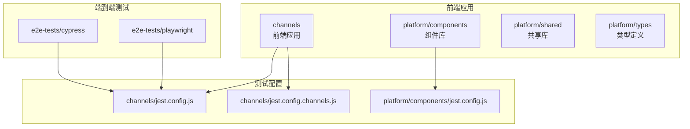
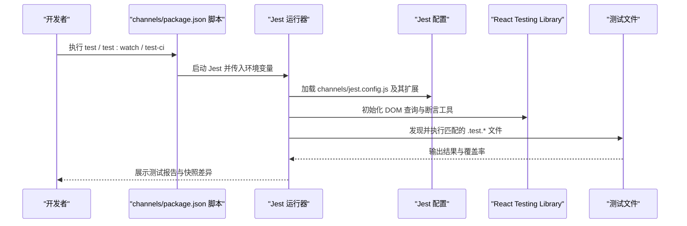
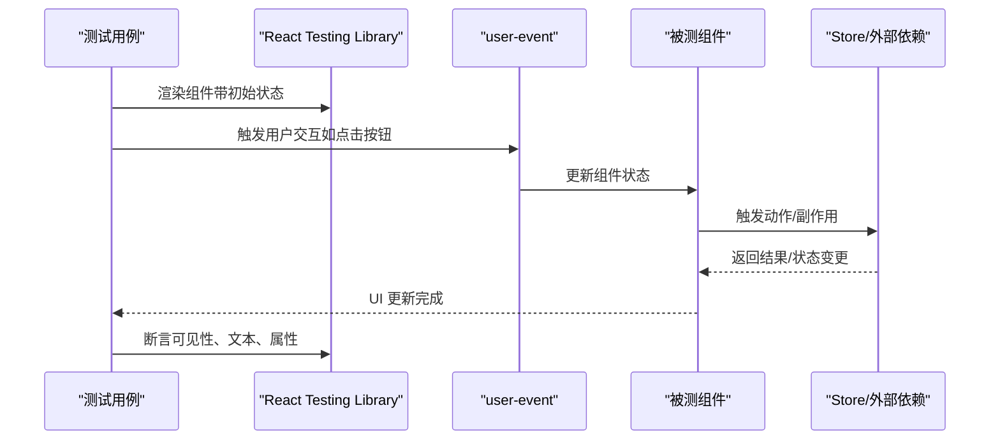
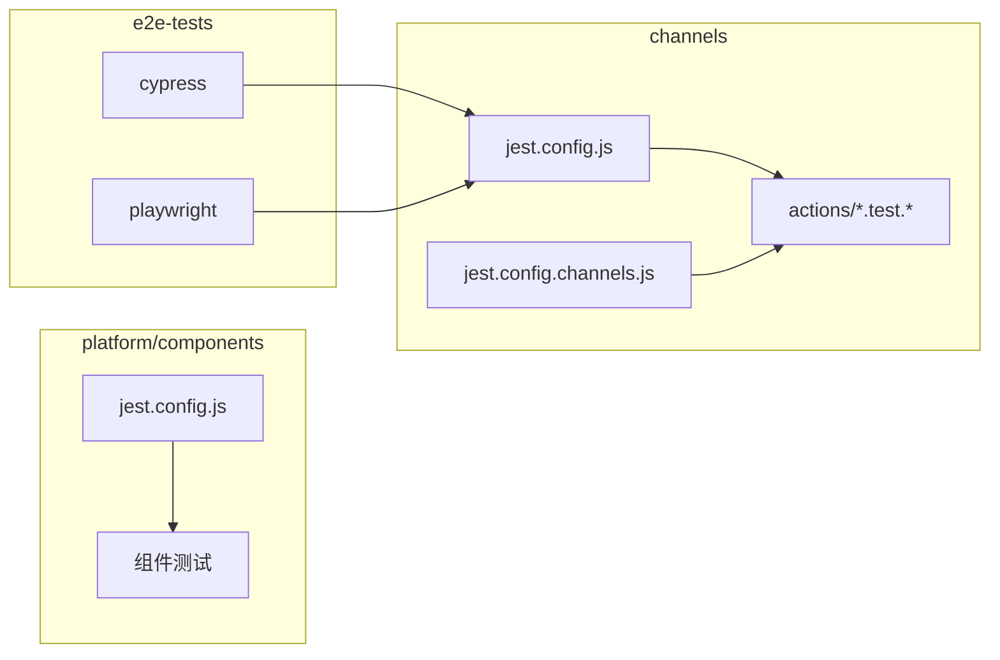

# 组件测试

<cite>
**本文引用的文件**
- [webapp/channels/jest.config.js](file://webapp/channels/jest.config.js)
- [webapp/channels/jest.config.channels.js](file://webapp/channels/jest.config.channels.js)
- [webapp/platform/components/jest.config.js](file://webapp/platform/components/jest.config.js)
- [webapp/channels/package.json](file://webapp/channels/package.json)
- [e2e-tests/cypress/package.json](file://e2e-tests/cypress/package.json)
- [e2e-tests/cypress/utils/even_distribution.test.js](file://e2e-tests/cypress/utils/even_distribution.test.js)
- [webapp/channels/src/actions/admin_actions.test.js](file://webapp/channels/src/actions/admin_actions.test.js)
- [webapp/channels/src/actions/channel_actions.test.ts](file://webapp/channels/src/actions/channel_actions.test.ts)
- [webapp/channels/src/actions/post_actions.test.ts](file://webapp/channels/src/actions/post_actions.test.ts)
- [webapp/channels/src/actions/user_actions.test.ts](file://webapp/channels/src/actions/user_actions.test.ts)
- [webapp/channels/src/actions/team_actions.test.ts](file://webapp/channels/src/actions/team_actions.test.ts)
- [webapp/channels/src/actions/global_actions.test.ts](file://webapp/channels/src/actions/global_actions.test.ts)
- [webapp/channels/src/actions/status_actions.test.ts](file://webapp/channels/src/actions/status_actions.test.ts)
- [webapp/channels/src/actions/storage.test.ts](file://webapp/channels/src/actions/storage.test.ts)
- [webapp/channels/src/actions/integration_actions.test.ts](file://webapp/channels/src/actions/integration_actions.test.ts)
- [webapp/channels/src/actions/invite_actions.test.ts](file://webapp/channels/src/actions/invite_actions.test.ts)
- [webapp/channels/src/actions/notification_actions.test.js](file://webapp/channels/src/actions/notification_actions.test.js)
- [webapp/channels/src/actions/command.test.js](file://webapp/channels/src/actions/command.test.js)
- [webapp/channels/src/actions/hooks.test.js](file://webapp/channels/src/actions/hooks.test.js)
- [webapp/channels/src/actions/emoji_actions.test.js](file://webapp/channels/src/actions/emoji_actions.test.js)
- [webapp/channels/src/actions/emoji_actions_load_recent.test.ts](file://webapp/channels/src/actions/emoji_actions_load_recent.test.ts)
- [webapp/channels/src/actions/new_post.test.ts](file://webapp/channels/src/actions/new_post.test.ts)
- [webapp/channels/src/actions/burn_on_read_deletion.test.ts](file://webapp/channels/src/actions/burn_on_read_deletion.test.ts)
- [webapp/channels/src/actions/burn_on_read_posts.test.ts](file://webapp/channels/src/actions/burn_on_read_posts.test.ts)
- [webapp/channels/src/actions/view_actions.test.js](file://webapp/channels/src/actions/view_actions.test.js)
- [webapp/channels/src/actions/views/index.test.js](file://webapp/channels/src/actions/views/index.test.js)
- [webapp/channels/src/actions/views/boards.test.js](file://webapp/channels/src/actions/views/boards.test.js)
- [webapp/channels/src/actions/views/channels.test.js](file://webapp/channels/src/actions/views/channels.test.js)
- [webapp/channels/src/actions/views/direct_messages.test.js](file://webapp/channels/src/actions/views/direct_messages.test.js)
- [webapp/channels/src/actions/views/teams.test.js](file://webapp/channels/src/actions/views/teams.test.js)
- [webapp/channels/src/actions/views/webinars.test.js](file://webapp/channels/src/actions/views/webinars.test.js)
- [webapp/channels/src/actions/views/workspaces.test.js](file://webapp/channels/src/actions/views/workspaces.test.js)
- [webapp/channels/src/actions/views/boards/board_actions.test.ts](file://webapp/channels/src/actions/views/boards/board_actions.test.ts)
- [webapp/channels/src/actions/views/boards/card_actions.test.ts](file://webapp/channels/src/actions/views/boards/card_actions.test.ts)
- [webapp/channels/src/actions/views/boards/list_actions.test.ts](file://webapp/channels/src/actions/views/boards/list_actions.test.ts)
- [webapp/channels/src/actions/views/boards/permission_actions.test.ts](file://webapp/channels/src/actions/views/boards/permission_actions.test.ts)
- [webapp/channels/src/actions/views/boards/schema_actions.test.ts](file://webapp/channels/src/actions/views/boards/schema_actions.test.ts)
- [webapp/channels/src/actions/views/boards/view_actions.test.ts](file://webapp/channels/src/actions/views/boards/view_actions.test.ts)
- [webapp/channels/src/actions/views/boards/widget_actions.test.ts](file://webapp/channels/src/actions/views/boards/widget_actions.test.ts)
- [webapp/channels/src/actions/views/channels/channel_actions.test.ts](file://webapp/channels/src/actions/views/channels/channel_actions.test.ts)
- [webapp/channels/src/actions/views/channels/channel_member_actions.test.ts](file://webapp/channels/src/actions/views/channels/channel_member_actions.test.ts)
- [webapp/channels/src/actions/views/channels/channel_pinned_post_actions.test.ts](file://webapp/channels/src/actions/views/channels/channel_pinned_post_actions.test.ts)
- [webapp/channels/src/actions/views/channels/channel_role_actions.test.ts](file://webapp/channels/src/actions/views/channels/channel_role_actions.test.ts)
- [webapp/channels/src/actions/views/channels/channel_sidebar_actions.test.ts](file://webapp/channels/src/actions/views/channels/channel_sidebar_actions.test.ts)
- [webapp/channels/src/actions/views/channels/channel_view_actions.test.ts](file://webapp/channels/src/actions/views/channels/channel_view_actions.test.ts)
- [webapp/channels/src/actions/views/channels/channel_visibility_actions.test.ts](file://webapp/channels/src/actions/views/channels/channel_visibility_actions.test.ts)
- [webapp/channels/src/actions/views/channels/channel_websocket_actions.test.ts](file://webapp/channels/src/actions/views/channels/channel_websocket_actions.test.ts)
- [webapp/channels/src/actions/views/channels/direct_message_actions.test.ts](file://webapp/channels/src/actions/views/channels/direct_message_actions.test.ts)
- [webapp/channels/src/actions/views/channels/group_message_actions.test.ts](file://webapp/channels/src/actions/views/channels/group_message_actions.test.ts)
- [webapp/channels/src/actions/views/channels/message_thread_actions.test.ts](file://webapp/channels/src/actions/views/channels/message_thread_actions.test.ts)
- [webapp/channels/src/actions/views/channels/thread_view_actions.test.ts](file://webapp/channels/src/actions/views/channels/thread_view_actions.test.ts)
- [webapp/channels/src/actions/views/channels/websocket_actions.test.ts](file://webapp/channels/src/actions/views/channels/websocket_actions.test.ts)
- [webapp/channels/src/actions/views/teams/team_actions.test.ts](file://webapp/channels/src/actions/views/teams/team_actions.test.ts)
- [webapp/channels/src/actions/views/teams/team_invite_actions.test.ts](file://webapp/channels/src/actions/views/teams/team_invite_actions.test.ts)
- [webapp/channels/src/actions/views/teams/team_member_actions.test.ts](file://webapp/channels/src/actions/views/teams/team_member_actions.test.ts)
- [webapp/channels/src/actions/views/teams/team_permission_actions.test.ts](file://webapp/channels/src/actions/views/teams/team_permission_actions.test.ts)
- [webapp/channels/src/actions/views/teams/team_role_actions.test.ts](file://webapp/channels/src/actions/views/teams/team_role_actions.test.ts)
- [webapp/channels/src/actions/views/teams/team_sidebar_actions.test.ts](file://webapp/channels/src/actions/views/teams/team_sidebar_actions.test.ts)
- [webapp/channels/src/actions/views/teams/team_view_actions.test.ts](file://webapp/channels/src/actions/views/teams/team_view_actions.test.ts)
- [webapp/channels/src/actions/views/teams/team_websocket_actions.test.ts](file://webapp/channels/src/actions/views/teams/team_websocket_actions.test.ts)
- [webapp/channels/src/actions/views/teams/websocket_actions.test.ts](file://webapp/channels/src/actions/views/teams/websocket_actions.test.ts)
- [webapp/channels/src/actions/views/webinars/webinar_actions.test.ts](file://webapp/channels/src/actions/views/webinars/webinar_actions.test.ts)
- [webapp/channels/src/actions/views/webinars/webinar_member_actions.test.ts](file://webapp/channels/src/actions/views/webinars/webinar_member_actions.test.ts)
- [webapp/channels/src/actions/views/webinars/webinar_permission_actions.test.ts](file://webapp/channels/src/actions/views/webinars/webinar_permission_actions.test.ts)
- [webapp/channels/src/actions/views/webinars/webinar_role_actions.test.ts](file://webapp/channels/src/actions/views/webinars/webinar_role_actions.test.ts)
- [webapp/channels/src/actions/views/webinars/webinar_sidebar_actions.test.ts](file://webapp/channels/src/actions/views/webinars/webinar_sidebar_actions.test.ts)
- [webapp/channels/src/actions/views/webinars/webinar_view_actions.test.ts](file://webapp/channels/src/actions/views/webinars/webinar_view_actions.test.ts)
- [webapp/channels/src/actions/views/workspaces/workspace_actions.test.ts](file://webapp/channels/src/actions/views/workspaces/workspace_actions.test.ts)
- [webapp/channels/src/actions/views/workspaces/workspace_member_actions.test.ts](file://webapp/channels/src/actions/views/workspaces/workspace_member_actions.test.ts)
- [webapp/channels/src/actions/views/workspaces/workspace_permission_actions.test.ts](file://webapp/channels/src/actions/views/workspaces/workspace_permission_actions.test.ts)
- [webapp/channels/src/actions/views/workspaces/workspace_role_actions.test.ts](file://webapp/channels/src/actions/views/workspaces/workspace_role_actions.test.ts)
- [webapp/channels/src/actions/views/workspaces/workspace_sidebar_actions.test.ts](file://webapp/channels/src/actions/views/workspaces/workspace_sidebar_actions.test.js](file://webapp/channels/src/actions/views/workspaces/workspace_sidebar_actions.test.js)
- [webapp/channels/src/actions/views/workspaces/workspace_view_actions.test.ts](file://webapp/channels/src/actions/views/workspaces/workspace_view_actions.test.js](file://webapp/channels/src/actions/views/workspaces/workspace_view_actions.test.js)
- [webapp/channels/src/actions/views/workspaces/workspace_websocket_actions.test.ts](file://webapp/channels/src/actions/views/workspaces/workspace_websocket_actions.test.js](file://webapp/channels/src/actions/views/workspaces/workspace_websocket_actions.test.js)
- [webapp/channels/src/actions/views/workspaces/websocket_actions.test.ts](file://webapp/channels/src/actions/views/workspaces/websocket_actions.test.js](file://webapp/channels/src/actions/views/workspaces/websocket_actions.test.js)
- [webapp/channels/src/actions/views/index.test.js](file://webapp/channels/src/actions/views/index.test.js)
- [webapp/channels/src/actions/views/boards.test.js](file://webapp/channels/src/actions/views/boards.test.js)
- [webapp/channels/src/actions/views/channels.test.js](file://webapp/channels/src/actions/views/channels.test.js)
- [webapp/channels/src/actions/views/direct_messages.test.js](file://webapp/channels/src/actions/views/direct_messages.test.js)
- [webapp/channels/src/actions/views/teams.test.js](file://webapp/channels/src/actions/views/teams.test.js)
- [webapp/channels/src/actions/views/webinars.test.js](file://webapp/channels/src/actions/views/webinars.test.js)
- [webapp/channels/src/actions/views/workspaces.test.js](file://webapp/channels/src/actions/views/workspaces.test.js)
- [webapp/channels/src/actions/views/boards/board_actions.test.ts](file://webapp/channels/src/actions/views/boards/board_actions.test.ts)
- [webapp/channels/src/actions/views/boards/card_actions.test.ts](file://webapp/channels/src/actions/views/boards/card_actions.test.ts)
- [webapp/channels/src/actions/views/boards/list_actions.test.ts](file://webapp/channels/src/actions/views/boards/list_actions.test.ts)
- [webapp/channels/src/actions/views/boards/permission_actions.test.ts](file://webapp/channels/src/actions/views/boards/permission_actions.test.ts)
- [webapp/channels/src/actions/views/boards/schema_actions.test.ts](file://webapp/channels/src/actions/views/boards/schema_actions.test.ts)
- [webapp/channels/src/actions/views/boards/view_actions.test.ts](file://webapp/channels/src/actions/views/boards/view_actions.test.ts)
- [webapp/channels/src/actions/views/boards/widget_actions.test.ts](file://webapp/channels/src/actions/views/boards/widget_actions.test.ts)
- [webapp/channels/src/actions/views/channels/channel_actions.test.ts](file://webapp/channels/src/actions/views/channels/channel_actions.test.ts)
- [webapp/channels/src/actions/views/channels/channel_member_actions.test.ts](file://webapp/channels/src/actions/views/channels/channel_member_actions.test.ts)
- [webapp/channels/src/actions/views/channels/channel_pinned_post_actions.test.ts](file://webapp/channels/src/actions/views/channels/channel_pinned_post_actions.test.ts)
- [webapp/channels/src/actions/views/channels/channel_role_actions.test.ts](file://webapp/channels/src/actions/views/channels/channel_role_actions.test.ts)
- [webapp/channels/src/actions/views/channels/channel_sidebar_actions.test.ts](file://webapp/channels/src/actions/views/channels/channel_sidebar_actions.test.ts)
- [webapp/channels/src/actions/views/channels/channel_view_actions.test.ts](file://webapp/channels/src/actions/views/channels/channel_view_actions.test.ts)
- [webapp/channels/src/actions/views/channels/channel_visibility_actions.test.ts](file://webapp/channels/src/actions/views/channels/channel_visibility_actions.test.ts)
- [webapp/channels/src/actions/views/channels/channel_websocket_actions.test.ts](file://webapp/channels/src/actions/views/channels/channel_websocket_actions.test.ts)
- [webapp/channels/src/actions/views/channels/direct_message_actions.test.ts](file://webapp/channels/src/actions/views/channels/direct_message_actions.test.ts)
- [webapp/channels/src/actions/views/channels/group_message_actions.test.ts](file://webapp/channels/src/actions/views/channels/group_message_actions.test.ts)
- [webapp/channels/src/actions/views/channels/message_thread_actions.test.ts](file://webapp/channels/src/actions/views/channels/message_thread_actions.test.ts)
- [webapp/channels/src/actions/views/channels/thread_view_actions.test.ts](file://webapp/channels/src/actions/views/channels/thread_view_actions.test.ts)
- [webapp/channels/src/actions/views/channels/websocket_actions.test.ts](file://webapp/channels/src/actions/views/channels/websocket_actions.test.ts)
- [webapp/channels/src/actions/views/teams/team_actions.test.ts](file://webapp/channels/src/actions/views/teams/team_actions.test.ts)
- [webapp/channels/src/actions/views/teams/team_invite_actions.test.ts](file://webapp/channels/src/actions/views/teams/team_invite_actions.test.ts)
- [webapp/channels/src/actions/views/teams/team_member_actions.test.ts](file://webapp/channels/src/actions/views/teams/team_member_actions.test.ts)
- [webapp/channels/src/actions/views/teams/team_permission_actions.test.ts](file://webapp/channels/src/actions/views/teams/team_permission_actions.test.ts)
- [webapp/channels/src/actions/views/teams/team_role_actions.test.ts](file://webapp/channels/src/actions/views/teams/team_role_actions.test.ts)
- [webapp/channels/src/actions/views/teams/team_sidebar_actions.test.ts](file://webapp/channels/src/actions/views/teams/team_sidebar_actions.test.ts)
- [webapp/channels/src/actions/views/teams/team_view_actions.test.ts](file://webapp/channels/src/actions/views/teams/team_view_actions.test.ts)
- [webapp/channels/src/actions/views/teams/team_websocket_actions.test.ts](file://webapp/channels/src/actions/views/teams/team_websocket_actions.test.ts)
- [webapp/channels/src/actions/views/teams/websocket_actions.test.ts](file://webapp/channels/src/actions/views/teams/websocket_actions.test.ts)
- [webapp/channels/src/actions/views/webinars/webinar_actions.test.ts](file://webapp/channels/src/actions/views/webinars/webinar_actions.test.ts)
- [webapp/channels/src/actions/views/webinars/webinar_member_actions.test.ts](file://webapp/channels/src/actions/views/webinars/webinar_member_actions.test.ts)
- [webapp/channels/src/actions/views/webinars/webinar_permission_actions.test.ts](file://webapp/channels/src/actions/views/webinars/webinar_permission_actions.test.ts)
- [webapp/channels/src/actions/views/webinars/webinar_role_actions.test.ts](file://webapp/channels/src/actions/views/webinars/webinar_role_actions.test.ts)
- [webapp/channels/src/actions/views/webinars/webinar_sidebar_actions.test.ts](file://webapp/channels/src/actions/views/webinars/webinar_sidebar_actions.test.ts)
- [webapp/channels/src/actions/views/webinars/webinar_view_actions.test.ts](file://webapp/channels/src/actions/views/webinars/webinar_view_actions.test.ts)
- [webapp/channels/src/actions/views/workspaces/workspace_actions.test.ts](file://webapp/channels/src/actions/views/workspaces/workspace_actions.test.ts)
- [webapp/channels/src/actions/views/workspaces/workspace_member_actions.test.ts](file://webapp/channels/src/actions/views/workspaces/workspace_member_actions.test.ts)
- [webapp/channels/src/actions/views/workspaces/workspace_permission_actions.test.ts](file://webapp/channels/src/actions/views/workspaces/workspace_permission_actions.test.ts)
- [webapp/channels/src/actions/views/workspaces/workspace_role_actions.test.ts](file://webapp/channels/src/actions/views/workspaces/workspace_role_actions.test.ts)
- [webapp/channels/src/actions/views/workspaces/workspace_sidebar_actions.test.ts](file://webapp/channels/src/actions/views/workspaces/workspace_sidebar_actions.test.ts)
- [webapp/channels/src/actions/views/workspaces/workspace_view_actions.test.ts](file://webapp/channels/src/actions/views/workspaces/workspace_view_actions.test.ts)
- [webapp/channels/src/actions/views/workspaces/workspace_websocket_actions.test.ts](file://webapp/channels/src/actions/views/workspaces/workspace_websocket_actions.test.ts)
- [webapp/channels/src/actions/views/workspaces/websocket_actions.test.ts](file://webapp/channels/src/actions/views/workspaces/websocket_actions.test.ts)
</cite>

## 目录
1. [引言](#引言)
2. [项目结构](#项目结构)
3. [核心组件](#核心组件)
4. [架构总览](#架构总览)
5. [详细组件分析](#详细组件分析)
6. [依赖关系分析](#依赖关系分析)
7. [性能考量](#性能考量)
8. [故障排查指南](#故障排查指南)
9. [结论](#结论)
10. [附录](#附录)

## 引言
本指南聚焦于组件测试，系统阐述测试金字塔（单元测试、集成测试、端到端测试）在 Mattermost 前端与平台工程中的落地方式；详解 Jest 与 React Testing Library 在本仓库中的配置与用法；给出快照测试与交互测试的编写与维护策略；并提供覆盖率提升与测试数据准备的最佳实践。文档同时结合仓库中已有的测试样例，帮助读者快速上手不同类型的组件测试。

## 项目结构
Mattermost 前端由多子包构成，组件测试主要分布在以下位置：
- channels 包：前端主应用，包含大量业务动作（actions）测试，覆盖管理员、频道、帖子、用户、团队等模块。
- platform 包：组件与共享能力的独立包，各自拥有独立的 Jest 配置与测试入口。
- e2e-tests：端到端测试，包含 Cypress 与 Playwright 两套方案，覆盖功能、可访问性与可视化回归。

下图展示了测试相关目录与配置的关系：

图表来源
- [webapp/channels/jest.config.js:1-60](file://webapp/channels/jest.config.js#L1-L60)
- [webapp/channels/jest.config.channels.js:1-26](file://webapp/channels/jest.config.channels.js#L1-L26)
- [webapp/platform/components/jest.config.js:1-31](file://webapp/platform/components/jest.config.js#L1-L31)
- [e2e-tests/cypress/package.json:1-110](file://e2e-tests/cypress/package.json#L1-L110)

章节来源
- [webapp/channels/jest.config.js:1-60](file://webapp/channels/jest.config.js#L1-L60)
- [webapp/channels/jest.config.channels.js:1-26](file://webapp/channels/jest.config.channels.js#L1-L26)
- [webapp/platform/components/jest.config.js:1-31](file://webapp/platform/components/jest.config.js#L1-L31)
- [e2e-tests/cypress/package.json:1-110](file://e2e-tests/cypress/package.json#L1-L110)

## 核心组件
- 测试运行器与环境
  - Jest：作为默认测试运行器，channels 与 platform 均有独立配置，支持 TypeScript、JSX/TSX 转换、JSDOM 环境、快照格式化等。
  - React Testing Library：通过 @testing-library/react 与 @testing-library/jest-dom 使用，提供以用户视角进行 DOM 查询与断言的能力。
- 测试脚本与命令
  - channels 包提供 test、test:watch、test:updatesnapshot、test-ci 等脚本，便于本地与 CI 场景执行测试与生成覆盖率报告。
  - e2e-tests/cypress 提供 cypress:run、cypress:open 等命令，支持多浏览器运行与报告聚合。
- 快照与交互测试
  - channels 的 Jest 配置启用快照格式化参数，适合输出稳定、易读的快照。
  - React Testing Library 提供用户事件模拟（user-event），用于驱动交互测试。

章节来源
- [webapp/channels/jest.config.js:39-57](file://webapp/channels/jest.config.js#L39-L57)
- [webapp/channels/package.json:173-195](file://webapp/channels/package.json#L173-L195)
- [e2e-tests/cypress/package.json:91-108](file://e2e-tests/cypress/package.json#L91-L108)

## 架构总览
下图展示了从测试命令到具体测试文件的执行路径与依赖关系：

图表来源
- [webapp/channels/package.json:173-195](file://webapp/channels/package.json#L173-L195)
- [webapp/channels/jest.config.js:1-60](file://webapp/channels/jest.config.js#L1-L60)

章节来源
- [webapp/channels/package.json:173-195](file://webapp/channels/package.json#L173-L195)
- [webapp/channels/jest.config.js:1-60](file://webapp/channels/jest.config.js#L1-L60)

## 详细组件分析

### 测试金字塔与分层实践
- 单元测试（Unit）
  - 覆盖范围：纯函数、工具函数、Redux 动作（actions）、选择器等。在 Mattermost 中，大量动作测试位于 channels/src/actions 下，按功能域拆分，如 admin_actions、channel_actions、post_actions、user_actions、team_actions 等。
  - 优势：快速、稳定、易于调试；适合验证边界条件与错误处理。
- 集成测试（Integration）
  - 覆盖范围：组件与外部依赖（如 Redux Store、API 模拟、WebSocket）的交互；或多个动作/选择器之间的协作。
  - 实践：通过 Jest 的模块映射与环境设置，隔离真实网络请求，注入 mock 数据，验证组件渲染与状态变更链路。
- 端到端测试（E2E）
  - 覆盖范围：真实浏览器下的完整用户流程，如登录、发帖、频道切换、权限校验等。
  - 实践：Cypress 与 Playwright 在 e2e-tests 中分别提供功能与可访问性测试能力，支持多浏览器与报告聚合。

章节来源
- [webapp/channels/src/actions/admin_actions.test.js](file://webapp/channels/src/actions/admin_actions.test.js)
- [webapp/channels/src/actions/channel_actions.test.ts](file://webapp/channels/src/actions/channel_actions.test.ts)
- [webapp/channels/src/actions/post_actions.test.ts](file://webapp/channels/src/actions/post_actions.test.ts)
- [webapp/channels/src/actions/user_actions.test.ts](file://webapp/channels/src/actions/user_actions.test.ts)
- [webapp/channels/src/actions/team_actions.test.ts](file://webapp/channels/src/actions/team_actions.test.ts)
- [e2e-tests/cypress/package.json:91-108](file://e2e-tests/cypress/package.json#L91-L108)

### Jest 与 React Testing Library 配置与使用
- Jest 配置要点
  - 环境与超时：JSDOM 环境、测试超时、URL 设置，确保组件渲染与路由场景可用。
  - 模块映射与忽略：对 @mattermost/*、pdfjs、图片与样式资源进行映射或代理，保证构建与导入一致。
  - 转换规则：Babel-Jest 转换 JS/TS/TSX，配合 transformIgnorePatterns 支持特定第三方库。
  - 快照格式化：escapeString、printBasicPrototype 提升快照可读性。
  - 覆盖率：collectCoverageFrom 与 coveragePathIgnorePatterns 控制统计范围。
- React Testing Library 使用建议
  - 使用 screen.getByRole、getByLabelText、getByTestId 等语义化查询，避免脆弱的选择器。
  - 使用 user-event 模拟真实用户交互，如点击、输入、键盘操作。
  - 对异步逻辑使用 waitFor 或等待屏幕状态变化，避免时间耦合。

章节来源
- [webapp/channels/jest.config.js:6-57](file://webapp/channels/jest.config.js#L6-L57)
- [webapp/channels/package.json:106-109](file://webapp/channels/package.json#L106-L109)

### 快照测试：编写与维护策略
- 编写策略
  - 将组件渲染树的关键结构纳入快照，避免记录动态值（如时间戳、随机 ID）。
  - 使用稳定的 props 与上下文，必要时对不稳定字段进行清理或替换。
  - 将复杂组件拆分为更小的子组件，分别进行快照测试，降低维护成本。
- 维护策略
  - 更新快照需谨慎：仅在设计变更或布局调整时更新；通过 --updateSnapshot 与 PR 审查共同把关。
  - 对频繁变动的区域采用“结构化快照”或“白盒断言”，减少整体快照漂移。
  - 利用 Jest 的 watch 模式与类型化快照（TypeScript）提升稳定性。

章节来源
- [webapp/channels/jest.config.js:53-56](file://webapp/channels/jest.config.js#L53-L56)

### 交互测试：用户行为模拟与断言验证
- 行为模拟
  - 使用 user-event 模拟点击、输入、键盘事件；对表单提交、菜单展开、模态框关闭等常见交互进行覆盖。
  - 对异步操作（如 API 请求、轮询）使用 waitFor 或自定义等待条件，确保断言在 UI 稳定后执行。
- 断言验证
  - 使用 @testing-library/jest-dom 的自定义匹配器（如 toBeInTheDocument、toBeVisible）增强断言表达力。
  - 对关键状态（如加载态、错误态、成功态）进行显式断言，避免隐式断言导致的脆弱性。
- 典型流程（序列图）

图表来源
- [webapp/channels/jest.config.js:42-43](file://webapp/channels/jest.config.js#L42-L43)

章节来源
- [webapp/channels/jest.config.js:42-43](file://webapp/channels/jest.config.js#L42-L43)

### 测试覆盖率提升与测试数据准备
- 提升覆盖率
  - 明确覆盖率统计范围：channels 使用 collectCoverageFrom 与 coveragePathIgnorePatterns 精准控制。
  - 优先补齐关键分支与异常路径：对条件分支、错误处理、空值场景进行专项测试。
  - 使用 CI 覆盖率阈值与报告：channels 的 test-ci 脚本开启覆盖率收集，可在 CI 中强制要求达标。
- 测试数据准备
  - 使用 Redux Mock Store 或自定义 Provider 注入稳定数据，避免依赖真实后端。
  - 对国际化、主题、尺寸断点等环境因素进行参数化测试，确保跨环境一致性。
  - 对图片、字体、样式资源使用 identity-obj-proxy 或 JSON 占位，避免打包与体积影响。

章节来源
- [webapp/channels/jest.config.js:9-16](file://webapp/channels/jest.config.js#L9-L16)
- [webapp/channels/package.json:181-186](file://webapp/channels/package.json#L181-L186)

### 实际测试示例（按类型）
- 动作（Actions）测试
  - 示例路径：channels/src/actions 下的各模块测试文件，涵盖管理员、频道、帖子、用户、团队等。
  - 关注点：动作构造器返回值、异步动作的分发顺序、错误分支与回退逻辑。
- 视图（Views）测试
  - 示例路径：channels/src/actions/views 下的 boards、channels、teams、webinars、workspaces 等子模块测试。
  - 关注点：视图级动作的组合调用、权限与角色变更的影响、侧边栏与视图切换的正确性。
- 端到端测试
  - 示例路径：e2e-tests/cypress/utils/even_distribution.test.js。
  - 关注点：真实用户流程的稳定性与可重复性，结合 Cypress 的等待与重试机制。

章节来源
- [webapp/channels/src/actions/admin_actions.test.js](file://webapp/channels/src/actions/admin_actions.test.js)
- [webapp/channels/src/actions/channel_actions.test.ts](file://webapp/channels/src/actions/channel_actions.test.ts)
- [webapp/channels/src/actions/post_actions.test.ts](file://webapp/channels/src/actions/post_actions.test.ts)
- [webapp/channels/src/actions/user_actions.test.ts](file://webapp/channels/src/actions/user_actions.test.ts)
- [webapp/channels/src/actions/team_actions.test.ts](file://webapp/channels/src/actions/team_actions.test.ts)
- [webapp/channels/src/actions/views/boards.test.js](file://webapp/channels/src/actions/views/boards.test.js)
- [webapp/channels/src/actions/views/channels.test.js](file://webapp/channels/src/actions/views/channels.test.js)
- [webapp/channels/src/actions/views/teams.test.js](file://webapp/channels/src/actions/views/teams.test.js)
- [webapp/channels/src/actions/views/webinars.test.js](file://webapp/channels/src/actions/views/webinars.test.js)
- [webapp/channels/src/actions/views/workspaces.test.js](file://webapp/channels/src/actions/views/workspaces.test.js)
- [e2e-tests/cypress/utils/even_distribution.test.js](file://e2e-tests/cypress/utils/even_distribution.test.js)

## 依赖关系分析
- channels 与 platform 的测试配置相互独立，但共享相同的测试工具链（Jest、RTL、JSDOM）。
- 端到端测试（Cypress/Playwright）与前端应用通过统一的构建产物与环境变量协同工作。
- 依赖注入与模块映射
  - channels/jest.config.js 中对 @mattermost/*、pdfjs、图片与样式资源的映射，确保测试环境与生产一致。
  - platform/components/jest.config.js 对组件库的模块映射，便于独立测试组件包。

图表来源
- [webapp/channels/jest.config.js:20-33](file://webapp/channels/jest.config.js#L20-L33)
- [webapp/channels/jest.config.channels.js:8-23](file://webapp/channels/jest.config.channels.js#L8-L23)
- [webapp/platform/components/jest.config.js:11-16](file://webapp/platform/components/jest.config.js#L11-L16)
- [e2e-tests/cypress/package.json:91-108](file://e2e-tests/cypress/package.json#L91-L108)

章节来源
- [webapp/channels/jest.config.js:20-33](file://webapp/channels/jest.config.js#L20-L33)
- [webapp/channels/jest.config.channels.js:8-23](file://webapp/channels/jest.config.channels.js#L8-L23)
- [webapp/platform/components/jest.config.js:11-16](file://webapp/platform/components/jest.config.js#L11-L16)
- [e2e-tests/cypress/package.json:91-108](file://e2e-tests/cypress/package.json#L91-L108)

## 性能考量
- 测试执行速度
  - 使用 Jest 的 watch 模式与并行度控制，缩短反馈周期。
  - 将慢速测试（如 E2E）与单元测试分离，在 CI 中分阶段执行。
- 内存与资源
  - 合理使用 jsdom 与 canvas mock，避免不必要的全局状态污染。
  - 对大文件与静态资源使用映射或占位，减少测试进程内存占用。
- 覆盖率与报告
  - 在 CI 中开启覆盖率收集与报告，避免过度统计非关键文件，保持报告清晰。

## 故障排查指南
- 常见问题
  - 模块解析失败：检查 moduleNameMapper 是否覆盖了 @mattermost/*、pdfjs、图片与样式资源。
  - 样式或图片报错：确认 identity-obj-proxy 与 image_url_mock.json 的配置生效。
  - DOM 查询不稳定：改用语义化查询（getByRole、getByLabelText）替代基于文本或属性的选择器。
  - 快照漂移：对动态值进行清理或替换，必要时更新快照并通过审查把关。
- 调试技巧
  - 使用 test:debug 脚本在本地开启详细日志与开放句柄检测。
  - 在 RTL 中使用 debug() 辅助查看渲染树，定位断言失败原因。
  - 对异步逻辑使用 waitFor 与明确的断言条件，避免时间耦合。

章节来源
- [webapp/channels/jest.config.js:9-16](file://webapp/channels/jest.config.js#L9-L16)
- [webapp/channels/package.json:183-185](file://webapp/channels/package.json#L183-L185)

## 结论
通过在 Mattermost 项目中实施测试金字塔，结合 Jest 与 React Testing Library 的配置与最佳实践，可以有效提升组件测试的质量与效率。单元测试保障基础逻辑的稳定性，集成测试覆盖组件与外部依赖的交互，端到端测试确保真实用户流程的可靠性。配合覆盖率与快照策略，以及规范化的测试数据准备，能够持续改进测试体系，降低回归风险。

## 附录
- 关键配置与脚本索引
  - channels/jest.config.js：Jest 主配置，含模块映射、转换、覆盖率与快照格式化。
  - channels/jest.config.channels.js：channels 子包的 Jest 扩展配置。
  - platform/components/jest.config.js：组件库的 Jest 配置。
  - channels/package.json：测试脚本（test、test:watch、test:updatesnapshot、test-ci）。
  - e2e-tests/cypress/package.json：Cypress 测试脚本与依赖。

章节来源
- [webapp/channels/jest.config.js:1-60](file://webapp/channels/jest.config.js#L1-L60)
- [webapp/channels/jest.config.channels.js:1-26](file://webapp/channels/jest.config.channels.js#L1-L26)
- [webapp/platform/components/jest.config.js:1-31](file://webapp/platform/components/jest.config.js#L1-L31)
- [webapp/channels/package.json:173-195](file://webapp/channels/package.json#L173-L195)
- [e2e-tests/cypress/package.json:91-108](file://e2e-tests/cypress/package.json#L91-L108)