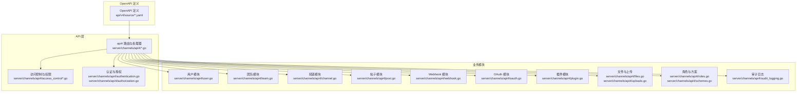
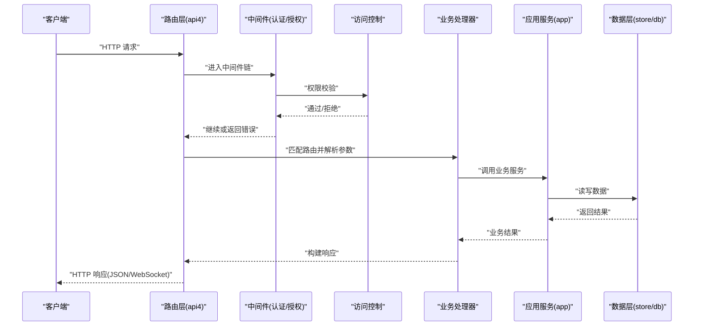
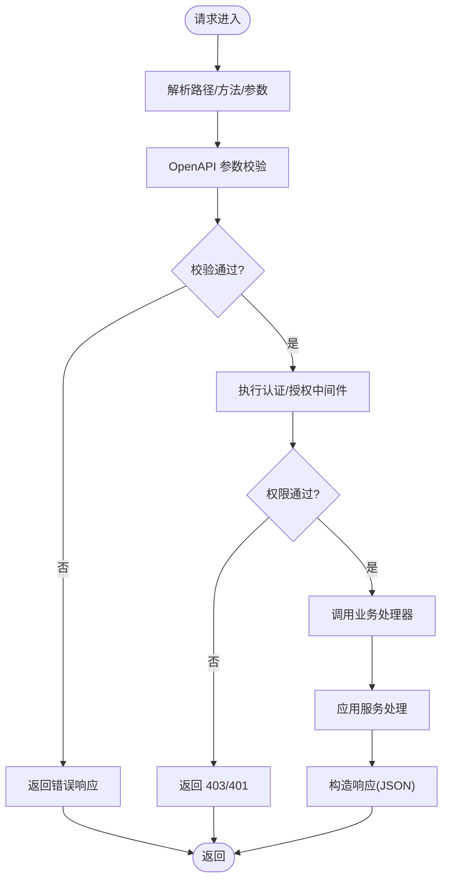
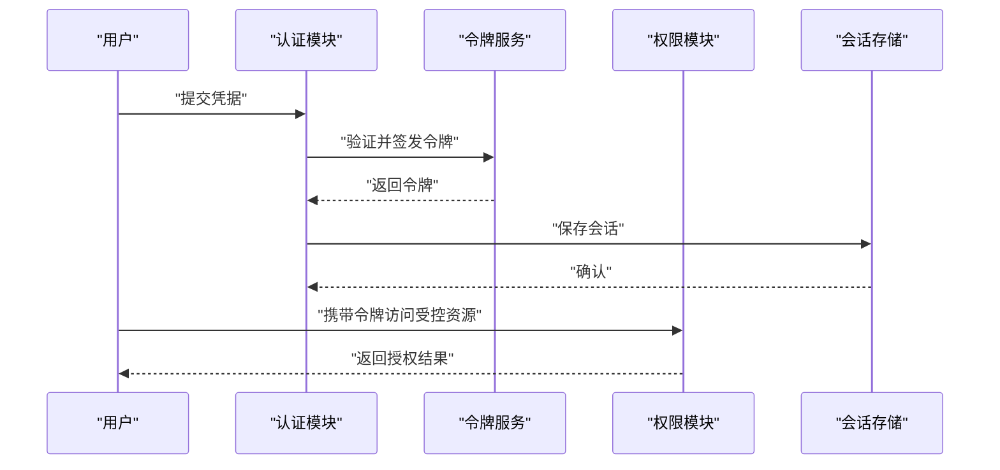
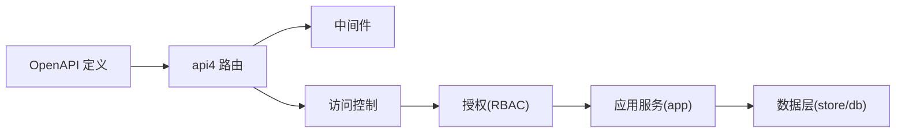

# API 开发

<cite>
**本文引用的文件**
- [api/server/main.go](file://api/server/main.go)
- [server/channels/api4/api.go](file://server/channels/api4/api.go)
- [server/channels/api4/access_control.go](file://server/channels/api4/access_control.go)
- [server/channels/api4/access_control_local.go](file://server/channels/api4/access_control_local.go)
- [server/channels/api4/user.go](file://server/channels/api4/user.go)
- [server/channels/api4/team.go](file://server/channels/api4/team.go)
- [server/channels/api4/channel.go](file://server/channels/api4/channel.go)
- [server/channels/api4/post.go](file://server/channels/api4/post.go)
- [server/channels/api4/webhook.go](file://server/channels/api4/webhook.go)
- [server/channels/api4/oauth.go](file://server/channels/api4/oauth.go)
- [server/channels/api4/authentication.go](file://server/channels/api4/authentication.go)
- [server/channels/api4/authorization.go](file://server/channels/api4/authorization.go)
- [server/channels/api4/system.go](file://server/channels/api4/system.go)
- [server/channels/api4/config.go](file://server/channels/api4/config.go)
- [server/channels/api4/plugin.go](file://server/channels/api4/plugin.go)
- [server/channels/api4/command.go](file://server/channels/api4/command.go)
- [server/channels/api4/preferences.go](file://server/channels/api4/preferences.go)
- [server/channels/api4/status.go](file://server/channels/api4/status.go)
- [server/channels/api4/uploads.go](file://server/channels/api4/uploads.go)
- [server/channels/api4/files.go](file://server/channels/api4/files.go)
- [server/channels/api4/groups.go](file://server/channels/api4/groups.go)
- [server/channels/api4/schemes.go](file://server/channels/api4/schemes.go)
- [server/channels/api4/roles.go](file://server/channels/api4/roles.go)
- [server/channels/api4/jobs.go](file://server/channels/api4/jobs.go)
- [server/channels/api4/logs.go](file://server/channels/api4/logs.go)
- [server/channels/api4/metrics.go](file://server/channels/api4/metrics.go)
- [server/channels/api4/reactions.go](file://server/channels/api4/reactions.go)
- [server/channels/api4/emoji.go](file://server/channels/api4/emoji.go)
- [server/channels/api4/boards.go](file://server/channels/api4/boards.go)
- [server/channels/api4/audit_logging.go](file://server/channels/api4/audit_logging.go)
- [server/channels/api4/data_retention.go](file://server/channels/api4/data_retention.go)
- [server/channels/api4/compliance.go](file://server/channels/api4/compliance.go)
- [server/channels/api4/cloud.go](file://server/channels/api4/cloud.go)
- [server/channels/api4/ldap.go](file://server/channels/api4/ldap.go)
- [server/channels/api4/saml.go](file://server/channels/api4/saml.go)
- [server/channels/api4/ip_filtering.go](file://server/channels/api4/ip_filtering.go)
- [server/channels/api4/cluster.go](file://server/channels/api4/cluster.go)
- [server/channels/api4/remote_cluster.go](file://server/channels/api4/remote_cluster.go)
- [server/channels/api4/shared_channel.go](file://server/channels/api4/shared_channel.go)
- [server/channels/api4/outgoing_oauth_connection.go](file://server/channels/api4/outgoing_oauth_connection.go)
- [server/channels/api4/websocket.go](file://server/channels/api4/websocket.go)
- [server/channels/api4/drafts.go](file://server/channels/api4/drafts.go)
- [server/channels/api4/view.go](file://server/channels/api4/view.go)
- [server/channels/api4/bookmarks.go](file://server/channels/api4/bookmarks.go)
- [server/channels/api4/usage.go](file://server/channels/api4/usage.go)
- [server/channels/api4/exports.go](file://server/channels/api4/exports.go)
- [server/channels/api4/imports.go](file://server/channels/api4/imports.go)
- [server/channels/api4/content_flagging.go](file://server/channels/api4/content_flagging.go)
- [server/channels/api4/recaps.go](file://server/channels/api4/recaps.go)
- [server/channels/api4/scheduled_post.go](file://server/channels/api4/scheduled_post.go)
- [server/channels/api4/service_terms.go](file://server/channels/api4/service_terms.go)
- [server/channels/api4/terms_of_service.go](file://server/channels/api4/terms_of_service.go)
- [server/channels/api4/custom_profile_attributes.go](file://server/channels/api4/custom_profile_attributes.go)
- [server/channels/api4/brand.go](file://server/channels/api4/brand.go)
- [server/channels/api4/agents.go](file://server/channels/api4/agents.go)
- [server/channels/api4/bots.go](file://server/channels/api4/bots.go)
- [server/channels/api4/views.yaml](file://api/v4/source/views.yaml)
- [api/v4/source/introduction.yaml](file://api/v4/source/introduction.yaml)
- [api/v4/source/definitions.yaml](file://api/v4/source/definitions.yaml)
- [api/v4/source/users.yaml](file://api/v4/source/users.yaml)
- [api/v4/source/teams.yaml](file://api/v4/source/teams.yaml)
- [api/v4/source/channels.yaml](file://api/v4/source/channels.yaml)
- [api/v4/source/posts.yaml](file://api/v4/source/posts.yaml)
- [api/v4/source/webhooks.yaml](file://api/v4/source/webhooks.yaml)
- [api/v4/source/oauth.yaml](file://api/v4/source/oauth.yaml)
- [api/v4/source/system.yaml](file://api/v4/source/system.yaml)
- [api/v4/source/config.yaml](file://api/v4/source/config.yaml)
- [api/v4/source/plugins.yaml](file://api/v4/source/plugins.yaml)
- [api/v4/source/commands.yaml](file://api/v4/source/commands.yaml)
- [api/v4/source/preferences.yaml](file://api/v4/source/preferences.yaml)
- [api/v4/source/status.yaml](file://api/v4/source/status.yaml)
- [api/v4/source/uploads.yaml](file://api/v4/source/uploads.yaml)
- [api/v4/source/files.yaml](file://api/v4/source/files.yaml)
- [api/v4/source/groups.yaml](file://api/v4/source/groups.yaml)
- [api/v4/source/schemes.yaml](file://api/v4/source/schemes.yaml)
- [api/v4/source/roles.yaml](file://api/v4/source/roles.yaml)
- [api/v4/source/jobs.yaml](file://api/v4/source/jobs.yaml)
- [api/v4/source/logs.yaml](file://api/v4/source/logs.yaml)
- [api/v4/source/metrics.yaml](file://api/v4/source/metrics.yaml)
- [api/v4/source/reactions.yaml](file://api/v4/source/reactions.yaml)
- [api/v4/source/emoji.yaml](file://api/v4/source/emoji.yaml)
- [api/v4/source/boards.yaml](file://api/v4/source/boards.yaml)
- [api/v4/source/audit_logging.yaml](file://api/v4/source/audit_logging.yaml)
- [api/v4/source/dataretention.yaml](file://api/v4/source/dataretention.yaml)
- [api/v4/source/compliance.yaml](file://api/v4/source/compliance.yaml)
- [api/v4/source/cloud.yaml](file://api/v4/source/cloud.yaml)
- [api/v4/source/ldap.yaml](file://api/v4/source/ldap.yaml)
- [api/v4/source/saml.yaml](file://api/v4/source/saml.yaml)
- [api/v4/source/ip_filters.yaml](file://api/v4/source/ip_filters.yaml)
- [api/v4/source/cluster.yaml](file://api/v4/source/cluster.yaml)
- [api/v4/source/remoteclusters.yaml](file://api/v4/source/remoteclusters.yaml)
- [api/v4/source/sharedchannels.yaml](file://api/v4/source/sharedchannels.yaml)
- [api/v4/source/outgoing_oauth_connections.yaml](file://api/v4/source/outgoing_oauth_connections.yaml)
- [api/v4/source/access_control.yaml](file://api/v4/source/access_control.yaml)
- [api/v4/source/permissions.yaml](file://api/v4/source/permissions.yaml)
- [api/v4/source/properties.yaml](file://api/v4/source/properties.yaml)
- [api/v4/source/views.yaml](file://api/v4/source/views.yaml)
- [api/v4/source/usage.yaml](file://api/v4/source/usage.yaml)
- [api/v4/source/exports.yaml](file://api/v4/source/exports.yaml)
- [api/v4/source/imports.yaml](file://api/v4/source/imports.yaml)
- [api/v4/source/content_flagging.yaml](file://api/v4/source/content_flagging.yaml)
- [api/v4/source/recaps.yaml](file://api/v4/source/recaps.yaml)
- [api/v4/source/scheduled_post.yaml](file://api/v4/source/scheduled_post.yaml)
- [api/v4/source/service_terms.yaml](file://api/v4/source/service_terms.yaml)
- [api/v4/source/teams.yaml](file://api/v4/source/teams.yaml)
- [api/v4/source/custom_profile_attributes.yaml](file://api/v4/source/custom_profile_attributes.yaml)
- [api/v4/source/brand.yaml](file://api/v4/source/brand.yaml)
- [api/v4/source/agents.yaml](file://api/v4/source/agents.yaml)
- [api/v4/source/bots.yaml](file://api/v4/source/bots.yaml)
- [api/v4/source/actions.yaml](file://api/v4/source/actions.yaml)
- [api/v4/source/brand.yaml](file://api/v4/source/brand.yaml)
- [api/v4/source/brand.yaml](file://api/v4/source/brand.yaml)
- [api/v4/source/brand.yaml](file://api/v4/source/brand.yaml)
- [api/v4/source/brand.yaml](file://api/v4/source/brand.yaml)
- [api/v4/source/brand.yaml](file://api/v4/source/brand.yaml)
- [api/v4/source/brand.yaml](file://api/v4/source/brand.yaml)
- [api/v4/source/brand.yaml](file://api/v4/source/brand.yaml)
- [api/v4/source/brand.yaml](file://api/v4/source/brand.yaml)
- [api/v4/source/brand.yaml](file://api/v4/source/brand.yaml)
- [api/v4/source/brand.yaml](file://api/v4/source/brand.yaml)
- [api/v4/source/brand.yaml](file://api/v4/source/brand.yaml)
- [api/v4/source/brand.yaml](file://api/v4/source/brand.yaml)
- [api/v4/source/brand.yaml](file://api/v4/source/brand.yaml)
- [api/v4/source/brand.yaml](file://api/v4/source/brand.yaml)
- [api/v4/source/brand.yaml](file://api/v4/source/brand.yaml)
- [api/v4/source/brand.yaml](file://api/v4/source/brand.yaml)
- [api/v4/source/brand.yaml](file://api/v4/source/brand.yaml)
- [api/v4/source/brand.yaml](file://api/v4/source/brand.yaml)
- [api/v4/source/brand.yaml](file://api/v4/source/brand.yaml)
- [api/v4/source/brand.yaml](file://api/v4/source/brand.yaml)
- [api/v4/source/brand.yaml](file://api/v4/source/brand.yaml)
- [api/v4/source/brand.yaml](file://api/v4/source/brand.yaml)
- [api/v4/source/brand.yaml](file://api/v4/source/brand.yaml)
- [api/v4/source/brand.yaml](file://api/v4/source/brand.yaml)
- [api/v4/source/brand.yaml](file://api/v4/source/brand.yaml)
......
</cite>

## 目录
1. [简介](#简介)
2. [项目结构](#项目结构)
3. [核心组件](#核心组件)
4. [架构总览](#架构总览)
5. [详细组件分析](#详细组件分析)
6. [依赖关系分析](#依赖关系分析)
7. [性能考量](#性能考量)
8. [故障排查指南](#故障排查指南)
9. [结论](#结论)
10. [附录](#附录)

## 简介
本指南面向 Mattermost 的 API 开发与维护者，系统阐述 RESTful API 设计原则与实现模式，覆盖 HTTP 方法使用、URL 路径设计、状态码规范；详解处理器架构（路由定义、参数解析、验证规则、响应格式标准化）；深入说明认证与授权机制（JWT 令牌处理、权限检查、会话管理）；介绍错误处理与异常管理（错误码定义、错误消息国际化、调试信息控制）；提供 API 版本管理策略（向后兼容性保证、迁移指南）；并给出完整代码示例与测试用例路径。

## 项目结构
Mattermost 后端采用 Go 语言实现，API 层位于 server/channels/api4 目录，负责所有 REST 接口的路由、处理器与业务编排。OpenAPI 定义位于 api/v4/source 目录，统一描述接口契约、数据模型与安全策略。前端与服务端通过标准 HTTP 协议交互，支持 JSON 响应与 WebSocket 实时通信。

图表来源
- [server/channels/api4/api.go](file://server/channels/api4/api.go)
- [server/channels/api4/access_control.go](file://server/channels/api4/access_control.go)
- [server/channels/api4/authentication.go](file://server/channels/api4/authentication.go)
- [server/channels/api4/authorization.go](file://server/channels/api4/authorization.go)
- [server/channels/api4/user.go](file://server/channels/api4/user.go)
- [server/channels/api4/team.go](file://server/channels/api4/team.go)
- [server/channels/api4/channel.go](file://server/channels/api4/channel.go)
- [server/channels/api4/post.go](file://server/channels/api4/post.go)
- [server/channels/api4/webhook.go](file://server/channels/api4/webhook.go)
- [server/channels/api4/oauth.go](file://server/channels/api4/oauth.go)
- [server/channels/api4/plugin.go](file://server/channels/api4/plugin.go)
- [server/channels/api4/files.go](file://server/channels/api4/files.go)
- [server/channels/api4/uploads.go](file://server/channels/api4/uploads.go)
- [server/channels/api4/roles.go](file://server/channels/api4/roles.go)
- [server/channels/api4/schemes.go](file://server/channels/api4/schemes.go)
- [server/channels/api4/audit_logging.go](file://server/channels/api4/audit_logging.go)
- [api/v4/source/users.yaml](file://api/v4/source/users.yaml)
- [api/v4/source/teams.yaml](file://api/v4/source/teams.yaml)
- [api/v4/source/channels.yaml](file://api/v4/source/channels.yaml)
- [api/v4/source/posts.yaml](file://api/v4/source/posts.yaml)
- [api/v4/source/webhooks.yaml](file://api/v4/source/webhooks.yaml)
- [api/v4/source/oauth.yaml](file://api/v4/source/oauth.yaml)
- [api/v4/source/plugins.yaml](file://api/v4/source/plugins.yaml)
- [api/v4/source/files.yaml](file://api/v4/source/files.yaml)
- [api/v4/source/uploads.yaml](file://api/v4/source/uploads.yaml)
- [api/v4/source/roles.yaml](file://api/v4/source/roles.yaml)
- [api/v4/source/schemes.yaml](file://api/v4/source/schemes.yaml)
- [api/v4/source/audit_logging.yaml](file://api/v4/source/audit_logging.yaml)

章节来源
- [server/channels/api4/api.go](file://server/channels/api4/api.go)
- [api/server/main.go](file://api/server/main.go)
- [api/v4/source/introduction.yaml](file://api/v4/source/introduction.yaml)

## 核心组件
- 路由与处理器：在 api4 包中集中定义 HTTP 路由、中间件与处理器函数，统一处理请求进入、参数解析、业务调用与响应返回。
- 访问控制与权限：通过访问控制模块对资源进行权限校验，结合角色与方案（Scheme/Roles）实现细粒度授权。
- 认证与授权：提供多种认证方式（用户名密码、OAuth、SAML、LDAP），并统一进行权限判定与会话管理。
- OpenAPI 定义：以 YAML 描述接口契约、数据模型、分页与错误码，确保前后端一致性与可测试性。
- 业务模块：按领域拆分（用户、团队、频道、帖子、文件、插件等），每个模块提供独立的处理器与数据模型。

章节来源
- [server/channels/api4/api.go](file://server/channels/api4/api.go)
- [server/channels/api4/access_control.go](file://server/channels/api4/access_control.go)
- [server/channels/api4/authentication.go](file://server/channels/api4/authentication.go)
- [server/channels/api4/authorization.go](file://server/channels/api4/authorization.go)
- [api/v4/source/definitions.yaml](file://api/v4/source/definitions.yaml)

## 架构总览
Mattermost API 采用“路由层 → 中间件 → 权限校验 → 业务处理器 → 数据层”的分层架构。请求从 HTTP 入口进入，经过认证与权限中间件，再根据 OpenAPI 定义进行参数校验与响应格式化，最终调用应用层业务逻辑并返回结果。

图表来源
- [server/channels/api4/api.go](file://server/channels/api4/api.go)
- [server/channels/api4/access_control.go](file://server/channels/api4/access_control.go)
- [server/channels/api4/authentication.go](file://server/channels/api4/authentication.go)
- [server/channels/api4/authorization.go](file://server/channels/api4/authorization.go)
- [server/channels/api4/user.go](file://server/channels/api4/user.go)
- [server/channels/api4/team.go](file://server/channels/api4/team.go)
- [server/channels/api4/channel.go](file://server/channels/api4/channel.go)
- [server/channels/api4/post.go](file://server/channels/api4/post.go)
- [server/channels/api4/webhook.go](file://server/channels/api4/webhook.go)
- [server/channels/api4/oauth.go](file://server/channels/api4/oauth.go)
- [server/channels/api4/plugin.go](file://server/channels/api4/plugin.go)
- [server/channels/api4/files.go](file://server/channels/api4/files.go)
- [server/channels/api4/uploads.go](file://server/channels/api4/uploads.go)
- [server/channels/api4/roles.go](file://server/channels/api4/roles.go)
- [server/channels/api4/schemes.go](file://server/channels/api4/schemes.go)
- [server/channels/api4/audit_logging.go](file://server/channels/api4/audit_logging.go)

## 详细组件分析

### 路由与处理器架构
- 路由定义：在 api4 包中集中注册各模块路由，使用 HTTP 方法映射到对应处理器函数，路径遵循 REST 风格（复数名词、资源嵌套）。
- 参数解析：统一从请求体、查询参数与路径参数中提取，结合 OpenAPI 定义进行类型转换与必填校验。
- 响应格式：统一返回 JSON 结构，包含数据主体与元信息（如分页、时间戳），错误时返回标准化错误对象。
- 中间件：包含认证、授权、速率限制、CORS、审计日志等，按需组合在路由上。

图表来源
- [server/channels/api4/api.go](file://server/channels/api4/api.go)
- [api/v4/source/definitions.yaml](file://api/v4/source/definitions.yaml)

章节来源
- [server/channels/api4/api.go](file://server/channels/api4/api.go)
- [api/v4/source/introduction.yaml](file://api/v4/source/introduction.yaml)

### 认证与授权机制
- 认证方式：支持用户名/密码登录、OAuth 登录、SAML 登录、LDAP 登录；统一通过认证模块生成/验证会话令牌。
- 会话管理：基于 Cookie/JWT 的会话存储与刷新策略，支持多设备登录与强制登出。
- 授权模型：基于角色与方案（Scheme/Roles）的 RBAC，结合资源级权限检查，确保最小权限原则。
- 审计日志：记录关键操作（登录、变更、删除）以便追溯。

图表来源
- [server/channels/api4/authentication.go](file://server/channels/api4/authentication.go)
- [server/channels/api4/authorization.go](file://server/channels/api4/authorization.go)
- [server/channels/api4/access_control.go](file://server/channels/api4/access_control.go)
- [server/channels/api4/access_control_local.go](file://server/channels/api4/access_control_local.go)

章节来源
- [server/channels/api4/authentication.go](file://server/channels/api4/authentication.go)
- [server/channels/api4/authorization.go](file://server/channels/api4/authorization.go)
- [server/channels/api4/access_control.go](file://server/channels/api4/access_control.go)
- [server/channels/api4/access_control_local.go](file://server/channels/api4/access_control_local.go)

### 错误处理与异常管理
- 错误码定义：统一错误码体系，区分业务错误、参数错误、鉴权错误与系统错误。
- 国际化：错误消息支持多语言，按请求语言返回对应文案。
- 调试信息：生产环境隐藏堆栈与敏感信息，仅保留必要上下文。
- 统一响应：错误响应包含错误码、消息、建议与可选的详细信息字段。

章节来源
- [server/channels/api4/api.go](file://server/channels/api4/api.go)
- [api/v4/source/definitions.yaml](file://api/v4/source/definitions.yaml)

### API 版本管理策略
- 版本号策略：通过 URL 路径版本化（如 /api/v4），保持 v4 稳定，新功能在 v4 内扩展。
- 向后兼容：新增字段默认可选，不破坏现有客户端；废弃字段保留但标记为已弃用。
- 迁移指南：在 OpenAPI 中明确标注变更、弃用与替代方案，提供升级路径与测试用例。

章节来源
- [api/v4/source/introduction.yaml](file://api/v4/source/introduction.yaml)
- [api/v4/source/definitions.yaml](file://api/v4/source/definitions.yaml)

### 用户、团队、频道、帖子与文件模块
- 用户模块：提供用户 CRUD、配置、偏好设置、状态与头像等接口。
- 团队模块：团队管理、成员管理、邀请与加入流程。
- 频道模块：频道 CRUD、成员管理、隐私设置与公告。
- 帖子模块：帖子 CRUD、回复、编辑、删除与附件。
- 文件模块：文件上传、下载、缩略图与预览。

章节来源
- [server/channels/api4/user.go](file://server/channels/api4/user.go)
- [server/channels/api4/team.go](file://server/channels/api4/team.go)
- [server/channels/api4/channel.go](file://server/channels/api4/channel.go)
- [server/channels/api4/post.go](file://server/channels/api4/post.go)
- [server/channels/api4/files.go](file://server/channels/api4/files.go)
- [server/channels/api4/uploads.go](file://server/channels/api4/uploads.go)

### OAuth、插件与 Webhook
- OAuth：第三方登录与授权回调，支持多提供商。
- 插件：插件生命周期管理、钩子与 API 扩展点。
- Webhook：入站与出站 Webhook，支持事件订阅与通知。

章节来源
- [server/channels/api4/oauth.go](file://server/channels/api4/oauth.go)
- [server/channels/api4/plugin.go](file://server/channels/api4/plugin.go)
- [server/channels/api4/webhook.go](file://server/channels/api4/webhook.go)

### 角色、方案与审计
- 角色与方案：定义全局与资源级权限集合，支持继承与覆盖。
- 审计日志：记录管理员与关键用户行为，支持检索与导出。

章节来源
- [server/channels/api4/roles.go](file://server/channels/api4/roles.go)
- [server/channels/api4/schemes.go](file://server/channels/api4/schemes.go)
- [server/channels/api4/audit_logging.go](file://server/channels/api4/audit_logging.go)

### 系统与配置、集群与云
- 系统与配置：运行时配置更新、健康检查与统计指标。
- 集群与云：跨节点同步、远程集群与共享频道、云服务集成。

章节来源
- [server/channels/api4/system.go](file://server/channels/api4/system.go)
- [server/channels/api4/config.go](file://server/channels/api4/config.go)
- [server/channels/api4/cluster.go](file://server/channels/api4/cluster.go)
- [server/channels/api4/cloud.go](file://server/channels/api4/cloud.go)
- [server/channels/api4/remote_cluster.go](file://server/channels/api4/remote_cluster.go)
- [server/channels/api4/shared_channel.go](file://server/channels/api4/shared_channel.go)

### 安全与合规
- LDAP/SAML/IP 过滤：外部身份源与网络访问控制。
- 合规与数据保留：合规导出、数据保留策略与清理任务。
- 反馈与内容标记：举报与内容审核流程。

章节来源
- [server/channels/api4/ldap.go](file://server/channels/api4/ldap.go)
- [server/channels/api4/saml.go](file://server/channels/api4/saml.go)
- [server/channels/api4/ip_filtering.go](file://server/channels/api4/ip_filtering.go)
- [server/channels/api4/compliance.go](file://server/channels/api4/compliance.go)
- [server/channels/api4/data_retention.go](file://server/channels/api4/data_retention.go)
- [server/channels/api4/content_flagging.go](file://server/channels/api4/content_flagging.go)

### WebSocket 与实时通信
- WebSocket：连接建立、认证、事件订阅与断线重连。
- 实时状态：在线状态、输入提示与活动通知。

章节来源
- [server/channels/api4/websocket.go](file://server/channels/api4/websocket.go)
- [server/channels/api4/status.go](file://server/channels/api4/status.go)

### 测试与质量保障
- 单元测试：每个处理器与服务均配套测试，覆盖正常与异常路径。
- 集成测试：端到端场景验证，包括认证、授权与业务流程。
- 性能测试：基准测试与压力测试，评估吞吐与延迟。

章节来源
- [server/channels/api4/user_test.go](file://server/channels/api4/user_test.go)
- [server/channels/api4/team_test.go](file://server/channels/api4/team_test.go)
- [server/channels/api4/channel_test.go](file://server/channels/api4/channel_test.go)
- [server/channels/api4/post_test.go](file://server/channels/api4/post_test.go)
- [server/channels/api4/webhook_test.go](file://server/channels/api4/webhook_test.go)
- [server/channels/api4/oauth_test.go](file://server/channels/api4/oauth_test.go)
- [server/channels/api4/plugin_test.go](file://server/channels/api4/plugin_test.go)
- [server/channels/api4/files_test.go](file://server/channels/api4/files_test.go)
- [server/channels/api4/uploads_test.go](file://server/channels/api4/uploads_test.go)
- [server/channels/api4/roles_test.go](file://server/channels/api4/roles_test.go)
- [server/channels/api4/schemes_test.go](file://server/channels/api4/schemes_test.go)
- [server/channels/api4/audit_logging_test.go](file://server/channels/api4/audit_logging_test.go)
- [server/channels/api4/authentication_test.go](file://server/channels/api4/authentication_test.go)
- [server/channels/api4/authorization_test.go](file://server/channels/api4/authorization_test.go)
- [server/channels/api4/access_control_test.go](file://server/channels/api4/access_control_test.go)

## 依赖关系分析
- 路由层依赖于中间件与权限模块，后者依赖于认证与角色方案。
- 业务模块依赖于应用服务层，应用服务层依赖于数据层与平台服务。
- OpenAPI 定义驱动路由与参数校验，确保前后端一致。

图表来源
- [server/channels/api4/api.go](file://server/channels/api4/api.go)
- [server/channels/api4/access_control.go](file://server/channels/api4/access_control.go)
- [server/channels/api4/authentication.go](file://server/channels/api4/authentication.go)
- [server/channels/api4/authorization.go](file://server/channels/api4/authorization.go)
- [api/v4/source/definitions.yaml](file://api/v4/source/definitions.yaml)

章节来源
- [server/channels/api4/api.go](file://server/channels/api4/api.go)
- [server/channels/api4/access_control.go](file://server/channels/api4/access_control.go)
- [server/channels/api4/authentication.go](file://server/channels/api4/authentication.go)
- [server/channels/api4/authorization.go](file://server/channels/api4/authorization.go)
- [api/v4/source/definitions.yaml](file://api/v4/source/definitions.yaml)

## 性能考量
- 路由与中间件：减少不必要的中间件链，优先短路失败请求。
- 参数校验：在进入业务前完成严格校验，避免无效调用。
- 缓存策略：对热点数据与只读接口启用缓存，降低数据库压力。
- 并发与限流：合理设置并发阈值与速率限制，防止雪崩。
- 日志与监控：开启必要的性能指标与审计日志，持续优化瓶颈。

## 故障排查指南
- 常见错误码：400（参数错误）、401（未认证）、403（无权限）、404（资源不存在）、429（请求过快）、500（服务器内部错误）。
- 定位步骤：检查请求路径与方法是否正确，确认认证令牌有效，核对权限范围，查看审计日志与错误详情。
- 本地调试：使用测试工具模拟请求，逐步缩小问题范围；关注响应体中的错误码与消息。

章节来源
- [server/channels/api4/api.go](file://server/channels/api4/api.go)
- [server/channels/api4/audit_logging.go](file://server/channels/api4/audit_logging.go)

## 结论
Mattermost 的 API 架构清晰、模块化程度高，配合完善的 OpenAPI 定义与严格的中间件体系，能够稳定支撑复杂的企业协作场景。遵循本文的设计原则与实现模式，可高效构建可维护、可扩展且安全的 RESTful API。

## 附录
- 代码示例与测试用例路径参考各章节“章节来源”标注。
- OpenAPI 定义文件位于 api/v4/source 目录，涵盖用户、团队、频道、帖子、文件、插件等模块的接口契约与数据模型。