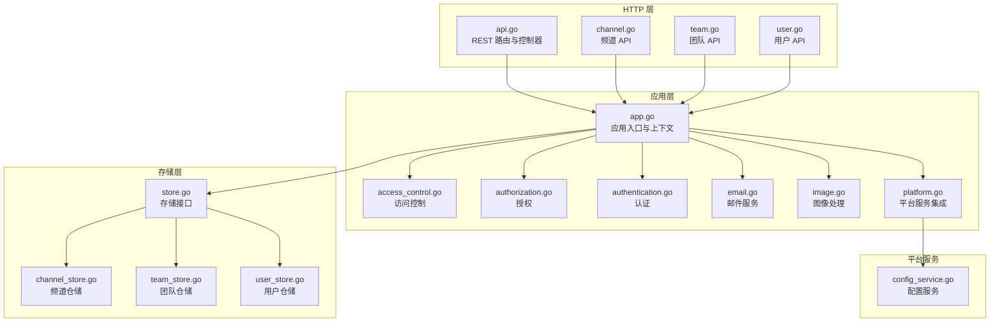
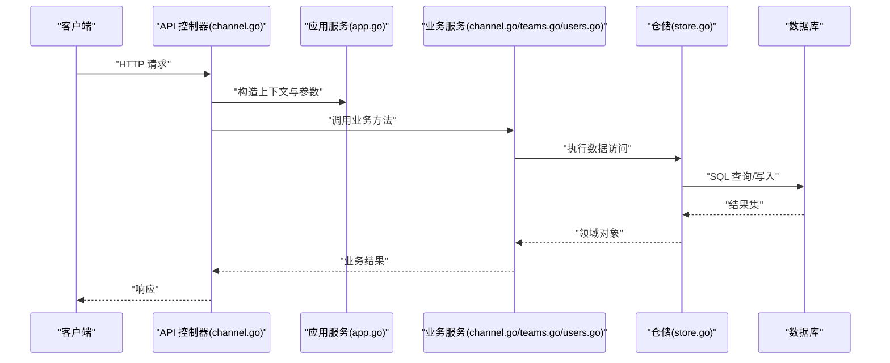
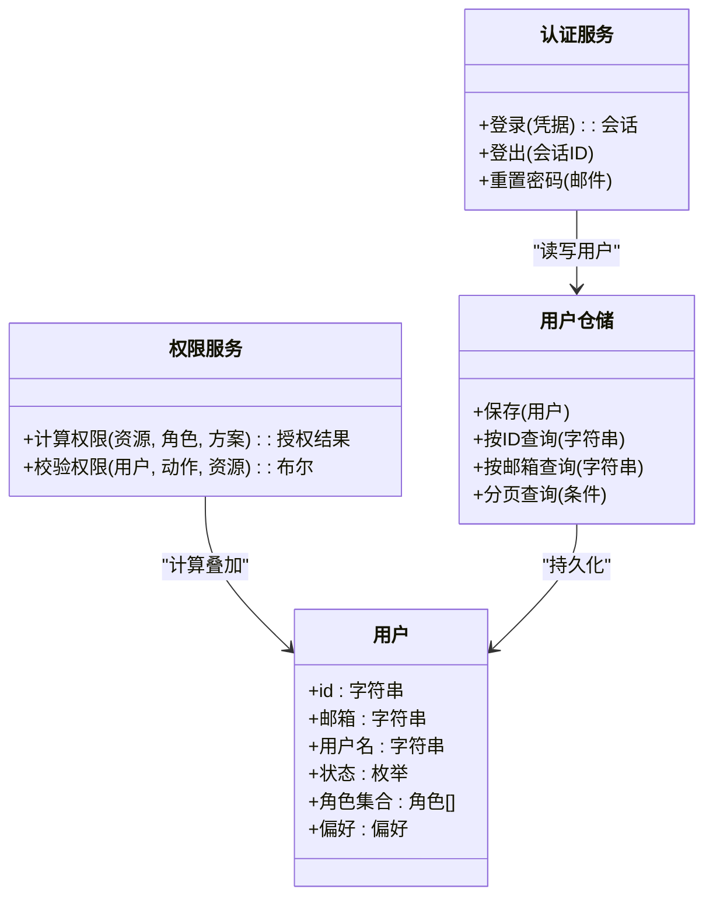
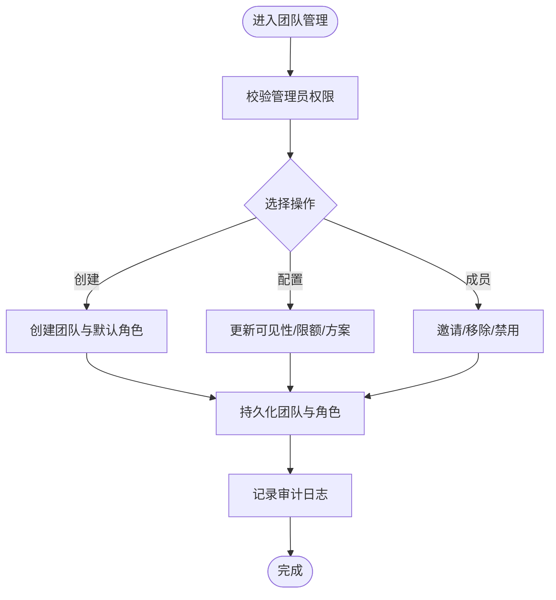
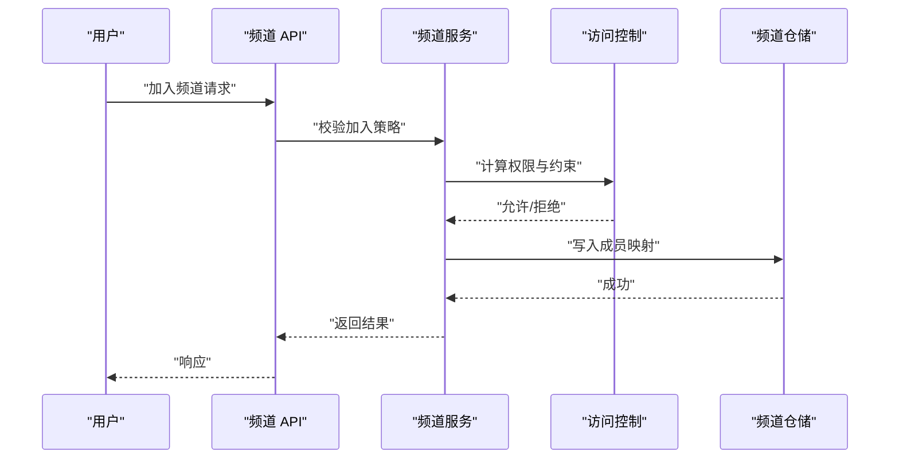
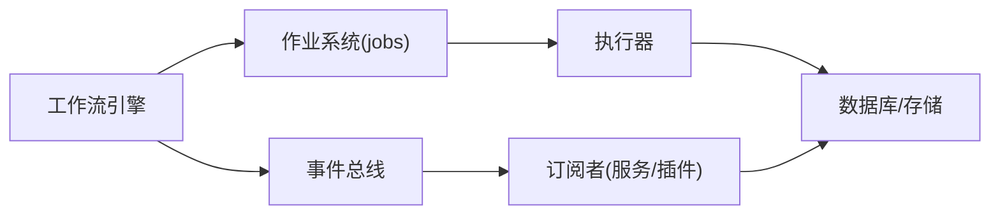
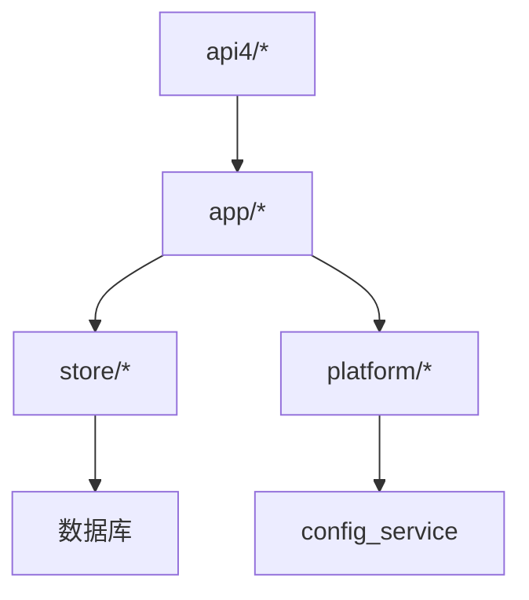

# 业务逻辑

<cite>
**本文引用的文件**
- [server/channels/api4/api.go](file://server/channels/api4/api.go)
- [server/channels/api4/channel.go](file://server/channels/api4/channel.go)
- [server/channels/api4/team.go](file://server/channels/api4/team.go)
- [server/channels/api4/user.go](file://server/channels/api4/user.go)
- [server/channels/app/app.go](file://server/channels/app/app.go)
- [server/channels/app/channel.go](file://server/channels/app/channel.go)
- [server/channels/app/teams.go](file://server/channels/app/teams.go)
- [server/channels/app/users.go](file://server/channels/app/users.go)
- [server/channels/store/store.go](file://server/channels/store/store.go)
- [server/channels/store/channel_store.go](file://server/channels/store/channel_store.go)
- [server/channels/store/team_store.go](file://server/channels/store/team_store.go)
- [server/channels/store/user_store.go](file://server/channels/store/user_store.go)
- [server/channels/jobs/jobs.go](file://server/channels/jobs/jobs.go)
- [server/channels/jobs/plugin_jobs.go](file://server/channels/jobs/plugin_jobs.go)
- [server/config/config.go](file://server/config/config.go)
- [server/platform/services/config/config_service.go](file://server/platform/services/config/config_service.go)
- [server/einterfaces/access_control.go](file://server/einterfaces/access_control.go)
- [server/channels/app/access_control.go](file://server/channels/app/access_control.go)
- [server/channels/app/authorization.go](file://server/channels/app/authorization.go)
- [server/channels/app/authentication.go](file://server/channels/app/authentication.go)
- [server/channels/app/analytics.go](file://server/channels/app/analytics.go)
- [server/channels/app/email/email.go](file://server/channels/app/email/email.go)
- [server/channels/app/imaging/image.go](file://server/channels/app/imaging/image.go)
- [server/channels/app/platform/platform.go](file://server/channels/app/platform/platform.go)
- [server/channels/app/platform/platform_services.go](file://server/channels/app/platform/platform_services.go)
- [server/channels/app/testlib/apitestlib.go](file://server/channels/app/testlib/apitestlib.go)
- [server/channels/app/testlib/main_test.go](file://server/channels/app/testlib/main_test.go)
- [server/channels/api4/apitestlib.go](file://server/channels/api4/apitestlib.go)
- [server/channels/api4/channel_test.go](file://server/channels/api4/channel_test.go)
- [server/channels/api4/team_test.go](file://server/channels/api4/team_test.go)
- [server/channels/api4/user_test.go](file://server/channels/api4/user_test.go)
</cite>

## 目录
1. [引言](#引言)
2. [项目结构](#项目结构)
3. [核心组件](#核心组件)
4. [架构总览](#架构总览)
5. [详细组件分析](#详细组件分析)
6. [依赖关系分析](#依赖关系分析)
7. [性能考虑](#性能考虑)
8. [故障排查指南](#故障排查指南)
9. [结论](#结论)
10. [附录](#附录)

## 引言
本文件面向 Mattermost 的业务逻辑实现，聚焦于领域模型与服务层架构，覆盖用户管理、团队管理与频道管理的核心业务规则；阐述服务层封装、事务边界与错误传播机制；总结数据访问模式（Repository 模式、查询优化与缓存策略）；解释业务流程编排（工作流、异步任务与事件驱动）；给出业务规则验证（输入校验、业务约束与合规检查）；并提供性能监控与指标收集建议及完整业务用例与单元测试参考路径。

## 项目结构
Mattermost 后端采用分层架构：HTTP 层负责路由与请求处理，应用层封装业务服务，存储层抽象数据访问，平台服务提供基础设施能力。关键模块如下：
- HTTP 层：位于 server/channels/api4，提供 REST API 入口与控制器逻辑
- 应用层：位于 server/channels/app，封装业务服务、授权与认证、邮件与图像处理等
- 存储层：位于 server/channels/store，实现 Repository 模式与数据库交互
- 平台服务：位于 server/platform/services，提供配置、集群、通知等通用能力
- 配置与企业特性：位于 server/config 与 server/enterprise

**图表来源**
- [server/channels/api4/api.go](file://server/channels/api4/api.go)
- [server/channels/api4/channel.go](file://server/channels/api4/channel.go)
- [server/channels/api4/team.go](file://server/channels/api4/team.go)
- [server/channels/api4/user.go](file://server/channels/api4/user.go)
- [server/channels/app/app.go](file://server/channels/app/app.go)
- [server/channels/app/access_control.go](file://server/channels/app/access_control.go)
- [server/channels/app/authorization.go](file://server/channels/app/authorization.go)
- [server/channels/app/authentication.go](file://server/channels/app/authentication.go)
- [server/channels/app/email/email.go](file://server/channels/app/email/email.go)
- [server/channels/app/imaging/image.go](file://server/channels/app/imaging/image.go)
- [server/channels/app/platform/platform.go](file://server/channels/app/platform/platform.go)
- [server/platform/services/config/config_service.go](file://server/platform/services/config/config_service.go)
- [server/channels/store/store.go](file://server/channels/store/store.go)
- [server/channels/store/channel_store.go](file://server/channels/store/channel_store.go)
- [server/channels/store/team_store.go](file://server/channels/store/team_store.go)
- [server/channels/store/user_store.go](file://server/channels/store/user_store.go)

**章节来源**
- [server/channels/api4/api.go](file://server/channels/api4/api.go)
- [server/channels/app/app.go](file://server/channels/app/app.go)
- [server/channels/store/store.go](file://server/channels/store/store.go)

## 核心组件
本节从领域模型与服务层两个维度，系统性梳理用户、团队与频道的业务规则与实现要点。

- 用户管理
  - 领域模型：用户实体包含身份标识、状态、权限集与配置项；支持密码安全、多设备登录、个人资料与偏好设置
  - 业务规则：注册/登录流程、密码策略、邮箱验证、MFA、角色与权限继承、全局与团队级权限叠加
  - 关键服务：认证与会话管理、用户资料更新、密码变更、头像上传与缩略图生成、邮件通知
  - 数据访问：用户仓储提供 CRUD、唯一性约束（邮箱/用户名）、分页查询与索引优化

- 团队管理
  - 领域模型：团队实体包含可见性、成员上限、邀请码与配置；支持多层级角色与权限方案
  - 业务规则：团队创建者/管理员权限、成员邀请与审批、加入策略（公开/私有）、限制与配额
  - 关键服务：团队创建与配置、成员增删改查、角色分配与权限计算、团队统计与审计
  - 数据访问：团队仓储提供团队查询、成员映射、权限缓存与批量操作

- 频道管理
  - 领域模型：频道实体包含类型（公开/私有/直接/互动）、主题、描述与归档状态；支持话题标签与发现
  - 业务规则：频道可见性与发现、成员加入/退出、权限继承自团队与方案、消息与文件权限
  - 关键服务：频道创建/更新/删除、成员管理、权限校验、消息与文件关联、频道分类与侧边栏组织
  - 数据访问：频道仓储提供频道树、成员映射、权限缓存与查询优化

**章节来源**
- [server/channels/app/users.go](file://server/channels/app/users.go)
- [server/channels/app/teams.go](file://server/channels/app/teams.go)
- [server/channels/app/channel.go](file://server/channels/app/channel.go)
- [server/channels/store/user_store.go](file://server/channels/store/user_store.go)
- [server/channels/store/team_store.go](file://server/channels/store/team_store.go)
- [server/channels/store/channel_store.go](file://server/channels/store/channel_store.go)

## 架构总览
下图展示从 HTTP 请求到应用服务再到存储层的调用链路，以及平台服务与配置服务的集成点。

**图表来源**
- [server/channels/api4/channel.go](file://server/channels/api4/channel.go)
- [server/channels/api4/team.go](file://server/channels/api4/team.go)
- [server/channels/api4/user.go](file://server/channels/api4/user.go)
- [server/channels/app/app.go](file://server/channels/app/app.go)
- [server/channels/app/channel.go](file://server/channels/app/channel.go)
- [server/channels/app/teams.go](file://server/channels/app/teams.go)
- [server/channels/app/users.go](file://server/channels/app/users.go)
- [server/channels/store/store.go](file://server/channels/store/store.go)

## 详细组件分析

### 用户管理组件
- 认证与会话
  - 登录流程：校验凭据、生成会话令牌、记录登录审计、触发 MFA 流程（如启用）
  - 密码策略：最小长度、复杂度、历史密码限制、过期策略
  - 多设备登录：并发会话管理、强制登出与踢人
- 用户资料与偏好
  - 个人资料字段扩展、头像上传与缩略图生成、时区与语言偏好
  - 隐私与可见性：邮箱隐藏、在线状态、搜索可见性
- 权限与角色
  - 基于全局角色与团队/频道角色的叠加计算，支持方案（Scheme）继承
  - 访问控制：基于资源与动作的细粒度授权矩阵

**图表来源**
- [server/channels/app/authentication.go](file://server/channels/app/authentication.go)
- [server/channels/app/authorization.go](file://server/channels/app/authorization.go)
- [server/channels/store/user_store.go](file://server/channels/store/user_store.go)

**章节来源**
- [server/channels/app/authentication.go](file://server/channels/app/authentication.go)
- [server/channels/app/authorization.go](file://server/channels/app/authorization.go)
- [server/channels/store/user_store.go](file://server/channels/store/user_store.go)

### 团队管理组件
- 创建与配置
  - 可见性策略（公开/私有）、邀请码、成员上限、默认角色与方案
  - 管理员权限：成员管理、角色分配、配置修改
- 成员生命周期
  - 邀请/批准、加入/退出、禁用/恢复、批量导入
- 统计与审计
  - 活跃用户、消息数、文件数等指标聚合，审计日志落盘

**图表来源**
- [server/channels/app/teams.go](file://server/channels/app/teams.go)
- [server/channels/store/team_store.go](file://server/channels/store/team_store.go)

**章节来源**
- [server/channels/app/teams.go](file://server/channels/app/teams.go)
- [server/channels/store/team_store.go](file://server/channels/store/team_store.go)

### 频道管理组件
- 类型与可见性
  - 公开/私有/直接/互动频道；发现与搜索可见性
- 成员与权限
  - 加入策略、权限继承自团队与方案；消息与文件权限
- 分类与侧边栏
  - 用户自定义分类、排序与折叠；频道快捷方式

**图表来源**
- [server/channels/api4/channel.go](file://server/channels/api4/channel.go)
- [server/channels/app/channel.go](file://server/channels/app/channel.go)
- [server/channels/app/access_control.go](file://server/channels/app/access_control.go)
- [server/channels/store/channel_store.go](file://server/channels/store/channel_store.go)

**章节来源**
- [server/channels/api4/channel.go](file://server/channels/api4/channel.go)
- [server/channels/app/channel.go](file://server/channels/app/channel.go)
- [server/channels/store/channel_store.go](file://server/channels/store/channel_store.go)

### 服务层架构与事务边界
- 业务服务封装
  - 将跨仓储的复合业务封装为服务方法，保证原子性与一致性
  - 错误传播：统一返回业务错误对象，携带可读信息与错误码
- 事务边界
  - 在需要强一致性的场景（如用户注册与初始化团队）使用事务包裹多个仓储操作
  - 对只读查询不开启事务，减少锁竞争
- 并发与锁
  - 使用乐观锁或版本号避免并发写冲突
  - 对热点资源加分布式锁或本地互斥，降低竞争

**章节来源**
- [server/channels/app/app.go](file://server/channels/app/app.go)
- [server/channels/store/store.go](file://server/channels/store/store.go)

### 数据访问模式
- Repository 模式
  - 定义仓储接口与具体实现，隔离 SQL 细节与业务逻辑
  - 支持分页、过滤、排序与组合查询
- 查询优化
  - 为高频查询建立合适索引（如邮箱、用户名、团队ID、频道ID）
  - 使用连接查询替代 N+1 查询，必要时引入临时表或物化视图
- 缓存策略
  - L1：进程内缓存（用户权限、角色、配置片段）
  - L2：分布式缓存（用户会话、频道成员列表、团队统计）
  - 缓存失效：基于事件驱动（写操作后主动失效相关键）

**章节来源**
- [server/channels/store/store.go](file://server/channels/store/store.go)
- [server/channels/store/user_store.go](file://server/channels/store/user_store.go)
- [server/channels/store/team_store.go](file://server/channels/store/team_store.go)
- [server/channels/store/channel_store.go](file://server/channels/store/channel_store.go)

### 业务流程编排
- 工作流管理
  - 通过应用层服务编排多步骤流程（如用户注册：创建用户→初始化设置→发送欢迎邮件→加入默认团队）
- 异步任务
  - 使用作业系统（jobs）异步处理耗时任务（如导出、报表、清理）
  - 插件作业：插件可注册自定义作业类型与执行器
- 事件驱动
  - 事件发布/订阅：成员变更、消息发送、配置更新等事件触发后续处理
  - 平台服务：配置变更事件驱动缓存刷新与广播

**图表来源**
- [server/channels/jobs/jobs.go](file://server/channels/jobs/jobs.go)
- [server/channels/jobs/plugin_jobs.go](file://server/channels/jobs/plugin_jobs.go)
- [server/channels/app/platform/platform.go](file://server/channels/app/platform/platform.go)

**章节来源**
- [server/channels/jobs/jobs.go](file://server/channels/jobs/jobs.go)
- [server/channels/jobs/plugin_jobs.go](file://server/channels/jobs/plugin_jobs.go)
- [server/channels/app/platform/platform.go](file://server/channels/app/platform/platform.go)

### 业务规则验证
- 输入验证
  - 参数白名单、长度/格式校验、枚举值限制
- 业务约束
  - 成员数量上限、频道类型与可见性约束、权限继承规则
- 合规检查
  - 数据保留策略、审计日志完整性、敏感信息脱敏

**章节来源**
- [server/channels/app/access_control.go](file://server/channels/app/access_control.go)
- [server/einterfaces/access_control.go](file://server/einterfaces/access_control.go)

## 依赖关系分析
- 模块耦合
  - HTTP 层仅依赖应用层接口，低耦合高内聚
  - 应用层依赖存储层接口，通过依赖注入替换实现
- 外部依赖
  - 数据库驱动、缓存客户端、邮件服务、搜索引擎（可选）
- 循环依赖
  - 通过接口与分层避免循环依赖；仓储接口在上层定义，实现下沉

**图表来源**
- [server/channels/api4/api.go](file://server/channels/api4/api.go)
- [server/channels/app/app.go](file://server/channels/app/app.go)
- [server/channels/store/store.go](file://server/channels/store/store.go)
- [server/platform/services/config/config_service.go](file://server/platform/services/config/config_service.go)

**章节来源**
- [server/channels/api4/api.go](file://server/channels/api4/api.go)
- [server/channels/app/app.go](file://server/channels/app/app.go)
- [server/channels/store/store.go](file://server/channels/store/store.go)

## 性能考虑
- 关键指标
  - 响应时间（P50/P95/P99）、吞吐量（QPS）、错误率、缓存命中率、数据库慢查询数
- 查询优化
  - 建立复合索引、避免 SELECT *、使用 LIMIT 与分页游标
- 缓存策略
  - 热点数据短 TTL，冷数据长 TTL；写多读少场景采用延迟双删
- 并发与限流
  - 基于令牌桶的速率限制，防止突发流量击穿
- 监控与告警
  - 结合平台服务的指标采集，设置阈值告警与自动扩容

[本节为通用指导，无需列出具体文件来源]

## 故障排查指南
- 常见问题
  - 权限不足：检查角色叠加与方案继承；确认访问控制是否生效
  - 缓存不一致：触发缓存失效或手动刷新；核对键空间命名规范
  - 数据不一致：检查事务边界与回滚路径；定位慢查询与锁等待
- 日志与追踪
  - 开启审计日志与请求追踪；结合平台服务的日志聚合
- 单元测试与回归
  - 利用测试库快速搭建环境与断言；覆盖边界条件与异常分支

**章节来源**
- [server/channels/app/testlib/apitestlib.go](file://server/channels/app/testlib/apitestlib.go)
- [server/channels/app/testlib/main_test.go](file://server/channels/app/testlib/main_test.go)
- [server/channels/api4/apitestlib.go](file://server/channels/api4/apitestlib.go)

## 结论
Mattermost 的业务逻辑以清晰的分层架构实现：HTTP 层专注协议与路由，应用层封装业务与规则，存储层抽象数据访问，平台服务提供横切能力。通过严格的访问控制、事务边界与错误传播机制，确保业务一致性与可观测性。配合查询优化与缓存策略，可在高并发场景保持稳定性能。建议持续完善事件驱动与异步编排，进一步提升系统的弹性与可维护性。

## 附录
- 业务用例示例（参考路径）
  - 用户注册与登录：[server/channels/api4/user.go](file://server/channels/api4/user.go)，[server/channels/app/authentication.go](file://server/channels/app/authentication.go)
  - 创建团队与邀请成员：[server/channels/api4/team.go](file://server/channels/api4/team.go)，[server/channels/app/teams.go](file://server/channels/app/teams.go)
  - 创建频道与成员加入：[server/channels/api4/channel.go](file://server/channels/api4/channel.go)，[server/channels/app/channel.go](file://server/channels/app/channel.go)
- 单元测试（参考路径）
  - 用户相关测试：[server/channels/api4/user_test.go](file://server/channels/api4/user_test.go)
  - 团队相关测试：[server/channels/api4/team_test.go](file://server/channels/api4/team_test.go)
  - 频道相关测试：[server/channels/api4/channel_test.go](file://server/channels/api4/channel_test.go)
  - 测试工具与基座：[server/channels/app/testlib/apitestlib.go](file://server/channels/app/testlib/apitestlib.go)，[server/channels/api4/apitestlib.go](file://server/channels/api4/apitestlib.go)