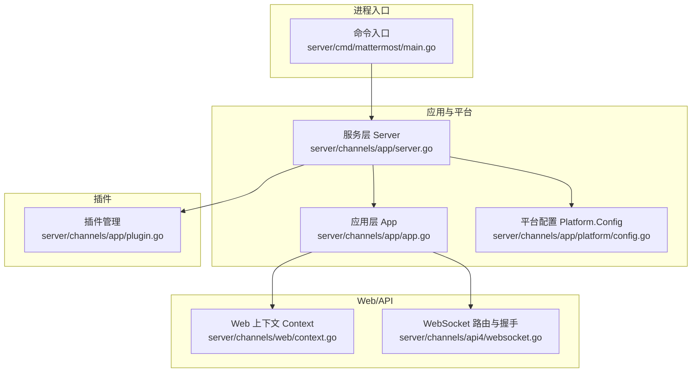
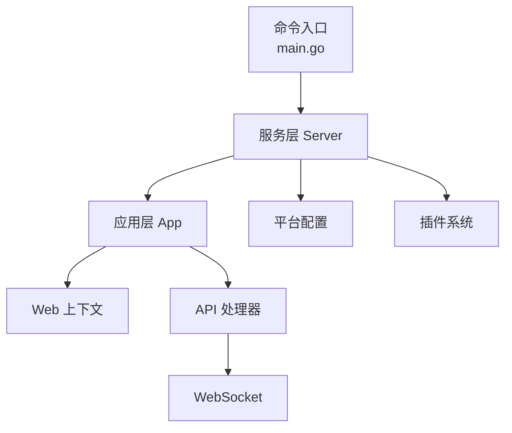
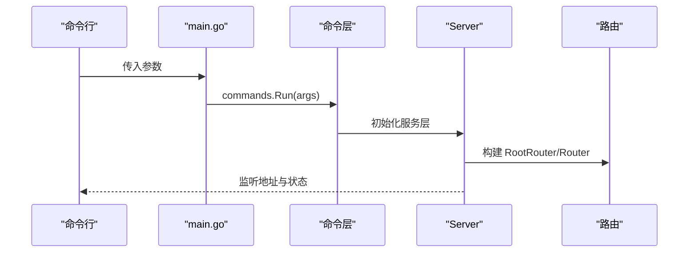
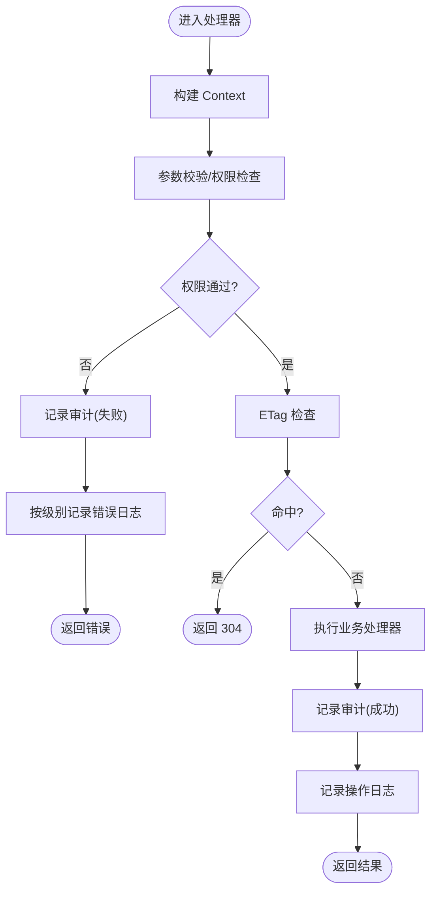
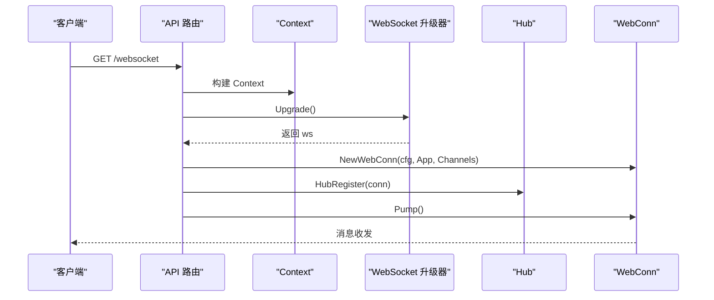
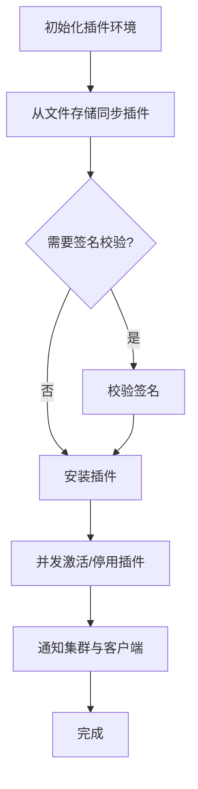
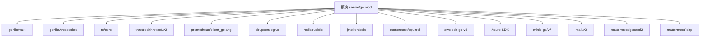

# 后端开发

<cite>
**本文引用的文件**
- [server/go.mod](file://server/go.mod)
- [server/cmd/mattermost/main.go](file://server/cmd/mattermost/main.go)
- [server/channels/app/app.go](file://server/channels/app/app.go)
- [server/channels/app/server.go](file://server/channels/app/server.go)
- [server/channels/web/context.go](file://server/channels/web/context.go)
- [server/channels/api4/websocket.go](file://server/channels/api4/websocket.go)
- [server/channels/app/platform/config.go](file://server/channels/app/platform/config.go)
- [server/channels/app/plugin.go](file://server/channels/app/plugin.go)
- [server/public/model/config.go](file://server/public/model/config.go)
</cite>

## 目录
1. [引言](#引言)
2. [项目结构](#项目结构)
3. [核心组件](#核心组件)
4. [架构总览](#架构总览)
5. [详细组件分析](#详细组件分析)
6. [依赖分析](#依赖分析)
7. [性能考虑](#性能考虑)
8. [故障排查指南](#故障排查指南)
9. [结论](#结论)
10. [附录](#附录)

## 引言
本指南面向 Mattermost 后端开发者，系统性阐述 Go 在项目中的应用方式与工程实践，覆盖服务器启动流程、中间件与请求处理管道、RESTful API 设计与实现模式、数据库与 ORM 使用、业务逻辑分层、实时通信（WebSocket）、以及插件体系的开发与生命周期管理。文档以仓库实际源码为依据，结合图示帮助读者快速建立对系统全貌的理解。

## 项目结构
- 顶层模块与版本：后端以模块形式组织，Go 版本要求与第三方依赖在模块文件中集中声明，便于统一升级与审计。
- 命令入口：命令行入口通过主程序调用命令层执行，加载平台与企业版扩展。
- 应用层与服务层：应用层（App）作为请求级业务编排者，服务层（Server/Channels/Platform 等）负责具体能力与基础设施。
- Web 层与 API 层：Web 层封装上下文与审计、权限、错误等横切关注点；API 层负责路由注册与处理器绑定。
- 插件系统：插件环境由平台服务统一管理，支持启用/禁用、签名校验、远程市场拉取与本地安装同步。
- 配置系统：平台服务提供配置读取、变更监听、只读控制、客户端配置生成等能力。

图表来源
- [server/cmd/mattermost/main.go:19-23](file://server/cmd/mattermost/main.go#L19-L23)
- [server/channels/app/server.go:91-162](file://server/channels/app/server.go#L91-L162)
- [server/channels/app/app.go:22-37](file://server/channels/app/app.go#L22-L37)
- [server/channels/web/context.go:19-26](file://server/channels/web/context.go#L19-L26)
- [server/channels/api4/websocket.go:52-55](file://server/channels/api4/websocket.go#L52-L55)
- [server/channels/app/platform/config.go:31-38](file://server/channels/app/platform/config.go#L31-L38)
- [server/channels/app/plugin.go:42-73](file://server/channels/app/plugin.go#L42-L73)

章节来源
- [server/go.mod:3](file://server/go.mod#L3)
- [server/cmd/mattermost/main.go:19-23](file://server/cmd/mattermost/main.go#L19-L23)
- [server/channels/app/server.go:91-162](file://server/channels/app/server.go#L91-L162)
- [server/channels/app/app.go:22-37](file://server/channels/app/app.go#L22-L37)
- [server/channels/web/context.go:19-26](file://server/channels/web/context.go#L19-L26)
- [server/channels/api4/websocket.go:52-55](file://server/channels/api4/websocket.go#L52-L55)
- [server/channels/app/platform/config.go:31-38](file://server/channels/app/platform/config.go#L31-L38)
- [server/channels/app/plugin.go:42-73](file://server/channels/app/plugin.go#L42-L73)

## 核心组件
- 应用层 App：请求作用域内的纯函数式组件，聚合各子系统能力（集群、搜索、通知、HTTP 服务、图片代理、时区等），提供统一业务入口。
- 服务层 Server：承载 HTTP 路由、速率限制、邮件、推送、作业调度、平台服务、审计、云/IP 过滤等核心设施。
- Web 上下文 Context：封装会话、参数校验、审计记录、错误日志分级、ETag 处理、权限检查等通用逻辑。
- 平台配置 Platform.Config：提供配置读取、变更监听、只读控制、客户端配置生成、日志目标重载等。
- 插件系统：插件环境初始化、启用/禁用、签名校验、远程市场拉取、本地同步、集群状态通知。
- WebSocket：基于 Gorilla WebSocket 升级，支持 Origin 校验、连接标识与序列号恢复、Hub 注册与泵驱动循环。

章节来源
- [server/channels/app/app.go:22-125](file://server/channels/app/app.go#L22-L125)
- [server/channels/app/server.go:91-162](file://server/channels/app/server.go#L91-L162)
- [server/channels/web/context.go:19-286](file://server/channels/web/context.go#L19-L286)
- [server/channels/app/platform/config.go:40-129](file://server/channels/app/platform/config.go#L40-L129)
- [server/channels/app/plugin.go:170-257](file://server/channels/app/plugin.go#L170-L257)
- [server/channels/api4/websocket.go:52-125](file://server/channels/api4/websocket.go#L52-L125)

## 架构总览
后端采用“命令入口 -> 服务层 -> 应用层 -> Web/API -> 插件/平台”的分层结构。服务层负责基础设施与全局资源，应用层聚焦业务编排，Web 层统一处理横切关注点，API 层承接路由与处理器，平台与插件提供可扩展能力。

图表来源
- [server/cmd/mattermost/main.go:19-23](file://server/cmd/mattermost/main.go#L19-L23)
- [server/channels/app/server.go:91-162](file://server/channels/app/server.go#L91-L162)
- [server/channels/app/app.go:22-37](file://server/channels/app/app.go#L22-L37)
- [server/channels/web/context.go:19-26](file://server/channels/web/context.go#L19-L26)
- [server/channels/api4/websocket.go:52-55](file://server/channels/api4/websocket.go#L52-L55)
- [server/channels/app/platform/config.go:31-38](file://server/channels/app/platform/config.go#L31-L38)
- [server/channels/app/plugin.go:42-73](file://server/channels/app/plugin.go#L42-L73)

## 详细组件分析

### 服务器启动与路由初始化
- 命令入口：解析参数并调用命令层 Run，加载平台与企业版扩展包。
- 服务层：构造根路由与子路径路由，初始化 HTTP 服务、速率限制、作业、平台服务、审计、云/IP 过滤等。
- 路由注册：API 根据是否包含子路径分别指向不同路由器，确保多租户与反向代理场景下的正确路由。

图表来源
- [server/cmd/mattermost/main.go:19-23](file://server/cmd/mattermost/main.go#L19-L23)
- [server/channels/app/server.go:192-200](file://server/channels/app/server.go#L192-L200)

章节来源
- [server/cmd/mattermost/main.go:19-23](file://server/cmd/mattermost/main.go#L19-L23)
- [server/channels/app/server.go:91-162](file://server/channels/app/server.go#L91-L162)

### 中间件与请求处理管道
- Web 上下文：封装会话、参数校验、权限检查、ETag 缓存命中、错误分级日志、审计记录等。
- 审计与权限：支持按级别记录审计事件，自动填充会话与用户信息；权限不足时强制降级为特定审计级别。
- 错误处理：根据 HTTP 状态码与错误类型进行调试/信息/错误级别的日志输出，便于运维定位。

图表来源
- [server/channels/web/context.go:28-124](file://server/channels/web/context.go#L28-L124)
- [server/channels/web/context.go:222-240](file://server/channels/web/context.go#L222-L240)

章节来源
- [server/channels/web/context.go:19-286](file://server/channels/web/context.go#L19-L286)

### RESTful API 设计与实现要点
- 路由定义：API 根据是否带尾随斜杠进行匹配，统一挂载到 APIRoot 路由上，保证兼容性。
- 参数验证：通过 Context 的一系列 Require*/SetInvalidParam* 方法完成参数合法性与格式校验，并生成标准错误。
- 响应格式：统一通过 AppError 包装错误，配合日志与审计，确保错误信息可追踪且不泄露敏感细节。
- 客户端配置：平台服务生成客户端可见配置，支持无账户检测、最大贴子大小、升级标记、安装时间与数据库模式版本等。

章节来源
- [server/channels/api4/websocket.go:52-55](file://server/channels/api4/websocket.go#L52-L55)
- [server/channels/web/context.go:186-274](file://server/channels/web/context.go#L186-L274)
- [server/channels/app/platform/config.go:216-359](file://server/channels/app/platform/config.go#L216-L359)

### 数据库与 ORM 使用
- 依赖与工具：模块文件引入 SQLx、Squirrel 等数据库相关库，用于 SQL 构造与执行。
- 配置与迁移：配置模型提供数据库连接字符串、驱动类型等常量与默认值；平台服务负责配置读取与变更监听。
- 建议实践：优先使用 Squirrel 构造动态查询，结合事务与索引优化；对热点表进行分区或物化视图维护；使用只读副本分流查询。

章节来源
- [server/go.mod:42-54](file://server/go.mod#L42-L54)
- [server/public/model/config.go:149](file://server/public/model/config.go#L149)
- [server/channels/app/platform/config.go:40-82](file://server/channels/app/platform/config.go#L40-L82)

### 业务逻辑与服务层架构
- 应用层 App：以纯函数组合的方式聚合平台能力，避免状态耦合；通过 Server 获取全局资源。
- 服务层 Server：集中管理 HTTP 服务、作业、平台、审计、云/IP 过滤等；提供全局度量与日志。
- 分层边界：Web 层负责横切关注点；API 层负责路由与处理器；应用层负责业务编排；平台与插件提供可扩展能力。

章节来源
- [server/channels/app/app.go:22-125](file://server/channels/app/app.go#L22-L125)
- [server/channels/app/server.go:91-162](file://server/channels/app/server.go#L91-L162)

### 实时通信（WebSocket）
- 升级与校验：使用 Gorilla WebSocket 升级，CheckOrigin 校验来源，限制标准关闭码范围与自定义应用码。
- 连接管理：根据连接 ID 与序列号恢复配置，未提供则生成新 ID；移动端回退 UA 信息。
- Hub 注册与泵循环：注册到 Hub 并启动 Pump 循环处理消息收发；断开时清理资源。

图表来源
- [server/channels/api4/websocket.go:57-125](file://server/channels/api4/websocket.go#L57-L125)

章节来源
- [server/channels/api4/websocket.go:18-50](file://server/channels/api4/websocket.go#L18-L50)
- [server/channels/api4/websocket.go:52-125](file://server/channels/api4/websocket.go#L52-L125)

### 插件系统开发指南
- 环境初始化：创建插件环境，准备本地与 WebApp 插件目录；根据配置决定是否启用健康检查任务。
- 同步与激活：从文件存储同步插件包，支持签名校验；并发激活/停用插件，通知集群与客户端。
- 生命周期：监听配置变更触发状态同步；集群领导权变化时持久化预打包插件；关闭时清理监听器与环境。
- 市场集成：合并远程市场与本地插件列表，按版本与标签过滤排序。

图表来源
- [server/channels/app/plugin.go:174-257](file://server/channels/app/plugin.go#L174-L257)
- [server/channels/app/plugin.go:267-347](file://server/channels/app/plugin.go#L267-L347)
- [server/channels/app/plugin.go:419-457](file://server/channels/app/plugin.go#L419-L457)
- [server/channels/app/plugin.go:540-577](file://server/channels/app/plugin.go#L540-L577)

章节来源
- [server/channels/app/plugin.go:42-73](file://server/channels/app/plugin.go#L42-L73)
- [server/channels/app/plugin.go:170-257](file://server/channels/app/plugin.go#L170-L257)
- [server/channels/app/plugin.go:267-347](file://server/channels/app/plugin.go#L267-L347)
- [server/channels/app/plugin.go:419-457](file://server/channels/app/plugin.go#L419-L457)
- [server/channels/app/plugin.go:540-577](file://server/channels/app/plugin.go#L540-L577)

## 依赖分析
- 第三方库：HTTP 路由（Gorilla Mux）、WebSocket（Gorilla WebSocket）、CORS（RS CORS）、速率限制（Throttled）、指标（Prometheus）、日志（Logrus）、缓存（Redis/Rueidis）、SQL 工具（Squirrel/SQLx）、云存储（AWS/Azure/MinIO）、邮件（Mail）、SAML/LDAP 等。
- 模块替换：针对特定依赖进行替换以适配内部需求（如 msgpack、pdf）。

图表来源
- [server/go.mod:5-86](file://server/go.mod#L5-L86)

章节来源
- [server/go.mod:3](file://server/go.mod#L3)
- [server/go.mod:5-86](file://server/go.mod#L5-L86)

## 性能考虑
- 并发与锁：插件启用/停用采用 WaitGroup 并发处理，减少阻塞；配置变更监听与只读控制降低写放大。
- 缓存与限流：平台服务提供客户端配置哈希与计算字段，避免重复序列化；HTTP 服务与速率限制器控制突发流量。
- 日志与指标：统一日志分级与审计记录，Prometheus 指标暴露关键路径耗时与命中率。
- 数据库：建议使用 Squirrel 构造查询、合理索引与分区、只读副本分流、批量写入与事务拆分。

## 故障排查指南
- 审计与日志：通过 Context 的审计记录与错误分级日志定位问题；注意区分权限错误导致的审计级别降级。
- WebSocket：检查 Origin 校验、关闭码范围、连接 ID 与序列号恢复；确认 Hub 注册与 Pump 循环正常。
- 插件：核对签名校验、文件存储同步、配置变更监听与集群通知；查看插件环境初始化与健康检查开关。
- 配置：确认配置只读状态、环境变量覆盖、客户端配置生成与日志目标重载。

章节来源
- [server/channels/web/context.go:28-124](file://server/channels/web/context.go#L28-L124)
- [server/channels/api4/websocket.go:28-50](file://server/channels/api4/websocket.go#L28-L50)
- [server/channels/app/plugin.go:170-257](file://server/channels/app/plugin.go#L170-L257)
- [server/channels/app/platform/config.go:84-129](file://server/channels/app/platform/config.go#L84-L129)

## 结论
本指南基于 Mattermost 后端的实际源码，系统梳理了启动流程、中间件与请求管道、API 设计、数据库与 ORM、业务分层、实时通信与插件体系。建议在开发中遵循统一的参数校验与错误处理规范，利用平台服务与插件扩展能力，结合缓存、限流与指标监控持续优化性能与稳定性。

## 附录
- 关键路径参考
  - 服务器启动：[server/cmd/mattermost/main.go:19-23](file://server/cmd/mattermost/main.go#L19-L23)
  - 服务层初始化：[server/channels/app/server.go:192-200](file://server/channels/app/server.go#L192-L200)
  - Web 上下文：[server/channels/web/context.go:19-286](file://server/channels/web/context.go#L19-L286)
  - WebSocket 路由：[server/channels/api4/websocket.go:52-55](file://server/channels/api4/websocket.go#L52-L55)
  - 平台配置：[server/channels/app/platform/config.go:40-129](file://server/channels/app/platform/config.go#L40-L129)
  - 插件初始化与同步：[server/channels/app/plugin.go:170-257](file://server/channels/app/plugin.go#L170-L257)