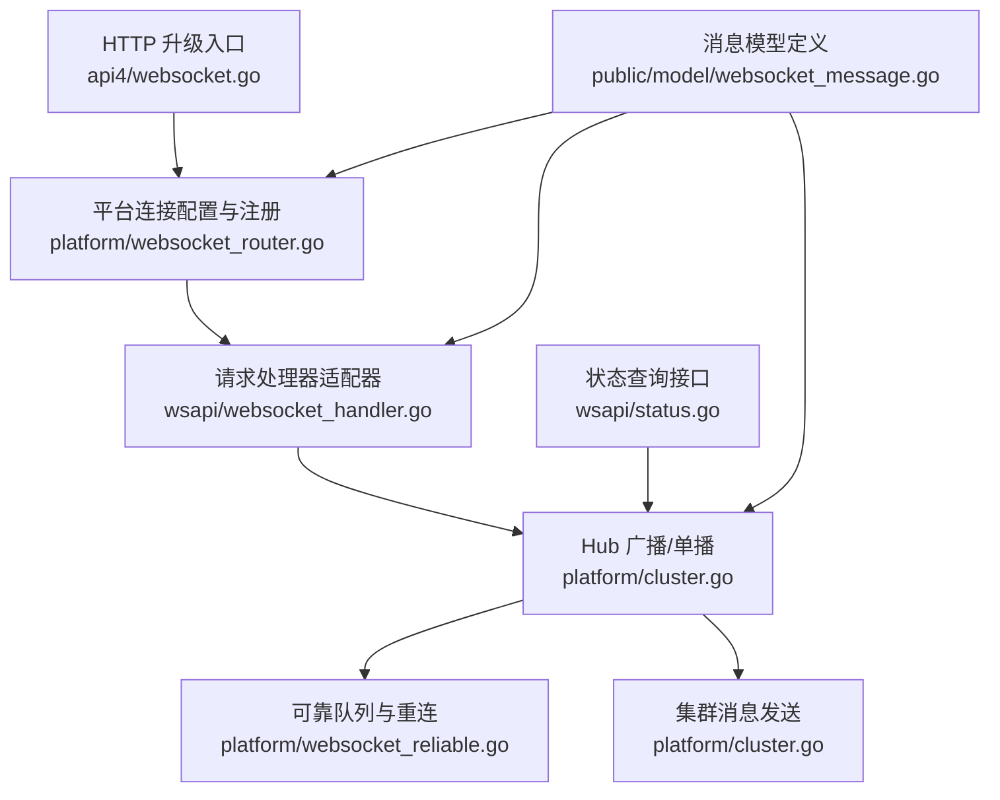
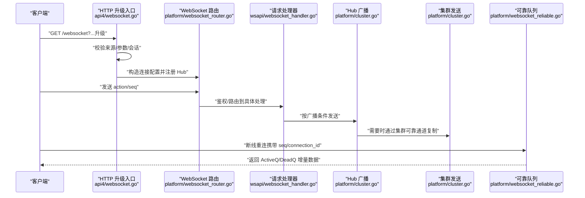
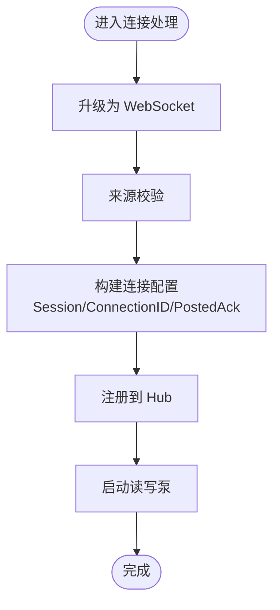
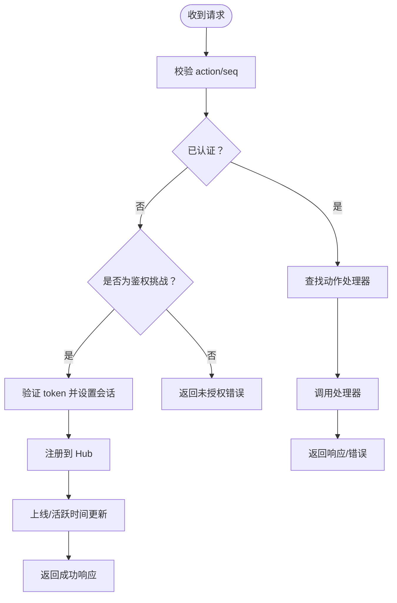
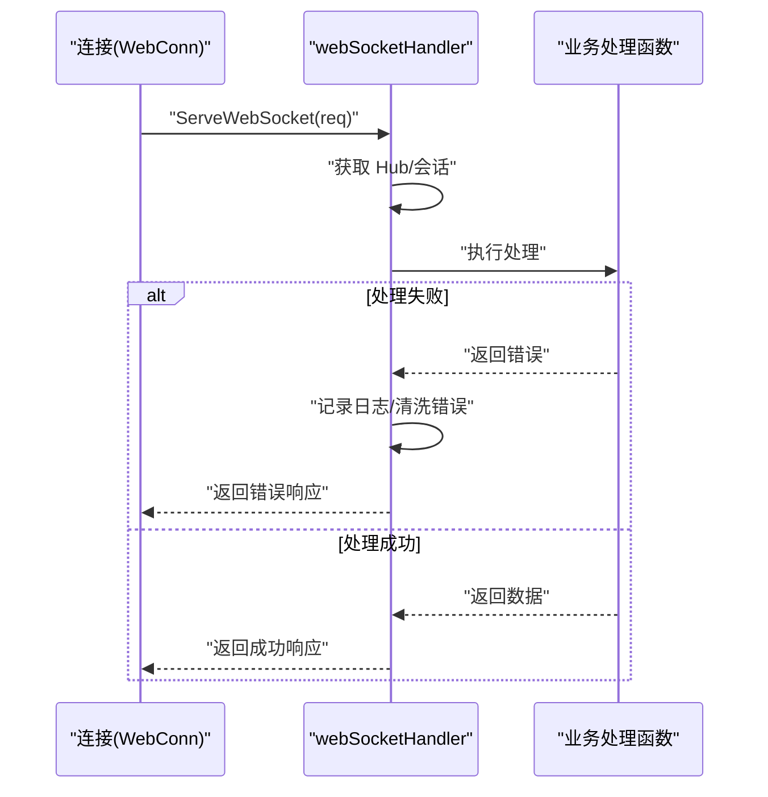
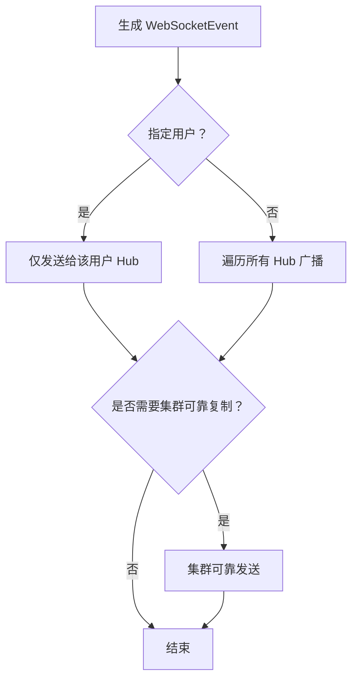
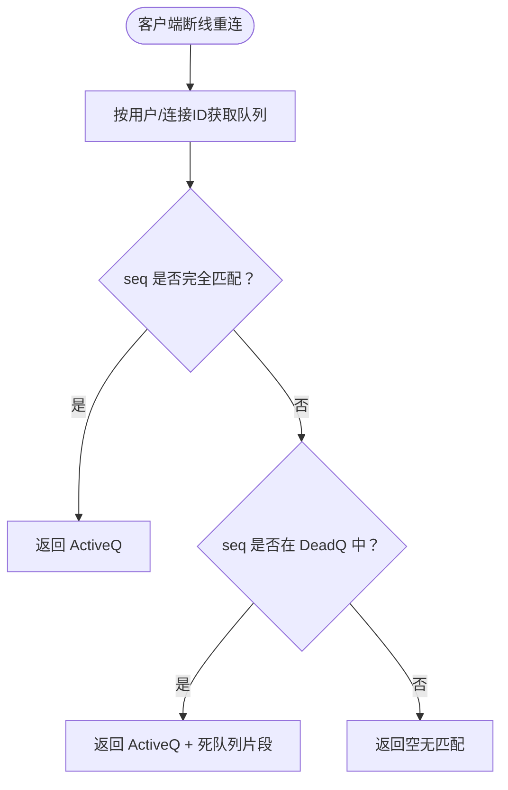
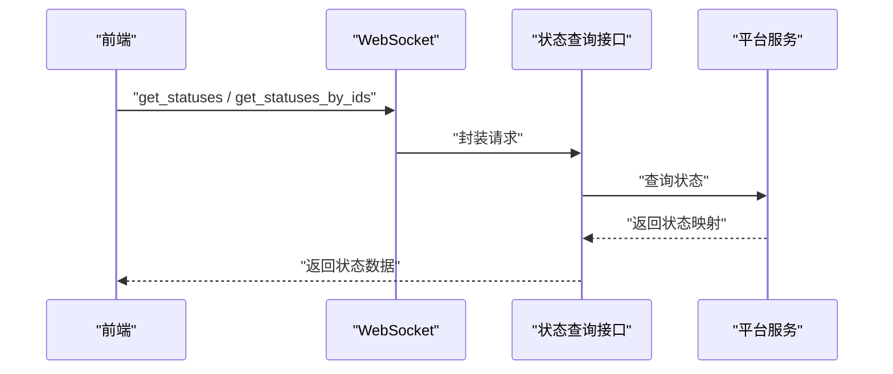
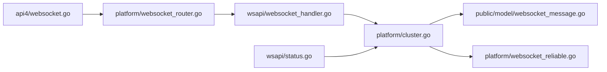

# 实时通信

<cite>
**本文引用的文件**
- [server/channels/api4/websocket.go](file://server/channels/api4/websocket.go)
- [server/channels/wsapi/websocket_handler.go](file://server/channels/wsapi/websocket_handler.go)
- [server/channels/app/platform/websocket_router.go](file://server/channels/app/platform/websocket_router.go)
- [server/channels/app/platform/websocket_reliable.go](file://server/channels/app/platform/websocket_reliable.go)
- [server/channels/app/platform/cluster.go](file://server/channels/app/platform/cluster.go)
- [server/channels/app/cluster.go](file://server/channels/app/cluster.go)
- [server/public/model/websocket_message.go](file://server/public/model/websocket_message.go)
- [server/channels/wsapi/status.go](file://server/channels/wsapi/status.go)
</cite>

## 目录
1. [简介](#简介)
2. [项目结构](#项目结构)
3. [核心组件](#核心组件)
4. [架构总览](#架构总览)
5. [组件详解](#组件详解)
6. [依赖关系分析](#依赖关系分析)
7. [性能考量](#性能考量)
8. [故障排除指南](#故障排除指南)
9. [结论](#结论)
10. [附录：通信协议与示例](#附录通信协议与示例)

## 简介
本文件系统性阐述 Mattermost 的实时通信体系，覆盖 WebSocket 连接建立、心跳与断线重连、消息广播、集群通信、实时状态管理、性能优化与安全防护，并提供可操作的故障排除建议。内容面向不同技术背景读者，既提供高层概览也包含代码级细节与图示。

## 项目结构
围绕实时通信的关键模块主要分布在以下位置：
- HTTP 升级与连接入口：server/channels/api4/websocket.go
- WebSocket 请求路由与处理：server/channels/app/platform/websocket_router.go、server/channels/wsapi/websocket_handler.go
- 可靠消息队列与重连恢复：server/channels/app/platform/websocket_reliable.go
- 广播与集群事件发布：server/channels/app/platform/cluster.go
- 用户状态查询：server/channels/wsapi/status.go
- 通用 WebSocket 消息模型：server/public/model/websocket_message.go

图表来源
- [server/channels/api4/websocket.go:52-125](file://server/channels/api4/websocket.go#L52-L125)
- [server/channels/app/platform/websocket_router.go:26-123](file://server/channels/app/platform/websocket_router.go#L26-L123)
- [server/channels/wsapi/websocket_handler.go:25-76](file://server/channels/wsapi/websocket_handler.go#L25-L76)
- [server/channels/app/platform/cluster.go:85-234](file://server/channels/app/platform/cluster.go#L85-L234)
- [server/channels/app/platform/websocket_reliable.go:14-67](file://server/channels/app/platform/websocket_reliable.go#L14-L67)
- [server/channels/wsapi/status.go:11-34](file://server/channels/wsapi/status.go#L11-L34)
- [server/public/model/websocket_message.go:138-482](file://server/public/model/websocket_message.go#L138-L482)

章节来源
- [server/channels/api4/websocket.go:52-125](file://server/channels/api4/websocket.go#L52-L125)
- [server/channels/app/platform/websocket_router.go:26-123](file://server/channels/app/platform/websocket_router.go#L26-L123)
- [server/channels/wsapi/websocket_handler.go:25-76](file://server/channels/wsapi/websocket_handler.go#L25-L76)
- [server/channels/app/platform/cluster.go:85-234](file://server/channels/app/platform/cluster.go#L85-L234)
- [server/channels/app/platform/websocket_reliable.go:14-67](file://server/channels/app/platform/websocket_reliable.go#L14-L67)
- [server/channels/wsapi/status.go:11-34](file://server/channels/wsapi/status.go#L11-L34)
- [server/public/model/websocket_message.go:138-482](file://server/public/model/websocket_message.go#L138-L482)

## 核心组件
- 连接升级与会话初始化：负责将 HTTP 请求升级为 WebSocket，校验来源与参数，构造连接配置并注册到 Hub。
- 路由与认证：统一处理 action、序列号与认证，支持鉴权挑战、存在性指示等特殊动作。
- 请求处理器：将请求映射到具体业务处理函数，返回响应或错误。
- 广播与集群：根据广播条件向 Hub 内部连接广播，必要时通过集群可靠通道复制消息。
- 可靠队列与重连：在连接复用场景下，按序列号匹配主动队列与死队列，进行增量恢复。
- 状态查询：提供批量状态查询能力，用于前端 UI 同步用户在线/忙碌等状态。

章节来源
- [server/channels/api4/websocket.go:57-125](file://server/channels/api4/websocket.go#L57-L125)
- [server/channels/app/platform/websocket_router.go:26-123](file://server/channels/app/platform/websocket_router.go#L26-L123)
- [server/channels/wsapi/websocket_handler.go:25-76](file://server/channels/wsapi/websocket_handler.go#L25-L76)
- [server/channels/app/platform/cluster.go:85-234](file://server/channels/app/platform/cluster.go#L85-L234)
- [server/channels/app/platform/websocket_reliable.go:14-67](file://server/channels/app/platform/websocket_reliable.go#L14-L67)
- [server/channels/wsapi/status.go:16-34](file://server/channels/wsapi/status.go#L16-L34)

## 架构总览
Mattermost 的实时通信以“连接—路由—处理—广播/集群—可靠队列”为主线，形成端到端的低延迟消息通路。

图表来源
- [server/channels/api4/websocket.go:57-125](file://server/channels/api4/websocket.go#L57-L125)
- [server/channels/app/platform/websocket_router.go:26-123](file://server/channels/app/platform/websocket_router.go#L26-L123)
- [server/channels/wsapi/websocket_handler.go:25-76](file://server/channels/wsapi/websocket_handler.go#L25-L76)
- [server/channels/app/platform/cluster.go:85-234](file://server/channels/app/platform/cluster.go#L85-L234)
- [server/channels/app/platform/websocket_reliable.go:14-67](file://server/channels/app/platform/websocket_reliable.go#L14-L67)

## 组件详解

### WebSocket 连接建立与会话管理
- 升级流程：使用 gorilla/websocket 将 HTTP 连接升级为 WebSocket；设置读写缓冲与来源检查。
- 会话与连接标识：从上下文提取 Session，生成或复用 ConnectionID；解析 sequence_number 与 posted_ack 参数。
- Hub 注册：将连接注册到对应用户的 Hub，以便后续广播与状态同步。
- 断线错误码：支持标准关闭码与自定义应用码，便于客户端识别断开原因。

图表来源
- [server/channels/api4/websocket.go:57-125](file://server/channels/api4/websocket.go#L57-L125)

章节来源
- [server/channels/api4/websocket.go:57-125](file://server/channels/api4/websocket.go#L57-L125)

### 路由与认证（含存在性指示）
- 动作与序列号校验：空 action 或非正序列为非法请求。
- 鉴权挑战：当收到 authentication_challenge 且当前未认证时，从请求中提取 token，验证后设置会话并注册 Hub。
- 存在性指示：接收 presence 指令更新活动团队/频道/线程视图等上下文。
- 未认证访问：对非认证连接拒绝除鉴权外的其他动作。

图表来源
- [server/channels/app/platform/websocket_router.go:26-123](file://server/channels/app/platform/websocket_router.go#L26-L123)

章节来源
- [server/channels/app/platform/websocket_router.go:26-123](file://server/channels/app/platform/websocket_router.go#L26-L123)

### 请求处理器与错误处理
- 处理器适配：将请求封装为 WebSocketRequest，注入会话与本地化信息后交由业务函数处理。
- 错误日志：区分客户端错误与服务端错误，记录详细上下文并返回标准化错误响应。
- 成功响应：构造标准响应对象并回传给 Hub 发送。

图表来源
- [server/channels/wsapi/websocket_handler.go:25-76](file://server/channels/wsapi/websocket_handler.go#L25-L76)

章节来源
- [server/channels/wsapi/websocket_handler.go:25-76](file://server/channels/wsapi/websocket_handler.go#L25-L76)

### 广播与集群通信
- 广播策略：根据广播目标（用户/频道/团队/连接）选择性发送；支持钩子与敏感数据控制。
- 集群复制：对关键事件（如 posted/post_edited/direct/group/team 等）采用可靠复制通道，确保跨节点一致。
- 本地广播：优先在本地 Hub 内部广播，再决定是否跨节点复制。

图表来源
- [server/channels/app/platform/cluster.go:85-234](file://server/channels/app/platform/cluster.go#L85-L234)

章节来源
- [server/channels/app/platform/cluster.go:85-234](file://server/channels/app/platform/cluster.go#L85-L234)

### 可靠队列与断线重连
- 队列结构：Active Queue（活跃队列）与 Dead Queue（死队列），配合指针与大小进行循环存储。
- 匹配逻辑：根据客户端提供的 sequence_number 判断是否完全匹配或部分缺失，决定返回 ActiveQ 或 ActiveQ+DeadQ 的组合。
- 序列一致性：通过预计算 JSON 与类型标记提升序列化效率，减少重复编码成本。

图表来源
- [server/channels/app/platform/websocket_reliable.go:14-67](file://server/channels/app/platform/websocket_reliable.go#L14-L67)

章节来源
- [server/channels/app/platform/websocket_reliable.go:14-67](file://server/channels/app/platform/websocket_reliable.go#L14-L67)

### 实时状态管理与用户状态同步
- 状态查询：提供按用户批量查询状态的能力，便于前端同步在线/忙碌/离开等状态。
- 路由层存在性指示：通过 presence 动作更新活动上下文，辅助状态展示与路由。

图表来源
- [server/channels/wsapi/status.go:16-34](file://server/channels/wsapi/status.go#L16-L34)

章节来源
- [server/channels/wsapi/status.go:16-34](file://server/channels/wsapi/status.go#L16-L34)

### 数据模型与协议要点
- 事件类型：涵盖 typing/posted/post_edited/channel/team/user/preferences/reaction 等丰富事件。
- 广播控制：支持按用户/频道/团队/连接过滤，以及敏感/净化数据可见性控制。
- 预计算 JSON：对事件字段进行预计算，显著降低重复序列化开销。
- 响应模型：统一的响应/错误结构，包含状态、序列号与数据/错误体。

章节来源
- [server/public/model/websocket_message.go:138-482](file://server/public/model/websocket_message.go#L138-L482)

## 依赖关系分析
- 入口层依赖平台层进行连接配置与 Hub 注册。
- 路由层依赖平台层的会话验证与 Hub 获取。
- 处理器层依赖业务应用层执行具体动作。
- 广播层依赖 Hub 与集群接口，实现本地与跨节点传播。
- 可靠队列依赖 Hub 连接状态与序列号匹配逻辑。

图表来源
- [server/channels/api4/websocket.go:52-125](file://server/channels/api4/websocket.go#L52-L125)
- [server/channels/app/platform/websocket_router.go:26-123](file://server/channels/app/platform/websocket_router.go#L26-L123)
- [server/channels/wsapi/websocket_handler.go:25-76](file://server/channels/wsapi/websocket_handler.go#L25-L76)
- [server/channels/app/platform/cluster.go:85-234](file://server/channels/app/platform/cluster.go#L85-L234)
- [server/channels/app/platform/websocket_reliable.go:14-67](file://server/channels/app/platform/websocket_reliable.go#L14-L67)
- [server/channels/wsapi/status.go:16-34](file://server/channels/wsapi/status.go#L16-L34)
- [server/public/model/websocket_message.go:138-482](file://server/public/model/websocket_message.go#L138-L482)

章节来源
- [server/channels/api4/websocket.go:52-125](file://server/channels/api4/websocket.go#L52-L125)
- [server/channels/app/platform/websocket_router.go:26-123](file://server/channels/app/platform/websocket_router.go#L26-L123)
- [server/channels/wsapi/websocket_handler.go:25-76](file://server/channels/wsapi/websocket_handler.go#L25-L76)
- [server/channels/app/platform/cluster.go:85-234](file://server/channels/app/platform/cluster.go#L85-L234)
- [server/channels/app/platform/websocket_reliable.go:14-67](file://server/channels/app/platform/websocket_reliable.go#L14-L67)
- [server/channels/wsapi/status.go:16-34](file://server/channels/wsapi/status.go#L16-L34)
- [server/public/model/websocket_message.go:138-482](file://server/public/model/websocket_message.go#L138-L482)

## 性能考量
- 预计算 JSON：对事件进行预序列化，避免重复编码，降低 CPU 开销。
- 批量与增量：可靠队列按需返回 ActiveQ 或 ActiveQ+DeadQ 片段，减少冗余传输。
- 广播粒度：通过广播钩子与过滤条件精确控制消息范围，避免全站广播。
- 连接池与复用：合理利用 ConnectionID 与序列号，减少重建成本。
- 缓冲区与背压：读写缓冲区大小与消息大小限制需结合部署规模调整，防止内存峰值过高。

## 故障排除指南
- 升级失败
  - 现象：无法从 HTTP 升级为 WebSocket。
  - 排查：检查来源校验、请求头 Origin、缓冲区大小与超时设置。
  - 参考路径：[server/channels/api4/websocket.go:57-71](file://server/channels/api4/websocket.go#L57-L71)
- 认证失败
  - 现象：收到未授权错误或鉴权挑战无效。
  - 排查：确认 token 是否有效、会话是否过期、是否已在路由层完成注册。
  - 参考路径：[server/channels/app/platform/websocket_router.go:39-80](file://server/channels/app/platform/websocket_router.go#L39-L80)
- 请求处理错误
  - 现象：处理器返回错误响应。
  - 排查：查看日志中的 action/seq/user_id，定位具体业务错误并清洗详细信息。
  - 参考路径：[server/channels/wsapi/websocket_handler.go:59-71](file://server/channels/wsapi/websocket_handler.go#L59-L71)
- 广播不生效
  - 现象：消息未到达目标用户/频道/团队。
  - 排查：核对广播目标字段、过滤条件与 Hub 是否存在；检查集群复制开关。
  - 参考路径：[server/channels/app/platform/cluster.go:220-234](file://server/channels/app/platform/cluster.go#L220-L234)
- 断线重连丢失
  - 现象：重连后消息缺失。
  - 排查：确认客户端上报的 sequence_number 与 ConnectionID；检查可靠队列匹配逻辑。
  - 参考路径：[server/channels/app/platform/websocket_reliable.go:14-67](file://server/channels/app/platform/websocket_reliable.go#L14-L67)
- 状态不同步
  - 现象：前端显示的在线状态异常。
  - 排查：调用状态查询接口确认后端状态；检查 presence 指令是否正确下发。
  - 参考路径：[server/channels/wsapi/status.go:16-34](file://server/channels/wsapi/status.go#L16-L34)

## 结论
Mattermost 的实时通信体系以清晰的分层设计实现了高可用、可扩展的消息通路。通过严格的路由与认证、高效的广播与集群复制、可靠的断线重连与状态同步，满足大规模团队协作的实时性需求。结合本文的性能优化与故障排除建议，可在生产环境中获得更稳定与高效的体验。

## 附录：通信协议与示例
- 连接建立
  - 方法：GET /websocket
  - 查询参数：connection_id、sequence_number、posted_ack、disconnect_err_code
  - 来源校验：CheckOrigin 返回允许的来源列表
  - 参考路径：[server/channels/api4/websocket.go:57-125](file://server/channels/api4/websocket.go#L57-L125)
- 鉴权挑战
  - 动作：authentication_challenge
  - 数据：token
  - 行为：验证后设置会话并注册 Hub
  - 参考路径：[server/channels/app/platform/websocket_router.go:39-80](file://server/channels/app/platform/websocket_router.go#L39-L80)
- 存在性指示
  - 动作：presence
  - 数据：team_id、channel_id、thread_channel_id、is_thread_view
  - 行为：更新活动上下文
  - 参考路径：[server/channels/app/platform/websocket_router.go:82-107](file://server/channels/app/platform/websocket_router.go#L82-L107)
- 广播事件
  - 类型：WebSocketEvent
  - 字段：event、data、broadcast、seq
  - 广播控制：userId、channelId、teamId、omit_users、omit_connection_id
  - 参考路径：[server/public/model/websocket_message.go:235-359](file://server/public/model/websocket_message.go#L235-L359)
- 可靠队列
  - 返回：ActiveQ、DeadQ、reuse_count
  - 匹配：基于 sequence_number 的完全匹配或部分匹配
  - 参考路径：[server/channels/app/platform/websocket_reliable.go:14-67](file://server/channels/app/platform/websocket_reliable.go#L14-L67)
- 状态查询
  - 动作：get_statuses、get_statuses_by_ids
  - 输入：user_ids（可选）
  - 输出：状态映射
  - 参考路径：[server/channels/wsapi/status.go:16-34](file://server/channels/wsapi/status.go#L16-L34)