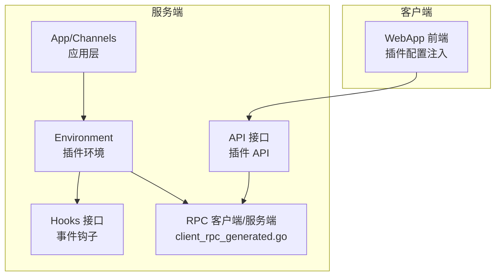
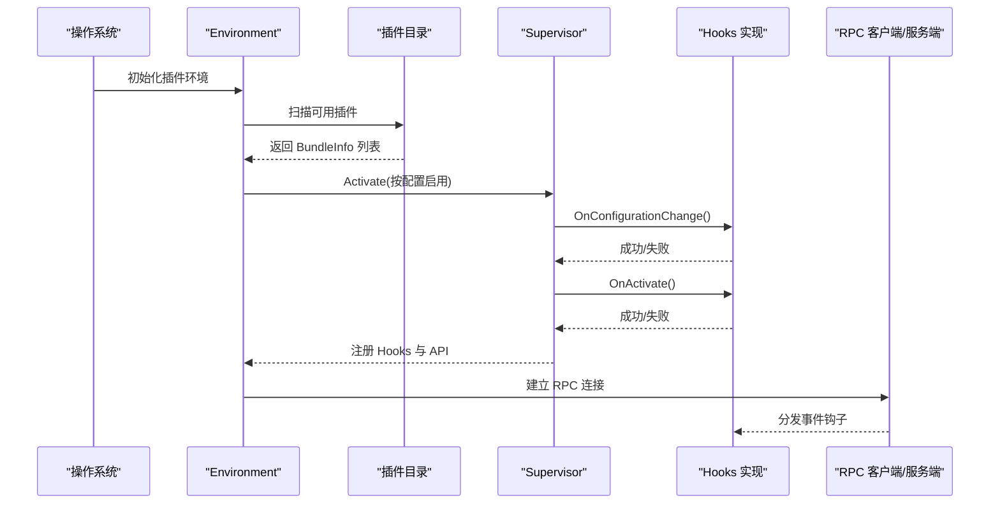
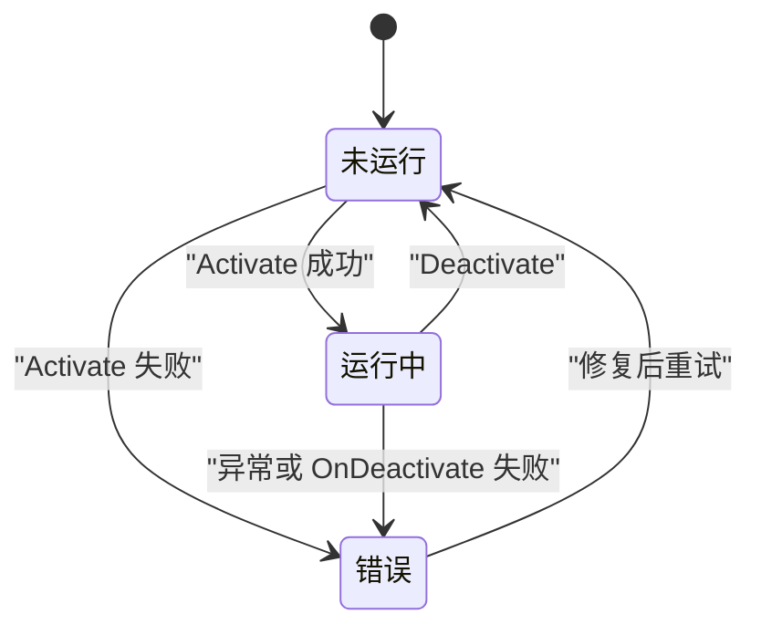
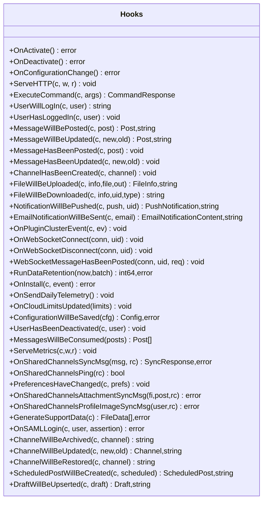
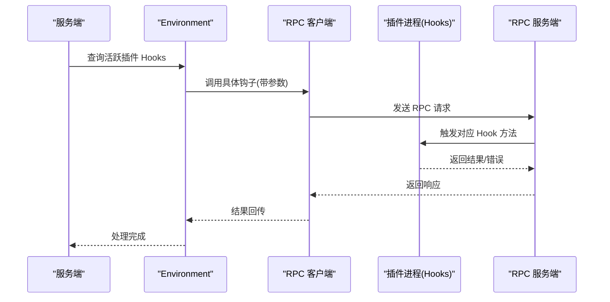
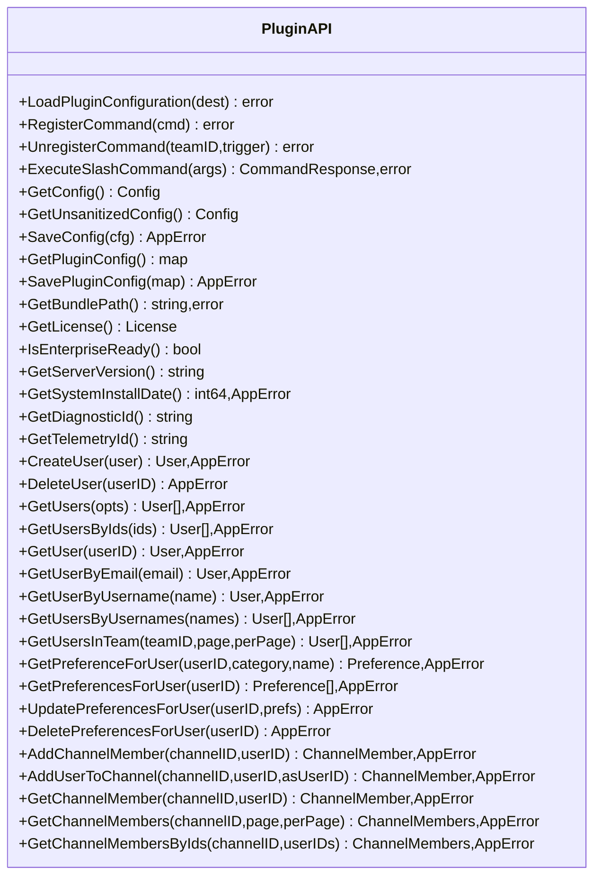
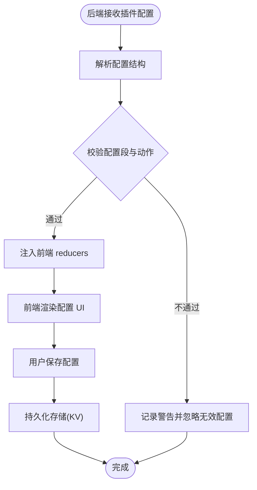
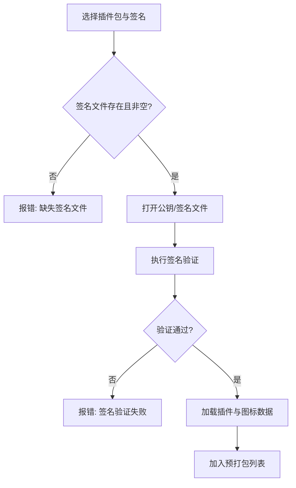
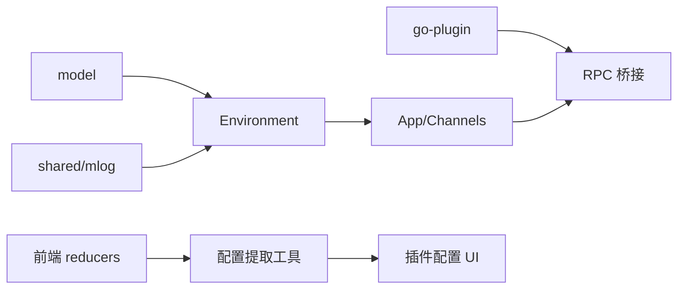

# 插件系统

<cite>
**本文引用的文件**   
- [hooks.go](file://server/public/plugin/hooks.go)
- [api.go](file://server/public/plugin/api.go)
- [environment.go](file://server/public/plugin/environment.go)
- [plugin.go](file://server/channels/app/plugin.go)
- [plugin_api.go](file://server/channels/app/plugin_api.go)
- [client_rpc_generated.go](file://server/public/plugin/client_rpc_generated.go)
- [plugin_setting_extraction.tsx](file://webapp/channels/src/utils/plugins/plugin_setting_extraction.tsx)
- [index.ts](file://webapp/channels/src/reducers/plugins/index.ts)
- [plugin_signature_test.go](file://server/channels/app/plugin_signature_test.go)
- [plugin_prepackaged_test.go](file://server/channels/app/plugin_prepackaged_test.go)
</cite>

## 目录
1. [简介](#简介)
2. [项目结构](#项目结构)
3. [核心组件](#核心组件)
4. [架构总览](#架构总览)
5. [组件详解](#组件详解)
6. [依赖关系分析](#依赖关系分析)
7. [性能与可扩展性](#性能与可扩展性)
8. [故障排查指南](#故障排查指南)
9. [结论](#结论)
10. [附录：开发示例与调试](#附录开发示例与调试)

## 简介
本指南面向 Mattermost 插件开发者，系统阐述插件架构、生命周期、钩子机制、API 使用、配置管理、打包与签名验证、版本与自动更新策略，以及最佳实践与调试方法。内容基于仓库中的插件运行时、环境管理、RPC 钩子桥接、前端配置注入与测试样例进行归纳总结。

## 项目结构
Mattermost 插件系统由服务端运行时（Go）、客户端桥接（RPC）与 Web 应用层配置注入三部分组成：
- 服务端插件运行时与环境管理：负责插件扫描、激活/停用、状态维护与钩子分发。
- 客户端 RPC 桥接：将服务端钩子调用映射到客户端插件接口。
- Web 应用配置注入：在前端解析并注册插件配置段与动作。

图表来源
- [environment.go:48-82](file://server/public/plugin/environment.go#L48-L82)
- [hooks.go:83-510](file://server/public/plugin/hooks.go#L83-L510)
- [api.go:16-200](file://server/public/plugin/api.go#L16-L200)
- [client_rpc_generated.go:45-689](file://server/public/plugin/client_rpc_generated.go#L45-L689)
- [plugin_setting_extraction.tsx:40-87](file://webapp/channels/src/utils/plugins/plugin_setting_extraction.tsx#L40-L87)

章节来源
- [environment.go:48-200](file://server/public/plugin/environment.go#L48-L200)
- [hooks.go:83-510](file://server/public/plugin/hooks.go#L83-L510)
- [api.go:16-200](file://server/public/plugin/api.go#L16-L200)
- [client_rpc_generated.go:45-689](file://server/public/plugin/client_rpc_generated.go#L45-L689)
- [plugin_setting_extraction.tsx:40-87](file://webapp/channels/src/utils/plugins/plugin_setting_extraction.tsx#L40-L87)

## 核心组件
- 插件环境 Environment：负责扫描可用插件、维护激活状态、触发钩子、暴露 API 访问点。
- 钩子接口 Hooks：定义插件可实现的事件回调集合，涵盖用户、频道、消息、文件、通知等全链路事件。
- 插件 API：为插件提供访问服务器资源与执行操作的能力，如用户、团队、频道、配置、KV 存储等。
- RPC 桥接：通过生成式客户端/服务端桩代码，将服务端钩子调用与插件进程通信对接。
- Web 应用配置注入：前端从后端接收插件配置，校验并注册为 UI 可编辑项。

章节来源
- [environment.go:48-200](file://server/public/plugin/environment.go#L48-L200)
- [hooks.go:83-510](file://server/public/plugin/hooks.go#L83-L510)
- [api.go:16-200](file://server/public/plugin/api.go#L16-L200)
- [client_rpc_generated.go:45-689](file://server/public/plugin/client_rpc_generated.go#L45-L689)
- [plugin_setting_extraction.tsx:40-87](file://webapp/channels/src/utils/plugins/plugin_setting_extraction.tsx#L40-L87)

## 架构总览
下图展示插件从“被发现”到“激活运行”，再到“事件驱动”的完整流程。

图表来源
- [environment.go:109-164](file://server/public/plugin/environment.go#L109-L164)
- [plugin.go:75-164](file://server/channels/app/plugin.go#L75-L164)
- [client_rpc_generated.go:45-689](file://server/public/plugin/client_rpc_generated.go#L45-L689)

章节来源
- [environment.go:109-164](file://server/public/plugin/environment.go#L109-L164)
- [plugin.go:75-164](file://server/channels/app/plugin.go#L75-L164)

## 组件详解

### 生命周期与状态机
- 状态枚举：未运行、运行中、错误等；Environment 提供查询与设置。
- 同步逻辑：根据配置决定启用/停用插件，并并发处理批量变更。
- 事件通知：启用/停用时向集群广播状态变更。

图表来源
- [environment.go:182-199](file://server/public/plugin/environment.go#L182-L199)
- [plugin.go:75-164](file://server/channels/app/plugin.go#L75-L164)

章节来源
- [environment.go:182-199](file://server/public/plugin/environment.go#L182-L199)
- [plugin.go:75-164](file://server/channels/app/plugin.go#L75-L164)

### 钩子机制与事件流
- 钩子接口：覆盖用户登录/创建、消息发布/更新/删除、频道/团队成员变更、文件上传/下载、通知推送、共享频道同步、SAML 登录、偏好变更、数据保留、支持包生成等。
- 事件钩子：在关键业务路径前/后触发，允许拒绝、修改或仅观察。
- 生命周期钩子：OnConfigurationChange、OnActivate、OnDeactivate。
- 自定义钩子：ServeHTTP、ExecuteCommand、ServeMetrics 等。

图表来源
- [hooks.go:83-510](file://server/public/plugin/hooks.go#L83-L510)

章节来源
- [hooks.go:83-510](file://server/public/plugin/hooks.go#L83-L510)

### RPC 钩子桥接与调用序列
- 生成式桩代码：为每个钩子生成客户端/服务端调用桩，确保类型安全与错误传播。
- 调用流程：服务端通过 Environment 获取 Hooks，经 RPC 将事件投递至插件进程；插件返回结果或错误。

图表来源
- [client_rpc_generated.go:45-689](file://server/public/plugin/client_rpc_generated.go#L45-L689)
- [environment.go:585-610](file://server/public/plugin/environment.go#L585-L610)

章节来源
- [client_rpc_generated.go:45-689](file://server/public/plugin/client_rpc_generated.go#L45-L689)
- [environment.go:585-610](file://server/public/plugin/environment.go#L585-L610)

### 插件 API 使用（用户/频道/消息/系统）
- 用户相关：创建、删除、查询、批量查询、偏好获取与更新。
- 频道相关：添加成员、获取成员、分页查询成员、按 ID 批量查询成员。
- 消息相关：执行命令、获取服务器版本、诊断 ID、遥测 ID 等。
- 系统相关：加载/保存插件配置、获取许可证、企业就绪状态、安装时间、Bundle 路径等。

图表来源
- [api.go:16-200](file://server/public/plugin/api.go#L16-L200)
- [plugin_api.go:617-658](file://server/channels/app/plugin_api.go#L617-L658)

章节来源
- [api.go:16-200](file://server/public/plugin/api.go#L16-L200)
- [plugin_api.go:617-658](file://server/channels/app/plugin_api.go#L617-L658)

### 配置管理与前端注入
- 配置项定义：插件可在清单中声明配置段与动作，后端将其注入前端。
- 动态配置：前端解析并校验配置，注册为可编辑 UI。
- 持久化存储：插件键值对通过 KV 存储读写，支持列表与哈希兼容。

图表来源
- [plugin_setting_extraction.tsx:40-87](file://webapp/channels/src/utils/plugins/plugin_setting_extraction.tsx#L40-L87)
- [index.ts:444-484](file://webapp/channels/src/reducers/plugins/index.ts#L444-L484)

章节来源
- [plugin_setting_extraction.tsx:40-87](file://webapp/channels/src/utils/plugins/plugin_setting_extraction.tsx#L40-L87)
- [index.ts:444-484](file://webapp/channels/src/reducers/plugins/index.ts#L444-L484)

### 打包、签名与预打包插件
- 签名验证：对插件包与签名文件进行校验，支持裸签名与 ASCII-armored 公钥。
- 预打包插件：随服务端分发的插件，需具备签名文件并在构建时加载图标数据。
- 测试覆盖：包含缺失签名、签名文件不存在、空签名、签名不匹配等场景。

图表来源
- [plugin_signature_test.go:67-94](file://server/channels/app/plugin_signature_test.go#L67-L94)
- [plugin_prepackaged_test.go:41-171](file://server/channels/app/plugin_prepackaged_test.go#L41-L171)

章节来源
- [plugin_signature_test.go:67-94](file://server/channels/app/plugin_signature_test.go#L67-L94)
- [plugin_prepackaged_test.go:41-171](file://server/channels/app/plugin_prepackaged_test.go#L41-L171)

## 依赖关系分析
- 插件运行时依赖：
  - go-plugin：用于插件进程与宿主的 RPC 通信。
  - model：统一的数据模型与清单结构。
  - shared/mlog：日志基础设施。
- 应用层依赖：
  - Channels/App：协调插件环境、配置变更与钩子分发。
  - 并发控制：使用 WaitGroup 并发激活/停用多个插件。
- 前端依赖：
  - Redux reducers：接收并缓存插件配置。
  - 工具函数：提取与校验插件配置段与动作。

图表来源
- [environment.go:6-21](file://server/public/plugin/environment.go#L6-L21)
- [plugin.go:6-29](file://server/channels/app/plugin.go#L6-L29)
- [client_rpc_generated.go:6-14](file://server/public/plugin/client_rpc_generated.go#L6-L14)
- [index.ts:444-484](file://webapp/channels/src/reducers/plugins/index.ts#L444-L484)
- [plugin_setting_extraction.tsx:40-87](file://webapp/channels/src/utils/plugins/plugin_setting_extraction.tsx#L40-L87)

章节来源
- [environment.go:6-21](file://server/public/plugin/environment.go#L6-L21)
- [plugin.go:6-29](file://server/channels/app/plugin.go#L6-L29)
- [client_rpc_generated.go:6-14](file://server/public/plugin/client_rpc_generated.go#L6-L14)
- [index.ts:444-484](file://webapp/channels/src/reducers/plugins/index.ts#L444-L484)
- [plugin_setting_extraction.tsx:40-87](file://webapp/channels/src/utils/plugins/plugin_setting_extraction.tsx#L40-L87)

## 性能与可扩展性
- 并发激活：批量启用/停用插件时使用并发 goroutine 与 WaitGroup，提升吞吐。
- RPC 错误隔离：RPC 调用失败时记录日志并返回占位值，避免部分解码泄漏。
- 钩子幂等：建议在钩子中保持无副作用或具备幂等保护，避免重复触发导致的状态不一致。
- 资源限制：对长耗时钩子（如外部 API 调用）设置超时与限流，防止阻塞事件循环。
- 前端配置：仅在必要时重新注入配置，减少不必要的 UI 重渲染。

章节来源
- [plugin.go:115-156](file://server/channels/app/plugin.go#L115-L156)
- [client_rpc_generated.go:45-689](file://server/public/plugin/client_rpc_generated.go#L45-L689)

## 故障排查指南
- 插件未激活
  - 检查配置开关与插件状态；查看 Environment 状态与错误信息。
  - 关注 OnConfigurationChange 与 OnActivate 是否返回错误。
- RPC 调用失败
  - 查看 RPC 日志输出；确认插件进程存活与连接建立。
  - 注意错误传播与返回值占位，避免误判。
- 配置注入失败
  - 校验配置段与动作字段是否符合规范；检查前端警告日志。
- 签名验证失败
  - 确认签名文件存在且与插件包匹配；公钥是否正确导入。
  - 参考测试用例定位问题场景（缺失、空文件、不匹配）。

章节来源
- [environment.go:162-199](file://server/public/plugin/environment.go#L162-L199)
- [client_rpc_generated.go:45-689](file://server/public/plugin/client_rpc_generated.go#L45-L689)
- [plugin_setting_extraction.tsx:40-87](file://webapp/channels/src/utils/plugins/plugin_setting_extraction.tsx#L40-L87)
- [plugin_signature_test.go:67-94](file://server/channels/app/plugin_signature_test.go#L67-L94)
- [plugin_prepackaged_test.go:41-171](file://server/channels/app/plugin_prepackaged_test.go#L41-L171)

## 结论
Mattermost 插件系统以清晰的生命周期与强大的钩子体系为核心，结合 RPC 通信与前端配置注入，形成从服务端到客户端的完整扩展能力。遵循本文的最佳实践与排障指引，可显著提升插件的稳定性、性能与可维护性。

## 附录：开发示例与调试
- 开发步骤建议
  - 在清单中声明所需钩子与配置段；实现最小化 OnConfigurationChange 与 OnActivate。
  - 使用插件 API 完成用户/频道/消息等核心操作；注意错误返回与 AppError 包装。
  - 对长耗时操作使用超时与限流；避免在钩子中做阻塞 IO。
  - 通过前端配置注入完善管理界面，确保字段校验与默认值。
- 调试技巧
  - 启用详细日志，关注 RPC 调用与钩子返回值。
  - 使用测试用例覆盖签名验证、预打包插件与配置注入等关键路径。
  - 在本地环境模拟并发激活/停用，观察状态切换与错误恢复。

章节来源
- [plugin.go:75-164](file://server/channels/app/plugin.go#L75-L164)
- [plugin_api.go:617-658](file://server/channels/app/plugin_api.go#L617-L658)
- [plugin_signature_test.go:67-94](file://server/channels/app/plugin_signature_test.go#L67-L94)
- [plugin_prepackaged_test.go:41-171](file://server/channels/app/plugin_prepackaged_test.go#L41-L171)
- [plugin_setting_extraction.tsx:40-87](file://webapp/channels/src/utils/plugins/plugin_setting_extraction.tsx#L40-L87)