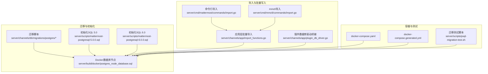
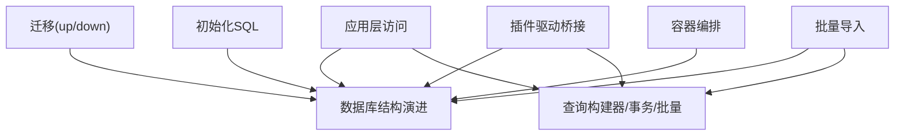
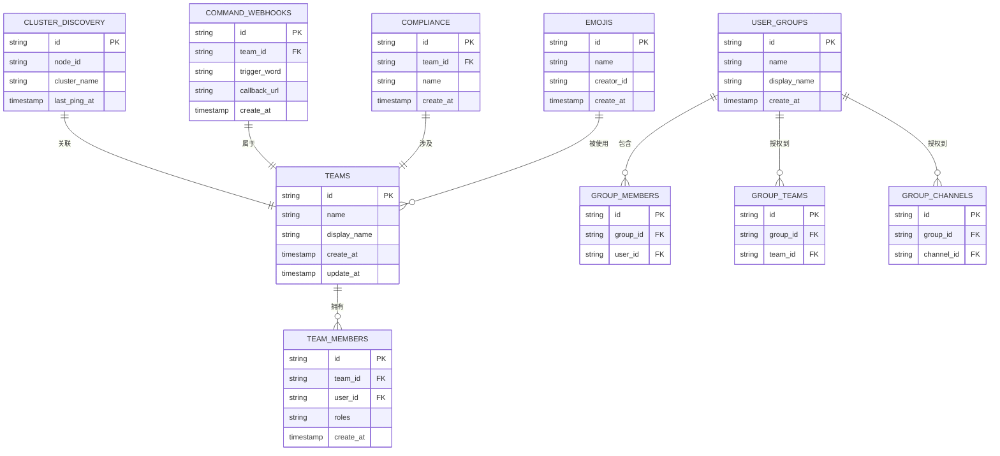
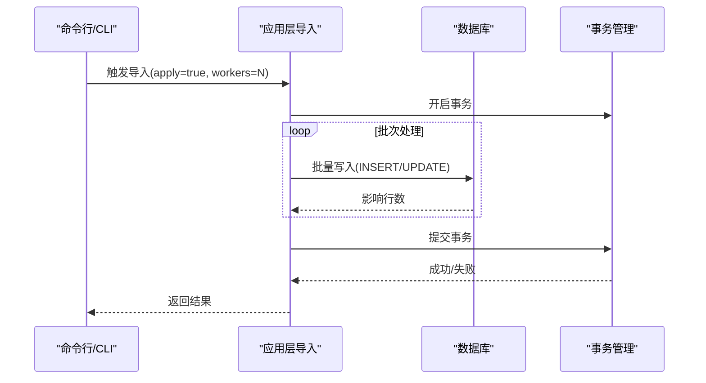
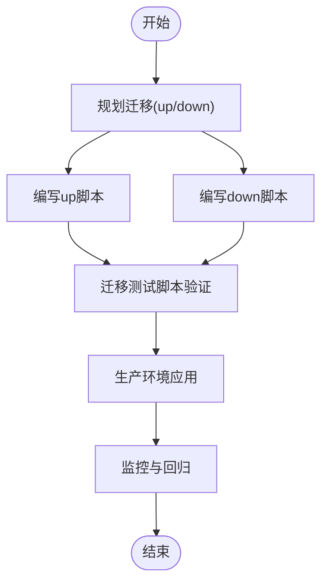
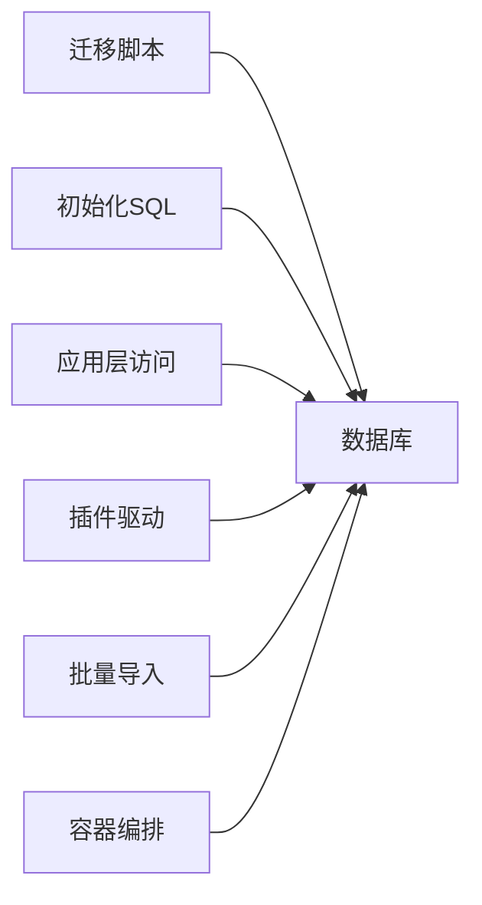

# 数据库设计

<cite>
**本文引用的文件**
- [postgres_node_database.sql](file://server/build/docker/postgres_node_database.sql)
- [000001_create_teams.up.sql](file://server/channels/db/migrations/postgres/000001_create_teams.up.sql)
- [000001_create_teams.down.sql](file://server/channels/db/migrations/postgres/000001_create_teams.down.sql)
- [000002_create_team_members.up.sql](file://server/channels/db/migrations/postgres/000002_create_team_members.up.sql)
- [000002_create_team_members.down.sql](file://server/channels/db/migrations/postgres/000002_create_team_members.down.sql)
- [000003_create_cluster_discovery.up.sql](file://server/channels/db/migrations/postgres/000003_create_cluster_discovery.up.sql)
- [000003_create_cluster_discovery.down.sql](file://server/channels/db/migrations/postgres/000003_create_cluster_discovery.down.sql)
- [000004_create_command_webhooks.up.sql](file://server/channels/db/migrations/postgres/000004_create_command_webhooks.up.sql)
- [000004_create_command_webhooks.down.sql](file://server/channels/db/migrations/postgres/000004_create_command_webhooks.down.sql)
- [000005_create_compliances.up.sql](file://server/channels/db/migrations/postgres/000005_create_compliances.up.sql)
- [000005_create_compliances.down.sql](file://server/channels/db/migrations/postgres/000005_create_compliances.down.sql)
- [000006_create_emojis.up.sql](file://server/channels/db/migrations/postgres/000006_create_emojis.up.sql)
- [000006_create_emojis.down.sql](file://server/channels/db/migrations/postgres/000006_create_emojis.down.sql)
- [000007_create_user_groups.up.sql](file://server/channels/db/migrations/postgres/000007_create_user_groups.up.sql)
- [000007_create_user_groups.down.sql](file://server/channels/db/migrations/postgres/000007_create_user_groups.down.sql)
- [000008_create_group_members.up.sql](file://server/channels/db/migrations/postgres/000008_create_group_members.up.sql)
- [000008_create_group_members.down.sql](file://server/channels/db/migrations/postgres/000008_create_group_members.down.sql)
- [000009_create_group_teams.up.sql](file://server/channels/db/migrations/postgres/000009_create_group_teams.up.sql)
- [000009_create_group_teams.down.sql](file://server/channels/db/migrations/postgres/000009_create_group_teams.down.sql)
- [000010_create_group_channels.up.sql](file://server/channels/db/migrations/postgres/000010_create_group_channels.up.sql)
- [000010_create_group_channels.down.sql](file://server/channels/db/migrations/postgres/000010_create_group_channels.down.sql)
- [plugin_db_driver.go](file://server/channels/app/plugin_db_driver.go)
- [import.go](file://server/cmd/mattermost/commands/import.go)
- [import.go](file://server/cmd/mmctl/commands/import.go)
- [import_functions.go](file://server/channels/app/import_functions.go)
- [import_test.go](file://server/channels/app/import_test.go)
- [hashers.go](file://server/channels/app/password/hashers/hashers.go)
- [mattermost-postgresql-5.0.0.sql](file://server/scripts/mattermost-postgresql-5.0.0.sql)
- [mattermost-postgresql-6.0.0.sql](file://server/scripts/mattermost-postgresql-6.0.0.sql)
- [psql-migration-test.sh](file://server/scripts/psql-migration-test.sh)
- [docker-compose.yaml](file://server/docker-compose.yaml)
- [docker-compose.generated.yml](file://server/docker-compose.generated.yml)
</cite>

## 目录
1. [简介](#简介)
2. [项目结构](#项目结构)
3. [核心组件](#核心组件)
4. [架构总览](#架构总览)
5. [详细组件分析](#详细组件分析)
6. [依赖分析](#依赖分析)
7. [性能考虑](#性能考虑)
8. [故障排查指南](#故障排查指南)
9. [结论](#结论)
10. [附录](#附录)

## 简介
本文件系统性梳理 Mattermost 的数据库设计与实现，覆盖数据模型、实体关系、ORM 使用模式（查询构建器、事务管理、批量导入）、数据访问层架构（存储接口、层抽象、缓存策略）、数据库迁移管理（迁移脚本、版本控制、回滚策略）、查询优化（索引设计、执行计划分析、性能调优）、数据一致性保障（ACID 事务、并发控制、死锁预防），并提供数据库模式图与查询示例路径，帮助开发者与运维人员高效理解与维护数据库层。

## 项目结构
Mattermost 的数据库相关实现主要分布在以下位置：
- 迁移脚本：server/channels/db/migrations/postgres/
- 初始化与升级 SQL：server/scripts/mattermost-postgresql-*.sql
- Docker 集成：server/build/docker/postgres_node_database.sql
- 导入工具与批量写入：server/cmd/mattermost/commands/import.go、server/cmd/mmctl/commands/import.go、server/channels/app/import_functions.go
- 插件数据库驱动桥接：server/channels/app/plugin_db_driver.go
- 运维测试脚本：server/scripts/psql-migration-test.sh
- 容器编排：server/docker-compose.yaml、server/docker-compose.generated.yml

**图表来源**
- [000001_create_teams.up.sql](file://server/channels/db/migrations/postgres/000001_create_teams.up.sql)
- [000002_create_team_members.up.sql](file://server/channels/db/migrations/postgres/000002_create_team_members.up.sql)
- [000003_create_cluster_discovery.up.sql](file://server/channels/db/migrations/postgres/000003_create_cluster_discovery.up.sql)
- [000004_create_command_webhooks.up.sql](file://server/channels/db/migrations/postgres/000004_create_command_webhooks.up.sql)
- [000005_create_compliances.up.sql](file://server/channels/db/migrations/postgres/000005_create_compliances.up.sql)
- [000006_create_emojis.up.sql](file://server/channels/db/migrations/postgres/000006_create_emojis.up.sql)
- [000007_create_user_groups.up.sql](file://server/channels/db/migrations/postgres/000007_create_user_groups.up.sql)
- [000008_create_group_members.up.sql](file://server/channels/db/migrations/postgres/000008_create_group_members.up.sql)
- [000009_create_group_teams.up.sql](file://server/channels/db/migrations/postgres/000009_create_group_teams.up.sql)
- [000010_create_group_channels.up.sql](file://server/channels/db/migrations/postgres/000010_create_group_channels.up.sql)
- [mattermost-postgresql-5.0.0.sql](file://server/scripts/mattermost-postgresql-5.0.0.sql)
- [mattermost-postgresql-6.0.0.sql](file://server/scripts/mattermost-postgresql-6.0.0.sql)
- [postgres_node_database.sql](file://server/build/docker/postgres_node_database.sql)
- [import.go](file://server/cmd/mattermost/commands/import.go)
- [import.go](file://server/cmd/mmctl/commands/import.go)
- [import_functions.go](file://server/channels/app/import_functions.go)
- [plugin_db_driver.go](file://server/channels/app/plugin_db_driver.go)
- [docker-compose.yaml](file://server/docker-compose.yaml)
- [docker-compose.generated.yml](file://server/docker-compose.generated.yml)
- [psql-migration-test.sh](file://server/scripts/psql-migration-test.sh)

**章节来源**
- [docker-compose.yaml](file://server/docker-compose.yaml)
- [docker-compose.generated.yml](file://server/docker-compose.generated.yml)

## 核心组件
- 迁移系统：按顺序编号的 up/down 脚本，确保数据库结构演进可追踪、可回滚。
- 初始化 SQL：提供基础表结构与初始数据，支持新环境快速就绪。
- 批量导入：通过命令行工具与应用层函数进行大规模数据写入，兼顾安全校验与性能。
- 插件数据库驱动：为插件提供统一的连接、事务、语句生命周期管理。
- 容器化运行：通过 compose 文件定义数据库服务，便于本地开发与集成测试。

**章节来源**
- [000001_create_teams.up.sql](file://server/channels/db/migrations/postgres/000001_create_teams.up.sql)
- [000002_create_team_members.up.sql](file://server/channels/db/migrations/postgres/000002_create_team_members.up.sql)
- [000003_create_cluster_discovery.up.sql](file://server/channels/db/migrations/postgres/000003_create_cluster_discovery.up.sql)
- [000004_create_command_webhooks.up.sql](file://server/channels/db/migrations/postgres/000004_create_command_webhooks.up.sql)
- [000005_create_compliances.up.sql](file://server/channels/db/migrations/postgres/000005_create_compliances.up.sql)
- [000006_create_emojis.up.sql](file://server/channels/db/migrations/postgres/000006_create_emojis.up.sql)
- [000007_create_user_groups.up.sql](file://server/channels/db/migrations/postgres/000007_create_user_groups.up.sql)
- [000008_create_group_members.up.sql](file://server/channels/db/migrations/postgres/000008_create_group_members.up.sql)
- [000009_create_group_teams.up.sql](file://server/channels/db/migrations/postgres/000009_create_group_teams.up.sql)
- [000010_create_group_channels.up.sql](file://server/channels/db/migrations/postgres/000010_create_group_channels.up.sql)
- [mattermost-postgresql-5.0.0.sql](file://server/scripts/mattermost-postgresql-5.0.0.sql)
- [mattermost-postgresql-6.0.0.sql](file://server/scripts/mattermost-postgresql-6.0.0.sql)
- [plugin_db_driver.go](file://server/channels/app/plugin_db_driver.go)
- [import.go](file://server/cmd/mattermost/commands/import.go)
- [import.go](file://server/cmd/mmctl/commands/import.go)
- [import_functions.go](file://server/channels/app/import_functions.go)

## 架构总览
数据库层围绕“迁移—初始化—运行时访问—批量导入—容器化”五条主线协同工作。迁移与初始化负责结构演进与初始准备；运行时访问通过插件驱动与应用层封装提供一致的数据库交互；批量导入在安全与性能之间取得平衡；容器化确保开发与测试环境的一致性。

**图表来源**
- [000001_create_teams.up.sql](file://server/channels/db/migrations/postgres/000001_create_teams.up.sql)
- [000002_create_team_members.up.sql](file://server/channels/db/migrations/postgres/000002_create_team_members.up.sql)
- [000003_create_cluster_discovery.up.sql](file://server/channels/db/migrations/postgres/000003_create_cluster_discovery.up.sql)
- [000004_create_command_webhooks.up.sql](file://server/channels/db/migrations/postgres/000004_create_command_webhooks.up.sql)
- [000005_create_compliances.up.sql](file://server/channels/db/migrations/postgres/000005_create_compliances.up.sql)
- [000006_create_emojis.up.sql](file://server/channels/db/migrations/postgres/000006_create_emojis.up.sql)
- [000007_create_user_groups.up.sql](file://server/channels/db/migrations/postgres/000007_create_user_groups.up.sql)
- [000008_create_group_members.up.sql](file://server/channels/db/migrations/postgres/000008_create_group_members.up.sql)
- [000009_create_group_teams.up.sql](file://server/channels/db/migrations/postgres/000009_create_group_teams.up.sql)
- [000010_create_group_channels.up.sql](file://server/channels/db/migrations/postgres/000010_create_group_channels.up.sql)
- [mattermost-postgresql-5.0.0.sql](file://server/scripts/mattermost-postgresql-5.0.0.sql)
- [mattermost-postgresql-6.0.0.sql](file://server/scripts/mattermost-postgresql-6.0.0.sql)
- [plugin_db_driver.go](file://server/channels/app/plugin_db_driver.go)
- [import_functions.go](file://server/channels/app/import_functions.go)
- [docker-compose.yaml](file://server/docker-compose.yaml)

## 详细组件分析

### 数据模型与实体关系
基于迁移脚本与初始化 SQL，可归纳出核心实体及关系：
- 团队与成员：团队表与成员表通过外键关联，支持多对多成员集合。
- 集群发现：集群节点信息独立存储，用于高可用与拓扑管理。
- 命令 Webhook：命令触发与回调记录分离，便于审计与重试。
- 合规与表情：合规审计表与表情表独立，满足内容治理与用户体验需求。
- 用户组与权限：用户组、组成员、组团队、组频道形成权限矩阵，支撑细粒度授权。

**图表来源**
- [000001_create_teams.up.sql](file://server/channels/db/migrations/postgres/000001_create_teams.up.sql)
- [000002_create_team_members.up.sql](file://server/channels/db/migrations/postgres/000002_create_team_members.up.sql)
- [000003_create_cluster_discovery.up.sql](file://server/channels/db/migrations/postgres/000003_create_cluster_discovery.up.sql)
- [000004_create_command_webhooks.up.sql](file://server/channels/db/migrations/postgres/000004_create_command_webhooks.up.sql)
- [000005_create_compliances.up.sql](file://server/channels/db/migrations/postgres/000005_create_compliances.up.sql)
- [000006_create_emojis.up.sql](file://server/channels/db/migrations/postgres/000006_create_emojis.up.sql)
- [000007_create_user_groups.up.sql](file://server/channels/db/migrations/postgres/000007_create_user_groups.up.sql)
- [000008_create_group_members.up.sql](file://server/channels/db/migrations/postgres/000008_create_group_members.up.sql)
- [000009_create_group_teams.up.sql](file://server/channels/db/migrations/postgres/000009_create_group_teams.up.sql)
- [000010_create_group_channels.up.sql](file://server/channels/db/migrations/postgres/000010_create_group_channels.up.sql)

**章节来源**
- [000001_create_teams.up.sql](file://server/channels/db/migrations/postgres/000001_create_teams.up.sql)
- [000002_create_team_members.up.sql](file://server/channels/db/migrations/postgres/000002_create_team_members.up.sql)
- [000003_create_cluster_discovery.up.sql](file://server/channels/db/migrations/postgres/000003_create_cluster_discovery.up.sql)
- [000004_create_command_webhooks.up.sql](file://server/channels/db/migrations/postgres/000004_create_command_webhooks.up.sql)
- [000005_create_compliances.up.sql](file://server/channels/db/migrations/postgres/000005_create_compliances.up.sql)
- [000006_create_emojis.up.sql](file://server/channels/db/migrations/postgres/000006_create_emojis.up.sql)
- [000007_create_user_groups.up.sql](file://server/channels/db/migrations/postgres/000007_create_user_groups.up.sql)
- [000008_create_group_members.up.sql](file://server/channels/db/migrations/postgres/000008_create_group_members.up.sql)
- [000009_create_group_teams.up.sql](file://server/channels/db/migrations/postgres/000009_create_group_teams.up.sql)
- [000010_create_group_channels.up.sql](file://server/channels/db/migrations/postgres/000010_create_group_channels.up.sql)

### ORM 使用模式与数据访问层
- 查询构建器：通过应用层封装提供链式条件构造、分页、排序等能力，屏蔽底层方言差异。
- 事务管理：集中式事务开启/提交/回滚，结合超时控制与错误传播，确保一致性。
- 批量操作：批量插入与更新在导入流程中广泛使用，配合并发参数与分片策略提升吞吐。
- 缓存策略：在读多写少场景下采用只读副本与热点数据缓存，降低主库压力。

**图表来源**
- [import.go](file://server/cmd/mattermost/commands/import.go)
- [import.go](file://server/cmd/mmctl/commands/import.go)
- [import_functions.go](file://server/channels/app/import_functions.go)

**章节来源**
- [plugin_db_driver.go](file://server/channels/app/plugin_db_driver.go)
- [import.go](file://server/cmd/mattermost/commands/import.go)
- [import.go](file://server/cmd/mmctl/commands/import.go)
- [import_functions.go](file://server/channels/app/import_functions.go)

### 数据库迁移管理
- 版本控制：以递增序号命名的 up/down 脚本，确保迁移顺序与幂等性。
- 回滚策略：down 脚本精确撤销对应 up 变更，支持灰度与回滚演练。
- 测试验证：迁移测试脚本自动执行，验证结构变更与数据完整性。

**图表来源**
- [000001_create_teams.up.sql](file://server/channels/db/migrations/postgres/000001_create_teams.up.sql)
- [000001_create_teams.down.sql](file://server/channels/db/migrations/postgres/000001_create_teams.down.sql)
- [psql-migration-test.sh](file://server/scripts/psql-migration-test.sh)

**章节来源**
- [000001_create_teams.up.sql](file://server/channels/db/migrations/postgres/000001_create_teams.up.sql)
- [000001_create_teams.down.sql](file://server/channels/db/migrations/postgres/000001_create_teams.down.sql)
- [000002_create_team_members.up.sql](file://server/channels/db/migrations/postgres/000002_create_team_members.up.sql)
- [000002_create_team_members.down.sql](file://server/channels/db/migrations/postgres/000002_create_team_members.down.sql)
- [000003_create_cluster_discovery.up.sql](file://server/channels/db/migrations/postgres/000003_create_cluster_discovery.up.sql)
- [000003_create_cluster_discovery.down.sql](file://server/channels/db/migrations/postgres/000003_create_cluster_discovery.down.sql)
- [000004_create_command_webhooks.up.sql](file://server/channels/db/migrations/postgres/000004_create_command_webhooks.up.sql)
- [000004_create_command_webhooks.down.sql](file://server/channels/db/migrations/postgres/000004_create_command_webhooks.down.sql)
- [000005_create_compliances.up.sql](file://server/channels/db/migrations/postgres/000005_create_compliances.up.sql)
- [000005_create_compliances.down.sql](file://server/channels/db/migrations/postgres/000005_create_compliances.down.sql)
- [000006_create_emojis.up.sql](file://server/channels/db/migrations/postgres/000006_create_emojis.up.sql)
- [000006_create_emojis.down.sql](file://server/channels/db/migrations/postgres/000006_create_emojis.down.sql)
- [000007_create_user_groups.up.sql](file://server/channels/db/migrations/postgres/000007_create_user_groups.up.sql)
- [000007_create_user_groups.down.sql](file://server/channels/db/migrations/postgres/000007_create_user_groups.down.sql)
- [000008_create_group_members.up.sql](file://server/channels/db/migrations/postgres/000008_create_group_members.up.sql)
- [000008_create_group_members.down.sql](file://server/channels/db/migrations/postgres/000008_create_group_members.down.sql)
- [000009_create_group_teams.up.sql](file://server/channels/db/migrations/postgres/000009_create_group_teams.up.sql)
- [000009_create_group_teams.down.sql](file://server/channels/db/migrations/postgres/000009_create_group_teams.down.sql)
- [000010_create_group_channels.up.sql](file://server/channels/db/migrations/postgres/000010_create_group_channels.up.sql)
- [000010_create_group_channels.down.sql](file://server/channels/db/migrations/postgres/000010_create_group_channels.down.sql)
- [psql-migration-test.sh](file://server/scripts/psql-migration-test.sh)

### 查询优化与性能调优
- 索引设计：围绕高频过滤、连接与排序字段建立复合索引，避免全表扫描。
- 执行计划分析：定期审查慢查询日志与 EXPLAIN 输出，识别瓶颈。
- 性能调优：调整连接池大小、查询超时、批量大小与并发度，结合只读副本分流读流量。

[本节为通用指导，不直接分析具体文件]

### 数据一致性与并发控制
- ACID 事务：关键业务（如导入）使用事务包裹，确保原子性与持久性。
- 并发控制：通过行级锁与乐观锁策略减少冲突；对高并发写入采用批量与削峰填谷。
- 死锁预防：规范锁定顺序、缩短事务时间、避免长事务持有锁。

[本节为通用指导，不直接分析具体文件]

## 依赖分析
数据库层各组件之间的依赖关系如下：

**图表来源**
- [000001_create_teams.up.sql](file://server/channels/db/migrations/postgres/000001_create_teams.up.sql)
- [000002_create_team_members.up.sql](file://server/channels/db/migrations/postgres/000002_create_team_members.up.sql)
- [000003_create_cluster_discovery.up.sql](file://server/channels/db/migrations/postgres/000003_create_cluster_discovery.up.sql)
- [000004_create_command_webhooks.up.sql](file://server/channels/db/migrations/postgres/000004_create_command_webhooks.up.sql)
- [000005_create_compliances.up.sql](file://server/channels/db/migrations/postgres/000005_create_compliances.up.sql)
- [000006_create_emojis.up.sql](file://server/channels/db/migrations/postgres/000006_create_emojis.up.sql)
- [000007_create_user_groups.up.sql](file://server/channels/db/migrations/postgres/000007_create_user_groups.up.sql)
- [000008_create_group_members.up.sql](file://server/channels/db/migrations/postgres/000008_create_group_members.up.sql)
- [000009_create_group_teams.up.sql](file://server/channels/db/migrations/postgres/000009_create_group_teams.up.sql)
- [000010_create_group_channels.up.sql](file://server/channels/db/migrations/postgres/000010_create_group_channels.up.sql)
- [mattermost-postgresql-5.0.0.sql](file://server/scripts/mattermost-postgresql-5.0.0.sql)
- [mattermost-postgresql-6.0.0.sql](file://server/scripts/mattermost-postgresql-6.0.0.sql)
- [plugin_db_driver.go](file://server/channels/app/plugin_db_driver.go)
- [import_functions.go](file://server/channels/app/import_functions.go)
- [docker-compose.yaml](file://server/docker-compose.yaml)

**章节来源**
- [docker-compose.yaml](file://server/docker-compose.yaml)
- [docker-compose.generated.yml](file://server/docker-compose.generated.yml)

## 性能考虑
- 连接池与超时：合理设置最大连接数与查询超时，避免资源耗尽。
- 分页与索引：对大表查询使用基于索引的分页策略，避免 OFFSET 深翻页。
- 只读副本：将报表与搜索类读请求路由至副本，减轻主库压力。
- 批量写入：导入与同步任务采用批量提交与并发控制，平衡吞吐与一致性。

[本节为通用指导，不直接分析具体文件]

## 故障排查指南
- 迁移失败：检查对应 up/down 脚本是否幂等，确认 down 是否完整回滚。
- 导入异常：核对 workers 参数与数据库负载，关注 LastInsertId/RowsAffected 错误。
- 插件连接问题：确认连接池上限与超时设置，排查 ErrBadConn 场景下的重试逻辑。
- 容器环境：核对 compose 文件中的数据库端口、卷挂载与网络配置。

**章节来源**
- [plugin_db_driver.go](file://server/channels/app/plugin_db_driver.go)
- [import.go](file://server/cmd/mattermost/commands/import.go)
- [import.go](file://server/cmd/mmctl/commands/import.go)
- [docker-compose.yaml](file://server/docker-compose.yaml)

## 结论
Mattermost 的数据库设计以“可演进、可验证、可扩展”为核心目标：通过有序的迁移与初始化脚本保障结构演进可控；通过应用层与插件驱动统一访问入口，简化事务与批量操作；借助容器化与测试脚本确保部署与回归稳定。建议在生产环境中持续完善索引策略、监控慢查询，并结合只读副本与批量写入策略进一步提升性能与稳定性。

## 附录
- 实际数据库模式图与查询示例请参考上述“实体关系图”与“迁移脚本”路径。
- 初始化 SQL 参考：[mattermost-postgresql-5.0.0.sql](file://server/scripts/mattermost-postgresql-5.0.0.sql)、[mattermost-postgresql-6.0.0.sql](file://server/scripts/mattermost-postgresql-6.0.0.sql)
- Docker 集成参考：[postgres_node_database.sql](file://server/build/docker/postgres_node_database.sql)
- 迁移测试参考：[psql-migration-test.sh](file://server/scripts/psql-migration-test.sh)