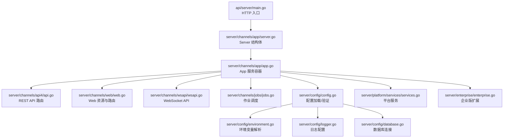
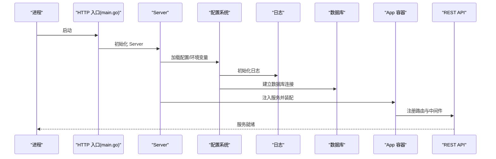
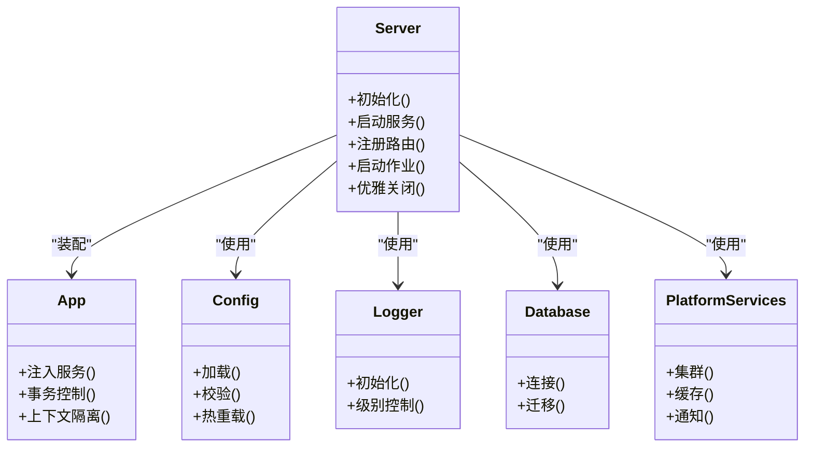
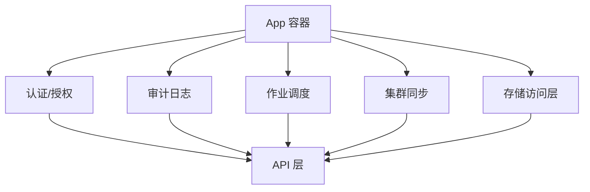
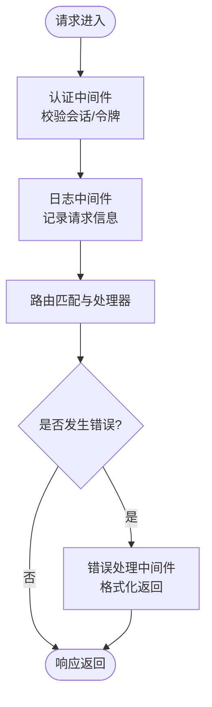
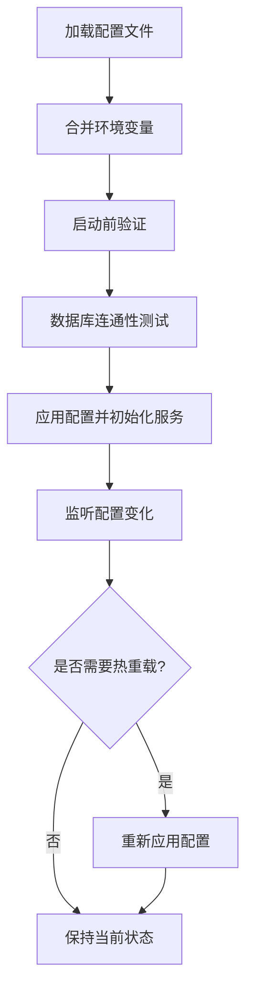
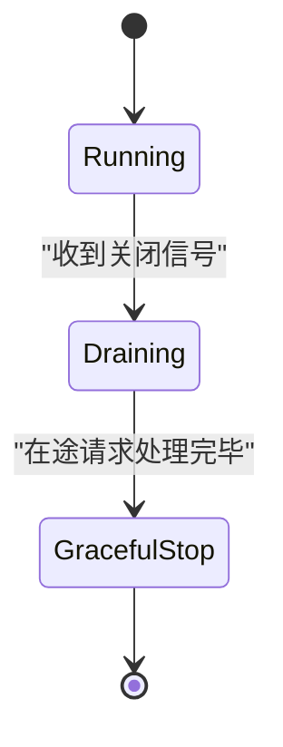
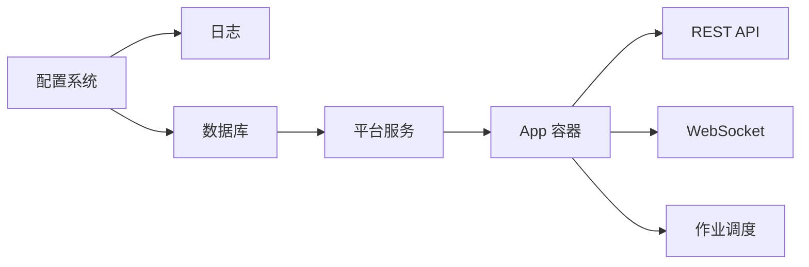

# 服务器架构

<cite>
**本文引用的文件**
- [server.go](file://server/channels/app/server.go)
- [app.go](file://server/channels/app/app.go)
- [main.go](file://api/server/main.go)
- [config.go](file://server/config/config.go)
- [environment.go](file://server/config/environment.go)
- [logger.go](file://server/config/logger.go)
- [store.go](file://server/config/store.go)
- [database.go](file://server/config/database.go)
- [api.go](file://server/channels/api4/api.go)
- [authentication.go](file://server/channels/app/authentication.go)
- [authorization.go](file://server/channels/app/authorization.go)
- [audit.go](file://server/channels/app/audit.go)
- [jobs.go](file://server/channels/jobs/jobs.go)
- [cluster.go](file://server/channels/app/cluster.go)
- [web.go](file://server/channels/web/web.go)
- [wsapi.go](file://server/channels/wsapi/wsapi.go)
- [platform_services.go](file://server/platform/services/services.go)
- [enterprise.go](file://server/enterprise/enterprise.go)
- [path.go](file://server/path.go)
</cite>

## 目录
1. [引言](#引言)
2. [项目结构](#项目结构)
3. [核心组件](#核心组件)
4. [架构总览](#架构总览)
5. [详细组件分析](#详细组件分析)
6. [依赖关系分析](#依赖关系分析)
7. [性能考量](#性能考量)
8. [故障排查指南](#故障排查指南)
9. [结论](#结论)
10. [附录](#附录)

## 引言
本文件系统性阐述 Mattermost 服务器端架构与运行机制，重点覆盖以下方面：
- 服务器启动流程：初始化顺序、依赖注入与组件装配
- 应用层架构设计：Server 结构体职责、App 服务容器管理与子系统协同
- 中间件体系：认证、日志与错误处理中间件实现思路
- 配置管理系统：配置加载、验证与热重载机制
- 服务器生命周期：优雅关闭、健康检查与监控集成
- 实际代码示例路径与最佳实践建议

## 项目结构
Mattermost 服务器端采用模块化分层组织：
- api/server：HTTP 服务入口（main 函数）
- server/channels：业务域与基础设施
  - channels/app：应用层（App 容器、认证、授权、审计等）
  - channels/api4：REST API 层
  - channels/web：Web 前端静态资源与路由
  - channels/wsapi：WebSocket API
  - channels/jobs：后台作业调度
  - channels/store：数据访问层抽象
  - channels/audit：审计日志
- server/config：配置加载、环境变量、日志与数据库连接
- server/platform：平台级服务与共享能力
- server/enterprise：企业版扩展能力
- server/cmd：命令行工具（mmctl 等）

图表来源
- [main.go](file://api/server/main.go)
- [server.go](file://server/channels/app/server.go)
- [app.go](file://server/channels/app/app.go)
- [api.go](file://server/channels/api4/api.go)
- [web.go](file://server/channels/web/web.go)
- [wsapi.go](file://server/channels/wsapi/wsapi.go)
- [jobs.go](file://server/channels/jobs/jobs.go)
- [config.go](file://server/config/config.go)
- [environment.go](file://server/config/environment.go)
- [logger.go](file://server/config/logger.go)
- [database.go](file://server/config/database.go)
- [platform_services.go](file://server/platform/services/services.go)
- [enterprise.go](file://server/enterprise/enterprise.go)

章节来源
- [main.go](file://api/server/main.go)
- [server.go](file://server/channels/app/server.go)
- [app.go](file://server/channels/app/app.go)

## 核心组件
- Server 结构体：承载应用生命周期、HTTP/WS 服务、集群与平台服务的统一装配点，负责初始化顺序与依赖注入。
- App 服务容器：封装业务服务实例（用户、团队、通道、文件、插件等），提供上下文隔离与事务边界控制。
- 配置系统：集中式配置加载、环境变量覆盖、日志与数据库连接初始化、配置差异检测与迁移。
- 平台服务：跨领域共享能力（如缓存、集群广播、通知等）。
- 企业版扩展：在基础功能之上按需启用高级能力。

章节来源
- [server.go](file://server/channels/app/server.go)
- [app.go](file://server/channels/app/app.go)
- [config.go](file://server/config/config.go)
- [platform_services.go](file://server/platform/services/services.go)
- [enterprise.go](file://server/enterprise/enterprise.go)

## 架构总览
下图展示从进程启动到服务就绪的关键交互：

图表来源
- [main.go](file://api/server/main.go)
- [server.go](file://server/channels/app/server.go)
- [config.go](file://server/config/config.go)
- [logger.go](file://server/config/logger.go)
- [database.go](file://server/config/database.go)
- [app.go](file://server/channels/app/app.go)
- [api.go](file://server/channels/api4/api.go)

## 详细组件分析

### Server 结构体与启动流程
- 职责与作用
  - 统一管理 HTTP 与 WebSocket 服务生命周期
  - 装配配置、日志、数据库、平台服务与 App 容器
  - 协调集群节点发现与广播
- 初始化顺序要点
  - 解析配置与环境变量
  - 初始化日志与数据库
  - 创建平台服务实例
  - 构建 App 容器并注入依赖
  - 注册路由与中间件
  - 启动后台作业与集群同步
- 关键接口路径
  - [Server 类型定义与方法](file://server/channels/app/server.go)
  - [HTTP 入口 main 函数](file://api/server/main.go)

图表来源
- [server.go](file://server/channels/app/server.go)
- [app.go](file://server/channels/app/app.go)
- [config.go](file://server/config/config.go)
- [logger.go](file://server/config/logger.go)
- [database.go](file://server/config/database.go)
- [platform_services.go](file://server/platform/services/services.go)

章节来源
- [server.go](file://server/channels/app/server.go)
- [main.go](file://api/server/main.go)

### App 服务容器与子系统协调
- App 的职责
  - 将各业务域服务（用户、团队、通道、文件、插件等）以依赖注入方式组装
  - 提供请求上下文隔离与事务边界控制
  - 作为 API 层与底层存储之间的适配器
- 子系统协作
  - 认证与授权：登录态校验与权限判定
  - 审计：记录关键操作与变更
  - 作业：异步任务调度与执行
  - 集群：节点状态同步与广播
- 关键接口路径
  - [App 容器定义与方法](file://server/channels/app/app.go)
  - [认证逻辑](file://server/channels/app/authentication.go)
  - [授权逻辑](file://server/channels/app/authorization.go)
  - [审计日志](file://server/channels/app/audit.go)
  - [作业调度](file://server/channels/jobs/jobs.go)
  - [集群处理](file://server/channels/app/cluster.go)

图表来源
- [app.go](file://server/channels/app/app.go)
- [authentication.go](file://server/channels/app/authentication.go)
- [authorization.go](file://server/channels/app/authorization.go)
- [audit.go](file://server/channels/app/audit.go)
- [jobs.go](file://server/channels/jobs/jobs.go)
- [cluster.go](file://server/channels/app/cluster.go)

章节来源
- [app.go](file://server/channels/app/app.go)
- [authentication.go](file://server/channels/app/authentication.go)
- [authorization.go](file://server/channels/app/authorization.go)
- [audit.go](file://server/channels/app/audit.go)
- [jobs.go](file://server/channels/jobs/jobs.go)
- [cluster.go](file://server/channels/app/cluster.go)

### 中间件体系：认证、日志与错误处理
- 认证中间件
  - 在请求进入 API 层前进行会话/令牌校验
  - 将用户上下文注入请求上下文
  - 参考路径：[认证逻辑](file://server/channels/app/authentication.go)
- 日志中间件
  - 记录请求/响应元信息、耗时与错误码
  - 支持结构化日志输出
  - 参考路径：[日志配置](file://server/config/logger.go)
- 错误处理中间件
  - 捕获异常并格式化返回
  - 区分业务错误与系统错误
  - 参考路径：[API 路由与错误处理](file://server/channels/api4/api.go)

图表来源
- [authentication.go](file://server/channels/app/authentication.go)
- [logger.go](file://server/config/logger.go)
- [api.go](file://server/channels/api4/api.go)

章节来源
- [authentication.go](file://server/channels/app/authentication.go)
- [logger.go](file://server/config/logger.go)
- [api.go](file://server/channels/api4/api.go)

### 配置管理系统：加载、验证与热重载
- 配置加载
  - 优先级：默认值 ← 文件 ← 环境变量 ← 命令行参数
  - 参考路径：[配置加载](file://server/config/config.go)，[环境变量解析](file://server/config/environment.go)
- 配置验证
  - 启动阶段对关键字段进行合法性校验
  - 数据库连接可用性与版本兼容性检查
  - 参考路径：[数据库配置](file://server/config/database.go)
- 热重载机制
  - 对可动态调整的配置项（如日志级别、限流阈值）支持平滑更新
  - 参考路径：[配置存储与事件](file://server/config/store.go)，[日志配置源](file://server/config/logger.go)

图表来源
- [config.go](file://server/config/config.go)
- [environment.go](file://server/config/environment.go)
- [database.go](file://server/config/database.go)
- [store.go](file://server/config/store.go)
- [logger.go](file://server/config/logger.go)

章节来源
- [config.go](file://server/config/config.go)
- [environment.go](file://server/config/environment.go)
- [database.go](file://server/config/database.go)
- [store.go](file://server/config/store.go)
- [logger.go](file://server/config/logger.go)

### 服务器生命周期管理：优雅关闭、健康检查与监控
- 优雅关闭
  - 拦截系统信号，停止接收新请求
  - 等待在途请求完成或超时
  - 关闭数据库连接、清理资源并退出
  - 参考路径：[Server 生命周期管理](file://server/channels/app/server.go)
- 健康检查
  - 提供 /health 端点，检查数据库、缓存与关键服务可用性
  - 返回状态码与简要诊断信息
  - 参考路径：[API 健康检查路由](file://server/channels/api4/api.go)
- 监控集成
  - 暴露指标端点（如 Prometheus）
  - 记录关键指标（QPS、延迟、错误率、队列长度）
  - 参考路径：[平台服务指标](file://server/platform/services/services.go)

图表来源
- [server.go](file://server/channels/app/server.go)
- [api.go](file://server/channels/api4/api.go)
- [platform_services.go](file://server/platform/services/services.go)

章节来源
- [server.go](file://server/channels/app/server.go)
- [api.go](file://server/channels/api4/api.go)
- [platform_services.go](file://server/platform/services/services.go)

### Web 与 WebSocket 服务
- Web 服务
  - 提供静态资源托管与前端路由回退
  - 参考路径：[Web 路由与资源](file://server/channels/web/web.go)
- WebSocket 服务
  - 用户会话级实时通信
  - 参考路径：[WebSocket API](file://server/channels/wsapi/wsapi.go)

章节来源
- [web.go](file://server/channels/web/web.go)
- [wsapi.go](file://server/channels/wsapi/wsapi.go)

### 企业版扩展与平台服务
- 企业版扩展
  - 在基础功能上启用高级特性（如合规导出、高级审计、Elasticsearch 等）
  - 参考路径：[企业版入口](file://server/enterprise/enterprise.go)
- 平台服务
  - 缓存、集群广播、通知、指标等跨域能力
  - 参考路径：[平台服务集合](file://server/platform/services/services.go)

章节来源
- [enterprise.go](file://server/enterprise/enterprise.go)
- [platform_services.go](file://server/platform/services/services.go)

## 依赖关系分析
- 组件耦合与内聚
  - Server 作为装配中心，向上依赖 App，向下依赖配置、日志、数据库与平台服务
  - App 对业务域服务进行聚合，避免 API 层直接依赖底层存储
- 外部依赖与集成
  - 数据库：PostgreSQL/MySQL 连接池与迁移
  - 缓存：Redis 或内存缓存
  - 消息队列：用于作业与事件解耦
- 潜在循环依赖
  - 通过接口与服务注册避免直接循环引用
- 关键依赖链路
  - 配置 → 日志/数据库 → 平台服务 → App → API/WebSocket

图表来源
- [config.go](file://server/config/config.go)
- [logger.go](file://server/config/logger.go)
- [database.go](file://server/config/database.go)
- [platform_services.go](file://server/platform/services/services.go)
- [app.go](file://server/channels/app/app.go)
- [api.go](file://server/channels/api4/api.go)
- [wsapi.go](file://server/channels/wsapi/wsapi.go)
- [jobs.go](file://server/channels/jobs/jobs.go)

章节来源
- [config.go](file://server/config/config.go)
- [logger.go](file://server/config/logger.go)
- [database.go](file://server/config/database.go)
- [platform_services.go](file://server/platform/services/services.go)
- [app.go](file://server/channels/app/app.go)
- [api.go](file://server/channels/api4/api.go)
- [wsapi.go](file://server/channels/wsapi/wsapi.go)
- [jobs.go](file://server/channels/jobs/jobs.go)

## 性能考量
- 连接池与并发
  - 数据库连接池大小与超时设置应结合 QPS 与查询复杂度调优
  - WebSocket 连接数与消息吞吐量监控
- 缓存策略
  - 利用平台服务缓存热点数据，降低数据库压力
- 作业调度
  - 合理拆分任务粒度，避免阻塞主请求线程
- 监控与告警
  - 关键指标采集与阈值告警，配合自动扩缩容

## 故障排查指南
- 启动失败
  - 检查配置文件与环境变量是否冲突
  - 查看日志中数据库连接与迁移错误
  - 参考路径：[配置与日志](file://server/config/config.go)，[日志初始化](file://server/config/logger.go)
- 请求异常
  - 使用错误处理中间件输出的上下文信息定位问题
  - 参考路径：[API 错误处理](file://server/channels/api4/api.go)
- 性能瓶颈
  - 分析慢查询与高延迟端点
  - 检查缓存命中率与作业积压情况
  - 参考路径：[平台服务指标](file://server/platform/services/services.go)

章节来源
- [config.go](file://server/config/config.go)
- [logger.go](file://server/config/logger.go)
- [api.go](file://server/channels/api4/api.go)
- [platform_services.go](file://server/platform/services/services.go)

## 结论
Mattermost 服务器端采用清晰的分层与装配模式：Server 作为生命周期与装配中枢，App 作为业务服务容器，配置系统与平台服务提供横切能力。通过中间件体系保障安全与可观测性，辅以完善的生命周期管理与监控集成，整体架构具备良好的可维护性与扩展性。

## 附录
- 代码示例路径参考
  - [HTTP 入口 main 函数](file://api/server/main.go)
  - [Server 结构体与方法](file://server/channels/app/server.go)
  - [App 容器定义与方法](file://server/channels/app/app.go)
  - [认证逻辑](file://server/channels/app/authentication.go)
  - [授权逻辑](file://server/channels/app/authorization.go)
  - [审计日志](file://server/channels/app/audit.go)
  - [作业调度](file://server/channels/jobs/jobs.go)
  - [集群处理](file://server/channels/app/cluster.go)
  - [Web 路由与资源](file://server/channels/web/web.go)
  - [WebSocket API](file://server/channels/wsapi/wsapi.go)
  - [配置加载](file://server/config/config.go)
  - [环境变量解析](file://server/config/environment.go)
  - [日志配置](file://server/config/logger.go)
  - [数据库配置](file://server/config/database.go)
  - [平台服务指标](file://server/platform/services/services.go)
  - [企业版入口](file://server/enterprise/enterprise.go)