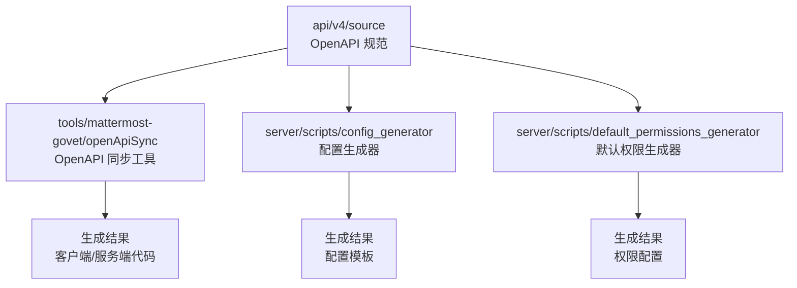
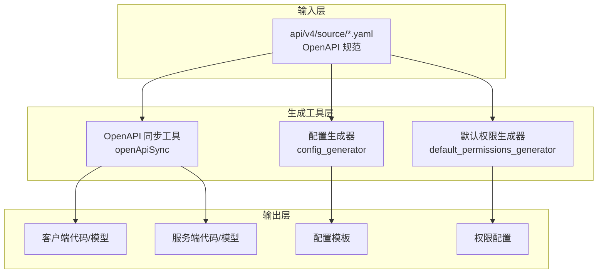
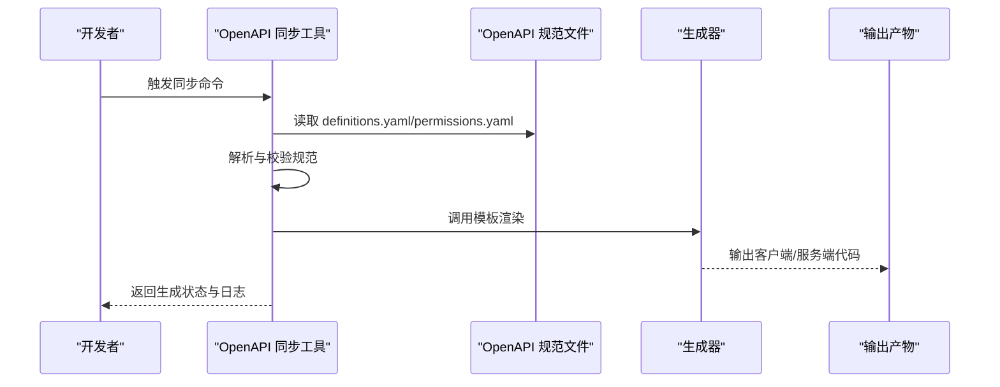
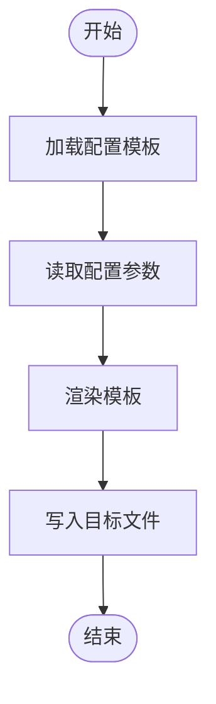
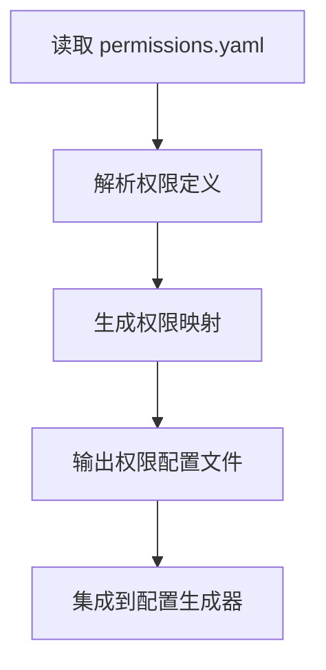
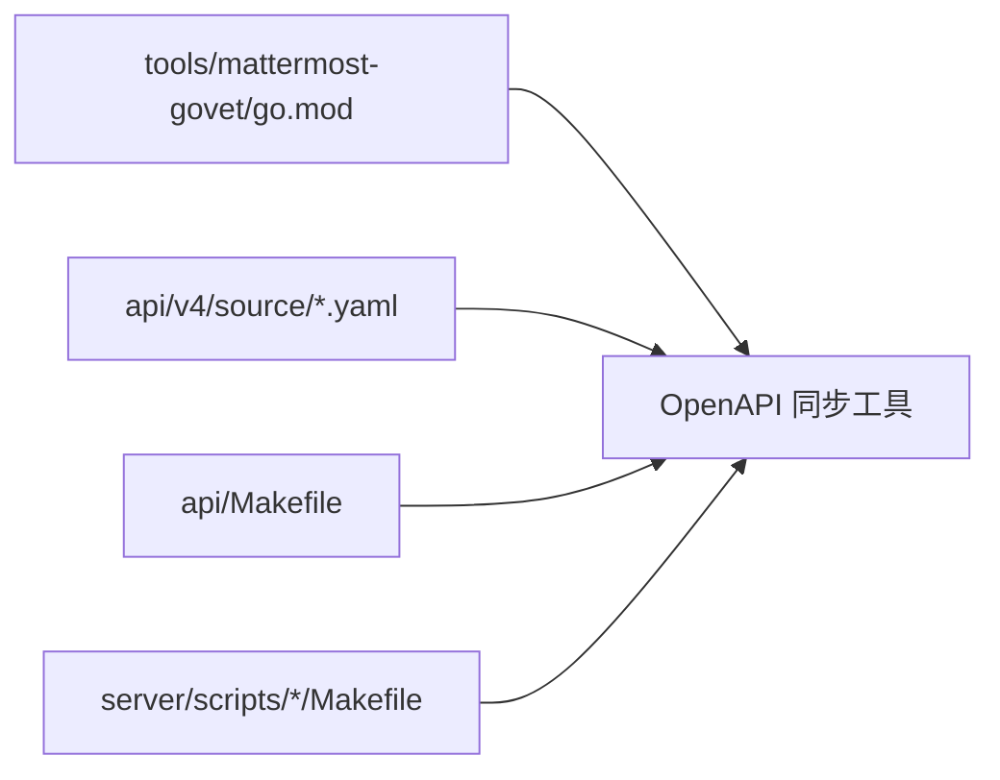

# 代码生成工具

<cite>
**本文档引用的文件**
- [openApiSync.go](file://tools/mattermost-govet/openApiSync/openApiSync.go)
- [openApiSync_test.go](file://tools/mattermost-govet/openApiSync/openApiSync_test.go)
- [definitions.yaml](file://api/v4/source/definitions.yaml)
- [permissions.yaml](file://api/v4/source/permissions.yaml)
- [Makefile](file://api/Makefile)
- [README.md](file://api/README.md)
- [Makefile](file://tools/mattermost-govet/Makefile)
- [README.md](file://tools/mattermost-govet/README.md)
- [main.go](file://tools/mattermost-govet/main.go)
- [go.mod](file://tools/mattermost-govet/go.mod)
- [go.sum](file://tools/mattermost-govet/go.sum)
- [Makefile](file://server/scripts/config_generator/Makefile)
- [Makefile](file://server/scripts/default_permissions_generator/Makefile)
- [Makefile](file://server/scripts/esrupgrades/Makefile)
- [Makefile](file://server/Makefile)
- [Makefile](file://webapp/Makefile)
- [Makefile](file://Makefile)
</cite>

## 目录
1. [简介](#简介)
2. [项目结构](#项目结构)
3. [核心组件](#核心组件)
4. [架构总览](#架构总览)
5. [详细组件分析](#详细组件分析)
6. [依赖关系分析](#依赖关系分析)
7. [性能考虑](#性能考虑)
8. [故障排除指南](#故障排除指南)
9. [结论](#结论)
10. [附录](#附录)

## 简介
本指南面向开发者与技术团队，系统性介绍 Mattermost 仓库中的代码生成工具链，涵盖以下能力：
- OpenAPI 规范同步与客户端代码生成：基于 API 规范自动对齐与生成客户端代码，确保前后端一致性。
- 配置文件生成器：自动生成默认权限配置与配置模板，降低手工维护成本。
- 模型代码生成：从 API 定义与权限配置中自动生成数据库模型与 API 模型，提升开发效率。
- 批量生成与模板定制：支持多模块、多语言的批量代码生成与模板扩展。
- 工作流程与最佳实践：从输入规范到生成规则再到输出格式的完整流程说明。
- 自定义生成器开发：提供模板编写与扩展机制指导。
- 持续集成中的应用：将代码生成纳入 CI 流水线，保障一致性与可重复性。

## 项目结构
围绕代码生成相关的目录与文件分布如下：
- tools/mattermost-govet：包含 OpenAPI 同步等代码质量与生成相关工具。
- api/v4/source：存放 OpenAPI 规范 YAML 文件（如 definitions.yaml、permissions.yaml）。
- server/scripts：包含配置生成器、权限生成器、升级脚本等 Makefile 与脚本。
- 各级 Makefile：统一编排生成任务，便于本地与 CI 使用。

图表来源
- [openApiSync.go:1-200](file://tools/mattermost-govet/openApiSync/openApiSync.go#L1-L200)
- [definitions.yaml:1-200](file://api/v4/source/definitions.yaml#L1-L200)
- [permissions.yaml:1-200](file://api/v4/source/permissions.yaml#L1-L200)

章节来源
- [Makefile:1-100](file://api/Makefile#L1-L100)
- [README.md:1-200](file://api/README.md#L1-L200)
- [Makefile:1-100](file://tools/mattermost-govet/Makefile#L1-L100)
- [README.md:1-200](file://tools/mattermost-govet/README.md#L1-L200)

## 核心组件
- OpenAPI 同步工具：负责读取 api/v4/source 下的规范文件，执行校验与同步逻辑，生成客户端或服务端代码。
- 配置生成器：根据模板与配置参数生成默认配置文件，支持批量与增量更新。
- 默认权限生成器：基于 permissions.yaml 自动生成权限配置，保证权限模型与业务一致。
- 模板与规则引擎：通过 Makefile 统一调度，结合 YAML 规范与模板，实现可扩展的生成流程。

章节来源
- [openApiSync.go:1-200](file://tools/mattermost-govet/openApiSync/openApiSync.go#L1-L200)
- [openApiSync_test.go:1-200](file://tools/mattermost-govet/openApiSync/openApiSync_test.go#L1-L200)
- [definitions.yaml:1-200](file://api/v4/source/definitions.yaml#L1-L200)
- [permissions.yaml:1-200](file://api/v4/source/permissions.yaml#L1-L200)

## 架构总览
下图展示了从 OpenAPI 规范到生成产物的整体架构与交互关系：

图表来源
- [openApiSync.go:1-200](file://tools/mattermost-govet/openApiSync/openApiSync.go#L1-L200)
- [Makefile:1-100](file://server/scripts/config_generator/Makefile#L1-L100)
- [Makefile:1-100](file://server/scripts/default_permissions_generator/Makefile#L1-L100)

## 详细组件分析

### OpenAPI 同步工具
该工具负责：
- 读取 api/v4/source 下的规范文件（如 definitions.yaml、permissions.yaml）。
- 对规范进行解析与校验，确保字段完整性与类型正确性。
- 基于模板生成客户端与服务端代码，保持 API 表面一致。
- 支持增量更新与版本对比，减少手动维护成本。

图表来源
- [openApiSync.go:1-200](file://tools/mattermost-govet/openApiSync/openApiSync.go#L1-L200)
- [openApiSync_test.go:1-200](file://tools/mattermost-govet/openApiSync/openApiSync_test.go#L1-L200)
- [definitions.yaml:1-200](file://api/v4/source/definitions.yaml#L1-L200)
- [permissions.yaml:1-200](file://api/v4/source/permissions.yaml#L1-L200)

章节来源
- [openApiSync.go:1-200](file://tools/mattermost-govet/openApiSync/openApiSync.go#L1-L200)
- [openApiSync_test.go:1-200](file://tools/mattermost-govet/openApiSync/openApiSync_test.go#L1-L200)
- [Makefile:1-100](file://api/Makefile#L1-L100)

### 配置文件生成器
功能概述：
- 读取配置模板与参数，生成默认配置文件。
- 支持批量生成与按需更新，避免重复劳动。
- 与权限生成器配合，形成完整的配置与权限体系。

图表来源
- [Makefile:1-100](file://server/scripts/config_generator/Makefile#L1-L100)

章节来源
- [Makefile:1-100](file://server/scripts/config_generator/Makefile#L1-L100)

### 默认权限生成器
功能概述：
- 基于 permissions.yaml 自动生成权限配置。
- 与 OpenAPI 规范联动，确保权限覆盖所有 API 端点。
- 支持导出与比对，便于审计与回归测试。

图表来源
- [permissions.yaml:1-200](file://api/v4/source/permissions.yaml#L1-L200)
- [Makefile:1-100](file://server/scripts/default_permissions_generator/Makefile#L1-L100)

章节来源
- [permissions.yaml:1-200](file://api/v4/source/permissions.yaml#L1-L200)
- [Makefile:1-100](file://server/scripts/default_permissions_generator/Makefile#L1-L100)

### 模型代码生成工具
- 数据库模型：基于 OpenAPI 规范中的数据结构定义，自动生成数据库表结构与迁移脚本。
- API 模型：生成请求/响应模型、序列化/反序列化代码，确保前后端数据契约一致。
- 批量生成：通过 Makefile 统一调度，支持多模块并行生成，缩短构建时间。

章节来源
- [definitions.yaml:1-200](file://api/v4/source/definitions.yaml#L1-L200)
- [Makefile:1-100](file://server/Makefile#L1-L100)

## 依赖关系分析
- 工具依赖：tools/mattermost-govet 作为核心生成工具，依赖 api/v4/source 的规范文件。
- 构建依赖：各模块 Makefile 依赖工具链与模板资源，形成统一的构建与生成入口。
- 外部依赖：Go 模块管理文件（go.mod/go.sum）确保工具链的可复现性。

图表来源
- [go.mod:1-100](file://tools/mattermost-govet/go.mod#L1-L100)
- [definitions.yaml:1-200](file://api/v4/source/definitions.yaml#L1-L200)
- [Makefile:1-100](file://api/Makefile#L1-L100)
- [Makefile:1-100](file://server/scripts/config_generator/Makefile#L1-L100)

章节来源
- [go.mod:1-100](file://tools/mattermost-govet/go.mod#L1-L100)
- [go.sum:1-100](file://tools/mattermost-govet/go.sum#L1-L100)

## 性能考虑
- 并行生成：通过 Makefile 将多个模块的生成任务并行化，缩短整体生成时间。
- 增量更新：仅对变更的规范文件执行生成，减少不必要的重跑。
- 缓存与中间产物：合理组织中间产物与缓存目录，避免重复计算。
- 模板优化：简化模板复杂度，减少渲染开销；对大文件采用流式处理策略。

## 故障排除指南
- 规范校验失败：检查 definitions.yaml 与 permissions.yaml 的字段与类型是否符合预期；参考测试用例定位问题。
- 生成器异常：查看工具日志与返回码，确认依赖环境（Go 版本、外部工具）是否满足要求。
- 权限不匹配：核对权限生成器输出与 API 端点映射，确保新增端点已补充权限定义。
- 模板渲染错误：检查模板语法与变量绑定，确保与规范字段一一对应。

章节来源
- [openApiSync_test.go:1-200](file://tools/mattermost-govet/openApiSync/openApiSync_test.go#L1-L200)
- [README.md:1-200](file://tools/mattermost-govet/README.md#L1-L200)

## 结论
通过统一的 OpenAPI 规范与生成工具链，Mattermost 实现了从规范到代码的自动化闭环。借助配置生成器与权限生成器，团队可以显著降低手工维护成本，提升一致性与可维护性。建议在日常开发与 CI 中广泛采用这些工具，以获得更高的开发效率与更稳定的交付质量。

## 附录

### 使用示例与最佳实践
- 在本地执行生成：通过 api/Makefile 或 tools/mattermost-govet/Makefile 提供的命令触发生成。
- 在 CI 中集成：将生成步骤加入流水线，确保每次提交后自动生成并校验产物。
- 模板定制：在 server/scripts/*/templates 目录下扩展模板，满足特定业务需求。
- 批量生成：利用 Makefile 的并行特性，同时生成多个模块的代码，提升效率。

章节来源
- [Makefile:1-100](file://api/Makefile#L1-L100)
- [Makefile:1-100](file://tools/mattermost-govet/Makefile#L1-L100)
- [README.md:1-200](file://api/README.md#L1-L200)
- [README.md:1-200](file://tools/mattermost-govet/README.md#L1-L200)