# 代码质量检查工具

<cite>
**本文档引用的文件**
- [tools/mattermost-govet/main.go](file://tools/mattermost-govet/main.go)
- [tools/mattermost-govet/.golangci.yml](file://tools/mattermost-govet/.golangci.yml)
- [tools/mattermost-govet/README.md](file://tools/mattermost-govet/README.md)
- [server/.golangci.yml](file://server/.golangci.yml)
- [.yamllint](file://.yamllint)
- [webapp/.eslintrc.json](file://webapp/.eslintrc.json)
- [webapp/.stylelintrc.json](file://webapp/.stylelintrc.json)
- [e2e-tests/cypress/eslint.config.mjs](file://e2e-tests/cypress/eslint.config.mjs)
- [e2e-tests/playwright/eslint.config.mjs](file://e2e-tests/playwright/eslint.config.mjs)
- [e2e-tests/playwright/playwright.config.ts](file://e2e-tests/playwright/playwright.config.ts)
- [webapp/package.json](file://webapp/package.json)
- [e2e-tests/cypress/package.json](file://e2e-tests/cypress/package.json)
- [e2e-tests/playwright/package.json](file://e2e-tests/playwright/package.json)
- [server/go.mod](file://server/go.mod)
- [tools/mattermost-govet/go.mod](file://tools/mattermost-govet/go.mod)
- [server/Makefile](file://server/Makefile)
- [tools/mattermost-govet/Makefile](file://tools/mattermost-govet/Makefile)
- [server/scripts/vet-api-check.sh](file://server/scripts/vet-api-check.sh)
</cite>

## 目录
1. [简介](#简介)
2. [项目结构](#项目结构)
3. [核心组件](#核心组件)
4. [架构概览](#架构概览)
5. [详细组件分析](#详细组件分析)
6. [依赖关系分析](#依赖关系分析)
7. [性能考虑](#性能考虑)
8. [故障排除指南](#故障排除指南)
9. [结论](#结论)
10. [附录](#附录)

## 简介

本指南详细介绍 Mattermost 项目的代码质量检查工具体系，包括自定义 Go 检查工具集、静态分析配置、前端代码检查以及 YAML 语法验证。该工具体系旨在确保代码的一致性、可维护性和安全性。

## 项目结构

项目采用多语言混合开发模式，包含以下主要代码质量检查组件：

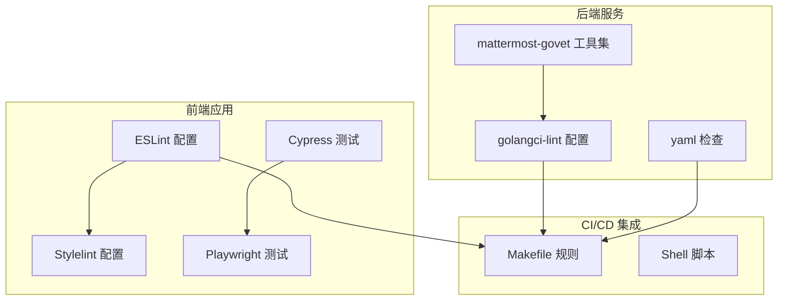

**图表来源**
- [tools/mattermost-govet/main.go:1-50](file://tools/mattermost-govet/main.go#L1-L50)
- [server/.golangci.yml:1-100](file://server/.golangci.yml#L1-L100)
- [webapp/.eslintrc.json:1-200](file://webapp/.eslintrc.json#L1-L200)

## 核心组件

### mattermost-govet 自定义检查工具集

mattermost-govet 是一个专门的 Go 代码检查工具集，包含多个自定义检查器：

#### 主要检查器类型

| 检查器名称 | 功能描述 | 触发条件 |
|-----------|----------|----------|
| API 审计日志检查 | 验证 API 处理程序是否正确记录审计日志 | 缺少审计日志调用 |
| 并发索引检查 | 检测数据库迁移中的并发索引创建 | 并发索引操作 |
| 错误变量命名检查 | 验证错误变量的命名规范 | 不符合命名约定的错误变量 |
| 结构化日志检查 | 确保使用结构化日志记录 | 使用非结构化日志 |
| 原始 SQL 检查 | 检测直接的 SQL 查询 | 直接 SQL 操作 |

#### 工具集架构

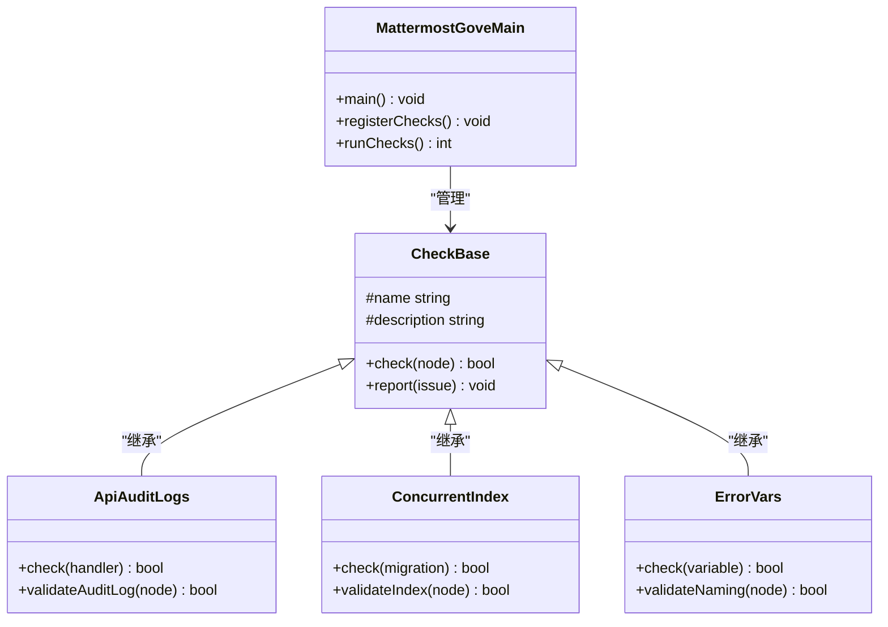

**图表来源**
- [tools/mattermost-govet/main.go:1-100](file://tools/mattermost-govet/main.go#L1-L100)
- [tools/mattermost-govet/apiAuditLogs/apiAuditLogs.go:1-80](file://tools/mattermost-govet/apiAuditLogs/apiAuditLogs.go#L1-L80)
- [tools/mattermost-govet/concurrentIndex/concurrentIndex.go:1-80](file://tools/mattermost-govet/concurrentIndex/concurrentIndex.go#L1-L80)

**章节来源**
- [tools/mattermost-govet/main.go:1-200](file://tools/mattermost-govet/main.go#L1-L200)
- [tools/mattermost-govet/README.md:1-150](file://tools/mattermost-govet/README.md#L1-L150)

### golangci-lint 配置

golangci-lint 提供了全面的 Go 代码静态分析功能：

#### 核心规则配置

| 规则类别 | 规则名称 | 描述 | 启用状态 |
|---------|----------|------|----------|
| 代码复杂度 | gocyclo | 循环复杂度检查 | ✅ 启用 |
| 内存优化 | noctx | 检测无上下文的 HTTP 请求 | ✅ 启用 |
| 错误处理 | errcheck | 错误检查 | ✅ 启用 |
| 代码风格 | gofmt | 代码格式化 | ✅ 启用 |
| 性能分析 | rowserrcheck | 数据库查询错误检查 | ✅ 启用 |
| 安全检查 | gosec | 安全漏洞检测 | ✅ 启用 |

#### 性能检查规则

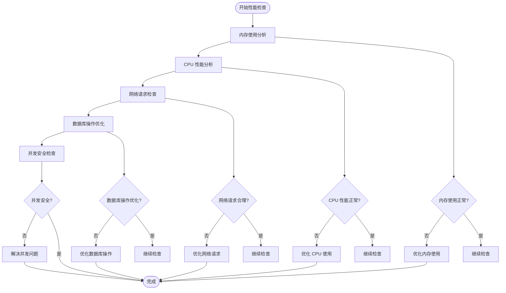

**图表来源**
- [server/.golangci.yml:1-200](file://server/.golangci.yml#L1-L200)

**章节来源**
- [server/.golangci.yml:1-300](file://server/.golangci.yml#L1-L300)

### ESLint 配置（JavaScript/TypeScript）

前端项目使用 ESLint 进行代码质量检查：

#### 核心配置文件

| 文件路径 | 类型 | 主要功能 |
|---------|------|----------|
| webapp/.eslintrc.json | 标准配置 | Web 应用 ESLint 规则 |
| e2e-tests/cypress/eslint.config.mjs | Cypress 配置 | E2E 测试 ESLint 规则 |
| e2e-tests/playwright/eslint.config.mjs | Playwright 配置 | 自动化测试 ESLint 规则 |

#### 代码风格规则

| 规则类别 | 规则名称 | 描述 | 配置值 |
|---------|----------|------|--------|
| 代码格式 | indent | 缩进检查 | 4 空格 |
| 变量声明 | no-unused-vars | 未使用变量 | 启用 |
| 函数声明 | func-style | 函数风格 | expression |
| 字符串格式 | quotes | 引号类型 | single |
| 导入顺序 | import/order | 导入排序 | 启用 |

**章节来源**
- [webapp/.eslintrc.json:1-300](file://webapp/.eslintrc.json#L1-L300)
- [e2e-tests/cypress/eslint.config.mjs:1-150](file://e2e-tests/cypress/eslint.config.mjs#L1-L150)
- [e2e-tests/playwright/eslint.config.mjs:1-150](file://e2e-tests/playwright/eslint.config.mjs#L1-L150)

### Stylelint 配置（CSS/SCSS）

Stylelint 用于确保样式代码的质量和一致性：

#### 配置特性

| 特性类别 | 规则名称 | 描述 | 配置值 |
|---------|----------|------|--------|
| 样式格式 | indentation | 缩进检查 | 2 空格 |
| 选择器命名 | selector-class-pattern | 类名模式 | camelCase |
| 颜色格式 | color-hex-case | 十六进制颜色大小写 | lowercase |
| 属性排序 | property-sort-order | 属性排序 | alphabetical |
| 注释规范 | comment-empty-line-before | 注释空行 | ignore |

**章节来源**
- [webapp/.stylelintrc.json:1-200](file://webapp/.stylelintrc.json#L1-L200)

### YAML 语法检查

YAML 文件使用 yamllint 进行语法和格式验证：

#### 配置规则

| 规则类别 | 规则名称 | 描述 | 配置值 |
|---------|----------|------|--------|
| 语法检查 | new-lines | 换行符检查 | universal |
| 缩进检查 | indentation | 缩进格式 | spaces: 2 |
| 行长度 | line-length | 行长度限制 | limit: 120 |
| 键唯一性 | key-duplicates | 键重复检查 | 启用 |
| 列表格式 | hyphen | 破折号格式 | spaces after: 2 |

**章节来源**
- [.yamllint:1-100](file://.yamllint#L1-L100)

## 架构概览

代码质量检查工具的整体架构如下：

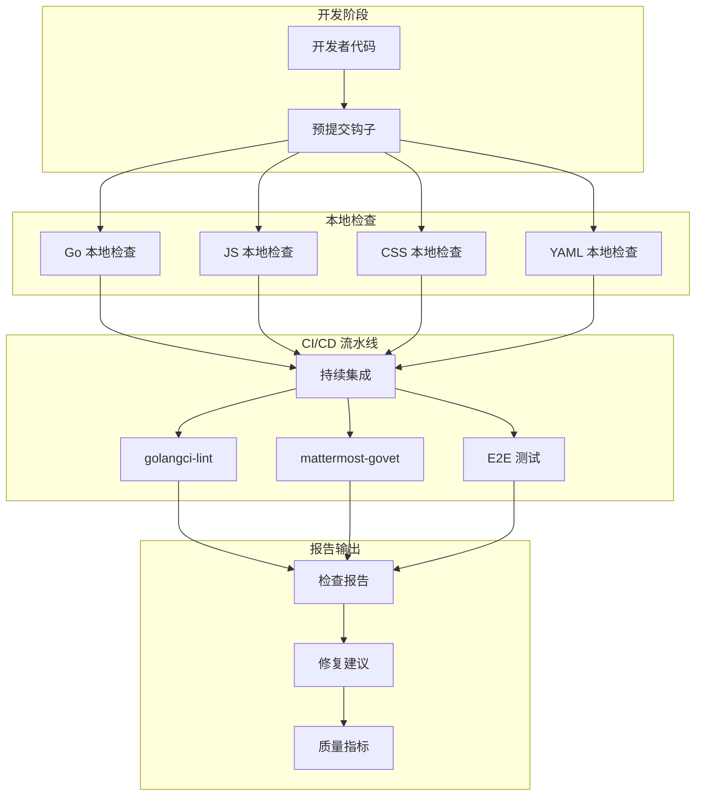

**图表来源**
- [server/Makefile:1-200](file://server/Makefile#L1-L200)
- [tools/mattermost-govet/Makefile:1-150](file://tools/mattermost-govet/Makefile#L1-L150)

## 详细组件分析

### mattermost-govet 工具集详解

#### API 审计日志检查器

API 审计日志检查器确保所有 API 处理程序都正确记录审计事件：

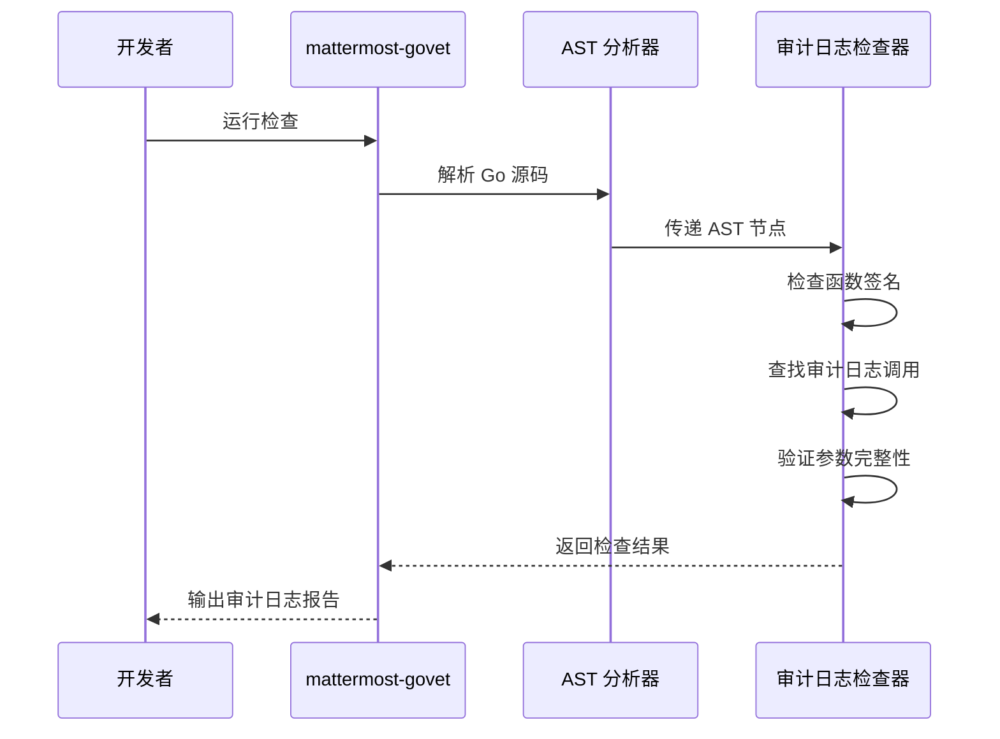

**图表来源**
- [tools/mattermost-govet/apiAuditLogs/apiAuditLogs.go:1-120](file://tools/mattermost-govet/apiAuditLogs/apiAuditLogs.go#L1-L120)

#### 并发索引检查器

并发索引检查器专门检测数据库迁移中的并发索引创建问题：

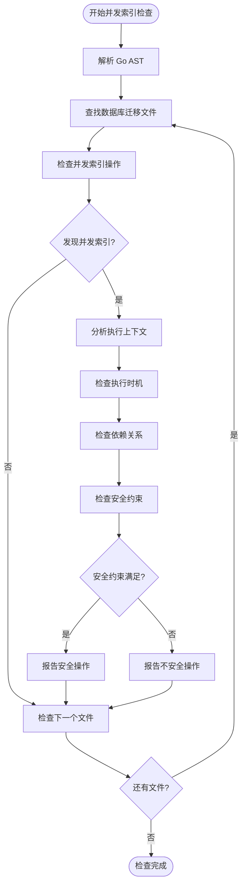

**图表来源**
- [tools/mattermost-govet/concurrentIndex/concurrentIndex.go:1-150](file://tools/mattermost-govet/concurrentIndex/concurrentIndex.go#L1-L150)

#### 错误变量命名检查器

错误变量命名检查器确保错误变量遵循统一的命名约定：

| 检查规则 | 命名模式 | 示例匹配 | 说明 |
|---------|----------|----------|------|
| 错误变量命名 | `err` | `err :=` | 标准错误变量命名 |
| 包装错误命名 | `wrappedErr` | `wrappedErr := errors.Wrap(` | 包装错误变量命名 |
| 复合错误命名 | `err.*` | `err.Error()` | 错误对象方法调用 |
| 上下文错误命名 | `ctx.Err()` | `ctx.Err()` | 上下文取消错误 |

**章节来源**
- [tools/mattermost-govet/errorVars/errorVars.go:1-120](file://tools/mattermost-govet/errorVars/errorVars.go#L1-L120)
- [tools/mattermost-govet/errorVarsName/errorVarsName.go:1-120](file://tools/mattermost-govet/errorVarsName/errorVarsName.go#L1-L120)

### golangci-lint 配置详解

#### 规则组配置

golangci-lint 将规则分为多个组，便于精细化控制：

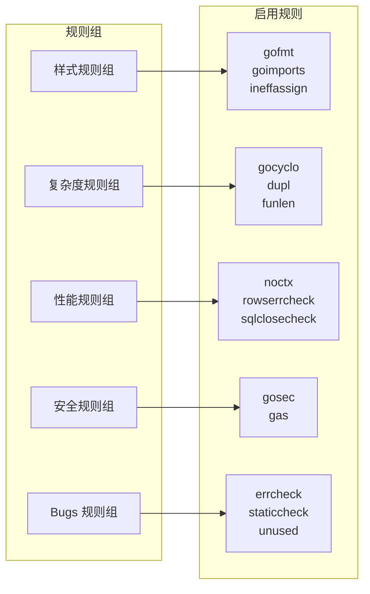

**图表来源**
- [server/.golangci.yml:1-300](file://server/.golangci.yml#L1-L300)

#### 配置文件结构

| 配置项 | 类型 | 默认值 | 说明 |
|-------|------|--------|------|
| run.mode | string | `''` | 运行模式 |
| run.skip-files | array | `[]` | 跳过文件模式 |
| run.skip-dirs | array | `[]` | 跳过目录模式 |
| linters.enable | array | `[]` | 启用的检查器 |
| linters.disable | array | `[]` | 禁用的检查器 |
| issues.exclude-rules | array | `[]` | 排除规则 |

**章节来源**
- [server/.golangci.yml:1-300](file://server/.golangci.yml#L1-L300)

### 前端代码检查配置

#### ESLint 配置策略

ESLint 配置采用分层策略，针对不同类型的代码应用不同的规则：

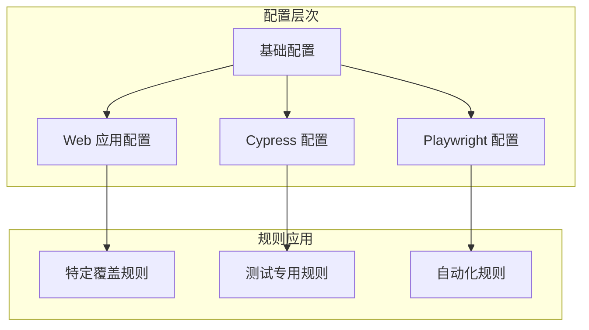

**图表来源**
- [webapp/.eslintrc.json:1-300](file://webapp/.eslintrc.json#L1-L300)
- [e2e-tests/cypress/eslint.config.mjs:1-150](file://e2e-tests/cypress/eslint.config.mjs#L1-L150)

#### Stylelint 配置策略

Stylelint 配置专注于样式代码的质量保证：

| 规则类别 | 全局规则 | Web 应用特有 | E2E 测试特有 |
|---------|----------|--------------|--------------|
| 格式化 | indent: 4 | indent: 2 | indent: 2 |
| 命名规范 | selector-class-pattern | camelCase | camelCase |
| 最佳实践 | color-named: never | color-hex-case: lower | color-hex-case: lower |
| 性能优化 | max-nesting-depth: 3 | declaration-block-single-line-max-declarations: 1 | 无特殊要求 |

**章节来源**
- [webapp/.stylelintrc.json:1-200](file://webapp/.stylelintrc.json#L1-L200)

### YAML 语法检查配置

#### yamllint 配置详解

yamllint 提供了全面的 YAML 语法和格式检查：

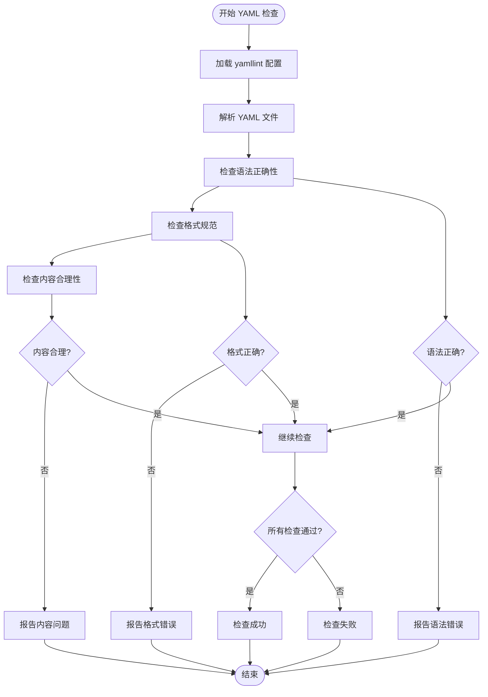

**图表来源**
- [.yamllint:1-100](file://.yamllint#L1-L100)

**章节来源**
- [.yamllint:1-100](file://.yamllint#L1-L100)

## 依赖关系分析

代码质量检查工具之间的依赖关系如下：

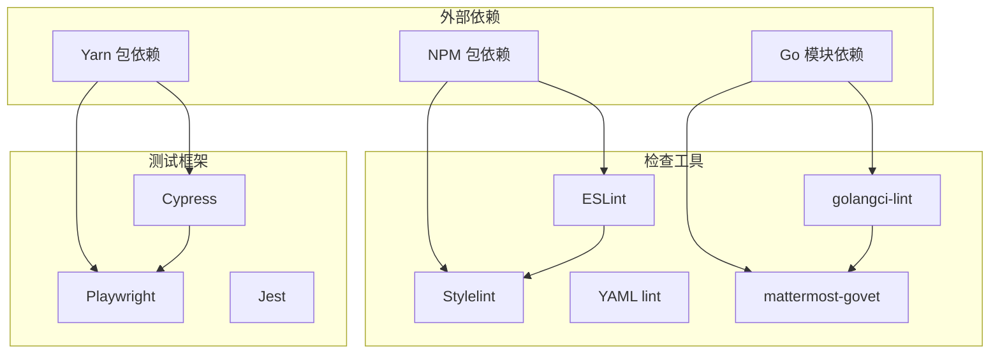

**图表来源**
- [server/go.mod:1-200](file://server/go.mod#L1-L200)
- [webapp/package.json:1-150](file://webapp/package.json#L1-L150)
- [e2e-tests/cypress/package.json:1-150](file://e2e-tests/cypress/package.json#L1-L150)

### 关键依赖关系

| 组件 | 主要依赖 | 版本范围 | 用途 |
|------|----------|----------|------|
| golangci-lint | golang.org/x/tools | ^0.1.0 | Go 代码分析 |
| mattermost-govet | github.com/mattermost/mattermost/server | ^8.0.0 | 自定义 Go 检查 |
| ESLint | @typescript-eslint/eslint-plugin | ^5.0.0 | TypeScript 检查 |
| Stylelint | stylelint-scss | ^4.0.0 | SCSS 检查 |
| Cypress | cypress | ^12.0.0 | E2E 测试 |
| Playwright | @playwright/test | ^1.0.0 | 自动化测试 |

**章节来源**
- [server/go.mod:1-200](file://server/go.mod#L1-L200)
- [webapp/package.json:1-200](file://webapp/package.json#L1-L200)
- [e2e-tests/playwright/package.json:1-200](file://e2e-tests/playwright/package.json#L1-L200)

## 性能考虑

### 检查工具性能优化

#### 并行执行策略

```mermaid
sequenceDiagram
participant Make as Makefile
participant GoParallel as Go 并行检查
participant JSParallel as JS 并行检查
participant CSSParallel as CSS 并行检查
participant YAMLParallel as YAML 并行检查
Make->>GoParallel : 启动 Go 检查进程
Make->>JSParallel : 启动 JS 检查进程
Make->>CSSParallel : 启动 CSS 检查进程
Make->>YAMLParallel : 启动 YAML 检查进程
GoParallel->>GoParallel : 分析 Go 代码
JSParallel->>JSParallel : 分析 JS 代码
CSSParallel->>CSSParallel : 分析 CSS 代码
YAMLParallel->>YAMLParallel : 分析 YAML 文件
GoParallel-->>Make : 返回 Go 检查结果
JSParallel-->>Make : 返回 JS 检查结果
CSSParallel-->>Make : 返回 CSS 检查结果
YAMLParallel-->>Make : 返回 YAML 检查结果
```

#### 缓存机制

| 缓存类型 | 实现方式 | 效果 |
|---------|----------|------|
| Go 检查缓存 | golangci-lint 缓存 | 减少重复检查时间 |
| ESLint 缓存 | 内置缓存机制 | 加速 JavaScript 检查 |
| Stylelint 缓存 | 文件变更检测 | 仅检查修改的样式文件 |
| YAML 缓存 | 文件系统缓存 | 快速响应 YAML 变更 |

### 内存使用优化

检查工具在内存使用方面采取了多项优化措施：

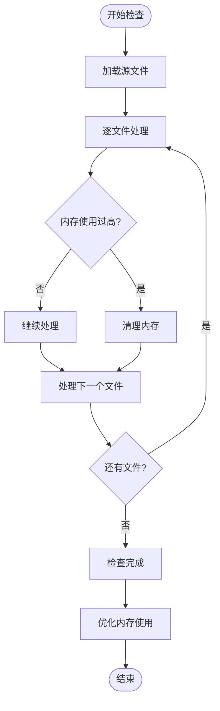

## 故障排除指南

### 常见问题及解决方案

#### mattermost-govet 工具问题

| 问题类型 | 症状 | 解决方案 |
|---------|------|----------|
| 工具编译失败 | 编译错误或找不到依赖 | 检查 go.mod 依赖和 Go 版本 |
| 检查器不工作 | 检查器返回空结果 | 验证检查器注册和配置 |
| 性能问题 | 检查执行时间过长 | 优化 AST 解析和检查逻辑 |

#### golangci-lint 配置问题

| 问题类型 | 症状 | 解决方案 |
|---------|------|----------|
| 规则冲突 | 不同规则产生矛盾 | 调整规则优先级和排除规则 |
| 性能问题 | 检查速度慢 | 启用并行执行和缓存 |
| 结果不准确 | 检测误报 | 调整规则阈值和排除模式 |

#### 前端检查问题

| 问题类型 | 症状 | 解决方案 |
|---------|------|----------|
| ESLint 配置错误 | 配置解析失败 | 检查 JSON 格式和语法 |
| Stylelint 规则冲突 | 样式检查失败 | 调整规则配置和覆盖规则 |
| 测试环境问题 | E2E 测试不稳定 | 检查测试环境配置和依赖 |

### 调试技巧

#### 日志级别设置

| 日志级别 | 用途 | 配置示例 |
|---------|------|----------|
| DEBUG | 详细调试信息 | 设置为最高级别 |
| INFO | 一般信息 | 默认级别 |
| WARN | 警告信息 | 重要但不致命的问题 |
| ERROR | 错误信息 | 严重问题 |

#### 性能分析

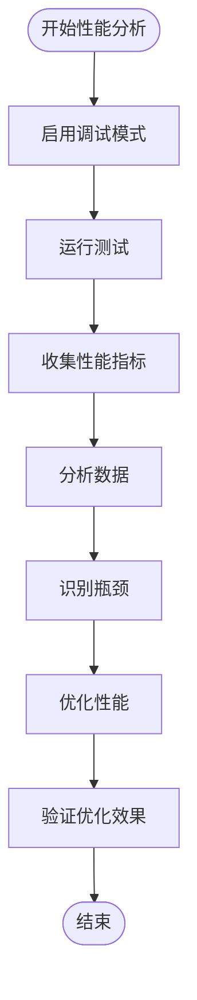

**章节来源**
- [tools/mattermost-govet/README.md:1-200](file://tools/mattermost-govet/README.md#L1-L200)

## 结论

Mattermost 项目的代码质量检查工具体系提供了全面的多语言代码质量保障。通过自定义的 mattermost-govet 工具集、完善的 golangci-lint 配置、严格的前端代码检查和 YAML 语法验证，确保了代码的一致性、可维护性和安全性。

该工具体系的关键优势包括：
- **多语言支持**：涵盖 Go、JavaScript、TypeScript 和 YAML
- **自定义规则**：针对 Mattermost 特定需求的检查规则
- **性能优化**：并行执行和缓存机制提升检查效率
- **易于集成**：与 CI/CD 流程无缝集成

## 附录

### 快速开始指南

#### 本地运行检查

```bash
# 运行 Go 代码检查
make vet

# 运行前端代码检查
cd webapp
npm run lint

# 运行 YAML 检查
yamllint .

# 运行自定义 Go 检查工具
cd tools/mattermost-govet
make vet
```

#### CI/CD 集成步骤

1. **配置 GitHub Actions**
   - 创建 `.github/workflows/code-quality.yml`
   - 添加代码检查步骤
   - 配置缓存和报告

2. **设置预提交钩子**
   - 安装 husky
   - 配置 pre-commit 脚本
   - 自动运行代码检查

3. **配置持续集成**
   - 在 CI 环境中安装依赖
   - 执行完整的代码检查流程
   - 生成和发布检查报告

#### 最佳实践建议

1. **定期更新工具版本**
   - 跟踪最新版本的安全补丁
   - 适配新的语言特性和最佳实践

2. **定制检查规则**
   - 根据项目特点调整规则严格程度
   - 添加团队特定的检查规则

3. **监控检查结果**
   - 跟踪代码质量趋势
   - 识别新出现的问题模式

4. **团队培训**
   - 教育开发者理解检查规则
   - 建立代码审查标准