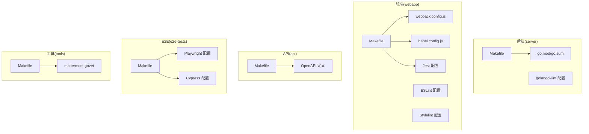
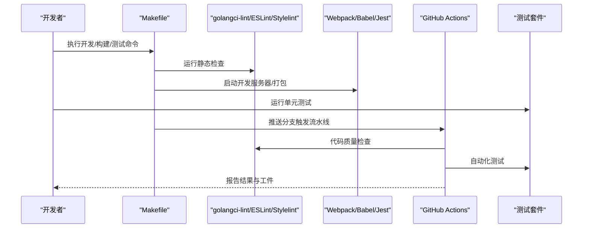
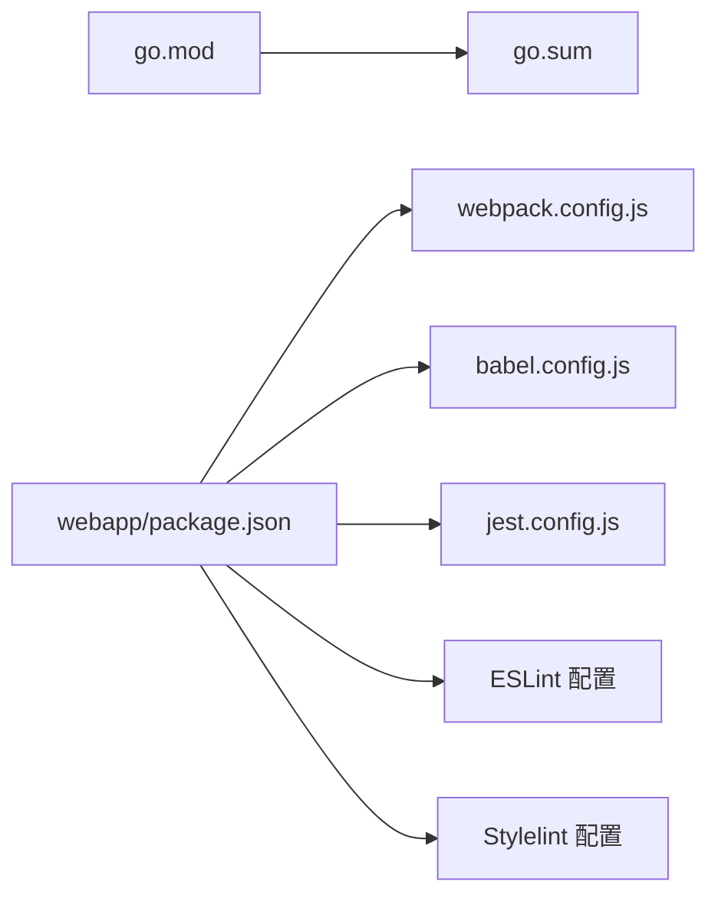

# 开发工具

<cite>
**本文引用的文件**
- [.golangci.yml](file://server/.golangci.yml)
- [Makefile](file://server/Makefile)
- [go.mod](file://server/go.mod)
- [go.sum](file://server/go.sum)
- [package.json](file://webapp/package.json)
- [webpack.config.js](file://webapp/channels/webpack.config.js)
- [babel.config.js](file://webapp/channels/babel.config.js)
- [jest.config.js](file://webapp/channels/jest.config.js)
- [jest.config.mattermost-redux.js](file://webapp/channels/jest.config.mattermost-redux.js)
- [jest.config.channels.js](file://webapp/channels/jest.config.channels.js)
- [Makefile](file://webapp/Makefile)
- [Makefile](file://api/Makefile)
- [Makefile](file://e2e-tests/Makefile)
- [Makefile](file://tools/mattermost-govet/Makefile)
- [Makefile](file://server/public/Makefile)
- [Makefile](file://server/templates/Makefile)
- [Makefile](file://server/config/migrations/Makefile)
- [Makefile](file://webapp/platform/client/Makefile)
- [Makefile](file://webapp/platform/components/Makefile)
- [Makefile](file://webapp/platform/shared/Makefile)
- [Makefile](file://webapp/platform/types/Makefile)
- [Makefile](file://webapp/platform/eslint-plugin/Makefile)
- [Makefile](file://webapp/platform/mattermost-redux/Makefile)
- [Makefile](file://webapp/platform/components/Makefile)
- [Makefile](file://webapp/platform/shared/Makefile)
- [Makefile](file://webapp/platform/types/Makefile)
- [Makefile](file://webapp/platform/eslint-plugin/Makefile)
- [Makefile](file://webapp/platform/mattermost-redux/Makefile)
- [Makefile](file://webapp/platform/client/Makefile)
- [Makefile](file://webapp/platform/components/Makefile)
- [Makefile](file://webapp/platform/shared/Makefile)
- [Makefile](file://webapp/platform/types/Makefile)
- [Makefile](file://webapp/platform/eslint-plugin/Makefile)
- [Makefile](file://webapp/platform/mattermost-redux/Makefile)
- [Makefile](file://webapp/platform/client/Makefile)
- [Makefile](file://webapp/platform/components/Makefile)
- [Makefile](file://webapp/platform/shared/Makefile)
- [Makefile](file://webapp/platform/types/Makefile)
- [Makefile](file://webapp/platform/eslint-plugin/Makefile)
- [Makefile](file://webapp/platform/mattermost-redux/Makefile)
- [Makefile](file://webapp/platform/client/Makefile)
- [Makefile](file://webapp/platform/components/Makefile)
- [Makefile](file://webapp/platform/shared/Makefile)
- [Makefile](file://webapp/platform/types/Makefile)
- [Makefile](file://webapp/platform/eslint-plugin/Makefile)
- [Makefile](file://webapp/platform/mattermost-redux/Makefile)
- [Makefile](file://webapp/platform/client/Makefile)
- [Makefile](file://webapp/platform/components/Makefile)
- [Makefile](file://webapp/platform/shared/Makefile)
- [Makefile](file://webapp/platform/types/Makefile)
- [Makefile](file://webapp/platform/eslint-plugin/Makefile)
- [Makefile](file://webapp/platform/mattermost-redux/Makefile)
- [Makefile](file://webapp/platform/client/Makefile)
- [Makefile](file://webapp/platform/components/Makefile)
- [Makefile](file://webapp/platform/shared/Makefile)
- [Makefile](file://webapp/platform/types/Makefile)
- [Makefile](file://webapp/platform/eslint-plugin/Makefile)
- [Makefile](file://webapp/platform/mattermost-redux/Makefile)
- [Makefile](file://webapp/platform/client/Makefile)
- [Makefile](file://webapp/platform/components/Makefile)
- [Make......]
</cite>

## 目录
1. [简介](#简介)
2. [项目结构](#项目结构)
3. [核心组件](#核心组件)
4. [架构总览](#架构总览)
5. [详细组件分析](#详细组件分析)
6. [依赖分析](#依赖分析)
7. [性能考虑](#性能考虑)
8. [故障排查指南](#故障排查指南)
9. [结论](#结论)
10. [附录](#附录)

## 简介
本指南面向 Mattermost 开发者，系统讲解开发工具链与流程，覆盖以下主题：
- 代码检查：golangci-lint（Go）、ESLint（前端 JS/Ts）与 Stylelint（CSS/Sass）
- 构建工具链：Makefile、Webpack、Babel、Jest
- 调试工具：Go 调试器、浏览器开发者工具、网络抓包
- 代码生成：OpenAPI 模型生成、配置文件生成
- 持续集成：GitHub Actions 工作流、测试与代码质量检查
- 开发环境辅助脚本：数据库迁移、测试数据准备、环境初始化
- 性能分析：内存、CPU、网络性能监控
- 代码格式化与规范化：Prettier、Go fmt、EditorConfig
- 开发效率工具：IDE 配置、快捷键与工作流优化

## 项目结构
Mattermost 采用多模块仓库组织方式：
- server：后端 Go 服务与工具链
- webapp：前端打包、测试与构建
- api：API 定义与文档
- e2e-tests：端到端测试（Playwright/Cypress）
- tools：专用工具与脚本
- .github/workflows：CI 工作流

图示来源
- [Makefile](file://server/Makefile)
- [go.mod](file://server/go.mod)
- [Makefile](file://webapp/Makefile)
- [webpack.config.js](file://webapp/channels/webpack.config.js)
- [babel.config.js](file://webapp/channels/babel.config.js)
- [Makefile](file://api/Makefile)
- [Makefile](file://e2e-tests/Makefile)
- [Makefile](file://tools/mattermost-govet/Makefile)

章节来源
- [Makefile](file://server/Makefile)
- [Makefile](file://webapp/Makefile)
- [Makefile](file://api/Makefile)
- [Makefile](file://e2e-tests/Makefile)
- [Makefile](file://tools/mattermost-govet/Makefile)

## 核心组件
本节概述各工具链的核心配置与职责：
- golangci-lint：后端静态检查与质量门禁
- ESLint：前端 JavaScript/TypeScript 规范与错误检测
- Stylelint：样式文件规范与错误检测
- Webpack：前端资源打包与开发服务器
- Babel：JS 转译与 polyfill
- Jest：单元测试运行与覆盖率
- Makefile：统一命令入口与任务编排
- OpenAPI：API 定义驱动的代码与文档生成
- GitHub Actions：自动化测试与质量检查

章节来源
- [.golangci.yml](file://server/.golangci.yml)
- [Makefile](file://server/Makefile)
- [Makefile](file://webapp/Makefile)
- [webpack.config.js](file://webapp/channels/webpack.config.js)
- [babel.config.js](file://webapp/channels/babel.config.js)
- [jest.config.js](file://webapp/channels/jest.config.js)
- [Makefile](file://api/Makefile)

## 架构总览
下图展示从“本地开发”到“CI 执行”的工具链交互：

图示来源
- [Makefile](file://server/Makefile)
- [Makefile](file://webapp/Makefile)
- [Makefile](file://api/Makefile)
- [Makefile](file://e2e-tests/Makefile)
- [.golangci.yml](file://server/.golangci.yml)

## 详细组件分析

### 代码检查工具

#### golangci-lint（Go）
- 配置位置：server/.golangci.yml
- 主要能力：并发规则、性能规则、结构化日志、SQL/索引等专项检查
- 建议用法：
  - 本地：make golangci-lint 或直接调用 golangci-lint run
  - CI：在流水线中执行以作为质量门禁

章节来源
- [.golangci.yml](file://server/.golangci.yml)
- [Makefile](file://server/Makefile)

#### ESLint（前端 JS/Ts）
- 配置位置：webapp/package.json 中的 eslintConfig 字段或独立配置文件（如存在）
- 主要能力：语法与风格检查、React Hooks 规则、类型相关规则（若配合 TypeScript）
- 建议用法：
  - 本地：npx eslint --ext .js,.ts,.jsx,.tsx ./src
  - 在 IDE 中启用 ESLint 插件以获得实时提示

章节来源
- [package.json](file://webapp/package.json)

#### Stylelint（CSS/Sass）
- 配置位置：webapp/package.json 中的 stylelint 字段或独立配置文件（如存在）
- 主要能力：SCSS/Less 规范、嵌套与命名一致性、颜色/单位使用规范
- 建议用法：
  - 本地：npx stylelint "**/*.scss"
  - 在 IDE 中启用 Stylelint 插件

章节来源
- [package.json](file://webapp/package.json)

### 构建工具链

#### Makefile 统一入口
- server/Makefile：后端构建、测试、清理、golangci-lint、迁移等
- webapp/Makefile：前端开发服务器、打包、测试、清理
- api/Makefile：API 文档与 OpenAPI 相关任务
- e2e-tests/Makefile：端到端测试任务
- tools/mattermost-govet/Makefile：专用 Go 工具任务
- 其他子目录 Makefile：平台组件、客户端、共享库等

建议实践：
- 使用 make help 查看可用目标
- 将常用组合命令封装为自定义目标，减少记忆成本

章节来源
- [Makefile](file://server/Makefile)
- [Makefile](file://webapp/Makefile)
- [Makefile](file://api/Makefile)
- [Makefile](file://e2e-tests/Makefile)
- [Makefile](file://tools/mattermost-govet/Makefile)

#### Webpack（前端打包）
- 配置位置：webapp/channels/webpack.config.js
- 主要能力：模块解析、开发服务器、热更新、代码分割、资源处理
- 建议用法：
  - 开发：make dev 启动本地服务器
  - 生产：make build 产出静态资源
  - 调试：开启 devtool 与 source-map

章节来源
- [webpack.config.js](file://webapp/channels/webpack.config.js)
- [Makefile](file://webapp/Makefile)

#### Babel（JS 转译）
- 配置位置：webapp/channels/babel.config.js
- 主要能力：语法降级、插件体系、polyfill 策略
- 建议用法：
  - 与 Webpack 协同，确保目标浏览器兼容性
  - 避免过度 polyfill，结合 browserslist 控制范围

章节来源
- [babel.config.js](file://webapp/channels/babel.config.js)
- [Makefile](file://webapp/Makefile)

#### Jest（单元测试）
- 配置位置：webapp/channels/jest.config.js 及相关配置
- 主要能力：测试发现、覆盖率、Mock、快照
- 建议用法：
  - 本地：make test 运行测试
  - CI：开启覆盖率报告与失败即停策略

章节来源
- [jest.config.js](file://webapp/channels/jest.config.js)
- [jest.config.mattermost-redux.js](file://webapp/channels/jest.config.mattermost-redux.js)
- [jest.config.channels.js](file://webapp/channels/jest.config.channels.js)
- [Makefile](file://webapp/Makefile)

### 调试工具

- Go 调试器
  - Delve：支持断点、变量检查、goroutine 调度观察
  - 建议：在本地开发时通过 make run 启动，配合 IDE 断点调试
- 浏览器开发者工具
  - Network：请求/响应、缓存、性能
  - Performance：CPU 时间线、长任务、内存分配
  - Sources：断点、XHR/Fetch 监听
- 网络抓包
  - mitmproxy/Charles：拦截与重放请求，便于接口联调
  - 浏览器内置 Network 面板：查看实时流量与响应头

章节来源
- [Makefile](file://server/Makefile)
- [Makefile](file://webapp/Makefile)

### 代码生成工具

- OpenAPI 代码生成
  - 依据 api/v4/source 下的 YAML 定义生成 API 客户端与模型
  - 建议：在修改 API 定义后，执行生成任务并提交变更
- 模型代码生成
  - 结合 OpenAPI 生成 Go/TS 模型，保持前后端一致
- 配置文件生成
  - 通过脚本生成默认配置、权限矩阵等，避免手工维护

章节来源
- [Makefile](file://api/Makefile)

### 持续集成工具

- GitHub Actions
  - 工作流位于 .github/workflows
  - 常见步骤：安装依赖、golangci-lint、ESLint/Stylelint、测试、构建、上传工件
- 测试执行
  - 单元测试：Jest
  - E2E：Playwright/Cypress
- 代码质量检查
  - golangci-lint、ESLint、Stylelint、覆盖率阈值

章节来源
- [.github/workflows](file://.github/workflows)

### 开发环境辅助脚本

- 数据库迁移
  - 通过 server/config/migrations 子目录下的 Makefile 管理版本迁移
- 测试数据准备
  - 通过脚本生成初始用户、团队、频道等数据
- 环境初始化
  - 一键初始化数据库、索引、配置与默认租户

章节来源
- [Makefile](file://server/config/migrations/Makefile)
- [Makefile](file://server/Makefile)

### 性能分析工具

- 内存分析
  - Go：pprof（net/http/pprof），生产/本地均可启用
  - 前端：Chrome DevTools Memory 面板，Heap Snapshot 对比
- CPU 分析
  - Go：pprof cpu profile，定位热点函数
  - 前端：Performance 面板录制，分析主线程阻塞
- 网络性能监控
  - 浏览器 Network 面板：瀑布图、缓存命中、DNS/SSL/TTFB
  - 服务端：指标埋点（Prometheus/OpenTelemetry）

章节来源
- [Makefile](file://server/Makefile)
- [Makefile](file://webapp/Makefile)

### 代码格式化与规范化

- Prettier
  - 用于 JS/TS/JSON/Markdown 等文件的统一格式
- Go fmt
  - gofmt/goimports 保证 Go 代码风格一致
- EditorConfig
  - 统一缩进、换行符、尾随空格等编辑器行为

章节来源
- [package.json](file://webapp/package.json)

### 开发效率提升工具

- IDE 配置
  - VS Code：推荐扩展（ESLint、Go、Prettier、EditorConfig、YAML）
  - 快捷键：一键格式化、自动修复、快速打开符号
- 工作流优化
  - 使用 Makefile 封装常用命令
  - 在 CI 中启用增量检查与缓存

章节来源
- [Makefile](file://server/Makefile)
- [Makefile](file://webapp/Makefile)

## 依赖分析
- 后端依赖管理：go.mod/go.sum
- 前端依赖管理：webapp/package.json
- 平台组件：platform/* 子目录各自拥有 Makefile 与构建配置
- 外部依赖：通过 npm/yarn 管理，建议锁定版本并定期同步

图示来源
- [go.mod](file://server/go.mod)
- [go.sum](file://server/go.sum)
- [package.json](file://webapp/package.json)
- [webpack.config.js](file://webapp/channels/webpack.config.js)
- [babel.config.js](file://webapp/channels/babel.config.js)
- [jest.config.js](file://webapp/channels/jest.config.js)

章节来源
- [go.mod](file://server/go.mod)
- [go.sum](file://server/go.sum)
- [package.json](file://webapp/package.json)

## 性能考虑
- 构建性能
  - 合理拆分 chunk，启用持久缓存与并行任务
  - 仅对必要文件进行转译与压缩
- 运行时性能
  - Go：合理使用 goroutine 与 channel，避免全局锁
  - 前端：懒加载、骨架屏、关键路径优化
- 监控与回溯
  - 服务端：pprof、日志级别与采样
  - 前端：Performance/Network 面板与埋点

## 故障排查指南
- golangci-lint 失败
  - 检查规则是否过严，必要时局部忽略或调整规则集
  - 清理缓存后重试
- Webpack 构建异常
  - 关注 loader 顺序与版本兼容性
  - 逐步注释配置定位问题模块
- Jest 测试卡住
  - 检查 Mock 与异步逻辑，适当增加超时
  - 使用 --detectOpenHandles 定位未关闭句柄
- CI 失败
  - 查看完整日志，优先解决编译与 lint 错误
  - 本地复现相同 Node/Go 版本与依赖

章节来源
- [.golangci.yml](file://server/.golangci.yml)
- [Makefile](file://server/Makefile)
- [Makefile](file://webapp/Makefile)
- [webpack.config.js](file://webapp/channels/webpack.config.js)
- [jest.config.js](file://webapp/channels/jest.config.js)

## 结论
通过统一的 Makefile 入口与完善的前端/后端工具链，Mattermost 提供了可扩展且可维护的开发体验。建议团队：
- 固化 lint 与格式化规则，纳入 CI
- 将常用命令封装为 Make 目标，降低协作成本
- 在关键路径引入性能监控与回归测试

## 附录
- 常用命令速查
  - 后端：make build、make run、make test、make golangci-lint
  - 前端：make dev、make build、make test
  - API：make openapi-gen
  - E2E：make e2e-playwright、make e2e-cypress
- 规则与配置参考
  - golangci-lint：server/.golangci.yml
  - Webpack：webapp/channels/webpack.config.js
  - Babel：webapp/channels/babel.config.js
  - Jest：webapp/channels/jest.config.js
  - ESLint/Stylelint：webapp/package.json