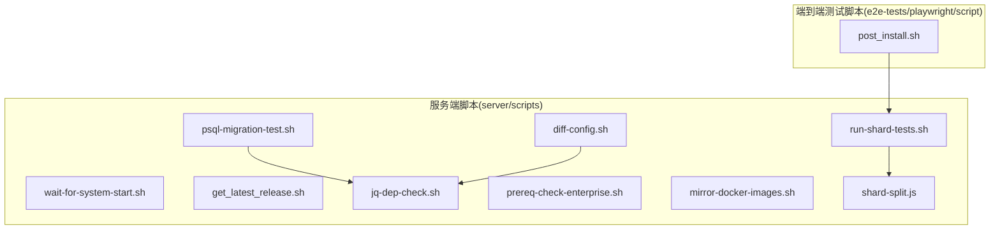
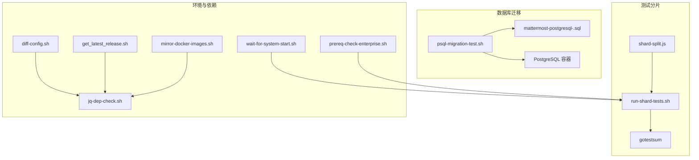
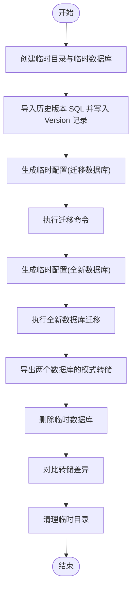
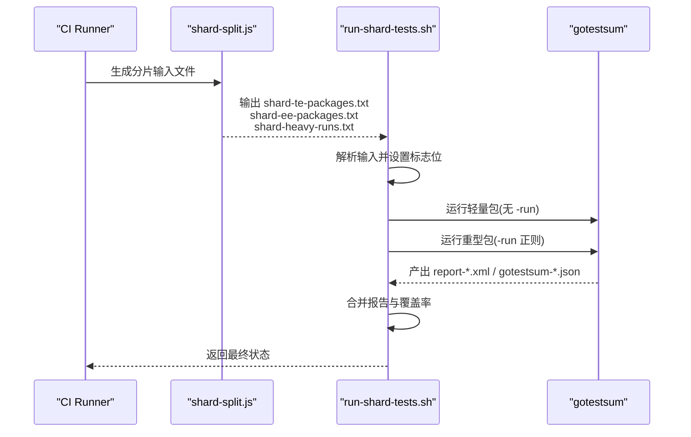
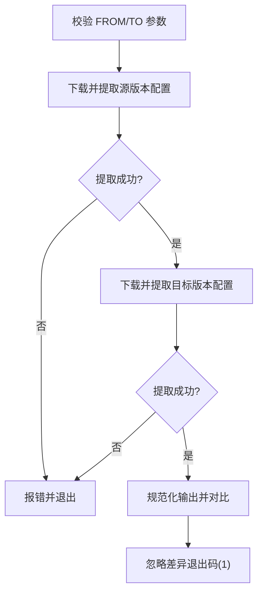
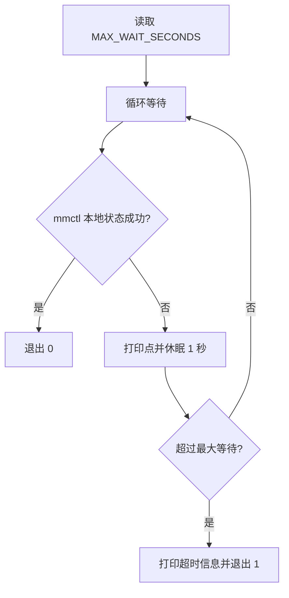
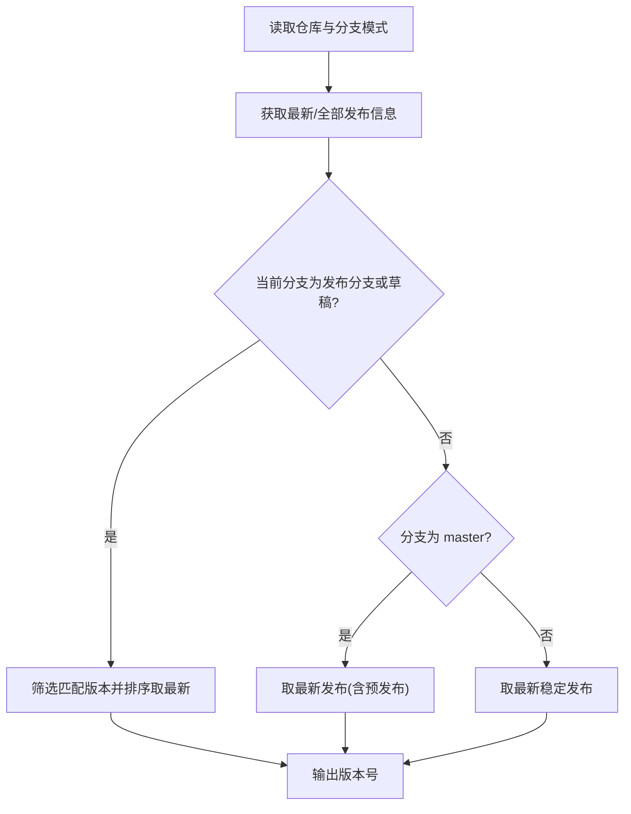
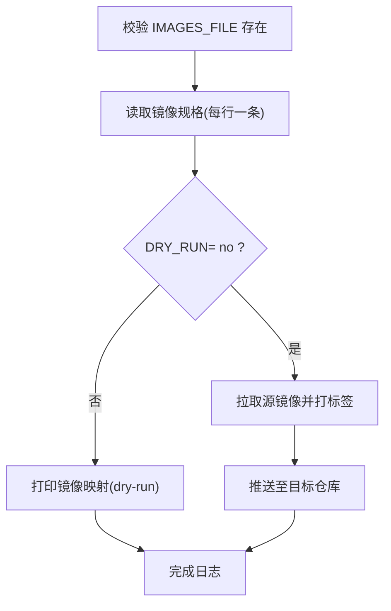
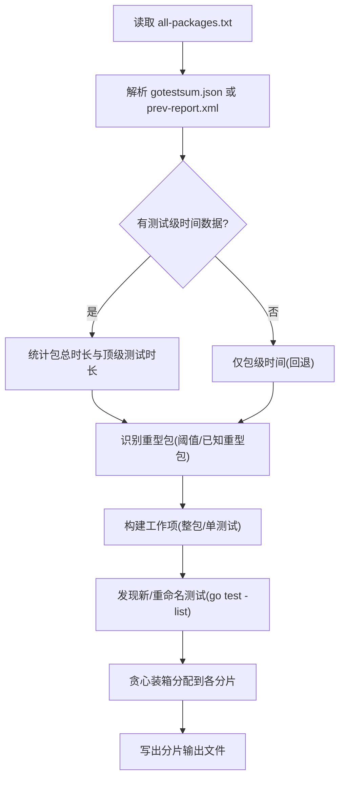
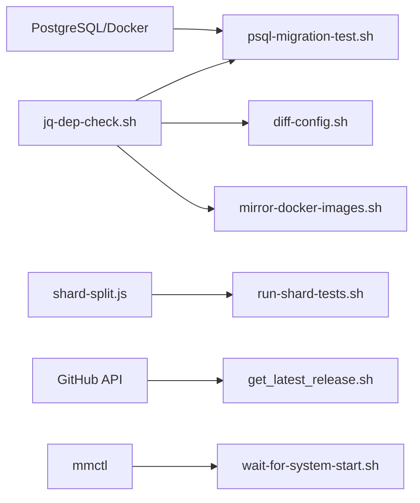

# 开发环境辅助脚本

<cite>
**本文档引用的文件**
- [psql-migration-test.sh](file://server/scripts/psql-migration-test.sh)
- [run-shard-tests.sh](file://server/scripts/run-shard-tests.sh)
- [diff-config.sh](file://server/scripts/diff-config.sh)
- [wait-for-system-start.sh](file://server/scripts/wait-for-system-start.sh)
- [get_latest_release.sh](file://server/scripts/get_latest_release.sh)
- [jq-dep-check.sh](file://server/scripts/jq-dep-check.sh)
- [prereq-check-enterprise.sh](file://server/scripts/prereq-check-enterprise.sh)
- [mirror-docker-images.sh](file://server/scripts/mirror-docker-images.sh)
- [shard-split.js](file://server/scripts/shard-split.js)
</cite>

## 目录
1. [简介](#简介)
2. [项目结构](#项目结构)
3. [核心组件](#核心组件)
4. [架构总览](#架构总览)
5. [详细组件分析](#详细组件分析)
6. [依赖关系分析](#依赖关系分析)
7. [性能考虑](#性能考虑)
8. [故障排除指南](#故障排除指南)
9. [结论](#结论)
10. [附录](#附录)

## 简介
本指南面向开发与测试工程师，系统化介绍 Mattermost 仓库中的开发环境辅助脚本，覆盖以下主题：
- 数据库迁移脚本：模式变更与数据迁移验证
- 测试数据准备脚本：模拟数据生成与测试环境初始化
- 环境配置脚本：开发环境搭建与依赖安装
- 性能测试脚本：分片测试运行与覆盖率合并
- 插件测试脚本：共享频道测试与插件兼容性测试
- 脚本自定义与扩展：参数配置与输出格式定制
- 多环境使用：本地开发、测试与生产环境实践

## 项目结构
开发环境辅助脚本主要位于 server/scripts 目录，配合 e2e-tests/playwright/script/post_install.sh 等脚本共同完成端到端测试前的准备。

图表来源
- [psql-migration-test.sh:1-60](file://server/scripts/psql-migration-test.sh#L1-L60)
- [run-shard-tests.sh:1-131](file://server/scripts/run-shard-tests.sh#L1-L131)
- [diff-config.sh:1-48](file://server/scripts/diff-config.sh#L1-L48)
- [wait-for-system-start.sh:1-20](file://server/scripts/wait-for-system-start.sh#L1-L20)
- [get_latest_release.sh:1-58](file://server/scripts/get_latest_release.sh#L1-L58)
- [jq-dep-check.sh:1-9](file://server/scripts/jq-dep-check.sh#L1-L9)
- [prereq-check-enterprise.sh:1-11](file://server/scripts/prereq-check-enterprise.sh#L1-L11)
- [mirror-docker-images.sh:1-35](file://server/scripts/mirror-docker-images.sh#L1-L35)
- [shard-split.js:1-295](file://server/scripts/shard-split.js#L1-L295)
- [post_install.sh](file://e2e-tests/playwright/script/post_install.sh)

章节来源
- [psql-migration-test.sh:1-60](file://server/scripts/psql-migration-test.sh#L1-L60)
- [run-shard-tests.sh:1-131](file://server/scripts/run-shard-tests.sh#L1-L131)
- [diff-config.sh:1-48](file://server/scripts/diff-config.sh#L1-L48)
- [wait-for-system-start.sh:1-20](file://server/scripts/wait-for-system-start.sh#L1-L20)
- [get_latest_release.sh:1-58](file://server/scripts/get_latest_release.sh#L1-L58)
- [jq-dep-check.sh:1-9](file://server/scripts/jq-dep-check.sh#L1-L9)
- [prereq-check-enterprise.sh:1-11](file://server/scripts/prereq-check-enterprise.sh#L1-L11)
- [mirror-docker-images.sh:1-35](file://server/scripts/mirror-docker-images.sh#L1-L35)
- [shard-split.js:1-295](file://server/scripts/shard-split.js#L1-L295)

## 核心组件
- 数据库迁移验证脚本：通过导入历史版本 SQL、执行迁移、对比迁移后与全新数据库的模式差异，确保迁移逻辑正确且可重复。
- 分片测试运行器：支持轻量包全量运行与重型包按测试用例正则分片，统一产出 JUnit/XML 报告与覆盖率文件，并进行结果合并。
- 配置差异比较：从官方发布包抓取指定版本配置，进行逐项对比，便于理解配置演进。
- 系统等待脚本：轮询 mmctl 本地状态，等待服务就绪，支持超时控制。
- 发布版本查询：根据当前分支与发布策略，查询最新或匹配的发布版本号。
- 依赖检查：校验 jq 命令可用性；企业版依赖检查（如 xmlsec1）。
- 镜像镜像推送：基于镜像规格文件批量拉取、打标签并推送至目标仓库，支持 dry-run。
- 分片分配算法：基于历史测试时间与启发式规则，对测试包进行“轻量整包”和“重型按测试拆分”的两阶段分片。

章节来源
- [psql-migration-test.sh:1-60](file://server/scripts/psql-migration-test.sh#L1-L60)
- [run-shard-tests.sh:1-131](file://server/scripts/run-shard-tests.sh#L1-L131)
- [diff-config.sh:1-48](file://server/scripts/diff-config.sh#L1-L48)
- [wait-for-system-start.sh:1-20](file://server/scripts/wait-for-system-start.sh#L1-L20)
- [get_latest_release.sh:1-58](file://server/scripts/get_latest_release.sh#L1-L58)
- [jq-dep-check.sh:1-9](file://server/scripts/jq-dep-check.sh#L1-L9)
- [prereq-check-enterprise.sh:1-11](file://server/scripts/prereq-check-enterprise.sh#L1-L11)
- [mirror-docker-images.sh:1-35](file://server/scripts/mirror-docker-images.sh#L1-L35)
- [shard-split.js:1-295](file://server/scripts/shard-split.js#L1-L295)

## 架构总览
下图展示脚本间的调用关系与职责分工：

图表来源
- [psql-migration-test.sh:1-60](file://server/scripts/psql-migration-test.sh#L1-L60)
- [run-shard-tests.sh:1-131](file://server/scripts/run-shard-tests.sh#L1-L131)
- [diff-config.sh:1-48](file://server/scripts/diff-config.sh#L1-L48)
- [wait-for-system-start.sh:1-20](file://server/scripts/wait-for-system-start.sh#L1-L20)
- [get_latest_release.sh:1-58](file://server/scripts/get_latest_release.sh#L1-L58)
- [jq-dep-check.sh:1-9](file://server/scripts/jq-dep-check.sh#L1-L9)
- [prereq-check-enterprise.sh:1-11](file://server/scripts/prereq-check-enterprise.sh#L1-L11)
- [mirror-docker-images.sh:1-35](file://server/scripts/mirror-docker-images.sh#L1-L35)
- [shard-split.js:1-295](file://server/scripts/shard-split.js#L1-L295)

## 详细组件分析

### 数据库迁移脚本：psql-migration-test.sh
用途
- 导入历史版本 SQL 到独立数据库
- 执行迁移命令
- 对比迁移后数据库与全新数据库的模式差异
- 支持特定版本的历史列兼容处理

关键流程
- 创建临时目录与临时数据库
- 从指定版本 SQL 导入并写入版本记录
- 动态生成临时配置并执行迁移
- 生成两个数据库的模式转储并对比差异
- 清理临时资源并返回退出码

图表来源
- [psql-migration-test.sh:1-60](file://server/scripts/psql-migration-test.sh#L1-L60)

章节来源
- [psql-migration-test.sh:1-60](file://server/scripts/psql-migration-test.sh#L1-L60)

### 测试分片运行器：run-shard-tests.sh
用途
- 在 CI 中对测试包进行多轮 gotestsum 运行
- 合并 JUnit XML 与 JSON 报告
- 可选开启竞态检测与覆盖率聚合
- 适配轻量包整包运行与重型包按测试正则分片

关键流程
- 读取分片输入文件（TE/EE 包、重型包正则）
- 统一设置报告文件名与覆盖率开关
- 按包列表与可选 -run 正则多次调用 gotestsum
- 合并所有报告与覆盖率文件

图表来源
- [run-shard-tests.sh:1-131](file://server/scripts/run-shard-tests.sh#L1-L131)
- [shard-split.js:1-295](file://server/scripts/shard-split.js#L1-L295)

章节来源
- [run-shard-tests.sh:1-131](file://server/scripts/run-shard-tests.sh#L1-L131)
- [shard-split.js:1-295](file://server/scripts/shard-split.js#L1-L295)

### 配置差异比较：diff-config.sh
用途
- 从官方发布包抓取指定版本的配置文件
- 使用 jq 规范化输出并进行对比
- 忽略仅表示差异的退出码以便于自动化

图表来源
- [diff-config.sh:1-48](file://server/scripts/diff-config.sh#L1-L48)

章节来源
- [diff-config.sh:1-48](file://server/scripts/diff-config.sh#L1-L48)

### 系统等待脚本：wait-for-system-start.sh
用途
- 通过 mmctl 本地状态探测服务是否就绪
- 支持可配置的最大等待秒数

图表来源
- [wait-for-system-start.sh:1-20](file://server/scripts/wait-for-system-start.sh#L1-L20)

章节来源
- [wait-for-system-start.sh:1-20](file://server/scripts/wait-for-system-start.sh#L1-L20)

### 发布版本查询：get_latest_release.sh
用途
- 根据当前分支与发布策略，查询最新或匹配的发布版本
- 支持使用 GITHUB_USERNAME/GITHUB_TOKEN 减少限流影响

图表来源
- [get_latest_release.sh:1-58](file://server/scripts/get_latest_release.sh#L1-L58)

章节来源
- [get_latest_release.sh:1-58](file://server/scripts/get_latest_release.sh#L1-L58)

### 依赖检查与前置条件
- jq 依赖检查：确保 jq 命令可用，否则提示安装方式并退出
- 企业版前置条件：检查 xmlsec1 是否存在，缺失则终止

章节来源
- [jq-dep-check.sh:1-9](file://server/scripts/jq-dep-check.sh#L1-L9)
- [prereq-check-enterprise.sh:1-11](file://server/scripts/prereq-check-enterprise.sh#L1-L11)

### 镜像镜像推送：mirror-docker-images.sh
用途
- 从镜像规格文件读取源镜像与目标映射
- 支持 dry-run 模式预览或实际执行拉取、打标签与推送

图表来源
- [mirror-docker-images.sh:1-35](file://server/scripts/mirror-docker-images.sh#L1-L35)

章节来源
- [mirror-docker-images.sh:1-35](file://server/scripts/mirror-docker-images.sh#L1-L35)

### 分片分配算法：shard-split.js
用途
- 基于历史测试时间与启发式规则，将测试包分为两类：
  - 轻量包：整包分配给某个分片
  - 重型包：按测试用例生成正则表达式，分散到各分片
- 当无历史数据时采用轮询回退策略

图表来源
- [shard-split.js:1-295](file://server/scripts/shard-split.js#L1-L295)

章节来源
- [shard-split.js:1-295](file://server/scripts/shard-split.js#L1-L295)

## 依赖关系分析
- 脚本内依赖
  - psql-migration-test.sh 依赖 jq-dep-check.sh 与 PostgreSQL 容器
  - diff-config.sh 依赖 jq-dep-check.sh 与网络访问
  - run-shard-tests.sh 依赖 shard-split.js 的输出与 gotestsum
  - mirror-docker-images.sh 依赖 jq 与 docker
- 外部依赖
  - GitHub Releases API（get_latest_release.sh）
  - PostgreSQL 与 Docker（迁移测试）
  - mmctl（wait-for-system-start.sh）

图表来源
- [psql-migration-test.sh:1-60](file://server/scripts/psql-migration-test.sh#L1-L60)
- [diff-config.sh:1-48](file://server/scripts/diff-config.sh#L1-L48)
- [jq-dep-check.sh:1-9](file://server/scripts/jq-dep-check.sh#L1-L9)
- [get_latest_release.sh:1-58](file://server/scripts/get_latest_release.sh#L1-L58)
- [run-shard-tests.sh:1-131](file://server/scripts/run-shard-tests.sh#L1-L131)
- [shard-split.js:1-295](file://server/scripts/shard-split.js#L1-L295)
- [wait-for-system-start.sh:1-20](file://server/scripts/wait-for-system-start.sh#L1-L20)

章节来源
- [psql-migration-test.sh:1-60](file://server/scripts/psql-migration-test.sh#L1-L60)
- [run-shard-tests.sh:1-131](file://server/scripts/run-shard-tests.sh#L1-L131)
- [diff-config.sh:1-48](file://server/scripts/diff-config.sh#L1-L48)
- [wait-for-system-start.sh:1-20](file://server/scripts/wait-for-system-start.sh#L1-L20)
- [get_latest_release.sh:1-58](file://server/scripts/get_latest_release.sh#L1-L58)
- [jq-dep-check.sh:1-9](file://server/scripts/jq-dep-check.sh#L1-L9)
- [prereq-check-enterprise.sh:1-11](file://server/scripts/prereq-check-enterprise.sh#L1-L11)
- [mirror-docker-images.sh:1-35](file://server/scripts/mirror-docker-images.sh#L1-L35)
- [shard-split.js:1-295](file://server/scripts/shard-split.js#L1-L295)

## 性能考虑
- 分片策略
  - 重型包按测试用例正则拆分，避免单一 runner 负载过高
  - 已知重型包强制拆分，减少数据库连接瓶颈
- 报告与覆盖率
  - 多次运行分别产出报告与覆盖率文件，最后统一合并，降低单次聚合成本
- 等待机制
  - wait-for-system-start.sh 提供超时控制，避免无限等待
- 迁移测试
  - 通过模式转储对比快速定位差异，减少全量数据比对开销

## 故障排除指南
常见问题与建议
- jq 不可用
  - 症状：脚本报错提示 jq 缺失
  - 处理：按照提示安装 jq 后重试
  - 参考：[jq-dep-check.sh:1-9](file://server/scripts/jq-dep-check.sh#L1-L9)
- 企业版依赖缺失
  - 症状：企业版前置检查失败
  - 处理：安装 xmlsec1 后重试
  - 参考：[prereq-check-enterprise.sh:1-11](file://server/scripts/prereq-check-enterprise.sh#L1-L11)
- 迁移测试差异
  - 症状：模式对比出现差异
  - 处理：检查历史版本 SQL 与迁移命令执行情况；必要时调整兼容处理逻辑
  - 参考：[psql-migration-test.sh:1-60](file://server/scripts/psql-migration-test.sh#L1-L60)
- 分片测试失败
  - 症状：gotestsum 多次运行失败
  - 处理：查看 report-*.xml 与 gotestsum-*.json，确认失败用例与覆盖率合并是否成功
  - 参考：[run-shard-tests.sh:1-131](file://server/scripts/run-shard-tests.sh#L1-L131)
- 等待超时
  - 症状：wait-for-system-start.sh 超时退出
  - 处理：增加 MAX_WAIT_SECONDS，检查 mmctl 与服务状态
  - 参考：[wait-for-system-start.sh:1-20](file://server/scripts/wait-for-system-start.sh#L1-L20)
- 镜像推送失败
  - 症状：镜像拉取/推送失败
  - 处理：检查 IMAGES_FILE 路径与权限；确认 DRY_RUN 设置；验证 Docker 登录状态
  - 参考：[mirror-docker-images.sh:1-35](file://server/scripts/mirror-docker-images.sh#L1-L35)

章节来源
- [jq-dep-check.sh:1-9](file://server/scripts/jq-dep-check.sh#L1-L9)
- [prereq-check-enterprise.sh:1-11](file://server/scripts/prereq-check-enterprise.sh#L1-L11)
- [psql-migration-test.sh:1-60](file://server/scripts/psql-migration-test.sh#L1-L60)
- [run-shard-tests.sh:1-131](file://server/scripts/run-shard-tests.sh#L1-L131)
- [wait-for-system-start.sh:1-20](file://server/scripts/wait-for-system-start.sh#L1-L20)
- [mirror-docker-images.sh:1-35](file://server/scripts/mirror-docker-images.sh#L1-L35)

## 结论
本指南系统梳理了 Mattermost 开发环境辅助脚本的功能与使用方法，涵盖数据库迁移验证、测试分片运行、配置对比、系统等待、发布查询、依赖检查与镜像推送等关键环节。结合分片分配算法与多轮运行合并机制，可在 CI 中高效稳定地完成大规模测试任务；通过迁移测试与配置对比，保障版本升级过程中的兼容性与一致性。

## 附录
- 多环境使用建议
  - 本地开发
    - 使用 wait-for-system-start.sh 确认服务就绪
    - 使用 diff-config.sh 对比配置变更
  - 测试环境
    - 使用 run-shard-tests.sh 与 shard-split.js 进行分片测试
    - 使用 psql-migration-test.sh 验证迁移
  - 生产环境
    - 使用 mirror-docker-images.sh 预热镜像
    - 使用 get_latest_release.sh 获取发布版本信息

- 自定义与扩展
  - 参数配置
    - MAX_WAIT_SECONDS：调整等待超时
    - RACE_MODE/ENABLE_COVERAGE：控制竞态检测与覆盖率
    - DRY_RUN：控制镜像推送的 dry-run 行为
  - 输出格式定制
    - gotestsum 报告格式与文件名由脚本内部设定，可通过环境变量 GOTESTSUM_FORMAT 调整
    - 分片输出文件由 shard-split.js 写出，可按需扩展