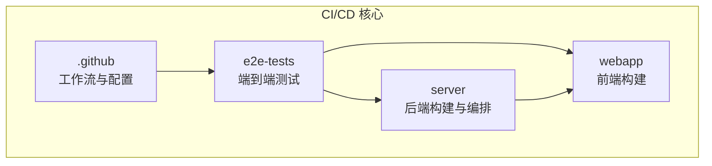
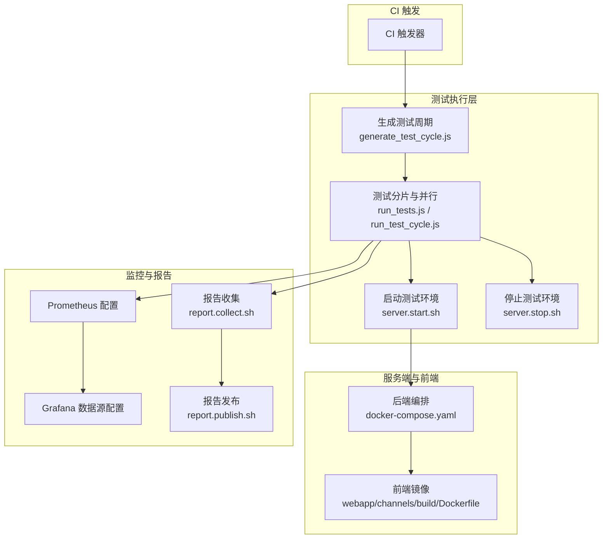
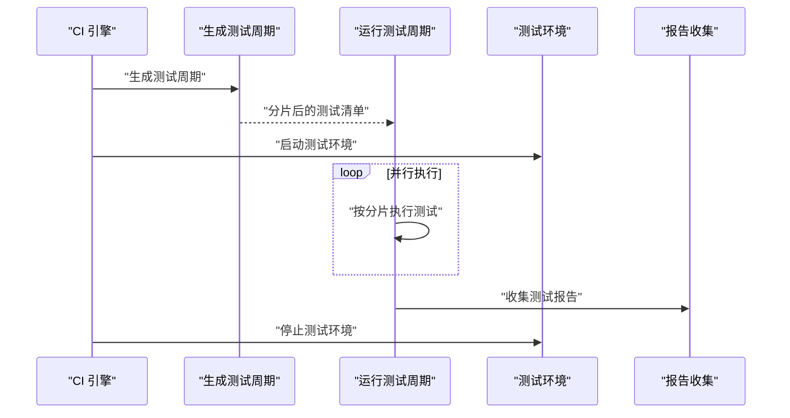
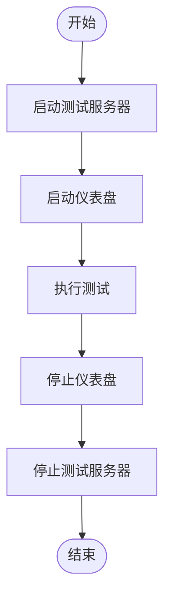
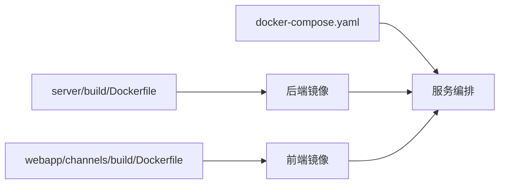
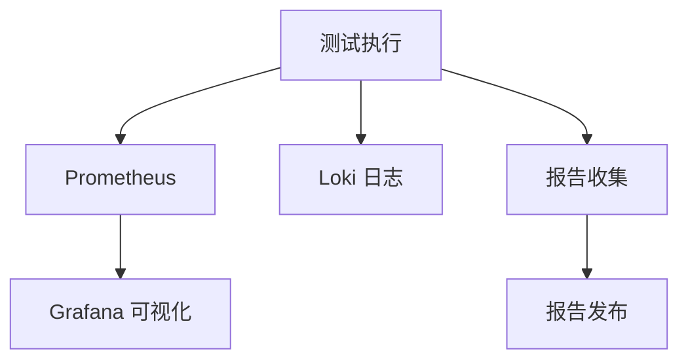
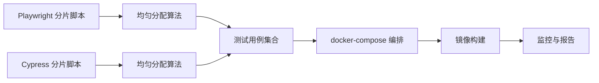

# 持续集成与部署工具

<cite>
**本文档引用的文件**
- [.github/e2e-tests-workflows.md](file://.github/e2e-tests-workflows.md)
- [.github/codecov.yml](file://.github/codecov.yml)
- [.github/dependabot.yml](file://.github/dependabot.yml)
- [e2e-tests/.ci/server.run_test.sh](file://e2e-tests/.ci/server.run_test.sh)
- [e2e-tests/.ci/server.run_cypress.sh](file://e2e-tests/.ci/server.run_cypress.sh)
- [e2e-tests/.ci/server.run_playwright.sh](file://e2e-tests/.ci/server.run_playwright.sh)
- [e2e-tests/.ci/server.start.sh](file://e2e-tests/.ci/server.start.sh)
- [e2e-tests/.ci/server.stop.sh](file://e2e-tests/.ci/server.stop.sh)
- [e2e-tests/.ci/dashboard.start.sh](file://e2e-tests/.ci/dashboard.start.sh)
- [e2e-tests/.ci/dashboard.stop.sh](file://e2e-tests/.ci/dashboard.stop.sh)
- [e2e-tests/.ci/report.collect.sh](file://e2e-tests/.ci/report.collect.sh)
- [e2e-tests/.ci/report.publish.sh](file://e2e-tests/.ci/report.publish.sh)
- [e2e-tests/playwright/run_tests.js](file://e2e-tests/playwright/run_tests.js)
- [e2e-tests/playwright/generate_test_cycle.js](file://e2e-tests/playwright/generate_test_cycle.js)
- [e2e-tests/playwright/utils/even_distribution.js](file://e2e-tests/playwright/utils/even_distribution.js)
- [e2e-tests/playwright/utils/test_cases.js](file://e2e-tests/playwright/utils/test_cases.js)
- [e2e-tests/cypress/run_test_cycle.js](file://e2e-tests/cypress/run_test_cycle.js)
- [e2e-tests/cypress/generate_test_cycle.js](file://e2e-tests/cypress/generate_test_cycle.js)
- [e2e-tests/cypress/utils/even_distribution.js](file://e2e-tests/cypress/utils/even_distribution.js)
- [e2e-tests/cypress/utils/test_cases.js](file://e2e-tests/cypress/utils/test_cases.js)
- [server/scripts/run-shard-tests.sh](file://server/scripts/run-shard-tests.sh)
- [server/scripts/shard-split.js](file://server/scripts/shard-split.js)
- [server/docker-compose.yaml](file://server/docker-compose.yaml)
- [server/build/docker-compose.common.yml](file://server/build/docker-compose.common.yml)
- [server/build/Dockerfile](file://server/build/Dockerfile)
- [server/build/Dockerfile.buildenv](file://server/build/Dockerfile.buildenv)
- [webapp/channels/build/Dockerfile](file://webapp/channels/build/Dockerfile)
- [server/build/docker-compose.yml](file://server/build/docker-compose.yml)
- [server/docker-compose.generated.yml](file://server/docker-compose.generated.yml)
- [server/build/docker/prometheus.yml](file://server/build/docker/prometheus.yml)
- [server/build/docker/grafana/provisioning/datasources/prometheus.yml](file://server/build/docker/grafana/provisioning/datasources/prometheus.yml)
- [server/build/docker/grafana/provisioning/datasources/loki.yml](file://server/build/docker/grafana/provisioning/datasources/loki.yml)
- [server/go.mod](file://server/go.mod)
- [webapp/package.json](file://webapp/package.json)
- [api/Makefile](file://api/Makefile)
- [server/Makefile](file://server/Makefile)
- [webapp/Makefile](file://webapp/Makefile)
- [e2e-tests/Makefile](file://e2e-tests/Makefile)
</cite>

## 目录
1. [简介](#简介)
2. [项目结构](#项目结构)
3. [核心组件](#核心组件)
4. [架构总览](#架构总览)
5. [详细组件分析](#详细组件分析)
6. [依赖关系分析](#依赖关系分析)
7. [性能考虑](#性能考虑)
8. [故障排除指南](#故障排除指南)
9. [结论](#结论)
10. [附录](#附录)

## 简介
本指南面向持续集成与部署（CI/CD）流程的使用者与维护者，系统性介绍本仓库中已实现的端到端测试流水线、测试分片与并行化策略、Docker 构建与本地编排、以及监控与报告机制。文档同时提供最佳实践建议与可定制化扩展思路，帮助团队在不同部署场景下快速落地高质量的自动化流水线。

## 项目结构
围绕 CI/CD 的关键目录与文件分布如下：
- GitHub 相关：工作流与配置位于 .github 目录，包含端到端测试工作流说明、覆盖率与依赖更新配置等。
- 端到端测试：e2e-tests 目录包含 Cypress 与 Playwright 的测试框架、分片与并行执行脚本、仪表盘与报告工具。
- 服务端构建：server 目录包含 Dockerfile、docker-compose 编排与 Prometheus/Grafana 监控配置。
- 前端构建：webapp 目录包含前端构建 Dockerfile 与多套构建配置。
- 脚本与工具：server/scripts 提供测试分片脚本；各模块 Makefile 提供统一构建入口。

**图表来源**
- [.github/e2e-tests-workflows.md](file://.github/e2e-tests-workflows.md)
- [e2e-tests/.ci/server.run_test.sh](file://e2e-tests/.ci/server.run_test.sh)
- [server/docker-compose.yaml](file://server/docker-compose.yaml)
- [webapp/channels/build/Dockerfile](file://webapp/channels/build/Dockerfile)

**章节来源**
- [.github/e2e-tests-workflows.md](file://.github/e2e-tests-workflows.md)
- [e2e-tests/Makefile](file://e2e-tests/Makefile)
- [server/Makefile](file://server/Makefile)
- [webapp/Makefile](file://webapp/Makefile)

## 核心组件
- 端到端测试执行器
  - Cypress 与 Playwright 双栈测试框架，支持分片与并行执行，通过生成测试周期与用例分布算法进行负载均衡。
- 测试环境管理
  - 提供一键启动/停止测试服务器与仪表盘的脚本，便于在 CI 中拉起最小可用环境。
- Docker 化构建与编排
  - 后端与前端分别提供 Dockerfile，配合 docker-compose 进行本地或 CI 环境编排。
- 监控与报告
  - Prometheus 与 Grafana 配置用于采集与可视化性能与日志类指标；报告收集与发布脚本用于输出测试结果。
- 覆盖率与依赖更新
  - Codecov 配置用于覆盖率上报；Dependabot 配置用于自动依赖升级。

**章节来源**
- [e2e-tests/.ci/server.start.sh](file://e2e-tests/.ci/server.start.sh)
- [e2e-tests/.ci/server.stop.sh](file://e2e-tests/.ci/server.stop.sh)
- [e2e-tests/.ci/dashboard.start.sh](file://e2e-tests/.ci/dashboard.start.sh)
- [e2e-tests/.ci/dashboard.stop.sh](file://e2e-tests/.ci/dashboard.stop.sh)
- [server/build/Dockerfile](file://server/build/Dockerfile)
- [webapp/channels/build/Dockerfile](file://webapp/channels/build/Dockerfile)
- [server/build/docker/prometheus.yml](file://server/build/docker/prometheus.yml)
- [server/build/docker/grafana/provisioning/datasources/prometheus.yml](file://server/build/docker/grafana/provisioning/datasources/prometheus.yml)
- [server/build/docker/grafana/provisioning/datasources/loki.yml](file://server/build/docker/grafana/provisioning/datasources/loki.yml)
- [.github/codecov.yml](file://.github/codecov.yml)
- [.github/dependabot.yml](file://.github/dependabot.yml)

## 架构总览
下图展示了从“测试执行”到“环境编排”再到“监控与报告”的完整链路：

**图表来源**
- [e2e-tests/playwright/generate_test_cycle.js](file://e2e-tests/playwright/generate_test_cycle.js)
- [e2e-tests/playwright/run_tests.js](file://e2e-tests/playwright/run_tests.js)
- [e2e-tests/cypress/generate_test_cycle.js](file://e2e-tests/cypress/generate_test_cycle.js)
- [e2e-tests/cypress/run_test_cycle.js](file://e2e-tests/cypress/run_test_cycle.js)
- [e2e-tests/.ci/server.start.sh](file://e2e-tests/.ci/server.start.sh)
- [e2e-tests/.ci/server.stop.sh](file://e2e-tests/.ci/server.stop.sh)
- [server/docker-compose.yaml](file://server/docker-compose.yaml)
- [webapp/channels/build/Dockerfile](file://webapp/channels/build/Dockerfile)
- [server/build/docker/prometheus.yml](file://server/build/docker/prometheus.yml)
- [server/build/docker/grafana/provisioning/datasources/prometheus.yml](file://server/build/docker/grafana/provisioning/datasources/prometheus.yml)
- [server/build/docker/grafana/provisioning/datasources/loki.yml](file://server/build/docker/grafana/provisioning/datasources/loki.yml)
- [e2e-tests/.ci/report.collect.sh](file://e2e-tests/.ci/report.collect.sh)
- [e2e-tests/.ci/report.publish.sh](file://e2e-tests/.ci/report.publish.sh)

## 详细组件分析

### 端到端测试执行与分片
- 分片与并行策略
  - Playwright 与 Cypress 均提供“生成测试周期”与“运行测试周期”的脚本，结合“均匀分配”算法将测试用例分发到多个执行实例，提升吞吐量。
  - 服务端还提供 Go 层的分片脚本与拆分工具，便于在后端测试中复用相同理念。
- 执行流程
  - 先生成测试周期，再按分片并发执行；失败时保留产物以便诊断。

**图表来源**
- [e2e-tests/playwright/generate_test_cycle.js](file://e2e-tests/playwright/generate_test_cycle.js)
- [e2e-tests/playwright/run_tests.js](file://e2e-tests/playwright/run_tests.js)
- [e2e-tests/cypress/generate_test_cycle.js](file://e2e-tests/cypress/generate_test_cycle.js)
- [e2e-tests/cypress/run_test_cycle.js](file://e2e-tests/cypress/run_test_cycle.js)
- [e2e-tests/.ci/server.start.sh](file://e2e-tests/.ci/server.start.sh)
- [e2e-tests/.ci/server.stop.sh](file://e2e-tests/.ci/server.stop.sh)
- [e2e-tests/.ci/report.collect.sh](file://e2e-tests/.ci/report.collect.sh)

**章节来源**
- [e2e-tests/playwright/utils/even_distribution.js](file://e2e-tests/playwright/utils/even_distribution.js)
- [e2e-tests/playwright/utils/test_cases.js](file://e2e-tests/playwright/utils/test_cases.js)
- [e2e-tests/cypress/utils/even_distribution.js](file://e2e-tests/cypress/utils/even_distribution.js)
- [e2e-tests/cypress/utils/test_cases.js](file://e2e-tests/cypress/utils/test_cases.js)
- [server/scripts/run-shard-tests.sh](file://server/scripts/run-shard-tests.sh)
- [server/scripts/shard-split.js](file://server/scripts/shard-split.js)

### 测试环境初始化与清理
- 初始化
  - 通过启动脚本拉起测试服务器与仪表盘，确保测试前的环境就绪。
- 清理
  - 通过停止脚本释放资源，避免 CI 环境污染。
- 仪表盘
  - 提供独立的仪表盘启动/停止脚本，便于在 CI 中可视化测试状态与进度。

**图表来源**
- [e2e-tests/.ci/server.start.sh](file://e2e-tests/.ci/server.start.sh)
- [e2e-tests/.ci/server.stop.sh](file://e2e-tests/.ci/server.stop.sh)
- [e2e-tests/.ci/dashboard.start.sh](file://e2e-tests/.ci/dashboard.start.sh)
- [e2e-tests/.ci/dashboard.stop.sh](file://e2e-tests/.ci/dashboard.stop.sh)

**章节来源**
- [e2e-tests/.ci/server.start.sh](file://e2e-tests/.ci/server.start.sh)
- [e2e-tests/.ci/server.stop.sh](file://e2e-tests/.ci/server.stop.sh)
- [e2e-tests/.ci/dashboard.start.sh](file://e2e-tests/.ci/dashboard.start.sh)
- [e2e-tests/.ci/dashboard.stop.sh](file://e2e-tests/.ci/dashboard.stop.sh)

### Docker 镜像构建与编排
- 后端镜像
  - 提供标准 Dockerfile 与构建环境专用 Dockerfile，满足不同构建阶段需求。
- 前端镜像
  - 提供前端构建 Dockerfile，便于在 CI 中统一构建前端产物。
- 编排
  - 使用 docker-compose 统一编排后端服务与数据库等依赖，支持生成式编排文件与通用编排文件。

**图表来源**
- [server/build/Dockerfile](file://server/build/Dockerfile)
- [server/build/Dockerfile.buildenv](file://server/build/Dockerfile.buildenv)
- [webapp/channels/build/Dockerfile](file://webapp/channels/build/Dockerfile)
- [server/docker-compose.yaml](file://server/docker-compose.yaml)

**章节来源**
- [server/build/Dockerfile](file://server/build/Dockerfile)
- [server/build/Dockerfile.buildenv](file://server/build/Dockerfile.buildenv)
- [webapp/channels/build/Dockerfile](file://webapp/channels/build/Dockerfile)
- [server/docker-compose.yaml](file://server/docker-compose.yaml)
- [server/docker-compose.generated.yml](file://server/docker-compose.generated.yml)
- [server/build/docker-compose.common.yml](file://server/build/docker-compose.common.yml)
- [server/build/docker-compose.yml](file://server/build/docker-compose.yml)

### 监控与报告
- 监控
  - Prometheus 与 Grafana 配置用于采集指标与日志类数据，便于在 CI 中观测性能与稳定性。
- 报告
  - 提供报告收集与发布的脚本，便于在 CI 中输出测试结果与工件。

**图表来源**
- [server/build/docker/prometheus.yml](file://server/build/docker/prometheus.yml)
- [server/build/docker/grafana/provisioning/datasources/prometheus.yml](file://server/build/docker/grafana/provisioning/datasources/prometheus.yml)
- [server/build/docker/grafana/provisioning/datasources/loki.yml](file://server/build/docker/grafana/provisioning/datasources/loki.yml)
- [e2e-tests/.ci/report.collect.sh](file://e2e-tests/.ci/report.collect.sh)
- [e2e-tests/.ci/report.publish.sh](file://e2e-tests/.ci/report.publish.sh)

**章节来源**
- [server/build/docker/prometheus.yml](file://server/build/docker/prometheus.yml)
- [server/build/docker/grafana/provisioning/datasources/prometheus.yml](file://server/build/docker/grafana/provisioning/datasources/prometheus.yml)
- [server/build/docker/grafana/provisioning/datasources/loki.yml](file://server/build/docker/grafana/provisioning/datasources/loki.yml)
- [e2e-tests/.ci/report.collect.sh](file://e2e-tests/.ci/report.collect.sh)
- [e2e-tests/.ci/report.publish.sh](file://e2e-tests/.ci/report.publish.sh)

## 依赖关系分析
- 测试框架与工具
  - Playwright 与 Cypress 的分片与并行脚本相互独立但遵循一致的分片思想；二者均依赖“均匀分配”算法与“测试用例集合”。
- 服务端与前端
  - 服务端通过 docker-compose 编排，前端镜像作为服务的一部分被统一管理。
- 监控与报告
  - 测试执行与监控/报告脚本解耦，便于在不同 CI 引擎中灵活组合。

**图表来源**
- [e2e-tests/playwright/utils/even_distribution.js](file://e2e-tests/playwright/utils/even_distribution.js)
- [e2e-tests/cypress/utils/even_distribution.js](file://e2e-tests/cypress/utils/even_distribution.js)
- [e2e-tests/playwright/utils/test_cases.js](file://e2e-tests/playwright/utils/test_cases.js)
- [e2e-tests/cypress/utils/test_cases.js](file://e2e-tests/cypress/utils/test_cases.js)
- [server/docker-compose.yaml](file://server/docker-compose.yaml)
- [server/build/Dockerfile](file://server/build/Dockerfile)
- [webapp/channels/build/Dockerfile](file://webapp/channels/build/Dockerfile)

**章节来源**
- [e2e-tests/playwright/utils/even_distribution.js](file://e2e-tests/playwright/utils/even_distribution.js)
- [e2e-tests/cypress/utils/even_distribution.js](file://e2e-tests/cypress/utils/even_distribution.js)
- [e2e-tests/playwright/utils/test_cases.js](file://e2e-tests/playwright/utils/test_cases.js)
- [e2e-tests/cypress/utils/test_cases.js](file://e2e-tests/cypress/utils/test_cases.js)
- [server/docker-compose.yaml](file://server/docker-compose.yaml)

## 性能考虑
- 分片与并行
  - 使用“均匀分配”算法减少热点用例导致的执行倾斜，提高整体吞吐。
- 缓存策略
  - 在 CI 中缓存依赖包与构建产物，缩短流水线时间；注意缓存失效策略与一致性。
- 资源隔离
  - 将测试环境与生产环境隔离，避免资源争抢；合理设置超时与重试。
- 监控前置
  - 在流水线早期引入监控探针，快速定位瓶颈。

## 故障排除指南
- 环境启动失败
  - 检查启动脚本与 docker-compose 文件，确认端口占用与依赖服务状态。
- 测试执行中断
  - 查看报告收集脚本输出，定位失败用例与日志；必要时降低并行度以复现问题。
- 监控无数据
  - 校验 Prometheus/Grafana 配置与容器连通性，确认指标暴露端点与抓取间隔。
- 覆盖率异常
  - 检查覆盖率配置文件与上传命令，确保产物路径与令牌正确。

**章节来源**
- [e2e-tests/.ci/server.start.sh](file://e2e-tests/.ci/server.start.sh)
- [e2e-tests/.ci/server.stop.sh](file://e2e-tests/.ci/server.stop.sh)
- [e2e-tests/.ci/report.collect.sh](file://e2e-tests/.ci/report.collect.sh)
- [e2e-tests/.ci/report.publish.sh](file://e2e-tests/.ci/report.publish.sh)
- [.github/codecov.yml](file://.github/codecov.yml)

## 结论
本仓库提供了完善的端到端测试自动化能力，覆盖了从测试分片、环境编排到监控与报告的全链路。通过统一的脚本与配置，团队可在不同 CI 引擎中快速复用并扩展该流水线，以满足多样化的部署与质量保障需求。

## 附录
- 最佳实践清单
  - 明确分片粒度与并行度上限，避免过度竞争。
  - 在流水线中加入健康检查与超时保护。
  - 使用缓存与增量构建减少重复工作。
  - 将监控与报告作为流水线的“第一公民”，尽早失败并输出诊断信息。
- 自定义扩展建议
  - 新增测试框架时，复用“生成测试周期→分片→并行执行→报告收集”的模式。
  - 针对不同环境（开发/预发/线上）调整 docker-compose 与编排参数。
  - 引入依赖扫描与安全检查，结合 Dependabot 自动化升级。