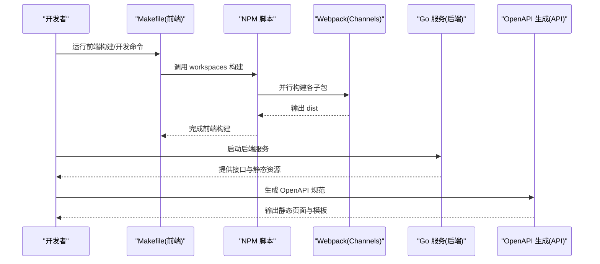
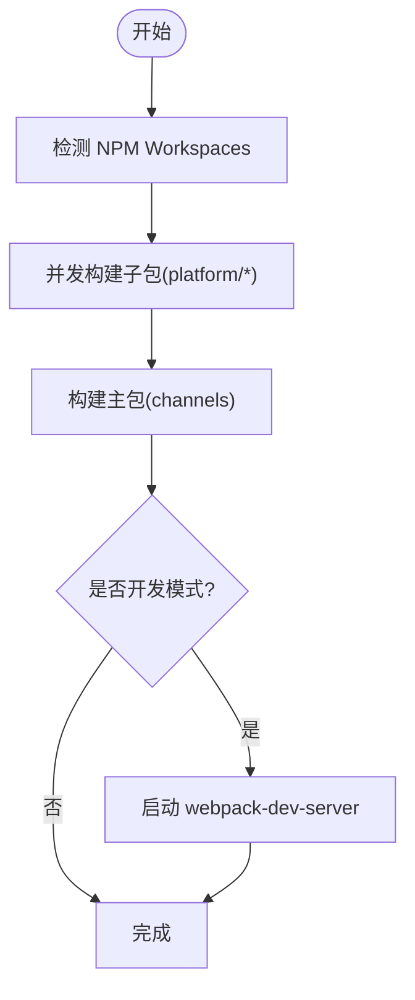
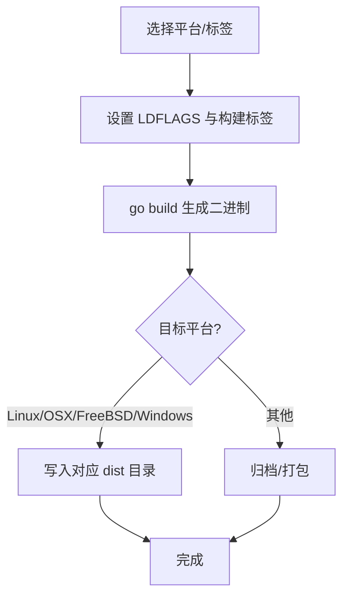
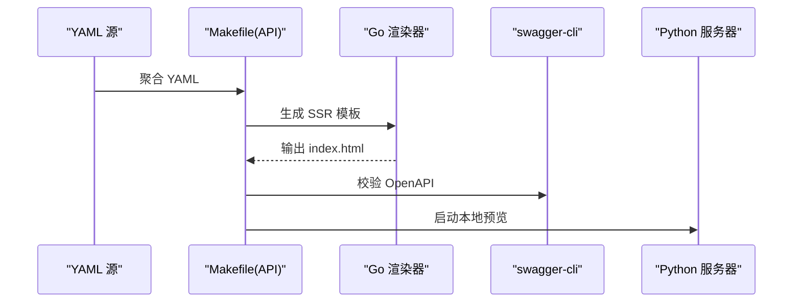
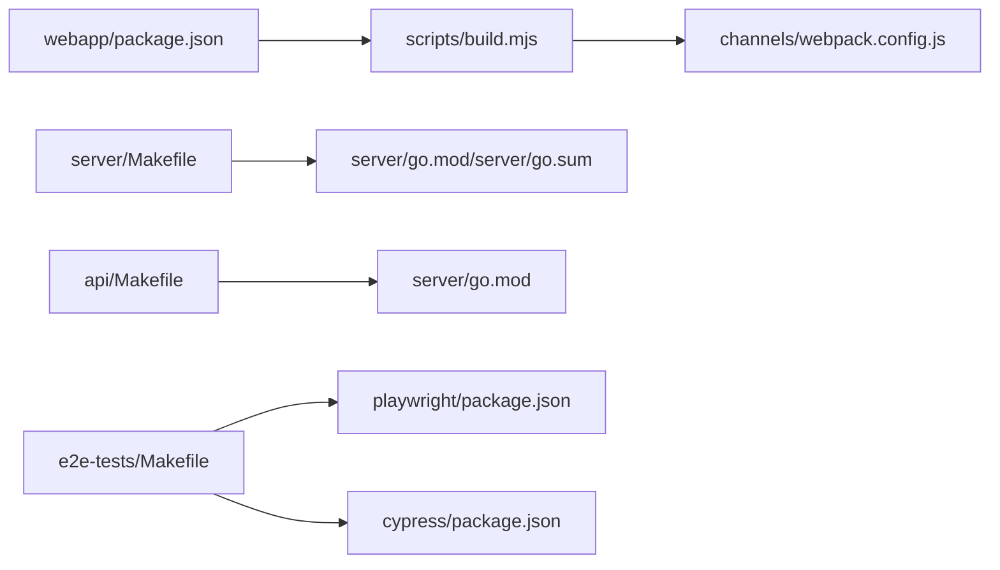

# 构建工具链

<cite>
**本文引用的文件**
- [api/Makefile](file://api/Makefile)
- [webapp/Makefile](file://webapp/Makefile)
- [e2e-tests/Makefile](file://e2e-tests/Makefile)
- [server/Makefile](file://server/Makefile)
- [webapp/package.json](file://webapp/package.json)
- [webapp/scripts/build.mjs](file://webapp/scripts/build.mjs)
- [webapp/channels/webpack.config.js](file://webapp/channels/webpack.config.js)
- [webapp/channels/babel.config.js](file://webapp/channels/babel.config.js)
- [server/go.mod](file://server/go.mod)
- [server/go.sum](file://server/go.sum)
- [api/go.mod](file://api/go.mod)
- [api/go.sum](file://api/go.sum)
- [e2e-tests/playwright/package.json](file://e2e-tests/playwright/package.json)
- [e2e-tests/cypress/package.json](file://e2e-tests/cypress/package.json)
</cite>

## 目录
1. [简介](#简介)
2. [项目结构](#项目结构)
3. [核心组件](#核心组件)
4. [架构总览](#架构总览)
5. [详细组件分析](#详细组件分析)
6. [依赖关系分析](#依赖关系分析)
7. [性能与优化](#性能与优化)
8. [故障排查指南](#故障排查指南)
9. [结论](#结论)
10. [附录](#附录)

## 简介
本指南面向需要在 Mattermost 代码库中高效构建与定制的工程师，系统讲解以下内容：
- Makefile 使用：构建目标、依赖管理、自动化任务与跨平台兼容性
- Webpack 配置与自定义：模块打包、代码分割、开发服务器与工作区并行构建
- Babel 转译配置：ES6+ 语法转译与插件化策略
- 前端构建流程：资源处理、压缩优化与缓存策略
- 后端构建流程：Go 模块管理与交叉编译
- 构建优化：增量构建、并行构建与缓存策略
- 自定义构建：按需扩展与适配特定环境

## 项目结构
仓库采用多模块并行的工程组织方式：
- 前端子工程位于 webapp，包含多工作区（channels、platform/*）与脚本驱动的构建流程
- 后端服务位于 server，通过 Makefile 统一管理 Go 构建、测试、容器与交叉编译
- API 规范生成位于 api，通过 Makefile 聚合 YAML 并生成静态页面
- E2E 测试位于 e2e-tests，提供 Playwright/Cypress 的测试与流水线脚本

```mermaid
graph TB
subgraph "前端"
WA["webapp<br/>多工作区与脚本"]
CH["channels<br/>Webpack 打包"]
PL["platform/*<br/>组件/类型/客户端"]
end
subgraph "后端"
SVR["server<br/>Go 服务与构建"]
MOD["go.mod/go.sum<br/>模块与依赖"]
end
subgraph "API"
API["api<br/>OpenAPI 规范生成"]
YAML["v4/html/static/*.yaml"]
end
subgraph "测试"
PW["e2e-tests/playwright"]
CY["e2e-tests/cypress"]
end
WA --> CH
WA --> PL
SVR --> MOD
API --> YAML
SVR --> WA
SVR --> API
PW --> SVR
CY --> SVR
```

图表来源
- [webapp/Makefile:1-114](file://webapp/Makefile#L1-L114)
- [server/Makefile:1-800](file://server/Makefile#L1-L800)
- [api/Makefile:1-98](file://api/Makefile#L1-L98)
- [e2e-tests/Makefile:1-57](file://e2e-tests/Makefile#L1-L57)

章节来源
- [webapp/Makefile:1-114](file://webapp/Makefile#L1-L114)
- [server/Makefile:1-800](file://server/Makefile#L1-L800)
- [api/Makefile:1-98](file://api/Makefile#L1-L98)
- [e2e-tests/Makefile:1-57](file://e2e-tests/Makefile#L1-L57)

## 核心组件
- Makefile 工程化：统一入口、条件判断、并行任务与跨平台兼容
- Webpack 工作区并行构建：channels 作为主包，platform 子包协同
- Babel 插件化：按需启用格式化、国际化等插件
- Go 模块与交叉编译：版本校验、标签注入、多平台产物
- E2E 测试流水线：生成、启动、运行与报告收集

章节来源
- [webapp/Makefile:1-114](file://webapp/Makefile#L1-L114)
- [server/Makefile:1-800](file://server/Makefile#L1-L800)
- [webapp/package.json:1-119](file://webapp/package.json#L1-L119)
- [webapp/scripts/build.mjs:1-49](file://webapp/scripts/build.mjs#L1-L49)

## 架构总览
下图展示从本地开发到产物产出的关键路径，涵盖前端构建、后端编译与 API 规范生成。



图表来源
- [webapp/Makefile:78-83](file://webapp/Makefile#L78-L83)
- [webapp/scripts/build.mjs:11-44](file://webapp/scripts/build.mjs#L11-L44)
- [server/Makefile:615-622](file://server/Makefile#L615-L622)
- [api/Makefile:12-76](file://api/Makefile#L12-L76)

## 详细组件分析

### Makefile 使用与自动化
- 前端 Makefile
  - 支持开发、测试、样式检查、类型检查、国际化提取、打包与清理等目标
  - 条件安装：CI 环境使用 npm ci，普通环境使用带 CPPFLAGS 的 npm install
  - 并行停止 webpack：跨平台终止开发进程
  - 包装 npm scripts，统一入口与帮助文档输出
- 后端 Makefile
  - 版本注入：构建号、日期、Git Hash、企业版标记
  - 企业版与 FIPS 开关：动态追加构建标签与产物命名
  - Docker 编排：一键启动依赖容器，支持 HA 与 pgvector
  - 测试矩阵：单测、竞态检测、Elastic/OpenSearch 专项测试
  - 交叉编译：Linux/OSX/FreeBSD/Windows 多平台产物目录
  - mmctl 构建：独立二进制与文档生成
- API Makefile
  - 聚合多源 YAML，生成最终 OpenAPI 文件
  - 调用 Go 程序渲染 SSR 模板，使用 swagger-cli 校验
  - 本地 HTTP 服务器预览
- E2E Makefile
  - 生成、启动、运行与停止测试环境
  - 报告采集与发布
  - Shell/NPM 格式化与检查

章节来源
- [webapp/Makefile:1-114](file://webapp/Makefile#L1-L114)
- [server/Makefile:1-800](file://server/Makefile#L1-L800)
- [api/Makefile:1-98](file://api/Makefile#L1-L98)
- [e2e-tests/Makefile:1-57](file://e2e-tests/Makefile#L1-L57)

### Webpack 配置与自定义
- 工作区并行构建
  - 通过 NPM workspaces 将 channels 与 platform/* 分包构建
  - 主构建脚本并发执行子包构建，最后再构建 channels 主包
- 开发服务器
  - 通过 npm run dev-server 启动 webpack-dev-server
  - 支持热更新与代理等开发特性
- 代码分割与产物
  - 由 Webpack 决定分包策略；channels 作为聚合入口
- 自定义建议
  - 在 channels/webpack.config.js 中调整入口、输出、loader 与插件
  - 如需按需拆分 vendor 与业务代码，可在 optimization.splitChunks 中配置
  - 若引入新语言或框架，结合 babel-loader 与对应 preset



图表来源
- [webapp/scripts/build.mjs:11-44](file://webapp/scripts/build.mjs#L11-L44)
- [webapp/package.json:8-24](file://webapp/package.json#L8-L24)

章节来源
- [webapp/scripts/build.mjs:1-49](file://webapp/scripts/build.mjs#L1-L49)
- [webapp/package.json:1-119](file://webapp/package.json#L1-L119)

### Babel 转译配置
- 预设与插件
  - @babel/preset-env/@preset-react/@preset-typescript 提供语法转译
  - babel-plugin-formatjs 用于国际化消息提取与转换
- 插件化策略
  - 可按需启用/禁用插件，避免对非必要场景的额外开销
  - 与 Webpack loader 协同，确保仅对源码进行转译
- 自定义建议
  - 在 channels/babel.config.js 中维护项目级配置
  - 如需 polyfill，结合 @babel/preset-env 的目标环境与 useBuiltIns 策略

章节来源
- [webapp/package.json:30-59](file://webapp/package.json#L30-L59)
- [webapp/channels/babel.config.js](file://webapp/channels/babel.config.js)

### 前端构建流程：资源处理、压缩与缓存
- 资源处理
  - CSS/SASS 通过 sass-loader/style-loader/css-loader 处理
  - 图片/字体等静态资源由 Webpack 默认处理或自定义 loader
- 压缩优化
  - 生产构建可配合 mini-css-extract-plugin 与压缩插件
  - 代码压缩由 Webpack 与 Babel 共同完成
- 缓存策略
  - 建议开启持久化缓存与长缓存命名策略
  - 对第三方依赖与业务代码进行分包，提升缓存命中率

章节来源
- [webapp/package.json:43-58](file://webapp/package.json#L43-L58)

### 后端构建流程：Go 模块与交叉编译
- 模块管理
  - server 与 api 目录均包含 go.mod/go.sum，确保依赖隔离
  - Makefile 中包含模块整理与版本校验逻辑
- 交叉编译
  - 通过 DIST_ROOT 与多平台输出目录实现多平台产物
  - 构建标签（如 enterprise、fips）影响产物与功能开关
- 版本注入
  - LDFLAGS 注入构建号、时间戳、Git Hash 等信息
- Docker 集成
  - 一键拉起数据库、对象存储等依赖容器
  - 支持 HA 与 pgvector 场景



图表来源
- [server/Makefile:124-128](file://server/Makefile#L124-L128)
- [server/Makefile:143-152](file://server/Makefile#L143-L152)
- [server/Makefile:615-622](file://server/Makefile#L615-L622)

章节来源
- [server/Makefile:1-800](file://server/Makefile#L1-L800)
- [server/go.mod](file://server/go.mod)
- [server/go.sum](file://server/go.sum)
- [api/go.mod](file://api/go.mod)
- [api/go.sum](file://api/go.sum)

### API 规范生成流程
- 数据聚合
  - 从 v4/source 与 playbooks 合并 YAML，生成最终 OpenAPI 文件
- 渲染与校验
  - 调用 Go 程序渲染 SSR 模板
  - 使用 swagger-cli 校验规范有效性
- 本地预览
  - Python 本地服务器预览生成的 HTML



图表来源
- [api/Makefile:12-76](file://api/Makefile#L12-L76)

章节来源
- [api/Makefile:1-98](file://api/Makefile#L1-L98)

### E2E 测试构建与运行
- 流水线
  - 生成测试环境 → 启动 → 运行 → 停止与清理
  - 报告采集与发布
- 工具链
  - Playwright 与 Cypress 的配置与脚本位于各自 package.json
  - Makefile 提供统一入口与辅助脚本

章节来源
- [e2e-tests/Makefile:1-57](file://e2e-tests/Makefile#L1-L57)
- [e2e-tests/playwright/package.json](file://e2e-tests/playwright/package.json)
- [e2e-tests/cypress/package.json](file://e2e-tests/cypress/package.json)

## 依赖关系分析
- 前端
  - webapp/package.json 管理工作区与依赖，channels 为聚合入口
  - scripts/build.mjs 并发构建 platform/* 子包，随后构建 channels
- 后端
  - server/Makefile 依赖 go.mod/go.sum，控制模块与交叉编译
  - 通过 LDFLAGS 注入构建信息，影响运行时行为
- API
  - api/Makefile 依赖 server/go.mod 生成静态页面
- E2E
  - e2e-tests/Makefile 与 Playwright/Cypress 配置共同构成测试体系



图表来源
- [webapp/package.json:109-119](file://webapp/package.json#L109-L119)
- [webapp/scripts/build.mjs:11-44](file://webapp/scripts/build.mjs#L11-L44)
- [server/Makefile:1-800](file://server/Makefile#L1-L800)
- [api/Makefile:1-98](file://api/Makefile#L1-L98)
- [e2e-tests/Makefile:1-57](file://e2e-tests/Makefile#L1-L57)

章节来源
- [webapp/package.json:1-119](file://webapp/package.json#L1-L119)
- [server/Makefile:1-800](file://server/Makefile#L1-L800)
- [api/Makefile:1-98](file://api/Makefile#L1-L98)
- [e2e-tests/Makefile:1-57](file://e2e-tests/Makefile#L1-L57)

## 性能与优化
- 增量构建
  - 前端：Webpack 支持增量编译与持久化缓存
  - 后端：利用 go build 的增量能力，减少全量编译时间
- 并行构建
  - 前端：scripts/build.mjs 并发执行子包构建
  - 后端：Makefile 目标可并行执行（视具体任务而定）
- 缓存策略
  - 前端：合理分包与长缓存命名，提升浏览器缓存命中
  - 后端：利用 GOFLAGS 与构建标签，减少重复链接成本
- 依赖管理
  - 使用 overrides 与锁定文件，保证依赖一致性
  - 定期执行模块整理与版本升级

## 故障排查指南
- 前端
  - 并行构建失败：查看 scripts/build.mjs 的错误返回码，定位失败子任务
  - 开发服务器无法停止：参考 webapp/Makefile 的跨平台终止逻辑
  - 样式/类型检查失败：使用对应 Makefile 目标（check-style、check-types）定位问题
- 后端
  - Go 版本不满足要求：执行版本校验目标，升级至最低版本
  - 交叉编译失败：确认目标平台与标签组合，检查 dist 目录权限
  - Docker 依赖未就绪：使用 start-docker 或 update-docker 初始化
- API
  - OpenAPI 校验失败：检查聚合后的 YAML 是否完整，重新运行生成流程
- E2E
  - 测试环境准备失败：检查所需 CLI 工具与脚本执行权限

章节来源
- [webapp/Makefile:25-36](file://webapp/Makefile#L25-L36)
- [webapp/scripts/build.mjs:23-26](file://webapp/scripts/build.mjs#L23-L26)
- [server/Makefile:601-610](file://server/Makefile#L601-L610)
- [api/Makefile:74-76](file://api/Makefile#L74-L76)
- [e2e-tests/Makefile:47-56](file://e2e-tests/Makefile#L47-L56)

## 结论
本指南基于仓库现有配置，系统阐述了前端与后端的构建工具链实践。通过 Makefile 的统一入口、Webpack 的工作区并行构建、Babel 的插件化转译以及 Go 的模块与交叉编译机制，能够高效支撑本地开发与持续集成。建议在实际项目中结合自身需求，按“自定义构建”章节进行扩展与优化。

## 附录
- 自定义构建配置要点
  - 前端
    - 在 channels/webpack.config.js 中细化分包与加载器
    - 在 channels/babel.config.js 中按需增减插件
    - 利用 webapp/Makefile 的 dist 与 package 目标生成可分发包
  - 后端
    - 在 server/Makefile 中新增自定义目标，复用 LDFLAGS 与构建标签
    - 通过 go.work 与模块管理，隔离企业版与团队版差异
  - API
    - 在 api/Makefile 中扩展 YAML 源与生成步骤
  - E2E
    - 在 e2e-tests/Makefile 中增加自定义流水线步骤与报告格式

章节来源
- [webapp/Makefile:78-109](file://webapp/Makefile#L78-L109)
- [webapp/channels/webpack.config.js](file://webapp/channels/webpack.config.js)
- [webapp/channels/babel.config.js](file://webapp/channels/babel.config.js)
- [server/Makefile:1-800](file://server/Makefile#L1-L800)
- [api/Makefile:1-98](file://api/Makefile#L1-L98)
- [e2e-tests/Makefile:1-57](file://e2e-tests/Makefile#L1-L57)