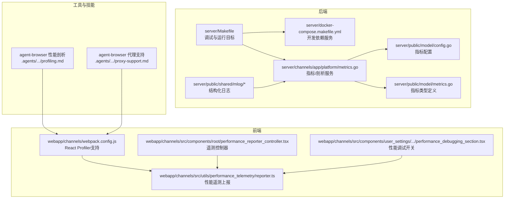
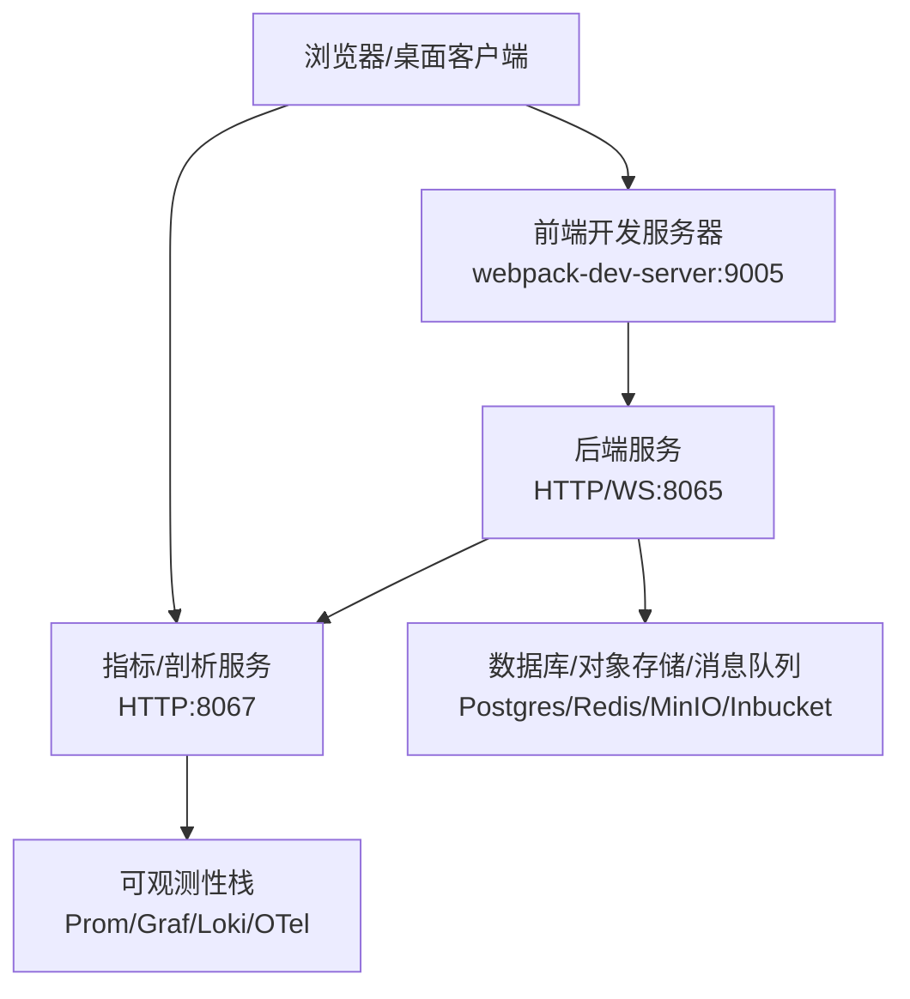
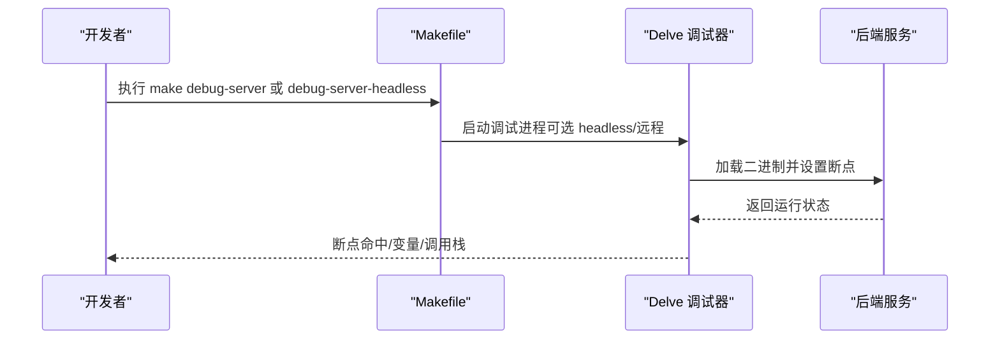
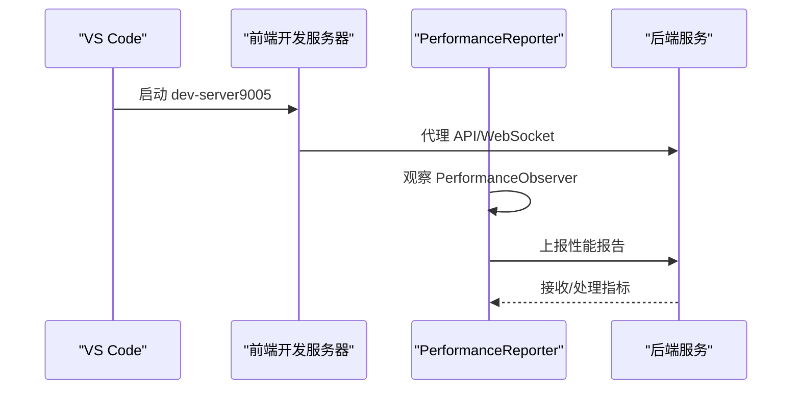
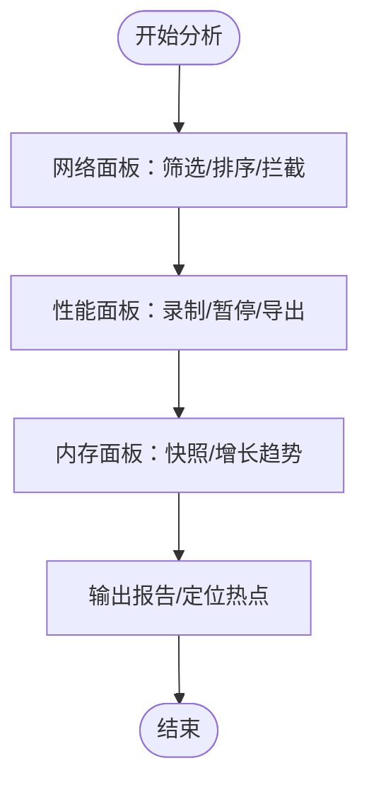
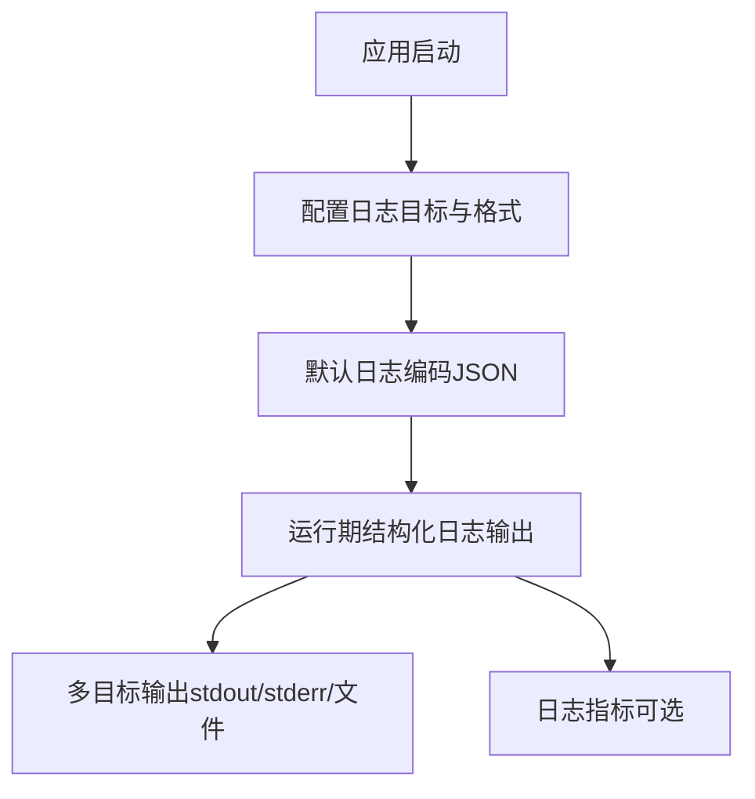
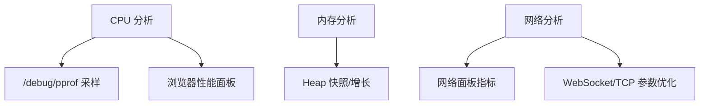
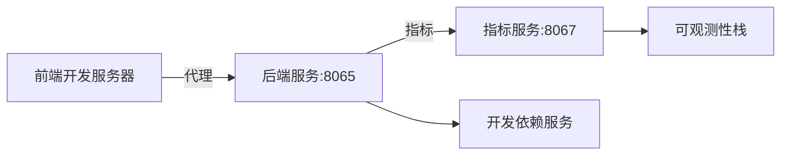

# 调试工具

<cite>
**本文引用的文件**
- [server/Makefile](file://server/Makefile)
- [server/docker-compose.makefile.yml](file://server/docker-compose.makefile.yml)
- [项目启动指南.md](file://项目启动指南.md)
- [.agents/skills/agent-browser/references/profiling.md](file://.agents/skills/agent-browser/references/profiling.md)
- [.agents/skills/agent-browser/references/proxy-support.md](file://.agents/skills/agent-browser/references/proxy-support.md)
- [webapp/channels/src/components/user_settings/advanced/performance_debugging_section/performance_debugging_section.tsx](file://webapp/channels/src/components/user_settings/advanced/performance_debugging_section/performance_debugging_section.tsx)
- [webapp/channels/src/components/root/performance_reporter_controller.tsx](file://webapp/channels/src/components/root/performance_reporter_controller.tsx)
- [webapp/channels/src/utils/performance_telemetry/reporter.ts](file://webapp/channels/src/utils/performance_telemetry/reporter.ts)
- [webapp/channels/webpack.config.js](file://webapp/channels/webpack.config.js)
- [server/channels/app/platform/web_conn.go](file://server/channels/app/platform/web_conn.go)
- [server/channels/app/server.go](file://server/channels/app/server.go)
- [server/public/shared/mlog/default.go](file://server/public/shared/mlog/default.go)
- [server/public/shared/mlog/metrics.go](file://server/public/shared/mlog/metrics.go)
- [server/public/model/config.go](file://server/public/model/config.go)
- [server/public/model/metrics.go](file://server/public/model/metrics.go)
- [server/channels/app/platform/metrics.go](file://server/channels/app/platform/metrics.go)
- [server/channels/app/platform/support_packet.go](file://server/channels/app/platform/support_packet.go)
- [tools/mattermost-govet/structuredLogging/structuredLogging.go](file://tools/mattermost-govet/structuredLogging/structuredLogging.go)
- [tools/mattermost-govet/structuredLogging/testdata/src/a/a.go](file://tools/mattermost-govet/structuredLogging/testdata/src/a/a.go)
- [tools/sharedchannel-test/main.go](file://tools/sharedchannel-test/main.go)
</cite>

## 目录
1. [简介](#简介)
2. [项目结构](#项目结构)
3. [核心组件](#核心组件)
4. [架构总览](#架构总览)
5. [详细组件分析](#详细组件分析)
6. [依赖关系分析](#依赖关系分析)
7. [性能考虑](#性能考虑)
8. [故障排查指南](#故障排查指南)
9. [结论](#结论)
10. [附录](#附录)

## 简介
本指南面向 Mattermost 开发与运维团队，系统讲解调试工具的使用方法，覆盖后端 Go 调试（Delve）、浏览器开发者工具（性能分析与内存检查）、VS Code 调试配置、网络抓包（Wireshark/Charles）、日志分析（结构化日志与错误追踪）、性能调试（CPU/内存/网络）以及远程与生产环境调试最佳实践。文档结合仓库内现有 Makefile、配置与源码，给出可操作步骤与可视化图示。

## 项目结构
围绕调试主题，仓库中与之相关的关键位置如下：
- 后端调试与运行：server/Makefile 提供 Delve 调试目标；docker-compose.makefile.yml 提供开发依赖服务（数据库、缓存、可观测性等）
- 前端调试与性能：webapp/channels/webpack.config.js 支持 React Profiler；性能遥测上报位于 webapp/channels/src/utils/performance_telemetry/reporter.ts
- 性能调试开关：webapp/channels/src/components/user_settings/advanced/performance_debugging_section/performance_debugging_section.tsx 提供前端性能调试开关
- 日志与指标：server/public/shared/mlog/* 结构化日志实现；server/public/model/metrics.go 定义指标类型；server/channels/app/platform/metrics.go 启动指标/剖析服务
- 浏览器自动化与性能剖析：.agents/skills/agent-browser/references/profiling.md
- 网络代理支持：.agents/skills/agent-browser/references/proxy-support.md

**图表来源**
- [server/Makefile:651-669](file://server/Makefile#L651-L669)
- [server/docker-compose.makefile.yml:1-129](file://server/docker-compose.makefile.yml#L1-L129)
- [server/channels/app/platform/metrics.go:102-152](file://server/channels/app/platform/metrics.go#L102-L152)
- [server/public/model/config.go:1185-1228](file://server/public/model/config.go#L1185-L1228)
- [server/public/model/metrics.go:33-160](file://server/public/model/metrics.go#L33-L160)
- [webapp/channels/webpack.config.js:517-531](file://webapp/channels/webpack.config.js#L517-L531)
- [.agents/skills/agent-browser/references/profiling.md:17-121](file://.agents/skills/agent-browser/references/profiling.md#L17-L121)
- [.agents/skills/agent-browser/references/proxy-support.md:103-170](file://.agents/skills/agent-browser/references/proxy-support.md#L103-L170)

**章节来源**
- [server/Makefile:651-669](file://server/Makefile#L651-L669)
- [server/docker-compose.makefile.yml:1-129](file://server/docker-compose.makefile.yml#L1-L129)
- [webapp/channels/webpack.config.js:517-531](file://webapp/channels/webpack.config.js#L517-L531)
- [webapp/channels/src/utils/performance_telemetry/reporter.ts:34-380](file://webapp/channels/src/utils/performance_telemetry/reporter.ts#L34-L380)
- [.agents/skills/agent-browser/references/profiling.md:17-121](file://.agents/skills/agent-browser/references/profiling.md#L17-L121)
- [.agents/skills/agent-browser/references/proxy-support.md:103-170](file://.agents/skills/agent-browser/references/proxy-support.md#L103-L170)

## 核心组件
- 后端 Delve 调试：通过 Makefile 的 debug-server 与 debug-server-headless 目标启动带 Delve 的后端进程，支持交互式断点与 IDE 远程调试
- 开发依赖服务：docker-compose.makefile.yml 提供 Postgres、Redis、MinIO、Inbucket、OpenLDAP、Elastic/OpenSearch、Prometheus/Grafana、Loki、OTel Collector 等
- 前端性能剖析：webpack.config.js 支持在生成生产代码时启用 React Profiler 并关闭最小化以提升剖析数据可用性
- 性能遥测上报：PerformanceReporter 将浏览器性能指标（如长任务、LCP、INP）与计数器打包上报至后端
- 结构化日志：mlog 提供 JSON 格式日志输出与指标集成，支持格式化选项与目标配置
- 指标与剖析服务：平台层启动独立 HTTP 服务暴露 /metrics 与 /debug/pprof，便于 CPU/阻塞/堆剖析
- 浏览器自动化与代理：agent-browser 技能提供性能剖析命令与代理支持，适用于自动化场景

**章节来源**
- [server/Makefile:651-669](file://server/Makefile#L651-L669)
- [server/docker-compose.makefile.yml:1-129](file://server/docker-compose.makefile.yml#L1-L129)
- [webapp/channels/webpack.config.js:517-531](file://webapp/channels/webpack.config.js#L517-L531)
- [webapp/channels/src/utils/performance_telemetry/reporter.ts:34-380](file://webapp/channels/src/utils/performance_telemetry/reporter.ts#L34-L380)
- [server/public/shared/mlog/default.go:13-40](file://server/public/shared/mlog/default.go#L13-L40)
- [server/channels/app/platform/metrics.go:102-152](file://server/channels/app/platform/metrics.go#L102-L152)

## 架构总览
下图展示从浏览器到后端的调试与观测路径，包括前端性能遥测、后端指标/剖析服务、以及开发依赖服务。

**图表来源**
- [项目启动指南.md:30-32](file://项目启动指南.md#L30-L32)
- [server/docker-compose.makefile.yml:1-129](file://server/docker-compose.makefile.yml#L1-L129)
- [server/channels/app/platform/metrics.go:102-152](file://server/channels/app/platform/metrics.go#L102-L152)

## 详细组件分析

### 后端调试（Go/Delve）
- 使用 Makefile 目标启动 Delve：
  - 交互式调试：debug-server
  - IDE 远程调试（如 VSCode/IntelliJ）：debug-server-headless，默认监听 2345 端口
- 构建参数包含版本信息注入与标签传递，确保调试二进制与发布一致
- 建议在 VSCode 中配置 launch.json，连接到 headless 模式进行断点调试

**图表来源**
- [server/Makefile:651-669](file://server/Makefile#L651-L669)

**章节来源**
- [server/Makefile:651-669](file://server/Makefile#L651-L669)

### 前端调试与性能剖析（VS Code + 浏览器）
- VS Code 调试建议：
  - 使用后端 headless 调试目标（:2345），前端通过 webpack-dev-server 代理到后端
  - 前端热更新与断点调试配合后端断点，形成完整联调体验
- React Profiler：
  - 通过环境变量开启生产代码下的 Profiler 支持，并禁用最小化以获得更清晰的剖析数据
- 性能遥测：
  - PerformanceReporter 订阅浏览器性能 API，收集长任务、LCP、INP 等指标并上报
  - 控制器组件在根节点初始化并持续观察

**图表来源**
- [webapp/channels/webpack.config.js:517-531](file://webapp/channels/webpack.config.js#L517-L531)
- [webapp/channels/src/utils/performance_telemetry/reporter.ts:34-380](file://webapp/channels/src/utils/performance_telemetry/reporter.ts#L34-L380)
- [webapp/channels/src/components/root/performance_reporter_controller.tsx:14-31](file://webapp/channels/src/components/root/performance_reporter_controller.tsx#L14-L31)

**章节来源**
- [webapp/channels/webpack.config.js:517-531](file://webapp/channels/webpack.config.js#L517-L531)
- [webapp/channels/src/utils/performance_telemetry/reporter.ts:34-380](file://webapp/channels/src/utils/performance_telemetry/reporter.ts#L34-L380)
- [webapp/channels/src/components/root/performance_reporter_controller.tsx:14-31](file://webapp/channels/src/components/root/performance_reporter_controller.tsx#L14-L31)

### 浏览器开发者工具（网络面板、性能分析、内存检查）
- 网络面板：定位慢请求、重定向、缓存命中与错误
- 性能分析：录制交互或页面加载，结合 agent-browser 的性能剖析命令进行对比
- 内存检查：Heap Snapshot 与 Allocation instrumentation 定位泄漏

[此图为概念性流程，不对应具体源码文件]

### 网络抓包工具（Wireshark/Charles）
- Wireshark：捕获 TCP/UDP 层面的流量，适合排查协议细节与异常丢包
- Charles：HTTP/HTTPS 代理，便于查看请求头、响应体与证书链，支持断点与重放
- 代理支持：agent-browser 提供代理配置与轮询代理示例，可用于规避限流与内网访问

**章节来源**
- [.agents/skills/agent-browser/references/proxy-support.md:103-170](file://.agents/skills/agent-browser/references/proxy-support.md#L103-L170)

### 日志分析（结构化日志与错误追踪）
- 结构化日志：
  - mlog 默认实现输出 JSON，字段包含 level、msg、fields
  - 支持格式化选项与多目标（控制台/文件）
- 错误追踪：
  - 启动阶段打印工作目录与配置来源
  - 审计与许可证特性影响日志目标与指标启用
- 结构化日志校验：
  - golangci 工具链内置规则，禁止在 mlog 调用中使用 fmt.Sprintf/Sprint，强制使用结构化字段

**图表来源**
- [server/public/shared/mlog/default.go:13-40](file://server/public/shared/mlog/default.go#L13-L40)
- [server/channels/app/server.go:488-528](file://server/channels/app/server.go#L488-L528)
- [tools/mattermost-govet/structuredLogging/structuredLogging.go:12-66](file://tools/mattermost-govet/structuredLogging/structuredLogging.go#L12-L66)

**章节来源**
- [server/public/shared/mlog/default.go:13-40](file://server/public/shared/mlog/default.go#L13-L40)
- [server/channels/app/server.go:488-528](file://server/channels/app/server.go#L488-L528)
- [tools/mattermost-govet/structuredLogging/structuredLogging.go:12-66](file://tools/mattermost-govet/structuredLogging/structuredLogging.go#L12-L66)
- [tools/mattermost-govet/structuredLogging/testdata/src/a/a.go:37-58](file://tools/mattermost-govet/structuredLogging/testdata/src/a/a.go#L37-L58)

### 性能调试技巧（CPU/内存/网络）
- CPU 分析：
  - 启用 /debug/pprof，采集 goroutine/block/trace/profile 数据
  - 结合浏览器性能面板与前端 Profiler，定位热点函数与渲染瓶颈
- 内存泄漏检测：
  - Heap 快照对比与分配轨迹，关注未释放的大对象与长生命周期集合
  - 后端可通过指标服务观察内存相关指标（若启用）
- 网络性能监控：
  - 使用浏览器网络面板与后端指标（请求耗时、并发、错误率）
  - WebSocket/TCP 参数优化（如禁用 Nagle 提升吞吐）

**图表来源**
- [server/channels/app/platform/metrics.go:102-152](file://server/channels/app/platform/metrics.go#L102-L152)
- [server/channels/app/platform/web_conn.go:210-223](file://server/channels/app/platform/web_conn.go#L210-L223)

**章节来源**
- [server/channels/app/platform/metrics.go:102-152](file://server/channels/app/platform/metrics.go#L102-L152)
- [server/channels/app/platform/web_conn.go:210-223](file://server/channels/app/platform/web_conn.go#L210-L223)

### 远程调试与生产环境调试最佳实践
- 远程调试：
  - 使用 headless Delve（:2345）与 IDE 连接，避免交互式终端限制
  - 仅在受控环境启用，注意安全与性能影响
- 生产环境调试：
  - 通过指标服务（:8067）与日志目标（结构化 JSON）进行非侵入式观测
  - 使用支持包（support packet）收集诊断信息，避免直接修改运行中的实例
  - 严格区分功能开关与性能开关，避免对用户造成干扰

**章节来源**
- [server/Makefile:661-669](file://server/Makefile#L661-L669)
- [server/channels/app/platform/support_packet.go:1-42](file://server/channels/app/platform/support_packet.go#L1-L42)
- [server/public/model/config.go:1185-1228](file://server/public/model/config.go#L1185-L1228)

## 依赖关系分析
- 后端依赖开发依赖服务（Postgres、Redis、MinIO、Inbucket、OpenLDAP、Elastic/OpenSearch、Prom/Graf/Loki/OTel）
- 指标与剖析服务独立于主业务端口，通过独立监听地址暴露
- 前端通过 webpack-dev-server 代理到后端，便于联调与热更新

**图表来源**
- [server/docker-compose.makefile.yml:1-129](file://server/docker-compose.makefile.yml#L1-L129)
- [server/channels/app/platform/metrics.go:102-152](file://server/channels/app/platform/metrics.go#L102-L152)

**章节来源**
- [server/docker-compose.makefile.yml:1-129](file://server/docker-compose.makefile.yml#L1-L129)
- [server/channels/app/platform/metrics.go:102-152](file://server/channels/app/platform/metrics.go#L102-L152)

## 性能考虑
- 前端 Profiler 在生产构建中可通过环境变量启用，但需禁用最小化以保证剖析数据可读性
- 后端剖析服务默认关闭，需在配置中开启监听地址与剖析参数
- WebSocket/TCP 层面的延迟与吞吐可通过参数调整与网络面板共同评估

[本节为通用指导，不直接分析具体文件]

## 故障排查指南
- 启动与联调：
  - 确认后端 8065 与前端 9005 正常运行，代理配置正确
  - 若仅启动前端而未启动后端，页面无法完成登录与接口调用
- 日志与指标：
  - 检查结构化日志输出是否为 JSON，必要时调整格式化选项
  - 确认指标服务端口与权限，验证 /metrics 与 /debug/pprof 可达
- 结构化日志违规：
  - golangci 工具链会报告在 mlog 调用中使用 fmt 的问题，应改为结构化字段

**章节来源**
- [项目启动指南.md:247-255](file://项目启动指南.md#L247-L255)
- [server/public/shared/mlog/default.go:13-40](file://server/public/shared/mlog/default.go#L13-L40)
- [tools/mattermost-govet/structuredLogging/structuredLogging.go:12-66](file://tools/mattermost-govet/structuredLogging/structuredLogging.go#L12-L66)

## 结论
通过结合 Delve 后端调试、浏览器开发者工具、Webpack Profiler、结构化日志与指标/剖析服务，以及 agent-browser 的性能剖析与代理能力，可以在本地与生产环境中高效地定位性能瓶颈与问题根因。建议在开发阶段统一使用上述工具链，形成标准化的调试与观测流程。

[本节为总结性内容，不直接分析具体文件]

## 附录
- 启动与联调参考：项目启动指南.md
- 性能剖析参考：agent-browser 性能剖析文档
- 代理支持参考：agent-browser 代理支持文档

**章节来源**
- [项目启动指南.md:1-255](file://项目启动指南.md#L1-L255)
- [.agents/skills/agent-browser/references/profiling.md:17-121](file://.agents/skills/agent-browser/references/profiling.md#L17-L121)
- [.agents/skills/agent-browser/references/proxy-support.md:103-170](file://.agents/skills/agent-browser/references/proxy-support.md#L103-L170)